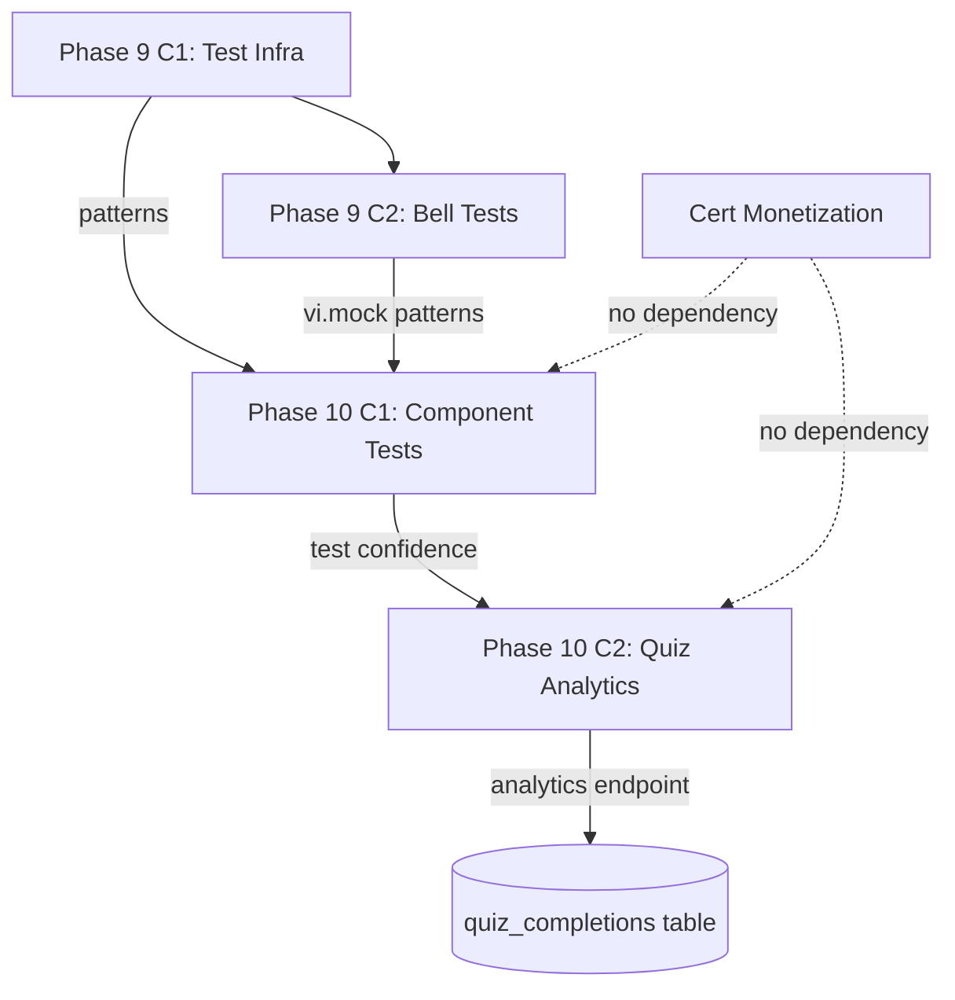

# Phase 9 Release Closeout + Phase 10 Spec Kickoff

**Date:** 2026-08-04

---

## Phase 9 Release Closeout

### Shipped Features

| Phase | Feature | Tests Added | Commit | Tag |
|-------|---------|-------------|--------|-----|
| C1 | vitest + RTL + jsdom infrastructure | 17 | `b6d0058` | `phase9-c1-complete-2026-08-04` |
| C1 | StatusBadge shared component extraction | — | `b6d0058` | — |
| C1 | EngagementStats tests (5 cases) | 5 | `b6d0058` | — |
| C1 | OnboardingChecklist tests (5 cases) | 5 | `b6d0058` | — |
| C1 | StatusBadge + fmtSize tests (7 cases) | 7 | `b6d0058` | — |
| C2 | NotificationBell tests (8 cases) | 8 | `782eb91` | `phase9-c2-complete-2026-08-04` |

**Total frontend tests: 25/25 PASS**
**Backend tests: 448/448 PASS (unchanged)**
**Production code changes: StatusBadge extraction only (behavior-identical refactor)**

### Verification Summary (Both Phases)

| Gate | C1 | C2 |
|------|----|----|
| Frontend tsc | PASS | PASS |
| Frontend vitest | 17/17 | 25/25 |
| Backend vitest | 448/448 | 448/448 |
| Vite build | PASS | PASS |
| Docker build | PASS | PASS |
| HTTP 200 | PASS | PASS |
| Health 200 | PASS | PASS |

### Rollback Note

- C1: `git revert b6d0058` (removes test infra + StatusBadge extraction)
- C2: `git revert 782eb91` (removes NotificationBell tests only)
- Both reverts are safe — test-only changes (except StatusBadge refactor in C1)

### Manual QA Status

Not performed. Both phases are test-only with zero functional changes.

### New Test Patterns Established

| Pattern | Introduced In | Used For |
|---------|--------------|----------|
| Factory helpers (`makeSub`, `makeQuiz`) | C1 | Test data construction |
| `screen.getByText` / `queryByText` | C1 | DOM assertions |
| `userEvent.setup()` + click | C1 | User interaction |
| `localStorage.setItem` / `.getItem` | C1 | Side effect testing |
| `vi.mock('service')` | C2 | Service module mocking |
| `vi.mock('react-router-dom')` partial | C2 | Router mocking |
| `vi.useFakeTimers()` + `advanceTimersByTime` | C2 | Interval testing |
| `fireEvent.mouseDown(document.body)` | C2 | Outside-click simulation |

---

## Phase 10 Spec Kickoff

### Context

Phase 9 established frontend test infrastructure and demonstrated patterns across 4 component types. Phase 10 continues expanding coverage to the two most complex remaining interactive components: AnnouncementsPanel (395 lines, CRUD + modal + validation) and InlineQuizTaker (255 lines, state machine + API + quiz flow).

### Scope

- **C1:** Component tests expansion — AnnouncementsPanel + InlineQuizTaker
- **C2:** Quiz analytics dashboard (deferred — requires backend + frontend)
- **Deferred:** Certificate monetization (Phase 11+)

### Non-Goals

- No backend changes
- No feature additions
- No UI changes
- No quiz analytics yet (that's C2)
- No payment integration

---

## Candidate Ranking

| Rank | Candidate | Value | Risk | Effort | Recommendation |
|------|-----------|-------|------|--------|----------------|
| 1 | **Component tests expansion** | HIGH | LOW | LOW-MED | **C1 — DO NOW** |
| 2 | Quiz analytics dashboard | MEDIUM | MEDIUM | MEDIUM | C2 — after C1 |
| 3 | Certificate monetization | HIGH | HIGH | HIGH | Phase 11+ |

**Rationale:** Component tests continue the Phase 9 momentum with zero production risk. They exercise all established mocking patterns on two components with significantly more complexity (CRUD operations, state machines, form validation, modal lifecycle). This builds the team's confidence in the test suite before Phase 10 C2 introduces new backend code.

---

## Dependency Map



### Shared Systems

| System | Used by C1? | Modified by C1? |
|--------|-------------|-----------------|
| vitest.config.ts | Yes (read-only) | No |
| setup.ts | Yes (read-only) | No |
| announcementService.ts | Yes (mocked) | No |
| quizService.ts | Yes (mocked) | No |
| courseService.ts | Yes (mocked) | No |
| useAuth context | Yes (mocked) | No |

---

## Test Strategy

### Acceptance Criteria

1. `npx vitest run` passes with **43/43 tests** (25 existing + ~18 new)
2. `npx tsc --noEmit` clean
3. Backend 448/448 unchanged
4. Vite build + Docker build pass
5. No production code changes

### Regression Coverage

- All 25 existing tests must continue passing
- All 448 backend tests must be unchanged

### Manual QA

Not required — test-only changes with zero production impact.

---

## Risk Note

**Key assumptions:**
1. `vi.mock` works for `announcementService`, `quizService`, `courseService` (same pattern as NotificationBell)
2. `vi.mock('../../context/useAuth')` can provide a mock user for InlineQuizTaker
3. `window.confirm` can be mocked with `vi.spyOn(window, 'confirm')` for delete confirmation
4. AnnouncementsPanel's modal backdrop click can be tested with `fireEvent.click`

**Potential coupling risks:**
- None. Test-only commit, no production code changes.

---

## Handoff Note

**From Phase 9 (released):**
- 25 frontend tests across 4 components
- Mocking patterns established: `vi.mock`, `vi.useFakeTimers`, `fireEvent`, `userEvent`
- vitest 4.1.10, RTL 16.3.2, jsdom 29.1.1

**To Phase 10 C1:**
- Add 2 test files: AnnouncementsPanel.test.tsx + InlineQuizTaker.test.tsx
- New patterns: `vi.spyOn(window, 'confirm')`, multi-service mocking, state machine testing
- Target: 43 total frontend tests

---

## /loop Workflow

```
/loop assess   — Verify Phase 9 baseline: 25/25 frontend, 448/448 backend, tsc clean
/loop plan     — Write Phase 10 C1 implementation plan from spec
/loop review   — Post-implementation: run 7 verification gates, confirm 43/43
/loop defer    — If blockers found, document and defer
```

---

## Final Recommendation

### PHASE 10 SPEC READY

**Exact next action:** Write detailed Phase 10 C1 spec at:
`docs/superpowers/specs/2026-08-04-phase10-c1-component-tests-expansion-design.md`
