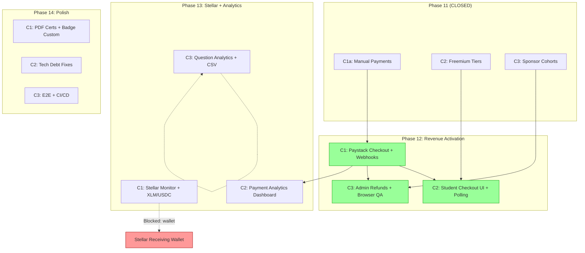
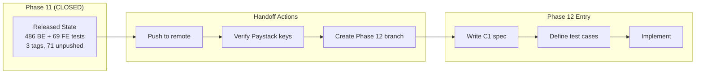
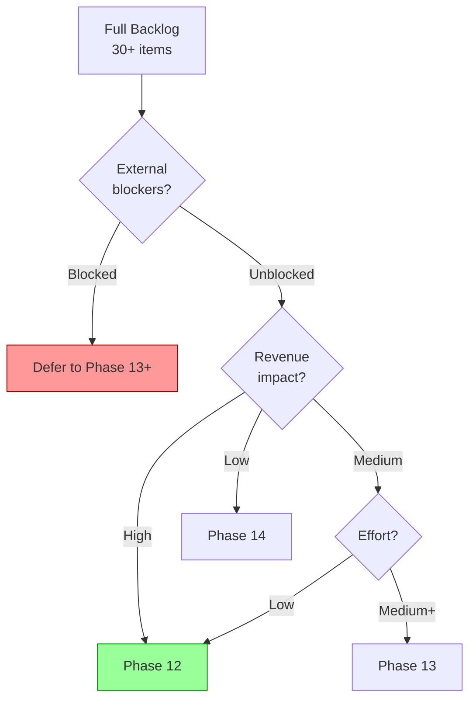
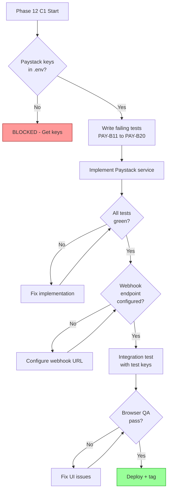

# Phase 11 Release Closeout + Phase 12–14 Kickoff

> **For agentic workers:** This is a planning document, not an implementation plan. Use it as the baseline for Phase 12 spec writing. Phase 11 is CLOSED — do not reopen.

**Goal:** Cleanly close Phase 11, inventory all deferred work, rank Phase 12–14 candidates by value/risk/effort, and define test strategy.

**Baseline:** 486/486 backend tests, 69/69 frontend tests (555 total). All gates PASS.

**Date:** 2026-08-05

---

## Phase 11 Release Closeout

### Shipped Features

| Chunk | Feature | Commits | Tests Added | Key Files |
|-------|---------|---------|-------------|-----------|
| **C1a** | Manual payment foundation | `27a08f5` → `e140097` | PAY-B1–B10 (10 backend) | `paymentService.ts`, `payments.ts`, `PricingManagement.tsx` |
| **C2** | Freemium certificate tiers | `a424f24` → `4408bce` | TIER-B1–B10 + TIER-F1–F8 (18 total) | `badgeService.ts`, `TierSelector.tsx`, `BadgeDisplay` |
| **C3** | Sponsor cohorts | `b039c59` → `1e27c0b` | COH-B1–B12 + COH-F1–F6 (18 total) | `cohortService.ts`, `cohorts.ts`, `CohortManagement.tsx` |

**Total Phase 11 delta:** +46 tests, ~2,600 lines added across 27 files.

### Schema Additions (Phase 11)

```
course_pricing     — C1a (price_cents, currency, is_active) + C2 (tiers_enabled)
payments           — C1a (amount, method, status, confirmed_by/at, notes)
certificate_badges — C2 (user_id, course_id, badge_svg, badge_hash)
sponsor_cohorts    — C3 (name, sponsor, course, tier, payment_id, status)
cohort_members     — C3 (cohort_id, user_id, application_id)
```

ALTERs: `course_nft_applications.selected_tier`, `course_nft_applications.payment_id`, `course_pricing.tiers_enabled`.

### API Surface Added (15 endpoints)

- 5 payment/pricing endpoints (C1a)
- 3 tier/badge endpoints (C2)
- 7 cohort admin endpoints (C3)

### Verification Summary

| Gate | Status |
|------|--------|
| TypeScript compilation | PASS |
| Backend vitest (486/486) | PASS |
| Frontend vitest (69/69) | PASS |
| Vite production build | PASS |
| Docker build | PASS |
| HTTP health check | PASS |
| Manual browser QA | DEFERRED (all 3 chunks) |

### Rollback Note

Tags exist for rollback to any chunk boundary:
- `phase11-c1a-complete-2026-08-04`
- `phase11-c2-complete-2026-08-05`
- `phase11-c3-complete-2026-08-05`

Pre-phase tags from earlier phases also available (`pre-phase11-*` etc.).

### Manual QA Status

**Not performed.** All three chunks defer browser QA. Components needing manual verification:
- `PricingManagement` — admin pricing panel
- `TierSelector` / `BadgeDisplay` — student certificate tier selection and badge display
- `CohortManagement` — admin cohort CRUD, member management, bulk actions
- Payment gate flow (402 at mint, confirm/waive admin actions)

### Known Tech Debt from Phase 11

1. `SponsorDashboard.tsx:171` — hardcoded `tiersEnabled: 'both'` instead of fetching per-course
2. Cohort `'completed'` status — CHECK constraint exists but no transition logic implemented
3. Stale spec: `phase11-c1-payment-foundation-design.md` — pre-C1a, describes tables that C1a already shipped

### Push Status

**71 commits + 3 tags unpushed** to `origin/main`. GitHub PAT in `~/.env.git-write` needs verification. Push command:
```bash
source ~/.env.git-write && git push https://"$GH_TOKEN"@github.com/SM-Web-Systems/lms-crypto-production.git main --tags
```

---

## Phase 12 Kickoff

### Context

Phase 11 built the payment and certification infrastructure (manual payments, free/paid tiers, sponsor cohorts). Phase 12 activates the revenue pipeline by wiring up automated payment processing. The Paystack keys are now in `.env` and testable.

### Scope

Phase 12 = **Revenue Activation**. Automate what Phase 11 made possible manually.

### Non-Goals (Phase 12)

- No subscription/recurring billing
- No multi-currency beyond USD + XLM/USDC
- No student self-service refunds
- No marketplace
- No forum enhancements
- No quiz randomization/time limits
- No E2E test infrastructure
- No CI/CD pipeline setup

---

## Full Backlog Inventory

### Category A: Payment & Commerce

| ID | Item | Source | External Dep | Est. Tests |
|----|------|--------|-------------|------------|
| A1 | Paystack checkout integration | C1 spec | Paystack keys (READY) | ~10 backend |
| A2 | Paystack webhook handler + idempotent dedup | C1 spec | Paystack webhook URL | ~5 backend |
| A3 | Stellar payment monitor (XLM/USDC) | C1 spec | Receiving wallet | ~5 backend |
| A4 | Student self-checkout UI | C1 spec | A1+A2 | ~5 frontend |
| A5 | Payment status polling endpoint | C1 spec | A1 | ~3 backend |
| A6 | Admin refund endpoint (Paystack) | C1 spec | A1 | ~3 backend |
| A7 | PricingManagement XLM/USDC fields | C1 spec | A3 | ~2 frontend |
| A8 | Payment analytics dashboard | P10 closeout | A1 | ~5 backend + ~5 frontend |
| A9 | Invoice/receipt generation | Backlog | A1 | ~3 backend |
| A10 | Subscription/recurring billing | Deferred | A1 | Large |
| A11 | Multi-currency beyond USD+XLM/USDC | Deferred | A1 | Medium |

### Category B: Analytics & Reporting

| ID | Item | Source | External Dep | Est. Tests |
|----|------|--------|-------------|------------|
| B1 | Question-level quiz analytics | P10 C2 non-goals | None | ~5 backend + ~3 frontend |
| B2 | Time-series quiz charts | P10 C2 non-goals | B1 | ~3 frontend |
| B3 | CSV export for quiz analytics | P10 C2 non-goals | None | ~2 backend |
| B4 | Lecturer-scoped quiz analytics | P10 C2 non-goals | None | ~3 backend |
| B5 | Student-facing quiz performance | P10 C2 non-goals | B1 | ~3 frontend |

### Category C: Certificates & Credentials

| ID | Item | Source | External Dep | Est. Tests |
|----|------|--------|-------------|------------|
| C1 | PDF certificate generation | C2 non-goals | None | ~3 backend |
| C2 | Badge customization (admin templates) | C2 non-goals | None | ~3 backend + ~2 frontend |
| C3 | Badge revocation flow | C2 non-goals | None | ~2 backend |
| C4 | On-chain record for free-tier | C2 non-goals | Stellar | ~2 backend |

### Category D: UX & Quality

| ID | Item | Source | External Dep | Est. Tests |
|----|------|--------|-------------|------------|
| D1 | Browser QA sweep (P11 components) | All P11 closeouts | None | 0 (manual) |
| D2 | SponsorDashboard tiersEnabled fix | P11 tech debt | None | ~1 backend |
| D3 | Cohort completion tracking | P11 C3 non-goals | None | ~3 backend |
| D4 | Student wallet retry button | P8 backlog | None | ~1 frontend |
| D5 | Progress page PDF export | P8 backlog | None | ~3 backend |

### Category E: Forum & Social

| ID | Item | Source | External Dep | Est. Tests |
|----|------|--------|-------------|------------|
| E1 | Forum real-time (WebSocket/SSE) | P9 deferred | None | Large |
| E2 | Forum post editing | P9 deferred | None | ~3 backend |
| E3 | Forum moderation tools | P9 deferred | None | ~5 backend |

### Category F: Test Infrastructure

| ID | Item | Source | External Dep | Est. Tests |
|----|------|--------|-------------|------------|
| F1 | E2E test setup (Playwright) | P9 non-goals | None | Infrastructure |
| F2 | CI/CD test gate enforcement | P9 non-goals | GitHub Actions | Infrastructure |
| F3 | Coverage thresholds | P9 non-goals | F2 | Infrastructure |
| F4 | Remaining component test coverage | P10 scope | None | ~30+ frontend |

---

## Candidate Ranking (Value / Risk / Effort)

### Scoring: H=High, M=Medium, L=Low

| Rank | ID | Item | Value | Risk | Effort | Score |
|------|-----|------|-------|------|--------|-------|
| 1 | A1+A2 | Paystack checkout + webhooks | H | M | M | **Revenue-critical** |
| 2 | A4 | Student self-checkout UI | H | L | M | **Revenue-enabling** |
| 3 | A5 | Payment status polling | M | L | L | **UX for payments** |
| 4 | A6 | Admin refund endpoint | M | M | L | **Revenue ops** |
| 5 | D1 | Browser QA sweep | M | L | L | **Quality gate** |
| 6 | D2+D3 | Cohort tech debt fixes | L | L | L | **Cleanup** |
| 7 | A3 | Stellar payment monitor | H | H | M | **Blocked (no wallet)** |
| 8 | A7 | PricingManagement XLM/USDC | M | L | L | **Depends on A3** |
| 9 | B1 | Question-level analytics | M | L | M | **Nice-to-have** |
| 10 | A8 | Payment analytics dashboard | M | L | M | **Depends on A1** |
| 11 | C1 | PDF certificates | M | L | M | **Independent** |
| 12 | B3 | Quiz analytics CSV export | L | L | L | **Quick win** |

---

## Recommended Phase Breakdown

### Phase 12: Revenue Activation (Paystack)

**Why:** Paystack keys are ready. This is the highest-value unblocked work.

| Chunk | Items | Depends On | Est. Tests |
|-------|-------|-----------|------------|
| C1 | A1+A2: Paystack checkout + webhooks | None | ~15 backend |
| C2 | A4+A5: Student checkout UI + polling | C1 | ~8 frontend + ~3 backend |
| C3 | A6: Admin refunds + D1: browser QA | C1 | ~3 backend + manual |

**Target test count:** ~555 + ~29 = ~584 total

### Phase 13: Stellar + Analytics

**Why:** Completes the dual payment rail. Analytics provide operational visibility.

| Chunk | Items | Depends On | Est. Tests |
|-------|-------|-----------|------------|
| C1 | A3+A7: Stellar monitor + pricing UI | Receiving wallet | ~7 backend + ~2 frontend |
| C2 | A8: Payment analytics dashboard | Phase 12 | ~10 total |
| C3 | B1+B3: Question analytics + CSV | None | ~8 backend + ~3 frontend |

**External blocker:** Stellar receiving wallet must be designated.

### Phase 14: Polish & Extensions

| Chunk | Items | Depends On | Est. Tests |
|-------|-------|-----------|------------|
| C1 | C1+C2: PDF certs + badge customization | None | ~8 total |
| C2 | D2+D3+D4+D5: Tech debt + UX fixes | None | ~8 total |
| C3 | F1+F2: E2E + CI/CD infrastructure | None | Infrastructure |

---

## Dependency Map



## Handoff Flow



## Candidate Ranking Flow



## Risk / Test Gate Flow



---

## To-Do Lists

### Candidate Analysis Checklist

- [x] Inventory all deferred items from Phase 9–11 docs
- [x] Categorize by domain (payments, analytics, certs, UX, forum, infra)
- [x] Score each by value/risk/effort
- [x] Identify external dependencies
- [x] Confirm Paystack keys available
- [ ] Confirm Stellar receiving wallet status
- [ ] Confirm Paystack webhook URL strategy (tunnel vs public endpoint)

### Dependency Checklist

- [x] Map Phase 11 → Phase 12 schema dependencies
- [x] Identify shared services (paymentService, badgeService, cohortService)
- [x] Identify shared routes (payments.ts, cohorts.ts)
- [ ] Verify `paystack` npm package available (not yet installed)
- [ ] Verify Paystack test mode vs live mode keys
- [ ] Designate Stellar receiving wallet address
- [ ] Establish Paystack webhook endpoint URL

### Risk Checklist

- [ ] PCI compliance: Confirm SAQ-A sufficient for Paystack redirect model
- [ ] Webhook security: Validate Paystack signature verification approach
- [ ] Idempotency: Design `webhook_events` dedup strategy
- [ ] Price change race: Student sees old price, pays, price changes mid-flow
- [ ] Double payment: Student pays both Paystack and Stellar for same course
- [ ] Stellar memo: UUID truncation collision risk (28-char memo limit)
- [ ] Refund: Paystack refund API limits and timing

### Test Strategy Checklist

- [ ] Define PAY-B11 to PAY-B20 test cases (backend)
- [ ] Define PAY-F8 to PAY-F12 test cases (frontend)
- [ ] Define webhook integration test approach (mock vs real)
- [ ] Define Stellar monitor test approach (mock Horizon)
- [ ] Plan regression run against all 555 existing tests
- [ ] Plan manual browser QA for student checkout flow
- [ ] Plan manual browser QA for deferred Phase 11 components

### Handoff Checklist

- [ ] Push 71 commits + 3 Phase 11 tags to remote
- [ ] Verify push succeeded (git log origin/main)
- [ ] Install `paystack` npm package (or use raw HTTP)
- [ ] Add `PAYSTACK_SECRET_KEY` and `PAYSTACK_PUBLIC_KEY` to LMS-Server `.env`
- [ ] Create Phase 12 planning branch or worktree
- [ ] Write Phase 12 C1 spec (Paystack checkout + webhooks)
- [ ] Define Phase 12 C1 test cases before implementation

---

## Test Strategy

### Phase 12 C1: Paystack Checkout + Webhooks

**Acceptance Criteria:**
1. Student can initiate Paystack checkout for a priced course
2. Paystack redirect returns to LMS with reference
3. Webhook confirms payment and updates `payments` table
4. Duplicate webhook events are idempotent (no double-confirm)
5. Invalid webhook signatures are rejected (401)
6. `isPaymentSatisfied()` returns true after confirmed Paystack payment
7. Admin can view Paystack payments in payment list

**Test Cases (Backend):**
- PAY-B11: `POST /checkout` creates Paystack session, returns redirect URL
- PAY-B12: Webhook with valid signature confirms payment
- PAY-B13: Webhook with invalid signature returns 401
- PAY-B14: Duplicate webhook event is idempotent
- PAY-B15: `isPaymentSatisfied()` returns true after Paystack confirm
- PAY-B16: Checkout for free course returns 400
- PAY-B17: Checkout for already-paid course returns 409

**Test Cases (Frontend):**
- PAY-F8: Student checkout UI renders payment methods
- PAY-F9: Paystack redirect flow (mock redirect + return)
- PAY-F10: Payment status display after return
- PAY-F11: Error state display (payment failed)

### Phase 12 C2: Student Checkout UI + Polling

**Acceptance Criteria:**
1. Student sees "Pay" button on priced course
2. Payment method selection (Paystack initially)
3. Post-payment, student sees payment status update
4. Polling endpoint returns current payment state

### Phase 12 C3: Admin Refunds + Browser QA

**Acceptance Criteria:**
1. Admin can refund a Paystack payment
2. Refund updates payment status to 'refunded'
3. Refund revokes NFT application approval if applicable
4. All Phase 11 + 12 UI components pass browser QA

### Regression Coverage

Every Phase 12 commit must pass:
- All 486 existing backend tests
- All 69 existing frontend tests
- All new Phase 12 tests
- TypeScript compilation
- Vite production build
- Docker build + health check

---

## Risk Note

### Key Assumptions
1. Paystack keys in `.env` are live/test keys that work
2. Paystack redirect model (not inline) — SAQ-A compliant
3. No Stripe needed (Paystack replaces Stripe entirely)
4. `payment_method` column extensible to `'paystack'` without migration

### Potential Coupling Risks
1. `payments` table — shared by C1a manual, C3 cohort bulk, and new Paystack payments
2. `isPaymentSatisfied()` — single function, must handle all payment methods
3. `course_nft_applications.payment_id` — FK to payments, used by cohort bulk pay
4. `paymentService.ts` — growing service, may need split if too large after Paystack
5. `payments.ts` routes — already has 5 endpoints, adding checkout/webhook/refund

### External Dependencies
1. **Paystack API** — checkout session creation, webhook verification, refund API
2. **Stellar Horizon** — payment monitoring (Phase 13, not 12)
3. **GitHub PAT** — must be refreshed to push Phase 11 and create Phase 12 branches

---

## Handoff Note

### What Is Released (Phase 11)
- Manual payment foundation with `course_pricing` and `payments` tables
- Freemium certificate tiers with SVG badge generation
- Sponsor cohorts with bulk apply and bulk pay
- 555 total tests (486 backend + 69 frontend), all passing
- 15 new API endpoints
- 5 new database tables + 3 ALTER columns

### What Phase 12 Should Consume
- `payments` table schema (add `paystack_reference`, `stellar_tx_hash` columns)
- `paymentService.ts` (extend with Paystack + webhook methods)
- `payments.ts` routes (add checkout, webhook, status, refund endpoints)
- `isPaymentSatisfied()` function (add `'paystack'` to method check)
- `PricingManagement.tsx` (extend with Paystack config display)
- Student course view (add checkout button when payment required)

### What Should Remain Deferred
- Stellar payment automation → Phase 13 (wallet not designated)
- Payment analytics dashboard → Phase 13 (needs payment data first)
- Subscription billing → Phase 14+
- Forum enhancements → Phase 14+
- E2E tests → Phase 14+

---

## /loop Workflow

### /loop assess
```
Review Phase 12 C1 readiness:
1. Paystack keys in .env? YES
2. paystack npm package installed? CHECK
3. Webhook URL strategy decided? CHECK
4. Phase 11 pushed to remote? CHECK
5. All 555 tests passing? RUN
```

### /loop plan
```
Phase 12 C1 planning:
1. Write spec: docs/superpowers/specs/2026-08-XX-phase12-c1-paystack-checkout-design.md
2. Define test cases PAY-B11 to PAY-B17
3. Define frontend test cases PAY-F8 to PAY-F11
4. Map file changes (paymentService.ts, payments.ts, new paystackService.ts)
5. Estimate: ~15 backend + ~4 frontend new tests
```

### /loop review
```
Phase 12 C1 review checklist:
1. All new tests green?
2. All 555 existing tests still green?
3. TypeScript compilation clean?
4. Vite build succeeds?
5. Docker build + health check?
6. Webhook idempotency verified?
7. Browser QA for checkout flow?
```

### /loop defer
```
Items deferred from Phase 12:
- Stellar payment monitor (no receiving wallet)
- Payment analytics (needs Paystack data first)
- Subscription billing (out of scope)
- Forum enhancements (unrelated)
- E2E test infrastructure (Phase 14)
```

---

## Final Recommendation

### **PHASE 12 SPEC READY**

**Rationale:** Paystack keys are confirmed in `.env`. The C1 spec (`phase11-c1-paystack-stellar-automation-design.md`) exists and covers the Paystack integration. Phase 11 is cleanly closed with all tests passing. The only pre-implementation actions needed are:

1. Push Phase 11 to remote (refresh PAT if needed)
2. Verify Paystack keys work (test API call)
3. Decide: install `paystack` npm package or use raw `fetch`
4. Set up Paystack webhook URL (Cloudflare tunnel or public endpoint)

**Exact next action:** Push Phase 11 to remote, then write the Phase 12 C1 implementation plan using the existing Paystack spec as input.
