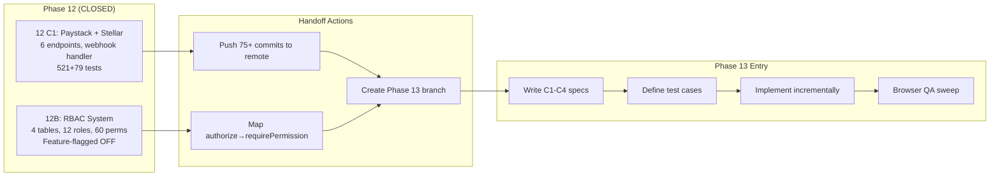
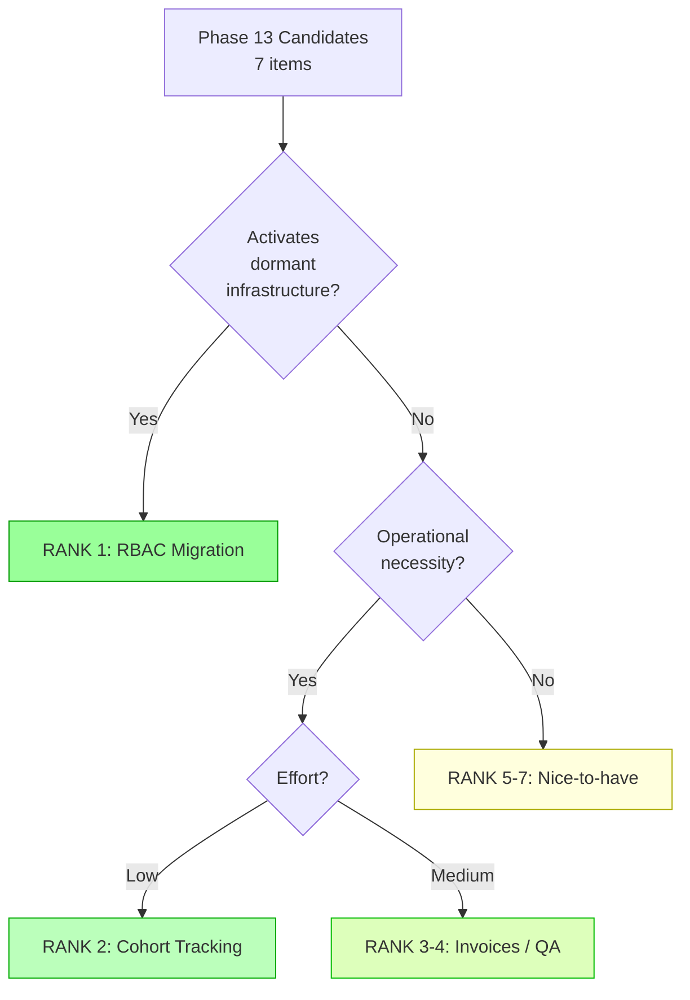
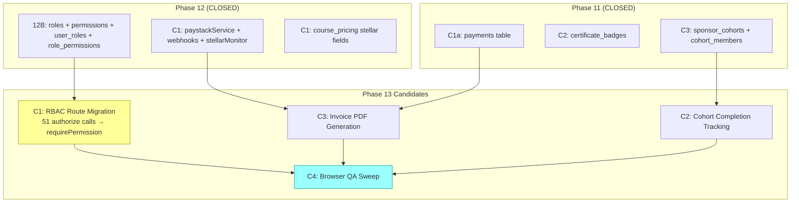
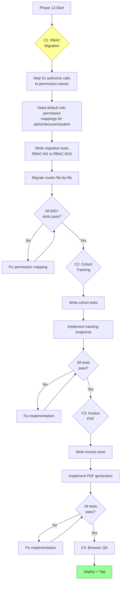

# Phase 12 Release Closeout + Phase 13 Kickoff

> **For agentic workers:** This is a planning document, not an implementation plan. Use it as the baseline for Phase 13 spec writing. Phase 12 is CLOSED — do not reopen.

**Goal:** Cleanly close Phase 12, inventory deferred work, rank Phase 13 candidates, and prepare spec-writing readiness.

**Baseline:** 521/521 backend tests, 79/79 frontend tests (600 total). All gates PASS.

**Date:** 2026-08-05

---

## Phase 12 Release Closeout

### Shipped Features

| Chunk | Feature | Tag | Tests Added | Key Files |
|-------|---------|-----|-------------|-----------|
| **12B** | Capability-based RBAC | `phase12b-complete-2026-08-05` | 20 backend (RBAC-B1–B20) | `rbac.ts` (middleware + routes), schema (4 tables: roles, permissions, role_permissions, user_roles), 12 built-in roles, 60 permissions |
| **12 C1** | Paystack + Stellar payment automation | `phase12-c1-complete-2026-08-05` | 15 backend (PAY-B11–B25) + 10 frontend (PAY-F8–F17) | `paystackService.ts`, `stellarPaymentMonitor.ts`, `webhooks.ts`, `PaymentCheckout.tsx` |

**Total Phase 12 delta:** +45 tests (35 backend + 10 frontend), ~4,769 lines added across 29 files.

### Schema Additions (Phase 12)

```
roles              — 12B (id, name, label, description, is_system, created_by)
permissions        — 12B (id, name, category, description, is_system)
role_permissions   — 12B (role_id, permission_id)
user_roles         — 12B (user_id, role_id, assigned_by, assigned_at)
webhook_events     — C1 (event_id UNIQUE, event_type, provider, payload)
```

ALTERs (C1): `payments` + paystack_reference, paystack_access_code, stellar_tx_hash, stellar_memo. `course_pricing` + stellar_price_xlm, stellar_price_usdc.

### API Surface Added (Phase 12)

- **12B RBAC (11 endpoints):** Role CRUD, permission listing, user role assignment, own role/permission check, escalation guards
- **12 C1 Payments (6 endpoints):** `POST /payments/checkout/paystack`, `POST /payments/checkout/stellar`, `GET /payments/:id/status`, `GET /payments/mine`, `POST /admin/payments/:id/refund`, `POST /webhooks/paystack`
- **Extended (2):** `GET /courses/:id/pricing` (stellar fields + paymentMethods array), `PUT /admin/courses/:id/pricing` (stellar price fields)

### Verification Summary

| Gate | Status |
|------|--------|
| TypeScript backend | PASS |
| TypeScript frontend | PASS |
| Backend vitest (521/521) | PASS |
| Frontend vitest (79/79) | PASS |
| Vite production build | PASS |
| Manual browser QA | DEFERRED |

### Rollback Note

Tags for Phase 12 rollback:
- `phase12b-complete-2026-08-05` (RBAC)
- `phase12-c1-complete-2026-08-05` (Paystack + Stellar)

Pre-phase tags from Phase 11 also available.

### Manual QA Status

**Not performed.** Components needing browser verification:
- RBAC admin panel (role CRUD, permission assignment, escalation guards)
- Paystack checkout flow (student redirect + return)
- Stellar payment instructions display (address, memo, copy buttons)
- PricingManagement Stellar price fields (XLM/USDC inputs in edit modal)
- Payment status display + student payment history

### Deferred from Phase 12

| ID | Item | Reason | Target |
|----|------|--------|--------|
| C2 | Invoice generation (PDF receipts, sponsor invoices) | Out of C1 scope | Phase 13+ |
| C3 | Cohort completion tracking (sponsor dashboard) | Out of C1 scope | Phase 13+ |
| RBAC-E | Migrate existing `authorize()` routes to `requirePermission()` | Feature-flagged, not ready for production activation | Phase 13+ |
| D1 | Browser QA sweep (all P11+P12 components) | Deferred across all phases | Phase 13 |

### Known Tech Debt from Phase 12

1. **RBAC is feature-flagged off** — `RBAC_ENABLED` not set in `.env`, all routes still use `authorize()` (51 call sites across 15 route files)
2. **`payments.ts` is 636 lines** — growing large, may need splitting when more payment methods are added
3. **Stellar monitor has no receiving wallet** — `stellarPaymentMonitor.ts` polls Horizon but `STELLAR_RECEIVING_WALLET` not set
4. **SponsorDashboard tiersEnabled hardcoded** — inherited from P11 tech debt
5. **71+ unpushed commits** — remote `origin/main` is far behind local

### Push Status

**75+ commits + 5+ tags unpushed** to `origin/main`. Push command:
```bash
source ~/.env.git-write && git push https://"$GH_TOKEN"@github.com/SM-Web-Systems/lms-crypto-production.git main --tags
```

---

## Phase 13 Kickoff

### Context

Phase 12 built two infrastructure pillars: (1) capability-based RBAC with 12 roles and 60 permissions, currently feature-flagged off; and (2) automated payment processing via Paystack checkout + Stellar payment monitoring. Phase 13 should activate these systems for production use and fill the remaining operational gaps.

### Why This Phase Exists

1. **RBAC is built but dormant** — 51 route handlers still use `authorize('admin')` instead of `requirePermission()`. Until migration happens, the RBAC system is dead code.
2. **Payment infrastructure needs operational tooling** — No invoices, no receipts, no sponsor billing. The plumbing works but the business operations layer is missing.
3. **Cohort completion tracking is empty** — Sponsors can create cohorts and bulk-apply but cannot see completion progress or get reports.

### Scope

Phase 13 = **Operational Activation**. Turn Phase 12 infrastructure into production-usable features.

### Non-Goals (Phase 13)

- No subscription/recurring billing
- No multi-tenant architecture (isolated course instances)
- No marketplace features
- No forum enhancements
- No E2E test infrastructure
- No CI/CD pipeline setup
- No Stellar receiving wallet setup (external dependency)
- No quiz randomization/time limits
- No custom badge templates

---

## Candidate Ranking

### Scoring: H=High, M=Medium, L=Low

| Rank | ID | Item | Value | Risk | Effort | Rationale |
|------|-----|------|-------|------|--------|-----------|
| **1** | RBAC-E | RBAC route migration (`authorize()` → `requirePermission()`) | **H** | **M** | **M** | Activates dormant RBAC system. 51 call sites. Risk: breaking existing auth if permission mapping is wrong. Must be incremental. |
| **2** | D3 | Cohort completion tracking | **M** | **L** | **L** | Sponsors need visibility. Small backend addition to existing `/admin/sponsor` endpoints. |
| **3** | A9 | Invoice/receipt generation (PDF) | **M** | **L** | **M** | Operational necessity for paying students and sponsors. Depends on payment data existing (it does). |
| **4** | D1 | Browser QA sweep (P11+P12 components) | **M** | **L** | **L** | Accumulating QA debt. No new code, just verification. |
| **5** | A8 | Payment analytics dashboard | **M** | **L** | **M** | Admin needs payment visibility. Builds on existing analytics patterns. |
| **6** | D2 | SponsorDashboard tiersEnabled fix | **L** | **L** | **L** | Quick tech debt fix. |
| **7** | B1+B3 | Question-level quiz analytics + CSV | **L** | **L** | **M** | Nice-to-have. Independent of payment system. |

### Recommended Phase 13 Chunking

| Chunk | Items | Depends On | Est. Tests |
|-------|-------|-----------|------------|
| **C1** | RBAC-E: Route migration (authorize → requirePermission) | Phase 12B RBAC tables | ~15 backend |
| **C2** | D3+D2: Cohort completion tracking + SponsorDashboard fix | Phase 11 C3 cohorts | ~5 backend + ~3 frontend |
| **C3** | A9: Invoice/receipt PDF generation | Phase 12 C1 payments | ~5 backend + ~2 frontend |
| **C4** | D1: Browser QA sweep | All of above | 0 (manual only) |

**Target test count:** ~600 + ~30 = ~630 total

---

## Mermaid Diagrams

### Phase 12 → Phase 13 Handoff Flow



### Candidate Ranking Flow



### Dependency Map



### Risk / Test Gate Flow



---

## To-Do Lists

### Candidate Analysis Checklist

- [x] Inventory all deferred items from Phase 9–12 docs
- [x] Categorize by domain (RBAC, payments, cohorts, UX, analytics)
- [x] Score each by value/risk/effort
- [x] Identify external dependencies
- [x] Rank candidates for Phase 13
- [ ] Confirm RBAC migration strategy (incremental vs bulk)
- [ ] Confirm invoice PDF library choice (pdfkit vs puppeteer vs jsPDF)
- [ ] Confirm cohort completion tracking endpoint design

### Dependency Checklist

- [x] Map Phase 12 → Phase 13 schema dependencies
- [x] Identify shared services (paymentService, rbac middleware, cohortService)
- [x] Identify route files needing RBAC migration (15 files, 51 calls)
- [ ] Verify RBAC default role seeds match existing authorize() patterns
- [ ] Verify sponsor endpoints return completion data structure
- [ ] Verify payment data sufficient for invoice generation
- [ ] Identify which routes need `requirePermission` vs `requireAnyRole`

### Risk Checklist

- [ ] RBAC migration: Will `authorize('admin')` → `requirePermission('system.manage_*')` break any existing admin flows?
- [ ] RBAC migration: Default role-permission mapping must give admins ALL current capabilities
- [ ] RBAC migration: Students with `authorize('student')` — what permissions map?
- [ ] RBAC migration: Lecturers with mixed access — which permissions per route?
- [ ] Invoice PDF: Server-side PDF generation memory/CPU impact on 4-CPU/8GB server
- [ ] Invoice PDF: Template design and branding — who approves?
- [ ] Cohort tracking: Does `sponsor_cohorts` schema support completion percentages?
- [ ] Feature flag: When does `RBAC_ENABLED=true` get set in production?

### Test Strategy Checklist

- [ ] Define RBAC migration test cases (RBAC-M1 to RBAC-M15)
- [ ] Define cohort tracking test cases (COH-T1 to COH-T5)
- [ ] Define invoice generation test cases (INV-1 to INV-5)
- [ ] Plan regression run against all 600 existing tests per chunk
- [ ] Plan manual browser QA for RBAC-migrated routes
- [ ] Plan manual browser QA for accumulated P11+P12 deferred components
- [ ] Decide: keep `authorize()` as legacy fallback or remove entirely?

### Handoff Checklist

- [ ] Push 75+ commits + 5+ tags to remote
- [ ] Verify push succeeded
- [ ] Create Phase 13 planning branch
- [ ] Write Phase 13 C1 spec (RBAC route migration)
- [ ] Write Phase 13 C2 spec (cohort completion tracking)
- [ ] Write Phase 13 C3 spec (invoice PDF generation)
- [ ] Define test cases before implementation
- [ ] Review authorize→requirePermission mapping table with stakeholder

---

## Test Strategy

### Phase 13 C1: RBAC Route Migration

**Acceptance Criteria:**
1. All 51 `authorize()` calls replaced with `requirePermission()` equivalents
2. Admin users retain all current capabilities via default `admin` role permissions
3. Lecturer users retain lecturer-scoped access (submissions review, course progress, recommendations)
4. Student users retain student-scoped access (own submissions, own progress, certificate apply)
5. `RBAC_ENABLED` feature flag removed — RBAC is always active
6. No regression in any existing test

**Test Cases (Backend):**
- RBAC-M1: Admin with `admin` role can access all admin-only routes
- RBAC-M2: Lecturer with `instructor` role can review submissions
- RBAC-M3: Lecturer cannot access admin-only routes (user management, pricing)
- RBAC-M4: Student cannot access admin or lecturer routes
- RBAC-M5: Student can access own submissions, progress, credentials
- RBAC-M6: User with custom role and specific permission can access that route
- RBAC-M7: User without required permission gets 403
- RBAC-M8: Removing a permission from a role immediately blocks access
- RBAC-M9: Multiple roles accumulate permissions (union)
- RBAC-M10: Regression: all 521 existing backend tests still pass

### Phase 13 C2: Cohort Completion Tracking

**Acceptance Criteria:**
1. Sponsor can view completion percentage per cohort member
2. Sponsor can view aggregate cohort completion statistics
3. Completion data updates as students complete lessons/quizzes
4. CSV export includes completion columns

**Test Cases:**
- COH-T1: GET /admin/sponsor/:cohortId/progress returns member completion data
- COH-T2: Completion percentage matches lesson_completions data
- COH-T3: CSV export includes completion columns
- COH-T4: Empty cohort returns zero progress
- COH-T5: Frontend displays completion bars in sponsor drill-down

### Phase 13 C3: Invoice/Receipt PDF Generation

**Acceptance Criteria:**
1. Student can download PDF receipt after confirmed payment
2. Admin can generate invoice PDF for sponsor cohort
3. PDF includes: student/sponsor name, course name, amount, date, payment method, reference
4. PDF is generated server-side and served as download

**Test Cases:**
- INV-1: GET /payments/:id/receipt returns PDF for confirmed payment
- INV-2: 404 for pending/failed payment receipt
- INV-3: Only payment owner or admin can download receipt
- INV-4: POST /admin/cohorts/:id/invoice generates sponsor invoice PDF
- INV-5: PDF contains required fields (name, amount, date, reference)

### Regression Coverage

Every Phase 13 commit must pass:
- All 521 existing backend tests
- All 79 existing frontend tests
- All new Phase 13 tests
- TypeScript compilation (both projects)
- Vite production build

---

## Risk Note

### Key Assumptions

1. **RBAC default seeds are correct** — The 60 permissions must map exactly to the 51 existing `authorize()` patterns. Mismatch = broken access.
2. **authorize→requirePermission is 1:1** — Each `authorize('admin')` maps to one or more specific permissions. Some routes may need `requireAnyRole` instead.
3. **PDF generation feasible on server** — 4-CPU/8GB server can handle pdfkit without OOM. No puppeteer/Chrome needed.
4. **Cohort completion is read-only** — No new writes, just aggregating existing `lesson_completions` data.
5. **Feature flag removal is safe** — `RBAC_ENABLED` can be deleted once migration is verified.

### Potential Coupling Risks

1. **rbac.ts middleware + all route files** — RBAC migration touches 15 route files. Any import/middleware ordering error breaks auth.
2. **payments table** — Shared by manual (P11), Paystack (P12), and invoice generation (P13). Schema must remain stable.
3. **cohortService + paymentService** — Cohort completion tracking may need to join across both services.
4. **authorize() removal** — If `authorize()` is deleted, any route that still references it will crash. Must be exhaustive.
5. **Role seeds in schema.sql** — Existing test `_resetForTests()` loads schema.sql. If RBAC tables aren't seeded with default roles, all tests using admin/lecturer accounts will fail.

### Assumptions to Validate Before Spec Writing

1. Does `database.ts` seed default RBAC roles/permissions? Or is seeding in `schema.sql`?
2. What happens to users who have no `user_roles` entry when `authorize()` is removed?
3. Are there any routes that use `authorize('admin', 'lecturer')` dual-role that need special permission mapping?
4. Does the sponsor view (`/admin/sponsor`) already have course progress data available, or does it need new queries?

---

## Handoff Note

### What Is Released (Phase 12)

- **RBAC infrastructure:** 4 tables, 12 built-in roles, 60 permissions, `requirePermission()` middleware, admin CRUD API, escalation guards. Feature-flagged off (`RBAC_ENABLED` not set).
- **Payment automation:** Paystack checkout sessions, HMAC webhook signature verification, Stellar Horizon payment monitor with memo matching, webhook_events idempotency table, admin refund endpoint.
- **Frontend:** PaymentCheckout component (Paystack redirect + Stellar instructions), PricingManagement with Stellar XLM/USDC price fields.
- **600 total tests** (521 backend + 79 frontend), all passing.
- **19 new API endpoints** (11 RBAC + 6 payment + 2 extended).

### What Phase 13 Should Consume

- `rbac.ts` middleware: `requirePermission()`, `requireAnyRole()`, `getUserPermissions()`, `getUserRoles()`
- `roles`, `permissions`, `role_permissions`, `user_roles` tables with 12 seeded roles and 60 permissions
- `payments` table with Paystack/Stellar fields for invoice data
- `sponsor_cohorts` + `cohort_members` tables for completion tracking
- `lesson_completions` table for progress aggregation
- Existing `authorize()` calls in 15 route files (51 call sites) as migration targets

### What Should Remain Deferred

- Multi-tenant architecture (tenant lecturers, isolated course instances) → Phase 14+
- Subscription/recurring billing → Phase 14+
- Forum enhancements (WebSocket, editing, moderation) → Phase 14+
- E2E test infrastructure (Playwright, CI/CD) → Phase 14+
- Custom badge templates → Phase 14+
- Stellar receiving wallet setup → External dependency, unblocked when wallet is designated

---

## /loop Workflow

### /loop assess
```
Review Phase 13 readiness:
1. Phase 12 merged and tagged? YES (phase12b + phase12-c1)
2. All 600 tests passing? YES (521 BE + 79 FE)
3. RBAC tables seeded with default roles? CHECK schema.sql + database.ts
4. authorize() call sites mapped? YES (51 calls, 15 files)
5. Permission mapping table drafted? NEEDS WORK
6. PDF library chosen? NEEDS DECISION
7. Phase 12 pushed to remote? CHECK
```

### /loop plan
```
Phase 13 planning:
1. Write C1 spec: RBAC route migration (authorize → requirePermission)
   - Map each authorize() call to specific permission(s)
   - Define migration order (least-risk routes first)
   - Define feature flag removal strategy
2. Write C2 spec: Cohort completion tracking
   - Define completion data model
   - Define sponsor dashboard extensions
3. Write C3 spec: Invoice PDF generation
   - Choose PDF library
   - Define template fields
   - Define access control
4. Define all test cases before implementation
```

### /loop review
```
Phase 13 review checklist:
1. All new tests green?
2. All 600 existing tests still green?
3. TypeScript compilation clean (both projects)?
4. Vite build succeeds?
5. RBAC: admin/lecturer/student access unchanged from user perspective?
6. RBAC: no orphan authorize() calls remaining?
7. Invoices: PDF renders correctly with test data?
8. Browser QA: accumulated P11+P12+P13 components verified?
```

### /loop defer
```
Items deferred from Phase 13:
- Multi-tenant architecture (too large, needs separate design)
- Subscription billing (no business requirement yet)
- Forum enhancements (unrelated to operational activation)
- E2E test infrastructure (valuable but not blocking)
- Stellar wallet setup (external dependency)
- Custom badge templates (nice-to-have)
```

---

## Final Recommendation

### **PHASE 13 SPEC READY**

**Rationale:**
- Phase 12 is cleanly closed with 600 total tests passing
- RBAC infrastructure is built and ready for route migration
- Payment data exists for invoice generation
- Cohort tables exist for completion tracking
- All dependencies are internal — no external blockers for C1, C2, or C3
- The only pre-spec action is validating the authorize→requirePermission mapping table

**Exact next action:**
1. Push Phase 12 commits to remote (75+ commits + tags)
2. Create a mapping table: each of the 51 `authorize()` calls → which permission(s) it needs
3. Write Phase 13 C1 spec (RBAC route migration) using the mapping table
4. Write Phase 13 C2 spec (cohort completion tracking)
5. Write Phase 13 C3 spec (invoice PDF generation)
6. Begin C1 implementation with TDD

**Candidate chunks ordered by priority:**
1. **C1: RBAC Route Migration** — highest value, activates dormant system
2. **C2: Cohort Completion Tracking** — low effort, sponsor visibility
3. **C3: Invoice PDF Generation** — medium effort, operational necessity
4. **C4: Browser QA Sweep** — verification only, no code
