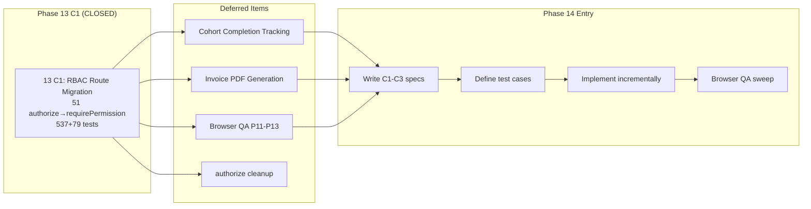
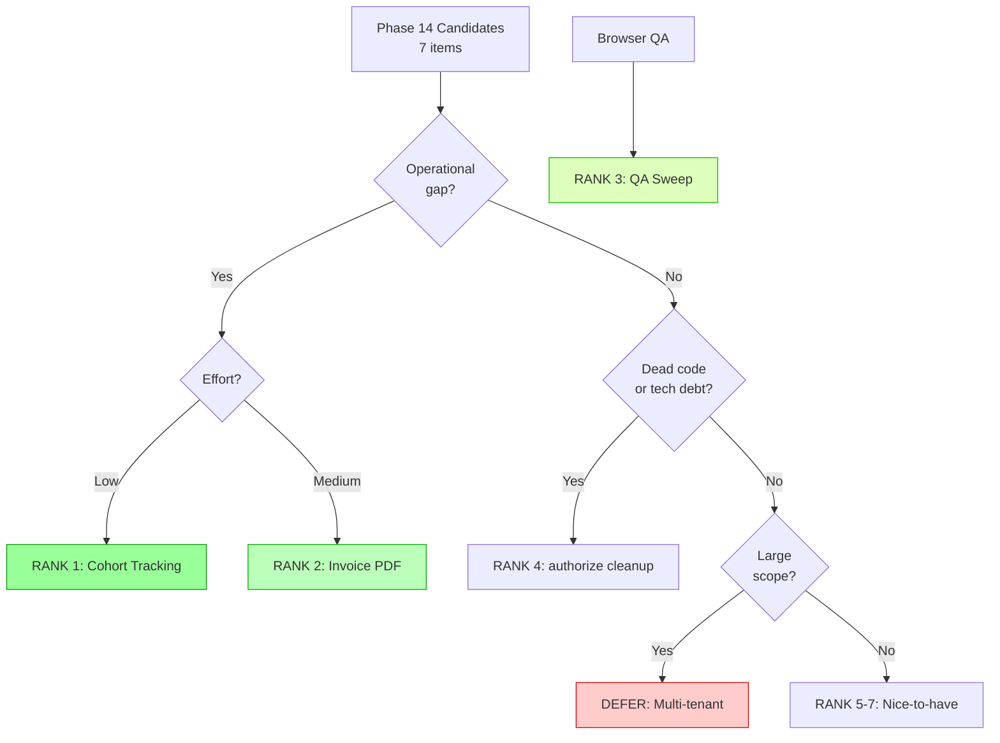
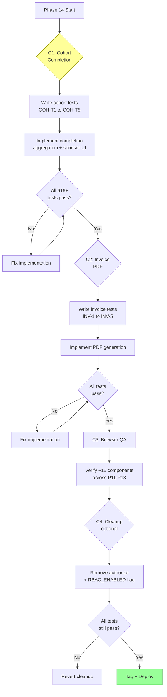

# Phase 13 C1 Release Closeout + Phase 14 Kickoff

> **For agentic workers:** This is a planning document, not an implementation plan. Use it as the baseline for Phase 14 spec writing. Phase 13 C1 is CLOSED — do not reopen.

**Goal:** Close Phase 13 C1 (RBAC route migration), inventory deferred work, rank Phase 14 candidates, and prepare spec-writing readiness.

**Baseline:** 537/537 backend tests, 79/79 frontend tests (616 total). All gates PASS.

**Date:** 2026-08-05

---

## Phase 13 C1 Release Closeout

### Shipped Features

| Chunk | Feature | Tag | Tests Added | Key Files |
|-------|---------|-----|-------------|-----------|
| **13 C1** | RBAC Route Migration | `phase13-c1-complete-2026-08-05` | 16 backend (RBAC-R1–R15) + 1 updated | 15 route files migrated, `schema.sql` (trigger), `setup.ts` (RBAC seed), `database.ts` (exports) |

**Summary:** Replaced all 51 `authorize()` middleware calls across 15 route files with granular `requirePermission()` checks. RBAC is now the sole authorization mechanism for all API routes.

**Key changes:**
1. **51 authorize() → requirePermission()** — Every route now checks specific permissions (e.g., `user.view_all`, `course.manage`, `billing.confirm`) instead of blanket role checks
2. **SQLite trigger `trg_auto_assign_user_role`** — Auto-maps `users.role` column → `user_roles` table on INSERT, bridging legacy role column to RBAC without modifying 41 test files
3. **`seedRbacData()` in test `beforeEach()`** — All tests have RBAC roles, permissions, and role-permission mappings available
4. **Instructor role expanded** — Instructors now have `course.manage`, `quiz.manage`, `document.manage` via RBAC (previously blocked by `authorize('admin')`)
5. **1 test expectation updated** — `courseCompletion.test.ts` changed from "lecturer cannot set requirements" (403) to "lecturer can set requirements via RBAC course.manage" (200)

### Permission Mapping (51 calls)

| Route Domain | Permission(s) | Files |
|---|---|---|
| Users CRUD | `user.view_all`, `user.manage` | `users.ts` |
| Students CRUD | `user.view_all` (router-level) | `students.ts` |
| Courses CRUD | `course.create`, `course.manage`, `course.enroll_others` | `courses.ts` |
| Course Requirements | `course.manage` | `courseRequirements.ts` |
| Lesson Completions (staff) | `course.grade` | `lessonCompletions.ts` |
| Submissions (student) | `course.submit` | `submissions.ts` |
| Submissions (review) | `course.grade` | `submissions.ts` |
| Quizzes | `quiz.manage`, `quiz.view_analytics` | `quizzes.ts` |
| Announcements | `announcement.create`, `announcement.manage` | `announcements.ts` |
| Documents | `document.manage` | `documents.ts` |
| Payments admin | `billing.view_all`, `billing.confirm`, `billing.waive` | `payments.ts` |
| NFT Applications | `certificate.approve`, `certificate.reject`, `certificate.mint` | `nftApplications.ts` |
| Admin diagnostics | `system.view_audit_log` | `admin.ts` |
| Certificates view | `certificate.approve` | `admin.ts` |
| Cohorts | `cohort.manage` | `cohorts.ts` |
| Analytics | `system.view_audit_log` | `analytics.ts` |
| Invites | `course.enroll_others` | `invites.ts` |
| Lecturers | `user.manage` | `courses.ts` |

### Schema Additions (Phase 13 C1)

```sql
-- Added to schema.sql (no new tables — trigger only)
CREATE TRIGGER IF NOT EXISTS trg_auto_assign_user_role
AFTER INSERT ON users
FOR EACH ROW
WHEN NEW.role IN ('student', 'lecturer', 'admin')
BEGIN
  INSERT OR IGNORE INTO user_roles (user_id, role_id)
  VALUES (NEW.id,
    CASE NEW.role
      WHEN 'student' THEN 'role_student'
      WHEN 'lecturer' THEN 'role_instructor'
      WHEN 'admin' THEN 'role_admin'
    END);
END;
```

### Verification Summary

| Gate | Status | Evidence |
|------|--------|----------|
| TypeScript backend (`tsc --noEmit`) | PASS | Clean, 0 errors |
| Backend vitest (537/537) | PASS | 77 test files, 0 failures |
| Frontend vitest (79/79) | PASS | 11 test files, 0 failures |
| No `authorize()` in routes | PASS | `grep authorize src/routes/` → 0 matches |
| Merge to main | DONE | Commit `9445552` |
| Tag | DONE | `phase13-c1-complete-2026-08-05` |
| Manual browser QA | DEFERRED | Accumulated with P11–P12 QA debt |

### Rollback Note

Tags for rollback:
- `phase13-c1-complete-2026-08-05` — current state (RBAC routes active)
- `phase12-c1-complete-2026-08-05` — pre-migration (authorize() still in routes)

Rollback procedure: `git checkout phase12-c1-complete-2026-08-05`, rebuild containers. The `authorize()` function still exists in `auth.ts` (not deleted), so rollback is safe.

### Manual QA Status

**Not performed.** Accumulated QA debt now spans Phases 11–13:
- RBAC admin panel (role CRUD, permission assignment, escalation guards)
- RBAC route migration (all 15 route files — verify no access regressions)
- Paystack checkout flow (student redirect + return)
- Stellar payment instructions display
- PricingManagement Stellar price fields
- Sponsor cohort management
- Certificate tier selection
- Payment status + history views

### Phase 13 Deferred Items

| ID | Item | Reason | Target |
|----|------|--------|--------|
| C2 | Cohort completion tracking + SponsorDashboard fix | Out of C1 scope | Phase 14 |
| C3 | Invoice/receipt PDF generation | Out of C1 scope | Phase 14 |
| C4 | Browser QA sweep (accumulated P11–P13) | Verification only, deferred | Phase 14 |
| D6 | `authorize()` function removal from auth.ts | Kept for rollback safety | Phase 14+ (cleanup) |
| D7 | `RBAC_ENABLED` feature flag cleanup | No longer needed (RBAC always active) | Phase 14+ (cleanup) |

### Known Tech Debt Post-Phase 13 C1

1. **`authorize()` function still exported from `auth.ts`** — Dead code, kept for rollback. Safe to remove once Phase 14 is stable.
2. **`RBAC_ENABLED` feature flag** — No longer checked in route middleware (all routes use `requirePermission()` directly), but `authorize()` still reads it. Can be removed with `authorize()`.
3. **`payments.ts` is 637 lines** — Growing large (inherited from P12). May need splitting.
4. **SponsorDashboard `tiersEnabled` hardcoded** — Inherited from P11 tech debt.
5. **80+ unpushed commits** — Remote `origin/main` is far behind local.
6. **Manual QA debt spans 3 phases** — No browser verification since Phase 10.

---

## Phase 14 Kickoff

### Context

Phase 13 C1 activated the RBAC system by migrating all 51 route authorization calls to permission-based checks. The permission infrastructure is now live and tested. Phase 14 should fill the remaining operational gaps (cohort tracking, invoices) and address accumulated QA debt.

### Why This Phase Exists

1. **Sponsors cannot see cohort completion progress** — `sponsor_cohorts` and `cohort_members` tables exist (P11 C3) but no completion aggregation endpoints or UI exist
2. **No receipts or invoices** — Payments are confirmed but students/sponsors cannot download proof of payment
3. **3 phases of untested UI** — Browser QA has been deferred since Phase 10, accumulating ~15 components needing manual verification
4. **Tech debt cleanup** — Dead `authorize()` function, stale feature flag, oversized route files

### Scope

Phase 14 = **Operational Completeness + QA**. Fill remaining feature gaps and verify everything works in the browser.

### Non-Goals (Phase 14)

- No multi-tenant architecture (tenant lecturers, isolated course instances)
- No subscription/recurring billing
- No marketplace features
- No forum enhancements
- No E2E test infrastructure (Playwright, CI/CD)
- No Stellar receiving wallet setup (external dependency)
- No quiz randomization/time limits
- No custom badge templates
- No new RBAC roles or permissions (use existing 12 roles / 60 permissions)

---

## Candidate Ranking

### Scoring: H=High, M=Medium, L=Low

| Rank | ID | Item | Value | Risk | Effort | Rationale |
|------|-----|------|-------|------|--------|-----------|
| **1** | C2 | Cohort completion tracking + SponsorDashboard fix | **H** | **L** | **L** | Sponsors need visibility. Read-only aggregation of existing `lesson_completions` data. SponsorDashboard `tiersEnabled` fix is trivial. |
| **2** | C3 | Invoice/receipt PDF generation | **M** | **L** | **M** | Operational necessity. Depends on existing `payments` table data. Server-side `pdfkit` is lightweight. |
| **3** | C4 | Browser QA sweep (P11–P13 accumulated) | **H** | **L** | **L** | No new code. Pure verification. Covers ~15 components across 3 phases. Deferred too long. |
| **4** | D6+D7 | `authorize()` removal + `RBAC_ENABLED` cleanup | **L** | **L** | **L** | Dead code removal. Small risk if rollback is needed, but Phase 13 C1 is stable. |
| **5** | A8 | Payment analytics dashboard | **M** | **L** | **M** | Admin needs payment visibility. Builds on existing analytics patterns. |
| **6** | MT | Multi-tenant architecture | **H** | **H** | **H** | Large scope. Needs separate design phase. Not Phase 14. |
| **7** | B1+B3 | Question-level quiz analytics + CSV | **L** | **L** | **M** | Nice-to-have. Independent of payment/cohort systems. |

### Recommended Phase 14 Chunking

| Chunk | Items | Depends On | Est. Tests |
|-------|-------|-----------|------------|
| **C1** | Cohort completion tracking + SponsorDashboard `tiersEnabled` fix | P11 C3 cohort tables, `lesson_completions` | ~5 backend + ~3 frontend |
| **C2** | Invoice/receipt PDF generation | P12 C1 payments table | ~5 backend + ~2 frontend |
| **C3** | Browser QA sweep (P11–P13 accumulated) | All of above | 0 (manual only) |
| **C4** (optional) | `authorize()` removal + feature flag cleanup | Phase 13 C1 stability | ~2 backend (negative tests) |

**Target test count:** 616 + ~17 = ~633 total

---

## Mermaid Diagrams

### Phase 13 → Phase 14 Handoff Flow



### Candidate Ranking Flow



### Dependency Map

```mermaid
graph TD
    subgraph "Phase 11 (CLOSED)"
        P11_PAY[C1a: payments table]
        P11_TIERS[C2: certificate_badges<br/>tiers_enabled field]
        P11_COHORTS[C3: sponsor_cohorts<br/>+ cohort_members]
    end

    subgraph "Phase 12 (CLOSED)"
        P12_RBAC[12B: roles + permissions<br/>+ role_permissions + user_roles]
        P12_PAYSTACK[C1: paystackService<br/>+ webhook_events]
    end

    subgraph "Phase 13 C1 (CLOSED)"
        P13_MIG[C1: All routes use<br/>requirePermission()<br/>trg_auto_assign_user_role]
    end

    subgraph "Phase 14 Candidates"
        C1_COHORT[C1: Cohort Completion<br/>Tracking + SponsorDashboard fix]
        C2_INVOICE[C2: Invoice PDF<br/>Generation]
        C3_QA[C3: Browser QA Sweep]
        C4_CLEAN[C4: authorize() removal]
    end

    P11_COHORTS --> C1_COHORT
    P11_TIERS --> C1_COHORT
    P11_PAY --> C2_INVOICE
    P12_PAYSTACK --> C2_INVOICE
    P13_MIG --> C1_COHORT
    P13_MIG --> C2_INVOICE
    P13_MIG --> C4_CLEAN
    C1_COHORT --> C3_QA
    C2_INVOICE --> C3_QA

    style P13_MIG fill:#ff9,stroke:#990
    style C3_QA fill:#9ff,stroke:#099
```

### Risk / Test Gate Flow



---

## To-Do Lists

### Candidate Analysis Checklist

- [x] Inventory all deferred items from Phase 11–13 docs
- [x] Categorize by domain (cohorts, payments, QA, cleanup)
- [x] Score each by value/risk/effort
- [x] Identify external dependencies (none for C1-C3)
- [x] Rank candidates for Phase 14
- [ ] Confirm cohort completion endpoint design (new endpoint vs extend existing `/admin/sponsor`)
- [ ] Confirm PDF library choice (`pdfkit` vs `@react-pdf/renderer` vs `puppeteer`)
- [ ] Confirm SponsorDashboard fix scope (just `tiersEnabled` or broader UX)

### Dependency Checklist

- [x] Map Phase 13 → Phase 14 schema dependencies
- [x] Identify shared services (cohortService, paymentService, lesson_completions)
- [x] Identify RBAC permissions needed for new endpoints (existing `cohort.manage`, `billing.view_all`)
- [ ] Verify `sponsor_cohorts` schema supports completion aggregation (join to `lesson_completions`)
- [ ] Verify `payments` table has all fields needed for invoice rendering
- [ ] Verify `cohort_members.user_id` FK joins cleanly to `lesson_completions.user_id`
- [ ] Confirm no schema migration needed for Phase 14 C1 (read-only aggregation)

### Risk Checklist

- [ ] Cohort tracking: Does `lesson_completions` cover all item types (lessons, quizzes, assignments)?
- [ ] Cohort tracking: Performance of aggregation query on large cohorts (>100 members × >50 items)?
- [ ] Invoice PDF: Server memory impact of `pdfkit` on 4-CPU/8GB server with concurrent requests?
- [ ] Invoice PDF: Template design — who approves branding/layout?
- [ ] Browser QA: Any components rendered differently in production (Docker build vs dev)?
- [ ] Cleanup: Removing `authorize()` — any external documentation or scripts referencing it?
- [ ] Permission mapping: Do new C1/C2 endpoints need new permissions or can they reuse existing?

### Test Strategy Checklist

- [ ] Define cohort completion test cases (COH-T1 to COH-T5 + frontend)
- [ ] Define invoice generation test cases (INV-1 to INV-5 + frontend)
- [ ] Plan regression run against all 616 existing tests per chunk
- [ ] Plan manual browser QA checklist (~15 components)
- [ ] Define cleanup tests (verify `authorize()` removal doesn't break anything)

### Handoff Checklist

- [ ] Push 80+ commits + tags to remote
- [ ] Write Phase 14 C1 spec (cohort completion tracking)
- [ ] Write Phase 14 C2 spec (invoice PDF generation)
- [ ] Define Phase 14 C3 browser QA checklist
- [ ] Define all test cases before implementation
- [ ] Review RBAC permissions for new endpoints

---

## Test Strategy

### Phase 14 C1: Cohort Completion Tracking + SponsorDashboard Fix

**Acceptance Criteria:**
1. Sponsor/admin can view per-member completion percentage for a cohort
2. Completion percentage aggregates `lesson_completions` for the cohort's course
3. SponsorDashboard displays completion bars per member
4. `tiersEnabled` reflects actual course config (not hardcoded)
5. CSV export includes completion column
6. No new RBAC permissions needed (uses existing `cohort.manage`)

**Test Cases (Backend):**
- COH-T1: GET /admin/cohorts/:id returns member completion percentages
- COH-T2: Completion percentage = (completed items / total items in course) × 100
- COH-T3: Member with 0 completions shows 0%
- COH-T4: Member with all items complete shows 100%
- COH-T5: Non-admin gets 403 (existing `cohort.manage` permission gate)

**Test Cases (Frontend):**
- COH-F7: SponsorDashboard shows completion bar per cohort member
- COH-F8: SponsorDashboard `tiersEnabled` reflects course config
- COH-F9: Completion bar shows correct percentage value

### Phase 14 C2: Invoice/Receipt PDF Generation

**Acceptance Criteria:**
1. Student can download PDF receipt for confirmed/waived payment
2. Admin can download receipt for any payment
3. PDF contains: student name, course name, amount, currency, date, payment method, reference, status
4. Receipt returns 404 for pending/failed payments
5. PDF generated server-side via `pdfkit` (no browser dependencies)
6. Access controlled by existing `billing.view_own` (student) or `billing.view_all` (admin)

**Test Cases (Backend):**
- INV-1: GET /payments/:id/receipt returns PDF content-type for confirmed payment
- INV-2: 404 for pending payment receipt
- INV-3: 403 if neither payment owner nor admin
- INV-4: PDF response has correct Content-Disposition header
- INV-5: Receipt includes required fields (verified via text extraction or buffer size)

**Test Cases (Frontend):**
- INV-F1: Payment history shows "Download Receipt" link for confirmed payments
- INV-F2: "Download Receipt" not shown for pending payments

### Phase 14 C3: Browser QA Sweep

**No automated tests.** Manual verification checklist:

| Component | Phase | Check |
|---|---|---|
| PricingManagement (Stellar fields) | P12 C1 | XLM/USDC inputs appear in edit modal |
| PaymentCheckout (Paystack redirect) | P12 C1 | Checkout button → Paystack URL |
| PaymentCheckout (Stellar) | P12 C1 | Address, memo, amount displayed |
| RBAC Admin Panel (roles) | P12B | Role CRUD works |
| RBAC Admin Panel (permissions) | P12B | Permission assignment works |
| CohortManagement | P11 C3 | Create/list/add members |
| TierSelector | P11 C2 | Free/paid tier selection |
| BadgeDisplay | P11 C2 | SVG badge renders |
| SponsorDashboard (completion) | P14 C1 | Completion bars per member |
| SponsorDashboard (CSV) | P12 | CSV export works |
| Student payment history | P12 C1 | /payments/mine displays |
| Invoice download | P14 C2 | PDF downloads correctly |
| AdminCertificates (tier column) | P11 C2 | Tier column visible |
| InlineQuizTaker | P5 | Quiz renders and submits |
| Audio playback progress | P7 C1 | Save/resume works |

### Regression Coverage

Every Phase 14 commit must pass:
- All 537 existing backend tests
- All 79 existing frontend tests
- All new Phase 14 tests
- TypeScript compilation (both projects)
- Vite production build

---

## Risk Note

### Key Assumptions

1. **Cohort completion is read-only** — No schema migration. Just join `cohort_members` → `lesson_completions` → course items.
2. **`pdfkit` is sufficient** — Server-side PDF without Chrome/Puppeteer. 4-CPU/8GB server handles concurrent PDF generation.
3. **Existing RBAC permissions cover Phase 14** — `cohort.manage` for cohort endpoints, `billing.view_own`/`billing.view_all` for receipts. No new permissions needed.
4. **`lesson_completions` covers all gradable items** — Lessons, quizzes (auto-complete on pass), assignments (auto-complete on approval) all write to this table.
5. **Course `sections` JSON contains the total item count** — Needed for completion percentage denominator.

### Potential Coupling Risks

1. **`cohortService.ts` + `lesson_completions` table** — Cohort completion tracking needs to join across these. Performance risk for large cohorts.
2. **`paymentService.ts` + PDF generation** — Invoice data must be queried from payments + users + courses. New service file likely needed (`invoiceService.ts`).
3. **`SponsorDashboard.tsx`** — Currently hardcodes `tiersEnabled`. Fix requires reading actual course config, which means a new API call or piggybacking on existing data.
4. **Course `sections` parsing** — Counting total items requires parsing the JSON `sections` column. If structure varies, completion percentages will be wrong.
5. **RBAC route permissions** — New endpoints must use `requirePermission()` with existing permission names. No falling back to `authorize()`.

### Assumptions to Validate Before Spec Writing

1. How many items does a typical course have? (For completion percentage denominator)
2. Does `getCourseProgress()` in `courseCompletionService.ts` already calculate what we need?
3. Is `pdfkit` already in `package.json` or does it need installing?
4. Should the receipt endpoint stream the PDF or generate and return buffer?
5. Does the SponsorDashboard currently call any endpoint that returns `tiersEnabled`?

---

## Handoff Note

### What Is Released (through Phase 13 C1)

- **RBAC fully active** — All 51 routes use `requirePermission()`, 12 roles, 60 permissions, auto-mapping trigger, 16 migration tests
- **Payment automation** — Paystack checkout, Stellar monitor, webhook processing, refund endpoint
- **Freemium tiers** — Free SVG badge vs paid NFT, tier selection, badge generation
- **Sponsor cohorts** — Create, list, add members, bulk-apply, bulk-pay (no completion tracking yet)
- **616 total tests** (537 backend + 79 frontend), all passing
- **30+ API endpoints** across RBAC, payments, cohorts, certificates, analytics

### What Phase 14 Should Consume

- `sponsor_cohorts` + `cohort_members` tables for completion tracking source
- `lesson_completions` table for progress aggregation
- `payments` table (with Paystack/Stellar fields) for invoice data
- `requirePermission()` middleware for all new endpoints
- Existing `cohort.manage`, `billing.view_own`, `billing.view_all` permissions
- `getCourseProgress()` from `courseCompletionService.ts` as potential reuse target
- Course `sections` JSON for item counting

### What Should Remain Deferred

- Multi-tenant architecture → Phase 15+ (needs separate design)
- Subscription/recurring billing → No business requirement yet
- Forum enhancements → Unrelated to operational completeness
- E2E test infrastructure → Valuable but not blocking
- Custom badge templates → Nice-to-have
- Stellar receiving wallet → External dependency
- `authorize()` function removal → Phase 14 C4 (optional cleanup)

---

## /loop Workflow

### /loop assess
```
Review Phase 14 readiness:
1. Phase 13 C1 merged and tagged? YES (phase13-c1-complete-2026-08-05)
2. All 616 tests passing? YES (537 BE + 79 FE)
3. sponsor_cohorts schema supports completion join? CHECK lesson_completions FK
4. payments table has invoice-ready data? YES (amount, currency, method, reference, user_id, course_id)
5. pdfkit available? CHECK package.json
6. getCourseProgress() reusable for cohort tracking? CHECK serviceCompletionService
7. Phase 13 pushed to remote? CHECK (80+ commits pending)
```

### /loop plan
```
Phase 14 planning:
1. Write C1 spec: Cohort completion tracking
   - Define completion aggregation query
   - Define SponsorDashboard tiersEnabled fix
   - Define API response shape
2. Write C2 spec: Invoice PDF generation
   - Choose PDF library (pdfkit recommended)
   - Define receipt endpoint + access control
   - Define template fields
3. Define C3: Browser QA checklist (~15 components)
4. Define all test cases before implementation
```

### /loop review
```
Phase 14 review checklist:
1. All new tests green?
2. All 616 existing tests still green?
3. TypeScript compilation clean (both projects)?
4. Vite build succeeds?
5. Cohort completion percentages match lesson_completions data?
6. PDF receipt downloads correctly with valid content?
7. SponsorDashboard tiersEnabled reflects course config?
8. Browser QA: all ~15 components verified?
```

### /loop defer
```
Items deferred from Phase 14:
- Multi-tenant architecture (too large, needs separate design)
- Subscription billing (no business requirement yet)
- Forum enhancements (unrelated to operational completeness)
- E2E test infrastructure (valuable but not blocking)
- Stellar wallet setup (external dependency)
- Custom badge templates (nice-to-have)
- Payment analytics dashboard (could be Phase 15)
```

---

## Final Recommendation

### **PHASE 14 SPEC READY**

**Rationale:**
- Phase 13 C1 is cleanly closed with 616 total tests passing
- Cohort infrastructure exists (P11 C3) — completion tracking is read-only aggregation
- Payment data exists (P11+P12) — invoice generation has all required source data
- RBAC is fully active — new endpoints use `requirePermission()` with existing permissions
- All dependencies are internal — no external blockers for C1, C2, or C3
- Browser QA is purely manual — no implementation needed, just verification time

**Exact next action:**
1. Push 80+ commits + tags to remote
2. Validate assumptions (check `getCourseProgress()` reusability, `pdfkit` availability, SponsorDashboard data flow)
3. Write Phase 14 C1 spec (cohort completion tracking + SponsorDashboard fix)
4. Write Phase 14 C2 spec (invoice PDF generation)
5. Write Phase 14 C3 browser QA checklist
6. Begin C1 implementation with TDD

**Candidate chunks ordered by priority:**
1. **C1: Cohort Completion Tracking** — highest value, low effort, sponsors need visibility
2. **C2: Invoice PDF Generation** — medium effort, operational necessity
3. **C3: Browser QA Sweep** — verification only, no code, overdue
4. **C4: Dead code cleanup** — optional, low risk, small effort
