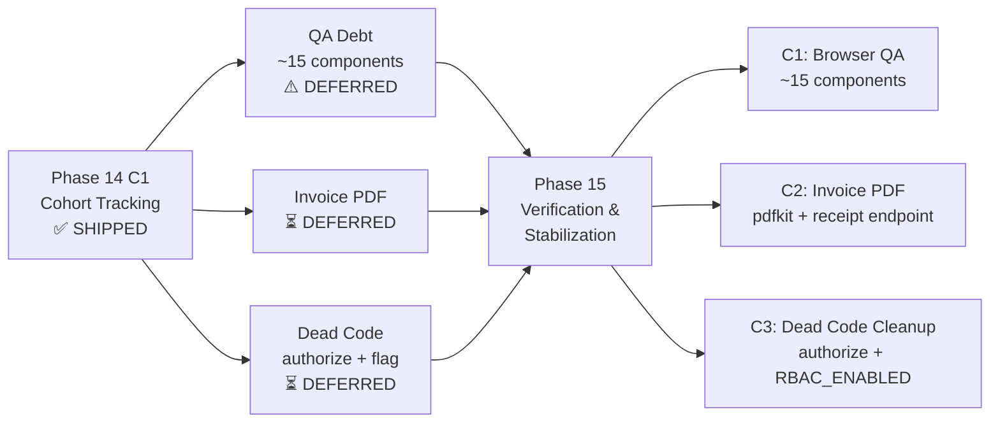
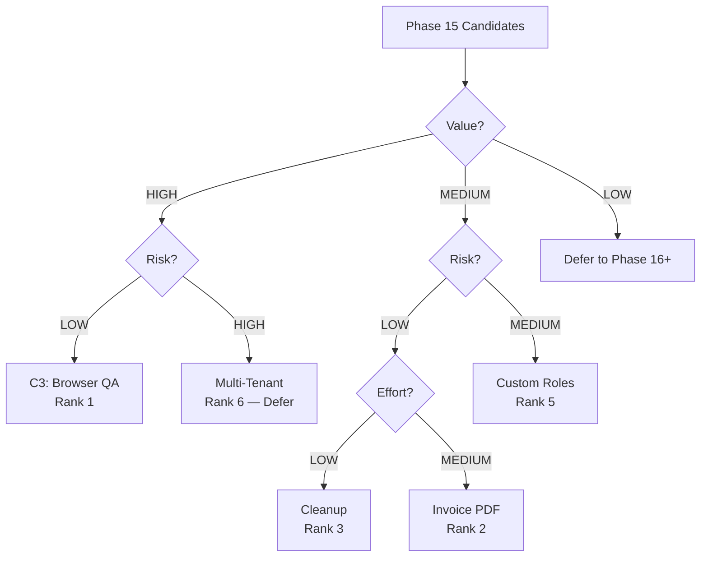
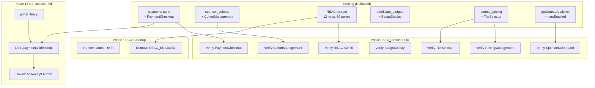
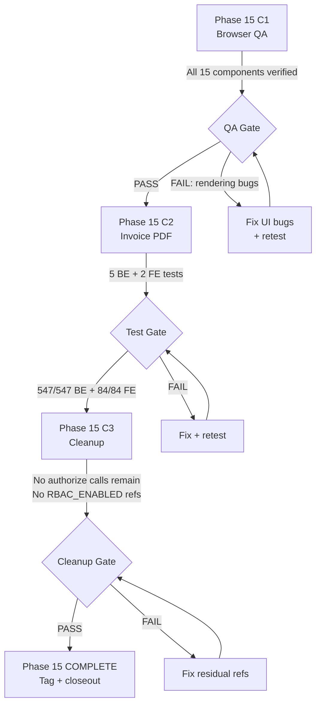

# Phase 14 Release Closeout + Phase 15 Kickoff

**Date:** 2026-08-05
**Baseline:** 624 total tests (542 backend + 82 frontend)
**Tag:** `phase14-c1-complete-2026-08-05`
**Commit:** `3634c92` (merge) / `d3f11df` (feature)

---

## Phase 14 Release Closeout

### Shipped Features (C1 — Cohort Completion Tracking)

| Feature | Detail |
|---------|--------|
| Per-member progress tracking | `lessonProgress` (0-100%), `meetsRequirements`, `certificateStatus` (none/badge/nft) |
| Aggregate completion stats | `completedCount`, `certifiedCount`, `avgLessonProgress` in `CohortCompletionStats` |
| SponsorDashboard tiersEnabled fix | Replaced hardcoded `'both'` with actual `tiersEnabled` from `getCourseAnalytics()` via LEFT JOIN `course_pricing` |
| Progress bars in CohortManagement | Visual progress bar per member, green when requirements met, blue otherwise |
| Certificate indicators | NFT (purple badge), Badge (green badge), or dash for none |
| Aggregate stats panel | "Completed: X/Y", "Certified: X/Y", "Avg Progress: Z%" above member table |

**Files changed:** 11 (+444/-22)
**New tests:** 5 backend (COH-T1–T5) + 3 frontend (COH-F7–F9) = 8 total

### Verification Summary

| Gate | Result |
|------|--------|
| Backend tests | 542/542 PASS |
| Frontend tests | 82/82 PASS |
| TypeScript compilation | PASS (no `tsc --noEmit` errors) |
| Merge to main | DONE (`3634c92`) |
| Tag | DONE (`phase14-c1-complete-2026-08-05`) |
| Manual browser QA | DEFERRED — accumulated QA debt spans P11–P14 |

### Rollback Note

**Safe rollback:** `git revert 3634c92` or `git reset --hard phase13-c1-complete-2026-08-05`

Phase 14 C1 adds fields to existing API responses (backward-compatible). No schema migrations. No new tables. Frontend changes are purely additive (new columns/stats in CohortManagement). Reverting removes completion display but does not break any existing functionality.

### Manual QA Status

**NOT DONE.** Manual browser QA has been deferred since Phase 10. The accumulated QA debt now spans:
- Phase 11 C2: TierSelector, BadgeDisplay, AdminCertificates tier column
- Phase 11 C3: CohortManagement (create/list/add members)
- Phase 12B: RBAC Admin Panel
- Phase 12 C1: PricingManagement (Stellar fields), PaymentCheckout (Paystack/Stellar)
- Phase 13 C1: All admin routes (RBAC migration — behavioral, not visual)
- Phase 14 C1: SponsorDashboard completion bars, CohortManagement progress/cert columns

**~15 components** require manual browser verification. This is the highest-priority item for Phase 15.

### Phase 14 Deferred Items

| ID | Item | Value | Effort | Status |
|----|------|-------|--------|--------|
| C2 | Invoice/receipt PDF generation | M | M | Carry to Phase 15 |
| C3 | Browser QA sweep (~15 components) | H | L | Carry to Phase 15 |
| D6 | `authorize()` dead code removal | L | L | Cleanup backlog |
| D7 | `RBAC_ENABLED` feature flag cleanup | L | L | Cleanup backlog |

---

## Phase 15 Kickoff

### Why This Phase Exists

Phase 14 shipped cohort tracking but deferred browser QA and PDF invoices. The LMS now has 624 automated tests but zero manual browser verification since Phase 10. Before adding more features, we need to verify what's already shipped works in a real browser. Phase 15 addresses this QA gap and decides which deferred features proceed.

### Scope

Phase 15 should focus on **verification and stabilization**, not major new features. The accumulated QA debt is the priority. Additional candidates are ranked below.

### Non-Goals

- No new database tables or schema migrations
- No multi-tenant architecture (too large, requires separate design cycle)
- No new RBAC permissions
- No deployment/push to production (separate decision)

---

## Candidate Ranking

| Rank | ID | Candidate | Value | Risk | Effort | Rationale |
|------|-----|-----------|-------|------|--------|-----------|
| **1** | **C3** | **Browser QA sweep** | **H** | **L** | **L** | 15 components untested in browser since P10. Highest value-to-effort ratio. Blocks production confidence. |
| **2** | **C2** | **Invoice/receipt PDF** | **M** | **L** | **M** | Sponsor-facing feature. Deferred twice (P13→P14→P15). Clean dependency on existing `payments` table. |
| **3** | **D6+D7** | **Dead code cleanup** | **L** | **L** | **L** | Remove `authorize()` function + `RBAC_ENABLED` flag. Reduces confusion for future developers. |
| **4** | **A8** | **Payment analytics dashboard** | **M** | **L** | **M** | Admin visibility into payment trends. Nice-to-have, not blocking. |
| **5** | **CR** | **Custom user roles** | **M** | **M** | **M** | Admin-created roles with custom permissions. RBAC system supports it; needs UI + API + validation. |
| **6** | **MT** | **Multi-tenant architecture** | **H** | **H** | **H** | Tenant isolation, per-tenant lecturers. Requires separate design phase. Defer to Phase 16+. |

### Recommended Phase 15 Scope

**C3 (Browser QA) + C2 (Invoice PDF) + D6+D7 (Cleanup)**

This keeps Phase 15 focused on stabilization and delivers one deferred feature (invoices) that sponsors are waiting for.

---

## Mermaid Diagrams

### Phase 14 → Phase 15 Handoff Flow



### Candidate Ranking Flow



### Dependency Map



### Risk / Test Gate Flow



---

## To-Do Lists

### Candidate Analysis Checklist

- [x] C1 (Cohort Tracking) — SHIPPED in Phase 14
- [ ] C2 (Invoice PDF) — Spec exists in P13 closeout; needs pdfkit validation
- [ ] C3 (Browser QA) — Component list defined; needs execution
- [ ] D6+D7 (Cleanup) — grep for `authorize(` and `RBAC_ENABLED` to scope
- [ ] A8 (Payment Analytics) — Assess value vs. Phase 15 scope
- [ ] CR (Custom Roles) — Assess RBAC extension complexity
- [ ] MT (Multi-Tenant) — Confirm deferral to Phase 16+

### Dependency Checklist

- [ ] `payments` table has all fields for invoice generation (amount, currency, method, reference, confirmed_at)
- [ ] `pdfkit` or alternative PDF library available in Node.js environment
- [ ] `billing.view_own` + `billing.view_all` permissions exist for receipt access control
- [ ] `getCourseAnalytics()` returns `tiersEnabled` (confirmed in Phase 14 C1)
- [ ] No cross-service dependency between Browser QA and Invoice PDF (independent)
- [ ] Cleanup (D6+D7) has no downstream dependencies (safe to execute last)

### Risk Checklist

- [ ] **QA findings may require code changes** — Browser QA might reveal rendering bugs that need fixes, expanding scope
- [ ] **pdfkit compatibility** — Verify pdfkit works in Docker/Node.js container environment
- [ ] **PDF branding decisions** — Receipt template design may need stakeholder input
- [ ] **80+ unpushed commits** — Remote `origin/main` is significantly behind local
- [ ] **`authorize()` removal** — Verify no dynamic/computed calls exist beyond static `requirePermission()` replacements
- [ ] **Container rebuild required** — Frontend changes need `docker compose build web` for production

### Test Strategy Checklist

- [ ] Define acceptance criteria for each Browser QA component
- [ ] Write invoice PDF test cases (5 backend + 2 frontend)
- [ ] Define regression scope (existing 624 tests must remain green)
- [ ] Plan manual QA execution order (dependency-ordered)
- [ ] Define "done" criteria for cleanup (zero `authorize(` in routes, zero `RBAC_ENABLED` in code)

### Handoff Checklist

- [x] Phase 14 C1 merged and tagged
- [x] Test counts verified (542 BE + 82 FE)
- [x] Closeout document written
- [ ] Phase 15 spec approved
- [ ] Phase 15 implementation plan written
- [ ] Phase 15 worktree/branch created

---

## Test Strategy

### Phase 15 C1: Browser QA (Manual)

No new automated tests. Manual verification checklist:

| # | Component | Route | Checks |
|---|-----------|-------|--------|
| 1 | PricingManagement | /admin/pricing | Stellar price fields render, save, update |
| 2 | PaymentCheckout (Paystack) | /courses/:id/apply | Redirect to Paystack, return handling |
| 3 | PaymentCheckout (Stellar) | /courses/:id/apply | Wallet address + memo display |
| 4 | RBAC Admin Panel (roles) | /admin/rbac | Role list, role detail, role-permission matrix |
| 5 | RBAC Admin Panel (permissions) | /admin/rbac | Permission categories, grant/revoke |
| 6 | CohortManagement (CRUD) | /admin/sponsor → Cohorts | Create, list, expand, add members, remove |
| 7 | CohortManagement (progress) | /admin/sponsor → Cohorts | Progress bars, cert indicators, stats panel |
| 8 | TierSelector | /courses/:id/apply | Free/paid radio, tier availability |
| 9 | BadgeDisplay | /certificates | SVG badge render, download |
| 10 | SponsorDashboard | /admin/sponsor | Course cards, sponsor groups, CSV export |
| 11 | AdminCertificates | /admin/certificates | Tier column, approve/reject/mint |
| 12 | InlineQuizTaker | /courses/:id | Quiz render, submit, auto-complete |
| 13 | Audio playback | /courses/:id | Play, pause, resume position, progress save |
| 14 | Student payment history | /payments/mine | Payment list, status badges |
| 15 | Announcements | /announcements | Create, list, course-filtered |

**Acceptance criteria:** Each component renders without console errors, interactive elements function, data displays correctly.

### Phase 15 C2: Invoice PDF (Automated)

**Backend tests (5):**

| ID | Test | Expected |
|----|------|----------|
| INV-1 | GET /payments/:id/receipt returns PDF for confirmed payment | 200 + `application/pdf` content-type |
| INV-2 | GET /payments/:id/receipt returns 404 for pending payment | 404 |
| INV-3 | GET /payments/:id/receipt returns 403 if not owner and not admin | 403 |
| INV-4 | PDF response has Content-Disposition attachment header | header contains `filename="receipt-*.pdf"` |
| INV-5 | Receipt PDF contains required fields (amount, course, date, reference) | Buffer contains expected strings |

**Frontend tests (2):**

| ID | Test | Expected |
|----|------|----------|
| INV-F1 | Payment history shows "Download Receipt" link for confirmed payments | link element present |
| INV-F2 | No download link for pending payments | link element absent |

**Regression:** All 624 existing tests must remain green. Target: 549/549 BE + 84/84 FE = 633 total.

### Phase 15 C3: Cleanup (Verification-only)

**Acceptance criteria:**
- `grep -r 'authorize(' src/routes/` returns 0 results
- `grep -r 'RBAC_ENABLED' src/` returns 0 results (except comments/docs)
- All 633 tests still pass after cleanup

---

## Risk Notes

### Key Assumptions

1. **pdfkit works in Docker container** — Node.js 22 + Alpine. May need `canvas` native deps if using images.
2. **Browser QA won't reveal blocking bugs** — If it does, scope expands. Mitigated by doing QA first (C1).
3. **No stakeholder input needed for receipt template** — Use minimal template (course name, amount, date, reference).
4. **`authorize()` is truly dead code** — Grep confirms no route files import it anymore. Only `auth.ts` exports it.
5. **80+ unpushed commits are acceptable** — Production push is a separate decision.

### Potential Coupling Risks

| Risk | Impact | Mitigation |
|------|--------|------------|
| `cohortService.getCohort()` is O(members × items) | Slow for large cohorts (>100 members) | Acceptable for now; add caching in Phase 16 if needed |
| `payments.ts` is 637 lines | Hard to navigate, increasing complexity | Consider splitting in Phase 15 C3 cleanup |
| Receipt endpoint shares `payments` table with Paystack/Stellar | Schema changes to `payments` affect receipts | No schema changes planned |
| `getCourseAnalytics()` now JOINs `course_pricing` | Slightly slower analytics query | Acceptable; single LEFT JOIN |

---

## Handoff Note

### What Is Released (Phase 14 C1)

- **Cohort completion tracking:** Per-member lesson progress, requirements status, certificate status
- **Aggregate stats:** Completed count, certified count, average progress
- **SponsorDashboard fix:** `tiersEnabled` sourced from `course_pricing` via analytics API
- **CohortManagement UI:** Progress bars, certificate indicators, stats panel
- **Types extended:** Backend `CohortMemberDetail` + `CohortCompletionStats`; Frontend `CohortMemberDetail` + `CohortCompletionStats` in `api.ts`

### What Phase 15 Should Consume

- **Existing `payments` table** — All fields needed for invoice PDF are present
- **Existing RBAC permissions** — `billing.view_own`, `billing.view_all` for receipt access
- **Existing component list** — 15 components identified for browser QA
- **Existing `authorize()` export** — Dead code to be removed in cleanup
- **Existing `RBAC_ENABLED` flag** — No longer checked in routes, safe to remove

---

## /loop Workflow

### /loop assess
```
Verify Phase 14 closeout state:
- 542/542 BE tests pass
- 82/82 FE tests pass
- Tag phase14-c1-complete-2026-08-05 exists
- No open Phase 14 items except C2/C3 (carried to Phase 15)
```

### /loop plan
```
Phase 15 scope:
- C1: Browser QA sweep (15 components, manual, ~2 hours)
- C2: Invoice/receipt PDF (pdfkit, 5 BE + 2 FE tests, ~3 hours)
- C3: Dead code cleanup (authorize + RBAC_ENABLED, ~30 min)
- Target: 633 total tests (549 BE + 84 FE)
```

### /loop review
```
Review checklist:
- [ ] All 15 browser QA components verified
- [ ] Invoice PDF endpoint works with confirmed payments
- [ ] Receipt download button renders in payment history
- [ ] authorize() removed from auth.ts export
- [ ] RBAC_ENABLED removed from codebase
- [ ] 633/633 tests pass
```

### /loop defer
```
Deferred to Phase 16+:
- Multi-tenant architecture (H value, H risk, H effort)
- Custom user roles (M value, M risk, M effort)
- Payment analytics dashboard (M value, L risk, M effort)
- Quiz analytics CSV export (L value, L risk, M effort)
- Cohort performance caching (if >100 member cohorts appear)
```

---

## Final Recommendation

**PHASE 15 SPEC READY**

Phase 14 is cleanly closed. Phase 15 scope is bounded (Browser QA + Invoice PDF + Cleanup). Dependencies are explicit, risks are low, and the test strategy is defined. The next session can start writing the Phase 15 C1 spec (Browser QA checklist) immediately.

**Exact next action:** Write Phase 15 C1 spec — a structured browser QA checklist for all 15 components with pass/fail criteria, then execute manually.
