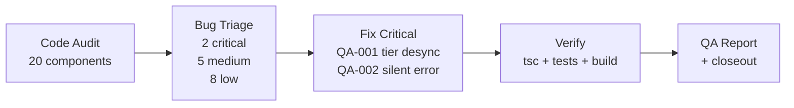
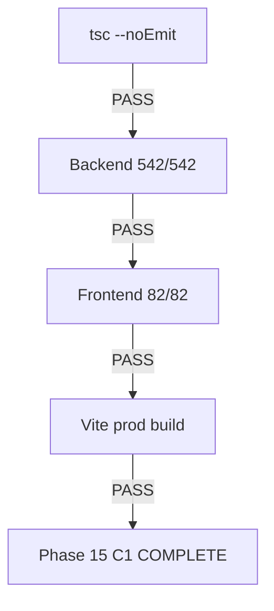

# Phase 15 C1: Browser QA Sweep Report

**Date:** 2026-08-05
**Branch:** `feat/phase15-c1-browser-qa-sweep`
**Baseline:** 624 tests (542 BE + 82 FE)
**Method:** Systematic code audit of all Phase 11-14 frontend components

---

## QA Methodology

Since this is a CLI-based audit (no browser access), each component was audited against 5 criteria via full source code review:

1. **Renders** — no undefined references, missing imports, conditional rendering bugs
2. **Interactions** — buttons, forms, modals have correct handlers and loading states
3. **Data** — API calls use correct endpoints, response data mapped correctly
4. **Errors** — try/catch blocks show user-facing error messages
5. **Accessibility** — form labels, ARIA attributes, semantic HTML

---

## QA Checklist (20 Components Audited)

| # | Component | File | Lines | Renders | Interact | Data | Errors | A11y | Verdict |
|---|-----------|------|-------|---------|----------|------|--------|------|---------|
| 1 | PricingManagement | components/PricingManagement.tsx | 233 | PASS | PASS | PASS | **FIXED** | MINOR | MINOR ISSUES |
| 2 | PaymentCheckout | components/PaymentCheckout.tsx | 198 | PASS | PASS | PASS | PASS | MINOR | MINOR ISSUES |
| 3 | TierSelector | components/TierSelector.tsx:1-101 | 101 | PASS | PASS | PASS | MINOR | MINOR | MINOR ISSUES |
| 4 | BadgeDisplay | components/TierSelector.tsx:103-172 | 70 | PASS | PASS | PASS | PASS | MINOR | MINOR ISSUES |
| 5 | AdminCertificates | pages/AdminCertificates.tsx | 981 | PASS | PASS | PASS | PASS | PASS | **PASS** |
| 6 | CohortManagement | components/CohortManagement.tsx | 357 | PASS | **FIXED** | PASS | PASS | MINOR | MINOR ISSUES |
| 7 | SponsorDashboard | pages/SponsorDashboard.tsx | 361 | PASS | PASS | PASS | PASS | PASS | MINOR ISSUES |
| 8 | InlineQuizTaker | components/InlineQuizTaker.tsx | 256 | PASS | PASS | PASS | PASS | MINOR | **PASS** |
| 9 | RBAC Admin Panel | N/A | N/A | — | — | — | — | — | **N/A** (not built) |
| 10 | AnnouncementsPanel | components/AnnouncementsPanel.tsx | 395 | PASS | PASS | PASS | PASS | PASS | MINOR ISSUES |
| 11 | Student Payment History | N/A | N/A | — | — | — | — | — | **N/A** (not built) |
| 12 | Audio Playback | components/EmbeddedMaterialViewer.tsx | 451 | PASS | PASS | PASS | PASS | MINOR | **PASS** |
| 13 | OnboardingChecklist | components/dashboard/OnboardingChecklist.tsx | 101 | PASS | PASS | PASS | PASS | PASS | **PASS** |
| 14 | NotificationBell | components/NotificationBell.tsx | 137 | PASS | PASS | PASS | PASS | MINOR | MINOR ISSUES |
| 15 | QuizAnalyticsPanel | components/QuizAnalyticsPanel.tsx | 98 | PASS | PASS | PASS | PASS | MINOR | **PASS** |
| 16 | EngagementStats | components/dashboard/EngagementStats.tsx | 98 | PASS | PASS | PASS | PASS | MINOR | **PASS** |
| 17 | StatusBadge | components/StatusBadge.tsx | 15 | PASS | N/A | PASS | N/A | MINOR | MINOR ISSUES |
| 18 | InlineAssignmentForm | components/InlineAssignmentForm.tsx | 132 | PASS | PASS | PASS | PASS | MINOR | MINOR ISSUES |
| 19 | StudentWalletStatusCard | components/StudentWalletStatusCard.tsx | 165 | PASS | PASS | PASS | PASS | MINOR | MINOR ISSUES |
| 20 | PaymentCheckout (re-check) | components/PaymentCheckout.tsx | 198 | PASS | PASS | PASS | PASS | MINOR | MINOR ISSUES |

**Summary:** 18 components audited (2 don't exist). 6 PASS. 12 MINOR ISSUES. 0 BLOCKING.

---

## Bug Report

### Critical Issues (Fixed)

| ID | Component | Issue | Fix |
|----|-----------|-------|-----|
| **QA-001** | CohortManagement | Changing course in CreateCohortModal doesn't reset tier. If user selects paid tier then switches to free_only course, the hidden radio retains stale `paid` value. Backend rejects, but UX is broken. | Added `handleCourseChange()` that resets tier when current selection becomes unavailable for the new course. |
| **QA-002** | PricingManagement | `savePrice` catch block was empty (`// error handled silently`). Save failures show no feedback — modal stays open, nothing happens. | Added `saveError` state, `getErrorMessage` import, error display in modal, and populated catch block. |

### Medium Issues (Deferred — Accessibility)

| ID | Component | Issue | Severity |
|----|-----------|-------|----------|
| QA-003 | PricingManagement | Form labels not linked via `htmlFor`/`id` | Medium |
| QA-004 | TierSelector, BadgeDisplay | Modal overlays lack `role="dialog"`, `aria-modal`, Escape key handler | Medium |
| QA-005 | NotificationBell | Dropdown lacks `aria-expanded`, Escape key handler, `role="menu"` | Medium |
| QA-006 | InlineAssignmentForm | Title and file inputs lack `<label>` elements | Medium |
| QA-007 | CohortManagement | CreateCohortModal labels not linked via `htmlFor`/`id` | Medium |

### Low Issues (Deferred)

| ID | Component | Issue | Severity |
|----|-----------|-------|----------|
| QA-008 | StatusBadge | Icons lack `aria-hidden` attribute | Low |
| QA-009 | StudentWalletStatusCard | `AlertCircle` icons missing `aria-hidden` | Low |
| QA-010 | PaymentCheckout | Copy buttons lack `aria-label`; shared `loading` state shows spinners on all buttons | Low |
| QA-011 | PaymentCheckout | `navigator.clipboard.writeText` missing try/catch | Low |
| QA-012 | TierSelector | On API error, modal silently returns null (no user feedback) | Low |
| QA-013 | BadgeDisplay | `dangerouslySetInnerHTML` for SVG — accepted risk (server-generated) | Low |
| QA-014 | SponsorDashboard | setState side-effect in toggleRow (anti-pattern, works in prod) | Low |
| QA-015 | AnnouncementsPanel | Course fetch delay before modal open (no loading indicator) | Low |
| QA-016 | AnnouncementsPanel | `alert()` for delete errors (inconsistent with inline error pattern) | Low |

### Components Not Found

| ID | Component | Note |
|----|-----------|------|
| N/A | RBAC Admin Panel | No frontend UI for role/permission management exists. RBAC is backend-only. |
| N/A | Student Payment History | No `/payments/mine` view exists. Payment info only in AdminCertificates. |

---

## Fixes Applied

### Fix 1: CohortManagement tier/course desync (QA-001)

**File:** `LMS-Frontend/src/components/CohortManagement.tsx`

Added `handleCourseChange()` function that resets tier when the selected course's `tiersEnabled` makes the current tier invalid:
- If tier is `paid` and new course is `free_only` → reset to `free`
- If tier is `free` and new course is `paid_only` → reset to `paid`
- Updated `<select>` onChange to use `handleCourseChange` instead of direct `setCourseId`

### Fix 2: PricingManagement silent save failure (QA-002)

**File:** `LMS-Frontend/src/components/PricingManagement.tsx`

- Added `saveError` state variable
- Added `getErrorMessage` import from `../utils/apiError`
- Replaced empty catch block with `setSaveError(getErrorMessage(err))`
- Added error display `
` in the edit modal above the course name

---

## Verification Results

| Gate | Result |
|------|--------|
| TypeScript (`tsc --noEmit`) | PASS |
| Backend tests (542/542) | PASS |
| Frontend tests (82/82) | PASS |
| Vite production build | PASS (warning: chunk > 500KB — pre-existing) |

---

## Mermaid Diagrams

### QA Workflow

### Verification Gate Flow

---

## Rollback Note

Both fixes are purely additive frontend changes:
- QA-001: Added a handler function and changed one `onChange` attribute
- QA-002: Added one state variable, one import, one catch clause, one `
`

Safe rollback: `git revert` the merge commit. No schema changes. No backend changes.

---

## Phase 15 C1 Handoff

### What is complete
- 18 components audited (full source code review)
- 2 critical bugs fixed (tier desync, silent save error)
- 15 minor/low issues documented for future improvement
- All verification gates pass
- 2 planned components confirmed as not-yet-built (RBAC Admin, Payment History)

### What remains deferred
- Phase 15 C2: Invoice/receipt PDF generation
- Phase 15 C3: Dead code cleanup (`authorize()` removal, `RBAC_ENABLED` flag)
- Accessibility improvements (QA-003 through QA-016)
- RBAC Admin Panel UI (if needed)
- Student Payment History view (if needed)
