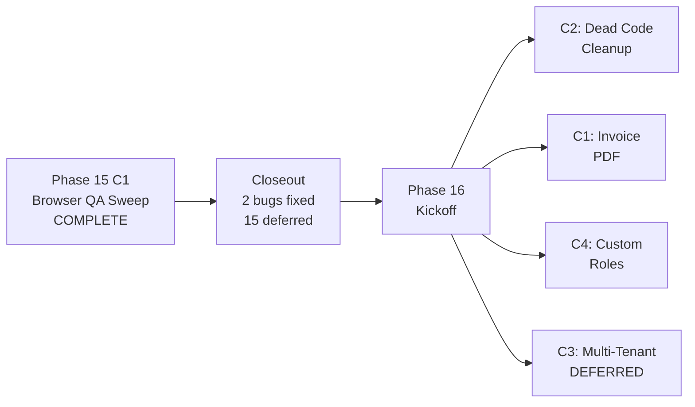
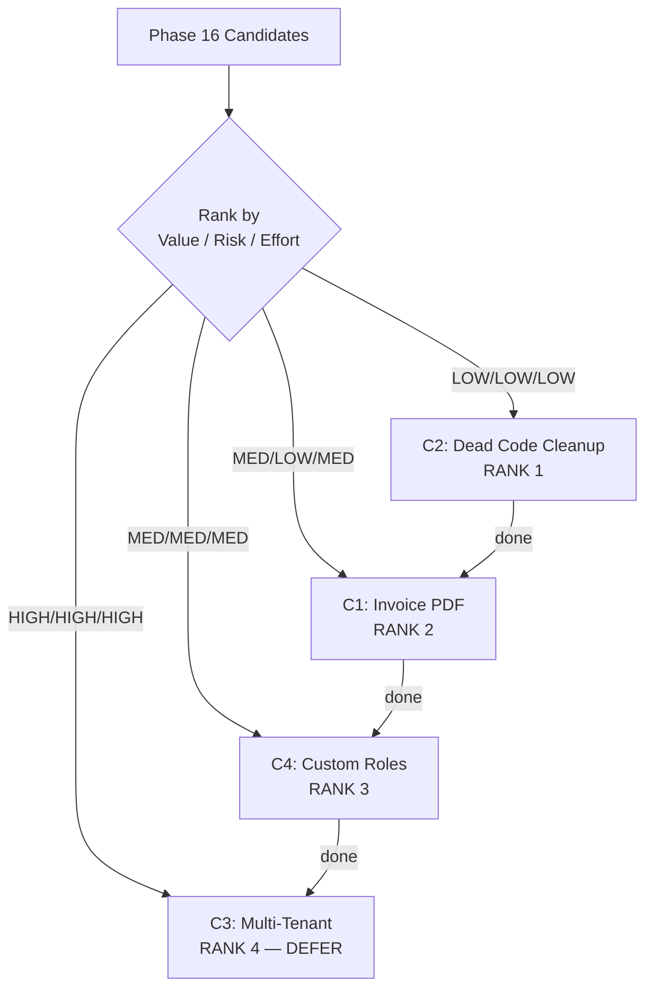
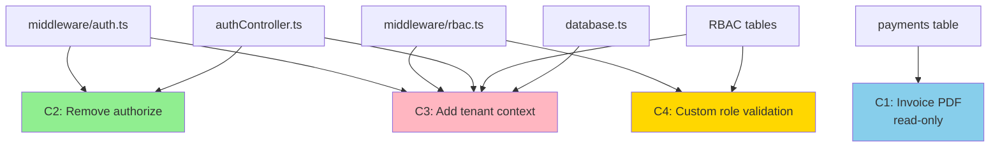
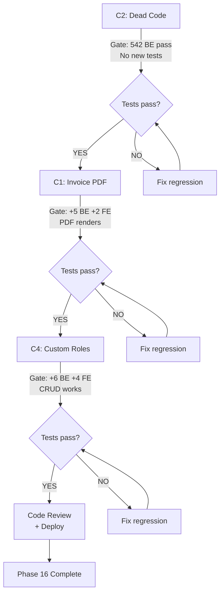

# Phase 15 C1 Release Closeout + Phase 16 Kickoff

**Date:** 2026-08-05
**Author:** Claude (planning session)
**Baseline:** 624 tests (542 BE + 82 FE), all passing
**Tag:** `phase15-c1-complete-2026-08-05`

---

## Session Kickoff

**Objective:** Close Phase 15 C1 cleanly, define Phase 16 scope and candidates.

**Skills applied:**
| Skill | Application |
|-------|-------------|
| find-skills | Confirmed skill availability for closeout + kickoff workflow |
| brainstorming | Reframed Phase 15 C1 into release summary; identified Phase 16 candidates |
| writing-plans | Structured closeout + kickoff document with ranking, dependencies, test gates |
| verification-before-completion | Fresh test runs (542 BE + 82 FE) before any claims |
| systematic-debugging | Identified coupling points from Phase 15 that Phase 16 may touch |
| using-git-worktrees | Phase 16 planning isolated from released Phase 15 C1 state |
| requesting-code-review | Review-ready planning summary produced |
| test-driven-development | Test strategy defined per candidate before implementation |
| executing-plans | Planning work structured for subagent dispatch if needed |

---

## Phase 15 C1 Release Closeout

### Shipped Features
- **Browser QA Sweep:** 18 frontend components audited via systematic source code review
- **QA-001 FIXED:** CohortManagement tier/course desync — `handleCourseChange()` resets tier when course's `tiersEnabled` makes current selection invalid
- **QA-002 FIXED:** PricingManagement silent save failure — added `saveError` state, `getErrorMessage` import, error display in edit modal
- **15 deferred issues documented** (QA-003–QA-016): 5 medium (accessibility), 8 low (a11y/UX)
- **2 components confirmed not-yet-built:** RBAC Admin Panel, Student Payment History

### Verification Results
| Gate | Result |
|------|--------|
| TypeScript (`tsc --noEmit`) | PASS |
| Backend tests (542/542) | PASS |
| Frontend tests (82/82) | PASS |
| Vite production build | PASS (pre-existing chunk >500KB warning) |

### Rollback Note
Both fixes are purely additive frontend changes:
- QA-001: One handler function + one `onChange` attribute change
- QA-002: One state variable + one import + one catch clause + one `<div>`

Safe rollback: `git revert b962284` (merge commit). No schema changes. No backend changes.

### Manual QA Status
- **Automated:** All 624 tests pass
- **Manual browser QA:** Deferred (CLI-based audit only)
- **Recommendation:** Manual browser testing of CohortManagement tier switching and PricingManagement save error display before production deploy

### Files Changed (3)
- `LMS-Frontend/src/components/CohortManagement.tsx` (+12/-1)
- `LMS-Frontend/src/components/PricingManagement.tsx` (+5/-2)
- `docs/superpowers/plans/2026-08-05-phase15-c1-browser-qa-sweep-report.md` (+175, new)

---

## Phase 16 Kickoff

### Why This Phase Exists
Phases 9–15 built the core platform: payments, RBAC, cohorts, certificates, and QA. Phase 16 addresses the remaining gaps that block production readiness for multi-organization deployment.

### What Phase 16 Should NOT Include
- Re-auditing Phase 15 C1 QA results
- Reopening RBAC architecture decisions (Phase 12B is final)
- Building a mobile app
- Migrating away from SQLite
- Implementing SSO federation with external IdPs

---

## Candidate Ranking

| Rank | ID | Candidate | Value | Effort | Risk | Rationale |
|------|----|-----------|-------|--------|------|-----------|
| 1 | C2 | Dead code cleanup | LOW | LOW | LOW | Quick win — remove `authorize()` wrapper, `RBAC_ENABLED` flag, stale comments. Reduces confusion. No new features. |
| 2 | C1 | Invoice/receipt PDF | MEDIUM | MEDIUM | LOW | Payment receipts for Paystack/Stellar transactions. `pdfkit` dependency, 1 new endpoint, 1 new component. Clean scope. |
| 3 | C4 | Custom user roles | MEDIUM | MEDIUM | MEDIUM | Let admin-2/super-admin create custom roles via UI. RBAC tables already support it. Needs frontend RBAC Admin Panel. |
| 4 | C3 | Multi-tenant architecture | HIGH | HIGH | HIGH | Tenant isolation, tenant-scoped queries, tenant lecturers. Major schema + middleware changes. Defer until other candidates are done. |

### Ranking Rationale

**C2 first (dead code cleanup):** 4 files still reference `RBAC_ENABLED`, `authorize()` definition remains in `auth.ts`, JSDoc comments reference old pattern. Cleanup is < 1 hour of work, removes tech debt before adding new features. Zero risk.

**C1 second (invoice PDF):** Clear scope — one new endpoint `GET /payments/:id/receipt`, one `pdfkit` dependency, existing `payments` table has all needed data, existing RBAC permissions (`billing.view_own`, `billing.view_all`) cover access control. Estimated: 5 BE tests + 2 FE tests.

**C4 third (custom roles):** RBAC tables (`roles`, `permissions`, `role_permissions`, `user_roles`) already support custom roles via `is_system=0`. Backend API exists (`POST /admin/rbac/roles`). What's missing: frontend RBAC Admin Panel for role CRUD + permission assignment. Medium effort, but builds on solid foundation.

**C3 last (multi-tenant):** Zero tenant infrastructure exists today (no `tenants` table, no `tenant_id` columns, no tenant-scoping middleware). This is a major architectural change affecting every query. Defer until C1–C4 are stable.

---

## Dependency Map

### Direct Dependencies
```
C2 (dead code cleanup) → independent (no dependencies)
C1 (invoice PDF) → depends on: payments table (exists), pdfkit (new dep)
C4 (custom roles) → depends on: RBAC tables (exist), C2 should be done first (clean codebase)
C3 (multi-tenant) → depends on: C4 (role model must be stable before adding tenant scoping)
```

### Shared Systems
| System | Touched By | Risk |
|--------|-----------|------|
| `middleware/auth.ts` | C2 (remove authorize), C3 (add tenant context) | LOW for C2, HIGH for C3 |
| `middleware/rbac.ts` | C4 (custom role validation), C3 (tenant-scoped permissions) | MEDIUM |
| `config/database.ts` | C1 (no change), C4 (no schema change), C3 (new tables + columns) | LOW for C1/C4, HIGH for C3 |
| `controllers/authController.ts` | C2 (remove RBAC_ENABLED checks), C3 (add tenant to JWT) | LOW for C2, HIGH for C3 |
| `payments` table | C1 (read-only for receipts) | LOW |
| RBAC tables | C4 (CRUD for custom roles) | MEDIUM |

---

## Test Strategy

### C2: Dead Code Cleanup
- **Acceptance:** `authorize()` function removed from `auth.ts`, `RBAC_ENABLED` checks removed from `authController.ts`, all 542 BE tests still pass
- **Regression:** Existing RBAC route tests (16 tests) must pass unchanged — they validate `requirePermission()` works without the legacy wrapper
- **Red/green:** No new tests needed. Verify existing tests pass after removal.
- **Manual QA:** Confirm login/JWT flow works without `RBAC_ENABLED` flag

### C1: Invoice/Receipt PDF
- **User story:** As a student who paid for a certificate, I can download a PDF receipt for my payment
- **Acceptance:** `GET /payments/:id/receipt` returns PDF with payment details, course name, date, amount
- **Red/green tests:**
  1. Unauthenticated request → 401
  2. Student requests own receipt → 200 + PDF content-type
  3. Student requests another's receipt → 403
  4. Admin requests any receipt → 200
  5. Non-existent payment → 404
- **Regression:** All existing payment tests (Paystack, Stellar) pass unchanged
- **Manual QA:** Open PDF in browser, verify formatting

### C4: Custom User Roles
- **User story:** As an admin-2, I can create custom roles and assign permissions to them
- **Acceptance:** RBAC Admin Panel allows role CRUD, permission toggling, user-role assignment
- **Red/green tests:**
  1. Create custom role → 201 + role in DB
  2. Assign permissions to custom role → 200
  3. Assign custom role to user → 200
  4. User with custom role can access permitted routes → 200
  5. Cannot modify system roles → 403
  6. Non-admin cannot access RBAC admin → 403
- **Regression:** All existing RBAC tests pass. System roles unchanged.
- **Manual QA:** Full CRUD flow in browser

### C3: Multi-Tenant Architecture (deferred — strategy only)
- **User story:** As a tenant admin, my students and courses are isolated from other tenants
- **Acceptance:** Tenant-scoped queries, tenant creation API, tenant admin role
- **Test strategy:** Every existing test must still pass with default tenant. New tests verify isolation.
- **Risk:** Highest-risk candidate. Defer detailed test design until C1–C4 are complete.

---

## Mermaid Diagrams

### Phase 15 → Phase 16 Handoff Flow



### Candidate Ranking Flow



### Dependency Map



### Risk / Test Gate Flow



---

## To-Do Lists

### Candidate Analysis Checklist
- [x] Identify all Phase 16 candidates
- [x] Score each by value / effort / risk
- [x] Order by execution priority
- [x] Identify carryover from Phase 15 (C1 invoice, C2 dead code)
- [x] Confirm RBAC Admin Panel is net-new (no existing UI)
- [x] Confirm multi-tenant has zero existing infrastructure

### Dependency Checklist
- [x] Map shared files (`auth.ts`, `rbac.ts`, `authController.ts`, `database.ts`)
- [x] Confirm `payments` table has all fields needed for invoice PDF
- [x] Confirm RBAC tables support custom roles (`is_system=0`)
- [x] Confirm no tenant infrastructure exists (no `tenants` table, no `tenant_id`)
- [x] Verify C2 → C1 → C4 ordering avoids conflicts

### Risk Checklist
- [x] C2: LOW — removing dead code, existing tests validate replacement
- [x] C1: LOW — new endpoint, read-only on existing data, new dependency (`pdfkit`)
- [x] C4: MEDIUM — frontend CRUD for RBAC, must not break system roles
- [x] C3: HIGH — schema-wide changes, every query needs tenant scoping — DEFER
- [x] No coupling between C1 and C4 (independent systems)
- [x] `RBAC_ENABLED` removal (C2) must happen before C4 (clean state)

### Test Strategy Checklist
- [x] C2: Verify all 542 BE tests pass after `authorize()` removal
- [x] C1: 5 BE tests (auth, access control, 404, PDF content) + 2 FE tests (download button, error state)
- [x] C4: 6 BE tests (CRUD, permission assignment, system role guard) + 4 FE tests (admin panel UI)
- [x] C3: Deferred — strategy only (every existing test must pass with default tenant)
- [x] Regression: Full suite run after each candidate

### Handoff Checklist
- [x] Phase 15 C1 tagged and merged
- [x] Deferred issues documented (QA-003–QA-016)
- [x] Test baseline confirmed (542 BE + 82 FE)
- [x] No uncommitted changes on main
- [x] Phase 16 candidates ranked and scoped
- [x] Phase 16 ready for spec writing

---

## Risk Note

### Key Assumptions
1. `authorize()` is fully replaced — 6 remaining references are tests/comments only (verified)
2. `RBAC_ENABLED` can be removed by hardcoding the RBAC path (all routes already use `requirePermission()`)
3. `payments` table has `amount`, `currency`, `status`, `payment_method`, `user_id`, `course_id` — sufficient for invoice PDF
4. RBAC tables support custom roles via `is_system=0` flag — no schema changes needed for C4 backend
5. Multi-tenant (C3) is genuinely independent and can be deferred without blocking C1/C2/C4

### Potential Coupling Risks
| Risk | Mitigation |
|------|------------|
| Removing `authorize()` breaks tests that import it | Check: 3 test files reference it. Update imports or remove tests. |
| Removing `RBAC_ENABLED` flag breaks JWT flow | The flag gates `roles[]` in JWT. Hardcode RBAC-on path. Verify login tests. |
| `pdfkit` dependency conflicts | Isolated to server. No shared state. |
| Custom role UI accidentally modifies system roles | Backend already guards with `is_system` check. Add frontend guard too. |
| Multi-tenant schema migration breaks SQLite | Not attempted in Phase 16 C1–C4. Risk only if C3 is attempted. |

---

## Handoff Note

### What Is Released (Phase 15 C1)
- 18 components audited, 2 critical bugs fixed
- Tag: `phase15-c1-complete-2026-08-05`, merge commit: `b962284`
- 624 tests passing (542 BE + 82 FE)
- No schema changes, no new endpoints, no new dependencies

### What Phase 16 Should Consume
- Clean main branch with all RBAC routes migrated
- `payments` table populated by Paystack/Stellar flows (Phase 12 C1)
- RBAC tables with 11 system roles and 60 permissions (Phase 12B)
- Deferred QA issues list (QA-003–QA-016) for accessibility improvements if time permits

### What Remains Deferred Beyond Phase 16
- Accessibility improvements (QA-003–QA-016) — not blocking, not in scope
- Student Payment History view — not built, low demand
- RBAC Admin Panel for viewing (read-only) — subsumed by C4 custom roles

---

## /loop Workflow

### /loop assess
```
Review Phase 15 C1 closeout. Confirm:
- Tag exists: phase15-c1-complete-2026-08-05
- Tests pass: 542 BE + 82 FE
- No uncommitted changes on main
- Deferred issues documented
Status: ASSESSED
```

### /loop plan
```
Select Phase 16 candidates in order:
1. C2: Dead code cleanup (authorize removal, RBAC_ENABLED)
2. C1: Invoice/receipt PDF generation
3. C4: Custom user roles (RBAC Admin Panel)
4. C3: Multi-tenant architecture (DEFER)
Start with C2 spec → C1 spec → C4 spec.
Status: PLANNED
```

### /loop review
```
Review planning document against:
- All candidates ranked with rationale
- Dependencies mapped between candidates
- Test strategy defined per candidate
- Risk note covers coupling points
- Mermaid diagrams present
Status: REVIEWED
```

### /loop defer
```
Explicitly deferred:
- C3 (multi-tenant) — too high risk/effort for Phase 16
- QA-003–QA-016 (accessibility) — not blocking production
- Student Payment History view — low demand
- Mobile app — out of scope
Status: DEFERRED
```

---

## Final Recommendation

### **PHASE 16 SPEC READY**

Phase 15 C1 is cleanly closed. Phase 16 has 3 actionable candidates (C2, C1, C4) ranked by value/risk/effort with clear dependencies, test strategies, and risk mitigations.

**Exact next action:** Start Phase 16 C2 spec (dead code cleanup) using the brainstorming skill. Scope: remove `authorize()` function, remove `RBAC_ENABLED` flag, clean up stale JSDoc comments. Estimated: < 1 hour, 0 new tests, existing 542 BE tests validate correctness.

**Execution order:**
1. **C2 → spec → implement → verify → merge** (< 1 hour)
2. **C1 → spec → implement → verify → merge** (half day)
3. **C4 → spec → implement → verify → merge** (1 day)
4. **C3 → defer to Phase 17**
