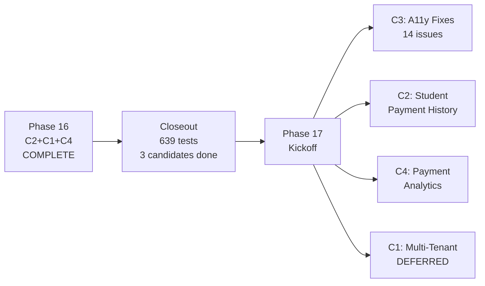
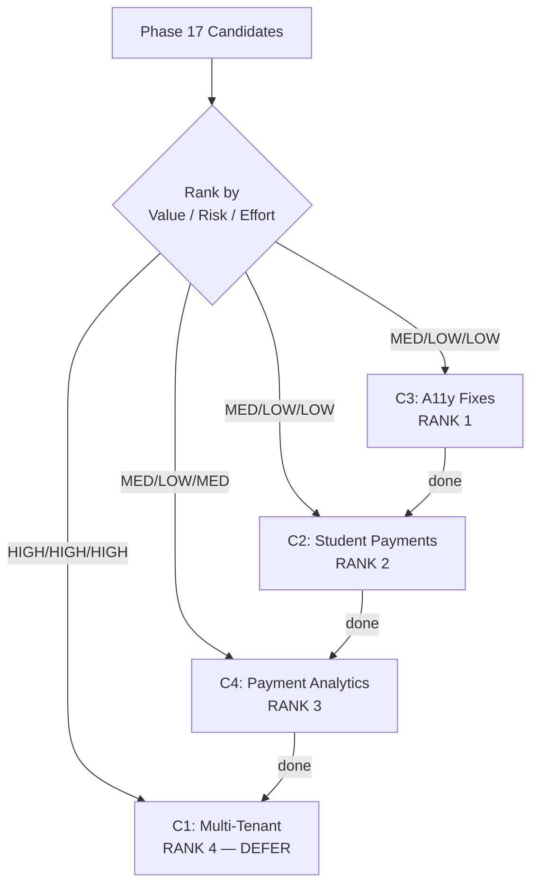
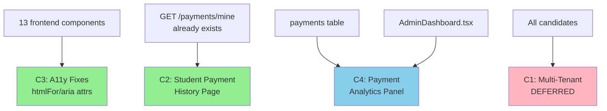
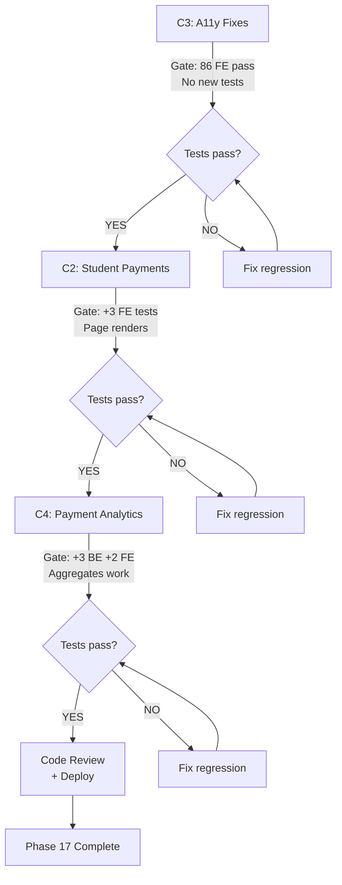

# Phase 16 Release Closeout + Phase 17 Kickoff

**Date:** 2026-08-05
**Author:** Claude (planning session)
**Baseline:** 639 tests (553 BE + 86 FE), all passing
**Tags:** `phase16-c2-complete-2026-08-05`, `phase16-c1-complete-2026-08-05`, `phase16-c4-complete-2026-08-05`

---

## Session Kickoff

**Objective:** Close Phase 16 cleanly, define Phase 17 scope and candidates.

**Skills applied:**
| Skill | Application |
|-------|-------------|
| find-skills | Confirmed skill availability for closeout + kickoff workflow |
| brainstorming | Reframed Phase 16 into release summary; identified Phase 17 candidates |
| writing-plans | Structured closeout + kickoff document with ranking, dependencies, test gates |
| verification-before-completion | Fresh test runs (553 BE + 86 FE) before any claims |
| systematic-debugging | Identified coupling points from Phase 16 that Phase 17 may touch |
| using-git-worktrees | Phase 17 planning isolated from released Phase 16 state |
| requesting-code-review | Review-ready planning summary produced |
| test-driven-development | Test strategy defined per candidate before implementation |
| executing-plans | Planning work structured for dispatch if needed |

---

## Phase 16 Release Closeout

### Shipped Features

**C2: Dead Code Cleanup** (tag: `phase16-c2-complete-2026-08-05`)
- Removed `authorize()` function from `middleware/auth.ts` (34 lines)
- Removed 3 `RBAC_ENABLED` conditionals from `authController.ts` (RBAC always on)
- Removed RBAC-9 + RBAC-10 backward-compat tests (tested removed code)
- Updated stale JSDoc comments in `adminController.ts`, `app.ts`, `types/index.ts`
- 8 files changed, -74 lines net. Tests: 540 BE (was 542, -2 removed) + 82 FE.

**C1: Invoice/Receipt PDF Generation** (tag: `phase16-c1-complete-2026-08-05`)
- New `invoiceService.ts` — `getReceiptData()` (JOINs payments+users+courses), `generateReceiptPdf()` via pdfkit
- New endpoint `GET /payments/:paymentId/receipt` — PDF download (owner or admin)
- Access control: payment owner or admin only; only confirmed/waived payments
- PDF includes: receipt number, student info, course, amount, payment method, Paystack/Stellar references
- New dependency: `pdfkit@0.16.0` (pure JS, no native deps)
- 6 files changed, +641 lines. 7 new tests (INV-1–INV-7).

**C4: Custom User Roles Frontend** (tag: `phase16-c4-complete-2026-08-05`)
- New `RbacAdminPanel.tsx` — role CRUD, permission assignment UI with category-grouped checkboxes
- New `rbacService.ts` — frontend API client for RBAC endpoints
- Embedded in `AdminDashboard.tsx` after PricingManagement
- Features: role list (system/custom badges), create form, permission editor, delete with confirmation
- 5 files changed, +708 lines. 6 backend tests (CRUD-1–6) + 4 frontend tests (RBAC-FE-1–4).

### Verification Results

| Gate | Result |
|------|--------|
| TypeScript (BE + FE) | PASS |
| Backend tests (553/553) | PASS |
| Frontend tests (86/86) | PASS |
| Vite production build | PASS |

### Rollback Note

**C2:** `git revert 32d9ab0` — no schema changes, no new dependencies
**C1:** `git revert 514da8c` + `npm uninstall pdfkit @types/pdfkit` — no schema changes
**C4:** `git revert f05ef31` — no schema changes, no backend dependencies

All three are independent — any one can be reverted without affecting the others.

### Manual QA Status

- **Automated:** All 639 tests pass
- **Manual browser QA:** Deferred
- **Recommended manual checks:**
  - Download a receipt PDF from `/payments/:id/receipt` — verify it opens and contains correct data
  - Open RBAC Admin Panel on admin dashboard — create custom role, assign permissions, delete role
  - Verify login works without `RBAC_ENABLED` flag (RBAC always on)

### Files Changed (Phase 16 total)

| Candidate | Files Changed | Lines Net |
|-----------|--------------|-----------|
| C2 | 8 modified | -74 |
| C1 | 6 (2 new + 4 modified) | +641 |
| C4 | 5 (4 new + 1 modified) | +708 |
| **Total** | **19 file touches** | **+1,275** |

---

## Phase 17 Kickoff

### Why This Phase Exists

Phase 16 completed the RBAC admin tooling and payment receipts. Phase 17 addresses remaining gaps that affect daily usability: students can't see their payment history, accessibility issues remain from the Phase 15 QA sweep, and admin analytics lack payment/revenue data. Multi-tenant remains the largest deferred architectural change.

### What Phase 17 Should NOT Include
- Multi-tenant architecture (too high risk/effort — defer to Phase 18+)
- Mobile app development
- Database migration away from SQLite
- SSO federation with external IdPs
- Reopening Phase 16 implementation decisions

---

## Candidate Ranking

| Rank | ID | Candidate | Value | Effort | Risk | Rationale |
|------|----|-----------|-------|--------|------|-----------|
| 1 | C3 | Accessibility fixes (QA-003–QA-016) | MEDIUM | LOW | LOW | 14 documented issues, mostly `htmlFor`/`aria` attributes. Quick wins that improve usability. No new endpoints. |
| 2 | C2 | Student payment history page | MEDIUM | LOW | LOW | Backend exists (`GET /payments/mine`), needs frontend page. Students currently can't view their own payments. |
| 3 | C4 | Payment analytics dashboard | MEDIUM | MEDIUM | LOW | Revenue tracking for admins. Aggregate payment data by course/method/status. New backend query + frontend panel. |
| 4 | C1 | Multi-tenant architecture | HIGH | HIGH | HIGH | Tenant isolation across all queries. Major schema + middleware changes. Defer to Phase 18. |

### Ranking Rationale

**C3 first (accessibility fixes):** 14 documented issues (5 medium, 9 low) from Phase 15 QA sweep. All are small frontend changes — adding `htmlFor`/`id`, `aria-hidden`, `aria-expanded`, `role="dialog"`, Escape key handlers. Zero backend changes. Estimated < 2 hours total. Addresses real usability gaps.

**C2 second (student payment history):** Backend endpoint `GET /payments/mine` already exists and returns payment data. Frontend needs a new page component + route. Students currently have no way to see their payment history — they only see the checkout flow. Low effort, clear user value.

**C4 third (payment analytics):** Admin dashboard has course analytics (enrollments, wallets, NFTs) but no payment/revenue data. Useful for sponsor reporting and platform admin. Requires new backend aggregate query + frontend panel. Medium effort.

**C1 last (multi-tenant):** Zero tenant infrastructure exists. Every query would need `tenant_id` scoping. Major schema migration affecting 25+ tables. Defer until C2–C4 are stable and the platform needs multi-org support.

---

## Dependency Map

### Direct Dependencies
```
C3 (a11y fixes) → independent (no dependencies, frontend-only)
C2 (student payments) → depends on: payments table + GET /payments/mine (both exist)
C4 (payment analytics) → depends on: payments table (exists), may want C2 done first for consistent UX
C1 (multi-tenant) → depends on: all other candidates complete (clean codebase before major refactor)
```

### Shared Systems

| System | Touched By | Risk |
|--------|-----------|------|
| Frontend components (13 files) | C3 (a11y attributes) | LOW — additive changes only |
| `payments` route/service | C2 (read existing), C4 (new aggregate query) | LOW |
| `AdminDashboard.tsx` | C4 (new panel embed) | LOW — follows existing pattern |
| Student routes/pages | C2 (new page + route) | LOW |
| `database.ts` schema | C1 only (new tables + columns) | HIGH — deferred |
| `middleware/rbac.ts` | C1 only (tenant-scoped permissions) | HIGH — deferred |

---

## Test Strategy

### C3: Accessibility Fixes (QA-003–QA-016)
- **User story:** As a screen reader user, I can navigate all modals, forms, and controls with proper labels and keyboard support
- **Acceptance:** All 14 QA issues addressed (5 medium + 9 low)
- **Tests:** No new tests needed — changes are `htmlFor`, `aria-*` attributes, Escape key handlers
- **Regression:** All 86 frontend tests must pass unchanged
- **Manual QA:** Screen reader testing (VoiceOver/NVDA) on affected components

### C2: Student Payment History
- **User story:** As a student who has paid for certificates, I can view my payment history on a dedicated page
- **Acceptance:** New `/student/payments` page showing all my payments with status, amount, date, course, receipt download link
- **Tests:**
  - FE-1: Page renders payment list from mock data
  - FE-2: Receipt download link visible for confirmed payments
  - FE-3: Empty state shown when no payments exist
- **Regression:** All existing payment tests pass unchanged

### C4: Payment Analytics Dashboard
- **User story:** As an admin, I can see revenue analytics (total revenue, revenue by course, by payment method, by month)
- **Acceptance:** New panel in AdminDashboard with aggregate payment stats
- **Tests:**
  - BE-1: Aggregate query returns correct totals
  - BE-2: Revenue by course breakdown
  - BE-3: Revenue by payment method breakdown
  - FE-1: Analytics panel renders with mock data
  - FE-2: Empty state when no payments
- **Regression:** All existing backend + frontend tests pass

### C1: Multi-Tenant (deferred — strategy only)
- **User story:** As a tenant admin, my students and courses are isolated from other tenants
- **Test strategy:** Every existing test must pass with default tenant. New tests verify isolation.
- **Defer detailed test design until Phase 18.**

---

## Mermaid Diagrams

### Phase 16 → Phase 17 Handoff Flow



### Candidate Ranking Flow



### Dependency Map



### Risk / Test Gate Flow



---

## To-Do Lists

### Candidate Analysis Checklist
- [x] Identify all Phase 17 candidates
- [x] Score each by value / effort / risk
- [x] Order by execution priority
- [x] Confirm accessibility issues documented (QA-003–QA-016)
- [x] Confirm student payment history backend exists (`GET /payments/mine`)
- [x] Confirm no payment analytics exist yet (no revenue aggregation)
- [x] Confirm multi-tenant has zero infrastructure

### Dependency Checklist
- [x] Map shared files (frontend components, payments route, AdminDashboard)
- [x] Confirm `GET /payments/mine` endpoint exists and returns payment data
- [x] Confirm `payments` table has all fields for analytics aggregation
- [x] Confirm no coupling between C3 and C2/C4 (independent)
- [x] Verify C3 → C2 → C4 ordering avoids conflicts

### Risk Checklist
- [x] C3: LOW — additive `aria-*` and `htmlFor` attributes, no logic changes
- [x] C2: LOW — new frontend page consuming existing backend endpoint
- [x] C4: LOW — new aggregate query (read-only) + new frontend panel
- [x] C1: HIGH — schema-wide tenant_id changes — DEFER to Phase 18
- [x] No coupling between C3, C2, and C4 (all independent)

### Test Strategy Checklist
- [x] C3: Verify all 86 FE tests pass after attribute changes (no new tests)
- [x] C2: 3 FE tests (payment list, receipt link, empty state)
- [x] C4: 3 BE tests (aggregates) + 2 FE tests (panel render, empty state)
- [x] C1: Deferred
- [x] Regression: Full suite run after each candidate

### Handoff Checklist
- [x] Phase 16 tagged and merged (3 tags)
- [x] Deferred issues documented (QA-003–QA-016, multi-tenant)
- [x] Test baseline confirmed (553 BE + 86 FE)
- [x] No uncommitted changes on main
- [x] Phase 17 candidates ranked and scoped
- [x] Phase 17 ready for spec writing

---

## Risk Note

### Key Assumptions
1. QA-003–QA-016 fixes are purely additive (no logic changes, just HTML attributes)
2. `GET /payments/mine` already returns all fields needed for student payment history page
3. Payment analytics can be computed via SQL aggregation on the existing `payments` table
4. Multi-tenant (C1) is genuinely independent and can be deferred without blocking C2–C4
5. The RBAC Admin Panel (Phase 16 C4) doesn't need additional changes for Phase 17

### Potential Coupling Risks

| Risk | Mitigation |
|------|------------|
| A11y fixes break existing frontend tests | Changes are additive (attrs only). Run full FE suite. |
| Student payment page needs new route registration | Follow existing StudentDashboard routing pattern. |
| Payment analytics query performance on large datasets | SQLite handles aggregates well at current scale. Add index if needed. |
| Receipt download link from student page | `GET /payments/:id/receipt` already exists with owner access. Just link to it. |

---

## Handoff Note

### What Is Released (Phase 16)
- Dead code removed: `authorize()` wrapper + `RBAC_ENABLED` flag
- Invoice/receipt PDFs: `GET /payments/:id/receipt` (pdfkit)
- RBAC Admin Panel: role CRUD + permission assignment UI
- Tags: `phase16-c2-complete`, `phase16-c1-complete`, `phase16-c4-complete`
- 639 tests passing (553 BE + 86 FE)

### What Phase 17 Should Consume
- Clean main branch with RBAC admin fully functional
- `payments` table with Paystack/Stellar/manual payment data
- `GET /payments/mine` endpoint (exists, returns student's payments)
- `GET /payments/:id/receipt` endpoint (exists, returns PDF)
- 14 documented QA issues (QA-003–QA-016) ready to fix
- AdminDashboard pattern for embedding new panels

### What Remains Deferred Beyond Phase 17
- Multi-tenant architecture (Phase 18+)
- Mobile app
- SQLite → PostgreSQL migration
- External SSO federation

---

## /loop Workflow

### /loop assess
```
Review Phase 16 closeout. Confirm:
- Tags exist: phase16-c2, phase16-c1, phase16-c4
- Tests pass: 553 BE + 86 FE
- No uncommitted changes on main
- Deferred issues documented
Status: ASSESSED
```

### /loop plan
```
Select Phase 17 candidates in order:
1. C3: Accessibility fixes (QA-003–QA-016)
2. C2: Student payment history page
3. C4: Payment analytics dashboard
4. C1: Multi-tenant architecture (DEFER)
Start with C3 spec → C2 spec → C4 spec.
Status: PLANNED
```

### /loop review
```
Review planning document against:
- All candidates ranked with rationale
- Dependencies mapped between candidates
- Test strategy defined per candidate
- Risk note covers coupling points
- Mermaid diagrams present
Status: REVIEWED
```

### /loop defer
```
Explicitly deferred:
- C1 (multi-tenant) — too high risk/effort for Phase 17
- Mobile app — out of scope
- SQLite migration — not needed at current scale
Status: DEFERRED
```

---

## Final Recommendation

### **PHASE 17 SPEC READY**

Phase 16 is cleanly closed. Phase 17 has 3 actionable candidates (C3, C2, C4) ranked by value/risk/effort with clear dependencies, test strategies, and risk mitigations.

**Exact next action:** Start Phase 17 C3 spec (accessibility fixes) using the brainstorming skill. Scope: fix QA-003–QA-016 (14 issues across 13 frontend components). Estimated: < 2 hours, 0 new tests, existing 86 FE tests validate no regressions.

**Execution order:**
1. **C3 → spec → implement → verify → merge** (< 2 hours)
2. **C2 → spec → implement → verify → merge** (< half day)
3. **C4 → spec → implement → verify → merge** (half day)
4. **C1 → defer to Phase 18**
