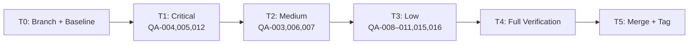
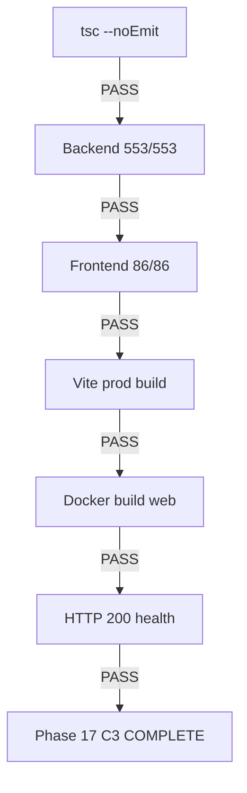

# Phase 17 C3: Accessibility Fixes — Implementation Plan

**Date:** 2026-08-06
**Spec:** `docs/superpowers/specs/2026-08-05-phase17-c3-accessibility-fixes-design.md`
**Baseline:** 639 tests (553 BE + 86 FE)

---

## Task Breakdown

### T0: Branch Setup + Baseline Verification
- [ ] Create branch `feat/phase17-c3-accessibility-fixes` from `main`
- [ ] Create git tag `pre-phase17-c3-2026-08-06`
- [ ] Run baseline: tsc, backend tests (553), frontend tests (86), vite build
- **Gate:** All 4 pass before proceeding

### T1: Critical Fixes — Modal/Dropdown ARIA + Keyboard
**Files:** TierSelector.tsx, NotificationBell.tsx

- [ ] **QA-004:** TierSelector modal — add `role="dialog"`, `aria-modal="true"`, `aria-labelledby="tier-dialog-title"`, `id="tier-dialog-title"` on h3, Escape key handler
- [ ] **QA-004:** BadgeDisplay modal — add `role="dialog"`, `aria-modal="true"`, `aria-labelledby="badge-dialog-title"`, `id="badge-dialog-title"` on h3, Escape key handler
- [ ] **QA-005:** NotificationBell — add `aria-expanded={open}`, `aria-haspopup="true"` on bell button; `role="menu"`, `aria-label` on dropdown; `role="menuitem"` on notification buttons; Escape key handler via useEffect
- [ ] **QA-012:** TierSelector — add error state, show error message with Cancel button instead of returning null
- **Gate:** tsc + frontend tests pass

### T2: Medium Fixes — Form Labels
**Files:** PricingManagement.tsx, InlineAssignmentForm.tsx, CohortManagement.tsx

- [ ] **QA-003:** PricingManagement — add `htmlFor`/`id` pairs: `pricing-price`, `pricing-tier`, `pricing-xlm`, `pricing-usdc`
- [ ] **QA-006:** InlineAssignmentForm — add `<label className="sr-only">` + `id` for title and file inputs
- [ ] **QA-007:** CohortManagement — add `htmlFor`/`id` pairs: `cohort-name`, `cohort-course`
- **Gate:** tsc + frontend tests pass

### T3: Low-Priority Fixes — Icons, Clipboard, Error Handling
**Files:** StatusBadge.tsx, StudentWalletStatusCard.tsx, PaymentCheckout.tsx, AnnouncementsPanel.tsx

- [ ] **QA-008:** StatusBadge — add `aria-hidden="true"` to CheckCircle, XCircle, Clock
- [ ] **QA-009:** StudentWalletStatusCard — add `aria-hidden="true"` to all decorative icons
- [ ] **QA-010:** PaymentCheckout — add `aria-label` to copy buttons; split `loading` into `loadingMethod`
- [ ] **QA-011:** PaymentCheckout — wrap `navigator.clipboard.writeText` in try/catch
- [ ] **QA-015:** AnnouncementsPanel — add `courseLoading` state, show spinner on create button
- [ ] **QA-016:** AnnouncementsPanel — replace `alert()` with `setError()` inline display
- **Gate:** tsc + frontend tests pass

### T4: Full Verification
- [ ] TypeScript: `npx tsc --noEmit` (both LMS-Server and LMS-Frontend)
- [ ] Backend tests: 553/553
- [ ] Frontend tests: 86/86
- [ ] Vite production build
- [ ] Docker build: `docker compose build web`
- [ ] Smoke: HTTP 200 on `/api/v1/health`

### T5: Merge + Tag + Closeout
- [ ] Commit all changes
- [ ] Merge to main (or direct commit if on main)
- [ ] Tag: `phase17-c3-complete-2026-08-06`
- [ ] Write closeout document

## Dependencies

```
T0 → T1 → T2 → T3 → T4 → T5
```

T1/T2/T3 are independent of each other but serialized for clean review.

## Mermaid: A11y Fix Workflow



## Mermaid: Verification Gate Flow


