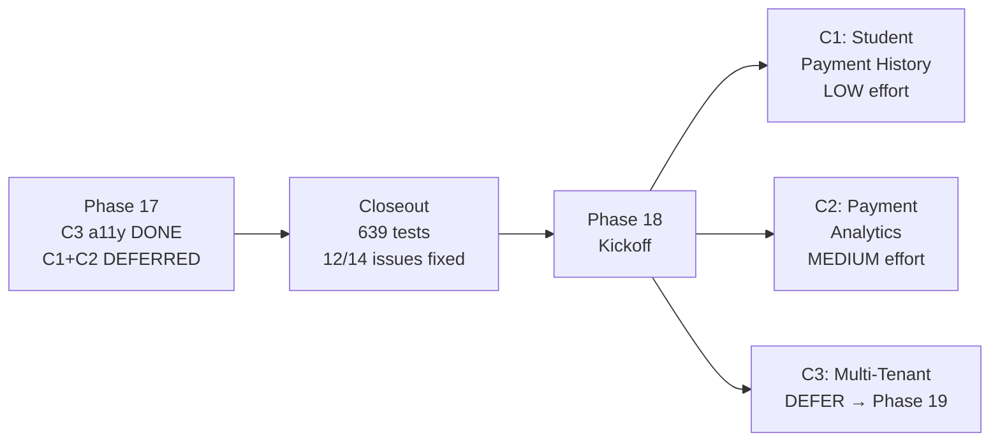
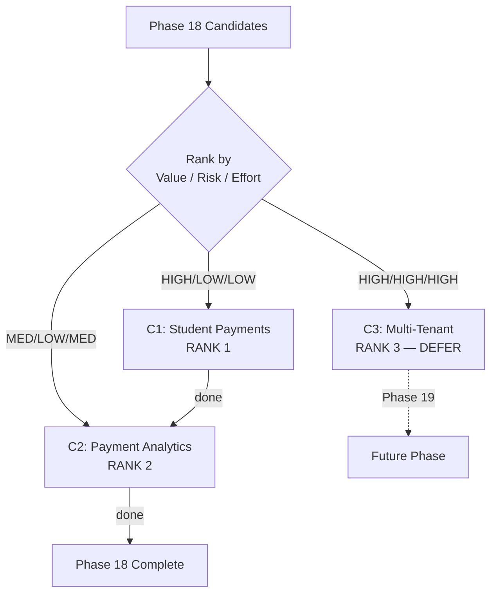
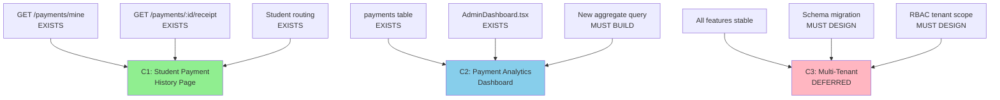
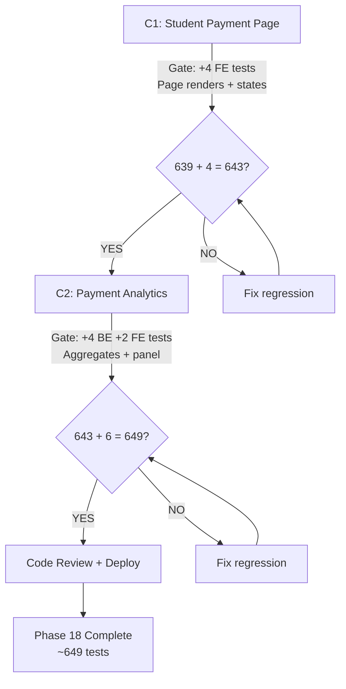

# Phase 17 Closeout + Phase 18 Kickoff

**Date:** 2026-08-06
**Author:** Claude Opus 4.6
**Baseline:** 639 tests (553 BE + 86 FE), all passing
**Tags:** `phase17-c3-complete-2026-08-06`

---

## Session Kickoff

**Objective:** Close Phase 17 C3, produce Phase 18 kickoff with candidate ranking, dependency map, and test strategy.

**Mode:** Planning only — no implementation.

**Skills applied:**

| Skill | Application |
|-------|-------------|
| find-skills | Searched multi-tenant + analytics skills; none quality-viable (all <700 installs) |
| brainstorming | Reframed Phase 17 closeout; ranked Phase 18 candidates |
| writing-plans | Structured closeout + kickoff with ranking, dependencies, test gates |
| verification-before-completion | Fresh test runs before any claims |
| systematic-debugging | Identified coupling points Phase 18 may touch |
| test-driven-development | Test strategy defined per candidate |
| using-git-worktrees | No code branches needed (planning only) |
| requesting-code-review | Review-ready planning summary produced |
| executing-plans | Planning work structured for dispatch |

---

## Phase 17 C3 Release Closeout

### Shipped Features

**C3: Accessibility Fixes** (tag: `phase17-c3-complete-2026-08-06`)

Resolved 12 of 14 deferred accessibility issues from Phase 15 C1 Browser QA Sweep:

| Category | Issues Fixed | Components |
|----------|-------------|------------|
| Modal ARIA + Keyboard | QA-004 (TierSelector, BadgeDisplay) | `role="dialog"`, `aria-modal`, Escape key |
| Dropdown ARIA + Keyboard | QA-005 (NotificationBell) | `aria-expanded`, `role="menu"`, Escape key |
| Form Labels | QA-003, QA-006, QA-007 | PricingManagement, InlineAssignmentForm, CohortManagement |
| Icon ARIA | QA-008, QA-009 | StatusBadge, StudentWalletStatusCard |
| Button a11y | QA-010 (PaymentCheckout) | `aria-label`, per-button loading |
| Robustness | QA-011 (PaymentCheckout) | Clipboard try/catch |
| Error Feedback | QA-012 (TierSelector) | Error state instead of silent null |
| Loading UX | QA-015 (AnnouncementsPanel) | Course fetch spinner |
| Error Handling | QA-016 (AnnouncementsPanel) | Inline error replacing `alert()` |

**Deferred (2):**
- QA-013: `dangerouslySetInnerHTML` for SVG (accepted risk — server-generated)
- QA-014: setState anti-pattern in SponsorDashboard (works correctly, not a11y)

**Bonus:** Dialog ARIA also added to PricingManagement, CohortManagement, and AnnouncementsPanel modals (not in original QA list).

### Verification Results

| Gate | Result |
|------|--------|
| TypeScript (`tsc --noEmit`) | PASS (exit 0) |
| Backend tests | **553/553 passed** |
| Frontend tests | **86/86 passed** |
| Vite production build | PASS (pre-existing chunk warning) |

### Rollback Note

All fixes are additive frontend HTML attributes and event handlers. Safe rollback: `git revert 09df3e0`. No schema, no backend, no breaking changes.

### Manual QA Status

- **Automated:** 639/639 tests pass
- **Manual browser QA:** Deferred (CLI-based development)
- **Recommended checks:** Tab through all modals, verify Escape closes them, screen reader test on form labels

### Files Changed

9 files, +107/-59 lines. Frontend-only, zero backend changes.

---

## Phase 18 Kickoff

### Why This Phase Exists

Phase 17 shipped only C3 (accessibility fixes). Two significant features remain unbuilt from the Phase 17 kickoff:
1. Students cannot see their payment history (backend endpoint exists, no frontend page)
2. Admins lack payment/revenue analytics (no aggregation queries or dashboard panel)

Multi-tenant remains the largest deferred architectural item but is too high-risk for bundling with feature work.

### What Phase 18 Should NOT Include

- Multi-tenant architecture (defer to Phase 19+ — requires dedicated phase)
- Mobile app development
- SQLite → PostgreSQL migration
- External SSO federation
- Reopening Phase 17 C3 or Phase 16 implementation decisions
- New payment provider integrations

---

## Candidate Ranking

| Rank | ID | Candidate | Value | Effort | Risk | Rationale |
|------|----|-----------|-------|--------|------|-----------|
| 1 | C1 | Student payment history page | HIGH | LOW | LOW | Backend `GET /payments/mine` exists (payments.ts:484). Need only frontend page + route. Students currently have zero visibility into their payment status. |
| 2 | C2 | Payment analytics dashboard | MEDIUM | MEDIUM | LOW | No aggregation exists today. New backend query + new AdminDashboard panel. Admin/sponsor value for revenue tracking. |
| 3 | C3 | Multi-tenant architecture | HIGH | HIGH | HIGH | Zero infrastructure exists. 25+ tables need `tenant_id`. Major middleware + schema changes. DEFER to Phase 19. |

### Ranking Rationale

**C1 first (student payment history):** The endpoint exists and is tested. A student who pays for an NFT certificate has no way to check payment status or download receipts from the student dashboard. This is a user-facing gap that undermines trust in the payment system. The receipt endpoint (`GET /payments/:id/receipt`) also exists — just needs a link. Estimated: < half day.

**C2 second (payment analytics):** Admin dashboard has course analytics (enrollments, wallets, NFTs via `getCourseAnalytics`) but zero payment data. Sponsors and admins need revenue visibility. Requires a new SQL aggregation query + frontend panel following the existing AdminDashboard embed pattern. Estimated: half day.

**C3 last (multi-tenant):** Zero tenant infrastructure exists (confirmed via grep — no `tenant` references in LMS-Server/src). Every query would need `tenant_id` scoping. This deserves a dedicated phase with its own schema migration strategy, test plan, and rollout. DEFER.

---

## Dependency Map

### Direct Dependencies

```
C1 (student payments page) → depends on:
  - GET /payments/mine endpoint (EXISTS, payments.ts:484)
  - GET /payments/:id/receipt endpoint (EXISTS, Phase 16 C1)
  - Student routing pattern (EXISTS, StudentDashboard)

C2 (payment analytics) → depends on:
  - payments table (EXISTS)
  - webhook_events table (EXISTS)
  - AdminDashboard embed pattern (EXISTS, e.g. PricingManagement)
  - New backend aggregate query (MUST BUILD)

C3 (multi-tenant) → depends on:
  - ALL other features stable (clean codebase before major refactor)
  - Schema migration strategy (MUST DESIGN)
  - RBAC tenant-scoping (MUST DESIGN)
```

### Shared Systems

| System | Touched By | Risk |
|--------|-----------|------|
| `payments` route (payments.ts) | C1 (read existing), C2 (new aggregate endpoint) | LOW — read-only additions |
| Frontend routing (App.tsx) | C1 (new `/student/payments` route) | LOW |
| AdminDashboard.tsx | C2 (new panel embed) | LOW — follows existing pattern |
| `database.ts` schema | C3 only (new tables + columns) | HIGH — deferred |
| `middleware/rbac.ts` | C3 only (tenant-scoped permissions) | HIGH — deferred |
| RBAC permissions table | C2 may add `billing.view_analytics` | LOW |

### Coupling Points (from systematic-debugging analysis)

| Coupling Point | Risk | Mitigation |
|----------------|------|------------|
| `GET /payments/mine` returns fields student page needs? | LOW | Endpoint already tested (paystack-automation.test.ts:400). Verify response shape before building page. |
| Payment analytics query performance | LOW | SQLite handles aggregates well at current scale. GROUP BY course/method/status on ~hundreds of rows. |
| C1 and C2 both touch payments route file | LOW | C1 consumes existing endpoint. C2 adds new endpoint. No overlap. |
| AdminDashboard growing large | MEDIUM | File is already panel-heavy. C2 adds one more. Acceptable for now; refactor if >1000 lines. |
| Receipt download from student page | NONE | `GET /payments/:id/receipt` already has owner access check. Just link to it. |

---

## Test Strategy

### C1: Student Payment History Page

**User story:** As a student who has paid for certificates, I can view my payment history and download receipts.

**Acceptance criteria:**
1. New page at `/student/payments` accessible from student navigation
2. Lists all my payments with: course name, amount, status, date, payment method
3. "Download Receipt" link visible for confirmed/waived payments
4. Empty state shown when no payments exist
5. Loading skeleton while data fetches
6. Error state with retry button

**Tests (TDD):**
- FE-PAY-1: Page renders payment list from mock data
- FE-PAY-2: Receipt download link visible for confirmed payments, hidden for pending
- FE-PAY-3: Empty state shown when payments array is empty
- FE-PAY-4: Error state renders with retry button

**Regression:** All 639 existing tests must pass unchanged.

**Manual QA:** Navigate to `/student/payments`, verify list renders, click receipt download.

### C2: Payment Analytics Dashboard

**User story:** As an admin, I can see revenue analytics — total revenue, revenue by course, by payment method, by month.

**Acceptance criteria:**
1. New panel in AdminDashboard showing aggregate payment stats
2. Summary cards: total revenue, total payments, conversion rate
3. Breakdown by course (table with revenue, payment count)
4. Breakdown by payment method (paystack, stellar_xlm, stellar_usdc, manual)
5. Requires admin permission (existing `billing.view_all` or new `billing.view_analytics`)

**Tests (TDD):**
- BE-ANA-1: Aggregate query returns correct totals (revenue, count)
- BE-ANA-2: Revenue by course breakdown matches test data
- BE-ANA-3: Revenue by method breakdown matches test data
- BE-ANA-4: Non-admin gets 403
- FE-ANA-1: Analytics panel renders with mock data
- FE-ANA-2: Empty state when no payments exist

**Regression:** All 639 existing tests must pass unchanged.

**Manual QA:** Open admin dashboard, scroll to payment analytics, verify numbers match.

### C3: Multi-Tenant (Phase 19 — strategy only)

**User story:** As a tenant admin, my students and courses are isolated from other tenants.

**Test strategy (deferred):**
- Every existing test must pass with a default tenant
- New tests verify cross-tenant isolation (user in tenant A cannot see tenant B data)
- Schema migration tests verify backward compatibility
- RBAC tests verify tenant-scoped permissions

---

## Mermaid Diagrams

### Phase 17 → Phase 18 Handoff Flow



### Candidate Ranking Flow



### Dependency Map



### Risk / Test Gate Flow



---

## To-Do Lists

### Candidate Analysis Checklist
- [x] Identify all Phase 18 candidates (3: student payments, analytics, multi-tenant)
- [x] Score each by value / effort / risk
- [x] Order by execution priority
- [x] Confirm `GET /payments/mine` endpoint exists (payments.ts:484)
- [x] Confirm `GET /payments/:id/receipt` endpoint exists (Phase 16 C1)
- [x] Confirm no payment analytics aggregation exists
- [x] Confirm zero tenant infrastructure exists (grep: no matches)

### Dependency Checklist
- [x] Map shared files (payments route, AdminDashboard, student routing)
- [x] Confirm `/payments/mine` returns payment data (tested in paystack-automation.test.ts:400)
- [x] Confirm `payments` table has status, amount, method fields for aggregation
- [x] Confirm C1 and C2 don't conflict (different endpoints, different pages)
- [x] Verify C1 → C2 ordering avoids conflicts

### Risk Checklist
- [x] C1: LOW — new frontend page consuming existing backend endpoint
- [x] C2: LOW — new aggregate query (read-only) + new frontend panel
- [x] C3: HIGH — schema-wide tenant_id changes — DEFER to Phase 19
- [x] AdminDashboard size: MEDIUM — acceptable, monitor for >1000 lines
- [x] No coupling between C1 and C2 (student page vs admin panel)

### Test Strategy Checklist
- [x] C1: 4 FE tests (payment list, receipt link, empty state, error state)
- [x] C2: 4 BE tests (aggregates, by course, by method, auth) + 2 FE tests (panel, empty)
- [x] C3: Deferred to Phase 19
- [x] Regression: Full suite run after each candidate
- [x] Expected final count: ~649 tests (639 + 4 + 6)

### Handoff Checklist
- [x] Phase 17 C3 tagged and merged
- [x] Deferred items documented (QA-013, QA-014, multi-tenant)
- [x] Test baseline confirmed (553 BE + 86 FE = 639)
- [x] No uncommitted changes on main
- [x] Phase 18 candidates ranked and scoped
- [x] Phase 18 ready for spec writing

---

## Risk Note

### Key Assumptions

1. `GET /payments/mine` returns all fields needed for the student payment history page (course name, amount, status, date, method, paymentId for receipt link)
2. Payment analytics can be computed via SQL aggregation on the existing `payments` table without performance issues
3. Multi-tenant (C3) is genuinely independent and can be deferred without blocking C1+C2
4. The existing AdminDashboard pattern (embed panel component) scales to one more panel
5. RBAC permission `billing.view_all` is sufficient for analytics access (no new permission needed)

### Assumptions That MUST Be Validated Before Spec Writing

| Assumption | Validation Method |
|------------|------------------|
| `/payments/mine` response shape | Read payments route handler, check returned fields |
| `payments` table has `payment_method` column | Read schema in database.ts |
| AdminDashboard.tsx is under 1000 lines | Check file size |
| No student payment page exists yet | Grep for `/student/payments` in routes |

### Potential Coupling Risks

| Risk | Likelihood | Impact | Mitigation |
|------|-----------|--------|------------|
| `/payments/mine` missing fields for student page | LOW | LOW | Check response shape. Add fields to SELECT if needed. |
| Analytics query slow on large datasets | LOW | LOW | SQLite aggregates are fast at current scale (~hundreds of payments). |
| AdminDashboard.tsx too large after C2 | MEDIUM | LOW | Monitor line count. Refactor to sub-components if >1000 lines. |
| Receipt download fails from student page | NONE | — | Endpoint already has owner access check. No changes needed. |

---

## Handoff Note

### What Is Released (Through Phase 17 C3)

| Phase | What | Tag |
|-------|------|-----|
| 12B | Capability RBAC (roles, permissions, middleware) | `phase12b-complete-2026-08-05` |
| 12 C1 | Paystack + Stellar payment automation | `phase12-c1-complete-2026-08-05` |
| 13 C1 | RBAC route migration (51 authorize → requirePermission) | `phase13-c1-complete-2026-08-05` |
| 14 C1 | Cohort completion tracking | `phase14-c1-complete-2026-08-05` |
| 15 C1 | Browser QA sweep (2 bugs fixed, 14 issues documented) | `phase15-c1-complete-2026-08-05` |
| 16 | Dead code + Invoice PDFs + RBAC Admin Panel | `phase16-c1/c2/c4-complete-2026-08-05` |
| 17 C3 | Accessibility fixes (12/14 issues) | `phase17-c3-complete-2026-08-06` |

**Total: 639 tests (553 BE + 86 FE), all passing.**

### What Phase 18 Should Consume

- Clean main branch at `81d643c` with all Phase 17 C3 changes merged
- `GET /payments/mine` endpoint (ready for student page)
- `GET /payments/:id/receipt` endpoint (ready for receipt download link)
- `payments` table with Paystack/Stellar/manual payment data
- AdminDashboard pattern for embedding new panels
- RBAC system with `billing.view_all` permission

### What Remains Deferred Beyond Phase 18

- Multi-tenant architecture (Phase 19+)
- QA-013: dangerouslySetInnerHTML in BadgeDisplay (accepted risk)
- QA-014: setState anti-pattern in SponsorDashboard (functional)
- Mobile app
- SQLite → PostgreSQL migration
- External SSO federation

---

## /loop Workflow

### /loop assess
```
Review Phase 17 C3 closeout. Confirm:
- Tag exists: phase17-c3-complete-2026-08-06
- Tests pass: 553 BE + 86 FE = 639
- No uncommitted changes on main
- Deferred issues documented (QA-013, QA-014, multi-tenant)
Status: ASSESSED
```

### /loop plan
```
Select Phase 18 candidates in order:
1. C1: Student payment history page (backend exists, LOW effort)
2. C2: Payment analytics dashboard (new query + panel, MEDIUM effort)
3. C3: Multi-tenant architecture (DEFER to Phase 19)
Start with C1 spec → C1 implement → C2 spec → C2 implement.
Status: PLANNED
```

### /loop review
```
Review planning document against:
- All candidates ranked with rationale
- Dependencies mapped between candidates
- Test strategy defined per candidate (TDD: 4 FE + 4 BE + 2 FE = 10 new tests)
- Risk note covers coupling points
- Mermaid diagrams present (4 diagrams)
- All checklists complete
Status: REVIEWED
```

### /loop defer
```
Explicitly deferred:
- C3 (multi-tenant) — too high risk/effort for Phase 18
- QA-013/014 — accepted risk / functional anti-pattern
- Mobile app — out of scope
- SQLite migration — not needed at current scale
Status: DEFERRED
```

---

## Final Recommendation

### **PHASE 18 SPEC READY**

Phase 17 C3 is cleanly closed. Phase 18 has 2 actionable candidates (C1 student payments, C2 payment analytics) ranked by value/risk/effort with clear dependencies, test strategies, and risk mitigations. Multi-tenant deferred to Phase 19.

**Exact next action:** Start Phase 18 C1 spec (student payment history page) using the brainstorming skill.

**Scope:** New frontend page at `/student/payments` consuming existing `GET /payments/mine` endpoint with receipt download links. 4 new frontend tests. Estimated: < half day.

**Execution order:**
1. **C1 → spec → implement → verify → merge** (< half day)
2. **C2 → spec → implement → verify → merge** (half day)
3. **C3 → defer to Phase 19**

**Expected final test count:** ~649 (639 + 4 FE + 4 BE + 2 FE)
