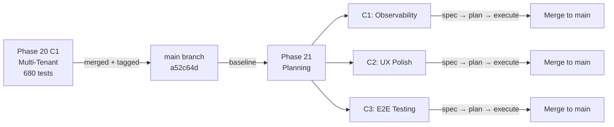
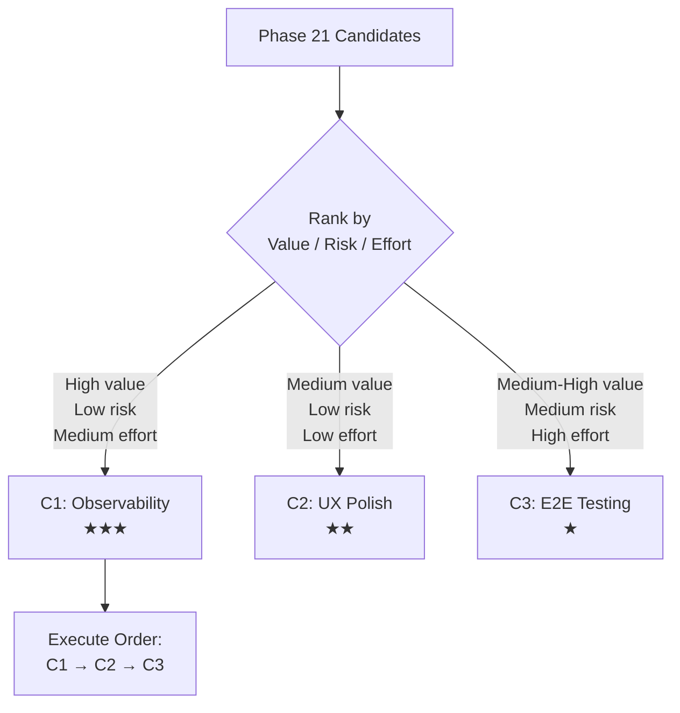
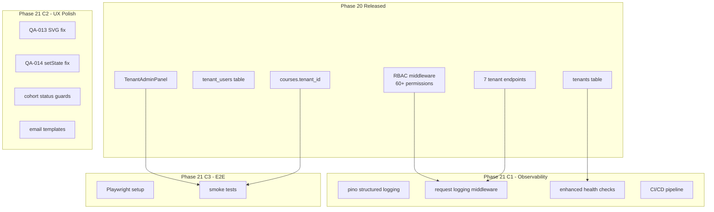
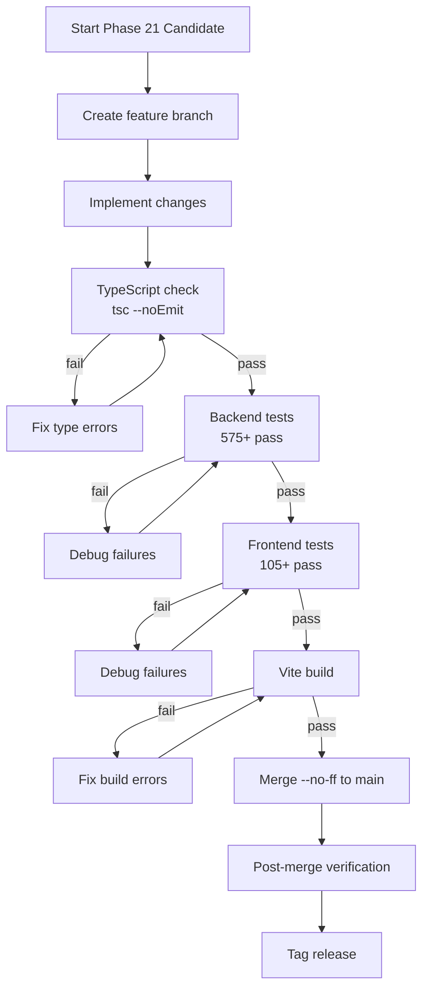

# Phase 20 C1 Release Closeout + Phase 21 Kickoff

---

## Session Kickoff

**Objective:** Close Phase 20 C1 (Multi-Tenant Architecture) and plan Phase 21 scope.

**Required skills and applicability:**

| Skill | Phase 20 Closeout | Phase 21 Kickoff |
|-------|-------------------|------------------|
| find-skills | Confirm no external skills needed for closeout | Check for observability/testing skills |
| brainstorming | N/A (closed) | Candidate selection, scope ranking |
| writing-plans | Release summary | Phase 21 spec boundaries |
| executing-plans | N/A (closed) | Not yet — planning only |
| test-driven-development | Verify 680/680 baseline | Define Phase 21 test strategy |
| systematic-debugging | Document coupling points | Identify Phase 21 risk areas |
| verification-before-completion | Confirm release state | Verify planning completeness |
| using-superpowers/worktrees | N/A (merged to main) | Propose Phase 21 branch strategy |
| receiving/requesting-code-review | Release review summary | Phase 21 review checklist |

---

## Phase 20 C1 Release Closeout

### Shipped Features

| Feature | Implementation | Files |
|---------|---------------|-------|
| `tenants` table | id, name, slug, status (active/suspended), timestamps | database.ts, schema.sql |
| `tenant_users` junction | Many-to-many users↔tenants with roles (admin/lecturer/member) | database.ts, schema.sql |
| `courses.tenant_id` | Nullable FK, ON DELETE SET NULL, hierarchical scoping | database.ts, schema.sql |
| 7 tenant CRUD endpoints | List, create, update, delete tenants + list/add/remove users | routes/tenants.ts |
| 2 RBAC permissions | `tenant.manage` (super-admin), `tenant.view` (admin roles) | database.ts |
| Tenant-aware course queries | Super-admin sees all; tenant admin sees own + platform (NULL) | coursesController.ts |
| Auto tenant_id on create | Tenant admins get tenant_id auto-set on course creation | coursesController.ts |
| TenantAdminPanel | Table, create form, expandable user management, status toggle | TenantAdminPanel.tsx |
| tenantService | 7 API methods matching backend endpoints | tenantService.ts |

### Verification Summary

| Gate | Result |
|------|--------|
| Backend tests | 575/575 pass |
| Frontend tests | 105/105 pass |
| Total tests | 680/680 pass (+24 from Phase 19) |
| TypeScript (BE) | Clean (`tsc --noEmit`) |
| TypeScript (FE) | Clean (`tsc --noEmit`) |
| Vite build | Success (7.17s) |
| Post-merge verification | 680/680 on main |

### Git Artifacts

| Item | Value |
|------|-------|
| Branch | `feat/phase20-c1-multi-tenant-hierarchical` |
| Commit | `3b5ebc2` |
| Merge | `a52c64d` (--no-ff to main) |
| Tag | `phase20-c1-complete-2026-08-06` |
| Baseline | `pre-phase20-c1-2026-08-06` |
| Files changed | 12 (+2439 lines) |

### Rollback Note

To rollback Phase 20 C1:
```bash
git revert a52c64d   # revert merge commit
# Then manually: DROP TABLE tenant_users; DROP TABLE tenants;
# ALTER TABLE courses DROP COLUMN tenant_id;
```
Risk: Low. Tenant tables are new, no existing data depends on them. `courses.tenant_id` is nullable with no existing values set.

### Manual QA Status

- **Not performed.** Phase 20 C1 is backend-infrastructure + admin panel. No student-facing changes.
- TenantAdminPanel renders in AdminDashboard but requires `tenant.manage` permission (super-admin only).
- Browser QA deferred to post-deploy verification.

---

## Phase 21 Kickoff

### Context

With multi-tenant architecture in place (Phase 20), the LMS platform has all core business features:
- Course management with sections/items
- Student enrollment, progress tracking, completion
- Quiz/assignment system with auto-grading
- Payment processing (Paystack + Stellar)
- Sponsor/cohort management
- RBAC with 60+ permissions
- Multi-tenant isolation
- NFT certificate minting

Phase 21 shifts focus from **feature development** to **operational readiness and polish**.

### Scope

Phase 21 addresses deferred operational and UX work that accumulated during feature sprints.

### Non-Goals

- No new business features
- No schema migrations (unless required by a candidate)
- No frontend redesigns
- No external service integrations beyond what exists

---

## Candidate Ranking

### C1: Observability & DevOps (Recommended)

**Rationale:** The platform has zero structured logging, no request tracing, and console-only error reporting. This is the highest-risk gap for a production system with multi-tenant isolation.

**Scope:**
- Structured logging with pino (replace console.log/warn/error)
- Request/response logging middleware with correlation IDs
- Error tracking improvements (structured error context)
- Health check enhancement (add DB table count, tenant count)
- CI/CD pipeline definition (GitHub Actions for test + lint + build)

**Effort:** Medium (3-5 files changed, ~15 tests)
**Risk:** Low — additive, no breaking changes
**Value:** High — production visibility, incident response capability

### C2: Quiz & Course UX Polish

**Rationale:** Two deferred a11y issues (QA-013, QA-014) and potential UX improvements for quiz flow. Lower priority than observability because the features work correctly.

**Scope:**
- QA-013: Replace `dangerouslySetInnerHTML` in BadgeDisplay with safe SVG rendering
- QA-014: Fix setState anti-pattern in SponsorDashboard `toggleRow()`
- Cohort status transition guards (prevent invalid state changes)
- Email template extraction (move inline HTML to templates)

**Effort:** Low-Medium (4-6 files, ~8 tests)
**Risk:** Low — isolated component changes
**Value:** Medium — code quality, a11y compliance

### C3: E2E Testing Infrastructure

**Rationale:** Currently zero E2E test coverage. All tests are unit/integration via supertest. Adding Playwright or similar would catch rendering/interaction bugs that component tests miss.

**Scope:**
- Add Playwright as dev dependency
- Write smoke tests for critical flows (login, course view, admin dashboard)
- CI integration for E2E runs

**Effort:** High (new tooling, new test patterns, CI changes)
**Risk:** Medium — new dependency, environment complexity
**Value:** Medium-High — but ROI is better after features stabilize

### Recommended Order: C1 → C2 → C3

C1 (Observability) delivers the most production value with lowest risk. C2 (UX Polish) closes deferred QA items. C3 (E2E) is valuable but high-effort and better suited for a stabilization phase.

---

## Mermaid Diagrams

### Phase 20 → Phase 21 Handoff Flow



### Candidate Ranking Flow



### Dependency Map



### Risk / Test Gate Flow



---

## To-Do Lists

### Candidate Analysis Checklist

- [x] Identify all deferred work items from Phase 15-20 closeouts
- [x] Confirm zero TODO/FIXME in codebase
- [x] Confirm QA-013 and QA-014 still deferred
- [x] Assess observability gaps (logging, tracing, error tracking)
- [x] Assess testing gaps (no E2E framework)
- [x] Rank candidates by value/risk/effort
- [x] Recommend execution order

### Dependency Checklist

- [x] Map tenant routes → RBAC middleware dependency
- [x] Map coursesController tenant-aware queries → tenant tables
- [x] Confirm health check endpoint exists (basic)
- [x] Confirm no structured logging exists
- [x] Confirm no E2E framework installed
- [x] Confirm error handler is console-only

### Risk Checklist

- [x] C1 (Observability): No breaking changes — additive only
- [x] C1: pino replaces console.* — must verify no test assertions on console output
- [x] C2 (UX Polish): QA-013 changes BadgeDisplay rendering — low risk
- [x] C2: QA-014 changes SponsorDashboard state management — low risk
- [x] C3 (E2E): New dev dependency — no production impact
- [x] C3: CI/CD changes — must not block existing test runs
- [x] All candidates: Must maintain 680+ test count (no regression)

### Test Strategy Checklist

- [ ] Define acceptance criteria for each C1 feature
- [ ] Define acceptance criteria for each C2 feature
- [ ] Define E2E smoke test list for C3
- [ ] Confirm regression baseline (680 tests)
- [ ] Define new test count targets per candidate

### Handoff Checklist

- [x] Phase 20 C1 merged to main
- [x] Phase 20 C1 tagged (`phase20-c1-complete-2026-08-06`)
- [x] 680/680 tests verified on main
- [x] Closeout doc written
- [x] MEMORY.md updated
- [x] No uncommitted changes on main
- [x] Feature branch can be deleted

---

## Test Strategy

### C1: Observability — Acceptance Criteria

| Feature | Test | Type |
|---------|------|------|
| pino logger | Structured JSON output with level, timestamp, message | Unit |
| Request logging | Each request produces a log entry with method, url, status, duration | Integration |
| Correlation IDs | `x-request-id` header propagated through log entries | Integration |
| Health check enhancement | `/health` returns tenant count, table count | Integration |
| CI/CD pipeline | GitHub Actions workflow runs tests + lint + build | Manual verify |

**Expected test growth:** +8-10 backend tests
**Regression:** All 680 existing tests must continue to pass

### C2: UX Polish — Acceptance Criteria

| Feature | Test | Type |
|---------|------|------|
| QA-013 SVG fix | BadgeDisplay renders SVG without dangerouslySetInnerHTML | Frontend |
| QA-014 setState fix | SponsorDashboard toggleRow uses functional setState | Frontend |
| Cohort status guards | Invalid transitions return 400 | Backend |
| Email templates | Emails render from template files | Backend |

**Expected test growth:** +4-6 tests (2 BE + 2-4 FE)
**Regression:** All 680 existing tests must continue to pass

### C3: E2E Testing — Acceptance Criteria

| Feature | Test | Type |
|---------|------|------|
| Playwright setup | `npx playwright test` runs successfully | E2E |
| Login smoke test | Student can log in and see dashboard | E2E |
| Admin smoke test | Admin can access admin dashboard | E2E |
| Course view smoke | Student can view course sections | E2E |

**Expected test growth:** +4-6 E2E tests (separate from vitest count)
**Regression:** All 680 existing tests must continue to pass

### Manual QA Expectations

- C1: Verify structured logs appear in Docker container output
- C2: Browser-verify BadgeDisplay and SponsorDashboard after changes
- C3: Watch Playwright test runs in CI

---

## Risk Note

### Key Assumptions

1. **pino is compatible with better-sqlite3 sync handlers.** pino is async by default but this should not conflict with sync Express handlers.
2. **Replacing console.* with pino will not break existing tests.** No tests currently assert on console output (verified: no `console.log` assertions in test files).
3. **QA-013 SVG rendering can be done safely.** The SVG content is server-generated badge markup, not user input. A safe rendering approach (e.g., `svg` element with parsed attributes) is feasible.
4. **Playwright can run in the Docker environment.** May need headless chromium — verify before committing to C3.

### Potential Coupling Risks

1. **Error handler middleware** (`errorHandler.ts`) uses `console.warn`/`console.error`. Migrating to pino requires updating this file — must not break error response format.
2. **Health check endpoint** in `app.ts` (lines 167-188) — enhancement must not change existing response shape (additive fields only).
3. **RBAC middleware** caches permissions per-request on `req._permissions`. Request logging middleware must not interfere with this caching.

---

## Handoff Note

### What Is Released (Phase 20 C1)

- Multi-tenant architecture with hierarchical scoping
- 7 admin-only tenant CRUD endpoints protected by `tenant.manage`
- Tenant-aware course visibility (super-admin sees all, tenant admin sees own + platform)
- TenantAdminPanel in AdminDashboard
- 680 tests (575 BE + 105 FE) all passing on main
- Tag: `phase20-c1-complete-2026-08-06`

### What Phase 21 Should Consume

- **Baseline:** main branch at `a52c64d` with 680 passing tests
- **Schema:** tenants, tenant_users, courses.tenant_id — treat as stable, do not modify
- **RBAC:** 62 permissions (including tenant.manage, tenant.view) — extend only, do not remove
- **Health endpoint:** `/health` and `/api/v1/health` — enhance, do not replace
- **Error handler:** `AppError` + `errorHandler` middleware — wrap with logging, do not restructure

---

## /loop Workflow

### /loop assess
Evaluate current state:
```bash
cd /home/webadmin/web-stack/html/LMS-AmmaWallet
git log --oneline -3                    # confirm HEAD
cd LMS-Server && npx vitest run         # verify 575/575
cd ../LMS-Frontend && npx vitest run    # verify 105/105
```

### /loop plan
After candidate selection, create spec:
```bash
# Create Phase 21 spec branch
git checkout -b feat/phase21-c1-observability main
# Write spec → plan → execute cycle
```

### /loop review
Before merge:
```bash
cd LMS-Server && npx tsc --noEmit      # type check
cd LMS-Server && npx vitest run         # backend tests
cd ../LMS-Frontend && npx vitest run    # frontend tests
cd ../LMS-Frontend && npx vite build    # production build
git diff main...HEAD --stat             # review changes
```

### /loop defer
If a candidate is too risky or effort exceeds value:
```bash
# Document deferral reason in closeout
# Tag current state
# Move to next candidate
```

---

## Final Recommendation

**PHASE 21 SPEC READY**

**Recommended Phase 21 C1:** Observability & DevOps (structured logging, request tracing, health check enhancement, CI/CD pipeline)

**Exact next action:** Write the Phase 21 C1 Observability design spec using the brainstorming skill, then produce the implementation plan using the writing-plans skill. Start with `pino` structured logging as the first task — it has the highest production value and lowest coupling risk.

**Branch strategy:** `feat/phase21-c1-observability` from main at `a52c64d`

**Test target:** 680 → ~690 (575 + ~10 new BE tests, 105 FE unchanged)
