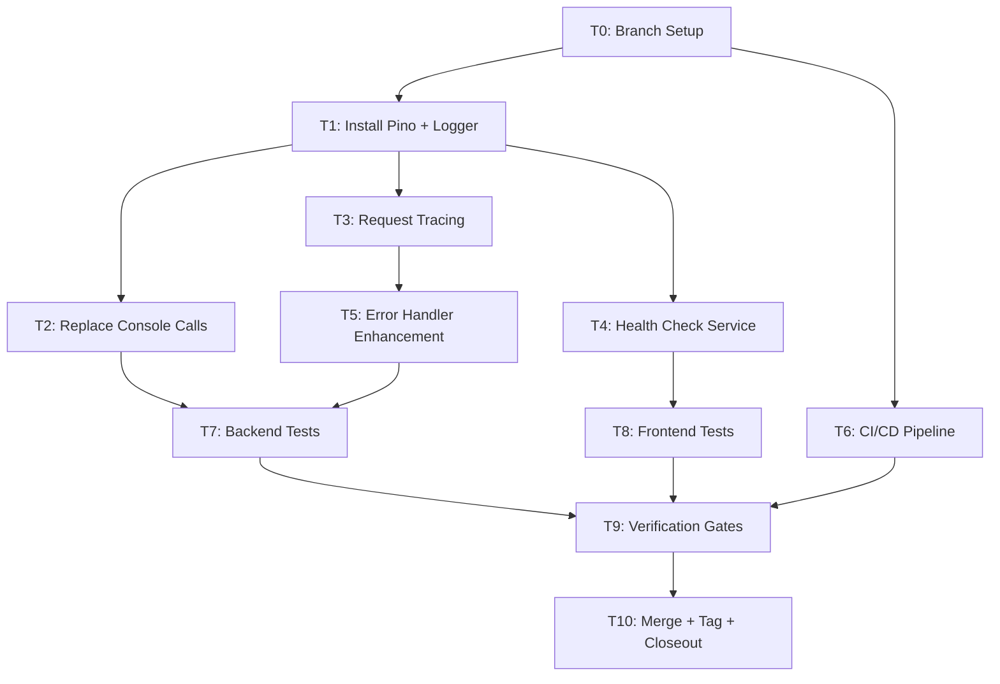
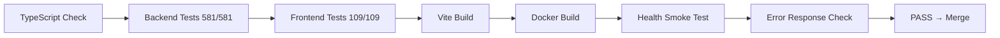

# Phase 21 C1: Observability & DevOps — Implementation Plan

**Date:** 2026-08-06
**Spec:** `docs/superpowers/specs/2026-08-06-phase21-c1-observability-design.md`
**Baseline:** 680 tests (575 BE + 105 FE) — all passing
**Target:** 690 tests (581 BE + 109 FE)

## Task Breakdown

### T0: Branch Setup + Baseline Verification
**Dependencies:** none
**Files:** none (read-only)
- Create branch `feat/phase21-c1-observability` from main
- Run `npx vitest run` in LMS-Server → 575/575
- Run `npx vitest run` in LMS-Frontend → 105/105
- Run `npx tsc --noEmit` in both
- Tag: `pre-phase21-c1-2026-08-06`

### T1: Install Pino + Create Logger
**Dependencies:** T0
**Files owned:** `LMS-Server/src/utils/logger.ts`, `LMS-Server/package.json`
- `cd LMS-Server && npm install pino && npm install -D pino-pretty`
- Create `src/utils/logger.ts` with pino singleton
  - Silent in test (`enabled: false` when `NODE_ENV=test`)
  - Pretty-print in dev
  - JSON in prod
  - Configurable level via `LOG_LEVEL` env

### T2: Replace Console Calls with Logger
**Dependencies:** T1
**Files owned:** 18 source files with console calls
- Replace all 70 `console.*` calls with `logger.*` equivalents
- Add `{ module }` context where bracket prefixes exist
- Priority files (by call count):
  1. `server.ts` (11 calls)
  2. `mintService.ts` (9)
  3. `authController.ts` (8)
  4. `walletService.ts` (7)
  5. `stellarPaymentMonitor.ts` (6)
  6. `nftApplications.ts` (6)
  7. Remaining 12 files (1-3 calls each)
- Update `error-handler.test.ts` to mock logger instead of console
- Update `error-logging-sanitize.test.ts` source analysis
- Verification: `npx vitest run` → 575/575

### T3: Request Tracing Middleware
**Dependencies:** T1
**Files owned:** `src/middleware/requestLogger.ts`, `src/types/index.ts`
- Create `src/middleware/requestLogger.ts`
  - Generate or honor `x-request-id`
  - Log method, path, status, duration on response finish
  - Set `req.requestId` for downstream use
- Extend Express `Request` in `src/types/index.ts` with `requestId?: string`
- Mount in `app.ts` after CORS, before webhook routes

### T4: Enhanced Health Check
**Dependencies:** T1
**Files owned:** `src/services/healthCheckService.ts`, `src/app.ts` (health section only)
- Create `src/services/healthCheckService.ts`
  - `getHealthStatus()` returns: status, timestamp, uptime, version, checks (db, memory, ammaWallet)
  - DB probe with latency measurement
  - Memory: heapUsed, heapTotal, rss in MB
- Replace inline `sendHealthJson()` in `app.ts` with service call
- Verification: `curl localhost:3001/health` returns enhanced response

### T5: Error Handler Enhancement
**Dependencies:** T3 (needs requestId)
**Files owned:** `src/middleware/errorHandler.ts`
- Replace `console.warn`/`console.error` with `logger.warn`/`logger.error`
- Add `requestId` to error responses (from `req.requestId`)
- Log with `{ requestId, statusCode, code }` context
- No new error codes or classes

### T6: CI/CD Pipeline
**Dependencies:** none (parallel with T1-T5)
**Files owned:** `.github/workflows/ci.yml`
- Create GitHub Actions workflow
  - Trigger: push to main/feat/**, PR to main
  - Jobs: install → tsc → vitest → vite build
  - Node 22, npm ci with cache
  - Separate backend + frontend steps

### T7: Backend Tests (6 new)
**Dependencies:** T1-T5
**Files owned:** 3 new test files
- `logger.test.ts` (2 tests)
  - LOG-001: Logger creates child with module context
  - LOG-002: Logger respects level configuration
- `health-check-enhanced.test.ts` (2 tests)
  - HC-001: Health endpoint returns enhanced fields (uptime, memory, db.latencyMs)
  - HC-002: Health endpoint returns degraded status on DB error
- `request-logger.test.ts` (2 tests)
  - RL-001: Request logger sets x-request-id header
  - RL-002: Request logger honors incoming x-request-id

### T8: Frontend Tests (4 new)
**Dependencies:** T4
**Files owned:** 1 new test file
- `ErrorBoundary.test.tsx` (4 tests)
  - EB-001: Error boundary catches render errors
  - EB-002: Error boundary shows fallback UI
  - EB-003: Error boundary shows requestId when available
  - EB-004: Error boundary retry button re-renders children

### T9: Verification Gates
**Dependencies:** T7, T8
**Files owned:** none (read-only)
- `npx tsc --noEmit` in LMS-Server → clean
- `npx tsc --noEmit` in LMS-Frontend → clean
- `npx vitest run` in LMS-Server → 581/581
- `npx vitest run` in LMS-Frontend → 109/109
- `npx vite build` in LMS-Frontend → success
- `docker compose build web` → success
- `curl localhost:PORT/health` → enhanced JSON response
- Verify error responses include `requestId`

### T10: Merge + Tag + Closeout
**Dependencies:** T9
**Files owned:** closeout doc
- Merge `feat/phase21-c1-observability` → main
- Tag: `phase21-c1-complete-2026-08-06`
- Write closeout: `docs/superpowers/plans/2026-08-06-phase21-c1-closeout.md`
- Update MEMORY.md

## Dependency Graph



## Verification Gate Flow



## Rollback Plan

Pre-implementation tag: `pre-phase21-c1-2026-08-06`

```bash
git checkout main
git reset --hard pre-phase21-c1-2026-08-06
docker compose build web && docker compose up -d --no-deps web
```

## Subagent Assignment

| Agent | Tasks | Parallel? |
|-------|-------|-----------|
| A | T0 | Sequential (first) |
| B | T1 + T2 | Sequential after T0 |
| C | T3 + T4 | Parallel with T2 (after T1) |
| D | T5 | After T3 |
| E | T6 | Parallel with T1-T5 |
| F | T7 + T8 | After T2 + T5 + T4 |
| G | T9 | After all |
| H | T10 | After T9 |
