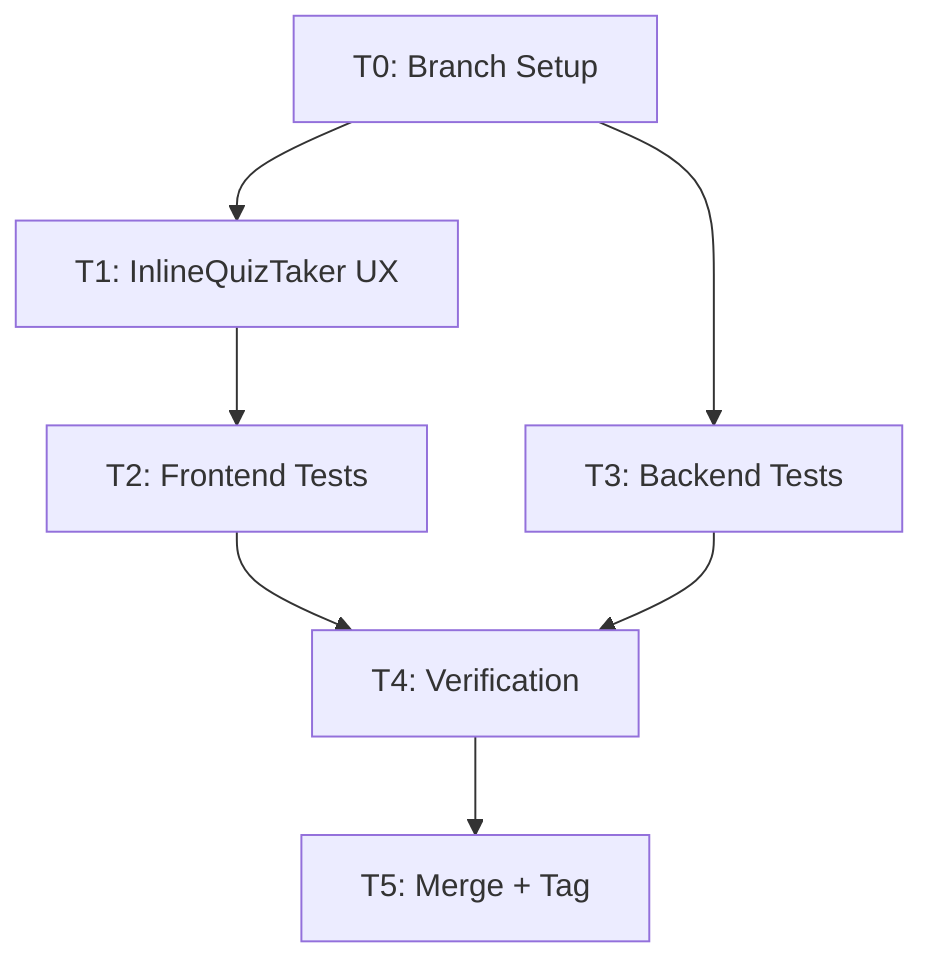

# Phase 21 C2: Quiz UX Improvements — Implementation Plan

**Date:** 2026-08-06
**Spec:** `docs/superpowers/specs/2026-08-06-phase21-c2-quiz-ux-design.md`
**Baseline:** 692 tests (583 BE + 109 FE) — all passing
**Target:** 700 tests (587 BE + 113 FE)

## Task Breakdown

### T0: Branch Setup + Baseline Verification
- Create branch `feat/phase21-c2-quiz-ux` from main
- Run baseline tests: 583 BE + 109 FE
- Tag: `pre-phase21-c2-2026-08-06`

### T1: Enhance InlineQuizTaker with UX Features
**File:** `LMS-Frontend/src/components/InlineQuizTaker.tsx`
- Add progress indicator (Question X of Y + progress bar)
- Add submission confirmation modal
- Add review mode (see submitted answers after completion)
- Add keyboard navigation (arrow keys, Enter, number keys)
- All changes are within the single InlineQuizTaker component

### T2: Add Frontend Tests (+4)
**File:** `LMS-Frontend/src/__tests__/components/InlineQuizTaker.test.tsx`
- IQ-9: Confirmation modal shows on submit, cancel returns to quiz
- IQ-10: Progress indicator shows "Question X of Y"
- IQ-11: Keyboard arrow keys navigate questions
- IQ-12: Review mode shows submitted answers

### T3: Add Backend Tests (+4)
**File:** `LMS-Server/src/__tests__/quiz-ux-validation.test.ts`
- QZ-1: Submit response includes submitted answers
- QZ-2: Submit response includes score, total, passed
- QZ-3: Re-submit overwrites previous completion
- QZ-4: Student quiz GET has no correctIndex/correctAnswer

### T4: Verification Gates
- TypeScript check (both BE + FE)
- Backend tests: 587/587
- Frontend tests: 113/113
- Vite build: success

### T5: Merge + Tag + Closeout
- Merge to main
- Tag: `phase21-c2-complete-2026-08-06`
- Closeout doc

## Dependency Graph



## Rollback

```bash
git reset --hard pre-phase21-c2-2026-08-06
```
