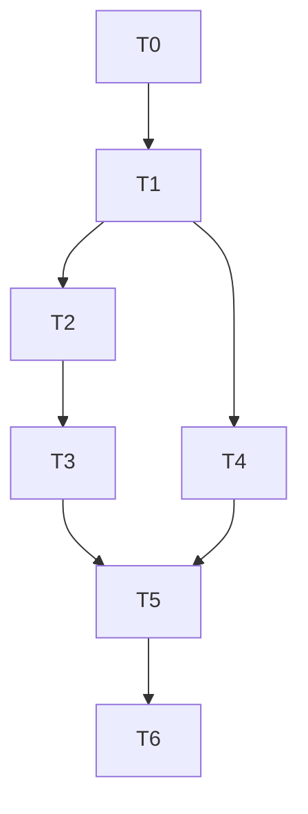

# Phase 21 C3: E2E Testing Framework — Implementation Plan

**Date:** 2026-08-06
**Spec:** `docs/superpowers/specs/2026-08-06-phase21-c3-e2e-testing-design.md`
**Baseline:** 700 tests (587 BE + 113 FE) — all passing
**Target:** 700 unit/integration + 6 E2E tests (separate suite)

## Task Breakdown

### T0: Branch Setup + Baseline Verification
- Create branch `feat/phase21-c3-e2e-testing` from main
- Verify baseline: 587 BE + 113 FE
- Tag: `pre-phase21-c3-2026-08-06`

### T1: Playwright Setup
- Create `e2e/` directory at project root
- Create `e2e/package.json` with `@playwright/test`
- `npm install` in `e2e/`
- Install Chromium browser: `npx playwright install chromium`
- Create `e2e/tsconfig.json`
- Create `e2e/playwright.config.ts`

### T2: Auth Fixtures
- Create `e2e/fixtures/auth.ts` with login helper
- API-based auth: POST to get JWT, inject into localStorage

### T3: E2E Test Specs (6 tests)
- `health.spec.ts` — smoke test
- `auth.spec.ts` — admin login flow
- `admin-dashboard.spec.ts` — admin sees dashboard
- `quiz-flow.spec.ts` — quiz submission flow

### T4: CI Integration
- Update `.github/workflows/ci.yml` with E2E job

### T5: Verification
- Existing tests: 587 BE + 113 FE (unchanged)
- TypeScript check
- Vite build
- E2E tests runnable (may not pass without running server)

### T6: Merge + Tag + Closeout
- Merge to main
- Tag: `phase21-c3-complete-2026-08-06`

## Dependency Graph

