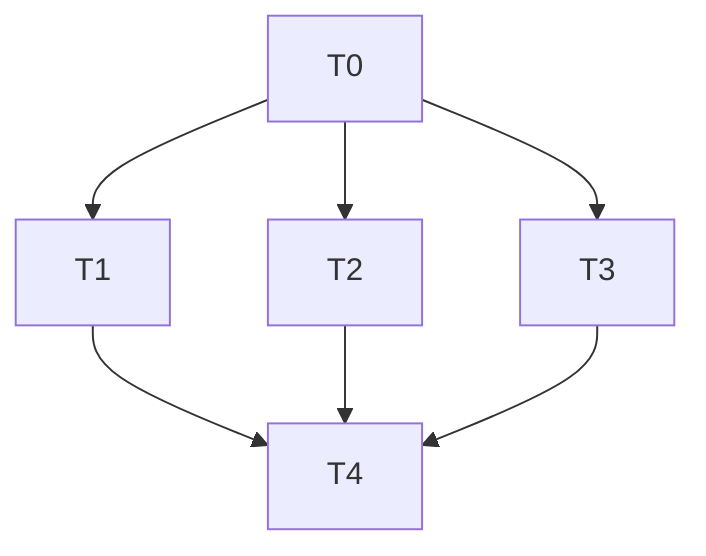

# Phase 22 C1: Technical Debt Cleanup — Implementation Plan

**Date:** 2026-08-06
**Spec:** `docs/superpowers/specs/2026-08-06-phase22-c1-debt-cleanup-design.md`
**Baseline:** 700 tests (587 BE + 113 FE) + 12 E2E — all passing
**Target:** 700 tests + 12 E2E (unchanged), zero TS errors

## Task Breakdown

### T0: Branch Setup + Baseline Verification
- Create branch `feat/phase22-c1-debt-cleanup` from main
- Verify baseline: 587 BE + 113 FE
- Tag: `pre-phase22-c1-2026-08-06`

### T1: Fix QA-013 (TierSelector.tsx)
- Replace `dangerouslySetInnerHTML` with DOMParser + ref approach
- File: `LMS-Frontend/src/components/TierSelector.tsx`

### T2: Fix QA-014 (SponsorDashboard.tsx)
- Refactor `toggleRow()` to separate state update from async fetch
- File: `LMS-Frontend/src/pages/SponsorDashboard.tsx`

### T3: Fix TS Error (TenantAdminPanel.tsx)
- Change `variant="default"` to `variant="primary"`
- File: `LMS-Frontend/src/components/TenantAdminPanel.tsx`

### T4: Verification + Merge + Tag + Closeout
- TypeScript check (zero errors expected)
- Backend tests: 587/587
- Frontend tests: 113/113
- Vite build
- Merge to main
- Tag: `phase22-c1-complete-2026-08-06`
- Write closeout doc

## Dependency Graph

T1, T2, T3 are independent and can run in parallel after T0.
