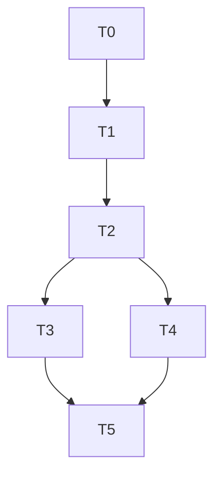

# Phase 22 C2: Cohort Status Transitions — Implementation Plan

**Date:** 2026-08-06
**Spec:** `docs/superpowers/specs/2026-08-06-phase22-c2-cohort-status-lazy-design.md`
**Baseline:** 700 tests (587 BE + 113 FE) + 12 E2E
**Target:** 710 tests (593 BE + 117 FE) + 12 E2E

## Task Breakdown

### T0: Branch Setup + Baseline Verification
- Create branch `feat/phase22-c2-cohort-status-lazy` from main
- Verify baseline: 587 BE + 113 FE
- Tag: `pre-phase22-c2-2026-08-06`

### T1: Schema + Transition Service
- Add start_date/end_date to sponsor_cohorts (ALTER TABLE)
- Create cohort_status_log table
- Add `transitionCohortStatus()` to cohortService.ts
- Update bulkApply() to log transitions

### T2: Lazy Evaluation + Admin Endpoint
- Add lazy status checks to getCohort() and listCohorts()
- Add PATCH /admin/cohorts/:cohortId/status endpoint
- Add GET /admin/cohorts/:cohortId/status-log endpoint
- Add CohortStatusLogEntry type

### T3: Backend Tests (6 new)
- CST-1 through CST-6

### T4: Frontend + FE Tests
- Add override buttons + transition history to CohortManagement
- Add transitionStatus() and getStatusLog() to FE cohortService
- 4 FE tests (CST-F1 through CST-F4)

### T5: Verification + Merge + Tag + Closeout
- tsc, vitest, vite build
- Merge to main, tag

## Dependency Graph

