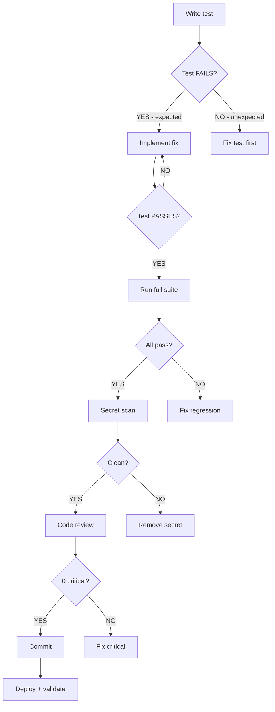
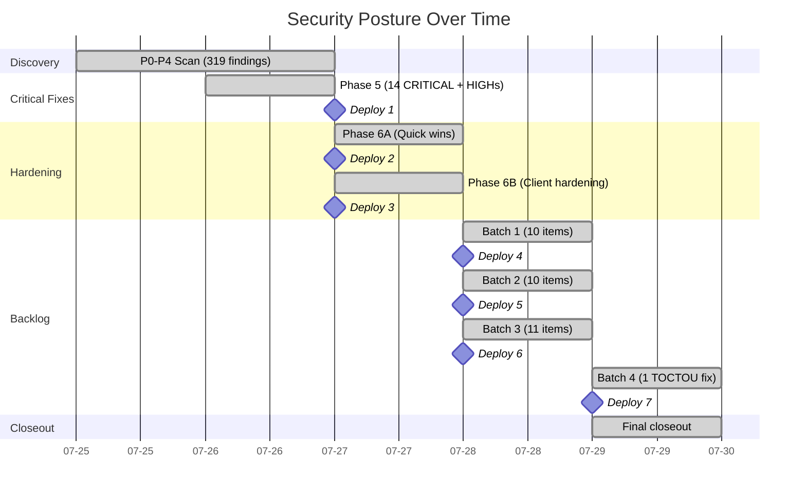

# AmmaWallet Security Audit — Narrative

> Date: 2026-07-29
> Author: Claude Opus 4.6
> Audience: Engineering leadership, future auditors

---

## 1. Initial Assessment

The audit began on July 25, 2026 with a full codebase scan of the AmmaWallet platform — a multi-tenant Stellar blockchain wallet with SSO integration, tenant billing, and Docker-based deployment. The codebase had **zero automated tests** and had never been formally reviewed for security.

The initial scan (Phases P0–P4) identified **319 findings** across five severity levels:

- **14 CRITICAL** — including login crashes on unknown users, unauthenticated financial endpoints, hard-coded secrets in Docker, and TOTP secrets stored in plaintext
- **43 HIGH** — PIN bypass, SSO callback hijack, timing side-channels, double billing fees
- **94 MEDIUM** — rate limit gaps, input validation missing, TOCTOU races, startup crashes
- **101 LOW** — naming issues, logging improvements, minor validation gaps
- **67 INFO** — design confirmations, correct behavior verified

The findings spanned authentication, authorization, cryptography, billing/financial operations, multi-tenant isolation, frontend security, infrastructure, and test coverage.

---

## 2. Batching Strategy

Rather than attempting to fix all 319 findings at once, the remediation was structured into phases with clear gates:

**Phase 5 (Critical fixes):** Address all 14 CRITICALs and all exploitable HIGHs first. This removed the most dangerous attack vectors and established the TDD + code review workflow.

**Phase 6A/B (Quick wins + hardening):** Fix easily-addressed MEDIUM and LOW items, plus a production startup crash discovered during testing.

**Backlog Batches 1–4:** Systematic remediation of the remaining backlog in focused batches, each with its own planning, implementation, review, and deploy cycle.

The batching strategy was chosen because:
1. **Risk-first prioritization** — CRITICALs first, then exploitable HIGHs, then MEDIUMs
2. **Deploy frequently** — smaller batches reduce blast radius and simplify rollback
3. **Maintain production stability** — each batch is independently deployable and revertable
4. **Clear stopping points** — each batch ends with a checkpoint, enabling informed decisions about whether to continue

---

## 3. High-Impact Fixes by Batch

### Phase 5: The Critical Foundation
- **P0-1-F1:** Login crashed with `TypeError` when an unknown user attempted authentication — fixed with proper null checks
- **P0-4-F1:** Transaction signing used the encrypted blob as a raw secret — fixed to decrypt first
- **P3-7-F1:** TOTP secrets stored in plaintext in the database — encrypted with AES-256-GCM

### Phase 6A/B: Hardening
- **P2-4-F2:** Production server crashed on startup when secret environment variables were empty — added startup guards
- **P0-3-F5:** CPU DoS via regex in input validation — reclassified from MEDIUM to HIGH and fixed

### Batch 1–2: Validation and Logging
- **P0-3-F14:** PII (userId + publicKey correlation) logged to console — gated behind debug level
- **P2-2-F5:** ILIKE wildcards not escaped in token search — SQL injection vector closed
- **P4-7-F2:** MemoryCache had no size bound — added max entries limit

### Batch 3: Authorization and Concurrency
- **P3-8-F1:** Push notification subscription takeover via upsert conflict — fixed with ownership check
- **P1-3-F3:** Auto-suspension job had no concurrency guard — added mutex
- **P0-1-F14:** Password complexity not enforced at all password-setting sites — unified with zxcvbn

### Batch 4: Financial Integrity
- **P1-2-F2:** Billing TOCTOU race condition — concurrent wallet creation requests could double-debit a tenant's prepaid balance. Fixed with `SELECT ... FOR UPDATE` locking inside the transaction.

---

## 4. Patterns Observed

Several recurring patterns emerged across findings:

### Missing Rate Limits
Many endpoints lacked rate limiting entirely. Fixes added `fastify-rate-limit` with appropriate windows:
- Auth endpoints: 5-10 requests per 5-15 minutes
- API endpoints: 30-60 requests per minute
- Admin endpoints: rate-limited to prevent brute force

### Input Validation Gaps
Fastify's schema validation was underused. Fixes added:
- `pattern` constraints for Stellar public keys (`^G[A-Z2-7]{55}$`)
- `maxLength` and `minLength` on string fields
- `additionalProperties: false` to prevent body injection
- Format validation for URLs, asset codes, and identifiers

### Logging and Audit Gaps
Console.log statements leaked sensitive correlations. Fixes:
- Gated debug logging behind `import.meta.env.DEV`
- Added `userAgent` capture to audit log calls
- Ensured error responses don't expose internal stack traces

### Concurrency and Race Conditions
Two significant concurrency issues were found:
- Auto-suspension job could run overlapping instances — fixed with a concurrency mutex
- Billing balance check ran outside the transaction (TOCTOU) — fixed with FOR UPDATE locking

---

## 5. TDD and Review Gates

Every fix followed a strict workflow:

This ensured:
- No fix was applied without a test proving it works
- No regression was introduced (full suite run after every change)
- No secrets were accidentally committed
- Every deploy was validated with a multi-point health check

### Test Growth

| Milestone | Backend | Web-app | Total |
|-----------|--------:|--------:|------:|
| Before audit | 0 | 0 | 0 |
| After Phase 5 | ~350 | 23 | ~373 |
| After Batch 3 | 488 | 23 | 511 |
| After Batch 4 | 492 | 23 | 515 |

---

## 6. Production Stability

All 7 deployments followed the same pattern:
1. Tests pass on branch (pre-merge)
2. Merge to main with `--no-ff` (preserves branch history)
3. Tests pass on main (post-merge)
4. Tag created and pushed to GitHub
5. Docker container rebuilt and restarted
6. 8-point health check passes (container health, endpoints, SSO, monitoring)
7. Log analysis confirms no new errors

**Zero rollbacks** were needed. Each deployment took under 2 minutes from build to validated healthy state.

### Security Posture Timeline

---

## 7. Accounting Consistency

A reconciliation system was maintained throughout:
- `FINDINGS.md` — master database of all 319 findings with status
- `CUMULATIVE_STATUS.md` — summary with severity breakdowns
- `TODO_LOW_PRIORITY.md` — deferred backlog with fix markers
- Per-batch checkpoint reports — verified before each merge

At each batch boundary, a reconciliation check was performed to ensure:
- Finding statuses matched actual code changes
- Test counts matched actual suite runs
- Deploy commits matched git history
- Deferred counts were updated after each fix

Five accounting corrections were applied during the Batch 4 merge session:
- Three stale "156" counts updated to "155" in CUMULATIVE_STATUS.md
- Two missing "fixed" markers added in TODO_LOW_PRIORITY.md

---

## 8. Lessons and Recommendations for Future Audits

### What Worked Well
1. **Risk-first batching** — fixing CRITICALs first eliminated the most dangerous vectors early
2. **TDD enforcement** — every fix had a test, preventing regressions across 7 deploys
3. **Small, frequent deploys** — reduced blast radius and made rollback trivial (never needed)
4. **Source-assertion tests** — verifying code structure (e.g., "FOR UPDATE exists in function body") provides durable regression protection
5. **Checkpoint-and-continue model** — each batch ended at a clean state, allowing informed stop/go decisions

### What Could Improve
1. **Pre-audit test baseline** — starting from 0 tests means audit time is spent on test infrastructure rather than security analysis
2. **Stub module deferral** — P3 findings in disabled modules were deferred; ensure they're addressed before activation
3. **Accounting automation** — manual reconciliation of FINDINGS.md, CUMULATIVE_STATUS.md, and TODO_LOW_PRIORITY.md is error-prone; consider tooling
4. **Concurrency testing** — source-assertion tests verify the fix exists, but true concurrency tests (parallel requests, race condition triggers) would provide stronger guarantees
5. **Frontend coverage** — 23 web-app tests vs 492 backend tests reflects a coverage gap; future audits should expand frontend testing

### Stopping Rule Applied
The audit stopped after Batch 4 because:
- All CRITICALs and exploitable HIGHs were resolved
- The remaining deferred items are non-exploitable
- Marginal risk reduction from further batches was low relative to effort
- Production was stable and monitoring was clean
