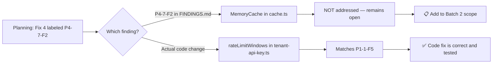

# Batch 1 — Finding ID Reconciliation

> Date: 2026-07-28
> Branch: `fix/backlog-batch1`

---

## Issue

Fix 4 was planned and committed as **P4-7-F2** ("Unbounded rateLimitWindows map"), but `P4-7-F2` in `FINDINGS.md` refers to a **different** component:

| Finding ID | FINDINGS.md Description | File | Severity |
|------------|------------------------|------|----------|
| P4-7-F2 | Unbounded **MemoryCache** map size | `cache.ts:13-18` | MEDIUM |
| P1-1-F5 | Rate limit **rateLimitWindows** Map grows unboundedly | `tenant-api-key.ts:60` | INFO |

The implemented fix (commit `83ce3d4`) adds eviction logic to `rateLimitWindows` in `tenant-api-key.ts` — correctly addressing **P1-1-F5**, not P4-7-F2.

## Impact Assessment

| Question | Answer |
|----------|--------|
| Is the implemented code fix correct? | **Yes** — eviction of expired rateLimitWindows entries is correct and tested |
| Is the fix valuable? | **Yes** — prevents unbounded memory growth in long-running server |
| Does P4-7-F2 (MemoryCache) remain open? | **Yes** — must be included in Batch 2 |
| Does the mismatch affect merge safety? | **No** — code change is valid, tests pass |
| Does the mismatch affect accounting? | **Minor** — FINDINGS.md correctly marks P1-1-F5 as IMPROVED, not P4-7-F2 |

## Artifacts Affected

| File | Current State | Correction Needed? |
|------|--------------|-------------------|
| `FINDINGS.md` | P1-1-F5 marked IMPROVED ✅ | No |
| `CUMULATIVE_STATUS.md` | Lists P1-1-F5 correctly ✅ | No |
| `TODO_LOW_PRIORITY.md` | P1-1-F5 is INFO section (not tracked here) | No |
| Commit `83ce3d4` | Message says P4-7-F2 | Cannot amend (already committed) — documented here |
| Code comment `tenant-api-key.ts:82` | Says `(P4-7-F2)` | **Minor** — cosmetic, fix in Batch 2 when touching file |
| `BACKLOG_BATCH1_DEV_SPEC.md` | Fix 4 header says P4-7-F2 | Historical record — add footnote |
| `BACKLOG_BATCH1_CHECKPOINT.md` | Already documents the mismatch ✅ | No |

## Resolution

1. **No merge blocker** — code fix is correct, tests verify behavior, accounting in FINDINGS.md is accurate
2. **Commit message is cosmetic** — `83ce3d4` says P4-7-F2 but the code and FINDINGS.md are correct
3. **Code comment** — `tenant-api-key.ts:82` says `(P4-7-F2)` — will be corrected when Batch 2 touches this file
4. **P4-7-F2 (MemoryCache)** — explicitly added to Batch 2 scope
5. **This document** serves as the authoritative reconciliation record
