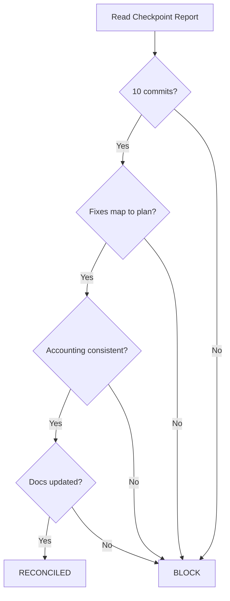

# Batch 2 — Execution Reconciliation

> Date: 2026-07-28
> Branch: `fix/backlog-batch2` (11 commits)

---

## Fix-to-Commit Mapping

| Plan Order | Finding | Planned File(s) | Actual Commit | Status |
|------------|---------|-----------------|---------------|--------|
| Fix 10 | P2-7-F4 | auth.ts, server.ts, admin.ts | `9bc68a8` | Match |
| Fix 9 | P4-7-F2 | cache.ts | `afb682e` | Match |
| Fix 5 | P1-3-F2 | auto-suspension.ts | `f8e8782` | Match |
| Fix 3 | P2-2-F2 | toml-sync.ts | `e5cc5e6` | Match |
| Fix 4 | P2-2-F3 | icon-resolver.ts | `4f52196` | Match |
| Fix 6 | P3-6-F4 | contacts.ts | `8486967` | Match |
| Fix 7 | P3-8-F3 | push.ts | `9399368` | Match |
| Fix 8 | P3-9-F2 | curated-tokens.ts | `70bb41d` | Match |
| Fix 1 | P2-1-F4 | trustlines.ts | `b229a82` | Match |
| Fix 2 | P2-1-F5 | trustlines.ts | `ede27e1` | Match |

**All 10 fixes map to planned commits. No orphan or missing commits.**

---

## Plan vs Actual Deviations

| Item | Planned | Actual | Impact |
|------|---------|--------|--------|
| auth.ts auditLog calls | 10 | 9 | None — count difference, all present calls updated |
| admin.ts auditLog calls | 9 | 8 | None — count difference, all present calls updated |
| Total auditLog calls | 21 | 19 | None — cosmetic plan variance |
| Existing test mock updates | Not planned | 3 files updated | Required: StrKey mock + user-agent headers |

---

## Accounting Reconciliation

| Metric | Before Batch 2 | After Batch 2 | Expected | Match? |
|--------|----------------|---------------|----------|--------|
| Resolved findings | 86 | 96 | 96 | Yes |
| Deferred findings | 166 | 156 | 156 | Yes |
| INFO findings | 67 | 67 | 67 | Yes |
| Backend tests | 410 | 453 | 410 + 43 = 453 | Yes |
| Web-app tests | 23 | 23 | 23 | Yes |
| Resolution rate | 48.0% | 51.1% | ~51% | Yes |

---

## Documents Updated

| Document | Claimed Update | Verified |
|----------|---------------|----------|
| FINDINGS.md | 10 items marked FIXED | Yes — all 10 headings show FIXED with commit hashes |
| CUMULATIVE_STATUS.md | 86→96, 166→156, Batch 2 section | Yes — counts correct, Batch 2 table present |
| TODO_LOW_PRIORITY.md | 9 items marked ✅ Batch 2 | Yes — P4-7-F2 not in this file (MEDIUM, tracked in FINDINGS.md only) |
| BACKLOG_BATCH2_TODO.md | All items checked off | Yes — all `[x]` |

---

## Conclusion

Execution matches plan. All accounting is consistent. No discrepancies found.

