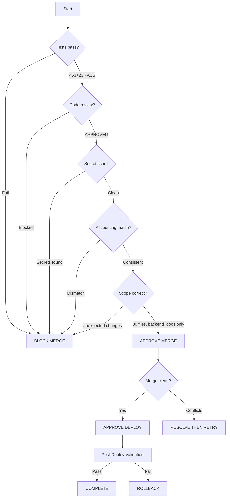

# Batch 2 — Release Decision

> Date: 2026-07-28
> Decision: **APPROVED FOR MERGE AND DEPLOY**

---

## Decision Flow

## Risk Assessment

| Risk | Level | Mitigation |
|------|-------|------------|
| Rate limit too strict | Low | Conservative values (30/min contacts, 5/15min push) |
| /curated/seed auth gate | Low | No known unauthenticated callers |
| Trustline 400 vs 500 change | Low | Better error codes, not breaking |
| MemoryCache eviction | Very Low | Only affects >500 unique keys (current usage: ~10) |
| unsuspend guard | Very Low | Only affects auto-suspension job, not admin UI |

## Merge Plan

1. `git checkout main`
2. `git merge --no-ff fix/backlog-batch2`
3. Verify 453/453 + 23/23 post-merge
4. Tag `batch2-complete-2026-07-28`
5. Push to GitHub

## Deploy Plan

1. Push main to GitHub
2. `cd ~/amma-wallet-docker && docker compose up -d --no-deps --build amma-api`
3. Post-deploy health check
4. Smoke tests (auth, trustlines, contacts)

## Rollback Plan

If post-deploy validation fails:
1. `git revert --no-commit HEAD` (revert merge)
2. Rebuild and redeploy
3. Create BATCH2_INCIDENT_NOTES.md
