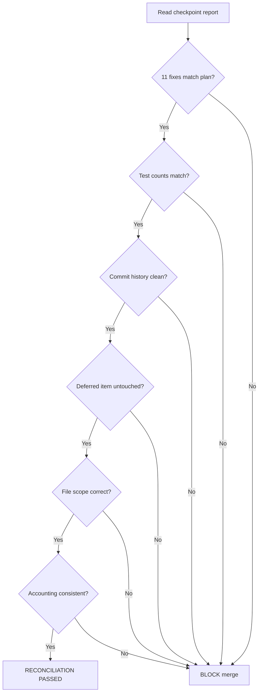

# Batch 3 — Execution Reconciliation

> Date: 2026-07-28
> Branch: `fix/backlog-batch3` from `main` at `f8b15da`

---

## Planned vs Executed

| # | Finding | Planned | Executed | Commit | Status |
|---|---------|---------|----------|--------|--------|
| 1 | P3-8-F1 | Push subscription takeover guard | userId removed from set, WHERE guard added | `b1178b4` | MATCH |
| 2 | P3-9-F1 | Curated seed admin guard | verifyInternalAdmin + role check + 403 | `70f1fd4` | MATCH |
| 3 | P3-6-F3 | Contacts PATCH injection guard | additionalProperties: false | `1ca8729` | MATCH |
| 4 | P1-3-F3 | Auto-suspension concurrency guard | isRunning + finally block | `7c6997a` | MATCH |
| 5 | P3-6-F2 | Contacts address validation | StrKey.isValidEd25519PublicKey in POST | `cc1080b` | MATCH |
| 6 | P3-7-F11 | Email code invalidation | UPDATE used=true before INSERT at 3 sites | `ab3042f` | MATCH |
| 7 | P3-8-F4 | Push subscription limit | COUNT check, max 10, 429 response | `604979d` | MATCH |
| 8 | P1-3-F1 | acquisitionModeEnabled guard | Check in enforceDebtLimit WHERE clause | `3450bba` | MATCH |
| 9 | P3-7-F10 | TOTP window reduction | window: 2 → window: 1 at both sites | `982151c` | MATCH |
| 10 | P0-2-F3 | CREDIT_ROLES rename | PRIVILEGED_ROLES at 8 sites (1 def + 7 usage) | `4b9e8d8` | MATCH |
| 11 | P0-1-F14 | Password complexity | validatePasswordStrength at 4 sites | `b942707` | MATCH |
| 12 | P1-2-F2 | Billing TOCTOU | DEFERRED | — | DEFERRED |

**All 11 executed fixes match their planned specifications. 1 item correctly deferred.**

---

## Test Count Reconciliation

| Stage | Backend | Web-app | Total |
|-------|---------|---------|-------|
| Baseline (main) | 453 | 23 | 476 |
| After Fix 1 | 455 | 23 | 478 |
| After Fix 2 | 458 | 23 | 481 |
| After Fix 3 | 460 | 23 | 483 |
| After Fix 4 | 463 | 23 | 486 |
| After Fix 5 | 465 | 23 | 488 |
| After Fix 6 | 467 | 23 | 490 |
| After Fix 7 | 470 | 23 | 493 |
| After Fix 8 | 472 | 23 | 495 |
| After Fix 9 | 474 | 23 | 497 |
| After Fix 10 | 476 | 23 | 499 |
| After Fix 11 | 488 | 23 | 511 |

**Delta: +35 backend tests. Web-app unchanged. Consistent with checkpoint report.**

---

## Commit History Reconciliation

| # | Commit | Message | Finding ID |
|---|--------|---------|------------|
| 1 | `b1178b4` | fix(push): prevent subscription takeover via conflict update | P3-8-F1 |
| 2 | `70f1fd4` | fix(curated): restrict /curated/seed to admin role | P3-9-F1 |
| 3 | `1ca8729` | fix(contacts): prevent PATCH body injection via additionalProperties | P3-6-F3 |
| 4 | `7c6997a` | fix(jobs): add concurrency guard to auto-suspension job | P1-3-F3 |
| 5 | `cc1080b` | fix(contacts): validate Stellar address with StrKey | P3-6-F2 |
| 6 | `ab3042f` | fix(2fa): invalidate old email codes on re-send | P3-7-F11 |
| 7 | `604979d` | fix(push): limit subscriptions to 10 per user | P3-8-F4 |
| 8 | `3450bba` | fix(jobs): check acquisitionModeEnabled in debt limit enforcement | P1-3-F1 |
| 9 | `982151c` | fix(2fa): reduce TOTP verification window from 2 to 1 | P3-7-F10 |
| 10 | `4b9e8d8` | fix(admin): rename CREDIT_ROLES to PRIVILEGED_ROLES | P0-2-F3 |
| 11 | `b942707` | fix(auth): enforce password complexity at all password-setting sites | P0-1-F14 |
| 12 | `bc42a3e` | docs: Batch 3 checkpoint report and TODO completion | — |

All 11 fix commits include Co-Authored-By line. 1 docs commit. No unexpected commits.

---

## File Scope Reconciliation

| File | Expected Changes | Actual | Match |
|------|-----------------|--------|-------|
| `routes/push.ts` | Fix 1 + Fix 7 | Fix 1 + Fix 7 | YES |
| `routes/curated-tokens.ts` | Fix 2 | Fix 2 | YES |
| `routes/curated-tokens-auth.test.ts` | Updated for Fix 2 | Updated | YES |
| `routes/contacts.ts` | Fix 3 + Fix 5 | Fix 3 + Fix 5 | YES |
| `jobs/auto-suspension.ts` | Fix 4 + Fix 8 | Fix 4 + Fix 8 | YES |
| `routes/two-fa.ts` | Fix 6 + Fix 9 | Fix 6 + Fix 9 | YES |
| `routes/admin.ts` | Fix 10 | Fix 10 | YES |
| `routes/auth.ts` | Fix 11 | Fix 11 | YES |
| `lib/password-validation.ts` | Fix 11 (new) | Created | YES |
| `services/billing.service.ts` | NOT changed (deferred) | NOT changed | YES |
| `routes/wallets.ts` | NOT changed (deferred) | NOT changed | YES |

**23 files changed total (8 source + 12 test + 2 docs + 1 existing test update). All within expected scope.**

---

## Deferred Item Verification

**P1-2-F2 (Billing TOCTOU):**
- `billing.service.ts`: NOT modified in this branch
- `wallets.ts`: NOT modified in this branch
- No partial implementation detected
- Correctly documented for Batch 4

---

## Accounting Update

| Metric | Before Batch 3 | After Batch 3 | Delta |
|--------|----------------|---------------|-------|
| Total findings | 319 | 319 | — |
| Resolved (pre-batch) | 77 | 77 | — |
| Resolved (Batch 1) | 10 | 10 | — |
| Resolved (Batch 2) | 10 | 10 | — |
| Resolved (Batch 3) | — | 11 | +11 |
| **Total resolved** | **97** | **108** | **+11** |
| Deferred | 155 | 144 | -11 |
| INFO (unchanged) | 67 | 67 | — |
| **Resolution rate** | **30.4%** | **33.9%** | **+3.4%** |

---

## Verdict: RECONCILIATION PASSED

All executed fixes match their planned specifications. Test counts, commit history, file scope, deferred item status, and accounting are all consistent.
