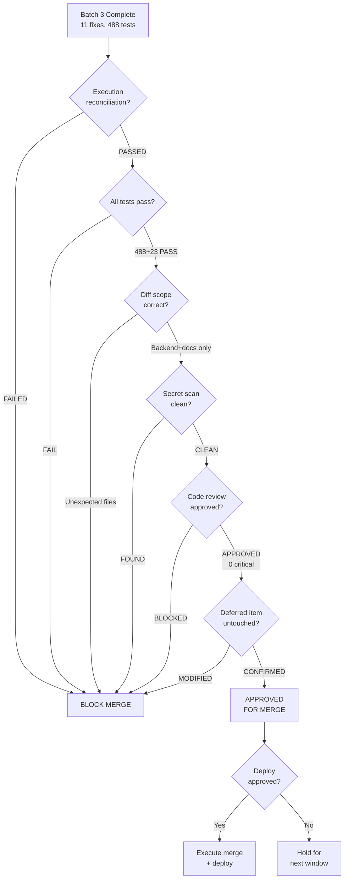

# Batch 3 — Release Decision

> Date: 2026-07-28
> Reviewer: Claude Opus 4.6
> Decision: **APPROVED FOR MERGE AND DEPLOY**

---

## Decision Flow



---

## Evidence Summary

| Criterion | Evidence | Status |
|-----------|----------|--------|
| Tests | 488/488 backend + 23/23 web-app | PASS |
| Code review | 11/11 fixes APPROVED, 0 critical | PASS |
| Reconciliation | 11/11 match plan, 1 correctly deferred | PASS |
| Scope | 23 files, backend/src + docs only | PASS |
| Secrets | Clean scan | PASS |
| Regressions | Zero | PASS |

---

## Merge Plan

```bash
git checkout main
git merge --no-ff fix/backlog-batch3 -m "Merge fix/backlog-batch3: 11 security fixes (Batch 3)"
git tag batch3-complete-2026-07-28
```

---

## Deploy Plan

1. Pre-deploy: verify main branch tests pass
2. Deploy: `docker compose up -d --no-deps --build amma-api`
3. Post-deploy: health check, auth gate, password complexity, frontend
4. Rollback: `git revert <merge-commit> && docker compose up -d --no-deps --build amma-api`

---

## Risk Assessment

- **Rollback complexity:** LOW — single merge commit revertable
- **Data impact:** NONE — no migrations, no schema changes
- **User-facing changes:** Password complexity (new passwords only), TOTP window tightened
- **Admin-facing changes:** /curated/seed requires admin role

---

## Approval

**APPROVED** for immediate merge and deploy. Deploy #6 in the audit remediation series.
