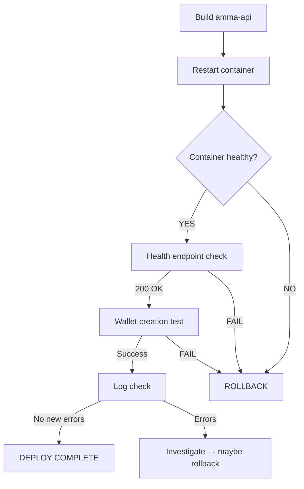

# Batch 4 — Deploy Plan

> Date: 2026-07-29
> Merge commit: `01d17bd`
> Tag: `batch4-complete-2026-07-29`

---

## Pre-Deploy Checks

1. Merge verified on main (492/492 + 23/23)
2. Tag pushed to GitHub
3. No schema/migration changes — no DB work needed
4. Backend-only change — no frontend rebuild needed

---

## Deploy Steps

1. **Build API container:**
   ```bash
   cd /home/webadmin/amma-wallet-docker
   docker compose build amma-api
   ```

2. **Restart API container (zero-downtime):**
   ```bash
   docker compose up -d --no-deps amma-api
   ```

3. **Verify container health:**
   ```bash
   docker ps --filter name=amma-api --format "{{.Status}}"
   curl -s https://ammawallet.com/api/health | head -1
   ```

---

## Rollback Plan

If post-deploy validation fails:

1. Revert merge:
   ```bash
   cd /home/webadmin/web-stack/html/amma-wallet
   git revert 01d17bd
   ```

2. Rebuild and restart:
   ```bash
   cd /home/webadmin/amma-wallet-docker
   docker compose build amma-api && docker compose up -d --no-deps amma-api
   ```

3. Verify rollback:
   ```bash
   curl -s https://ammawallet.com/api/health
   ```

---

## Deploy + Validation Flow



---

## No-Action Items

- No frontend rebuild (backend-only fix)
- No database migration
- No nginx config change
- No environment variable changes
