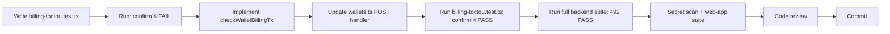

# Batch 4 — Execution Readiness Assessment

> Date: 2026-07-29
> Branch: `fix/backlog-batch4` at `e42b72c`
> Base: `bf64194` (Batch 3 merge)
> Baseline: 488/488 backend + 23/23 web-app (confirmed 2026-07-29)

---

## 1. Artifact Assessment

### Planning Artifacts — Status

| Artifact | Status | Notes |
|----------|--------|-------|
| `BACKLOG_BATCH4_DEV_SPEC.md` | READY | Accurate Mermaid diagrams, correct file/line refs |
| `BACKLOG_BATCH4_IMPLEMENTATION_PLAN.md` | READY | Step-by-step with code blocks, accurate |
| `BACKLOG_BATCH4_TODO.md` | READY | Clean checklist format |
| `BACKLOG_BATCH4_CODE_REVIEW_CHECKLIST.md` | READY | Comprehensive per-fix + end-of-batch |
| `BACKLOG_BATCH4_VERIFICATION.md` | READY | Commands + expected outputs documented |

### Current State References — Verified

| Document | Key Data | Status |
|----------|----------|--------|
| `FINDINGS.md` | P1-2-F2 listed as MEDIUM, not yet resolved | CONSISTENT |
| `CUMULATIVE_STATUS.md` | 319 findings, 156 deferred, P1-2-F2 in deferred pool | CONSISTENT |
| `TODO_LOW_PRIORITY.md` | P1-2-F2 not listed (MEDIUM, tracked separately) | CONSISTENT |
| `BATCH3_MERGE_REPORT.md` | Merge commit `bf64194`, 488/488, tag `batch3-complete-2026-07-28` | CONSISTENT |

---

## 2. Source Code Verification

### billing.service.ts — Line Number Check

| Spec Reference | Actual | Match |
|----------------|--------|-------|
| `checkWalletBilling()` at ~line 222 | Line 222 | YES |
| Add new function after line 313 | Line 313 = closing brace of `checkWalletBilling` | YES |
| `writeBillingDebit()` at line 321 | Line 321 | YES |
| Existing `tx: any` pattern in `writeBillingDebit` | Line 322-323 | YES |

### wallets.ts — Line Number Check

| Spec Reference | Actual | Match |
|----------------|--------|-------|
| Pre-flight `checkWalletBilling` at lines 155-165 | Lines 155-165 | YES |
| Transaction block at lines 170-234 | Lines 170-234 | YES |
| `billingResult` declared at line 157 | Line 157 | YES |
| Stale `billingResult` used inside tx at line 192 | Line 192 | YES (TOCTOU) |

### Drizzle ORM `.for()` Support

- Drizzle version: 0.45.2 (confirmed in package.json)
- `.for("update")` is supported since drizzle-orm 0.29.0
- No fallback to raw SQL needed

---

## 3. Gaps Identified

**No corrective patches needed.** All artifacts are accurate.

- wallets.ts error handling scope: plan correctly identifies `try/catch` wrapper needed
- `billingResult` reassignment: type-safe (`BillingCheckResult` returned by both functions)
- Test count: 488 + 4 source-assertion tests = 492 expected

---

## 4. TOCTOU Vulnerability Confirmation

### Vulnerable Path (current code)

```
wallets.ts:160  → checkWalletBilling() reads balance OUTSIDE transaction (no lock)
wallets.ts:170  → db.transaction() begins
wallets.ts:192  → stale billingResult used to decide billing action
wallets.ts:202  → writeBillingDebit() debits based on stale check
```

**Race window:** Between line 160 (read) and line 202 (write), another concurrent request can read the same balance, pass the check, and double-debit.

### Fix Strategy

1. Keep pre-flight `checkWalletBilling()` at line 160 for fast rejection (no lock overhead)
2. Inside `db.transaction()`, call new `checkWalletBillingTx(tx, ...)` with `FOR UPDATE` lock
3. If locked check fails → throw error with `httpStatus` → catch outside transaction → return error
4. If locked check passes → reassign `billingResult` → proceed with debit using fresh data

### Isolation Guarantee

- `FOR UPDATE` on tenant row serializes concurrent wallet creations for the same tenant
- Lock scope: single row in `tenants` table, always by `id` — no deadlock risk
- Lock duration: ~50ms (wallet insert + billing debit)
- Lock released on COMMIT or ROLLBACK (PostgreSQL guarantee)

---

## 5. TDD Path



---

## 6. Verification Gates

| Gate | Command | Expected |
|------|---------|----------|
| Source-assertion FAIL | `npx vitest run src/services/billing-toctou.test.ts` | 4 FAIL |
| Source-assertion PASS | `npx vitest run src/services/billing-toctou.test.ts` | 4 PASS |
| Billing unit tests | `npx vitest run src/services/billing.service.test.ts` | All PASS |
| Full backend suite | `npx vitest run` | 492 PASS |
| Web-app suite | `cd ../web-app && npx vitest run` | 23 PASS |
| Secret scan | `git diff main -- packages/backend/src/` | No real secrets |

---

## 7. Risk Boundaries — Files NOT to Touch

- `checkWalletBilling()` — must NOT be modified
- `writeBillingDebit()` — must NOT be modified
- `writeBillingCredit()` — must NOT be modified
- No frontend files
- No stub modules (Earn, Fiat, MoneyGram)
- No schema/migration files
- No auth/admin/SSO routes

---

## 8. Execution Statement

**The single fix P1-2-F2 (Billing TOCTOU) is READY for implementation.**

- All planning artifacts are accurate and consistent
- Source line numbers match the spec exactly
- Drizzle `.for("update")` is confirmed supported
- Baseline tests pass (488/488)
- Branch `fix/backlog-batch4` is clean and ready
- TDD path: 4 source-assertion tests → implement → verify → commit
- No pause conditions triggered
- No corrective patches needed

**Verdict: READY FOR EXECUTION**
