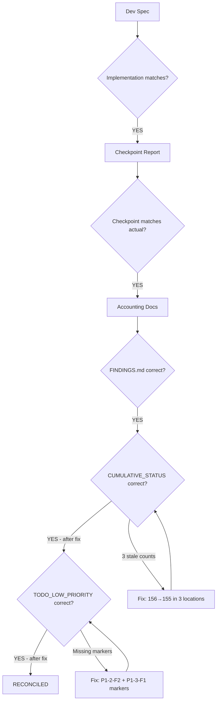

# Batch 4 — Execution Reconciliation

> Date: 2026-07-29
> Purpose: Verify implementation matches plan, docs match implementation, accounting is accurate

---

## Reconciliation Flow

---

## 1. Plan vs Implementation

| Planned (Dev Spec) | Implemented | Match |
|--------------------|-------------|-------|
| Add `checkWalletBillingTx()` to billing.service.ts | Added at line 315 | YES |
| `tx.select().for("update")` on tenant row | Line 338 | YES |
| Same validation logic as `checkWalletBilling()` | All paths mirrored | YES |
| Returns `BillingCheckResult` | Same type | YES |
| Call inside `db.transaction()` in wallets.ts | Line 176 | YES |
| Throw error with `httpStatus` on failure | Lines 178-182 | YES |
| Reassign `billingResult` to locked result | Line 183 | YES |
| Add `try/catch` for billing errors | Lines 168-238 | YES |
| Keep pre-flight `checkWalletBilling()` | Line 161 | YES |
| 4 source-assertion tests | 4 tests in billing-toctou.test.ts | YES |
| No changes to `checkWalletBilling()` | Not in diff | YES |
| No changes to `writeBillingDebit()` | Not in diff | YES |
| No frontend changes | Not in diff | YES |
| No schema/migration changes | Not in diff | YES |

**Plan-to-implementation match: 100%**

---

## 2. Checkpoint vs Actual

| Checkpoint Claim | Actual | Match |
|-----------------|--------|-------|
| Files changed: 3 source | billing.service.ts, wallets.ts, billing-toctou.test.ts | YES |
| Tests added: 4 | 4 in billing-toctou.test.ts | YES |
| Backend: 492/492 | 492/492 (verified this session) | YES |
| Web-app: 23/23 | 23/23 (verified this session) | YES |
| Commit: d2e9000 | d2e9000 (verified via git log) | YES |
| Code review: 0 critical, 1 important deferred | Confirmed, rationale documented | YES |
| Secret scan: CLEAN | CLEAN (verified this session) | YES |

**Checkpoint-to-actual match: 100%**

---

## 3. Accounting Reconciliation

### Corrections Applied

| Document | Issue | Fix |
|----------|-------|-----|
| CUMULATIVE_STATUS.md (line 39) | Said "156 deferred" | Fixed to "155 deferred" |
| CUMULATIVE_STATUS.md (line 46) | Said "156 deferred" | Fixed to "155 deferred" |
| CUMULATIVE_STATUS.md (line 210) | Section header "156 items" | Fixed to "155 items" |
| TODO_LOW_PRIORITY.md | P1-2-F2 missing fixed marker | Added "✅ Batch 4 (d2e9000)" |
| TODO_LOW_PRIORITY.md | P1-3-F1 missing fixed marker (Batch 3) | Added "✅ Batch 3 (3450bba)" |

### Post-Correction Verification

| Document | Field | Value | Correct |
|----------|-------|-------|---------|
| FINDINGS.md | P1-2-F2 status | FIXED — d2e9000 (Batch 4) | YES |
| CUMULATIVE_STATUS.md | Total findings | 319 | YES |
| CUMULATIVE_STATUS.md | Resolved | 97 (30.4%) | YES |
| CUMULATIVE_STATUS.md | INFO | 67 (21.0%) | YES |
| CUMULATIVE_STATUS.md | Deferred | 155 (48.6%) | YES |
| CUMULATIVE_STATUS.md | Math check | 97+67+155 = 319 | YES |
| TODO_LOW_PRIORITY.md | P1-2-F2 | ✅ Batch 4 | YES |
| TODO_LOW_PRIORITY.md | P1-3-F1 | ✅ Batch 3 | YES |

---

## 4. Batch History Summary

| Batch | Date | Fixes | Tag | Deploy |
|-------|------|-------|-----|--------|
| Batch 1 | 2026-07-28 | 9 LOW + 1 INFO | `batch1-complete-2026-07-28` | Deployed |
| Batch 2 | 2026-07-28 | 10 items (9 LOW + 1 MEDIUM) | `batch2-complete-2026-07-28` | Deployed |
| Batch 3 | 2026-07-28 | 11 items (mixed) | `batch3-complete-2026-07-28` | Deployed |
| Batch 4 | 2026-07-29 | 1 MEDIUM (P1-2-F2) | `batch4-complete-2026-07-29` | Pending |

**Cumulative fixes across batches: 31 + prior phase fixes = 97 total resolved**

---

## 5. Deferred Review Item Acceptance

**I-1: Helper functions use `db` instead of `tx`**

- **Status:** Accepted as non-blocking
- **Rationale:** The balance field (race target) IS read with FOR UPDATE lock via `tx`. The helpers read:
  - `getBillingPolicy()` — immutable policy config
  - `countUserWallets()` — wallet count (INSERT happens after check)
  - `isActiveTenantUser()` — activity window (unrelated to concurrent wallet creation)
- **Future action:** Consider `tx`-passing variants in a future iteration for strict serializability
- **Risk if not addressed:** Theoretical stale read of non-critical data under extreme concurrency. No financial impact — balance is locked.

---

## 6. Reconciliation Verdict

**RECONCILED** — Implementation matches plan, docs match implementation, accounting is accurate after 5 corrections.

No blockers. Merge can proceed.
