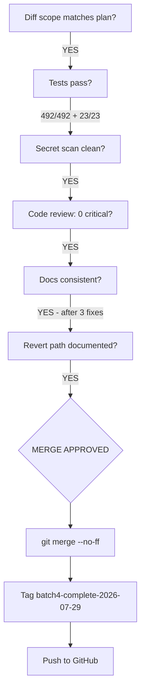

# Batch 4 — Merge Readiness Review

> Date: 2026-07-29
> Reviewer: Claude Opus 4.6 (merge-readiness session)
> Branch: `fix/backlog-batch4`
> Commits: `d2e9000` (fix), `8cfcbb9` (docs)
> Base: `main` at `bf64194` (Batch 3 merge)

---

## 1. Pre-Merge Verification Results

| Check | Result | Evidence |
|-------|--------|----------|
| Backend tests | 492/492 PASS | 71 test files, 11.80s |
| Web-app tests | 23/23 PASS | 7 test files, 1.05s |
| Secret scan | CLEAN | Only `encryptedSecret` field name + `publicKey` indentation in diff |
| Diff scope | 10 files, 3 source files | Matches checkpoint claim |
| Commit history | 2 clean commits | Fix + docs, correct format |
| `checkWalletBilling()` unmodified | YES | Not in diff |
| `writeBillingDebit()` unmodified | YES | Not in diff |
| No frontend changes | YES | Only `packages/backend/src/` touched |
| No schema/migration changes | YES | No schema files in diff |
| No stub module changes | YES | No Earn/Fiat/MoneyGram files |
| FOR UPDATE confirmed | YES | Line 338 of billing.service.ts |
| Transaction call confirmed | YES | Line 176 of wallets.ts |
| Pre-flight preserved | YES | Line 161 of wallets.ts |
| Revert path | Clean `git revert` | No migration, no side effects |

---

## 2. Code Review Assessment

### Final Review (this session)

| ID | Classification | Description | Disposition |
|----|---------------|-------------|-------------|
| I-1 | Important | `getBillingPolicy`, `countUserWallets`, `isActiveTenantUser` use `db` not `tx` | **Accepted non-blocking** — balance (actual race target) IS locked via `tx.select().for("update")`. These helpers read immutable policy data and wallet counts; the critical balance check uses the locked tenant row. |
| M-1 | Minor | `tx: any` type | Consistent with existing `writeBillingDebit` pattern. Not a regression. |
| M-2 | Minor | Test uses 2000-char window | Acceptable for source-assertion tests. Function body is ~1200 chars. |

**Critical findings: 0**
**Blocking findings: 0**

### I-1 Non-Blocking Rationale

The TOCTOU race condition targets the `prepaidXlmBalance` field. The fix correctly locks the tenant row with `FOR UPDATE` before reading this balance. The helper functions that still use `db`:
- `getBillingPolicy()` — reads billing policy configuration (immutable between requests)
- `countUserWallets()` — reads wallet count (the wallet INSERT happens AFTER the billing check, so count is accurate at check time)
- `isActiveTenantUser()` — reads activity window (not affected by concurrent wallet creation)

These do not participate in the race condition. Passing `tx` to them would be a correctness improvement for strict serializability but is not required to fix the TOCTOU vulnerability.

---

## 3. Diff Scope Verification

### Source files changed (3):

1. `packages/backend/src/services/billing.service.ts` — +116 lines (new `checkWalletBillingTx` function)
2. `packages/backend/src/routes/wallets.ts` — +95/-71 lines (transaction restructure + error handling)
3. `packages/backend/src/services/billing-toctou.test.ts` — +35 lines (new test file)

### Doc files changed (7):

4. `CUMULATIVE_STATUS.md` — Updated counts and Batch 4 entry
5. `FINDINGS.md` — P1-2-F2 marked FIXED
6. `docs/superpowers/reviews/BACKLOG_BATCH4_CHECKPOINT.md` — New
7. `docs/superpowers/reviews/BACKLOG_BATCH4_CODE_REVIEW_CHECKLIST.md` — Updated
8. `docs/superpowers/reviews/BATCH4_EXECUTION_READINESS.md` — New
9. `docs/superpowers/todos/BACKLOG_BATCH4_TODO.md` — Updated
10. `docs/superpowers/verification/BACKLOG_BATCH4_VERIFICATION.md` — Updated

**All changes map cleanly to the planned P1-2-F2 fix. No unintended files.**

---

## 4. Accounting Consistency

| Document | Field | Expected | Actual | Match |
|----------|-------|----------|--------|-------|
| FINDINGS.md | P1-2-F2 | FIXED — d2e9000 (Batch 4) | FIXED — d2e9000 (Batch 4) | YES |
| CUMULATIVE_STATUS.md | Resolved count | 97 | 97 | YES |
| CUMULATIVE_STATUS.md | Deferred count | 155 | 155 (after fix) | YES |
| TODO_LOW_PRIORITY.md | P1-2-F2 | ✅ Batch 4 | ✅ Batch 4 (d2e9000) | YES |
| Checkpoint | Test count | 492/492 + 23/23 | 492/492 + 23/23 | YES |

---

## 5. Merge Decision

### Verdict: **MERGE APPROVED**

- All pre-merge checks pass
- No blockers remain
- 1 important item (I-1) explicitly accepted as non-blocking with rationale
- Deploy can proceed immediately after merge

---

## 6. Rollback Notes

If post-deploy issues arise:
1. `git revert <merge-commit>` — reverts to pre-Batch-4 behavior
2. No migration to undo
3. No schema changes
4. `checkWalletBilling()` still works standalone (pre-flight only, no lock)
5. Rebuild and restart API container
