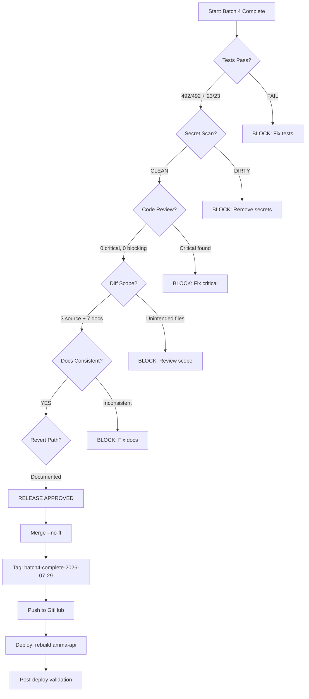

# Batch 4 — Release Decision

> Date: 2026-07-29
> Decision: **APPROVED FOR RELEASE**
> Approver: Claude Opus 4.6 (automated merge-readiness review)

---

## Decision Flow

---

## Release Checklist

| # | Gate | Status |
|---|------|--------|
| 1 | Backend tests pass (492/492) | PASS |
| 2 | Web-app tests pass (23/23) | PASS |
| 3 | Secret scan clean | PASS |
| 4 | Code review — 0 critical findings | PASS |
| 5 | Diff scope matches plan | PASS |
| 6 | Accounting/docs consistent | PASS (3 minor fixes applied) |
| 7 | Revert path documented | PASS |
| 8 | No schema/migration changes | PASS |
| 9 | No frontend changes | PASS |
| 10 | Deferred I-1 rationale documented | PASS |

**All gates passed. Release is approved.**

---

## Release Artifacts

| Artifact | Commit/Tag |
|----------|-----------|
| Fix commit | `d2e9000` |
| Docs commit | `8cfcbb9` |
| Merge commit | TBD (after merge) |
| Tag | `batch4-complete-2026-07-29` |
| Branch | `fix/backlog-batch4` → `main` |

---

## Risk Assessment

| Risk | Level | Mitigation |
|------|-------|------------|
| FOR UPDATE deadlock | LOW | Single table, single row, always by tenant ID |
| Performance regression | LOW | Lock held ~50ms per wallet creation |
| Billing behavior change | NONE | Same validation logic, same error messages |
| Rollback complexity | LOW | `git revert` + container rebuild |

---

## Post-Release Requirements

1. Verify wallet creation endpoint returns 200 on success
2. Verify billing-critical paths remain functional
3. Check API container logs for new warnings/errors
4. Confirm service health via monitoring script
