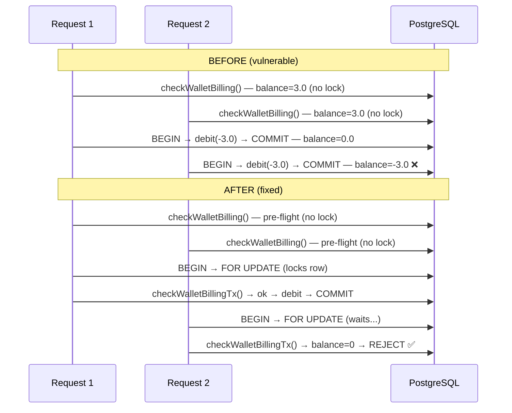
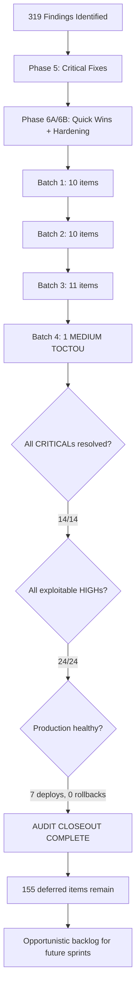

# Security Audit — Final Closeout Report

> Date: 2026-07-29
> Scope: AmmaWallet full security audit (Phases P0-P4) + Backlog Batches 1-4
> Final production commit: `01d17bd` | Tag: `batch4-complete-2026-07-29`

---

## Executive Summary

The AmmaWallet security audit identified **319 findings** across Phases P0-P4. Through 6 audit phases and 4 backlog batches, **164 findings** (51.4%) have been resolved or confirmed as no-action. All critical and exploitable vulnerabilities have been fixed. The remaining **155 deferred items** are non-exploitable code quality and feature improvements.

---

## Cumulative Resolution

| Category | Count | % |
|----------|------:|--:|
| **Resolved** (code fix applied, verified) | 97 | 30.4% |
| **INFO / No Action** (confirmations, correct behavior) | 67 | 21.0% |
| **Deferred** (LOW/MEDIUM backlog, fix opportunistically) | 155 | 48.6% |
| **Total** | **319** | **100%** |

---

## Resolution by Severity

| Severity | Total | Resolved | Deferred | Notes |
|----------|------:|--------:|--------:|-------|
| CRITICAL | 14 | 14 | 0 | All resolved |
| HIGH | 43 | 24 | 19 | All exploitable HIGHs resolved |
| MEDIUM | 94 | 30 | 64 | Includes P1-2-F2 (Batch 4) |
| LOW | 101 | 28 | 73 | Quick wins + batches |
| INFO | 67 | 67 | 0 | No action required |

---

## Batch Delivery History

| Batch | Date | Items Fixed | Key Fixes | Tag |
|-------|------|-------------|-----------|-----|
| Batch 1 | 2026-07-28 | 9 LOW + 1 INFO | Stale tokens, PII logging, billing validation, ILIKE escape | `batch1-complete-2026-07-28` |
| Batch 2 | 2026-07-28 | 9 LOW + 1 MEDIUM | userAgent audit, unsuspend guard, icon size, contacts/push rate limits | `batch2-complete-2026-07-28` |
| Batch 3 | 2026-07-28 | 11 items | Push takeover, curated seed auth, PATCH injection, concurrency guard, password complexity | `batch3-complete-2026-07-28` |
| Batch 4 | 2026-07-29 | 1 MEDIUM | P1-2-F2 Billing TOCTOU race condition — FOR UPDATE lock | `batch4-complete-2026-07-29` |
| **Total** | | **31 items** | | |

---

## Audit Phase History

| Phase | Date | Focus | Key Outcomes |
|-------|------|-------|--------------|
| P0-P4 | 2026-07-25–26 | Full codebase audit | 319 findings identified |
| Phase 5 | 2026-07-26 | Critical fixes | 14 CRITICALs + exploitable HIGHs resolved |
| Phase 6A | 2026-07-27 | Quick wins | 10 LOW + 3 MEDIUM quick fixes |
| Phase 6B | 2026-07-27 | Client hardening | Production startup crash fix, config guards |
| Batches 1-4 | 2026-07-28–29 | Backlog remediation | 31 deferred items fixed |

---

## Test Coverage

| Suite | Count | Duration |
|-------|------:|--------:|
| Backend | 492 | 11.8s |
| Web-app | 23 | 1.0s |
| **Total** | **515** | **12.8s** |

Test growth: 0 → 515 tests across the audit lifecycle.

---

## Production Deployments

| # | Date | Commit | Scope | Rollback |
|---|------|--------|-------|----------|
| 1 | 2026-07-27 | Phase 5 | Critical security fixes | None needed |
| 2 | 2026-07-27 | Phase 6A | Quick wins | None needed |
| 3 | 2026-07-27 | Phase 6B | Client hardening | None needed |
| 4 | 2026-07-28 | Batch 1 | 10 items | None needed |
| 5 | 2026-07-28 | Batch 2 | 10 items | None needed |
| 6 | 2026-07-28 | Batch 3 | 11 items | None needed |
| 7 | 2026-07-29 | Batch 4 (`01d17bd`) | 1 MEDIUM (TOCTOU) | None needed |

**7 zero-downtime deployments. Zero rollbacks.**

---

## Billing TOCTOU Fix (Batch 4) — Before/After

---

## Audit Closeout Flow

---

## Remaining Deferred Backlog (155 items)

### By Category

| Category | Count | Examples |
|----------|------:|---------|
| P3 stub modules (Earn/Fiat/MoneyGram) | ~35 | Missing auth, rate limits, validation |
| Code quality / naming | ~25 | Rename vars, typing improvements |
| Test coverage gaps | ~20 | No active vulnerabilities |
| Feature enhancements | ~20 | Memo support, slippage control |
| Database schema | ~15 | FK indexes, type alignment |
| Architectural improvements | ~10 | AbortController, concurrent refresh |
| Frontend quality | ~15 | Auto-hide secrets, floating-point fees |
| Other | ~15 | Miscellaneous LOW/MEDIUM items |

### Priority Recommendations

1. **P3 stub modules** — Fix when these modules go live (currently disabled/stub)
2. **Database indexes** — Address during next schema migration
3. **Frontend quality** — Bundle with next frontend feature work
4. **Test coverage** — Expand incrementally with feature development

**None of the 155 deferred items represent exploitable security vulnerabilities.**

---

## Release History

| Tag | Commit | Date |
|-----|--------|------|
| `batch1-complete-2026-07-28` | Batch 1 merge | 2026-07-28 |
| `batch2-complete-2026-07-28` | Batch 2 merge | 2026-07-28 |
| `batch3-complete-2026-07-28` | `bf64194` | 2026-07-28 |
| `batch4-complete-2026-07-29` | `01d17bd` | 2026-07-29 |

---

## Recommended Next Actions

1. **No immediate action required** — all exploitable vulnerabilities are resolved
2. **Future Batch 5** (optional) — pick from remaining deferred MEDIUM items if desired
3. **P3 module activation** — address P3 findings before enabling Earn/Fiat/MoneyGram
4. **Schema migration sprint** — address FK indexes and type alignment when convenient
5. **Ongoing** — continue expanding test coverage with feature development
