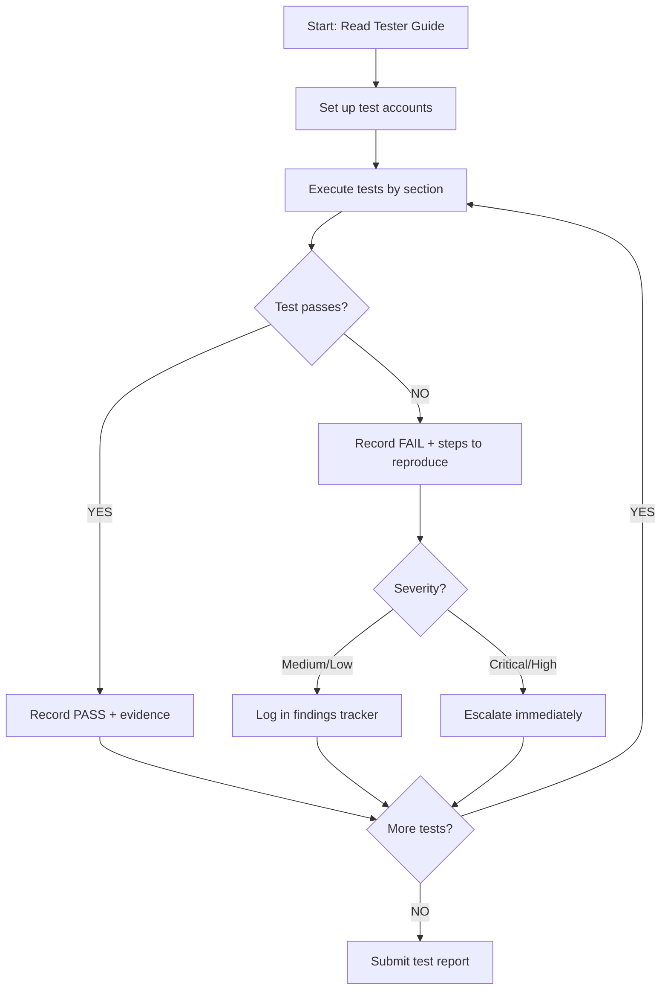
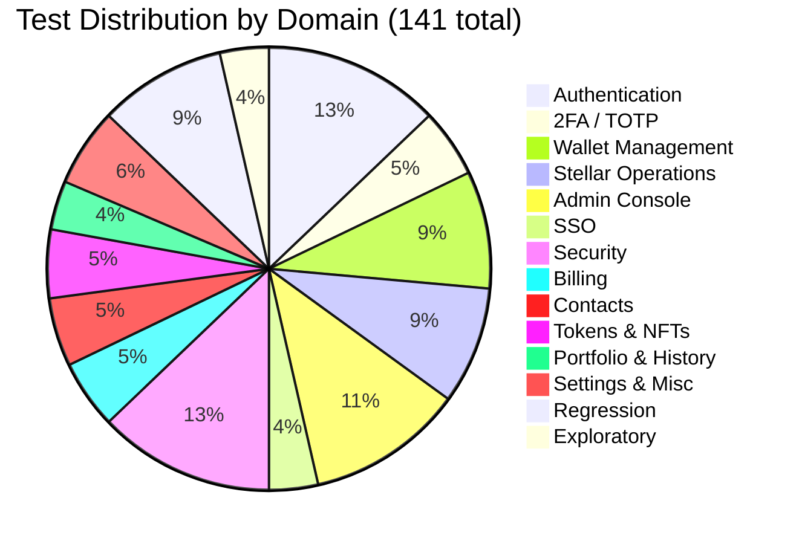

# Manual Audit — Master Checklist

> Date: 2026-07-29
> System: AmmaWallet (ammawallet.com)
> Total tests: 141
> Estimated time: 3–4 hours per tester

---

## Audit Workflow

---

## How to Use This Checklist

For each test:
1. Follow the **Steps** exactly
2. Compare the result to **Expected Result**
3. Mark **Status**: PASS / FAIL / BLOCKED / SKIP
4. Fill **Actual Result** with what you observed
5. Capture **Evidence** as specified
6. Add **Notes** for anything unexpected

---

## 1. Authentication (AUTH)

### AUTH-001: Register with valid credentials
- **Risk:** HIGH | **Destructive:** Yes (creates account) | **Time:** 3 min
- **Prerequisites:** None (fresh browser)
- **Steps:**
  1. Navigate to `/register`
  2. Enter a unique email address
  3. Enter a password meeting requirements (8+ chars, uppercase, number)
  4. Confirm password
  5. Complete Turnstile captcha
  6. Click "Create Account"
- **Expected Result:** Account created, redirected to onboarding page, verification email sent
- **Evidence:** Screenshot of onboarding page, email received
- **Status:** _____ | **Actual Result:** _____
- **Notes:** _____

### AUTH-002: Register with duplicate email
- **Risk:** MEDIUM | **Destructive:** No | **Time:** 2 min
- **Prerequisites:** AUTH-001 completed
- **Steps:**
  1. Navigate to `/register`
  2. Enter the same email used in AUTH-001
  3. Enter a valid password
  4. Complete captcha and submit
- **Expected Result:** Error message displayed. Must NOT reveal whether email exists (check for generic message like "Registration failed")
- **Evidence:** Screenshot of error message
- **Status:** _____ | **Actual Result:** _____
- **Notes:** _____

### AUTH-003: Register with weak password
- **Risk:** MEDIUM | **Destructive:** No | **Time:** 2 min
- **Prerequisites:** None
- **Steps:**
  1. Navigate to `/register`
  2. Enter a valid email
  3. Try passwords: "abc", "12345678", "abcdefgh" (no uppercase/number), "Abcdefg" (7 chars)
  4. Observe validation feedback
- **Expected Result:** Each password rejected with clear feedback. Form should not submit.
- **Evidence:** Screenshot of validation errors for each attempt
- **Status:** _____ | **Actual Result:** _____
- **Notes:** _____

### AUTH-004: Login with valid credentials
- **Risk:** HIGH | **Destructive:** No | **Time:** 2 min
- **Prerequisites:** Registered account
- **Steps:**
  1. Navigate to `/login`
  2. Enter registered email and password
  3. Complete captcha
  4. Click "Sign In"
- **Expected Result:** Redirected to dashboard (if wallet exists) or onboarding (if no wallet)
- **Evidence:** Screenshot of dashboard/onboarding
- **Status:** _____ | **Actual Result:** _____
- **Notes:** _____

### AUTH-005: Login with wrong password
- **Risk:** MEDIUM | **Destructive:** No | **Time:** 2 min
- **Prerequisites:** Registered account
- **Steps:**
  1. Navigate to `/login`
  2. Enter correct email, wrong password
  3. Complete captcha and submit
- **Expected Result:** Generic error (e.g., "Invalid credentials"). Must NOT say "wrong password" specifically.
- **Evidence:** Screenshot of error message
- **Status:** _____ | **Actual Result:** _____
- **Notes:** _____

### AUTH-006: Login with non-existent email
- **Risk:** MEDIUM | **Destructive:** No | **Time:** 2 min
- **Prerequisites:** None
- **Steps:**
  1. Navigate to `/login`
  2. Enter an email that has never been registered
  3. Enter any password, complete captcha, submit
- **Expected Result:** Same generic error as AUTH-005. Must NOT reveal that email doesn't exist.
- **Evidence:** Screenshot — compare message to AUTH-005
- **Status:** _____ | **Actual Result:** _____
- **Notes:** _____

### AUTH-007: Login rate limiting
- **Risk:** HIGH | **Destructive:** No | **Time:** 5 min
- **Prerequisites:** Registered account
- **Steps:**
  1. Attempt login with wrong password 11 times rapidly
  2. On the 11th attempt, observe the response
- **Expected Result:** Rate limit error (429) after 10 attempts within 5 minutes
- **Evidence:** Screenshot or curl output showing 429 response
- **Status:** _____ | **Actual Result:** _____
- **Notes:** _____

### AUTH-008: Registration rate limiting
- **Risk:** HIGH | **Destructive:** Yes (creates accounts) | **Time:** 5 min
- **Prerequisites:** None
- **Steps:**
  1. Register 6 accounts rapidly with different emails
  2. On the 6th attempt, observe the response
- **Expected Result:** Rate limit error (429) after 5 attempts within 15 minutes
- **Evidence:** Screenshot or curl output showing 429
- **Status:** _____ | **Actual Result:** _____
- **Notes:** _____

### AUTH-009: Password reset flow
- **Risk:** HIGH | **Destructive:** No | **Time:** 5 min
- **Prerequisites:** Registered account with verified email
- **Steps:**
  1. Navigate to `/forgot-password`
  2. Enter registered email
  3. Complete captcha and submit
  4. Check email for reset link
  5. Click link, enter new password
  6. Login with new password
- **Expected Result:** Reset email received within 1 minute, new password works, old password no longer works
- **Evidence:** Screenshot of reset email, successful login
- **Status:** _____ | **Actual Result:** _____
- **Notes:** _____

### AUTH-010: Password reset rate limiting
- **Risk:** HIGH | **Destructive:** No | **Time:** 3 min
- **Prerequisites:** Registered account
- **Steps:**
  1. Submit forgot-password 4 times rapidly
- **Expected Result:** Rate limit (429) after 3 attempts within 15 minutes
- **Evidence:** Screenshot showing rate limit
- **Status:** _____ | **Actual Result:** _____
- **Notes:** _____

### AUTH-011: Email verification flow
- **Risk:** MEDIUM | **Destructive:** No | **Time:** 3 min
- **Prerequisites:** Fresh registered account (unverified)
- **Steps:**
  1. Check email for verification link
  2. Click the verification link
  3. Observe the verification page
- **Expected Result:** Page shows "Email verified" success message
- **Evidence:** Screenshot of verification page
- **Status:** _____ | **Actual Result:** _____
- **Notes:** _____

### AUTH-012: Logout and session invalidation
- **Risk:** MEDIUM | **Destructive:** No | **Time:** 2 min
- **Prerequisites:** Logged in
- **Steps:**
  1. Note current page
  2. Click logout
  3. Confirm logout
  4. Try to access `/dashboard` directly
- **Expected Result:** Redirected to login page. Dashboard not accessible.
- **Evidence:** Screenshot of redirect
- **Status:** _____ | **Actual Result:** _____
- **Notes:** _____

### AUTH-013: Profile update
- **Risk:** LOW | **Destructive:** No | **Time:** 2 min
- **Prerequisites:** Logged in
- **Steps:**
  1. Navigate to `/settings`
  2. Change first name and last name
  3. Save
  4. Refresh page
- **Expected Result:** Updated name persists after refresh
- **Evidence:** Screenshot before and after
- **Status:** _____ | **Actual Result:** _____
- **Notes:** _____

### AUTH-014: Change password
- **Risk:** HIGH | **Destructive:** No | **Time:** 3 min
- **Prerequisites:** Logged in
- **Steps:**
  1. Navigate to Settings > Security > Password
  2. Enter current password
  3. Enter new password meeting requirements
  4. Save
  5. Logout and login with new password
- **Expected Result:** Password changed successfully. Old password no longer works.
- **Evidence:** Screenshot of success message
- **Status:** _____ | **Actual Result:** _____
- **Notes:** _____

### AUTH-015: Resend verification email
- **Risk:** LOW | **Destructive:** No | **Time:** 2 min
- **Prerequisites:** Unverified account
- **Steps:**
  1. Login to unverified account
  2. Click "Resend verification email"
  3. Check inbox
- **Expected Result:** New verification email received. Previous link should still work.
- **Evidence:** Screenshot of email
- **Status:** _____ | **Actual Result:** _____
- **Notes:** _____

### AUTH-016: Token refresh
- **Risk:** HIGH | **Destructive:** No | **Time:** 3 min
- **Prerequisites:** Logged in, curl
- **Steps:**
  1. Login and capture JWT token from response
  2. Note the token expiry
  3. Call `POST /api/v1/auth/refresh` with the refresh token
  4. Verify new access token is returned
- **Expected Result:** New access token issued. Old access token should eventually expire.
- **Evidence:** curl output showing new token
- **Status:** _____ | **Actual Result:** _____
- **Notes:** _____

### AUTH-017: Refresh token reuse prevention
- **Risk:** HIGH | **Destructive:** No | **Time:** 3 min
- **Prerequisites:** Logged in, curl
- **Steps:**
  1. Get a refresh token
  2. Use it to get a new access token
  3. Try to use the same refresh token again
- **Expected Result:** Second use rejected — refresh tokens are single-use
- **Evidence:** curl output showing rejection
- **Status:** _____ | **Actual Result:** _____
- **Notes:** _____

### AUTH-018: Delete account
- **Risk:** HIGH | **Destructive:** Yes | **Time:** 3 min
- **Prerequisites:** Test account with no real funds
- **Steps:**
  1. Navigate to Settings > Account
  2. Click "Delete Account"
  3. Enter password to confirm
  4. Try to login after deletion
- **Expected Result:** Account deleted. Login fails. Data purged.
- **Evidence:** Screenshot of deletion confirmation, failed login
- **Status:** _____ | **Actual Result:** _____
- **Notes:** _____

---

## 2. Two-Factor Authentication (TOTP)

### TOTP-001: Enable TOTP 2FA
- **Risk:** HIGH | **Destructive:** No | **Time:** 5 min
- **Prerequisites:** Logged in, authenticator app installed (Google Authenticator, Authy, etc.)
- **Steps:**
  1. Navigate to Settings > Security > 2FA
  2. Click Enable 2FA
  3. Select TOTP method
  4. Scan QR code with authenticator app
  5. Enter 6-digit code from app
  6. Save backup codes shown
- **Expected Result:** 2FA enabled. Backup codes displayed (save these). Settings shows "2FA: Enabled"
- **Evidence:** Screenshot of enabled status, backup codes (redacted)
- **Status:** _____ | **Actual Result:** _____
- **Notes:** _____

### TOTP-002: Login with TOTP enabled
- **Risk:** HIGH | **Destructive:** No | **Time:** 3 min
- **Prerequisites:** TOTP-001 completed
- **Steps:**
  1. Logout
  2. Login with email/password
  3. When prompted for 2FA code, enter current code from authenticator
- **Expected Result:** Login succeeds after valid TOTP code
- **Evidence:** Screenshot of 2FA prompt and successful login
- **Status:** _____ | **Actual Result:** _____
- **Notes:** _____

### TOTP-003: Login with expired/wrong TOTP code
- **Risk:** HIGH | **Destructive:** No | **Time:** 2 min
- **Prerequisites:** TOTP enabled
- **Steps:**
  1. Start login flow
  2. Wait for TOTP code to expire (30s window)
  3. Enter the expired code
  4. Also try "000000" and "123456"
- **Expected Result:** Login rejected with error message. No info leakage about validity window.
- **Evidence:** Screenshot of rejection
- **Status:** _____ | **Actual Result:** _____
- **Notes:** _____

### TOTP-004: Login with backup code
- **Risk:** HIGH | **Destructive:** Yes (consumes backup code) | **Time:** 2 min
- **Prerequisites:** TOTP enabled, backup codes saved
- **Steps:**
  1. Start login flow
  2. Instead of TOTP code, enter one backup code
- **Expected Result:** Login succeeds. That backup code should not work again.
- **Evidence:** Screenshot of successful login
- **Status:** _____ | **Actual Result:** _____
- **Notes:** _____

### TOTP-005: Disable 2FA
- **Risk:** HIGH | **Destructive:** No | **Time:** 2 min
- **Prerequisites:** TOTP enabled
- **Steps:**
  1. Navigate to Settings > Security > 2FA
  2. Click Disable 2FA
  3. Enter password and current TOTP code
- **Expected Result:** 2FA disabled. Next login should not require 2FA.
- **Evidence:** Screenshot of disabled status
- **Status:** _____ | **Actual Result:** _____
- **Notes:** _____

### TOTP-006: TOTP rate limiting
- **Risk:** HIGH | **Destructive:** No | **Time:** 3 min
- **Prerequisites:** TOTP enabled, curl
- **Steps:**
  1. Start login flow (get temporary token)
  2. Submit wrong TOTP codes 10 times rapidly
- **Expected Result:** Rate limit (429) after multiple failed attempts
- **Evidence:** curl output showing 429
- **Status:** _____ | **Actual Result:** _____
- **Notes:** _____

### TOTP-007: 2FA status endpoint
- **Risk:** LOW | **Destructive:** No | **Time:** 2 min
- **Prerequisites:** Logged in
- **Steps:**
  1. `GET /api/v1/auth/2fa/status` with valid Bearer token
- **Expected Result:** Returns `{ enabled: true/false }` — no secret leakage
- **Evidence:** curl output
- **Status:** _____ | **Actual Result:** _____
- **Notes:** _____

---

## 3. Wallet Management (WALLET)

### WALLET-001: Create new wallet (onboarding)
- **Risk:** HIGH | **Destructive:** Yes (creates wallet) | **Time:** 5 min
- **Prerequisites:** Logged in, no wallet
- **Steps:**
  1. On onboarding page, select "Create New Wallet"
  2. Set a PIN (4-6 digits)
  3. View and write down the 13-word backup mnemonic
  4. Confirm backup by entering requested words
  5. Name the wallet
- **Expected Result:** Wallet created, redirected to dashboard with public key displayed, 0.0 XLM balance
- **Evidence:** Screenshot of dashboard with new wallet
- **Status:** _____ | **Actual Result:** _____
- **Notes:** _____

### WALLET-002: Import wallet from secret key
- **Risk:** HIGH | **Destructive:** Yes (creates wallet) | **Time:** 3 min
- **Prerequisites:** Logged in, have a Stellar secret key
- **Steps:**
  1. On onboarding page, select "Import Secret Key"
  2. Paste a valid Stellar secret key (starts with S)
  3. Set a PIN
  4. Name the wallet
- **Expected Result:** Wallet imported, public key matches the secret key's public key
- **Evidence:** Screenshot showing imported wallet with correct public key
- **Status:** _____ | **Actual Result:** _____
- **Notes:** _____

### WALLET-003: View wallet balances
- **Risk:** LOW | **Destructive:** No | **Time:** 2 min
- **Prerequisites:** Wallet with funds
- **Steps:**
  1. Navigate to dashboard
  2. Observe XLM balance and asset list
- **Expected Result:** Balances match Stellar network state (verify on stellar.expert)
- **Evidence:** Screenshot of dashboard + stellar.expert comparison
- **Status:** _____ | **Actual Result:** _____
- **Notes:** _____

### WALLET-004: Create second wallet
- **Risk:** MEDIUM | **Destructive:** Yes | **Time:** 3 min
- **Prerequisites:** One wallet already exists
- **Steps:**
  1. Navigate to Settings > Wallet Management
  2. Create a new wallet
  3. Observe which wallet is active
- **Expected Result:** New wallet created and set as active. Previous wallet deactivated but still listed.
- **Evidence:** Screenshot showing both wallets
- **Status:** _____ | **Actual Result:** _____
- **Notes:** _____

### WALLET-005: Switch active wallet
- **Risk:** MEDIUM | **Destructive:** No | **Time:** 2 min
- **Prerequisites:** Multiple wallets
- **Steps:**
  1. Navigate to Settings > Wallet Management
  2. Activate a different wallet
  3. Return to dashboard
- **Expected Result:** Dashboard shows the newly activated wallet's balance and address
- **Evidence:** Screenshot before and after switch
- **Status:** _____ | **Actual Result:** _____
- **Notes:** _____

### WALLET-006: Delete wallet
- **Risk:** HIGH | **Destructive:** Yes | **Time:** 2 min
- **Prerequisites:** Multiple wallets (do NOT delete only wallet)
- **Steps:**
  1. Navigate to Settings > Wallet Management
  2. Delete a non-active wallet
  3. Confirm deletion
- **Expected Result:** Wallet removed from list. If active wallet deleted, another becomes active.
- **Evidence:** Screenshot showing wallet removed
- **Status:** _____ | **Actual Result:** _____
- **Notes:** _____

### WALLET-007: Reveal secret key
- **Risk:** HIGH | **Destructive:** No | **Time:** 2 min
- **Prerequisites:** Wallet exists
- **Steps:**
  1. Navigate to Settings > Security > Key Management
  2. Click "Reveal Secret Key"
  3. Enter PIN
- **Expected Result:** Secret key displayed (starts with S, 56 chars). Copy button works.
- **Evidence:** Screenshot (redact key in report)
- **Status:** _____ | **Actual Result:** _____
- **Notes:** _____

### WALLET-008: Rename wallet
- **Risk:** LOW | **Destructive:** No | **Time:** 1 min
- **Prerequisites:** Wallet exists
- **Steps:**
  1. Navigate to Settings > Wallet Management
  2. Edit wallet name to "Test Wallet Renamed"
  3. Save
  4. Refresh page
- **Expected Result:** New name persists after refresh
- **Evidence:** Screenshot
- **Status:** _____ | **Actual Result:** _____
- **Notes:** _____

### WALLET-009: Wallet name length validation
- **Risk:** LOW | **Destructive:** No | **Time:** 2 min
- **Prerequisites:** Wallet exists
- **Steps:**
  1. Try renaming wallet to empty string
  2. Try renaming to 256+ characters
  3. Try renaming to emoji-heavy string
- **Expected Result:** Empty rejected. Very long names truncated or rejected. Emoji handled gracefully.
- **Evidence:** Screenshot of validation errors
- **Status:** _____ | **Actual Result:** _____
- **Notes:** _____

### WALLET-010: Reveal recovery mnemonic
- **Risk:** HIGH | **Destructive:** No | **Time:** 2 min
- **Prerequisites:** Wallet created with mnemonic
- **Steps:**
  1. Navigate to Settings > Security
  2. Click "Show Recovery Phrase"
  3. Enter PIN
  4. Verify 12/13 words displayed
- **Expected Result:** Mnemonic displayed after PIN verification. Auto-hides after timeout.
- **Evidence:** Screenshot (redact words)
- **Status:** _____ | **Actual Result:** _____
- **Notes:** _____

### WALLET-011: Wallet balance refresh
- **Risk:** LOW | **Destructive:** No | **Time:** 2 min
- **Prerequisites:** Wallet with funds
- **Steps:**
  1. On dashboard, click refresh/reload balance
  2. Observe loading state
  3. Verify balance matches Stellar network
- **Expected Result:** Balance updates. Loading indicator shown during fetch.
- **Evidence:** Screenshot
- **Status:** _____ | **Actual Result:** _____
- **Notes:** _____

### WALLET-012: Copy wallet address
- **Risk:** LOW | **Destructive:** No | **Time:** 1 min
- **Prerequisites:** Wallet exists
- **Steps:**
  1. On dashboard, click the copy icon next to wallet address
  2. Paste into text editor
- **Expected Result:** Full 56-char Stellar public key copied. Starts with G.
- **Evidence:** Pasted address
- **Status:** _____ | **Actual Result:** _____
- **Notes:** _____

---

## 4. Stellar Operations (STELLAR)

### STELLAR-001: Send XLM to valid address
- **Risk:** HIGH | **Destructive:** Yes (moves funds) | **Time:** 5 min
- **Prerequisites:** Wallet with XLM balance (testnet), destination address
- **Steps:**
  1. Navigate to `/send`
  2. Enter valid destination public key
  3. Select XLM
  4. Enter amount (e.g., 1.0)
  5. Review transaction details
  6. Enter PIN to sign
  7. Submit
- **Expected Result:** Transaction submitted successfully. Balance decreases. Transaction appears in history.
- **Evidence:** Screenshot of success + history entry + stellar.expert confirmation
- **Status:** _____ | **Actual Result:** _____
- **Notes:** _____

### STELLAR-002: Send to invalid address
- **Risk:** MEDIUM | **Destructive:** No | **Time:** 2 min
- **Prerequisites:** Wallet with balance
- **Steps:**
  1. Navigate to `/send`
  2. Enter invalid addresses: "notanaddress", "GABC", empty string
  3. Observe validation
- **Expected Result:** Each rejected with clear error. Send button disabled.
- **Evidence:** Screenshot of validation errors
- **Status:** _____ | **Actual Result:** _____
- **Notes:** _____

### STELLAR-003: Send more than balance
- **Risk:** MEDIUM | **Destructive:** No | **Time:** 2 min
- **Prerequisites:** Wallet with known balance
- **Steps:**
  1. Navigate to `/send`
  2. Enter valid destination
  3. Enter amount exceeding balance
- **Expected Result:** Error message about insufficient funds. Transaction not submitted.
- **Evidence:** Screenshot of error
- **Status:** _____ | **Actual Result:** _____
- **Notes:** _____

### STELLAR-004: Receive — QR code generation
- **Risk:** LOW | **Destructive:** No | **Time:** 2 min
- **Prerequisites:** Wallet exists
- **Steps:**
  1. Navigate to `/receive`
  2. Observe public address displayed
  3. Select a token and enter optional amount
  4. Download QR code
- **Expected Result:** QR code generates with SEP-7 URI. Address is copyable. QR downloads as PNG.
- **Evidence:** Downloaded QR image
- **Status:** _____ | **Actual Result:** _____
- **Notes:** _____

### STELLAR-005: Swap tokens
- **Risk:** HIGH | **Destructive:** Yes (moves funds) | **Time:** 5 min
- **Prerequisites:** Wallet with XLM and at least one other asset trustline
- **Steps:**
  1. Navigate to `/swap`
  2. Select "From" token (XLM)
  3. Select "To" token (e.g., USDC)
  4. Enter amount
  5. Review quote (exchange rate, estimated receive)
  6. Confirm swap with PIN
- **Expected Result:** Swap executes. Balances update. Transaction in history.
- **Evidence:** Screenshot of quote + success + updated balances
- **Status:** _____ | **Actual Result:** _____
- **Notes:** _____

### STELLAR-006: Add trustline
- **Risk:** MEDIUM | **Destructive:** Yes (creates trustline, 0.5 XLM reserve) | **Time:** 3 min
- **Prerequisites:** Wallet with 2+ XLM
- **Steps:**
  1. Navigate to `/tokens`
  2. Find a token without trustline (e.g., USDC)
  3. Click to view detail
  4. Click "Add Trustline"
  5. Sign with PIN
- **Expected Result:** Trustline added. Token appears in asset list on dashboard.
- **Evidence:** Screenshot of token in asset list
- **Status:** _____ | **Actual Result:** _____
- **Notes:** _____

### STELLAR-007: Remove trustline
- **Risk:** MEDIUM | **Destructive:** Yes | **Time:** 3 min
- **Prerequisites:** Existing trustline with 0 balance for that asset
- **Steps:**
  1. Navigate to token detail for the trusted asset
  2. Click "Remove Trustline"
  3. Sign with PIN
- **Expected Result:** Trustline removed. 0.5 XLM reserve freed. Token removed from asset list.
- **Evidence:** Screenshot
- **Status:** _____ | **Actual Result:** _____
- **Notes:** _____

### STELLAR-008: Transaction history
- **Risk:** LOW | **Destructive:** No | **Time:** 2 min
- **Prerequisites:** At least one transaction
- **Steps:**
  1. Navigate to `/history`
  2. Observe transaction list
  3. Verify most recent transaction matches expected
- **Expected Result:** Transactions listed with correct amounts, types, timestamps. Auto-refreshes.
- **Evidence:** Screenshot of history
- **Status:** _____ | **Actual Result:** _____
- **Notes:** _____

### STELLAR-009: Send with memo
- **Risk:** MEDIUM | **Destructive:** Yes | **Time:** 3 min
- **Prerequisites:** Wallet with XLM, destination that requires memo (e.g., exchange)
- **Steps:**
  1. Navigate to `/send`
  2. Enter destination address
  3. Enter memo text "test-memo-123"
  4. Send transaction
  5. Verify memo on stellar.expert
- **Expected Result:** Transaction includes memo. Memo visible in history and on-chain.
- **Evidence:** stellar.expert transaction detail showing memo
- **Status:** _____ | **Actual Result:** _____
- **Notes:** _____

### STELLAR-010: Send to unfunded account
- **Risk:** MEDIUM | **Destructive:** Yes | **Time:** 3 min
- **Prerequisites:** Wallet with 5+ XLM, fresh Stellar keypair (no account on network)
- **Steps:**
  1. Navigate to `/send`
  2. Enter unfunded destination address
  3. Send 2 XLM (above minimum for account creation)
- **Expected Result:** create_account operation used. Destination account created and funded.
- **Evidence:** Transaction type shows "create_account" on stellar.expert
- **Status:** _____ | **Actual Result:** _____
- **Notes:** _____

### STELLAR-011: Remove trustline with non-zero balance
- **Risk:** MEDIUM | **Destructive:** No | **Time:** 2 min
- **Prerequisites:** Trustline with non-zero asset balance
- **Steps:**
  1. Try to remove the trustline
- **Expected Result:** Rejected — must send full balance first. Clear error message.
- **Evidence:** Screenshot of error
- **Status:** _____ | **Actual Result:** _____
- **Notes:** _____

### STELLAR-012: Transaction history pagination
- **Risk:** LOW | **Destructive:** No | **Time:** 2 min
- **Prerequisites:** Wallet with 10+ transactions
- **Steps:**
  1. Navigate to `/history`
  2. Scroll down or click "Load more"
  3. Verify older transactions load
- **Expected Result:** Older transactions load without duplicates. Chronological order maintained.
- **Evidence:** Screenshot showing pagination
- **Status:** _____ | **Actual Result:** _____
- **Notes:** _____

---

## 5. Admin Console (ADMIN)

### ADMIN-001: Admin login
- **Risk:** HIGH | **Destructive:** No | **Time:** 2 min
- **Prerequisites:** Admin account credentials
- **Steps:**
  1. Navigate to `/admin/login`
  2. Enter admin email and password
  3. Submit
- **Expected Result:** Redirected to admin console. Tenant list displayed.
- **Evidence:** Screenshot of admin console
- **Status:** _____ | **Actual Result:** _____
- **Notes:** _____

### ADMIN-002: Admin login with user credentials
- **Risk:** HIGH | **Destructive:** No | **Time:** 2 min
- **Prerequisites:** Regular user account
- **Steps:**
  1. Navigate to `/admin/login`
  2. Enter regular user email and password
- **Expected Result:** Login rejected. Must NOT grant admin access with user credentials.
- **Evidence:** Screenshot of rejection
- **Status:** _____ | **Actual Result:** _____
- **Notes:** _____

### ADMIN-003: View tenant list
- **Risk:** LOW | **Destructive:** No | **Time:** 2 min
- **Prerequisites:** Admin logged in
- **Steps:**
  1. On admin console, observe tenant list
  2. Verify tenant names, balances, statuses are displayed
- **Expected Result:** All tenants listed with correct data
- **Evidence:** Screenshot
- **Status:** _____ | **Actual Result:** _____
- **Notes:** _____

### ADMIN-004: View tenant billing detail
- **Risk:** LOW | **Destructive:** No | **Time:** 2 min
- **Prerequisites:** Admin logged in
- **Steps:**
  1. Click on a tenant row
  2. Observe billing detail page
  3. Check balance, events, status
- **Expected Result:** Billing detail loads with events, balance, suspension status
- **Evidence:** Screenshot
- **Status:** _____ | **Actual Result:** _____
- **Notes:** _____

### ADMIN-005: Credit tenant balance
- **Risk:** HIGH | **Destructive:** Yes (adds credit) | **Time:** 3 min
- **Prerequisites:** Admin logged in with super_admin role
- **Steps:**
  1. Navigate to tenant detail
  2. Enter credit amount (e.g., 10.0 XLM)
  3. Select credit type "manual_topup"
  4. Add notes
  5. Submit
- **Expected Result:** Balance increases by credited amount. Event appears in billing events.
- **Evidence:** Screenshot before and after credit
- **Status:** _____ | **Actual Result:** _____
- **Notes:** _____

### ADMIN-006: Suspend tenant (soft)
- **Risk:** HIGH | **Destructive:** Yes | **Time:** 3 min
- **Prerequisites:** Admin with super_admin role, active tenant
- **Steps:**
  1. Navigate to tenant detail
  2. Click Suspend
  3. Select "Soft" suspension
  4. Add reason
  5. Confirm
- **Expected Result:** Tenant marked as suspended. Badge changes. New wallet creation blocked for tenant users.
- **Evidence:** Screenshot of suspended status
- **Status:** _____ | **Actual Result:** _____
- **Notes:** _____

### ADMIN-007: Unsuspend tenant
- **Risk:** MEDIUM | **Destructive:** No | **Time:** 2 min
- **Prerequisites:** Suspended tenant from ADMIN-006
- **Steps:**
  1. Navigate to suspended tenant detail
  2. Click Unsuspend
  3. Confirm
- **Expected Result:** Tenant reactivated. Badge changes to active.
- **Evidence:** Screenshot
- **Status:** _____ | **Actual Result:** _____
- **Notes:** _____

### ADMIN-008: Billing events pagination
- **Risk:** LOW | **Destructive:** No | **Time:** 2 min
- **Prerequisites:** Tenant with multiple billing events
- **Steps:**
  1. Navigate to tenant detail
  2. Scroll to billing events
  3. Click "Load older" to paginate
- **Expected Result:** Older events load. No duplicates. Chronological order maintained.
- **Evidence:** Screenshot
- **Status:** _____ | **Actual Result:** _____
- **Notes:** _____

### ADMIN-009: Create admin account
- **Risk:** HIGH | **Destructive:** Yes | **Time:** 3 min
- **Prerequisites:** super_admin logged in
- **Steps:**
  1. Navigate to `/admin/admins`
  2. Click "Invite Admin"
  3. Enter email, name, role (platform_admin), temporary password
  4. Submit
- **Expected Result:** Admin account created. Appears in admin list.
- **Evidence:** Screenshot of admin list with new entry
- **Status:** _____ | **Actual Result:** _____
- **Notes:** _____

### ADMIN-010: Deactivate admin
- **Risk:** HIGH | **Destructive:** Yes | **Time:** 2 min
- **Prerequisites:** Admin created in ADMIN-009
- **Steps:**
  1. Navigate to `/admin/admins`
  2. Click Deactivate on the new admin
  3. Confirm
- **Expected Result:** Admin marked inactive. Cannot login anymore.
- **Evidence:** Screenshot + login attempt with deactivated admin
- **Status:** _____ | **Actual Result:** _____
- **Notes:** _____

### ADMIN-011: Access admin API with user token
- **Risk:** HIGH | **Destructive:** No | **Time:** 3 min
- **Prerequisites:** Regular user JWT token
- **Steps:**
  1. Using curl/Postman, call `GET /api/v1/internal/tenants` with a user Bearer token
  2. Also try `GET /api/v1/internal/admins`
- **Expected Result:** 401 Unauthorized for both. Admin endpoints must reject user tokens.
- **Evidence:** curl output showing 401
- **Status:** _____ | **Actual Result:** _____
- **Notes:** _____

### ADMIN-012: Admin session expiry
- **Risk:** MEDIUM | **Destructive:** No | **Time:** 5 min (or simulate)
- **Prerequisites:** Admin logged in
- **Steps:**
  1. Note admin token expiry (1 hour)
  2. Close browser tab and reopen `/admin`
- **Expected Result:** Admin must re-login (sessionStorage cleared on tab close)
- **Evidence:** Screenshot of login redirect
- **Status:** _____ | **Actual Result:** _____
- **Notes:** _____

### ADMIN-013: Hard suspend tenant
- **Risk:** HIGH | **Destructive:** Yes | **Time:** 3 min
- **Prerequisites:** Admin with super_admin role, active tenant
- **Steps:**
  1. Navigate to tenant detail
  2. Click Suspend
  3. Select "Hard" suspension
  4. Add reason
  5. Confirm
- **Expected Result:** Tenant hard-suspended. All wallet operations blocked (not just creation).
- **Evidence:** Screenshot of hard-suspended status
- **Status:** _____ | **Actual Result:** _____
- **Notes:** _____

### ADMIN-014: User search
- **Risk:** LOW | **Destructive:** No | **Time:** 2 min
- **Prerequisites:** Admin logged in
- **Steps:**
  1. Navigate to user management
  2. Search by email
  3. Search by wallet address
- **Expected Result:** Users found by both email and wallet address. Results paginated.
- **Evidence:** Screenshot
- **Status:** _____ | **Actual Result:** _____
- **Notes:** _____

### ADMIN-015: View audit logs
- **Risk:** LOW | **Destructive:** No | **Time:** 2 min
- **Prerequisites:** Admin logged in, recent admin actions
- **Steps:**
  1. Navigate to audit logs section
  2. Verify recent actions appear (login, suspend, credit)
  3. Check log entries include: actor, action, target, timestamp
- **Expected Result:** Audit logs present with complete details
- **Evidence:** Screenshot of logs
- **Status:** _____ | **Actual Result:** _____
- **Notes:** _____

### ADMIN-016: Platform admin role restrictions
- **Risk:** HIGH | **Destructive:** No | **Time:** 3 min
- **Prerequisites:** platform_admin account
- **Steps:**
  1. Login as platform_admin
  2. Try to create another admin (should be restricted)
  3. Try to access super_admin-only features
- **Expected Result:** platform_admin cannot create admins or access super_admin features
- **Evidence:** Screenshot of permission errors
- **Status:** _____ | **Actual Result:** _____
- **Notes:** _____

---

## 6. SSO Integration (SSO)

### SSO-001: SSO redirect from LMS
- **Risk:** HIGH | **Destructive:** No | **Time:** 3 min
- **Prerequisites:** LMS account, AmmaWallet account with same email
- **Steps:**
  1. Navigate to LMS login page
  2. Click "Login with AmmaWallet" (or equivalent SSO button)
  3. Observe redirect to AmmaWallet `/sso/login`
  4. Login if not already authenticated
  5. Observe redirect back to LMS
- **Expected Result:** Redirected to LMS with SSO assertion. LMS shows wallet address.
- **Evidence:** Screenshot of LMS showing linked wallet
- **Status:** _____ | **Actual Result:** _____
- **Notes:** _____

### SSO-002: SSO with invalid callback URL
- **Risk:** HIGH | **Destructive:** No | **Time:** 3 min
- **Prerequisites:** Valid auth token
- **Steps:**
  1. Using curl, call `POST /api/v1/sso/token` with `callbackUrl` pointing to `https://evil.com`
- **Expected Result:** Rejected — callback URL must be in whitelist. Error returned.
- **Evidence:** curl output
- **Status:** _____ | **Actual Result:** _____
- **Notes:** _____

### SSO-003: SSO without AmmaWallet account
- **Risk:** MEDIUM | **Destructive:** No | **Time:** 3 min
- **Prerequisites:** LMS account with no matching AmmaWallet account
- **Steps:**
  1. Click SSO login from LMS
  2. Observe behavior at AmmaWallet
- **Expected Result:** Prompted to register or shown clear error. Not silently created.
- **Evidence:** Screenshot
- **Status:** _____ | **Actual Result:** _____
- **Notes:** _____

### SSO-004: SSO token scope verification
- **Risk:** HIGH | **Destructive:** No | **Time:** 3 min
- **Prerequisites:** SSO token from LMS flow, curl
- **Steps:**
  1. Capture SSO token response
  2. Verify token contains: userId, email, mainnetWalletAddress
  3. Verify token does NOT contain: password, secret key, mnemonic
- **Expected Result:** Token has minimal claims. No sensitive data leaked.
- **Evidence:** Decoded token payload
- **Status:** _____ | **Actual Result:** _____
- **Notes:** _____

### SSO-005: SSO assertion replay
- **Risk:** HIGH | **Destructive:** No | **Time:** 3 min
- **Prerequisites:** Completed SSO-001, captured assertion token
- **Steps:**
  1. Capture the assertion token from SSO-001
  2. Try to use the same assertion token again at the LMS callback
- **Expected Result:** Assertion rejected (single-use or time-limited)
- **Evidence:** curl output
- **Status:** _____ | **Actual Result:** _____
- **Notes:** _____

---

## 7. Security Tests (SEC)

### SEC-001: XSS in wallet name
- **Risk:** HIGH | **Destructive:** No | **Time:** 2 min
- **Prerequisites:** Logged in with wallet
- **Steps:**
  1. Rename wallet to ``
  2. Refresh page
  3. Observe wallet name display
- **Expected Result:** Script NOT executed. Name displayed as escaped text or rejected.
- **Evidence:** Screenshot showing escaped text
- **Status:** _____ | **Actual Result:** _____
- **Notes:** _____

### SEC-002: XSS in contact name
- **Risk:** HIGH | **Destructive:** No | **Time:** 2 min
- **Prerequisites:** Logged in
- **Steps:**
  1. Create a contact with name ``
  2. View contacts list
- **Expected Result:** HTML not rendered. Text displayed as-is or rejected.
- **Evidence:** Screenshot
- **Status:** _____ | **Actual Result:** _____
- **Notes:** _____

### SEC-003: SQL injection in search
- **Risk:** HIGH | **Destructive:** No | **Time:** 2 min
- **Prerequisites:** Logged in
- **Steps:**
  1. Navigate to `/tokens`
  2. Search for: `'; DROP TABLE users; --`
  3. Also try: `" OR 1=1 --`
- **Expected Result:** No error. Returns empty results or normal search. No database impact.
- **Evidence:** Screenshot of search results
- **Status:** _____ | **Actual Result:** _____
- **Notes:** _____

### SEC-004: API access without auth token
- **Risk:** HIGH | **Destructive:** No | **Time:** 3 min
- **Prerequisites:** curl/Postman
- **Steps:**
  1. Call these endpoints without Authorization header:
     - `GET /api/v1/wallets`
     - `GET /api/v1/contacts`
     - `POST /api/v1/portfolio/snapshot`
     - `GET /api/v1/auth/me`
- **Expected Result:** All return 401 Unauthorized
- **Evidence:** curl output for each
- **Status:** _____ | **Actual Result:** _____
- **Notes:** _____

### SEC-005: Access other user's wallets
- **Risk:** HIGH | **Destructive:** No | **Time:** 3 min
- **Prerequisites:** Two user accounts (User A and User B)
- **Steps:**
  1. Login as User A, note wallet IDs
  2. Login as User B
  3. Try `PATCH /api/v1/wallets/<User A's wallet ID>` with User B's token
  4. Try `DELETE /api/v1/wallets/<User A's wallet ID>` with User B's token
- **Expected Result:** 404 or 403. Cannot modify another user's wallet.
- **Evidence:** curl output
- **Status:** _____ | **Actual Result:** _____
- **Notes:** _____

### SEC-006: Access other user's contacts
- **Risk:** MEDIUM | **Destructive:** No | **Time:** 2 min
- **Prerequisites:** Two user accounts
- **Steps:**
  1. Login as User A, create a contact, note ID
  2. Login as User B
  3. Try `PATCH /api/v1/contacts/<User A's contact ID>` with User B's token
  4. Try `DELETE /api/v1/contacts/<User A's contact ID>` with User B's token
- **Expected Result:** 404 or 403. Cannot access other user's contacts.
- **Evidence:** curl output
- **Status:** _____ | **Actual Result:** _____
- **Notes:** _____

### SEC-007: Global rate limiting
- **Risk:** MEDIUM | **Destructive:** No | **Time:** 3 min
- **Prerequisites:** curl
- **Steps:**
  1. Send 65 requests to `GET /api/v1/tokens/curated` within 1 minute
  2. Observe response on the 61st+ request
- **Expected Result:** 429 Too Many Requests after 60 requests per minute
- **Evidence:** curl output showing 429
- **Status:** _____ | **Actual Result:** _____
- **Notes:** _____

### SEC-008: Sensitive data in API error responses
- **Risk:** HIGH | **Destructive:** No | **Time:** 3 min
- **Prerequisites:** curl
- **Steps:**
  1. Send malformed JSON to `POST /api/v1/auth/login`
  2. Send invalid schema to `POST /api/v1/wallets`
  3. Check error responses for stack traces, file paths, or internal details
- **Expected Result:** Error messages are user-friendly. No stack traces, no file paths, no internal function names.
- **Evidence:** curl output of error responses
- **Status:** _____ | **Actual Result:** _____
- **Notes:** _____

### SEC-009: CORS headers
- **Risk:** MEDIUM | **Destructive:** No | **Time:** 2 min
- **Prerequisites:** curl
- **Steps:**
  1. Send `OPTIONS /api/v1/auth/login` with `Origin: https://evil.com`
  2. Check `Access-Control-Allow-Origin` header
- **Expected Result:** Either no CORS header or restricted to allowed origins. NOT `*`.
- **Evidence:** curl output showing headers
- **Status:** _____ | **Actual Result:** _____
- **Notes:** _____

### SEC-010: JWT token validation
- **Risk:** HIGH | **Destructive:** No | **Time:** 3 min
- **Prerequisites:** curl, any valid JWT
- **Steps:**
  1. Take a valid JWT and modify the payload (change userId)
  2. Send modified JWT to `GET /api/v1/auth/me`
  3. Also try an expired JWT
  4. Also try a JWT signed with wrong secret
- **Expected Result:** All three rejected with 401. Modified tokens not accepted.
- **Evidence:** curl output for each case
- **Status:** _____ | **Actual Result:** _____
- **Notes:** _____

### SEC-011: Admin JWT separation
- **Risk:** HIGH | **Destructive:** No | **Time:** 2 min
- **Prerequisites:** Regular user JWT, admin JWT
- **Steps:**
  1. Try user JWT on admin endpoint: `GET /api/v1/internal/tenants`
  2. Try admin JWT on user endpoint: `GET /api/v1/auth/me`
- **Expected Result:** Both rejected. User JWT cannot access admin routes. Admin JWT cannot access user routes.
- **Evidence:** curl output
- **Status:** _____ | **Actual Result:** _____
- **Notes:** _____

### SEC-012: Input validation on public key fields
- **Risk:** MEDIUM | **Destructive:** No | **Time:** 2 min
- **Prerequisites:** curl + valid user token
- **Steps:**
  1. `POST /api/v1/wallets` with `publicKey: "not-a-valid-key"`
  2. `POST /api/v1/wallets` with `publicKey: ""` (empty)
  3. `POST /api/v1/wallets` with `publicKey: "G" + "A".repeat(100)` (too long)
- **Expected Result:** All three rejected with 400. Pattern validation `^G[A-Z2-7]{55}$` enforced.
- **Evidence:** curl output
- **Status:** _____ | **Actual Result:** _____
- **Notes:** _____

### SEC-013: Contacts PATCH body injection
- **Risk:** MEDIUM | **Destructive:** No | **Time:** 2 min
- **Prerequisites:** curl + contact ID
- **Steps:**
  1. `PATCH /api/v1/contacts/:id` with body `{"name":"ok","userId":999,"id":999}`
  2. Check if userId or id was changed
- **Expected Result:** Extra fields rejected or ignored (`additionalProperties: false`). Contact ownership unchanged.
- **Evidence:** curl output + GET contact to verify
- **Status:** _____ | **Actual Result:** _____
- **Notes:** _____

### SEC-014: Rapid button clicks (concurrency)
- **Risk:** MEDIUM | **Destructive:** Depends | **Time:** 3 min
- **Prerequisites:** Wallet with balance
- **Steps:**
  1. Navigate to `/send`
  2. Fill in valid send details
  3. Click "Send" button 5 times rapidly
- **Expected Result:** Only one transaction submitted. Button disabled after first click or subsequent requests rejected.
- **Evidence:** Transaction history showing only 1 transaction
- **Status:** _____ | **Actual Result:** _____
- **Notes:** _____

### SEC-015: HTTP security headers
- **Risk:** MEDIUM | **Destructive:** No | **Time:** 3 min
- **Prerequisites:** curl
- **Steps:**
  1. `curl -sI https://ammawallet.com`
  2. Check for: `X-Content-Type-Options: nosniff`, `X-Frame-Options`, `Strict-Transport-Security`, `Content-Security-Policy`
- **Expected Result:** All security headers present. No `X-Powered-By` header.
- **Evidence:** curl header output
- **Status:** _____ | **Actual Result:** _____
- **Notes:** _____

### SEC-016: CORS verification
- **Risk:** MEDIUM | **Destructive:** No | **Time:** 3 min
- **Prerequisites:** curl
- **Steps:**
  1. `curl -sI -H "Origin: https://evil.com" https://ammawallet.com/api/v1/auth/login`
  2. Check `Access-Control-Allow-Origin` header
- **Expected Result:** Origin `https://evil.com` NOT reflected. Only allowed origins accepted.
- **Evidence:** curl output
- **Status:** _____ | **Actual Result:** _____
- **Notes:** _____

### SEC-017: Turnstile bypass attempt
- **Risk:** HIGH | **Destructive:** No | **Time:** 3 min
- **Prerequisites:** curl
- **Steps:**
  1. `POST /api/v1/auth/register` without `cf-turnstile-response` header/body
  2. `POST /api/v1/auth/register` with `cf-turnstile-response: fake-token`
- **Expected Result:** Both rejected (400 or 403). Registration requires valid Turnstile.
- **Evidence:** curl output
- **Status:** _____ | **Actual Result:** _____
- **Notes:** _____

### SEC-018: XSS in profile fields
- **Risk:** HIGH | **Destructive:** No | **Time:** 2 min
- **Prerequisites:** Logged in
- **Steps:**
  1. Change first name to `">`
  2. Change last name to `<svg onload=alert(1)>`
  3. Save and refresh
- **Expected Result:** Scripts NOT executed. Values escaped or rejected.
- **Evidence:** Screenshot
- **Status:** _____ | **Actual Result:** _____
- **Notes:** _____

---

## 8. Billing & Tenant (BILLING)

### BILLING-001: Wallet creation triggers billing debit
- **Risk:** HIGH | **Destructive:** Yes | **Time:** 5 min
- **Prerequisites:** Tenant API key, tenant with positive balance
- **Steps:**
  1. Using curl with `x-api-key` header, create a wallet: `POST /api/v1/wallets`
  2. Check tenant billing events in admin console
- **Expected Result:** Billing event created for "new_wallet_activation". Tenant balance decreased.
- **Evidence:** curl output + admin console screenshot
- **Status:** _____ | **Actual Result:** _____
- **Notes:** _____

### BILLING-002: Wallet creation with zero tenant balance
- **Risk:** HIGH | **Destructive:** No | **Time:** 3 min
- **Prerequisites:** Tenant with 0 or negative balance
- **Steps:**
  1. Using curl with tenant API key, attempt wallet creation
- **Expected Result:** 402 error — insufficient balance. No wallet created. No debit event.
- **Evidence:** curl output showing 402
- **Status:** _____ | **Actual Result:** _____
- **Notes:** _____

### BILLING-003: Wallet creation with suspended tenant
- **Risk:** HIGH | **Destructive:** No | **Time:** 3 min
- **Prerequisites:** Suspended tenant API key
- **Steps:**
  1. Using curl with suspended tenant's API key, attempt wallet creation
- **Expected Result:** 402 or 403 error — tenant suspended. No wallet created.
- **Evidence:** curl output
- **Status:** _____ | **Actual Result:** _____
- **Notes:** _____

### BILLING-004: Tenant balance query
- **Risk:** LOW | **Destructive:** No | **Time:** 2 min
- **Prerequisites:** Tenant API key with `tenant:read` scope
- **Steps:**
  1. `GET /api/v1/tenant/balance` with `x-api-key` header
- **Expected Result:** Returns balance, metrics, tenant info
- **Evidence:** curl output
- **Status:** _____ | **Actual Result:** _____
- **Notes:** _____

### BILLING-005: Billing events listing
- **Risk:** LOW | **Destructive:** No | **Time:** 2 min
- **Prerequisites:** Tenant API key with `tenant:read` scope
- **Steps:**
  1. `GET /api/v1/tenant/billing-events` with `x-api-key` header
- **Expected Result:** Returns paginated list of billing events with types, amounts, timestamps
- **Evidence:** curl output
- **Status:** _____ | **Actual Result:** _____
- **Notes:** _____

### BILLING-006: Concurrent wallet creation (TOCTOU race)
- **Risk:** HIGH | **Destructive:** Yes | **Time:** 5 min
- **Prerequisites:** Tenant API key, tenant with exactly 3 XLM balance
- **Steps:**
  1. Send 3 simultaneous wallet creation requests: `curl ... & curl ... & curl ...`
  2. Check billing events and balance
- **Expected Result:** At most 1 wallet created. Balance never goes negative. FOR UPDATE lock prevents race.
- **Evidence:** curl output for all 3 requests + admin balance check
- **Status:** _____ | **Actual Result:** _____
- **Notes:** _____

### BILLING-007: Invalid API key
- **Risk:** MEDIUM | **Destructive:** No | **Time:** 2 min
- **Prerequisites:** curl
- **Steps:**
  1. `GET /api/v1/tenant/balance` with `x-api-key: invalid-key-12345`
- **Expected Result:** 401 Unauthorized. No data returned.
- **Evidence:** curl output
- **Status:** _____ | **Actual Result:** _____
- **Notes:** _____

---

## 9. Contacts (CONTACT)

### CONTACT-001: Create contact
- **Risk:** LOW | **Destructive:** Yes | **Time:** 2 min
- **Prerequisites:** Logged in
- **Steps:**
  1. Navigate to `/contacts`
  2. Click Add Contact
  3. Enter name, valid Stellar address, optional memo
  4. Save
- **Expected Result:** Contact appears in list
- **Evidence:** Screenshot
- **Status:** _____ | **Actual Result:** _____
- **Notes:** _____

### CONTACT-002: Create contact with invalid address
- **Risk:** MEDIUM | **Destructive:** No | **Time:** 2 min
- **Prerequisites:** Logged in
- **Steps:**
  1. Try creating contact with address "not-valid"
- **Expected Result:** Rejected with validation error
- **Evidence:** Screenshot
- **Status:** _____ | **Actual Result:** _____
- **Notes:** _____

### CONTACT-003: Edit contact
- **Risk:** LOW | **Destructive:** No | **Time:** 2 min
- **Prerequisites:** Existing contact
- **Steps:**
  1. Edit contact name
  2. Save
  3. Verify change persists
- **Expected Result:** Name updated
- **Evidence:** Screenshot
- **Status:** _____ | **Actual Result:** _____
- **Notes:** _____

### CONTACT-004: Delete contact
- **Risk:** LOW | **Destructive:** Yes | **Time:** 1 min
- **Prerequisites:** Existing contact
- **Steps:**
  1. Delete a contact
  2. Confirm
- **Expected Result:** Contact removed from list
- **Evidence:** Screenshot
- **Status:** _____ | **Actual Result:** _____
- **Notes:** _____

### CONTACT-005: Send from contact
- **Risk:** MEDIUM | **Destructive:** No | **Time:** 2 min
- **Prerequisites:** Contact with valid address
- **Steps:**
  1. Click "Send" button on a contact
  2. Verify Send page pre-filled with contact address and memo
- **Expected Result:** Send page opens with address and memo pre-populated
- **Evidence:** Screenshot
- **Status:** _____ | **Actual Result:** _____
- **Notes:** _____

### CONTACT-006: Cross-user contact isolation
- **Risk:** HIGH | **Destructive:** No | **Time:** 3 min
- **Prerequisites:** Two user accounts, curl
- **Steps:**
  1. Login as User A, create a contact
  2. Login as User B, `GET /api/v1/contacts`
  3. Verify User A's contact is NOT in User B's list
- **Expected Result:** Contacts are per-user. No cross-user data leakage.
- **Evidence:** curl output for both users
- **Status:** _____ | **Actual Result:** _____
- **Notes:** _____

### CONTACT-007: Contact duplicate address
- **Risk:** LOW | **Destructive:** No | **Time:** 2 min
- **Prerequisites:** Existing contact
- **Steps:**
  1. Try creating a second contact with the same Stellar address
- **Expected Result:** Either allowed (different name/memo) or rejected with clear message
- **Evidence:** Screenshot
- **Status:** _____ | **Actual Result:** _____
- **Notes:** _____

---

## 10. Tokens & NFTs (TOKEN)

### TOKEN-001: Browse token list
- **Risk:** LOW | **Destructive:** No | **Time:** 2 min
- **Prerequisites:** Logged in
- **Steps:**
  1. Navigate to `/tokens`
  2. Observe token list loads
  3. Try sorting by different criteria
  4. Try searching for "USDC"
- **Expected Result:** Tokens load, sorting works, search filters correctly
- **Evidence:** Screenshot
- **Status:** _____ | **Actual Result:** _____
- **Notes:** _____

### TOKEN-002: View token detail
- **Risk:** LOW | **Destructive:** No | **Time:** 2 min
- **Prerequisites:** Logged in
- **Steps:**
  1. Click on any token in the list
  2. Observe detail page: metadata, chart, orderbook
- **Expected Result:** Detail page loads with token info, price chart, and actions
- **Evidence:** Screenshot
- **Status:** _____ | **Actual Result:** _____
- **Notes:** _____

### TOKEN-003: Favorite a token
- **Risk:** LOW | **Destructive:** No | **Time:** 1 min
- **Prerequisites:** Logged in
- **Steps:**
  1. Star a token
  2. Refresh page
  3. Check if star persists
- **Expected Result:** Favorite persists across page loads
- **Evidence:** Screenshot
- **Status:** _____ | **Actual Result:** _____
- **Notes:** _____

### TOKEN-004: View NFTs
- **Risk:** LOW | **Destructive:** No | **Time:** 2 min
- **Prerequisites:** Logged in with wallet
- **Steps:**
  1. Navigate to `/nfts`
  2. Observe NFT gallery
- **Expected Result:** NFTs load (or empty state if none owned)
- **Evidence:** Screenshot
- **Status:** _____ | **Actual Result:** _____
- **Notes:** _____

### TOKEN-005: Curated token seed (admin-only)
- **Risk:** MEDIUM | **Destructive:** No | **Time:** 2 min
- **Prerequisites:** Regular user token, curl
- **Steps:**
  1. `POST /api/v1/tokens/curated/seed` with regular user Bearer token
- **Expected Result:** 403 Forbidden — only admin can seed curated tokens
- **Evidence:** curl output
- **Status:** _____ | **Actual Result:** _____
- **Notes:** _____

### TOKEN-006: Token search and filter
- **Risk:** LOW | **Destructive:** No | **Time:** 2 min
- **Prerequisites:** Logged in
- **Steps:**
  1. Navigate to `/tokens`
  2. Search for "USDC"
  3. Search for a nonexistent token "ZZZZXYZ"
  4. Filter by different criteria
- **Expected Result:** USDC found. Nonexistent token shows empty/no results. Filters work.
- **Evidence:** Screenshot
- **Status:** _____ | **Actual Result:** _____
- **Notes:** _____

### TOKEN-007: NFT collection listing
- **Risk:** LOW | **Destructive:** No | **Time:** 2 min
- **Prerequisites:** Logged in, wallet with or without NFTs
- **Steps:**
  1. Navigate to `/nfts`
  2. Verify collection list loads
  3. Click on a collection (if any)
- **Expected Result:** NFTs grouped by collection. Empty state shown if none owned.
- **Evidence:** Screenshot
- **Status:** _____ | **Actual Result:** _____
- **Notes:** _____

---

## 11. Portfolio & History (PORT)

### PORT-001: Take portfolio snapshot
- **Risk:** LOW | **Destructive:** Yes (creates snapshot) | **Time:** 2 min
- **Prerequisites:** Wallet with balance
- **Steps:**
  1. Navigate to `/portfolio`
  2. Click snapshot button
  3. Observe chart updates
- **Expected Result:** Snapshot recorded. Chart shows data point.
- **Evidence:** Screenshot
- **Status:** _____ | **Actual Result:** _____
- **Notes:** _____

### PORT-002: View portfolio chart
- **Risk:** LOW | **Destructive:** No | **Time:** 2 min
- **Prerequisites:** At least one snapshot
- **Steps:**
  1. Navigate to `/portfolio`
  2. Switch between time periods (7D, 30D, 90D, 1Y)
- **Expected Result:** Chart renders for each period. Tooltip works on hover.
- **Evidence:** Screenshot
- **Status:** _____ | **Actual Result:** _____
- **Notes:** _____

### PORT-003: Transaction history filter by type
- **Risk:** LOW | **Destructive:** No | **Time:** 2 min
- **Prerequisites:** Wallet with multiple transaction types (send, receive, swap)
- **Steps:**
  1. Navigate to `/history`
  2. Filter by "Sent" only
  3. Filter by "Received" only
  4. Clear filters
- **Expected Result:** Filters show correct transaction types. Clear restores full list.
- **Evidence:** Screenshot of each filter state
- **Status:** _____ | **Actual Result:** _____
- **Notes:** _____

### PORT-004: Portfolio snapshot API
- **Risk:** LOW | **Destructive:** Yes (creates snapshot) | **Time:** 2 min
- **Prerequisites:** Logged in, curl
- **Steps:**
  1. `POST /api/v1/portfolio/snapshots` with Bearer token
  2. `GET /api/v1/portfolio/snapshots` to list
- **Expected Result:** Snapshot created via API. Listed in GET response with timestamp and values.
- **Evidence:** curl output
- **Status:** _____ | **Actual Result:** _____
- **Notes:** _____

### PORT-005: Transaction detail view
- **Risk:** LOW | **Destructive:** No | **Time:** 2 min
- **Prerequisites:** At least one transaction
- **Steps:**
  1. Navigate to `/history`
  2. Click on a transaction
  3. Observe detail: hash, amounts, fees, timestamp, memo
- **Expected Result:** All transaction details displayed. Hash links to stellar.expert.
- **Evidence:** Screenshot
- **Status:** _____ | **Actual Result:** _____
- **Notes:** _____

---

## 12. Settings & Misc (MISC)

### MISC-001: Language switching
- **Risk:** LOW | **Destructive:** No | **Time:** 2 min
- **Prerequisites:** Logged in
- **Steps:**
  1. Navigate to Settings
  2. Change language to French
  3. Observe UI labels change
  4. Change back to English
- **Expected Result:** UI text changes to selected language
- **Evidence:** Screenshot in each language
- **Status:** _____ | **Actual Result:** _____
- **Notes:** _____

### MISC-002: Theme toggle
- **Risk:** LOW | **Destructive:** No | **Time:** 1 min
- **Prerequisites:** Logged in
- **Steps:**
  1. Toggle dark/light mode
  2. Refresh page
- **Expected Result:** Theme preference persists
- **Evidence:** Screenshot
- **Status:** _____ | **Actual Result:** _____
- **Notes:** _____

### MISC-003: Network switching
- **Risk:** MEDIUM | **Destructive:** No | **Time:** 2 min
- **Prerequisites:** Logged in
- **Steps:**
  1. Switch from Mainnet to Testnet in settings
  2. Observe dashboard updates
- **Expected Result:** Network indicator changes. Balances reflect testnet state.
- **Evidence:** Screenshot
- **Status:** _____ | **Actual Result:** _____
- **Notes:** _____

### MISC-004: Help page
- **Risk:** LOW | **Destructive:** No | **Time:** 2 min
- **Prerequisites:** Logged in
- **Steps:**
  1. Navigate to `/help`
  2. Browse FAQ categories
  3. Expand/collapse questions
- **Expected Result:** All FAQ sections render correctly. No broken links.
- **Evidence:** Screenshot
- **Status:** _____ | **Actual Result:** _____
- **Notes:** _____

### MISC-005: API key management
- **Risk:** MEDIUM | **Destructive:** Yes | **Time:** 3 min
- **Prerequisites:** Logged in
- **Steps:**
  1. Navigate to `/api-keys`
  2. Create a new API key
  3. Note the full key shown once
  4. Verify key appears in list (masked)
  5. Revoke the key
- **Expected Result:** Key created, shown once, listed masked, revoked successfully
- **Evidence:** Screenshot of each step
- **Status:** _____ | **Actual Result:** _____
- **Notes:** _____

### MISC-006: Signing mode switch
- **Risk:** MEDIUM | **Destructive:** No | **Time:** 2 min
- **Prerequisites:** Logged in with wallet
- **Steps:**
  1. Navigate to Settings > Advanced
  2. Switch signing mode (self ↔ delegated)
  3. Verify change
- **Expected Result:** Mode switches. Next transaction uses new signing flow.
- **Evidence:** Screenshot
- **Status:** _____ | **Actual Result:** _____
- **Notes:** _____

### MISC-007: Push notification permission
- **Risk:** LOW | **Destructive:** No | **Time:** 2 min
- **Prerequisites:** Logged in, browser with push support
- **Steps:**
  1. Navigate to Settings > Notifications
  2. Enable push notifications
  3. Allow browser permission
- **Expected Result:** Push subscription created. Notification settings saved.
- **Evidence:** Screenshot of enabled state
- **Status:** _____ | **Actual Result:** _____
- **Notes:** _____

### MISC-008: Responsive layout check
- **Risk:** LOW | **Destructive:** No | **Time:** 3 min
- **Prerequisites:** Browser DevTools
- **Steps:**
  1. Open DevTools, toggle device toolbar
  2. Check dashboard at 375px (mobile), 768px (tablet), 1280px (desktop)
  3. Navigate to Send, Swap, and Admin pages at each breakpoint
- **Expected Result:** Layout adapts. No horizontal overflow. All buttons accessible.
- **Evidence:** Screenshots at each breakpoint
- **Status:** _____ | **Actual Result:** _____
- **Notes:** _____

---

## 13. Regression Tests — Audit Fixes (REG)

### REG-001: TOCTOU billing race (P1-2-F2)
- **Risk:** HIGH | **Destructive:** Yes | **Time:** 5 min
- **Prerequisites:** Tenant API key, curl, tenant with limited balance
- **Steps:**
  1. Set tenant balance to exactly 3.0 XLM (cost of 1 wallet)
  2. Send 2 simultaneous wallet creation requests: `curl ... & curl ...`
  3. Check billing events and balance
- **Expected Result:** Only 1 wallet created. Second request rejected (402). Balance not negative.
- **Evidence:** curl output for both requests + admin balance check
- **Status:** _____ | **Actual Result:** _____
- **Notes:** _____

### REG-002: Push notification subscription takeover (P3-8-F1)
- **Risk:** MEDIUM | **Destructive:** No | **Time:** 3 min
- **Prerequisites:** Two user accounts, curl
- **Steps:**
  1. Login as User A, subscribe to push with endpoint "https://example.com/push/a"
  2. Login as User B, subscribe with same endpoint
  3. Check who owns the subscription
- **Expected Result:** User B's subscription created separately or rejected. User A's subscription NOT transferred.
- **Evidence:** curl output
- **Status:** _____ | **Actual Result:** _____
- **Notes:** _____

### REG-003: Contacts PATCH injection (P3-6-F3)
- **Risk:** MEDIUM | **Destructive:** No | **Time:** 2 min
- **Prerequisites:** Contact exists, curl
- **Steps:**
  1. `PATCH /api/v1/contacts/:id` with `{"name":"ok","userId":999}`
  2. `GET /api/v1/contacts` and check userId unchanged
- **Expected Result:** userId not modified. Extra fields rejected or ignored.
- **Evidence:** curl output
- **Status:** _____ | **Actual Result:** _____
- **Notes:** _____

### REG-004: Curated seed admin-only (P3-9-F1)
- **Risk:** MEDIUM | **Destructive:** No | **Time:** 2 min
- **Prerequisites:** Regular user token, curl
- **Steps:**
  1. `POST /api/v1/tokens/curated/seed` with regular user Bearer token
- **Expected Result:** 403 Forbidden — only admin can seed curated tokens
- **Evidence:** curl output
- **Status:** _____ | **Actual Result:** _____
- **Notes:** _____

### REG-005: Password complexity enforcement (P0-1-F14)
- **Risk:** MEDIUM | **Destructive:** No | **Time:** 2 min
- **Prerequisites:** Logged in
- **Steps:**
  1. Try to change password to "abcdefgh" (no uppercase, no number)
  2. Try "Abcdefg" (7 chars, too short)
- **Expected Result:** Both rejected with clear complexity requirements
- **Evidence:** Screenshot of errors
- **Status:** _____ | **Actual Result:** _____
- **Notes:** _____

### REG-006: TOTP window=1 (P3-7-F10)
- **Risk:** MEDIUM | **Destructive:** No | **Time:** 3 min
- **Prerequisites:** TOTP enabled, authenticator app
- **Steps:**
  1. Note current TOTP code
  2. Wait until code changes
  3. Try the previous code (one window back)
  4. Wait again and try the code from two windows back
- **Expected Result:** One-window-back code may still work (window=1). Two-windows-back should fail.
- **Evidence:** Test results
- **Status:** _____ | **Actual Result:** _____
- **Notes:** _____

### REG-007: Wallet delete data leak prevention
- **Risk:** HIGH | **Destructive:** Yes | **Time:** 3 min
- **Prerequisites:** User with wallet, curl
- **Steps:**
  1. Delete a wallet via API
  2. Try to query wallet balances/history for the deleted wallet
- **Expected Result:** Deleted wallet data not accessible. 404 or 403.
- **Evidence:** curl output
- **Status:** _____ | **Actual Result:** _____
- **Notes:** _____

### REG-008: Mnemonic not in API responses (P0-4-F5 related)
- **Risk:** HIGH | **Destructive:** No | **Time:** 2 min
- **Prerequisites:** Wallet exists, curl, DevTools
- **Steps:**
  1. `GET /api/v1/wallets` with Bearer token
  2. Search response body for any field containing "mnemonic", "secret", "seed"
  3. Check DevTools console for any logged secrets
- **Expected Result:** No sensitive data in API responses or console. Only public keys returned.
- **Evidence:** curl output showing wallet response fields
- **Status:** _____ | **Actual Result:** _____
- **Notes:** _____

### REG-009: Verification token single-use
- **Risk:** MEDIUM | **Destructive:** No | **Time:** 3 min
- **Prerequisites:** Fresh account, verification email
- **Steps:**
  1. Click verification link
  2. Copy the link and open in another tab
- **Expected Result:** Second use fails — token consumed or expired
- **Evidence:** Screenshot of error on second use
- **Status:** _____ | **Actual Result:** _____
- **Notes:** _____

### REG-010: Logout revokes refresh token
- **Risk:** HIGH | **Destructive:** No | **Time:** 3 min
- **Prerequisites:** Logged in, captured refresh token
- **Steps:**
  1. Save the refresh token
  2. Logout
  3. Try to use saved refresh token to get new access token
- **Expected Result:** Refresh token rejected after logout
- **Evidence:** curl output
- **Status:** _____ | **Actual Result:** _____
- **Notes:** _____

### REG-011: Global rate limit (60/min)
- **Risk:** MEDIUM | **Destructive:** No | **Time:** 3 min
- **Prerequisites:** curl, valid token
- **Steps:**
  1. Send 65 rapid `GET /api/v1/wallets` requests in a loop
  2. Observe response after 60th request
- **Expected Result:** 429 Too Many Requests after 60 requests per minute
- **Evidence:** curl output showing 429
- **Status:** _____ | **Actual Result:** _____
- **Notes:** _____

### REG-012: Password reset with non-existent email
- **Risk:** MEDIUM | **Destructive:** No | **Time:** 2 min
- **Prerequisites:** None
- **Steps:**
  1. Submit forgot-password with `nonexistent-user-xyz@example.com`
- **Expected Result:** Same success message as for valid email (no email enumeration). No email sent.
- **Evidence:** Screenshot of response message
- **Status:** _____ | **Actual Result:** _____
- **Notes:** _____

### REG-013: Contacts PATCH field injection (P3-6-F3)
- **Risk:** MEDIUM | **Destructive:** No | **Time:** 2 min
- **Prerequisites:** Contact exists, curl
- **Steps:**
  1. `PATCH /api/v1/contacts/:id` with `{"name":"ok","userId":999}`
  2. `GET /api/v1/contacts` and check userId unchanged
- **Expected Result:** userId not modified. Extra fields rejected or ignored.
- **Evidence:** curl output
- **Status:** _____ | **Actual Result:** _____
- **Notes:** _____

---

## 14. Exploratory Tests (EXP)

### EXP-001: Rapid navigation between pages
- **Risk:** LOW | **Destructive:** No | **Time:** 3 min
- **Prerequisites:** Logged in with wallet
- **Steps:**
  1. Click rapidly between Dashboard → Send → Swap → Tokens → Portfolio → Dashboard
  2. Repeat 5 times
- **Expected Result:** No crashes, no stuck loading states, no stale data
- **Evidence:** Note any anomalies
- **Status:** _____ | **Actual Result:** _____
- **Notes:** _____

### EXP-002: Multiple tabs same session
- **Risk:** MEDIUM | **Destructive:** No | **Time:** 3 min
- **Prerequisites:** Logged in
- **Steps:**
  1. Open dashboard in 3 browser tabs
  2. In Tab 1: send a transaction
  3. In Tab 2: refresh and check balance
  4. In Tab 3: check transaction history
- **Expected Result:** All tabs reflect current state after refresh. No conflicting data.
- **Evidence:** Screenshots from each tab
- **Status:** _____ | **Actual Result:** _____
- **Notes:** _____

### EXP-003: Browser back/forward navigation
- **Risk:** LOW | **Destructive:** No | **Time:** 2 min
- **Prerequisites:** Logged in
- **Steps:**
  1. Navigate: Dashboard → Send → Swap → Tokens
  2. Press browser Back 3 times
  3. Press browser Forward 2 times
- **Expected Result:** Navigation history works. Pages load correctly. No blank screens.
- **Evidence:** Note any broken states
- **Status:** _____ | **Actual Result:** _____
- **Notes:** _____

### EXP-004: Session timeout behavior
- **Risk:** MEDIUM | **Destructive:** No | **Time:** 5 min
- **Prerequisites:** Logged in, DevTools
- **Steps:**
  1. Login and note token expiry from DevTools Storage
  2. Manually delete the access token from storage
  3. Try to navigate to a protected page
- **Expected Result:** Redirected to login. No cached data shown. Clean redirect.
- **Evidence:** Screenshot of redirect
- **Status:** _____ | **Actual Result:** _____
- **Notes:** _____

### EXP-005: Network disconnection handling
- **Risk:** LOW | **Destructive:** No | **Time:** 3 min
- **Prerequisites:** Logged in, DevTools
- **Steps:**
  1. Open DevTools Network tab
  2. Set to "Offline" mode
  3. Try to send a transaction
  4. Go back online
  5. Retry the transaction
- **Expected Result:** Clear error when offline. Retry works when back online. No ghost transactions.
- **Evidence:** Screenshots of error and recovery
- **Status:** _____ | **Actual Result:** _____
- **Notes:** _____

---

## Test Coverage Summary

| # | Domain | Tests | Risk | Priority |
|---|--------|------:|:----:|:--------:|
| 1 | Authentication (AUTH) | 18 | HIGH | 1 |
| 2 | Security (SEC) | 18 | HIGH | 2 |
| 3 | Admin Console (ADMIN) | 16 | HIGH | 3 |
| 4 | Regression (REG) | 13 | HIGH | 4 |
| 5 | Stellar Operations (STELLAR) | 12 | HIGH | 5 |
| 6 | Wallet Management (WALLET) | 12 | HIGH | 6 |
| 7 | Settings & Misc (MISC) | 8 | MEDIUM | 7 |
| 8 | 2FA / TOTP (TOTP) | 7 | HIGH | 8 |
| 9 | Billing & Tenant (BILLING) | 7 | HIGH | 9 |
| 10 | Contacts (CONTACT) | 7 | LOW | 10 |
| 11 | Tokens & NFTs (TOKEN) | 7 | LOW | 11 |
| 12 | SSO (SSO) | 5 | HIGH | 12 |
| 13 | Portfolio & History (PORT) | 5 | LOW | 13 |
| 14 | Exploratory (EXP) | 5 | MEDIUM | 14 |
| | **TOTAL** | **141** | | |

---

## Appendix: Quick Reference

### Tester Assignment Template

| Tester | Sections Assigned | Est. Time | Status |
|--------|------------------|:---------:|--------|
| Tester 1 | AUTH, TOTP, SEC | 120 min | |
| Tester 2 | WALLET, STELLAR, BILLING | 110 min | |
| Tester 3 | ADMIN, SSO, REG | 100 min | |
| Tester 4 | CONTACT, TOKEN, PORT, MISC, EXP | 70 min | |
