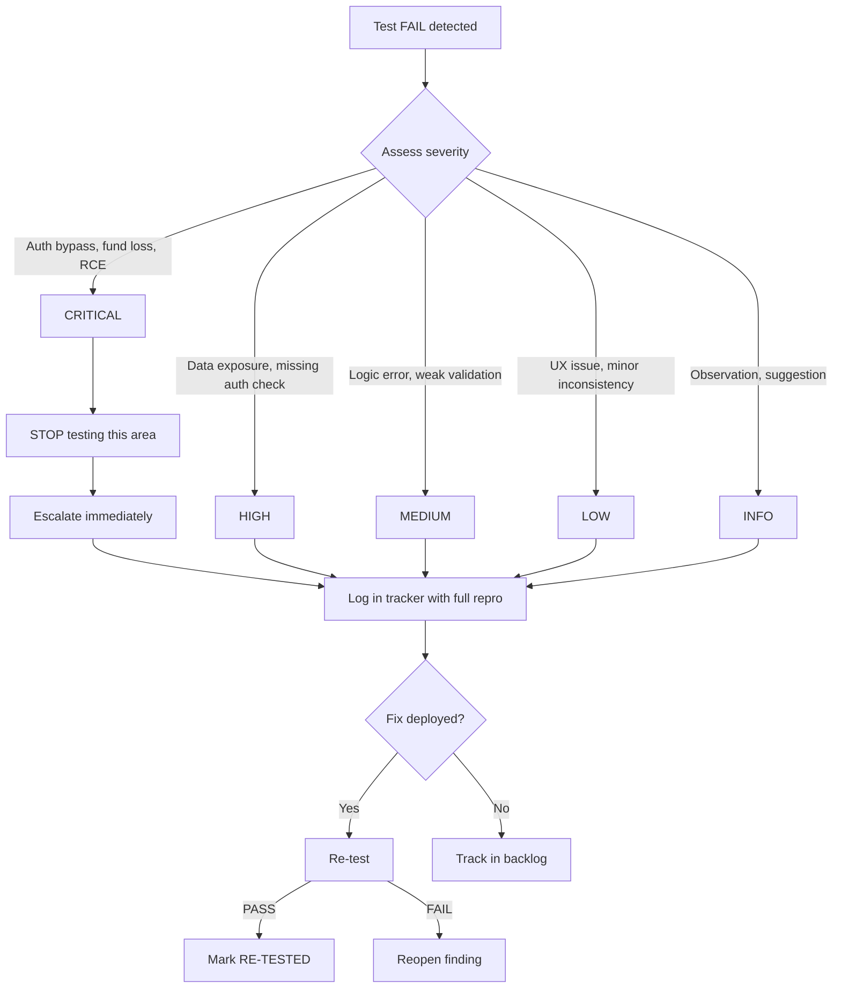

# Manual Audit — Findings Tracker

> Date: 2026-07-29
> System: AmmaWallet (ammawallet.com)
> Status: Template — no findings recorded yet

---

## How to Use This Tracker

1. When a checklist test **FAIL**s, create a new entry below using the next `MF-NNN` ID
2. Fill in all fields — incomplete entries slow down triage
3. Severity follows the scale in the Tester Guide
4. Update **Status** as findings are triaged and resolved
5. After a fix is deployed, **re-test** and update the Re-test columns

---

## Finding Severity & Escalation Flow



---

## Finding Status Definitions

| Status | Meaning |
|--------|---------|
| **NEW** | Just recorded, not yet triaged |
| **CONFIRMED** | Reproduced and accepted as valid |
| **IN PROGRESS** | Fix being developed |
| **RESOLVED** | Fix deployed |
| **RE-TESTED** | Fix verified by re-test |
| **WONTFIX** | Accepted risk / by design |
| **DUPLICATE** | Same as another finding |
| **INVALID** | Not reproducible or not a defect |

---

## Summary Dashboard

| Severity | New | Confirmed | In Progress | Resolved | Re-tested | Won't Fix | Total |
|----------|:---:|:---------:|:-----------:|:--------:|:---------:|:---------:|:-----:|
| CRITICAL | 0 | 0 | 0 | 0 | 0 | 0 | 0 |
| HIGH     | 0 | 0 | 0 | 0 | 0 | 0 | 0 |
| MEDIUM   | 0 | 0 | 0 | 0 | 0 | 0 | 0 |
| LOW      | 0 | 0 | 0 | 0 | 0 | 0 | 0 |
| INFO     | 0 | 0 | 0 | 0 | 0 | 0 | 0 |
| **Total**| **0** | **0** | **0** | **0** | **0** | **0** | **0** |

---

## Findings

<!-- Copy this template for each new finding -->

<!--
### MF-001: [Short title]

| Field | Value |
|-------|-------|
| **Finding ID** | MF-001 |
| **Test ID** | [e.g., AUTH-003] |
| **Feature Area** | [e.g., Authentication] |
| **Severity** | CRITICAL / HIGH / MEDIUM / LOW / INFO |
| **Status** | NEW |
| **Tester** | [Name] |
| **Date Found** | YYYY-MM-DD |
| **Environment** | [Testnet / Local / Production] |
| **Browser** | [e.g., Chrome 127] |

**Description:**
[What went wrong — 1-2 sentences]

**Steps to Reproduce:**
1. [Step 1]
2. [Step 2]
3. [Step 3]

**Expected Result:**
[What should have happened]

**Actual Result:**
[What actually happened]

**Evidence:**
- Screenshot: [filename or inline]
- Network request: [curl command or HTTP capture]
- Console output: [if relevant]

**Fix Commit:** [commit hash, when resolved]

**Re-test Date:** [YYYY-MM-DD]

**Re-test Result:** PASS / FAIL

**Notes:**
[Any additional context, related findings, workarounds]

---
-->

*No findings recorded yet. Use the template above to add findings as tests are executed.*

---

## Cross-Reference to Automated Audit

Findings from this manual audit should be cross-referenced against the automated security audit findings in `FINDINGS.md`. Use the following mapping:

| Manual Audit ID | Automated Audit ID | Relationship |
|----------------|-------------------|-------------|
| MF-NNN | P0-1-F14 (example) | Regression / New / Related |

This helps identify:
- **Regression:** A previously fixed issue has returned
- **New:** A previously undetected issue
- **Related:** Extends or refines an existing finding

---

## Appendix: Blank Template (Copy-Paste)

```markdown
### MF-NNN: [Title]

| Field | Value |
|-------|-------|
| **Finding ID** | MF-NNN |
| **Test ID** | [checklist ID] |
| **Feature Area** | [domain] |
| **Severity** | [level] |
| **Status** | NEW |
| **Tester** | [name] |
| **Date Found** | [date] |
| **Environment** | [env] |
| **Browser** | [browser] |

**Description:**
[description]

**Steps to Reproduce:**
1. [step]

**Expected Result:**
[expected]

**Actual Result:**
[actual]

**Evidence:**
- [evidence]

**Fix Commit:**

**Re-test Date:**

**Re-test Result:**

**Notes:**
[notes]
```
