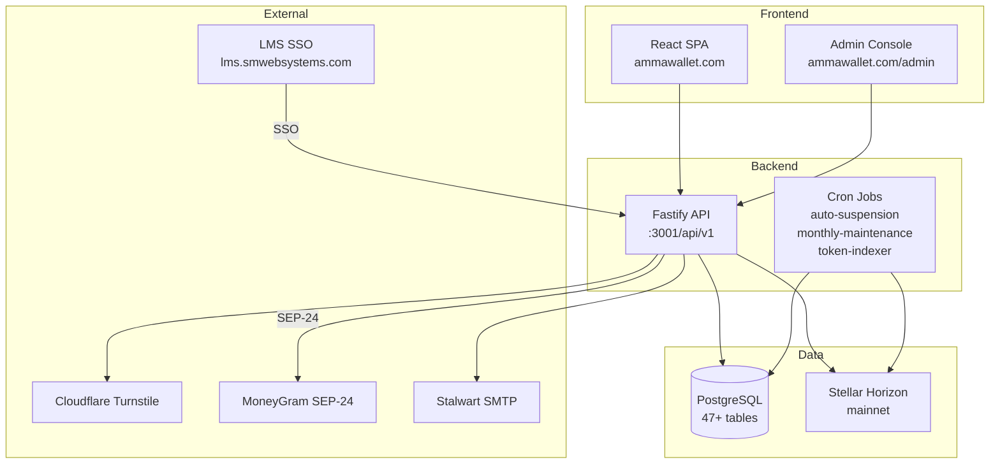
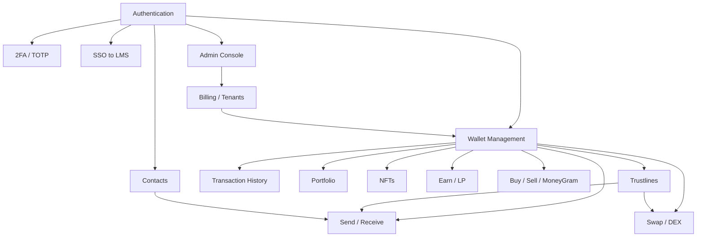

# Manual Audit — System Scope

> Date: 2026-07-29
> System: AmmaWallet (ammawallet.com)
> Stack: Fastify + Drizzle ORM + PostgreSQL | React + Vite | Docker

---

## System Architecture

---

## Feature Areas (12 domains)

| # | Domain | Routes | Pages | Risk Level |
|---|--------|-------:|------:|:----------:|
| 1 | Authentication & User Management | 15 endpoints | 5 pages | HIGH |
| 2 | Two-Factor Authentication | 6 endpoints | 1 component | HIGH |
| 3 | Wallet Management | 6 endpoints | 2 pages | HIGH |
| 4 | Stellar Operations (Send/Receive/Swap) | 8+ endpoints | 3 pages | HIGH |
| 5 | Trustline Management | 5 endpoints | 1 page section | MEDIUM |
| 6 | Multi-Tenant Billing | 7 service functions | 0 user pages | HIGH |
| 7 | Admin Console | 14 endpoints | 4 pages | HIGH |
| 8 | SSO Integration | 2 endpoints | 1 page | HIGH |
| 9 | Contacts / Address Book | 4 endpoints | 1 page | LOW |
| 10 | Token Discovery & NFTs | 15+ endpoints | 3 pages | MEDIUM |
| 11 | Portfolio & History | 5 endpoints | 2 pages | LOW |
| 12 | Fiat / MoneyGram / Earn | 12 endpoints | 2 pages | MEDIUM |

---

## Feature Dependency Map

---

## Accounts Needed for Testing

| Account Type | Purpose | How to Create |
|-------------|---------|---------------|
| Regular user (new) | Fresh signup, onboarding | Register via UI |
| Regular user (with wallet) | Core feature testing | Register + create wallet |
| Regular user (with funds) | Send/swap/trustline testing | Fund via testnet friendbot or admin credit |
| Admin (super_admin) | Full admin console testing | Existing or created via DB |
| Admin (platform_admin) | Limited admin testing | Created via super_admin |
| Suspended tenant user | Suspension behavior testing | Suspend via admin console |
| Multi-wallet user | Wallet switching, activation | Create 2+ wallets |
| SSO user | SSO flow testing | Access via LMS redirect |

---

## Test Environment Options

| Environment | URL | Safe for Testing | Notes |
|-------------|-----|:----------------:|-------|
| Production (mainnet) | ammawallet.com | READ-ONLY tests only | Real money, real users |
| Testnet | ammawallet.com (testnet mode) | YES | Network toggle in settings |
| Local dev | localhost:3001 | YES | Requires Docker setup |

**Recommendation:** Use testnet mode for all write operations. Use production only for read-only verification (health checks, UI rendering, login flow with test account).

---

## Out of Scope

- Stellar network behavior (consensus, horizon API correctness)
- Cloudflare Turnstile internals
- MoneyGram/Transak/Stripe payment processing internals
- Email delivery reliability (Stalwart SMTP)
- Docker/infrastructure security (covered by separate audit)
- Mobile responsiveness (no native app)
