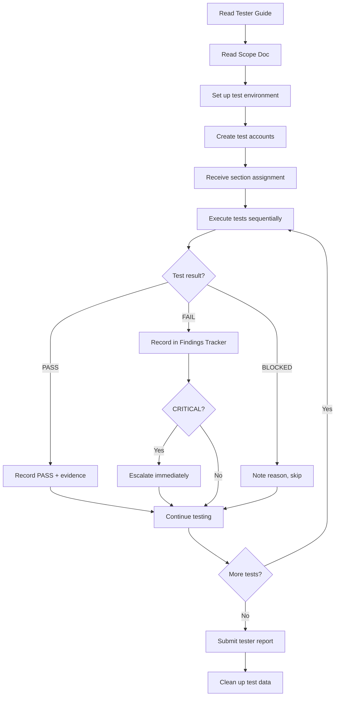

# Manual Audit — Tester Guide

> Date: 2026-07-29
> System: AmmaWallet (ammawallet.com)
> Audience: Manual QA testers executing the audit checklist

---

## Tester Workflow Overview



---

## 1. Before You Start

### Required Reading
1. `MANUAL_AUDIT_SCOPE.md` — system architecture, feature areas, dependency map
2. `MANUAL_AUDIT_CHECKLIST.md` — the tests you will execute
3. This guide — setup, procedures, escalation

### Time Commitment

| Assignment | Sections | Est. Time |
|-----------|----------|:---------:|
| Tester 1 | AUTH, TOTP, SEC | 90 min |
| Tester 2 | WALLET, STELLAR, BILLING | 90 min |
| Tester 3 | ADMIN, SSO, REG | 75 min |
| Tester 4 | CONTACT, TOKEN, PORT, MISC | 45 min |
| **Total (1 tester)** | All sections | **3–4 hours** |

---

## 2. Test Environment Setup

### Option A: Testnet Mode (Recommended)

Use the production site with testnet network selected:

1. Open `https://ammawallet.com` in a **private/incognito** browser window
2. Register a fresh test account (use a disposable email or `+tag` address)
3. Navigate to **Settings > Network** and switch to **Testnet**
4. Create a wallet — it will use the Stellar testnet
5. Fund using the testnet friendbot (built into the UI or `https://friendbot.stellar.org?addr=YOUR_ADDRESS`)

**Why testnet:** All write operations (send, swap, trustlines) use test XLM with no real value. Safe for destructive tests.

### Option B: Local Development

```bash
cd /home/webadmin/web-stack/html/amma-wallet
docker compose -f docker-compose.testnet.yml up -d

# API: http://localhost:3002
# DB: amma-db-testnet (PostgreSQL)
```

### Option C: Production (Read-Only)

Use `https://ammawallet.com` for read-only verification only:
- Health checks, UI rendering, login (with test account)
- **Do NOT** create wallets, send funds, or modify data on mainnet during testing

---

## 3. Required Test Accounts

Create these accounts before starting (testnet mode):

| # | Account | How to Create | Used By |
|---|---------|---------------|---------|
| 1 | **Fresh user** (no wallet) | Register new account | AUTH, WALLET |
| 2 | **User with funded wallet** | Register + create wallet + friendbot | STELLAR, CONTACT, TOKEN, PORT |
| 3 | **User with TOTP enabled** | Register + enable 2FA | TOTP |
| 4 | **Second user** (for cross-account tests) | Register another account | SEC, CONTACT |
| 5 | **Admin (super_admin)** | Use existing or create via DB | ADMIN, BILLING |
| 6 | **Admin (platform_admin)** | Create via super_admin console | ADMIN |
| 7 | **Tenant with API key** | Create via admin console | BILLING |
| 8 | **SSO user** | Access via LMS redirect | SSO |

### Account Credential Storage

Store test credentials securely during the audit:

```
# test-accounts.txt (DO NOT commit — delete after audit)
FRESH_USER_EMAIL=test-audit-fresh@example.com
FRESH_USER_PASS=TestAudit2026!
FUNDED_USER_EMAIL=test-audit-funded@example.com
FUNDED_USER_PASS=TestAudit2026!
...
```

---

## 4. Tools You Will Need

| Tool | Purpose |
|------|---------|
| Modern browser (Chrome/Firefox) | UI testing |
| Browser DevTools (F12) | Network tab, console, storage inspection |
| `curl` or Postman | API endpoint testing |
| Authenticator app (Google/Authy) | TOTP testing |
| Screenshot tool | Evidence capture |
| Text editor | Notes and findings |

### Useful curl Templates

```bash
# Login and get token
TOKEN=$(curl -s -X POST https://ammawallet.com/api/v1/auth/login \
  -H 'Content-Type: application/json' \
  -d '{"email":"test@example.com","password":"TestPass123!"}' \
  | jq -r '.token')

# Authenticated GET
curl -s https://ammawallet.com/api/v1/wallets \
  -H "Authorization: Bearer $TOKEN" | jq .

# Authenticated POST
curl -s -X POST https://ammawallet.com/api/v1/wallets \
  -H "Authorization: Bearer $TOKEN" \
  -H 'Content-Type: application/json' \
  -d '{"name":"Test Wallet"}' | jq .

# Admin endpoint
curl -s https://ammawallet.com/api/v1/internal/users \
  -H "Authorization: Bearer $ADMIN_TOKEN" | jq .

# Tenant API key
curl -s https://ammawallet.com/api/v1/tenant/balance \
  -H "x-api-key: $TENANT_KEY" | jq .
```

---

## 5. How to Execute Tests

### Step-by-Step Process

1. **Open the checklist** — `MANUAL_AUDIT_CHECKLIST.md`
2. **Work section by section** — follow your assigned sections in order
3. **For each test:**
   - Read the full test spec (risk, prerequisites, steps)
   - Ensure prerequisites are met
   - Execute steps exactly as written
   - Compare actual result to expected result
   - Record: Status (PASS/FAIL/BLOCKED/SKIP), Actual Result, Evidence, Notes
4. **If a test fails** — record details and continue (do not stop)
5. **If a test is blocked** — mark BLOCKED with reason, continue to next test

### Status Definitions

| Status | Meaning |
|--------|---------|
| **PASS** | Actual result matches expected result |
| **FAIL** | Actual result differs from expected result |
| **BLOCKED** | Cannot execute (missing prerequisite, environment issue) |
| **SKIP** | Intentionally skipped (with documented reason) |

---

## 6. How to Record Findings

### When a Test Fails

Record the following in `MANUAL_AUDIT_FINDINGS_TRACKER.md`:

1. **Finding ID:** Use format `MF-NNN` (Manual Finding)
2. **Test ID:** Which checklist test failed (e.g., AUTH-003)
3. **Severity:** CRITICAL / HIGH / MEDIUM / LOW / INFO
4. **Description:** What went wrong
5. **Steps to Reproduce:** Exact steps (copy from checklist + any variations)
6. **Expected vs Actual:** Side by side
7. **Evidence:** Screenshots, curl output, console errors
8. **Environment:** Browser, network mode, account used

### Severity Classification

| Severity | Criteria | Example |
|----------|----------|---------|
| **CRITICAL** | Data loss, fund loss, auth bypass, RCE | Unauthorized wallet access |
| **HIGH** | Significant security gap, data exposure | JWT leak in URL, missing auth check |
| **MEDIUM** | Logic error, minor security issue | Rate limit bypass, weak validation |
| **LOW** | UX issue, minor inconsistency | Wrong error message, layout issue |
| **INFO** | Observation, not a defect | Suggestion, documentation gap |

---

## 7. How to Avoid Data Corruption

### Rules

1. **Always use testnet** for write operations (send, swap, trustline, wallet creation)
2. **Never modify production admin settings** unless specifically instructed
3. **Never delete real user accounts** — create test accounts for deletion tests
4. **Never modify tenant billing** on production — use testnet or local
5. **Use unique test data** — prefix with `test-audit-` to identify
6. **Clean up after yourself** — delete test accounts/contacts/data when done

### If You Accidentally Affect Production

1. **Stop immediately** — do not try to fix it yourself
2. **Document exactly what happened** — commands run, responses received
3. **Escalate** using the procedure below

---

## 8. How to Escalate Critical Findings

### Escalation Criteria

Escalate **immediately** (do not wait until end of session) if you find:

- Unauthorized access to another user's wallet or data
- Ability to transfer funds without authorization
- Authentication bypass (access without valid token)
- SQL injection, XSS, or command injection that works
- Exposed secrets (private keys, API keys, passwords) in responses
- Admin functionality accessible to regular users

### Escalation Procedure

1. **Stop testing** the affected area
2. **Document the finding** with full reproduction steps
3. **Mark the test as FAIL with CRITICAL severity**
4. **Notify the audit lead immediately** via agreed channel
5. **Do not share the finding** outside the audit team
6. **Do not attempt to exploit further** — one proof is sufficient

---

## 9. How to Reproduce Failed Tests

When a test fails, ensure reproducibility:

1. **Try the exact same steps** a second time — confirm it's not a transient issue
2. **Try in a different browser** — rule out browser-specific behavior
3. **Check the network tab** — capture the HTTP request/response
4. **Check the console** — capture any JavaScript errors
5. **Note the timestamp** — for correlation with server logs
6. **If intermittent:** Note the failure rate (e.g., "fails 2 out of 5 attempts")

---

## 10. How to Submit Test Reports

### During Testing

- Update your sections in the checklist as you go
- Log findings in the findings tracker immediately
- Note any blocked tests and their reasons

### End of Session

1. **Count your results:**
   - Total tests executed
   - PASS / FAIL / BLOCKED / SKIP counts
2. **Summarize findings** by severity
3. **List any blocked tests** with reasons
4. **Note environment issues** encountered
5. **Submit** the updated checklist and findings tracker

### Report Format

```markdown
## Tester Report — [Your Name]
- Date: YYYY-MM-DD
- Sections: [which sections]
- Environment: [testnet/local/production]
- Browser: [name + version]

### Results
| Status | Count |
|--------|------:|
| PASS   |    XX |
| FAIL   |    XX |
| BLOCKED|    XX |
| SKIP   |    XX |

### Findings
[List MF-NNN IDs and one-line summaries]

### Blockers
[Any tests you couldn't execute and why]

### Notes
[Anything unusual observed]
```

---

## 11. Quick Reference

### API Base URLs

| Environment | URL |
|-------------|-----|
| Production | `https://ammawallet.com/api/v1/` |
| Testnet | `https://ammawallet.com/api/v1/` (with testnet wallet) |
| Local | `http://localhost:3002/api/v1/` |

### Key Pages

| Page | Path |
|------|------|
| Register | `/register` |
| Login | `/login` |
| Dashboard | `/dashboard` |
| Send | `/send` |
| Receive | `/receive` |
| Swap | `/swap` |
| Tokens | `/tokens` |
| NFTs | `/nfts` |
| Portfolio | `/portfolio` |
| Contacts | `/contacts` |
| Settings | `/settings` |
| Admin | `/admin` |
| Help | `/help` |

### Common Error Codes

| Code | Meaning |
|------|---------|
| 400 | Bad request — invalid input |
| 401 | Unauthorized — missing or invalid token |
| 402 | Payment required — insufficient billing balance |
| 403 | Forbidden — insufficient permissions |
| 404 | Not found |
| 409 | Conflict — duplicate resource |
| 429 | Rate limited — too many requests |
| 500 | Server error — report as finding |
