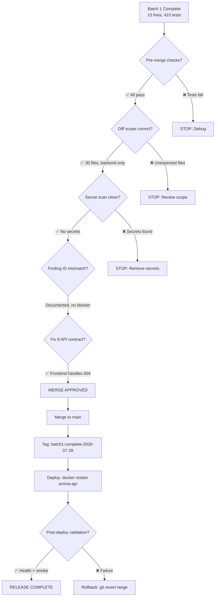

# Batch 1 — Release Decision

> Date: 2026-07-28
> Branch: `fix/backlog-batch1`

---

## Decision: APPROVED FOR MERGE AND DEPLOY



## Risk Assessment

| Risk | Likelihood | Impact | Mitigation |
|------|-----------|--------|------------|
| Test regression in production | Very low | Medium | Full suite verified, each fix independently revertable |
| DELETE 404 breaks caller | Very low | Low | Frontend confirmed to handle errors via toast |
| Eviction removes active window | Near zero | Very low | Only evicts entries >60s expired |
| Config warning noise | None | None | Only triggers in production with empty TURNSTILE_SECRET_KEY |

## Merge Plan

1. `git checkout main && git merge fix/backlog-batch1 --no-ff`
2. Tag: `git tag batch1-complete-2026-07-28`
3. Push: `source ~/.env.git-write && git push`

## Deploy Plan

1. Rebuild container: `cd ~/amma-wallet-docker && docker compose up -d --no-deps --build amma-api`
2. Verify health: `curl -s https://ammawallet.com/api/v1/health`
3. Check logs: `docker logs amma-api --tail 50`
4. Verify config warning NOT emitted (TURNSTILE_SECRET_KEY should be set in production)

## Rollback Plan

If post-deploy validation fails:
```bash
git revert d24e1a6..628b522 --no-commit  # revert all batch1 commits
git commit -m "revert: Batch 1 rollback"
# redeploy
```

## Blockers

**None.** Merge and deploy can proceed immediately.
