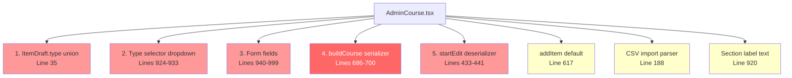
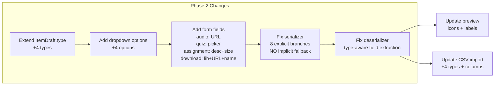
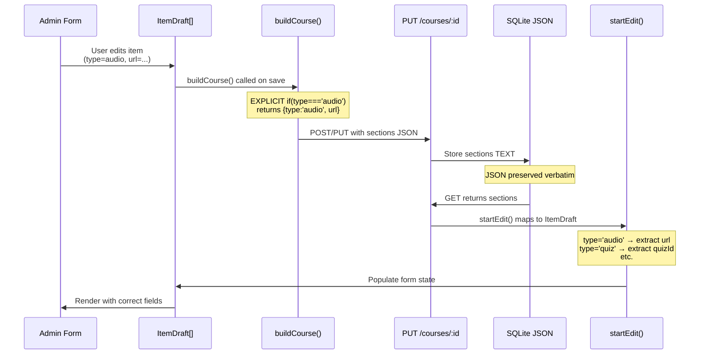
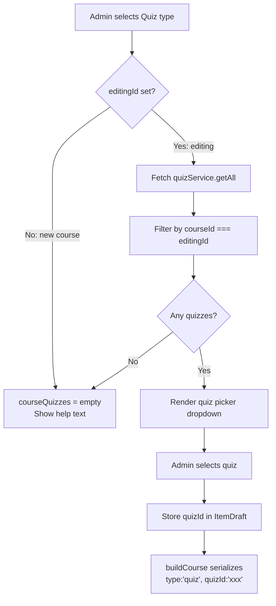
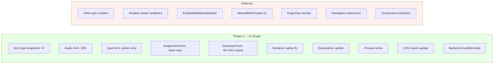

# Phase 2: Admin Course Builder — New Item Types

**Date:** 2026-08-03
**Status:** Implementation-Ready Spec
**Parent:** `2026-08-03-course-module-content-schema-spec.md`
**Prerequisite:** Phase 1 complete (415/415 tests green)
**Scope:** Admin authoring UI for audio, quiz, assignment, download item types

---

## Table of Contents

1. [Summary](#1-summary)
2. [Scope and Non-Goals](#2-scope-and-non-goals)
3. [Current Builder Architecture](#3-current-builder-architecture)
4. [Approved Approach](#4-approved-approach)
5. [ItemDraft Type Extension](#5-itemdraft-type-extension)
6. [Per-Type Field Requirements](#6-per-type-field-requirements)
7. [Serializer Safety Rules](#7-serializer-safety-rules)
8. [Deserializer Loading Rules](#8-deserializer-loading-rules)
9. [Quiz Picker Integration](#9-quiz-picker-integration)
10. [AdminCoursePreview Changes](#10-admincoursepreview-changes)
11. [CSV Import Changes](#11-csv-import-changes)
12. [Backward Compatibility](#12-backward-compatibility)
13. [Acceptance Criteria](#13-acceptance-criteria)
14. [Test Plan](#14-test-plan)
15. [Manual QA Checklist](#15-manual-qa-checklist)
16. [Rollback Approach](#16-rollback-approach)
17. [Mermaid Diagrams](#17-mermaid-diagrams)
18. [To-Do Lists](#18-to-do-lists)
19. [Loop Workflow](#19-loop-workflow)
20. [Deferred Specs](#20-deferred-specs)
21. [Review Notes](#21-review-notes)
22. [Worktree Plan](#22-worktree-plan)

---

## 1. Summary

Phase 2 adds admin authoring support for 4 new content item types (audio, quiz, assignment, download) to the existing course builder in `AdminCourse.tsx`. The builder currently supports video, link, pdf, and text items. Phase 1 already extended the TypeScript types and backend to handle the new types — Phase 2 makes them authorable.

**Approach:** Inline extension (Approach A). Modify the existing monolithic builder at its 5 touch points. No component extraction, no registry pattern, no new files except tests.

**Key safety requirement:** The `buildCourse()` serializer currently has an implicit fallback that treats any unknown item type as `pdf`. This MUST be replaced with explicit branches for all 8 types to prevent silent data corruption.

---

## 2. Scope and Non-Goals

### In Scope (Phase 2)

- Add audio, quiz, assignment, download to `ItemDraft.type` union
- Add 4 new `<option>` values to the item type `<select>` dropdown
- Add type-specific form fields for each new type
- Fix `buildCourse()` serializer: explicit branches for all 8 types
- Fix `startEdit()` deserializer: extract all new type-specific fields
- Quiz picker: dropdown of existing quizzes filtered by current course ID
- AdminCoursePreview: icons and labels for new item types
- CSV import: accept new type values with their required columns
- Backend roundtrip tests for new item types
- Serializer corruption regression test

### Non-Goals (Deferred)

| Feature | Deferred To | Reason |
|---------|-------------|--------|
| Inline quiz creation in builder | Future spec | Complexity — quizzes already authorable on Quizzes page |
| Student viewer rendering of new types | Phase 3 | Separate concern |
| EmbeddedMaterialViewer extension | Phase 3 | Depends on student viewer |
| `allowedMimeTypes` checkboxes for assignments | Phase 3 | Field stored but UI deferred |
| Drag-and-drop item reorder | Separate feature | Unrelated to item types |
| Navigation/sidebar restructure | Phase 5 | High-risk, user-facing |
| Component extraction refactor | Future cleanup | Not needed for correctness |

---

## 3. Current Builder Architecture

### File: `LMS-Frontend/src/pages/AdminCourse.tsx` (1,217 lines)

The builder is a single-page monolith with all form state, CRUD, serialization, and rendering inline.

### 5 Touch Points for Each Item Type

| # | Touch Point | Location | Current State |
|---|-------------|----------|---------------|
| 1 | `ItemDraft.type` union | Line 35 | `'video' \| 'link' \| 'pdf' \| 'text'` |
| 2 | `<select>` dropdown | Lines 924–933 | 4 `<option>` elements |
| 3 | Type-specific form fields | Lines 940–999 | `it.type !== 'pdf'` → URL; `it.type === 'pdf'` → library+upload |
| 4 | `buildCourse()` serializer | Lines 686–700 | 3 explicit `if` branches + implicit else=pdf |
| 5 | `startEdit()` deserializer | Lines 433–441 | Extracts `url`, `documentId`, `fileUrl` only |

### Additional Touch Points

| Touch Point | Location | Current State |
|-------------|----------|---------------|
| `addItem()` default | Line 617 | Creates new item with `type: 'video'` |
| Section label text | Line 920 | "Items (videos, links, text articles, PDFs)" |
| CSV import parser | Line 188 | Accepts `video`, `link`, `pdf` only (note: `text` was missing pre-Phase 2) |
| AdminCoursePreview icons | Lines 76–92 | video/pdf/link icons only |
| `quizService` import | Line 29 | Already imported (unused by builder currently) |

### Critical Risk: Serializer Fallback

```typescript
// CURRENT CODE — Lines 686–700
if (it.type === 'video') return { ...base, type: 'video', url: ... };
if (it.type === 'link')  return { ...base, type: 'link', url: ... };
if (it.type === 'text')  return { ...base, type: 'text', url: ... };
// IMPLICIT FALLBACK — any other type becomes pdf:
return { ...base, type: 'pdf', documentId: ..., fileUrl: ... };
```

If the dropdown is updated to include `audio` but `buildCourse()` is not updated, saving an audio item will silently serialize it as `type: 'pdf'` with no URL — corrupting the data.

---

## 4. Approved Approach

**Approach A: Inline Extension**

Modify the existing monolith at its 5 touch points. Follow existing conditional rendering patterns. No new component files, no registry abstraction, no architectural refactoring.

**Why this approach:**
- Follows the existing pattern exactly
- Smallest change surface (~130 new lines)
- No risk of regression from extraction refactoring
- AdminCourse.tsx grows to ~1,350 lines — still manageable
- Easy to review: diff shows only additions and the serializer safety fix

---

## 5. ItemDraft Type Extension

### Before (Current)

```typescript
type ItemDraft = {
  tempId: string;
  type: 'video' | 'link' | 'pdf' | 'text';
  title: string;
  order: number;
  url?: string;
  documentId?: string;
  fileUrl?: string;
  information?: string;
};
```

### After (Phase 2)

```typescript
type ItemDraft = {
  tempId: string;
  type: 'video' | 'link' | 'pdf' | 'text' | 'audio' | 'quiz' | 'assignment' | 'download';
  title: string;
  order: number;
  url?: string;              // video, link, text, audio
  documentId?: string;       // pdf, download
  fileUrl?: string;          // pdf, download
  information?: string;      // all types
  // Phase 2 new fields:
  quizId?: string;           // quiz
  description?: string;      // assignment
  maxFileSize?: number;      // assignment
  allowedMimeTypes?: string[]; // assignment (stored, UI deferred to Phase 3)
  fileName?: string;         // download
};
```

**Field-to-type mapping:**

| Field | Used By Types |
|-------|---------------|
| `url` | video, link, text, audio |
| `documentId` | pdf, download |
| `fileUrl` | pdf, download |
| `information` | all |
| `quizId` | quiz |
| `description` | assignment |
| `maxFileSize` | assignment |
| `allowedMimeTypes` | assignment (stored only) |
| `fileName` | download |

---

## 6. Per-Type Field Requirements

### 6.1 Audio

**Form fields:**
- URL input (same as video/link/text, different placeholder)
- Placeholder: `"Audio URL (.mp3, .ogg, .wav)"`

**Conditional rendering group:** URL-based types (`video`, `link`, `text`, `audio`)

**Validation on save:** URL should be non-empty (same rule as video/link/text).

### 6.2 Quiz (Link Existing Only)

**Form fields:**
- Quiz picker `<select>` dropdown
- Populated from `quizService.getAll()`, filtered to quizzes where `quiz.courseId === editingCourseId`
- Default option: `"— Select quiz —"`
- Empty state: `"No quizzes for this course yet. Create quizzes on the Quizzes admin page."`

**Data flow:**
1. On mount / when `editingId` changes, fetch quizzes and store in `courseQuizzes` state
2. Filter: `allQuizzes.filter(q => q.courseId === editingId)`
3. On select, store `quizId` in the ItemDraft

**What is NOT implemented:**
- No "Create new quiz" button
- No inline quiz form
- No quiz preview in the builder

**Validation on save:** `quizId` must be non-empty.

### 6.3 Assignment

**Form fields:**
- Description textarea: `"Task description shown to students"`
- Max file size input (number, optional): `"Max file size in MB (default: 10)"`
- `allowedMimeTypes`: NOT rendered in Phase 2. The field exists on `ItemDraft` so existing data is preserved if set, but no UI to edit it.

**Data handling:**
- `description` is stored as-is (required, but empty string is acceptable)
- `maxFileSize` is stored in bytes. The input shows MB (multiply by 1,048,576 on save, divide on load). If empty/zero, omit the field (defaults to system limit).

**Validation on save:** No hard validation — assignments with empty descriptions are allowed (admin may fill in later).

### 6.4 Download

**Form fields:** Mirror the PDF pattern:
- Library picker `<select>` from `documents` state (already loaded)
- Direct URL input: `"Or direct download URL"`
- Filename input: `"Display filename (e.g. slides.pptx)"` — required for download type

**Data flow:**
- Same `documents` array already used by PDF items
- `documentId` and `fileUrl` work identically to PDF
- `fileName` is the display name shown to students

**Validation on save:** `fileName` should be non-empty if type is download.

---

## 7. Serializer Safety Rules

### Rule 1: No Implicit Fallback

The `buildCourse()` function MUST have explicit branches for all 8 types. The current implicit else-returns-pdf pattern MUST be replaced.

### Rule 2: Explicit Branch for Every Type

```typescript
// REQUIRED — explicit handling for all 8 types:
if (it.type === 'video')      return { ...base, type: 'video' as const, url: ... };
if (it.type === 'link')       return { ...base, type: 'link' as const, url: ... };
if (it.type === 'text')       return { ...base, type: 'text' as const, url: ... };
if (it.type === 'audio')      return { ...base, type: 'audio' as const, url: ... };
if (it.type === 'quiz')       return { ...base, type: 'quiz' as const, quizId: ... };
if (it.type === 'assignment') return { ...base, type: 'assignment' as const, description: ..., ... };
if (it.type === 'download')   return { ...base, type: 'download' as const, documentId: ..., fileUrl: ..., fileName: ... };
// pdf is the LAST explicit branch:
return { ...base, type: 'pdf' as const, documentId: ..., fileUrl: ... };
```

### Rule 3: Audio Serialization

```typescript
if (it.type === 'audio') {
  return { ...base, type: 'audio' as const, url: (it.url || '').trim() };
}
```

### Rule 4: Quiz Serialization

```typescript
if (it.type === 'quiz') {
  return {
    ...base,
    type: 'quiz' as const,
    quizId: (it.quizId || '').trim(),
  };
}
```

### Rule 5: Assignment Serialization

```typescript
if (it.type === 'assignment') {
  return {
    ...base,
    type: 'assignment' as const,
    ...(it.description?.trim() ? { description: it.description.trim() } : {}),
    ...(it.maxFileSize ? { maxFileSize: it.maxFileSize } : {}),
    ...(it.allowedMimeTypes?.length ? { allowedMimeTypes: it.allowedMimeTypes } : {}),
  };
}
```

### Rule 6: Download Serialization

```typescript
if (it.type === 'download') {
  return {
    ...base,
    type: 'download' as const,
    documentId: it.documentId?.trim() || undefined,
    fileUrl: it.fileUrl?.trim() || undefined,
    fileName: (it.fileName || '').trim(),
  };
}
```

### Serializer Safety Checklist

- [ ] Every type in `ItemDraft.type` has its own `if` branch
- [ ] No implicit `else` returns a different type
- [ ] `pdf` is the last explicit branch (not a catch-all)
- [ ] Each branch includes `type: 'xxx' as const` (preserves discriminant)
- [ ] Each branch extracts only the fields relevant to that type
- [ ] Empty optional fields are omitted (not saved as empty strings)

---

## 8. Deserializer Loading Rules

### Current Deserializer (`startEdit()`, Lines 433–441)

```typescript
items: (s.items || []).map((it, i) => ({
  tempId: it.id,
  type: it.type,
  title: it.title,
  order: it.order ?? i + 1,
  url: it.type !== 'pdf' ? (it as { url: string }).url : undefined,
  documentId: it.type === 'pdf' ? (it as { documentId?: string }).documentId : undefined,
  fileUrl: it.type === 'pdf' ? (it as { fileUrl?: string }).fileUrl : undefined,
  information: (it as { information?: string }).information || '',
}))
```

### Required Changes

The `url` extraction currently uses `it.type !== 'pdf'` which would incorrectly extract `url` for quiz and assignment types (where `url` doesn't exist). The deserializer must become type-aware:

```typescript
items: (s.items || []).map((it, i) => ({
  tempId: it.id,
  type: it.type as ItemDraft['type'],
  title: it.title,
  order: it.order ?? i + 1,
  // URL-based types:
  url: (['video','link','text','audio'] as string[]).includes(it.type)
    ? (it as { url?: string }).url : undefined,
  // PDF + download:
  documentId: (['pdf','download'] as string[]).includes(it.type)
    ? (it as { documentId?: string }).documentId : undefined,
  fileUrl: (['pdf','download'] as string[]).includes(it.type)
    ? (it as { fileUrl?: string }).fileUrl : undefined,
  // Quiz:
  quizId: it.type === 'quiz' ? (it as { quizId?: string }).quizId : undefined,
  // Assignment:
  description: it.type === 'assignment' ? (it as { description?: string }).description : undefined,
  maxFileSize: it.type === 'assignment' ? (it as { maxFileSize?: number }).maxFileSize : undefined,
  allowedMimeTypes: it.type === 'assignment' ? (it as { allowedMimeTypes?: string[] }).allowedMimeTypes : undefined,
  // Download:
  fileName: it.type === 'download' ? (it as { fileName?: string }).fileName : undefined,
  // Universal:
  information: (it as { information?: string }).information || '',
}))
```

### Deserializer Safety Rules

1. `type` is cast to `ItemDraft['type']` — unknown types from future versions will pass through as strings (TypeScript won't catch at runtime, but they'll be visible in the dropdown as blank)
2. Each field is extracted only for its relevant type(s) — no cross-type field leakage
3. The `information` field is always extracted (it's universal)
4. Missing fields produce `undefined` (not empty strings) — this matches the `ItemDraft` optional types

---

## 9. Quiz Picker Integration

### Data Loading

```typescript
// New state in AdminCourse component:
const [courseQuizzes, setCourseQuizzes] = useState<Quiz[]>([]);

// Fetch when editingId changes (or on mount if editing):
useEffect(() => {
  if (!editingId) { setCourseQuizzes([]); return; }
  quizService.getAll().then(all => {
    setCourseQuizzes(all.filter(q => q.courseId === editingId));
  });
}, [editingId]);
```

### Rendering (inside item form, when `it.type === 'quiz'`)

```tsx
{it.type === 'quiz' && (
  <>
    <select
      value={it.quizId || ''}
      onChange={(e) => updateItem(weekId, secId, it.tempId, { quizId: e.target.value || undefined })}
      className="rounded border border-neutral-300 px-2 py-1 text-sm min-w-[180px]"
    >
      <option value="">— Select quiz —</option>
      {courseQuizzes.map(q => (
        <option key={q.id} value={q.id}>{q.title}</option>
      ))}
    </select>
    {courseQuizzes.length === 0 && (
      <p className="text-xs text-neutral-500">
        No quizzes for this course yet. Create them on the Quizzes admin page.
      </p>
    )}
  </>
)}
```

### Edge Cases

| Scenario | Behavior |
|----------|----------|
| No quizzes exist for course | Empty dropdown + help text |
| Quiz is deleted after being linked | `quizId` remains in JSON; student viewer shows "quiz not found" (Phase 3) |
| Course is new (not yet saved) | `editingId` is null → `courseQuizzes` is empty → help text shown |
| Admin switches course while editing | `editingId` changes → useEffect refetches quizzes |

### Limitations (Deferred)

- No "Create new quiz" button in the builder
- No quiz preview/summary shown when a quiz is selected
- No validation that `quizId` still exists at save time (would require async validation)

---

## 10. AdminCoursePreview Changes

### File: `LMS-Frontend/src/components/AdminCoursePreview.tsx`

### `itemActionLabel()` (Line 14–25)

Add cases for new types:

```typescript
function itemActionLabel(item: CourseItem): string {
  if (item.type === 'video') return 'Play';
  if (item.type === 'audio') return 'Listen';      // NEW
  if (item.type === 'pdf') return 'View';
  if (item.type === 'quiz') return 'Quiz';          // NEW
  if (item.type === 'assignment') return 'Submit';   // NEW
  if (item.type === 'download') return 'Download';   // NEW
  if (item.type === 'link') {
    // existing logic...
  }
  return 'Open';
}
```

### Icon rendering (Lines 76–92)

Add icon mappings. Import additional icons from lucide-react:
- `Headphones` for audio
- `ClipboardCheck` for quiz (or reuse `ClipboardList` already imported in AdminCourse)
- `Upload` for assignment
- `Download` for download (already imported in AdminCourse)

```typescript
// Icon + color mapping:
// audio    → Headphones, bg-purple-50 text-purple-600
// quiz     → ClipboardCheck, bg-amber-50 text-amber-600
// assignment → Upload, bg-blue-50 text-blue-600
// download → Download, bg-green-50 text-green-600
```

---

## 11. CSV Import Changes

### File: `AdminCourse.tsx`, `parseImportCSV()` (Line 188)

### Current

```typescript
if (itemTitle && (itemType === 'video' || itemType === 'link' || itemType === 'pdf')) {
```

### After

```typescript
const URL_TYPES = ['video', 'link', 'text', 'audio'];
const VALID_TYPES = ['video', 'link', 'pdf', 'text', 'audio', 'quiz', 'assignment', 'download'];

if (itemTitle && VALID_TYPES.includes(itemType)) {
  const order = secDraft.items.length + 1;
  const base = { tempId: newTempId(), title: itemTitle, order, information: itemInfo };

  if (URL_TYPES.includes(itemType)) {
    secDraft.items.push({ ...base, type: itemType as 'video'|'link'|'text'|'audio', url: itemUrl });
  } else if (itemType === 'pdf') {
    secDraft.items.push({ ...base, type: 'pdf', fileUrl: itemUrl || undefined });
  } else if (itemType === 'quiz') {
    const quizId = quizIdIdx >= 0 ? (cols[quizIdIdx] ?? '').trim() : '';
    secDraft.items.push({ ...base, type: 'quiz', quizId });
  } else if (itemType === 'assignment') {
    const desc = descIdx >= 0 ? (cols[descIdx] ?? '').trim() : '';
    secDraft.items.push({ ...base, type: 'assignment', description: desc });
  } else if (itemType === 'download') {
    const fn = fileNameIdx >= 0 ? (cols[fileNameIdx] ?? '').trim() : itemTitle;
    secDraft.items.push({ ...base, type: 'download', fileUrl: itemUrl || undefined, fileName: fn });
  }
}
```

### CSV Header Extension

New optional columns recognized: `quizId`, `description`, `fileName`

```
week,section,objective,outcome,type,title,url,information,quizId,description,fileName
```

### Error Handling

Unknown types still produce `errors.push(...)` — no silent acceptance.

---

## 12. Backward Compatibility

### Guarantee 1: Old courses load unchanged

Courses with only video/link/pdf/text items load identically. The deserializer extracts the same fields as before for those types.

### Guarantee 2: Old courses save unchanged

Saving an old course re-serializes all items through their explicit `buildCourse()` branches. No fields are added or removed.

### Guarantee 3: Mixed-content courses work

A course with both old types (video, pdf) and new types (quiz, audio) in the same section serializes and deserializes correctly. Each item type follows its own branch.

### Guarantee 4: New items in old JSON

If a course JSON contains an item with `type: 'audio'` but was created before Phase 2 frontend was deployed, the old frontend would have shown it as a blank dropdown selection. The new frontend renders it correctly. No data loss.

### Guarantee 5: Unknown future types

If a future Phase adds `type: 'simulation'` to the backend, the Phase 2 frontend will:
- Show a blank `<select>` value (no matching `<option>`)
- Pass the type through in `startEdit()` (it's cast to string)
- Serialize it via the pdf fallback (this is the last remaining risk — but it only applies to types not yet added to the builder)

---

## 13. Acceptance Criteria

### AC-1: Audio item authoring
- Admin selects "Audio" from type dropdown
- URL input appears with audio-specific placeholder
- Save → reload: audio item has `type: 'audio'` and `url` in JSON

### AC-2: Quiz item authoring (link existing)
- Admin selects "Quiz" from type dropdown
- Quiz picker dropdown appears with course quizzes
- Selecting a quiz stores `quizId`
- Empty state: help text when no quizzes exist for the course
- Save → reload: quiz item has `type: 'quiz'` and `quizId` in JSON

### AC-3: Assignment item authoring
- Admin selects "Assignment" from type dropdown
- Description textarea and max file size input appear
- Save → reload: assignment item has `type: 'assignment'` and fields in JSON

### AC-4: Download item authoring
- Admin selects "Download" from type dropdown
- Library picker, URL input, and filename input appear
- Save → reload: download item has `type: 'download'` and fields in JSON

### AC-5: Serializer safety
- No item type is silently converted to another type on save
- Every type has an explicit serializer branch

### AC-6: Old items unchanged
- Editing a course with only video/link/pdf/text items → save → no field changes

### AC-7: Preview shows new types
- AdminCoursePreview shows correct icons and labels for all 8 types

### AC-8: CSV import handles new types
- CSV with `type=audio` and URL creates an audio item
- CSV with `type=quiz` and `quizId` creates a quiz item
- CSV with unknown type still shows error

---

## 14. Test Plan

### 14.1 Backend Roundtrip Tests (vitest + supertest)

These extend the existing `course-centric-phase1.test.ts`:

| Test | Method | Expectation |
|------|--------|-------------|
| Save course with audio item, reload | PUT + GET | `type: 'audio'`, `url` preserved |
| Save course with quiz item, reload | PUT + GET | `type: 'quiz'`, `quizId` preserved |
| Save course with assignment item, reload | PUT + GET | `type: 'assignment'`, `description`, `maxFileSize` preserved |
| Save course with download item, reload | PUT + GET | `type: 'download'`, `fileName`, `fileUrl` preserved |
| Save course with all 8 types in one section | PUT + GET | All 8 items preserve correct types and fields |
| Save old-only course (video+pdf), reload | PUT + GET | No new fields added, no type changes |
| Mixed old+new items in same section | PUT + GET | Each item keeps its own type |

### 14.2 Serializer Corruption Regression Test

```
GIVEN a course item with type 'audio' and url 'https://cdn.com/ep1.mp3'
WHEN saved via buildCourse() serializer
THEN the resulting JSON has type 'audio' (NOT 'pdf')
AND url is 'https://cdn.com/ep1.mp3'
AND documentId is NOT present
```

This test MUST fail if the implicit-else-is-pdf fallback is restored.

### 14.3 Existing Test Regression

All 415 existing tests must continue to pass. No test modifications allowed except additive.

---

## 15. Manual QA Checklist

### Create flow (per new type)

- [ ] Select type from dropdown
- [ ] Type-specific fields appear
- [ ] Fill in required fields
- [ ] Save course
- [ ] Reload page
- [ ] Edit the same course
- [ ] Verify item type and fields are preserved

### Specific type QA

- [ ] **Audio:** Enter MP3 URL → save → reload → URL preserved
- [ ] **Quiz:** Select quiz from picker → save → reload → quizId preserved
- [ ] **Quiz (empty):** No quizzes for course → help text shown, no crash
- [ ] **Assignment:** Enter description + max file size → save → reload → both preserved
- [ ] **Assignment (MB conversion):** Enter "5" MB → save → check JSON has 5242880 bytes → reload → shows "5" MB
- [ ] **Download:** Select from library → save → reload → documentId preserved
- [ ] **Download:** Enter URL + filename → save → reload → both preserved

### Compatibility QA

- [ ] Open old course (video+pdf only) → edit → save → no type corruption
- [ ] Add audio item to old course → save → both old and new items intact
- [ ] Preview old course → no new icons/labels leak
- [ ] Preview new course → correct icons for all types
- [ ] CSV import with audio type → creates audio item
- [ ] CSV import with unknown type → error shown

---

## 16. Rollback Approach

Phase 2 changes are entirely in the frontend. Rollback is:

1. Revert the AdminCourse.tsx changes
2. Revert AdminCoursePreview.tsx changes
3. Redeploy frontend

**Data safety:** Any courses saved with new item types will still have those items in the `sections` JSON. Old frontend code will skip rendering unknown types (graceful degradation). No data loss occurs on rollback.

**Backend:** No backend changes in Phase 2. Backend already handles all 8 types from Phase 1.

---

## 17. Mermaid Diagrams

### 17.1 AdminCourse Touch Points



### 17.2 Phase 2 Inline Extension Flow



### 17.3 Safe Serializer Roundtrip



### 17.4 Quiz Link-Only Flow



### 17.5 Scope vs Deferred



---

## 18. To-Do Lists

### 18.1 Implementation Checklist

- [ ] Extend `ItemDraft.type` union with 4 new types
- [ ] Add `quizId`, `description`, `maxFileSize`, `allowedMimeTypes`, `fileName` fields to `ItemDraft`
- [ ] Add 4 new `<option>` elements to type `<select>` dropdown
- [ ] Update section label text to include new type names
- [ ] Add conditional form rendering for audio (URL input)
- [ ] Add conditional form rendering for quiz (picker dropdown)
- [ ] Add conditional form rendering for assignment (description + maxFileSize)
- [ ] Add conditional form rendering for download (library + URL + fileName)
- [ ] Add `courseQuizzes` state and `useEffect` to fetch quizzes
- [ ] Fix `buildCourse()`: explicit branch for audio
- [ ] Fix `buildCourse()`: explicit branch for quiz
- [ ] Fix `buildCourse()`: explicit branch for assignment
- [ ] Fix `buildCourse()`: explicit branch for download
- [ ] Ensure pdf branch is explicit (not implicit fallback)
- [ ] Fix `startEdit()`: type-aware field extraction for all 8 types
- [ ] Update `AdminCoursePreview` icons and labels
- [ ] Update `parseImportCSV()` to accept new types
- [ ] Add CSV column detection for `quizId`, `description`, `fileName`

### 18.2 Serializer Safety Checklist

- [ ] Count `if (it.type === ...)` branches in `buildCourse()` — must be 7 (8th is the final return)
- [ ] Verify no `else` or implicit fallback remains
- [ ] Verify each branch uses `as const` for type discriminant
- [ ] Verify each branch extracts ONLY its own fields
- [ ] Verify empty optional fields are omitted (not empty strings)
- [ ] Write regression test: audio item does NOT serialize as pdf

### 18.3 Quiz Picker Checklist

- [ ] `quizService.getAll()` called when `editingId` changes
- [ ] Quizzes filtered by `courseId === editingId`
- [ ] Dropdown shows quiz titles
- [ ] Empty state shows help text
- [ ] Selected quizId stored in ItemDraft
- [ ] quizId survives save/reload cycle

### 18.4 Compatibility Checklist

- [ ] Old course (video+pdf only) loads correctly
- [ ] Old course saves without modification
- [ ] Mixed old+new course saves all types correctly
- [ ] Unknown future types pass through deserializer without crash
- [ ] 415 existing tests still pass

### 18.5 Test Checklist

- [ ] Backend roundtrip: audio item
- [ ] Backend roundtrip: quiz item
- [ ] Backend roundtrip: assignment item
- [ ] Backend roundtrip: download item
- [ ] Backend roundtrip: all 8 types in one section
- [ ] Backend roundtrip: old-only course unchanged
- [ ] Serializer corruption regression test
- [ ] Existing 415 tests pass (no modifications)

### 18.6 Manual QA Checklist

(See Section 15 above)

### 18.7 Rollout Checklist

- [ ] All tests pass (415 + new)
- [ ] Frontend builds without TypeScript errors
- [ ] Docker build succeeds: `docker compose build web`
- [ ] Deploy: `docker compose up -d --no-deps web`
- [ ] Admin creates one item of each new type on staging/prod
- [ ] Admin edits and re-saves an existing course — no corruption
- [ ] Spot-check student view — old items still render (new types show nothing, which is expected pre-Phase 3)

---

## 19. Loop Workflow

```
/loop assess  — Verify Phase 1 is green, read this spec, confirm scope
/loop spec    — Review this spec against actual code, flag any drift
/loop implement — Execute implementation plan (writing-plans output)
/loop verify  — Run tests, typecheck, build, manual QA
/loop review  — Code review against spec, check for scope creep
/loop close   — Commit, tag, document what's done vs deferred
```

---

## 20. Deferred Specs

### 20.1 Student Course Journey Spec (Phase 3)

**Purpose:** Define how students see and interact with the 4 new item types.

**Outline:**
1. AudioItemRenderer — HTML5 `<audio>` player with lesson completion on play
2. QuizItemRenderer — Inline quiz taking, reuse StudentQuizzes logic
3. AssignmentItemRenderer — File upload with courseId/weekId/itemId context
4. DownloadItemRenderer — Download button with lesson completion on click
5. SectionBlock extension — new type cases in item rendering chain
6. EmbeddedMaterialViewer extension — full content views for new types
7. Progress tracking integration — quiz scores and submission status inline

### 20.2 Inline Quiz Creation Spec (Deferred)

**Purpose:** Allow admins to create quizzes directly within the course builder.

**Outline:**
1. "Create new quiz" button alongside quiz picker
2. Inline form: title, questions (multiple choice), passing score
3. Calls `POST /api/v1/quizzes` with `courseId` pre-filled
4. On success, auto-selects the new quiz in the picker
5. Question editor component (extracted from AdminQuizzes page)
6. Validation: at least 1 question, at least 2 options per question

### 20.3 Embedded Material Viewer Extension Spec (Deferred)

**Purpose:** Extend `EmbeddedMaterialViewer.tsx` to render new item types.

**Outline:**
1. Audio: `<audio>` player with waveform visualization (optional)
2. Quiz: full quiz-taking interface (questions, answers, score)
3. Assignment: task description + file upload + submission history
4. Download: file info card + download button + file size display

---

## 21. Review Notes

### Assumptions

1. `quizService.getAll()` returns all quizzes visible to the admin — no additional authorization needed
2. The `documents` state (used for PDF library picker) is also suitable for download items
3. Frontend type changes don't require backend deployment (backend already handles all 8 types)
4. `maxFileSize` conversion MB↔bytes is handled in the UI, not stored as MB
5. The `addItem()` default remains `type: 'video'` — new items still start as video
6. `Quiz.courseId` is optional (`courseId?: string`) — quizzes without a courseId will not appear in the course-filtered picker, which is correct behavior
7. Server-side `CourseItem` union in `LMS-Server/src/types/index.ts` is missing the `text` variant — this is a pre-existing gap (not caused by Phase 1/2). The backend stores sections as opaque JSON so this has no runtime impact.
8. CSV import currently does not accept `text` type — Phase 2 adds `text` alongside the 4 new types to fix this pre-existing gap

### Unknowns

1. **Quiz deletion:** What happens if a linked quiz is deleted? The `quizId` persists in JSON but the quiz won't be fetchable. Phase 3 student viewer should handle "quiz not found" gracefully.
2. **Download file size display:** Should the builder show file size for library documents? Probably not in Phase 2 — keep it simple.
3. **Assignment maxFileSize default:** The spec says 10MB default. Should we show "10" in the input when maxFileSize is undefined? Decision: leave blank, let the system default apply.

### Risks

| Risk | Severity | Mitigation |
|------|----------|------------|
| Serializer fallback corrupts new types | HIGH | Explicit branches + regression test |
| Quiz picker shows stale data | LOW | useEffect refetches on editingId change |
| AdminCourse.tsx exceeds maintainability threshold | MEDIUM | Grows to ~1,350 lines. Monitor. Extract in future phase if needed. |
| CSV import column detection fails | LOW | New columns are optional; old CSV format still works |
| Type assertion `as ItemDraft['type']` masks future unknown types | LOW | Runtime behavior: unknown type shows blank dropdown. No crash. |

### Review Questions

1. Should the admin see a warning when saving a quiz item without selecting a quiz? (Recommendation: yes, but not blocking — just a visual indicator)
2. Should download items without a `fileName` be rejected on save? (Recommendation: no — use the title as fallback)
3. Should the type dropdown reset item-specific fields when switching types? (Recommendation: no — keep fields populated so switching back preserves data)

### Code Hotspots

These are the exact lines that will change:

| File | Lines | Change |
|------|-------|--------|
| `AdminCourse.tsx` | 33–43 | ItemDraft type extension |
| `AdminCourse.tsx` | 188 | CSV import type check |
| `AdminCourse.tsx` | 433–441 | startEdit deserializer |
| `AdminCourse.tsx` | 686–700 | buildCourse serializer (CRITICAL) |
| `AdminCourse.tsx` | 920 | Section label text |
| `AdminCourse.tsx` | 924–933 | Type selector dropdown |
| `AdminCourse.tsx` | 940–999 | Type-specific form fields |
| `AdminCoursePreview.tsx` | 14–25 | itemActionLabel |
| `AdminCoursePreview.tsx` | 76–92 | Icon rendering |
| `LMS-Server/src/types/index.ts` | 218–285 | Add missing `text` variant to server `CourseItem` union (pre-existing gap fix) |

---

## 22. Worktree Plan

### Branch Name

```
feat/course-builder-new-item-types
```

### Creation

```bash
cd /home/webadmin/web-stack/html/LMS-AmmaWallet
git checkout -b feat/course-builder-new-item-types
```

### Isolation

This branch contains only Phase 2 frontend changes. It does NOT include:
- Student viewer changes (Phase 3 — separate branch)
- Navigation restructure (Phase 5 — separate branch)
- Backend changes (Phase 1 — already on main)

### Merge Strategy

After Phase 2 verification:
1. Squash merge to main
2. Tag: `phase2-course-builder-item-types`
3. Deploy frontend: `docker compose build web && docker compose up -d --no-deps web`
