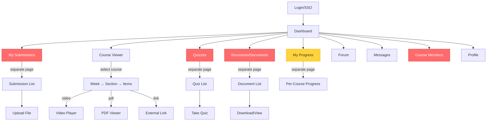
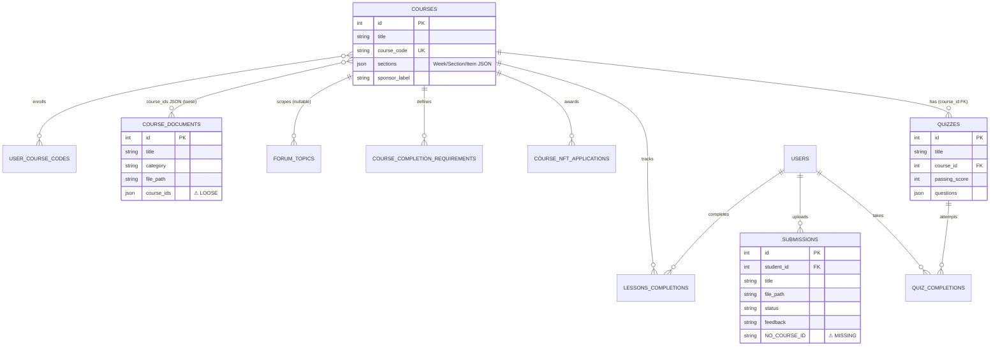
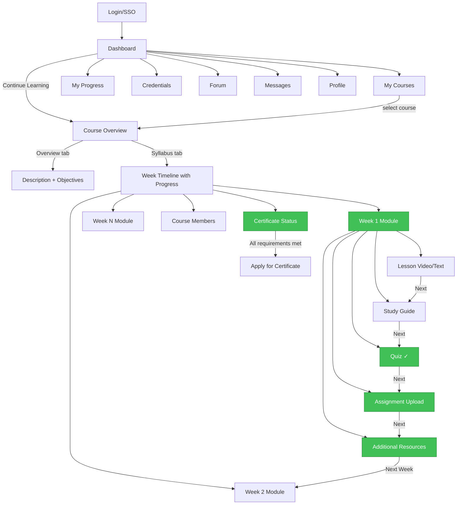
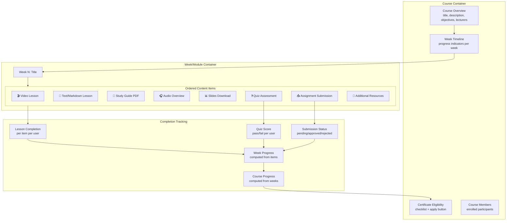
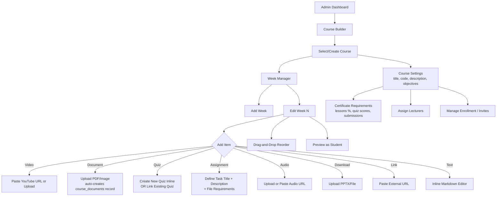

# LMS Course-Centric Information Architecture Redesign

**Date:** 2026-08-03
**Status:** Discovery & Design (Pre-Implementation)
**Author:** Claude Code / SM Web Systems
**Scope:** Product architecture audit, benchmark analysis, target-state design

---

## Table of Contents

1. [Executive Summary](#1-executive-summary)
2. [Current-State LMS Audit](#2-current-state-lms-audit)
3. [Codecademy Benchmark Analysis](#3-codecademy-benchmark-analysis)
4. [Vibe-Coding Content Audit](#4-vibe-coding-content-audit)
5. [Gap Analysis](#5-gap-analysis)
6. [Target-State Design](#6-target-state-design)
7. [Mermaid Diagrams](#7-mermaid-diagrams)
8. [To-Do Lists](#8-to-do-lists)
9. [Developer Spec Outlines](#9-developer-spec-outlines)
10. [Test Plan](#10-test-plan)
11. [Loop Workflow](#11-loop-workflow)
12. [Migration & Rollout](#12-migration--rollout)
13. [Code Review Section](#13-code-review-section)
14. [Final Recommendation](#14-final-recommendation)

---

## 1. Executive Summary

### Problem Statement

The LMS currently exposes **10 top-level student navigation items** (Dashboard, Progress, Submissions, Course, Quizzes, Resources, Forum, Messages, Course Members, Profile). Learning-critical areas — Quizzes, Resources, Submissions — exist as **detached destinations** rather than being integrated into the course learning journey. This fragments the student experience and weakens the course as the primary learning container.

### Core Insight

This is not a UI cleanup problem. It is an **information architecture and learning-flow problem**. The current structure reflects a database-entity-per-page design (one table → one page), not a learning-journey design (one course → one chronological experience).

### Target Outcome

The course becomes the **primary student entry point**. Each module/week contains all associated content items (lessons, videos, study guides, quizzes, resources, submissions) in chronological order. Students navigate through a course like a timeline, not between disconnected pages.

### What Changes vs What Stays

| Area | Current | Target |
|------|---------|--------|
| **Dashboard** | Stays top-level | Stays top-level (enhanced with "Continue Learning") |
| **My Courses** | Single "Course" page | Stays top-level (becomes course catalog/selector) |
| **Course Detail** | Exists as week→section→item viewer | Enhanced: becomes the learning hub with all content |
| **Quizzes** | Separate top-level page | **Moves under course module** |
| **Resources/Documents** | Separate top-level page | **Moves under course module** |
| **Submissions** | Separate top-level page | **Moves under course module** (with cross-course summary kept) |
| **Progress** | Separate top-level page | **Dual: in-course + cross-course summary** |
| **Certificates** | Admin-only page | **Visible inside course journey** (student-facing) |
| **Forum** | Stays top-level | Stays (already supports course-scoped topics) |
| **Messages** | Stays top-level | Stays |
| **Course Members** | Separate top-level page | **Moves under course** (contextual) |
| **Profile** | Stays top-level | Stays |

---

## 2. Current-State LMS Audit

### 2.1 Student Navigation Architecture

**10 sidebar items**, all at the same visual hierarchy level:

```
Student Sidebar
├── Dashboard          → /student                 [hub]
├── My Progress        → /student/progress        [cross-course summary]
├── My Submissions     → /student/submissions     [detached from course]
├── Course             → /student/course          [course viewer]
├── Quizzes            → /student/quizzes         [detached from course]
├── Resources          → /student/documents       [detached from course]
├── Forum              → /student/forum           [general + course-scoped]
├── Messages           → /student/messages        [1-on-1]
├── Course members     → /student/course-members  [detached from course]
└── Profile            → /student/profile         [self-service]
```

**Key issue:** A student enrolled in "Blockchain Vibe Coding" must navigate to 4+ different sidebar items to access all materials for a single week: Course (for the lesson/video), Quizzes (for the weekly quiz), Resources (for the study guide PDF), Submissions (to upload homework). These feel like separate applications rather than parts of one learning journey.

### 2.2 Content Model (What Exists Today)

The current content hierarchy is:

```
Course
├── title, course_code, sponsor_label
├── weeks: CourseWeek[] (JSON in `courses.sections` column)
│   ├── CourseWeek
│   │   ├── title (e.g., "Week 1")
│   │   └── sections: CourseSection[]
│   │       ├── CourseSection
│   │       │   ├── title, objective, outcome
│   │       │   └── items: CourseItem[]
│   │       │       ├── CourseItemVideo (url, title, information)
│   │       │       ├── CourseItemPdf (documentId or fileUrl)
│   │       │       ├── CourseItemLink (url)
│   │       │       └── CourseItemText (url)
```

**What IS course-contained today:**
- Lesson content (videos, PDFs, links, text) via `courses.sections` JSON
- Lesson completion tracking via `lessons_completions` table
- Course progress API (`/courses/:courseId/progress`)
- Certificate applications (`/courses/:courseId/completions/applications`)
- Course completion requirements (`/courses/:courseId/requirements`)
- Forum topics can be course-scoped (`forum_topics.course_id`)
- Course enrollments via `user_course_codes`

**What is DETACHED today:**
- **Quizzes**: Stored in `quizzes` table with `course_id` FK, but accessed via separate `/student/quizzes` page. No way to encounter a quiz while progressing through a week's content.
- **Resources/Documents**: Stored in `course_documents` with `course_ids` JSON array, but browsed via separate `/student/documents` page. No contextual placement within a week.
- **Submissions**: Stored in `submissions` table with no `course_id` or `week_id` FK. Completely orphaned from course structure.
- **Course Members**: Accessed via separate page. No integration within the course context.
- **Progress**: Cross-course summary page only. No in-course progress visualization.
- **Certificate readiness**: Only visible to admins. Students cannot see their eligibility status within the course journey.

### 2.3 Admin Authoring Architecture

**Admin Course Builder (`AdminCourse.tsx`):**
- Create/edit courses with title, code, sponsor_label
- Build weeks → sections → items via JSON editor
- Item types: video (YouTube URL), PDF (upload or link), external link, text
- Quiz creation is a **separate workflow** on `/admin/quizzes` — quizzes are created there, then optionally linked to courses
- Document upload is a **separate workflow** on `/admin/documents` — documents uploaded there, then referenced by documentId in course items
- Submission review is a **separate workflow** on `/admin/submissions`
- Certificate management is a **separate workflow** on `/admin/certificates`

**Pain point:** An admin building a weekly module must:
1. Go to Course page → add week → add section → add video/PDF items
2. Go to Quizzes page → create quiz → associate with course
3. Go to Documents page → upload study guide PDF → get documentId → go back to Course → add PDF item with that documentId
4. Go to Certificates page → review applications (no link back to course context)

### 2.4 Database Schema Relevant to Redesign

| Table | Course Relationship | Issue |
|-------|-------------------|-------|
| `courses` | IS the course | `sections` JSON stores all content structure |
| `quizzes` | Has `course_id` FK | Already linked but UI shows them detached |
| `quiz_completions` | Via `quiz_id` → `course_id` | Data is there, UI doesn't use it |
| `course_documents` | Has `course_ids` JSON array | Loose association, not per-week |
| `submissions` | **No course_id** | Completely orphaned from courses |
| `lessons_completions` | Has `course_id`, `section_id`, `item_id` | Properly course-scoped |
| `course_nft_applications` | Has `course_id` | Properly scoped but admin-only UI |
| `course_completion_requirements` | Has `course_id` | Properly scoped but admin-only config |

### 2.5 Root Cause Analysis (Systematic Debugging)

**Why does the LMS have separated areas?**

1. **Database-entity-driven design**: Each DB table became its own page. `quizzes` table → Quizzes page. `course_documents` table → Documents page. This is a common pattern in admin-panel-first development.

2. **Admin-first architecture**: The system was built for administrators to manage entities (students, quizzes, documents), not for students to experience a learning journey. The student UI mirrors the admin UI structure.

3. **Content model limitation**: The `courses.sections` JSON stores course content as a flat item list per section. There's no slot for "this section's quiz" or "this section's submission task" within the JSON structure. Quizzes live in a separate table with no week/section reference.

4. **Submissions have no course FK**: The `submissions` table was designed as a general file-upload system, not as a course-specific assignment system. It has `student_id` but no `course_id` or `section_id`.

5. **Documents have loose course association**: `course_documents.course_ids` is a JSON array for filtering, not a structural placement (no week/section granularity).

6. **Incremental feature addition**: Features were added one at a time (forum, messages, certificates, sponsor portal) without revisiting the overall IA. Each new feature got its own sidebar item.

**Distinguishing constraint types:**

| Type | Examples | Fixable? |
|------|----------|----------|
| **Actual DB constraint** | `submissions` has no `course_id` | Yes, with migration |
| **JSON schema limitation** | Course sections JSON has no quiz/submission slots | Yes, extend schema |
| **UI organization** | Quizzes on separate page despite having `course_id` | Yes, reroute |
| **Authoring workflow** | Quiz created separately from course builder | Yes, integrate |
| **Route design** | Flat `/student/*` routes instead of `/student/course/:id/week/:w/*` | Yes, restructure |

---

## 3. Codecademy Benchmark Analysis

### 3.1 Codecademy Content Hierarchy

```
Career Path / Skill Path (top-level program)
├── Course (subject-level container)
│   ├── Module (chapter, bundles learn+practice+assess)
│   │   ├── Lesson (interactive: narrative + code editor + checkpoints)
│   │   ├── Quiz (auto-graded multiple-choice)
│   │   ├── Project (guided or freeform)
│   │   ├── Article (text-based informational)
│   │   ├── Video (embedded)
│   │   └── Practice Pack (5 review + 5 practice cards)
```

### 3.2 Key Structural Patterns

**Pattern 1: Module = Learn + Practice + Assess**
Every module contains a lesson, a quiz, and optionally a project. The student encounters them in sequence, not as separate destinations. This creates a consistent rhythm: learn → practice → prove.

**Pattern 2: Two-Tab Course Landing (Overview + Syllabus)**
- **Overview**: metadata (title, level, duration, prerequisites, enrollment count, "What You'll Learn")
- **Syllabus**: expandable module list with per-module progress indicators
- Single "Start/Resume" button

**Pattern 3: Linear Flow with Random Access**
Content flows sequentially (Next/Back buttons), but a sidebar Course Menu allows jumping to any module or content item. This respects both the recommended learning order and student autonomy.

**Pattern 4: Progress at Every Level**
- Course level: overall percentage
- Module level: completed/in-progress/not-started status
- Item level: checkmark per content item

**Pattern 5: Dashboard as Launchpad**
- "Continue Learning" widget (resume most recent)
- My Learning tab (all enrolled courses with progress bars)
- Weekly goals + streak counter

**Pattern 6: Two-Tier Credentials**
- Certificate of Completion (finish all content in course/path)
- Professional Certification (pass exams — separate from content completion)

### 3.3 Transferable Patterns for Our LMS

| Codecademy Pattern | LMS Adaptation | Priority |
|---|---|---|
| Module = Learn + Quiz + Project | Week/Module = Lesson items + Quiz + Submission task + Resources | **Critical** |
| Syllabus view with progress | Course detail page with week timeline and per-week progress | **Critical** |
| Linear Next/Back flow | Navigate between weeks and within a week's items | **High** |
| Course Menu sidebar | In-course sidebar showing all weeks with completion status | **High** |
| Continue Learning widget | Dashboard "Resume" card pointing to last active course/week | **High** |
| Overview + Syllabus tabs | Course landing page with description + week outline | **Medium** |
| Progress at every level | Course %, week completion, item checkmarks | **High** |
| Certificate visibility | Show cert readiness inside course journey, not just admin page | **Medium** |

### 3.4 Risks of Over-Copying

1. **Interactive code editor**: Codecademy's core value is the in-browser coding environment. Our LMS is video/document/quiz-based, not code-execution-based. Don't try to build a code editor.
2. **Practice Packs / Code Challenges**: These are Codecademy-specific content types. Our equivalent is flashcards and study guides from the vibe-coding model.
3. **Paths (multi-course programs)**: Our LMS currently has individual courses, not multi-course paths. Adding a Path layer is premature — focus on making individual courses excellent first.
4. **Gamification (XP, streaks)**: Nice-to-have but not core to the IA fix. Defer.

---

## 4. Vibe-Coding Content Audit

### 4.1 Content Artifact Types

The vibe-coding blockchain academy produces **9 artifact types per module**:

| Artifact | Format | Size | LMS Content Type Mapping |
|----------|--------|------|--------------------------|
| `lesson.md` | Markdown | 8-12 KB | CourseItemText (lesson content) |
| `study-guide.md` | Markdown | 8-10 KB | CourseItemPdf or CourseItemText |
| `quiz.md` / `quiz.json` | MD or JSON | 3-13 KB | Quiz (in `quizzes` table) |
| `flashcards.md` / `.json` | MD or JSON | 5-12 KB | **New type needed** |
| `mind-map.json` | JSON | ~2 KB | **New type needed** or CourseItemLink |
| `audio-overview.mp3` | MP3 | ~40 MB | CourseItemVideo (audio variant) |
| `explainer-video.mp4` | MP4 | ~35 MB | CourseItemVideo |
| `infographic.png` | PNG | ~5 MB | CourseItemPdf (image) |
| `slides.pptx` | PPTX | ~20 MB | CourseItemPdf (download) |

### 4.2 Content Grouping Model

Vibe-coding organizes content per module as a **flat directory** with all artifacts:

```
module-1-intro/
└── content/
    ├── lesson.md           ← main instructional content
    ├── study-guide.md      ← reference/review material
    ├── quiz.md             ← assessment
    ├── flashcards.md       ← spaced repetition cards
    ├── mind-map.json       ← visual concept map
    ├── audio-overview.mp3  ← narrated summary
    ├── explainer-video.mp4 ← educational video
    ├── infographic.png     ← visual summary
    └── slides.pptx         ← presentation deck
```

The web UI presents these as **10 tabs** within a single module viewer:
Lesson | Video | Audio | Infographic | Study Guide | Quiz | Flashcards | Mind Map | Slides | Notes

### 4.3 Content Authoring Pipeline

1. Author writes `source-content.md` (comprehensive lesson material)
2. Upload to NotebookLM (Google's AI tool)
3. NotebookLM generates: study guide, quiz, flashcards, mind map, audio, video, infographic, slides
4. Download artifacts to `content/` directory
5. Register in `course-artifacts.json` manifest

**Key insight:** The vibe-coding model generates ~9 artifacts from one source document. The LMS course builder needs to support attaching all these artifact types to a single week/module, not just videos and PDFs.

### 4.4 Implications for LMS Authoring

1. **The LMS course item types are too limited**: Currently supports video, PDF, link, text. Needs to also support: quiz (inline), audio, flashcards, downloadable files (PPTX), and possibly interactive elements (mind maps).

2. **One week = many content types**: A vibe-coding module produces ~9 artifacts. The LMS needs a week/module container that holds all of these in a logical order, not spread across separate pages.

3. **Quiz should be a course item type**: In the vibe-coding model, the quiz lives in the same directory as the lesson. In the LMS, it should be a content item within the week, not a separate page.

4. **Study guides and slides need first-class support**: These are standard learning artifacts that should be directly attachable to a week, not uploaded to a generic "Documents" page and then cross-referenced by ID.

---

## 5. Gap Analysis

### 5.1 Structure Comparison

| Dimension | Current LMS | Codecademy | Vibe-Coding | Gap |
|-----------|-------------|------------|-------------|-----|
| **Top-level** | Dashboard + 9 flat items | Dashboard + My Learning + Catalog | Landing + Module grid | LMS too flat |
| **Course entry** | Select course → see weeks | Course landing → Overview/Syllabus | Click module card | LMS ok, needs enhancement |
| **Module structure** | Week → Section → Items (video/PDF/link/text only) | Module → Lesson + Quiz + Project | Module → 9-tab viewer | LMS items too limited |
| **Quiz access** | Separate page (`/student/quizzes`) | Inline within module flow | Tab within module | **Critical gap** |
| **Resource access** | Separate page (`/student/documents`) | Inline (articles, practice packs) | Tab within module | **Critical gap** |
| **Submission** | Separate page, no course FK | Inline project within module | N/A (challenges) | **Critical gap** |
| **Progress** | Separate page only | In-course + dashboard | Per-module + per-tab | **Gap** (need dual) |
| **Certificate visibility** | Admin-only | Profile page + course completion | N/A | **Gap** (need student-facing) |
| **Next/Previous flow** | None (manual navigation) | Next/Back buttons through content | Tab switching within module | **Gap** |
| **Course members** | Separate page | N/A | N/A | Move under course |
| **Authoring** | Separate pages for quiz/doc/course | N/A (internal CMS) | File-based + NotebookLM | **Workflow gap** |

### 5.2 Critical Gaps (Must Fix)

1. **Quizzes detached from course flow**: Quiz data has `course_id` but UI treats them as separate. Students can't encounter the quiz while progressing through a week.
2. **Resources detached from course flow**: Documents have `course_ids` association but no week/section placement.
3. **Submissions orphaned**: No `course_id` FK at all. Cannot be contextualized within a course.
4. **No sequential navigation**: No Next/Back buttons within or between modules. Students must use sidebar navigation.
5. **No in-course progress**: Progress only visible on a separate page.

### 5.3 Structural Gaps (Should Fix)

6. **Limited course item types**: Only video, PDF, link, text. Missing: audio, quiz-as-item, submission-task, flashcards, downloadable files.
7. **Certificate readiness invisible to students**: Students can't see their eligibility status while in the course.
8. **Course members contextless**: Separate page with no course context.
9. **Authoring workflow fragmented**: Admin must visit 4+ pages to build one week's content.

### 5.4 Nice-to-Have Gaps (Defer)

10. **No multi-course paths/programs**: Codecademy has Paths. Not needed yet.
11. **No gamification**: XP, streaks, badges. Defer.
12. **No flashcard or mind-map rendering**: Vibe-coding has these. Defer until content types are confirmed.

---

## 6. Target-State Design

### 6.1 Proposed Information Architecture

**Student sidebar (reduced from 10 to 7 items):**

```
Student Sidebar (NEW)
├── Dashboard           → /student                          [home base]
├── My Courses          → /student/courses                  [course catalog/selector]
├── My Progress         → /student/progress                 [cross-course summary]
├── Forum               → /student/forum                    [general + course-scoped]
├── Messages            → /student/messages                 [1-on-1]
├── Credentials         → /student/credentials              [earned certificates/NFTs]
└── Profile             → /student/profile                  [self-service]
```

**Within a course (new nested navigation):**

```
Course: Blockchain Vibe Coding (/student/courses/:courseId)
├── Overview            → course description, objectives, lecturer, progress summary
├── Week 1: Introduction to Blockchain
│   ├── Lesson: What is Blockchain? (video)
│   ├── Study Guide (PDF)
│   ├── Slides (downloadable PPTX)
│   ├── Quiz: Week 1 Assessment
│   ├── Assignment: Submit your reflection
│   └── Resources: Additional reading links
├── Week 2: Technical Foundations
│   ├── Lesson: How Does It Work? (video)
│   ├── ...
├── ...
├── Members             → course participants
└── Certificate         → eligibility status + apply button
```

**What moved under course:**
- Quizzes → now a content item type within each week
- Resources → now attached to specific weeks
- Submissions → now "Assignment" item type within weeks
- Course Members → now a tab/section within the course
- Certificate readiness → now visible inside the course

**What stays top-level:**
- Dashboard (enhanced with "Continue Learning")
- My Progress (cross-course summary, links into per-course progress)
- Forum (general + course-scoped — already works this way)
- Messages (not course-specific)
- Credentials (earned certificates — cross-course)
- Profile

### 6.2 Course/Module/Content Hierarchy

```
Course
├── metadata: title, code, description, objectives, prerequisites, sponsor_label
├── lecturers: CourseUser[]
├── weeks: CourseWeek[]
│   ├── CourseWeek
│   │   ├── id, title, description, order
│   │   ├── items: CourseItem[] (ordered)
│   │   │   ├── CourseItemVideo     (type: "video", url, title, info)
│   │   │   ├── CourseItemPdf       (type: "pdf", documentId or fileUrl)
│   │   │   ├── CourseItemLink      (type: "link", url, title)
│   │   │   ├── CourseItemText      (type: "text", url or content)
│   │   │   ├── CourseItemAudio     (type: "audio", url, title)       ← NEW
│   │   │   ├── CourseItemQuiz      (type: "quiz", quizId)            ← NEW
│   │   │   ├── CourseItemAssignment(type: "assignment", title, desc) ← NEW
│   │   │   └── CourseItemDownload  (type: "download", fileUrl, title)← NEW
│   │   └── status: locked | available | completed (computed)
├── members: via user_course_codes
├── requirements: via course_completion_requirements
└── certificate: computed eligibility
```

**New item types added:**
- `audio`: For MP3/audio supplements (maps to vibe-coding audio-overview)
- `quiz`: References a quiz from the `quizzes` table, rendered inline within the week
- `assignment`: Defines a submission task — when student submits, creates a `submissions` record linked to course + week
- `download`: For downloadable files like PPTX slides (not rendered inline, just downloaded)

### 6.3 Student Flow

**Entry flow:**
1. Student logs in → Dashboard
2. Dashboard shows "Continue Learning" card (last active course + week)
3. Student clicks → enters course at last position
4. Course page shows week timeline with progress indicators
5. Student clicks current week → sees all items in order
6. Student progresses: lesson → study guide → quiz → assignment → next week
7. At any point, sidebar shows course outline with completion checkmarks
8. After completing all requirements, "Apply for Certificate" button appears

**In-course navigation:**
- **Week sidebar**: Left panel lists all weeks with completion status
- **Item viewer**: Right panel shows the current content item
- **Next/Previous**: Buttons at bottom of each item to move forward/backward
- **Progress bar**: Top of course page shows overall completion %
- **Certificate indicator**: Shows eligibility checklist (lessons %, quizzes passed, submissions approved)

### 6.4 Admin Authoring Flow

**Current (fragmented):**
```
Admin Course Page → create week → add video/PDF items
Admin Quizzes Page → create quiz → set course_id
Admin Documents Page → upload PDF → get documentId → go back to Course → reference it
Admin Submissions Page → review submissions (no course context)
Admin Certificates Page → review applications
```

**Target (integrated):**
```
Admin Course Page → select course → click week
  → Add Item dropdown:
    ├── Video (paste YouTube URL or upload)
    ├── Document (upload PDF/image inline, auto-creates course_documents record)
    ├── Link (paste URL)
    ├── Text/Markdown (inline editor)
    ├── Audio (upload or paste URL)
    ├── Quiz (create new quiz inline OR link existing quiz)
    ├── Assignment (define task title + description + file requirements)
    └── Download (upload PPTX/file for download)
  → Reorder items via drag-and-drop
  → Preview week as student would see it

Admin Certificates Page → still top-level (cross-course workflow)
Admin Submissions Page → accessible from course context OR top-level
```

### 6.5 Route Structure

**Student routes (new):**

```
/student                                    → Dashboard
/student/courses                            → My Courses (list all enrolled)
/student/courses/:courseId                  → Course Overview (syllabus + progress)
/student/courses/:courseId/weeks/:weekId    → Week Content Viewer
/student/courses/:courseId/members          → Course Members
/student/courses/:courseId/certificate      → Certificate Eligibility
/student/progress                           → Cross-course Progress Summary
/student/credentials                        → Earned Certificates/NFTs
/student/forum                              → Forum
/student/messages                           → Messages
/student/profile                            → Profile
```

**Backward compatibility:**
```
/student/course          → redirect to /student/courses
/student/quizzes         → redirect to /student/courses (with toast: "Quizzes are now inside each course")
/student/documents       → redirect to /student/courses (with toast: "Resources are now inside each course")
/student/submissions     → redirect to /student/courses (with toast: "Assignments are now inside each course")
/student/course-members  → redirect to /student/courses
```

**Admin routes (enhanced):**

```
/admin/course            → Course Builder (enhanced with inline quiz/doc/assignment)
/admin/quizzes           → KEEP (useful for cross-course quiz management)
/admin/documents         → KEEP (useful for document library management)
/admin/submissions       → KEEP (useful for cross-course submission review)
/admin/certificates      → KEEP (cross-course workflow)
```

Admin pages stay because admins need cross-course management views. But the Course Builder gets enhanced so admins can do most work without leaving it.

### 6.6 Dashboard Simplification

**Current Dashboard (`StudentDashboard.tsx`):**
- Course cards (enrollment)
- Submission summary
- Quiz scores
- Certificate status
- NFT badges
- Wallet status
- Announcements

**Target Dashboard:**
- **Continue Learning** card (most recent course + current week, with "Resume" button)
- **My Courses** grid (cards showing: course title, progress %, current week)
- **Announcements** (general + course-scoped)
- **Recent Activity** (last quiz score, last submission, etc.)
- NFT badges / credentials summary
- Wallet status (if relevant)

---

## 7. Mermaid Diagrams

### 7.1 Current LMS Student Navigation Map



*Red = detached from course context. Yellow = partially detached.*

### 7.2 Current Content Model Map



### 7.3 Codecademy-Inspired Target Learning Flow



*Green = now inside the course context.*

### 7.4 Proposed Course/Module/Content Hierarchy



### 7.5 Proposed Admin Content-Authoring Flow



### 7.6 Proposed Migration Flow

```mermaid
graph LR
    subgraph "Phase 1: Schema"
        A1[Add course_id + week_id to submissions] --> A2[Add week_id + order to quiz→course link]
        A2 --> A3[Extend CourseItem types in JSON schema]
        A3 --> A4[Add backward-compat getCourseWeeks normalizer]
    end

    subgraph "Phase 2: Backend"
        B1[New nested routes /courses/:id/weeks/:w/*] --> B2[Quiz-in-course API endpoint]
        B2 --> B3[Assignment-in-course API endpoint]
        B3 --> B4[In-course progress API]
        B4 --> B5[Certificate eligibility student API]
    end

    subgraph "Phase 3: Frontend"
        C1[New CourseDetail page with week timeline] --> C2[WeekViewer component with all item types]
        C2 --> C3[Inline QuizViewer component]
        C3 --> C4[Inline AssignmentUploader component]
        C4 --> C5[In-course progress sidebar]
        C5 --> C6[Certificate eligibility card]
    end

    subgraph "Phase 4: Admin"
        D1[Enhanced Course Builder with inline item creation] --> D2[Quiz-in-course-builder]
        D2 --> D3[Assignment-in-course-builder]
    end

    subgraph "Phase 5: Navigation"
        E1[Update sidebar: remove Quizzes/Resources/Submissions/CourseMembers] --> E2[Add redirect routes with toast messages]
        E2 --> E3[Update Dashboard with Continue Learning]
    end

    subgraph "Phase 6: Cleanup"
        F1[Remove old detached pages] --> F2[Update docs + QA checklists]
        F2 --> F3[Update mobile app routes]
    end

    A4 --> B1
    B5 --> C1
    C6 --> D1
    D3 --> E1
    E3 --> F1
```



---

## 8. To-Do Lists

### 8.1 Research To-Do

- [x] Audit current LMS student navigation (10 sidebar items identified)
- [x] Audit current LMS admin navigation (12 sidebar items identified)
- [x] Map current DB schema relevant to content delivery
- [x] Identify what is course-contained vs detached
- [x] Root-cause why areas became separated
- [x] Research Codecademy hierarchy (Path > Course > Module > Item)
- [x] Identify transferable Codecademy patterns (7 patterns identified)
- [x] Audit vibe-coding content types (9 artifact types per module)
- [x] Audit vibe-coding authoring pipeline (NotebookLM-based)
- [x] Map vibe-coding content to LMS item types

### 8.2 Product Design To-Do

- [x] Define target sidebar structure (reduced from 10 to 7 items)
- [x] Define course/module/content hierarchy
- [x] Define new content item types (audio, quiz, assignment, download)
- [x] Define student learning flow (entry → week → items → next week)
- [x] Define in-course navigation (Next/Back, week sidebar, progress bar)
- [x] Define admin authoring flow (integrated course builder)
- [x] Define dashboard enhancement (Continue Learning widget)
- [x] Define backward-compatible route redirects
- [ ] Create wireframes/mockups for key screens (future session)
- [ ] User-test the proposed IA with a student walkthrough (future session)

### 8.3 Technical Audit To-Do

- [x] Identify DB schema changes needed (submissions needs course_id)
- [x] Identify JSON schema extensions needed (new item types)
- [x] Identify API route additions needed (nested course routes)
- [x] Identify frontend route restructuring needed
- [x] Identify backward-compatibility requirements (old route redirects)
- [ ] Estimate migration complexity for existing data
- [ ] Identify mobile app impact (Expo routes need updating)
- [ ] Review test suite for affected areas (492 backend + 23 frontend tests)

### 8.4 Migration Planning To-Do

- [ ] Write migration script for `submissions` table (add `course_id`, `week_id`)
- [ ] Write migration for quiz→week association data
- [ ] Write migration for document→week association data
- [ ] Plan data backfill strategy for existing submissions
- [ ] Define rollback plan for each migration phase
- [ ] Plan feature flag strategy for gradual rollout

### 8.5 Testing To-Do

- [ ] Define acceptance tests for student course journey
- [ ] Define acceptance tests for admin course builder
- [ ] Define regression tests for existing quiz functionality
- [ ] Define regression tests for existing submission functionality
- [ ] Define regression tests for existing document functionality
- [ ] Define regression tests for certificate/NFT pipeline
- [ ] Define manual QA scenarios for new navigation
- [ ] Update MANUAL_QA_STUDENT.md for new flow
- [ ] Update MANUAL_QA_ADMIN.md for enhanced course builder

### 8.6 Rollout To-Do

- [ ] Implement Phase 1 (schema changes) in worktree
- [ ] Implement Phase 2 (backend APIs) in worktree
- [ ] Implement Phase 3 (frontend components) in worktree
- [ ] Implement Phase 4 (admin enhancements) in worktree
- [ ] Implement Phase 5 (navigation changes) in worktree
- [ ] Run full regression suite
- [ ] Manual QA walkthrough
- [ ] Deploy to testnet/staging first
- [ ] Deploy to production
- [ ] Monitor for regressions post-deploy
- [ ] Update mobile app

---

## 9. Developer Spec Outlines

### 9.1 LMS Course-Centric IA Spec

**Purpose:** Define the overall information architecture change.

**Sections to write:**
1. Current vs target navigation structure (with sidebar item lists)
2. Route mapping table (old route → new route → redirect strategy)
3. Component hierarchy diagram
4. State management changes (course context propagation)
5. URL structure conventions
6. Mobile app route parity plan

### 9.2 Student Course Journey Spec

**Purpose:** Define the student experience within a course.

**Sections to write:**
1. Course landing page layout (Overview + Syllabus tabs)
2. Week/module viewer layout (sidebar + content area)
3. Content item type renderers (video, PDF, quiz, assignment, audio, download, link, text)
4. Sequential navigation (Next/Back behavior, cross-week transitions)
5. Progress indicators (per-item checkmarks, per-week status, course-level %)
6. Certificate eligibility card (checklist + apply button)
7. Course members panel
8. "Continue Learning" resume logic
9. Deep-link support (share link to specific week/item)

### 9.3 Admin Weekly Content Authoring Spec

**Purpose:** Define the enhanced admin course builder.

**Sections to write:**
1. Week management CRUD (add/edit/delete/reorder weeks)
2. Item management within a week (add/edit/delete/reorder items)
3. Inline quiz creation vs linking existing quiz
4. Inline document upload (auto-creates `course_documents` record + course item reference)
5. Assignment definition (task description + file requirements + grading criteria)
6. Preview mode (render week as student would see it)
7. Bulk content import (from vibe-coding-style artifact directory)

### 9.4 Course Module Content Schema Spec

**Purpose:** Define the DB and JSON schema changes.

**Sections to write:**
1. Extended `CourseItem` union type (add audio, quiz, assignment, download)
2. `CourseItemQuiz` type: `{ type: "quiz", quizId: number, title: string }`
3. `CourseItemAssignment` type: `{ type: "assignment", title: string, description: string, maxFileSize?: number, allowedTypes?: string[] }`
4. `CourseItemAudio` type: `{ type: "audio", url: string, title: string }`
5. `CourseItemDownload` type: `{ type: "download", fileUrl: string, title: string, fileName: string }`
6. `submissions` table migration: add `course_id INT REFERENCES courses(id)`, `week_id TEXT`, `item_id TEXT`
7. `course_documents` enrichment: add `week_id TEXT` for per-week association
8. Backward compatibility: `getCourseWeeks()` normalizer handles old courses without new item types
9. Validation rules for each item type

### 9.5 Progress + Certificate Integration Spec

**Purpose:** Define how progress and certificate eligibility work inside the course.

**Sections to write:**
1. Per-item completion states (viewed, completed, passed, submitted, approved)
2. Per-week completion calculation (all items completed = week done)
3. Course completion calculation (all weeks completed = course done)
4. Certificate eligibility rules (from `course_completion_requirements`):
   - Lesson completion threshold
   - Required quizzes passed
   - Required submissions approved
5. Student-facing eligibility checklist component
6. "Apply for Certificate" button logic (disabled until eligible)
7. In-course progress API endpoints
8. Dashboard progress summary API

### 9.6 Migration and Backward Compatibility Spec

**Purpose:** Define how to migrate from current to target state without breaking anything.

**Sections to write:**
1. Schema migration scripts (SQLite ALTER TABLE with foreign_keys OFF + legacy_alter_table ON)
2. Data backfill strategy for existing submissions (admin-assigned course_id)
3. Route redirect map (old student routes → new routes with toast messages)
4. API backward compatibility (old endpoints still work, return same data)
5. Feature flag strategy: `COURSE_CENTRIC_UI=true/false`
6. Rollback plan for each phase
7. Mobile app compatibility window
8. QA checklist updates required

---

## 10. Test Plan

### 10.1 TDD-Style Acceptance Behaviors

**Student Course Journey:**

```
GIVEN a student enrolled in "Blockchain Vibe Coding"
WHEN they navigate to /student/courses/:courseId
THEN they see the course overview with title, description, objectives
AND they see a week timeline showing all weeks with completion status
AND they see their overall course progress percentage

GIVEN a student viewing the week timeline
WHEN they click on "Week 1: Introduction to Blockchain"
THEN they see all content items for that week in order:
  - Lesson Video
  - Study Guide PDF
  - Quiz: Week 1 Assessment
  - Assignment: Submit Reflection
  - Additional Resources
AND each item shows a completion indicator (checkmark or empty)

GIVEN a student viewing a lesson video in Week 1
WHEN they click "Next"
THEN they are taken to the Study Guide PDF (next item in order)
AND the lesson video is marked as completed

GIVEN a student who has completed all items in Week 1
WHEN they click "Next" on the last item
THEN they are taken to the first item of Week 2
AND Week 1 shows as "Completed" in the week sidebar

GIVEN a student viewing their course progress
WHEN all lessons are completed AND all required quizzes passed AND required submissions approved
THEN the Certificate Eligibility card shows "Eligible"
AND the "Apply for Certificate" button is enabled

GIVEN a student navigating to the old /student/quizzes URL
WHEN the page loads
THEN they are redirected to /student/courses
AND a toast message says "Quizzes are now inside each course"
```

**Admin Course Builder:**

```
GIVEN an admin editing a course week
WHEN they click "Add Item" → "Quiz"
THEN they can either:
  a) Create a new quiz inline (title, questions, passing score)
  b) Link an existing quiz from the quiz library
AND the quiz appears as an item in the week's content list

GIVEN an admin editing a course week
WHEN they click "Add Item" → "Assignment"
THEN they define: task title, description, file requirements
AND the assignment appears as an item in the week's content list

GIVEN an admin editing a course week
WHEN they click "Add Item" → "Document"
THEN they can upload a PDF/image directly
AND a course_documents record is auto-created
AND the document appears as an item in the week's content list

GIVEN an admin reordering items in a week
WHEN they drag an item to a new position
THEN the item order is updated in the course JSON
AND the student sees items in the new order
```

**Quiz In-Course:**

```
GIVEN a student viewing a quiz item in Week 1
WHEN they click on the quiz
THEN the quiz renders inline (same page, not a navigation away)
AND they see all questions with answer options
AND they can submit answers
AND they see their score immediately
AND the quiz item is marked with their score (e.g., "85% ✓")

GIVEN a quiz that the student has already completed
WHEN they view the quiz item
THEN they see their previous score
AND they can retake the quiz (if allowed by course settings)
```

**Assignment In-Course:**

```
GIVEN a student viewing an assignment item in Week 2
WHEN they click on the assignment
THEN they see the assignment description and file requirements
AND they see an upload button
AND they can upload a file
AND the submission is created with course_id and week_id populated

GIVEN a student who has submitted an assignment
WHEN they view the assignment item
THEN they see the submission status (pending/approved/rejected)
AND they see any feedback from the admin
```

### 10.2 Manual QA Scenarios

**Student Navigation (15 scenarios):**

1. Login → Dashboard → verify "Continue Learning" card appears
2. Click "Continue Learning" → verify it opens the correct course and week
3. Navigate to My Courses → verify all enrolled courses shown with progress %
4. Click a course → verify Overview tab (title, description, objectives, lecturers)
5. Click Syllabus tab → verify all weeks listed with completion indicators
6. Click a week → verify all items shown in correct order
7. Complete a lesson item → verify checkmark appears
8. Click Next → verify navigation to next item
9. Complete all items in a week → verify week marked as completed
10. Navigate to next week → verify it's accessible
11. View quiz in-context → verify inline rendering and scoring
12. Submit assignment in-context → verify file upload and status tracking
13. Check certificate eligibility → verify checklist accuracy
14. Visit old /student/quizzes URL → verify redirect + toast
15. Visit old /student/documents URL → verify redirect + toast

**Admin Course Builder (10 scenarios):**

16. Create new course → add 3 weeks with content
17. Add video item to week → verify YouTube embed
18. Add quiz item to week (create new inline) → verify quiz appears
19. Add quiz item to week (link existing) → verify quiz appears
20. Add assignment item to week → verify task definition saved
21. Upload document to week → verify auto-created course_documents record
22. Reorder items within a week → verify new order persists
23. Preview week as student → verify rendering matches student view
24. Edit existing course → verify all items load correctly
25. Delete a week → verify items removed gracefully

**Regression Checks (10 scenarios):**

26. Old quiz page → quizzes still accessible in-course
27. Old submissions page → submissions still accessible in-course
28. Old documents page → documents still accessible in-course
29. Quiz completion → quiz_completions table updated correctly
30. Submission upload → submissions table has course_id populated
31. Lesson completion → lessons_completions table updated correctly
32. Certificate application → still works via in-course flow
33. NFT minting → still works end-to-end
34. Progress API → returns correct data for new structure
35. Mobile app → graceful degradation or redirect

### 10.3 Route-Level Regression Checks

| Old Route | Expected Behavior | Test |
|-----------|-------------------|------|
| `GET /student/course` | Redirect to `/student/courses` | HTTP 302 |
| `GET /student/quizzes` | Redirect to `/student/courses` + toast | HTTP 302 |
| `GET /student/documents` | Redirect to `/student/courses` + toast | HTTP 302 |
| `GET /student/submissions` | Redirect to `/student/courses` + toast | HTTP 302 |
| `GET /student/course-members` | Redirect to `/student/courses` + toast | HTTP 302 |
| `GET /api/v1/quizzes` | Still works (admin/cross-course) | HTTP 200 |
| `GET /api/v1/documents` | Still works (admin/cross-course) | HTTP 200 |
| `GET /api/v1/submissions` | Still works (admin/cross-course) | HTTP 200 |
| `GET /api/v1/courses/:id` | Returns enhanced data with week items | HTTP 200 |
| `POST /api/v1/quizzes/:id/submit` | Still works (quiz submission) | HTTP 200 |

### 10.4 Data Migration Validation

| Check | Query | Expected |
|-------|-------|----------|
| All submissions have course_id | `SELECT COUNT(*) FROM submissions WHERE course_id IS NULL` | 0 (after backfill) |
| All quizzes have course_id | `SELECT COUNT(*) FROM quizzes WHERE course_id IS NULL` | 0 (already true) |
| Course JSON has new item types | `SELECT id FROM courses WHERE sections LIKE '%"quiz"%'` | Courses with quizzes |
| Old progress data intact | `SELECT COUNT(*) FROM lessons_completions` | Same count as before |
| Old quiz scores intact | `SELECT COUNT(*) FROM quiz_completions` | Same count as before |

---

## 11. Loop Workflow

### Reusable /loop Commands

These commands define a repeatable workflow for future sessions continuing this redesign:

#### `/loop assess`
**Purpose:** Re-audit the current state of the LMS against the target design.
```
1. Read this spec: docs/superpowers/specs/2026-08-03-course-centric-ia-redesign.md
2. Check current student sidebar items in LMS-Frontend/src/components/Layout.tsx
3. Check current route structure in LMS-Frontend/src/App.tsx
4. Check current course content model in LMS-Frontend/src/types/course.ts
5. Check DB schema in LMS-Server/database/schema.sql
6. Identify which target-state items are done vs remaining
7. Update the to-do lists in this spec
```

#### `/loop benchmark`
**Purpose:** Refresh the Codecademy benchmark with any new patterns discovered.
```
1. Read Section 3 of this spec (Codecademy Benchmark)
2. Web search for recent Codecademy product updates
3. Check if any new patterns are relevant
4. Update Section 3 if needed
5. Re-check gap analysis (Section 5)
```

#### `/loop spec`
**Purpose:** Write or refine a specific developer spec document.
```
1. Read Section 9 of this spec (Developer Spec Outlines)
2. Ask which spec to write next (9.1-9.6)
3. Create the spec in docs/superpowers/specs/
4. Get user review
5. Update the to-do list
```

#### `/loop validate`
**Purpose:** Validate that implemented changes match the target design.
```
1. Read this spec's target-state design (Section 6)
2. Read the acceptance behaviors (Section 10.1)
3. Run the test suite: cd LMS-Server && npx vitest run
4. Run the frontend tests: cd LMS-Frontend && npx vitest run
5. Manually verify key navigation flows against Section 10.2
6. Report findings
```

#### `/loop implement`
**Purpose:** Implement one phase of the migration plan.
```
1. Read this spec's migration flow (Section 7.6 Mermaid + Section 12)
2. Identify the current phase (1-6)
3. Create a git worktree for the phase
4. Write tests first (TDD from Section 10.1)
5. Implement the changes
6. Run tests
7. Request code review
8. Merge when approved
```

#### `/loop verify`
**Purpose:** Run the full verification checklist before declaring a phase complete.
```
1. Run backend tests: cd LMS-Server && npx vitest run (expect 492+ pass)
2. Run frontend tests: cd LMS-Frontend && npx vitest run (expect 23+ pass)
3. Check route redirects work (Section 10.3)
4. Check data migration integrity (Section 10.4)
5. Walk through manual QA scenarios (Section 10.2)
6. Verify no regressions in certificate/NFT pipeline
7. Update MEMORY.md with current test counts
```

#### `/loop close`
**Purpose:** Close out a phase and prepare for the next.
```
1. Run /loop verify
2. Tag the release: git tag phase-N-course-centric-YYYY-MM-DD
3. Update this spec's to-do lists
4. Write a phase summary
5. Identify blockers for next phase
6. Update MEMORY.md
```

---

## 12. Migration & Rollout

### 12.1 Phased Implementation Plan

**Phase 1: Schema Extensions (Low Risk)**
- Add `course_id INT REFERENCES courses(id)` to `submissions` table
- Add `week_id TEXT` to `submissions` table
- Add `item_id TEXT` to `submissions` table
- Extend `CourseItem` TypeScript union with new types (audio, quiz, assignment, download)
- Update `getCourseWeeks()` normalizer for backward compatibility
- **No UI changes. No breaking changes. Purely additive.**

**Phase 2: Backend API Additions (Low Risk)**
- Add `GET /courses/:courseId/weeks/:weekId/items` endpoint
- Add `POST /courses/:courseId/weeks/:weekId/items/:itemId/quiz/submit` endpoint
- Add `POST /courses/:courseId/weeks/:weekId/items/:itemId/assignment/submit` endpoint
- Add `GET /courses/:courseId/certificate-eligibility` (student-facing)
- Enhance `GET /courses/:courseId` to include quiz data and assignment status per week
- **Old endpoints still work unchanged.**

**Phase 3: Frontend - Course Detail Page (Medium Risk)**
- Build new `CourseDetail.tsx` (replaces `StudentCourse.tsx`)
- Build `WeekTimeline.tsx` component
- Build `WeekViewer.tsx` component with all item type renderers
- Build `InlineQuizViewer.tsx` component
- Build `InlineAssignmentUploader.tsx` component
- Build `CertificateEligibilityCard.tsx` component
- Build `CourseProgressSidebar.tsx` component
- Add Next/Previous navigation buttons
- **Old pages still accessible during this phase.**

**Phase 4: Admin Course Builder Enhancement (Medium Risk)**
- Add inline quiz creation in course builder
- Add assignment definition in course builder
- Add inline document upload in course builder
- Add audio and download item types
- Add item reorder via drag-and-drop
- Add preview mode
- **Old admin quiz/doc pages still work.**

**Phase 5: Navigation Transition (High Risk — Visible Change)**
- Update student sidebar: remove Quizzes, Resources, Submissions, Course Members
- Add "My Courses" and "Credentials" sidebar items
- Set up route redirects with toast messages
- Update Dashboard with "Continue Learning" widget
- **This is the breaking UX change. Deploy only after Phases 1-4 are verified.**

**Phase 6: Cleanup & Polish**
- Remove old detached page components (or keep as redirects)
- Update all documentation (ARCHITECTURE.md, FEATURE_INVENTORY.md, QA checklists)
- Update mobile app routes
- Performance optimization (lazy loading week content)
- Final QA pass

### 12.2 Proposed Worktree Structure

```
.claude/worktrees/
├── audit/lms-course-ia               → This audit (current session, read-only)
├── spec/course-centric-learning-flow → Developer specs (Phase 0)
├── feat/schema-extensions             → Phase 1: DB + type changes
├── feat/course-api-enhancements       → Phase 2: New API endpoints
├── feat/student-course-journey        → Phase 3: New frontend pages
├── feat/admin-course-authoring-v2     → Phase 4: Enhanced course builder
├── feat/navigation-restructure        → Phase 5: Sidebar + routing changes
└── feat/progress-certificate-in-course → Phase 3/5 subset: progress + cert UI
```

### 12.3 Risk Mitigation

| Risk | Mitigation |
|------|-----------|
| Breaking existing quiz functionality | Old `/api/v1/quizzes` endpoints unchanged; inline quiz uses same underlying table |
| Breaking existing submissions | Old `/api/v1/submissions` endpoints unchanged; new `course_id` column is nullable during migration |
| Student confusion from navigation change | Route redirects with explanatory toast messages |
| Data loss during migration | All migrations are additive (adding columns, not removing); rollback = drop new columns |
| Mobile app breaks | Mobile routes updated in Phase 6; feature flag can disable new routes |
| Admin workflow disruption | Old admin pages kept; enhanced builder is additive |

### 12.4 Rollback Plan

Each phase can be rolled back independently:
- **Phase 1**: Drop new columns (no data in them yet)
- **Phase 2**: Remove new routes from `app.ts` (old routes untouched)
- **Phase 3**: Revert to old `StudentCourse.tsx` (new components are separate files)
- **Phase 4**: Revert admin course builder (old version in git)
- **Phase 5**: Restore old sidebar items + remove redirects
- **Phase 6**: No rollback needed (cleanup only)

---

## 13. Code Review Section

### 13.1 Assumptions

1. **SQLite stays**: No migration to PostgreSQL. All schema changes must use SQLite-compatible DDL (PRAGMA foreign_keys=OFF + legacy_alter_table=ON for renames).
2. **JSON-in-column stays**: Course content structure stays as JSON in `courses.sections`. We extend it rather than normalizing into separate tables.
3. **Single-course enrollment model stays**: Students access one course at a time (via course selector). No multi-course dashboard initially.
4. **Quiz table stays separate**: Quizzes remain in the `quizzes` table with their own CRUD. The `CourseItemQuiz` just references a `quizId`.
5. **Admin pages stay**: Admin still has top-level quiz/doc/submission/cert pages for cross-course management. Only student navigation changes.
6. **Mobile app updated later**: Mobile Expo app is updated in Phase 6, not in parallel.

### 13.2 Unknowns

1. **How many existing submissions can be backfilled with course_id?** If submissions have no course association, the backfill may require admin manual assignment.
2. **How are documents currently associated with weeks?** `course_documents.course_ids` links to courses but not to specific weeks. Migration needs a strategy for placing documents into the correct week.
3. **Quiz retake policy**: Can students retake quizzes? Currently `quiz_completions` has `UNIQUE(quiz_id, user_id)` — only one attempt stored. Does the redesign need to change this?
4. **Content item ordering guarantee**: Course JSON items are ordered by array position. Is this sufficient, or do we need an explicit `order` field?
5. **Mobile app feature parity**: Does the mobile app need all new course-centric features, or can it remain on the current navigation model?

### 13.3 Risky Redesign Areas

1. **Phase 5 (Navigation Transition)**: The most user-visible change. Students accustomed to separate Quizzes/Resources pages will need to adapt. Risk: confusion, support tickets.
   - **Mitigation**: Route redirects with toast messages. Consider a one-time onboarding tooltip.

2. **Inline Quiz Rendering**: Moving quiz from its own page to inline within a week viewer requires ensuring the quiz engine works in a different component context. Risk: state management issues.
   - **Mitigation**: Extract quiz logic into a reusable hook/component that works in both old and new contexts.

3. **Submissions + Course Association**: Adding `course_id` to submissions changes the data model. Risk: existing submissions without course_id may appear "orphaned" in the new UI.
   - **Mitigation**: Allow null `course_id` and show orphaned submissions in a "General Submissions" section.

4. **Admin Course Builder Complexity**: Adding inline quiz/doc/assignment creation increases the complexity of `AdminCourse.tsx` significantly. Risk: the component becomes too large and brittle.
   - **Mitigation**: Extract each item type creator into its own component. Consider a modal-based "Add Item" flow.

### 13.4 Dependencies on Existing Routes/Data Models

| Dependency | Impact | Notes |
|-----------|--------|-------|
| `courses.sections` JSON structure | Must extend without breaking | `getCourseWeeks()` normalizer handles this |
| `quizzes` table + `course_id` FK | Already exists, just need UI integration | No schema change needed |
| `submissions` table | Needs `course_id` column added | Nullable for backward compat |
| `course_documents` table | Needs `week_id` for per-week placement | Optional column |
| `lessons_completions` table | Already course+section+item scoped | No change needed |
| `course_completion_requirements` | Already course-scoped | No change needed |
| `course_nft_applications` | Already course-scoped | Add student-facing API |
| AmmaWallet SSO flow | Unaffected | No auth changes |
| NFT minting pipeline | Unaffected | No minting changes |

### 13.5 Questions for Review Before Implementation

1. **Should we keep the standalone `/student/quizzes` page at all, or fully remove it?** Recommendation: Redirect it, don't keep it. Students should always access quizzes via their course.

2. **Should submissions require a course association going forward?** Recommendation: Yes for new submissions. Existing ones get null `course_id` and appear in a legacy section.

3. **Should the "Resources" concept become per-week or per-course?** Recommendation: Per-week for learning materials (study guides, slides). A "Course Resources" section at course level for general references.

4. **Should certificate eligibility be visible to students before they're ready to apply?** Recommendation: Yes — show a checklist with completed/remaining items. This motivates completion.

5. **Should the admin Course Builder support bulk import from a vibe-coding-style artifact directory?** Recommendation: Defer to Phase 4+. Focus on manual item addition first.

6. **What is the minimum viable Phase 3 (frontend)?** Recommendation: Course overview + week timeline + week viewer with video/PDF/link items. Quiz and assignment inline can be Phase 3b.

---

## 14. Final Recommendation

### What to Spec First

**Spec 9.4 (Course Module Content Schema)** — This is the foundational change. Every other spec depends on the content model being defined. Write this spec first, get it reviewed, then proceed to implementation.

### What to Implement First

**Phase 1 (Schema Extensions)** — Low risk, purely additive, no UI changes. This unblocks all subsequent phases.

### What NOT to Change Yet

1. **Don't add multi-course Paths/Programs** — Focus on making individual courses excellent first.
2. **Don't add gamification (XP, streaks, badges)** — Not core to the IA fix.
3. **Don't add flashcard or mind-map rendering** — These are vibe-coding-specific. Revisit when content types are confirmed.
4. **Don't change the admin Quizzes/Documents/Submissions pages** — Admins need cross-course management views. Only enhance the Course Builder.
5. **Don't touch the mobile app until Phase 6** — Let the web redesign stabilize first.
6. **Don't normalize course JSON into separate tables** — The JSON-in-column model works. Extend it, don't replace it.

### Clear Next Step

1. **This session**: Review and approve this design document.
2. **Next session**: `/loop spec` → Write Spec 9.4 (Course Module Content Schema).
3. **Following session**: `/loop implement` → Phase 1 (Schema Extensions) in a worktree.

### Session Continuity

This document at `docs/superpowers/specs/2026-08-03-course-centric-ia-redesign.md` is the single source of truth for the redesign. Future sessions should start with:

```
Read docs/superpowers/specs/2026-08-03-course-centric-ia-redesign.md
and continue from where we left off using /loop commands.
```

---

*Generated 2026-08-03 | LMS Course-Centric IA Redesign | Pre-Implementation Audit & Design*
