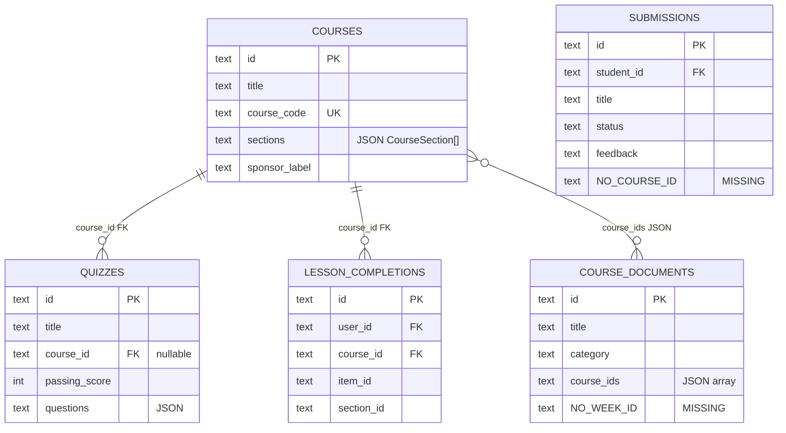
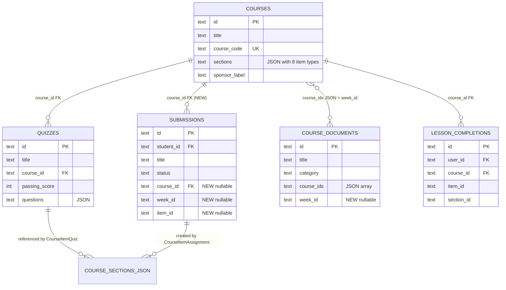
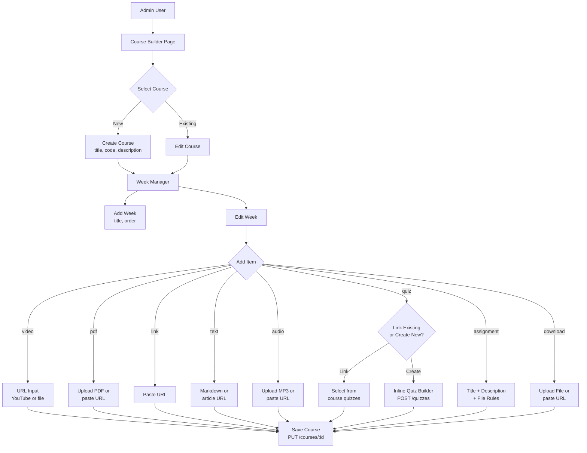
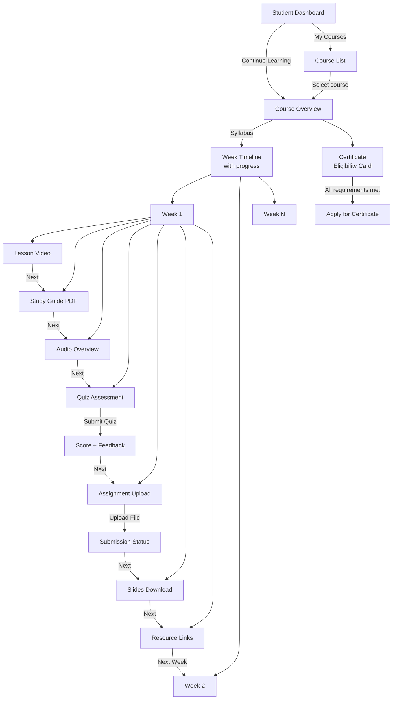
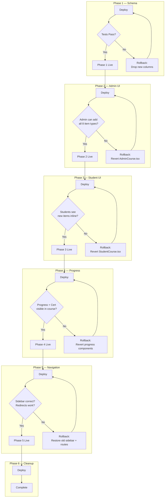

# Course Module Content Schema Spec

**Date:** 2026-08-03
**Status:** Implementation-Ready Spec
**Parent:** `2026-08-03-course-centric-ia-redesign.md`
**Scope:** Schema extensions, content model changes, new item types, backward compatibility

---

## Table of Contents

1. [Objective](#1-objective)
2. [Current State (Validated)](#2-current-state-validated)
3. [Design Decision: Weeks Storage](#3-design-decision-weeks-storage)
4. [Content Item Type Extensions](#4-content-item-type-extensions)
5. [Schema Changes](#5-schema-changes)
6. [Backend API Changes](#6-backend-api-changes)
7. [Frontend Type Changes](#7-frontend-type-changes)
8. [Admin Course Builder Changes](#8-admin-course-builder-changes)
9. [Student Course Viewer Changes](#9-student-course-viewer-changes)
10. [Backward Compatibility](#10-backward-compatibility)
11. [Acceptance Behaviors (TDD)](#11-acceptance-behaviors-tdd)
12. [Implementation Roadmap](#12-implementation-roadmap)
13. [Mermaid Diagrams](#13-mermaid-diagrams)
14. [To-Do Lists](#14-to-do-lists)
15. [Worktree Plan](#15-worktree-plan)
16. [Test Plan](#16-test-plan)
17. [Loop Workflow](#17-loop-workflow)
18. [Developer Spec Outlines](#18-developer-spec-outlines)
19. [Review Notes](#19-review-notes)
20. [Final Recommendation](#20-final-recommendation)

---

## 1. Objective

Extend the LMS content model so that:

1. **Four new content item types** (audio, quiz, assignment, download) can be placed inside course weeks alongside existing types (video, link, pdf, text).
2. **Quizzes become course items** — a `CourseItemQuiz` references a quiz from the `quizzes` table and is rendered inline within a week.
3. **Assignments become course items** — a `CourseItemAssignment` defines a submission task within a week, and student submissions are linked to the course and week.
4. **Submissions gain course context** — the `submissions` table gets `course_id` and `week_id` columns.
5. **Documents gain week context** — `course_documents` gets optional `week_id` for per-week placement.
6. **All changes are additive and backward-compatible** — existing courses, quizzes, submissions, and documents continue to work unchanged.

### Smallest Valuable First Slice

**Phase 1 (this spec):** Schema + types + backend API. No UI changes.
- Add new columns to `submissions` and `course_documents`
- Extend `CourseItem` TypeScript union with 4 new types
- Add backend support for reading/writing new item types
- Write tests for all changes
- Deploy. No user-visible changes.

This unblocks all subsequent UI phases without breaking anything.

---

## 2. Current State (Validated)

### 2.1 Content Hierarchy (Confirmed Against Code)

```
Course (DB: courses table)
├── sections: TEXT (JSON array of CourseSection[])
│
│   Frontend normalizes to:
│   weeks: CourseWeek[]
│   ├── CourseWeek { id, title, order, sections: CourseSection[] }
│   │   └── CourseSection { id, title, objective?, outcome?, items: CourseItem[] }
│   │       └── CourseItem = CourseItemVideo | CourseItemLink | CourseItemPdf | CourseItemText
│
│   On save, frontend flattens: toBackendSections(course) → CourseSection[]
│   Backend stores: courses.sections = JSON.stringify(flatSections)
```

### 2.2 Current Item Types (Exact from `course.ts`)

```typescript
type ContentItemType = 'video' | 'link' | 'pdf' | 'text';

interface CourseItemBase {
  id: string;
  title: string;
  order?: number;
  information?: string;
}

interface CourseItemVideo extends CourseItemBase {
  type: 'video';
  url: string;
  description?: string;
}

interface CourseItemLink extends CourseItemBase {
  type: 'link';
  url: string;
  description?: string;
}

interface CourseItemPdf extends CourseItemBase {
  type: 'pdf';
  documentId?: string;
  fileUrl?: string;
  description?: string;
}

interface CourseItemText extends CourseItemBase {
  type: 'text';
  url: string;
  description?: string;
}

type CourseItem = CourseItemVideo | CourseItemLink | CourseItemPdf | CourseItemText;
```

### 2.3 Key DB Tables (Exact Columns)

**submissions:**
```
id, student_id, title, description, file_name, file_size, file_path,
file_mime_type, status, submitted_at, reviewed_at, reviewed_by_id, feedback
⚠ NO course_id, NO week_id
```

**course_documents:**
```
id, title, description, category, file_name, file_size, file_path,
file_mime_type, course_ids (JSON array), uploaded_by_id, uploaded_at
⚠ NO week_id
```

**quizzes:**
```
id, title, description, information, course_id (FK → courses), passing_score,
questions (JSON), created_at, updated_at
✓ Has course_id — can be referenced by CourseItemQuiz
```

### 2.4 Weeks: Frontend-Only Today

The backend stores `courses.sections` as a flat JSON array. The frontend:
1. Reads `course.sections` from API
2. Calls `getCourseWeeks(course)` to wrap in `CourseWeek[]`
3. On save, calls `toBackendSections(course)` to flatten back

**Implication:** The backend round-trips sections without week awareness. Weeks are preserved only because the frontend rebuilds them from section metadata.

---

## 3. Design Decision: Weeks Storage

### Options Evaluated

**Option A: Keep weeks frontend-only, extend JSON**
- Weeks stay as a frontend construct
- New item types added to the `CourseItem` union
- Backend stores new item types as part of the flat `sections` JSON
- No new DB tables or columns for weeks
- Pro: Smallest change. No migration.
- Con: Backend can't query "what's in week 2" without parsing JSON.

**Option B: Promote weeks to backend JSON**
- Backend stores `courses.weeks` JSON (instead of `courses.sections`)
- Migration converts `sections` → `weeks` JSON with single-week wrapper
- Pro: Backend-aware of weeks. Cleaner API.
- Con: Breaking change to course save/load. All API consumers must update.

**Option C: Normalize weeks to separate table**
- New `course_weeks` table with `course_id`, `title`, `order`
- New `course_week_sections` table
- Pro: Full relational model. Queryable.
- Con: Massive migration. Over-engineering for current scale.

### Decision: Option A (Keep weeks frontend-only, extend JSON)

**Rationale:**
1. The current system works. 492 tests pass. Don't break what works.
2. The backend only needs to store and retrieve the sections JSON — it doesn't query individual items.
3. New item types are just new discriminants in the JSON. The backend doesn't need to interpret them.
4. Phase 1 should be **zero-risk to existing functionality**.
5. If we later need backend week-awareness (e.g., for week-level APIs), we can promote to Option B as a separate phase.

**What this means:**
- `CourseItemQuiz`, `CourseItemAssignment`, `CourseItemAudio`, `CourseItemDownload` are stored inside `courses.sections` JSON alongside existing items.
- The backend stores and retrieves them opaquely.
- The frontend interprets the `type` discriminant and renders accordingly.
- New item types in the JSON are ignored by old frontend versions (graceful degradation).

---

## 4. Content Item Type Extensions

### 4.1 New Type: `CourseItemQuiz`

```typescript
interface CourseItemQuiz extends CourseItemBase {
  type: 'quiz';
  quizId: string;       // References quizzes.id
  // title inherited from base (display name in week view)
  // information inherited from base (context shown before quiz)
}
```

**Behavior:**
- Placed within a week's section items alongside lessons
- When student clicks, quiz renders inline (not a page navigation)
- Quiz data fetched from `GET /api/v1/quizzes/:quizId` (existing endpoint)
- Quiz submission via `POST /api/v1/quizzes/:quizId/submit` (existing endpoint)
- Completion tracked via `quiz_completions` table (existing)
- Lesson completion also recorded in `lesson_completions` for progress tracking

**Admin authoring:**
- Admin selects "Quiz" from item type dropdown
- Shown a selector: "Link existing quiz" (dropdown of course quizzes) or "Create new quiz" (inline form)
- Creating a new quiz calls `POST /api/v1/quizzes` (existing endpoint), then stores the returned `quizId`

**Ordering rule:** Quiz should typically be placed after lesson items in a section, but admin controls the order.

### 4.2 New Type: `CourseItemAssignment`

```typescript
interface CourseItemAssignment extends CourseItemBase {
  type: 'assignment';
  description: string;          // Task description shown to student
  maxFileSize?: number;         // Max upload size in bytes (default: 10MB = 10485760)
  allowedMimeTypes?: string[];  // Allowed file types (default: system whitelist)
  // title inherited from base (assignment name)
  // information inherited from base (context before assignment)
}
```

**Behavior:**
- Placed within a week's section items
- When student clicks, shows assignment description + file upload form
- File upload calls `POST /api/v1/submissions` (existing endpoint) with new `course_id` and `week_id` fields
- Student can view submission status (pending/approved/rejected) and feedback inline
- Lesson completion recorded when submission is approved (or optionally on upload)

**Ordering rule:** Assignment should typically be placed after quiz items, but admin controls the order.

### 4.3 New Type: `CourseItemAudio`

```typescript
interface CourseItemAudio extends CourseItemBase {
  type: 'audio';
  url: string;          // Direct URL to audio file (MP3, etc.) or hosted audio
  // title inherited from base
  // information inherited from base
}
```

**Behavior:**
- Placed within a week's section items
- Renders HTML5 `<audio>` player with controls
- Lesson completion recorded when student plays audio (or manual mark)
- Maps to vibe-coding `audio-overview.mp3` content type

### 4.4 New Type: `CourseItemDownload`

```typescript
interface CourseItemDownload extends CourseItemBase {
  type: 'download';
  fileUrl?: string;       // Direct URL to downloadable file
  documentId?: string;    // OR reference to course_documents.id
  fileName: string;       // Display filename (e.g., "Week1-Slides.pptx")
  // title inherited from base
  // information inherited from base
}
```

**Behavior:**
- Placed within a week's section items
- Renders as a download button/card (not embedded viewer)
- For `documentId`: uses existing `GET /api/v1/documents/:id/download` endpoint
- For `fileUrl`: direct download link
- Lesson completion recorded when student clicks download (or manual mark)
- Maps to vibe-coding `slides.pptx` content type

### 4.5 Updated Union Type

```typescript
type ContentItemType = 'video' | 'link' | 'pdf' | 'text' | 'audio' | 'quiz' | 'assignment' | 'download';

type CourseItem =
  | CourseItemVideo
  | CourseItemLink
  | CourseItemPdf
  | CourseItemText
  | CourseItemAudio        // NEW
  | CourseItemQuiz         // NEW
  | CourseItemAssignment   // NEW
  | CourseItemDownload;    // NEW
```

### 4.6 Content Item Ordering Rules

1. **Order is array-position**: Items appear in the order they exist in the `items[]` array within a section.
2. **Optional `order` field**: If present, items are sorted by `order` ascending. Ties broken by array position.
3. **Recommended authoring order** (not enforced):
   - Video/Text lessons first
   - Audio/PDF supplements next
   - Quiz after lessons
   - Assignment after quiz
   - Download/Link resources last
4. **Admin controls order**: Drag-and-drop reorder in course builder. No system-enforced ordering.

---

## 5. Schema Changes

### 5.1 submissions table: Add course_id and week_id

```sql
-- Migration: Add course context to submissions
-- MUST use PRAGMA foreign_keys=OFF and legacy_alter_table=ON for SQLite >=3.26.0

PRAGMA foreign_keys=OFF;
PRAGMA legacy_alter_table=ON;

ALTER TABLE submissions ADD COLUMN course_id TEXT REFERENCES courses(id) ON DELETE SET NULL;
ALTER TABLE submissions ADD COLUMN week_id TEXT;
ALTER TABLE submissions ADD COLUMN item_id TEXT;

CREATE INDEX IF NOT EXISTS idx_submissions_course ON submissions(course_id);
CREATE INDEX IF NOT EXISTS idx_submissions_course_week ON submissions(course_id, week_id);

PRAGMA foreign_keys=ON;
PRAGMA legacy_alter_table=OFF;
```

**Rules:**
- `course_id` is **nullable** — existing submissions keep NULL
- `week_id` is **nullable** — stores the week ID from frontend (opaque string)
- `item_id` is **nullable** — stores the CourseItemAssignment.id that triggered this submission
- New submissions from CourseItemAssignment will populate all three
- Old `/api/v1/submissions` POST endpoint continues to work without these fields
- New submissions from in-course assignments include them automatically

**ensure function:**
```typescript
function ensureSubmissionsCourseContext(): void {
  const hasCourseId = db.prepare(
    "SELECT 1 FROM pragma_table_info('submissions') WHERE name='course_id'"
  ).get();
  if (!hasCourseId) {
    db.exec("ALTER TABLE submissions ADD COLUMN course_id TEXT REFERENCES courses(id) ON DELETE SET NULL");
    db.exec("ALTER TABLE submissions ADD COLUMN week_id TEXT");
    db.exec("ALTER TABLE submissions ADD COLUMN item_id TEXT");
    db.exec("CREATE INDEX IF NOT EXISTS idx_submissions_course ON submissions(course_id)");
    db.exec("CREATE INDEX IF NOT EXISTS idx_submissions_course_week ON submissions(course_id, week_id)");
  }
}
```

### 5.2 course_documents table: Add week_id

```sql
ALTER TABLE course_documents ADD COLUMN week_id TEXT;
```

**Rules:**
- `week_id` is **nullable** — existing documents keep NULL
- When a document is attached to a specific week via the course builder, `week_id` is set
- Documents without `week_id` are "course-level" resources (visible in course overview, not a specific week)

**ensure function:**
```typescript
function ensureCourseDocumentsWeekId(): void {
  const hasWeekId = db.prepare(
    "SELECT 1 FROM pragma_table_info('course_documents') WHERE name='week_id'"
  ).get();
  if (!hasWeekId) {
    db.exec("ALTER TABLE course_documents ADD COLUMN week_id TEXT");
  }
}
```

### 5.3 schema.sql Updates

Add the new columns to the canonical schema file so that `_resetForTests()` creates tables with them:

```sql
-- In submissions CREATE TABLE, add:
  course_id TEXT REFERENCES courses(id) ON DELETE SET NULL,
  week_id TEXT,
  item_id TEXT,

-- In course_documents CREATE TABLE, add:
  week_id TEXT,
```

---

## 6. Backend API Changes

### 6.1 Submissions API Enhancement

**POST /api/v1/submissions** (existing endpoint — enhanced):

Accept optional new fields in request body:
```typescript
{
  title: string;
  description?: string;
  courseId?: string;     // NEW — optional course association
  weekId?: string;      // NEW — optional week association
  itemId?: string;      // NEW — optional item association
  // + file upload (existing)
}
```

**Implementation:**
- Add `courseId`, `weekId`, `itemId` to INSERT statement (if provided)
- Validate `courseId` exists in `courses` table (if provided)
- Validate student is enrolled in course (if `courseId` provided)
- Backward compatible: old clients omit these fields → NULL in DB

**GET /api/v1/submissions** (existing endpoint — enhanced):

Add optional query parameter:
```
GET /api/v1/submissions?courseId=xyz&weekId=abc
```

- Filter by `course_id` and/or `week_id` when provided
- Default behavior unchanged (returns all submissions for user/admin)

### 6.2 Course API: Quiz Data in Progress

**GET /api/v1/courses/:courseId/progress** (existing endpoint — enhanced):

Add quiz completion data per quiz item in the course sections JSON:
```typescript
{
  // existing fields...
  quizCompletions: Record<string, {
    score: number;
    total: number;
    passed: boolean;
    completedAt: string;
  }>;  // keyed by quizId
}
```

This allows the frontend to show quiz scores inline within the course week view.

### 6.3 New Endpoint: Course Submissions

**GET /api/v1/courses/:courseId/submissions** (new endpoint):

Returns all submissions for the authenticated user within a specific course:
```typescript
{
  submissions: Array<{
    id: string;
    title: string;
    description: string;
    status: 'pending' | 'approved' | 'rejected';
    feedback?: string;
    weekId?: string;
    itemId?: string;
    submittedAt: string;
    reviewedAt?: string;
  }>;
}
```

**Authorization:**
- Student: own submissions for this course
- Admin/Lecturer: all submissions for this course

### 6.4 No Changes to Quiz API

The existing quiz endpoints (`/api/v1/quizzes/*`) remain unchanged. The `CourseItemQuiz` references a `quizId` and the frontend uses existing endpoints to fetch/submit quizzes. No new quiz-specific endpoints needed.

---

## 7. Frontend Type Changes

### 7.1 course.ts Updates

```typescript
// Extended ContentItemType union
type ContentItemType = 'video' | 'link' | 'pdf' | 'text' | 'audio' | 'quiz' | 'assignment' | 'download';

// NEW: Audio item
interface CourseItemAudio extends CourseItemBase {
  type: 'audio';
  url: string;
}

// NEW: Quiz item (references quizzes table)
interface CourseItemQuiz extends CourseItemBase {
  type: 'quiz';
  quizId: string;
}

// NEW: Assignment item (defines submission task)
interface CourseItemAssignment extends CourseItemBase {
  type: 'assignment';
  description: string;
  maxFileSize?: number;
  allowedMimeTypes?: string[];
}

// NEW: Download item (downloadable file)
interface CourseItemDownload extends CourseItemBase {
  type: 'download';
  fileUrl?: string;
  documentId?: string;
  fileName: string;
}

// Updated union
type CourseItem =
  | CourseItemVideo
  | CourseItemLink
  | CourseItemPdf
  | CourseItemText
  | CourseItemAudio
  | CourseItemQuiz
  | CourseItemAssignment
  | CourseItemDownload;
```

### 7.2 courseService.ts Updates

No structural changes needed. The service already:
- Sends `course.sections` (or `toBackendSections(course)`) as JSON
- Receives `course.sections` JSON from backend
- The backend stores/retrieves JSON opaquely

New item types are just new objects in the JSON array. The backend doesn't interpret them.

### 7.3 Admin Builder Draft Types

```typescript
// Extended ItemDraft type
type ItemDraft = {
  tempId: string;
  type: 'video' | 'link' | 'pdf' | 'text' | 'audio' | 'quiz' | 'assignment' | 'download';
  title: string;
  order: number;
  url?: string;
  documentId?: string;
  fileUrl?: string;
  information?: string;
  // New fields for new types:
  quizId?: string;            // For quiz type
  description?: string;       // For assignment type
  maxFileSize?: number;       // For assignment type
  allowedMimeTypes?: string[];// For assignment type
  fileName?: string;          // For download type
};
```

---

## 8. Admin Course Builder Changes

### 8.1 Item Type Selector (Phase 2 — UI)

Current `<select>` dropdown adds 4 new options:
```html
<select>
  <option value="video">Video</option>
  <option value="link">Link</option>
  <option value="pdf">PDF</option>
  <option value="text">Text</option>
  <option value="audio">Audio</option>          <!-- NEW -->
  <option value="quiz">Quiz</option>            <!-- NEW -->
  <option value="assignment">Assignment</option><!-- NEW -->
  <option value="download">Download</option>    <!-- NEW -->
</select>
```

### 8.2 Per-Type Input Fields (Phase 2 — UI)

**Audio:** URL input field (same as video, but renders `<audio>` not `<video>`)

**Quiz:** Two sub-options:
- "Link existing quiz" → dropdown of quizzes where `course_id` matches current course
- "Create new quiz" → inline form (title, questions, passing score) that creates quiz via API

**Assignment:** Form with:
- Description textarea (task description shown to student)
- Max file size input (optional, default 10MB)
- Allowed file types checkboxes (optional, default system whitelist)

**Download:** Two sub-options (same pattern as PDF):
- Upload file directly (auto-creates `course_documents` record)
- Paste direct URL

### 8.3 CSV Import Extension

Extend CSV format to support new types:
```
Header: week,section,objective,outcome,type,title,url,information,quizId,description
```

New `type` values: `audio`, `quiz`, `assignment`, `download`
- `quiz`: requires `quizId` column
- `assignment`: uses `description` column
- `audio`: uses `url` column
- `download`: uses `url` column (or fileUrl)

---

## 9. Student Course Viewer Changes

### 9.1 New Item Renderers (Phase 3 — UI)

**AudioItemRenderer:**
```tsx
function AudioItemRenderer({ item }: { item: CourseItemAudio }) {
  return (
    <div>
      {item.information && <p>{item.information}</p>}
      <audio controls src={item.url} className="w-full" />
    </div>
  );
}
```

**QuizItemRenderer:**
```tsx
function QuizItemRenderer({ item, courseId }: { item: CourseItemQuiz; courseId: string }) {
  // Fetches quiz via quizService.getQuiz(item.quizId)
  // Renders inline quiz (reuses quiz taking logic from StudentQuizzes.tsx)
  // Shows completion status if already taken
}
```

**AssignmentItemRenderer:**
```tsx
function AssignmentItemRenderer({ item, courseId, weekId }: { item: CourseItemAssignment; courseId: string; weekId: string }) {
  // Shows assignment description
  // File upload form (POST /submissions with courseId, weekId, itemId)
  // Shows submission status if already submitted
}
```

**DownloadItemRenderer:**
```tsx
function DownloadItemRenderer({ item }: { item: CourseItemDownload }) {
  // Download button/card
  // Uses documentsService.getDownloadUrl(item.documentId) or item.fileUrl
}
```

### 9.2 SectionBlock Extension

The existing `SectionBlock` component (in `StudentCourse.tsx`) renders items by type. Add cases for new types:

```typescript
// In the item rendering switch/if chain:
if (item.type === 'audio') {
  // Headphones icon + title
} else if (item.type === 'quiz') {
  // ClipboardCheck icon + title + completion badge
} else if (item.type === 'assignment') {
  // Upload icon + title + submission status badge
} else if (item.type === 'download') {
  // Download icon + title + file name
}
```

### 9.3 EmbeddedMaterialViewer Extension

The `EmbeddedMaterialViewer` component renders the full content view when an item is opened. Add new type renderers for audio, quiz, assignment, download.

---

## 10. Backward Compatibility

### 10.1 JSON Compatibility

**Old frontend reading new item types:**
- Old frontend code has `if (item.type === 'video') ... else if (item.type === 'link') ...`
- Unknown types fall through without rendering (graceful degradation)
- No crash, no error — items with unknown types are simply not displayed

**New frontend reading old course data:**
- Old courses have only video/link/pdf/text items
- New frontend renders them exactly as before
- `getCourseWeeks()` normalizer unchanged

### 10.2 API Compatibility

**Old clients calling POST /submissions:**
- `course_id`, `week_id`, `item_id` are optional
- Omitting them stores NULL — same behavior as before

**Old clients calling GET /submissions:**
- Response includes new fields (`courseId`, `weekId`, `itemId`) but they're null
- Old clients ignore unknown fields

**Old clients calling course endpoints:**
- `courses.sections` JSON now contains items with `type: 'quiz'` etc.
- Old clients that don't handle these types just skip them in rendering

### 10.3 Route Compatibility

No routes are removed or renamed in Phase 1. All existing routes work exactly as before.

### 10.4 Database Compatibility

- New columns are nullable with no defaults that affect existing rows
- Existing data is unchanged
- `_resetForTests()` creates tables with new columns (schema.sql updated)
- `ensure*()` functions add columns if missing (safe for running servers)

---

## 11. Acceptance Behaviors (TDD)

### 11.1 Schema Tests

```
GIVEN the LMS database
WHEN the app starts
THEN submissions table has course_id, week_id, item_id columns
AND course_documents table has week_id column
AND all existing data is unchanged

GIVEN an existing submission without course_id
WHEN queried via GET /api/v1/submissions
THEN course_id is null in the response
AND the submission is still accessible and functional
```

### 11.2 Content Item Type Tests

```
GIVEN a course with sections JSON containing a CourseItemQuiz { type: 'quiz', quizId: 'q1' }
WHEN fetched via GET /api/v1/courses/:id
THEN the response includes the quiz item in sections
AND the item has type 'quiz' and quizId 'q1'

GIVEN a course with sections JSON containing a CourseItemAssignment { type: 'assignment', description: 'Submit reflection' }
WHEN fetched via GET /api/v1/courses/:id
THEN the response includes the assignment item in sections

GIVEN a course with sections JSON containing items of types audio, quiz, assignment, download
WHEN saved via PUT /api/v1/courses/:id
THEN all item types are preserved in the stored JSON
AND re-fetching the course returns all items with correct types
```

### 11.3 Submission with Course Context Tests

```
GIVEN a student enrolled in course "BVC-101"
WHEN they submit via POST /api/v1/submissions with { courseId: "BVC-101", weekId: "week-1", itemId: "item-5" }
THEN the submission is created with course_id, week_id, item_id populated
AND the submission appears in GET /api/v1/submissions
AND the submission appears in GET /api/v1/courses/BVC-101/submissions

GIVEN a student submitting without courseId
WHEN they submit via POST /api/v1/submissions with { title: "My Work" }
THEN the submission is created with course_id = NULL
AND the submission still appears in GET /api/v1/submissions
```

### 11.4 Course Submissions Endpoint Tests

```
GIVEN a student with 2 submissions: one for course BVC-101 and one without a course
WHEN they call GET /api/v1/courses/BVC-101/submissions
THEN only the BVC-101 submission is returned

GIVEN an admin
WHEN they call GET /api/v1/courses/BVC-101/submissions
THEN all submissions for BVC-101 from all students are returned
```

### 11.5 Backward Compatibility Tests

```
GIVEN an old course with only video, link, pdf, text items
WHEN fetched and saved by new code
THEN no items are lost or modified
AND no new fields are added to existing items

GIVEN a new course with quiz and assignment items
WHEN fetched by old frontend code that only handles video/link/pdf/text
THEN the old code does not crash
AND unknown item types are silently skipped
```

---

## 12. Implementation Roadmap

### Phase 1: Schema + Types + Backend (This Spec — Low Risk)

**Goal:** Database and type system support for new item types. No UI changes.

**Files affected:**
| File | Change |
|------|--------|
| `LMS-Server/database/schema.sql` | Add columns to submissions + course_documents |
| `LMS-Server/src/config/database.ts` | Add `ensureSubmissionsCourseContext()` + `ensureCourseDocumentsWeekId()` |
| `LMS-Server/src/routes/submissions.ts` | Accept + store `courseId`/`weekId`/`itemId` in POST |
| `LMS-Server/src/routes/courses.ts` | Add `GET /courses/:id/submissions` endpoint |
| `LMS-Server/src/routes/progress.ts` | Add quiz completions to progress response |
| `LMS-Frontend/src/types/course.ts` | Add 4 new interfaces + extend union |
| `LMS-Frontend/src/services/courseService.ts` | No changes needed (JSON opaque pass-through) |

**Tests to add:**
- Schema migration test (columns exist after ensure functions)
- Submission with course context (POST + GET)
- Course submissions endpoint (GET with filtering)
- CourseItem type roundtrip (save + load course with new item types)
- Backward compatibility (old courses unchanged)

**Risks:**
- SQLite ALTER TABLE requires PRAGMA workaround → tested pattern from prior migrations
- Existing tests must not break → run full suite before and after

**Exit criteria:**
- 492+ backend tests pass (existing + new)
- New columns exist in DB
- POST /submissions accepts courseId/weekId/itemId
- GET /courses/:id/submissions returns filtered results
- Course JSON round-trips all 8 item types

### Phase 2: Admin Course Builder UI (Medium Risk)

**Goal:** Admin can add quiz, assignment, audio, download items in the course builder.

**Files affected:**
| File | Change |
|------|--------|
| `LMS-Frontend/src/pages/AdminCourse.tsx` | Add new item types to selector + per-type input fields |
| `LMS-Frontend/src/types/course.ts` | Already done in Phase 1 |

**Tests to add:**
- Admin can create course with quiz item (linked to existing quiz)
- Admin can create course with assignment item
- Admin can create course with audio item
- Admin can create course with download item
- CSV import handles new types

**Exit criteria:**
- Admin can add/edit/remove all 8 item types in course builder
- Saved courses contain new item types in JSON
- CSV import/export supports new types

### Phase 3: Student Course Viewer UI (Medium Risk)

**Goal:** Students see and interact with new item types in the course viewer.

**Files affected:**
| File | Change |
|------|--------|
| `LMS-Frontend/src/pages/StudentCourse.tsx` | Add item renderers for audio, quiz, assignment, download |
| New: `LMS-Frontend/src/components/InlineQuizViewer.tsx` | Quiz rendering extracted from StudentQuizzes.tsx |
| New: `LMS-Frontend/src/components/InlineAssignmentUploader.tsx` | Assignment submission form |
| New: `LMS-Frontend/src/components/AudioPlayer.tsx` | Audio player component |
| New: `LMS-Frontend/src/components/DownloadCard.tsx` | Download button/card |

**Tests to add:**
- Student sees quiz item inline and can take quiz
- Student sees assignment item and can submit file
- Student sees audio player and can play audio
- Student sees download card and can download file
- Lesson completion recorded for all new item types

**Exit criteria:**
- All 8 item types render correctly in student course viewer
- Quiz taking works inline (no page navigation)
- Assignment submission works inline with course context
- Audio plays
- Downloads work

### Phase 4: Progress + Certificate Integration (Medium Risk)

**Goal:** In-course progress shows quiz scores, assignment statuses. Certificate eligibility visible.

**Files affected:**
| File | Change |
|------|--------|
| `LMS-Frontend/src/pages/StudentCourse.tsx` | Add progress sidebar with per-item completion |
| New: `LMS-Frontend/src/components/CertificateEligibilityCard.tsx` | Eligibility checklist |
| `LMS-Server/src/routes/progress.ts` | Enhanced progress with quiz + submission data |

**Exit criteria:**
- Student sees per-item completion in week view
- Student sees quiz scores inline
- Student sees assignment status inline
- Certificate eligibility checklist visible in course

### Phase 5: Navigation Restructure (High Risk — User-Visible)

**Goal:** Sidebar simplified. Quizzes, Resources, Submissions, Course Members moved under course.

**Files affected:**
| File | Change |
|------|--------|
| `LMS-Frontend/src/components/Layout.tsx` | Update sidebar items |
| `LMS-Frontend/src/App.tsx` | Add new routes, redirect old routes |
| `LMS-Frontend/src/pages/StudentCourse.tsx` → rename to `CourseDetail.tsx` | Enhanced course page |

**Exit criteria:**
- Student sidebar reduced from 10 to 7 items
- Old routes redirect with toast messages
- My Courses page shows enrolled courses
- Course detail shows full learning journey

### Phase 6: Cleanup + Polish (Low Risk)

**Goal:** Remove old code, update docs, update mobile app.

**Files affected:**
- Old student pages (if fully replaced)
- Documentation (ARCHITECTURE.md, FEATURE_INVENTORY.md, QA checklists)
- Mobile app routes

**Exit criteria:**
- All docs updated
- No dead code
- Mobile app compatible

---

## 13. Mermaid Diagrams

### 13.1 Current LMS Course/Content Model



### 13.2 Proposed Course-Centric Content Hierarchy



### 13.3 Course/Week Authoring Flow



### 13.4 Student In-Course Navigation Flow



### 13.5 Migration Flow: Detached → Course-Contained

```mermaid
graph LR
    subgraph "Phase 1: Schema (No UI Change)"
        S1[Add course_id to submissions] --> S2[Add week_id to course_documents]
        S2 --> S3[Extend CourseItem types]
        S3 --> S4[Add GET /courses/:id/submissions]
        S4 --> S5[Run tests: 492+ pass]
    end

    subgraph "Phase 2: Admin UI"
        A1[Add item type selector] --> A2[Quiz picker/creator]
        A2 --> A3[Assignment form]
        A3 --> A4[Audio + Download forms]
        A4 --> A5[CSV import extension]
    end

    subgraph "Phase 3: Student UI"
        U1[InlineQuizViewer] --> U2[InlineAssignmentUploader]
        U2 --> U3[AudioPlayer]
        U3 --> U4[DownloadCard]
        U4 --> U5[SectionBlock + EmbeddedViewer updates]
    end

    subgraph "Phase 4: Progress + Cert"
        P1[In-course progress sidebar] --> P2[Quiz score badges]
        P2 --> P3[Assignment status badges]
        P3 --> P4[Certificate eligibility card]
    end

    subgraph "Phase 5: Navigation"
        N1[Update sidebar] --> N2[Add route redirects]
        N2 --> N3[Add My Courses page]
        N3 --> N4[Add Credentials page]
    end

    subgraph "Phase 6: Cleanup"
        C1[Remove old pages] --> C2[Update docs]
        C2 --> C3[Update mobile app]
    end

    S5 --> A1
    A5 --> U1
    U5 --> P1
    P4 --> N1
    N4 --> C1
```



### 13.6 Rollout / Rollback Diagram



---

## 14. To-Do Lists

### 14.1 Research / Checklist Items
- [x] Validate current CourseItem types (4 confirmed: video, link, pdf, text)
- [x] Validate submissions table has no course_id (confirmed)
- [x] Validate course_documents has no week_id (confirmed)
- [x] Validate quizzes.course_id FK exists (confirmed)
- [x] Validate weeks are frontend-only (confirmed — toBackendSections flattens)
- [x] Validate ensure*() migration pattern (confirmed — 25+ ensure functions exist)
- [x] Validate lesson_completions tracks per (user, course, item_id) (confirmed)
- [x] Decide weeks storage approach (Decision: keep frontend-only, Option A)

### 14.2 Schema Design Items
- [ ] Write `ensureSubmissionsCourseContext()` function
- [ ] Write `ensureCourseDocumentsWeekId()` function
- [ ] Update `schema.sql` with new columns for `_resetForTests()`
- [ ] Add indexes for new columns (idx_submissions_course, idx_submissions_course_week)
- [ ] Register new ensure functions in database.ts initialization order

### 14.3 API Design Items
- [ ] Update `POST /submissions` to accept courseId, weekId, itemId
- [ ] Update `GET /submissions` to filter by courseId/weekId
- [ ] Add `GET /courses/:courseId/submissions` endpoint
- [ ] Update `GET /courses/:courseId/progress` to include quizCompletions
- [ ] Validate courseId in POST /submissions (course exists + student enrolled)

### 14.4 UI Redesign Items (Phase 2-3)
- [ ] Add 4 new item types to AdminCourse.tsx item type selector
- [ ] Add QuizPicker component (select from course quizzes)
- [ ] Add AssignmentForm component (title + description + file rules)
- [ ] Add AudioForm component (URL input)
- [ ] Add DownloadForm component (upload or URL)
- [ ] Build InlineQuizViewer component (extract from StudentQuizzes.tsx)
- [ ] Build InlineAssignmentUploader component
- [ ] Build AudioPlayer component
- [ ] Build DownloadCard component
- [ ] Update SectionBlock to render new item types
- [ ] Update EmbeddedMaterialViewer for new types
- [ ] Update CSV import to support new types

### 14.5 Migration Items
- [ ] Test ensure functions on existing production DB (backup first)
- [ ] Backfill strategy for existing submissions (admin manually assigns course_id? or leave null?)
- [ ] Document null handling for existing data
- [ ] Test _resetForTests() with updated schema.sql

### 14.6 Test Items
- [ ] Write schema migration tests
- [ ] Write submission POST with courseId test
- [ ] Write submission GET with courseId filter test
- [ ] Write course submissions endpoint test
- [ ] Write CourseItem type roundtrip tests (all 8 types)
- [ ] Write backward compatibility test (old course data)
- [ ] Write progress endpoint enhancement test
- [ ] Run full existing test suite (492 backend + 23 frontend)

### 14.7 Review Items
- [ ] Review this spec with user before implementation
- [ ] Review Phase 1 PR before merging
- [ ] Review Phase 2 PR (admin UI) before merging
- [ ] Review Phase 3 PR (student UI) before merging

### 14.8 Rollout Items
- [ ] Deploy Phase 1 to production
- [ ] Verify existing functionality post-deploy
- [ ] Deploy Phase 2 (admin UI)
- [ ] Admin creates test course with new item types
- [ ] Deploy Phase 3 (student UI)
- [ ] Student views test course with new item types
- [ ] Deploy Phase 4-6

---

## 15. Worktree Plan

### Proposed Branches / Worktrees

```
Branch: feat/content-schema-extensions (Phase 1)
  Purpose: Schema changes + type extensions + backend API
  Base: main
  Files: schema.sql, database.ts, submissions.ts, courses.ts, progress.ts, course.ts
  Test: npx vitest run (expect 492+ pass + new tests)

Branch: feat/admin-course-builder-v2 (Phase 2)
  Purpose: Admin UI for new item types
  Base: feat/content-schema-extensions
  Files: AdminCourse.tsx, course.ts (types already extended)
  Test: npm run build + manual QA

Branch: feat/student-course-journey (Phase 3)
  Purpose: Student UI for new item types
  Base: feat/admin-course-builder-v2
  Files: StudentCourse.tsx, new components (InlineQuizViewer, etc.)
  Test: npm run build + manual QA + vitest

Branch: feat/progress-certificate-in-course (Phase 4)
  Purpose: In-course progress + certificate visibility
  Base: feat/student-course-journey
  Files: progress.ts, new CertificateEligibilityCard component
  Test: vitest + manual QA

Branch: feat/navigation-restructure (Phase 5)
  Purpose: Sidebar simplification + route redirects
  Base: feat/progress-certificate-in-course
  Files: Layout.tsx, App.tsx
  Test: Full QA pass

Branch: chore/course-centric-cleanup (Phase 6)
  Purpose: Remove old code, update docs, mobile app
  Base: feat/navigation-restructure
  Files: docs/*, old page components, mobile app
```

### Worktree Usage

For each phase:
```bash
# Create worktree
git worktree add .claude/worktrees/feat-content-schema -b feat/content-schema-extensions

# Work in worktree
cd .claude/worktrees/feat-content-schema

# When done, merge back
cd /home/webadmin/web-stack/html/LMS-AmmaWallet
git merge feat/content-schema-extensions

# Remove worktree
git worktree remove .claude/worktrees/feat-content-schema
```

---

## 16. Test Plan

### 16.1 TDD Acceptance Behaviors (Phase 1)

**Schema Tests:**
```
TEST: submissions table has course_id column after migration
TEST: submissions table has week_id column after migration
TEST: submissions table has item_id column after migration
TEST: course_documents table has week_id column after migration
TEST: existing submissions data is unchanged after migration
TEST: existing course_documents data is unchanged after migration
```

**Submission API Tests:**
```
TEST: POST /submissions with courseId, weekId, itemId → creates submission with all fields
TEST: POST /submissions without courseId → creates submission with null course_id (backward compat)
TEST: GET /submissions?courseId=X → returns only submissions for course X
TEST: GET /submissions without courseId filter → returns all submissions (backward compat)
TEST: POST /submissions with invalid courseId → 400 error
TEST: POST /submissions with courseId for non-enrolled student → 403 error
```

**Course Submissions Endpoint Tests:**
```
TEST: GET /courses/:courseId/submissions → returns submissions for authenticated user in course
TEST: GET /courses/:courseId/submissions (admin) → returns all submissions for course
TEST: GET /courses/:courseId/submissions (non-enrolled student) → 403
```

**CourseItem Roundtrip Tests:**
```
TEST: Create course with CourseItemQuiz in sections JSON → save and reload → item preserved
TEST: Create course with CourseItemAssignment → save and reload → item preserved
TEST: Create course with CourseItemAudio → save and reload → item preserved
TEST: Create course with CourseItemDownload → save and reload → item preserved
TEST: Create course with all 8 item types → save and reload → all items preserved in order
```

**Progress Enhancement Tests:**
```
TEST: GET /courses/:courseId/progress → includes quizCompletions map
TEST: quizCompletions includes data for quizzes referenced by CourseItemQuiz items
```

### 16.2 Unit / Integration Tests to Add

| Test File | Tests to Add |
|-----------|-------------|
| `submissions.test.ts` | 6 new tests (courseId in POST/GET) |
| `courses.test.ts` | 5 new tests (course submissions endpoint, item type roundtrip) |
| `progress.test.ts` | 2 new tests (quizCompletions in response) |
| `database.test.ts` | 4 new tests (ensure functions, column existence) |

**Estimated: 17 new backend tests → target 509+ total**

### 16.3 Manual QA Scenarios (Phase 1)

1. Start app → verify submissions table has new columns (via SQLite inspector)
2. Create a submission via old flow → verify course_id is null
3. Create a submission via API with courseId → verify course_id is populated
4. Edit a course in admin → add a quiz item type to JSON manually → verify it saves
5. Fetch course → verify new item types in response
6. Run full test suite → verify 492+ existing tests still pass

### 16.4 Route Regression Checks

| Route | Expected | Test |
|-------|----------|------|
| `POST /api/v1/submissions` (old format) | Still works, null course_id | Automated |
| `GET /api/v1/submissions` (no filter) | Returns all submissions | Automated |
| `GET /api/v1/courses/:id` | Includes new item types in JSON | Automated |
| `PUT /api/v1/courses/:id` | Saves new item types in JSON | Automated |
| `GET /api/v1/courses/:id/progress` | Includes quizCompletions | Automated |
| `POST /api/v1/quizzes/:id/submit` | Still works unchanged | Existing test |
| `GET /api/v1/documents` | Still works unchanged | Existing test |

### 16.5 Migration Validation Checks

| Check | Query | Expected |
|-------|-------|----------|
| New columns exist | `PRAGMA table_info('submissions')` → has course_id | course_id column present |
| Existing data intact | `SELECT COUNT(*) FROM submissions WHERE course_id IS NOT NULL` | 0 (no backfill yet) |
| Documents unchanged | `SELECT COUNT(*) FROM course_documents WHERE week_id IS NOT NULL` | 0 (no backfill yet) |
| Old courses load | `SELECT sections FROM courses LIMIT 1` | Valid JSON with old item types |

### 16.6 Content Authoring Checks (Phase 2)

1. Admin creates course → adds video item → saves → reloads → video present
2. Admin adds quiz item (link existing) → saves → quizId stored
3. Admin adds assignment item → saves → description stored
4. Admin adds audio item → saves → URL stored
5. Admin adds download item → saves → fileUrl/documentId stored
6. Admin CSV imports course with all 8 types → all items created correctly

### 16.7 Student Navigation Checks (Phase 3)

1. Student opens course → sees week timeline
2. Student clicks week → sees all items including quiz/assignment
3. Student clicks quiz item → quiz renders inline
4. Student takes quiz → score displayed → completion recorded
5. Student clicks assignment → uploads file → submission created with course_id
6. Student clicks audio → audio player works
7. Student clicks download → file downloads
8. Next/Previous buttons work across items and weeks

---

## 17. Loop Workflow

### `/loop assess`
```
1. Read specs: docs/superpowers/specs/2026-08-03-course-centric-ia-redesign.md
               docs/superpowers/specs/2026-08-03-course-module-content-schema-spec.md
2. Check current state of implementation:
   - PRAGMA table_info('submissions') → has course_id?
   - grep 'audio\|quiz\|assignment\|download' LMS-Frontend/src/types/course.ts
   - grep 'courseId' LMS-Server/src/routes/submissions.ts
3. Update to-do lists with done/remaining items
```

### `/loop spec`
```
1. Read Section 18 (Developer Spec Outlines)
2. Ask which spec to write next (Student Journey, Admin Authoring, etc.)
3. Create spec in docs/superpowers/specs/
4. Get user review
5. Invoke writing-plans for implementation plan
```

### `/loop design`
```
1. Read target-state design from parent redesign doc Section 6
2. Read this spec's Section 9 (Student Viewer) or Section 8 (Admin Builder)
3. Design component layout, props, state management
4. Present wireframe/mockup via text description
5. Get user approval before implementing
```

### `/loop implement`
```
1. Read current phase from Section 12 (Implementation Roadmap)
2. Create worktree per Section 15
3. Write tests first (TDD from Section 16.1)
4. Implement changes per affected files list
5. Run tests: cd LMS-Server && npx vitest run
6. Run frontend build: cd LMS-Frontend && npm run build
7. Request code review
```

### `/loop verify`
```
1. Run backend tests: cd LMS-Server && npx vitest run (expect 509+ pass after Phase 1)
2. Run frontend tests: cd LMS-Frontend && npx vitest run (expect 23+ pass)
3. Check schema: PRAGMA table_info('submissions') → has course_id, week_id, item_id
4. Check schema: PRAGMA table_info('course_documents') → has week_id
5. Test submission with courseId: curl POST /api/v1/submissions with courseId body
6. Test course roundtrip: create course with new item types, reload, verify
7. Run manual QA from Section 16.3
8. Verify no regressions in certificate/NFT pipeline
```

### `/loop close`
```
1. Run /loop verify (must pass)
2. Tag release: git tag phase-N-content-schema-YYYY-MM-DD
3. Deploy: docker compose build api && docker compose up -d --no-deps api
4. Post-deploy verification: run manual QA against production
5. Update MEMORY.md with new test counts + phase status
6. Update to-do lists in this spec
```

---

## 18. Developer Spec Outlines

### 18.1 Course Module Content Schema Spec (THIS DOCUMENT)
- Complete and implementation-ready
- Covers: item types, schema changes, API changes, backward compatibility
- First implementation target

### 18.2 Student Course Journey Spec (Next)
**Sections to write:**
1. Course landing page (Overview + Syllabus tabs)
2. Week timeline component (sidebar with weeks + progress)
3. Week viewer component (content area with ordered items)
4. Item renderers (8 types with inline rendering)
5. Sequential navigation (Next/Back between items and weeks)
6. Progress indicators (per-item, per-week, per-course)
7. Continue Learning logic (last active course + week + item)
8. Deep-link URL structure (/student/courses/:id/weeks/:weekId?item=:itemId)
9. Responsive/mobile layout

### 18.3 Admin Weekly Content Authoring Spec
**Sections to write:**
1. Enhanced item type selector (8 types)
2. Quiz picker (link existing) + inline quiz creator
3. Assignment definition form
4. Audio/download input forms
5. CSV import extension (new type columns)
6. Drag-and-drop item reorder
7. Preview mode (render week as student sees it)
8. Bulk content import from vibe-coding artifact directory

### 18.4 Progress and Certificate Integration Spec
**Sections to write:**
1. Per-item completion states (all 8 types)
2. Per-week completion calculation
3. Course completion calculation
4. Certificate eligibility rules (from course_completion_requirements)
5. Student-facing eligibility checklist component
6. "Apply for Certificate" button logic
7. In-course progress API
8. Dashboard progress summary

### 18.5 Migration and Backward Compatibility Spec
**Sections to write:**
1. Schema migration scripts (ensure* functions)
2. Data backfill for existing submissions
3. Route redirect map (old → new with toasts)
4. API backward compatibility (old endpoints unchanged)
5. Feature flag strategy
6. Rollback plan per phase
7. Mobile app compatibility

### 18.6 Route Decomposition / Navigation Spec
**Sections to write:**
1. New route structure (/student/courses/:id/weeks/:weekId)
2. Old route redirect table
3. Sidebar component changes (10 → 7 items)
4. My Courses page layout
5. Credentials page layout
6. Dashboard Continue Learning widget
7. Mobile app route parity

---

## 19. Review Notes

### 19.1 Assumptions

1. **SQLite stays.** All migrations use `ALTER TABLE ADD COLUMN` (safe, no data loss). Use PRAGMA workarounds for FK-related renames.
2. **Weeks stay frontend-only (Phase 1).** Backend stores flat sections JSON. Frontend reconstructs weeks. This avoids breaking the save/load flow.
3. **Quiz table stays separate.** `CourseItemQuiz` references `quizId` — it does not embed quiz data in course JSON. Quizzes are still created and managed in the quizzes table.
4. **Assignment creates submission.** When a student submits via `CourseItemAssignment`, it creates a regular `submissions` record with the new `course_id`/`week_id`/`item_id` fields populated.
5. **Admin pages stay.** Admin still has standalone quiz/document/submission/certificate management pages. Only the course builder is enhanced.
6. **No multi-course paths.** Paths/programs are not part of this redesign.
7. **One quiz attempt per user per quiz.** The existing `UNIQUE(quiz_id, user_id)` on `quiz_completions` stays. Previous attempt is deleted on retake (existing behavior).

### 19.2 Unknowns

1. **Existing submission backfill:** How many existing submissions exist? Can they be associated with courses automatically (e.g., by matching student enrollment), or must an admin manually assign them? **Recommendation:** Leave existing submissions with null `course_id`. Show them in a "General Submissions" section.

2. **Quiz retake in-course:** When a student retakes a quiz from the course viewer, does the old completion get deleted (current behavior) or do we keep history? **Recommendation:** Keep current behavior (delete old, insert new). Add history later if needed.

3. **Item completion semantics for quiz:** Is a quiz item "completed" when the student takes it (any score) or only when they pass? **Recommendation:** Mark completed when taken. Show pass/fail status separately.

4. **Item completion semantics for assignment:** Is an assignment item "completed" when submitted (pending) or when approved? **Recommendation:** Mark completed when submitted. Show approval status separately. This avoids blocking progress on admin review speed.

5. **Week ordering source of truth:** Currently `CourseWeek.order` is set by the frontend. What if two weeks have the same order? **Recommendation:** Use array position as tiebreaker (already the current behavior).

### 19.3 Risky Areas

1. **Inline quiz rendering (Phase 3):** The quiz taking logic in `StudentQuizzes.tsx` uses URL search params for state (`?quiz=X&step=take&qi=3`). Moving this to inline rendering requires extracting the state management into a component that doesn't depend on URL params. **Mitigation:** Extract quiz state into a `useQuizSession` hook that works with both URL-based and prop-based state.

2. **Assignment upload within course viewer (Phase 3):** The current submission upload in `StudentSubmissions.tsx` uses its own page context. Moving it inline requires a self-contained upload component. **Mitigation:** Create `InlineAssignmentUploader` that encapsulates the entire upload + status display flow.

3. **Course JSON size:** Adding quiz/assignment items increases the sections JSON size. With many weeks and items, this could become a large JSON blob. **Mitigation:** Monitor JSON size. Current courses have ~5-15 items. Even with 15 weeks x 10 items = 150 items, the JSON is well under 1MB. Not a near-term concern.

4. **Phase 5 sidebar change:** Removing 3 sidebar items is the most user-disruptive change. **Mitigation:** Deploy after Phases 1-4 are verified. Use route redirects with toast messages. Consider a one-time "What's new" banner.

### 19.4 Dependencies

| Dependency | Status | Risk |
|------------|--------|------|
| `courses.sections` JSON storage | Stable | Low — extending, not changing |
| `quizzes` table + CRUD API | Stable (tested) | Low — referencing, not changing |
| `submissions` API + upload flow | Stable (tested) | Low — adding columns, not changing logic |
| `course_documents` table | Stable | Low — adding column |
| `lesson_completions` tracking | Stable (tested) | Low — using existing system for new types |
| `getCourseWeeks()` normalizer | Stable | Low — not changing |
| `toBackendSections()` flattener | Stable | Low — not changing |
| Quiz answer stripping (non-admin) | Stable | Medium — must work in inline context too |
| File upload middleware (multer) | Stable | Low — reuse for assignment uploads |

### 19.5 Questions for Architecture Review

1. **Should `CourseItemQuiz` store the quiz `passingScore` as a denormalized field?** This would avoid an extra API call to check if the student passed. Pro: Fewer API calls. Con: Data duplication, can get out of sync.
   **Recommendation:** No. Fetch from quizzes API. The quiz data is small and cached.

2. **Should `CourseItemAssignment` define allowed file types per item, or use the system default?** Pro of per-item: flexible (some assignments need code files, others need PDFs). Con: More complexity.
   **Recommendation:** Support optional per-item overrides via `allowedMimeTypes`, default to system whitelist.

3. **Should lesson completions for quiz items be auto-marked when quiz is taken, or should the student manually mark them?** Pro of auto-mark: less friction. Con: student might want to retake.
   **Recommendation:** Auto-mark on first quiz completion. Retakes update the score but don't un-complete.

4. **Should we add a `GET /courses/:courseId/weeks/:weekId` endpoint?** Currently the backend returns the full course with all sections. Week-level fetching would reduce payload for large courses.
   **Recommendation:** Defer. The full course JSON is small enough. Add this optimization if courses grow beyond ~20 weeks.

5. **Should the submission review flow change?** Currently admins review submissions on a separate page. Should in-course submissions be reviewable from the course builder?
   **Recommendation:** Defer. Admin submission review stays on the standalone page. The course context (courseId) in the submission makes it easier to navigate, but the review workflow doesn't change.

---

## 20. Final Recommendation

### What to Implement First

**Phase 1: Schema + Types + Backend** — the smallest safe slice.

Concrete first commit:
1. Update `schema.sql` with new columns
2. Add `ensureSubmissionsCourseContext()` and `ensureCourseDocumentsWeekId()` to `database.ts`
3. Update `POST /submissions` to accept `courseId`, `weekId`, `itemId`
4. Update `GET /submissions` to support `courseId` filter
5. Add `GET /courses/:courseId/submissions` endpoint
6. Extend `CourseItem` types in `course.ts`
7. Write 17 new tests
8. Run full suite: expect 509+ backend tests pass

**Estimated scope:** ~200 lines of production code + ~300 lines of tests. One worktree, one PR.

### What to Spec Next

**Student Course Journey Spec** (Section 18.2) — defines the student-facing experience that makes the content model changes visible.

### What NOT to Change Yet

1. **Don't change the sidebar yet** — that's Phase 5, after all content is working
2. **Don't change quiz table structure** — just reference quizzes by ID
3. **Don't normalize weeks to DB tables** — keep frontend-only
4. **Don't change admin quiz/document/submission pages** — only enhance the course builder
5. **Don't backfill existing submissions** — leave with null `course_id`
6. **Don't touch mobile app** — Phase 6

### Session Continuity

Future sessions should start with:
```
Read docs/superpowers/specs/2026-08-03-course-module-content-schema-spec.md
and continue with /loop implement for Phase 1.
```

---

*Generated 2026-08-03 | Course Module Content Schema Spec | Implementation-Ready*
