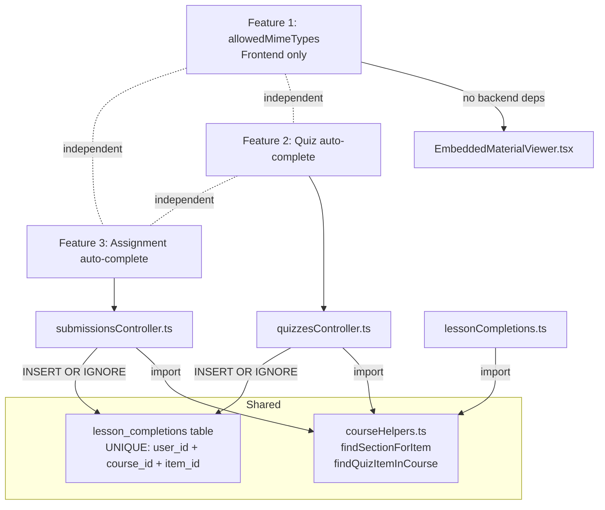
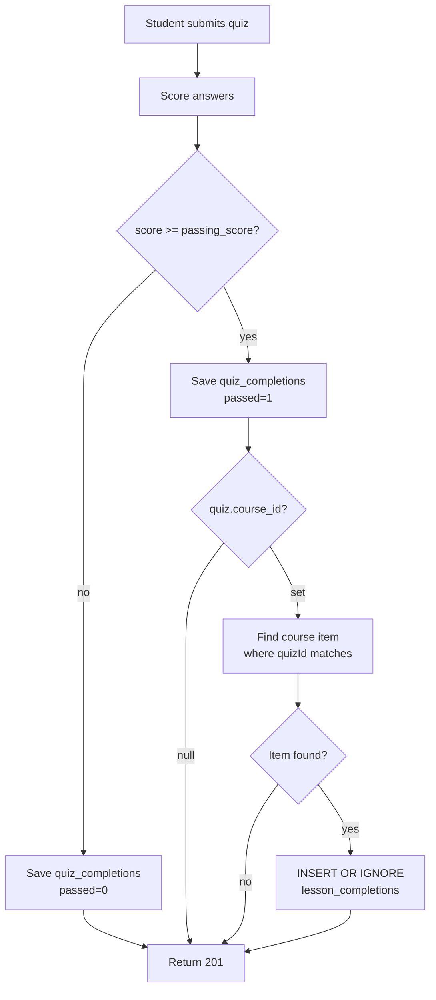
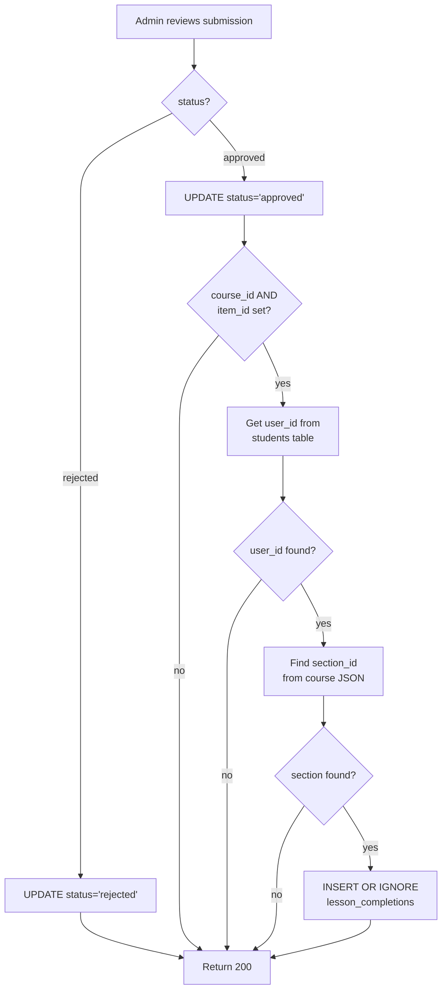
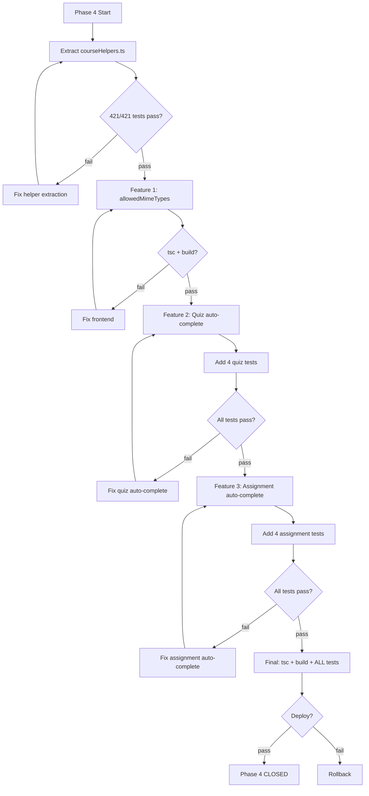

# Phase 4 Spec: Smart Completion + Enhanced Interactions

**Date:** 2026-08-03
**Status:** SPEC READY
**Baseline:** Phase 3 closed (`c817192`), 421/421 backend tests, site live
**Scope:** 3 features — allowedMimeTypes display, quiz auto-complete, assignment auto-complete

---

## 1. Problem Statement

Phase 3 added student viewer rendering for audio, quiz, assignment, and download items. All items use click-to-complete — the student must manually click each item to mark progress. This creates a disconnect:

- A student passes a quiz but must also click the quiz course item separately to get credit
- An admin approves a submission but the student must click the assignment item to complete it
- Assignment items don't show which file types are accepted

Phase 4 closes these gaps with automatic completion and better metadata display.

---

## 2. Goals

1. Show accepted file types on assignment items so students know what to upload
2. Auto-mark quiz course items complete when the student passes the linked quiz
3. Auto-mark assignment course items complete when an admin approves the linked submission

## 3. Non-Goals

- No audio playback tracking (Phase 5+ — requires new progress model)
- No inline quiz taking (student navigates to quiz page)
- No inline assignment submission (student navigates to submissions page)
- No admin course builder changes
- No new item types
- No Phase 3 rework
- No frontend progress push (auto-completions visible on next page load — acceptable for v1)

---

## 4. User Stories

### US-1: File Type Hints

> As a student viewing an assignment course item, I want to see which file types are accepted so I know what format to upload before navigating to the submissions page.

### US-2: Quiz Auto-Complete

> As a student who passes a quiz linked to a course item, I want the course item to automatically mark as complete so I don't have to click it separately.

### US-3: Assignment Auto-Complete

> As a student whose assignment submission is approved by an admin or lecturer, I want the course item to automatically mark as complete so my progress reflects the approval.

---

## 5. Feature Specifications

### Feature 1: allowedMimeTypes Display

**Type:** Frontend-only
**File:** `LMS-Frontend/src/components/EmbeddedMaterialViewer.tsx`
**Insertion point:** After line 351 (after the `maxFileSize` block, before the "Go to submissions" link)

#### Behavior

| Condition | Rendering |
|-----------|-----------|
| `allowedMimeTypes` is a non-empty array | Show "Accepted formats: PDF, DOCX, ..." below file size hint |
| `allowedMimeTypes` is an empty array | No file type hint shown |
| `allowedMimeTypes` is undefined/missing | No file type hint shown |

#### MIME Type Display Mapping

Display user-friendly labels, not raw MIME types:

| MIME Type | Display |
|-----------|---------|
| `application/pdf` | PDF |
| `application/vnd.openxmlformats-officedocument.wordprocessingml.document` | DOCX |
| `application/vnd.openxmlformats-officedocument.spreadsheetml.sheet` | XLSX |
| `application/vnd.openxmlformats-officedocument.presentationml.presentation` | PPTX |
| `image/jpeg` | JPEG |
| `image/png` | PNG |
| `image/gif` | GIF |
| `text/plain` | TXT |
| `text/csv` | CSV |
| Any other | Show the part after `/` (e.g., `application/zip` → `ZIP`) |

#### Implementation

```tsx
{(() => {
  const mimeTypes = (item as { allowedMimeTypes?: string[] }).allowedMimeTypes;
  if (!mimeTypes?.length) return null;
  const MIME_LABELS: Record<string, string> = {
    'application/pdf': 'PDF',
    'application/vnd.openxmlformats-officedocument.wordprocessingml.document': 'DOCX',
    'application/vnd.openxmlformats-officedocument.spreadsheetml.sheet': 'XLSX',
    'application/vnd.openxmlformats-officedocument.presentationml.presentation': 'PPTX',
    'image/jpeg': 'JPEG',
    'image/png': 'PNG',
    'image/gif': 'GIF',
    'text/plain': 'TXT',
    'text/csv': 'CSV',
  };
  const labels = mimeTypes.map(m => MIME_LABELS[m] || m.split('/').pop()?.toUpperCase() || m);
  return (
    <p className="text-xs text-neutral-500">
      Accepted formats: {labels.join(', ')}
    </p>
  );
})()}
```

#### Edge Cases

| Case | Behavior |
|------|----------|
| `allowedMimeTypes: []` | No display (empty array treated as undefined) |
| `allowedMimeTypes: ["application/pdf"]` | "Accepted formats: PDF" |
| Unknown MIME type `"application/octet-stream"` | "Accepted formats: OCTET-STREAM" |
| Both `maxFileSize` and `allowedMimeTypes` set | Both shown (file size first, then formats) |

#### Backward Compatibility

No existing assignment items have `allowedMimeTypes` set in production. Adding the display is safe — it renders nothing when the field is absent.

---

### Feature 2: Quiz Auto-Complete on Pass

**Type:** Backend
**File:** `LMS-Server/src/controllers/quizzesController.ts`
**Insertion point:** After line 427 (after quiz_completions re-fetch), before line 431 (NFT mint check)

#### Data Flow

```
Student submits quiz answers
  → quizzesController.submitQuiz()
    → scoreSubmission() → score, total
    → passed = score >= passing_score ? 1 : 0
    → INSERT quiz_completions
    → [NEW] if passed && quiz.course_id:
        → find course item where item.quizId === quizId
        → find section containing that item
        → INSERT OR IGNORE lesson_completions
    → [existing] NFT mint check
    → 201 response
```

#### Behavioral Rules

| Condition | Action |
|-----------|--------|
| Student passes quiz AND quiz has `course_id` AND course has item with `quizId` matching | INSERT OR IGNORE into `lesson_completions` |
| Student fails quiz | No completion INSERT |
| Quiz has no `course_id` (NULL) | No completion INSERT, no error |
| Quiz has `course_id` but no matching item in course sections | No completion INSERT, no error |
| Student already has completion for this item | INSERT OR IGNORE silently skips (UNIQUE constraint) |
| Student re-submits quiz and passes again | Idempotent — existing completion preserved |

#### Implementation

```typescript
// After line 427 in submitQuiz(), before the NFT mint check:
if (passed === 1 && quiz.course_id) {
  try {
    const course = queryOne<{ sections: string }>(
      'SELECT sections FROM courses WHERE id = ?',
      [quiz.course_id]
    );
    if (course?.sections) {
      const sections: CourseSection[] = JSON.parse(course.sections || '[]');
      for (const section of sections) {
        const quizItem = section.items.find(
          (it) => it.type === 'quiz' && (it as { quizId?: string }).quizId === quizId
        );
        if (quizItem) {
          execute(
            `INSERT OR IGNORE INTO lesson_completions (id, user_id, course_id, item_id, section_id, marked_by)
             VALUES (?, ?, ?, ?, ?, NULL)`,
            [uuidv4(), userId, quiz.course_id, quizItem.id, section.id]
          );
          break; // Found the item, stop searching
        }
      }
    }
  } catch (err) {
    // Auto-complete is best-effort — log but don't fail the quiz submission
    console.error('[quiz-auto-complete] error:', err);
  }
}
```

#### Key Design Decisions

1. **Best-effort:** Auto-complete failure must NOT fail the quiz submission. Wrap in try/catch, log errors.
2. **`marked_by = NULL`:** Distinguishes auto-completions from manual marks (manual marks set `marked_by = callerId`).
3. **`break` after first match:** A quiz can only be linked to one course item per course. Stop after finding it.
4. **No frontend changes:** The student sees the auto-completion on next page load when `lesson_completions` is fetched.

#### Dependencies

| Dependency | Location | Verified |
|------------|----------|----------|
| `quiz.course_id` field | `quizzes` table, schema.sql:176 | Yes — `course_id TEXT REFERENCES courses(id)` |
| `courses.sections` JSON | `courses` table | Yes — contains `CourseSection[]` |
| `CourseSection` type | `types/index.ts` | Yes — has `items: CourseItem[]` |
| `lesson_completions` table | database.ts:390-406 | Yes — has UNIQUE(user_id, course_id, item_id) |
| `findSectionForItem()` helper | lessonCompletions.ts:22-34 | Exists but not exported — will inline similar logic |

---

### Feature 3: Assignment Auto-Complete on Approval

**Type:** Backend
**File:** `LMS-Server/src/controllers/submissionsController.ts`
**Insertion point:** After line 537 (after student name fetch), before line 539 (`res.json()`)

#### Data Flow

```
Admin/lecturer reviews submission → status = 'approved'
  → submissionsController.reviewSubmission()
    → UPDATE submissions SET status = 'approved'
    → [NEW] if status === 'approved' && submission.course_id && submission.item_id:
        → get user_id from students table via student_id
        → find section containing item_id in course JSON
        → INSERT OR IGNORE lesson_completions
    → response
```

#### Behavioral Rules

| Condition | Action |
|-----------|--------|
| Status = 'approved' AND `course_id` AND `item_id` are set | INSERT OR IGNORE into `lesson_completions` |
| Status = 'rejected' | No completion INSERT |
| `course_id` is NULL | No completion INSERT, no error |
| `item_id` is NULL | No completion INSERT, no error |
| `student_id` has no linked `user_id` | No completion INSERT, no error |
| Student already has completion for this item | INSERT OR IGNORE silently skips |
| Admin re-approves same submission | Idempotent — existing completion preserved |

#### Implementation

```typescript
// After line 537 in reviewSubmission(), before res.json():
if (status === 'approved' && submission!.course_id && submission!.item_id) {
  try {
    const studentRecord = queryOne<{ user_id: string | null }>(
      'SELECT user_id FROM students WHERE id = ?',
      [submission!.student_id]
    );
    if (studentRecord?.user_id) {
      const course = queryOne<{ sections: string }>(
        'SELECT sections FROM courses WHERE id = ?',
        [submission!.course_id]
      );
      if (course?.sections) {
        const sectionId = findSectionForItem(course.sections, submission!.item_id);
        if (sectionId) {
          execute(
            `INSERT OR IGNORE INTO lesson_completions (id, user_id, course_id, item_id, section_id, marked_by)
             VALUES (?, ?, ?, ?, ?, NULL)`,
            [uuidv4(), studentRecord.user_id, submission!.course_id, submission!.item_id, sectionId]
          );
        }
      }
    }
  } catch (err) {
    // Auto-complete is best-effort — log but don't fail the review
    console.error('[assignment-auto-complete] error:', err);
  }
}
```

#### Key Design Decisions

1. **Best-effort:** Same as quiz — auto-complete failure must NOT fail the submission review.
2. **`marked_by = NULL`:** Same convention — NULL means system-initiated.
3. **`student_id` → `user_id` lookup:** The `students` table has `user_id` (FK to `users.id`). Must be non-NULL.
4. **`findSectionForItem` reuse:** Extract or import the helper from lessonCompletions.ts (currently not exported). Or inline the same logic.
5. **No frontend changes:** Same as quiz — visible on next page load.

#### Dependencies

| Dependency | Location | Verified |
|------------|----------|----------|
| `submission.course_id` | `submissions` table, schema.sql:62 | Yes — nullable TEXT |
| `submission.item_id` | `submissions` table, schema.sql:64 | Yes — nullable TEXT |
| `students.user_id` | `students` table, schema.sql:37 | Yes — FK to users(id), nullable |
| `courses.sections` JSON | `courses` table | Yes |
| `findSectionForItem()` | lessonCompletions.ts:22-34 | Exists, needs export or duplication |

---

## 6. Shared Infrastructure

### `findSectionForItem` Helper

Both Features 2 and 3 need to resolve `section_id` from course JSON. The helper already exists in `lessonCompletions.ts:22-34` but is not exported.

**Decision:** Export the existing `findSectionForItem` function from `lessonCompletions.ts` and import it in both controllers. Alternatively, extract it to a shared utility file.

**Recommended approach:** Move to `src/utils/courseHelpers.ts` (new file) since both controllers need it and it's a pure function with no dependencies.

```typescript
// src/utils/courseHelpers.ts
import type { CourseSection } from '../types/index.js';

/** Find the section that contains itemId. Returns sectionId or null. */
export function findSectionForItem(sectionsJson: string, itemId: string): string | null {
  try {
    const sections: CourseSection[] = JSON.parse(sectionsJson || '[]');
    for (const section of sections) {
      if (section.items.some((item) => item.id === itemId)) {
        return section.id;
      }
    }
  } catch { /* invalid JSON */ }
  return null;
}

/** Find item by quizId in course sections. Returns { itemId, sectionId } or null. */
export function findQuizItemInCourse(
  sectionsJson: string,
  quizId: string
): { itemId: string; sectionId: string } | null {
  try {
    const sections: CourseSection[] = JSON.parse(sectionsJson || '[]');
    for (const section of sections) {
      const quizItem = section.items.find(
        (it) => it.type === 'quiz' && (it as { quizId?: string }).quizId === quizId
      );
      if (quizItem) return { itemId: quizItem.id, sectionId: section.id };
    }
  } catch { /* invalid JSON */ }
  return null;
}
```

Then update `lessonCompletions.ts` to import from the shared module instead of defining its own copy.

---

## 7. Files Touched

| File | Change Type | Feature |
|------|------------|---------|
| `LMS-Frontend/src/components/EmbeddedMaterialViewer.tsx` | Modify (add ~15 lines) | F1: allowedMimeTypes |
| `LMS-Server/src/utils/courseHelpers.ts` | Create (~25 lines) | F2+F3: shared helper |
| `LMS-Server/src/routes/lessonCompletions.ts` | Modify (import helper, remove local copy) | F2+F3: refactor |
| `LMS-Server/src/controllers/quizzesController.ts` | Modify (add ~20 lines) | F2: quiz auto-complete |
| `LMS-Server/src/controllers/submissionsController.ts` | Modify (add ~20 lines) | F3: assignment auto-complete |
| `LMS-Server/src/__tests__/quiz-auto-complete.test.ts` | Create (~80 lines) | F2: tests |
| `LMS-Server/src/__tests__/assignment-auto-complete.test.ts` | Create (~80 lines) | F3: tests |

**Total:** 2 new files, 5 modified files. ~240 lines of new code + tests.

---

## 8. Acceptance Criteria

### Feature 1: allowedMimeTypes Display

| ID | Criterion | Verification |
|----|-----------|-------------|
| F1-AC1 | Assignment with `allowedMimeTypes: ["application/pdf", "application/vnd.openxmlformats-officedocument.wordprocessingml.document"]` shows "Accepted formats: PDF, DOCX" | Manual QA |
| F1-AC2 | Assignment with empty `allowedMimeTypes: []` shows no format hint | Manual QA |
| F1-AC3 | Assignment with no `allowedMimeTypes` field shows no format hint | Manual QA |
| F1-AC4 | Assignment with unknown MIME type shows uppercase suffix | Manual QA |
| F1-AC5 | Both `maxFileSize` and `allowedMimeTypes` shown together | Manual QA |
| F1-AC6 | Existing assignment items render unchanged | Regression |

### Feature 2: Quiz Auto-Complete

| ID | Criterion | Verification |
|----|-----------|-------------|
| F2-AC1 | Pass quiz linked to course item → `lesson_completions` row created | Automated test |
| F2-AC2 | Fail quiz → no `lesson_completions` row | Automated test |
| F2-AC3 | Quiz with no `course_id` → no error, no completion | Automated test |
| F2-AC4 | Quiz with `course_id` but no matching item → no error, no completion | Automated test |
| F2-AC5 | Re-submit passing quiz → idempotent (still 1 row) | Automated test |
| F2-AC6 | Auto-complete failure → quiz submission still succeeds | Automated test |
| F2-AC7 | Existing quiz submission tests still pass | Regression |
| F2-AC8 | `marked_by` is NULL for auto-completions | Automated test |

### Feature 3: Assignment Auto-Complete

| ID | Criterion | Verification |
|----|-----------|-------------|
| F3-AC1 | Approve submission with `course_id` + `item_id` → `lesson_completions` row created | Automated test |
| F3-AC2 | Reject submission → no `lesson_completions` row | Automated test |
| F3-AC3 | Submission with no `course_id` → no error, no completion | Automated test |
| F3-AC4 | Submission with no `item_id` → no error, no completion | Automated test |
| F3-AC5 | Re-approve → idempotent (still 1 row) | Automated test |
| F3-AC6 | Auto-complete failure → review still succeeds | Automated test |
| F3-AC7 | Existing submission review tests still pass | Regression |
| F3-AC8 | `marked_by` is NULL for auto-completions | Automated test |
| F3-AC9 | `student_id` with no `user_id` → no error, no completion | Automated test |

---

## 9. Test Strategy

### Automated Tests to Add

#### `quiz-auto-complete.test.ts` (4 tests)

```typescript
describe('Quiz auto-complete on pass', () => {
  // Setup: create course with quiz item (quizId points to quiz with course_id set)
  // Setup: create quiz with course_id = course.id, passing_score = 70
  // Setup: create student user enrolled in course

  it('creates lesson_completion when student passes linked quiz', async () => {
    // POST /api/v1/quizzes/:id/submit with passing answers
    // Assert: 201 response
    // Assert: lesson_completions has 1 row for (userId, courseId, quizItemId)
    // Assert: row.marked_by is NULL
  });

  it('does not create lesson_completion when student fails quiz', async () => {
    // POST /api/v1/quizzes/:id/submit with failing answers
    // Assert: 201 response (completion saved, but not passed)
    // Assert: lesson_completions has 0 rows for this item
  });

  it('does not error when quiz has no course_id', async () => {
    // Create quiz without course_id
    // POST /api/v1/quizzes/:id/submit with passing answers
    // Assert: 201 response
    // Assert: lesson_completions unchanged
  });

  it('is idempotent on re-submission', async () => {
    // Submit passing quiz twice
    // Assert: lesson_completions has exactly 1 row (not 2)
  });
});
```

#### `assignment-auto-complete.test.ts` (4 tests)

```typescript
describe('Assignment auto-complete on approval', () => {
  // Setup: create course with assignment item
  // Setup: create submission with course_id and item_id set
  // Setup: create student with user_id linked

  it('creates lesson_completion when submission is approved', async () => {
    // PATCH /api/v1/submissions/:id with status='approved'
    // Assert: 200 response
    // Assert: lesson_completions has 1 row for (userId, courseId, itemId)
    // Assert: row.marked_by is NULL
  });

  it('does not create lesson_completion when submission is rejected', async () => {
    // PATCH /api/v1/submissions/:id with status='rejected', feedback='...'
    // Assert: 200 response
    // Assert: lesson_completions has 0 rows for this item
  });

  it('handles submission with no course_id gracefully', async () => {
    // Create submission without course_id
    // PATCH /api/v1/submissions/:id with status='approved'
    // Assert: 200 response
    // Assert: lesson_completions unchanged
  });

  it('is idempotent on re-approval', async () => {
    // Approve same submission twice
    // Assert: lesson_completions has exactly 1 row
  });
});
```

### Regression Coverage

| Existing Test File | Tests | Must Still Pass |
|--------------------|-------|----------------|
| quiz-security.test.ts | 8 | Yes |
| quizzes-fk.test.ts | 2 | Yes |
| regression-nav-quiz.test.ts | 6 | Yes |
| regression-student-submission.test.ts | 7 | Yes |
| submission-delete-rbac.test.ts | 2 | Yes |
| phase-d-lessons.test.ts | varies | Yes |
| courseCompletion.test.ts | varies | Yes |
| **All 421 tests** | 421 | **Yes — baseline gate** |

### Manual QA

| Feature | Check | Steps |
|---------|-------|-------|
| F1 | allowedMimeTypes renders | Admin creates assignment item with mime types → student sees "Accepted formats: PDF, DOCX" |
| F1 | Empty mime types | Admin creates assignment with no mime types → no format hint shown |
| F2 | Quiz auto-complete | Student passes quiz → refreshes course page → item shows green checkbox |
| F2 | Quiz fail | Student fails quiz → item NOT auto-completed |
| F3 | Approval auto-complete | Admin approves submission → student refreshes → item shows green checkbox |
| F3 | Rejection | Admin rejects → item NOT auto-completed |

---

## 10. Mermaid Diagrams

### Feature Dependency Map



### Quiz Auto-Complete Flow



### Assignment Auto-Complete Flow



### Verification / Test Gate Flow



---

## 11. Risks and Assumptions

### Validated Assumptions

| Assumption | Status | Evidence |
|------------|--------|----------|
| `allowedMimeTypes` exists in frontend type | Confirmed | `course.ts:62` — `allowedMimeTypes?: string[]` |
| `lesson_completions` schema supports auto-complete | Confirmed | Has `marked_by` nullable, UNIQUE constraint |
| Quiz has `course_id` column | Confirmed | `schema.sql:176` — `course_id TEXT REFERENCES courses(id)` |
| Submission has `course_id` + `item_id` | Confirmed | `schema.sql:62-64` |
| `students.user_id` maps to `users.id` | Confirmed | `schema.sql:37` |
| `findSectionForItem` helper exists | Confirmed | `lessonCompletions.ts:22-34` |

### Remaining Risks

| Risk | Severity | Mitigation |
|------|----------|------------|
| `quiz.course_id` may be NULL for old quizzes | Low | Guard: `if (passed === 1 && quiz.course_id)` |
| `submissions.course_id` / `item_id` may be NULL for old submissions | Low | Guard: `if (status === 'approved' && submission.course_id && submission.item_id)` |
| `students.user_id` may be NULL for orphan students | Low | Guard: `if (studentRecord?.user_id)` |
| Auto-complete INSERT fails (DB error, malformed JSON) | Low | Best-effort: try/catch, log error, don't fail parent operation |
| Multiple courses contain same quizId | Very low | `quiz.course_id` points to one course; search only that course's sections |
| Frontend progress doesn't update until page refresh | Acceptable | Documented non-goal for v1 |

---

## 12. Rollout and Compatibility

### Backward Compatibility

| Concern | Assessment |
|---------|-----------|
| Existing quiz submissions | Unaffected — auto-complete is additive, only triggers on new submissions |
| Existing submission reviews | Unaffected — auto-complete is additive |
| Old assignments without `allowedMimeTypes` | Render unchanged (guard: `if (!mimeTypes?.length) return null`) |
| `lesson_completions` duplicates | Impossible — UNIQUE constraint + INSERT OR IGNORE |
| `findSectionForItem` extraction | Existing behavior unchanged — same function, just moved |

### Deploy Sequence

1. Backend first: extract helper, add auto-complete to both controllers, run tests
2. Frontend: add allowedMimeTypes display
3. Build: `docker compose build web && docker compose up -d --no-deps web`
4. Verify: all tests pass, site loads, API healthy

### Rollback

Phase 4 is mostly backend. Rollback:
```bash
git revert HEAD~N..HEAD   # revert Phase 4 commits
docker compose build web && docker compose up -d --no-deps web
cd LMS-Server && npx vitest run  # verify clean state
```

Auto-completions already written to `lesson_completions` would persist but cause no harm — they're valid completion records.

---

## 13. To-Do Lists

### Spec Checklist

- [x] Problem statement
- [x] Goals and non-goals
- [x] User stories (3)
- [x] Feature specifications (3)
- [x] Shared infrastructure (courseHelpers.ts)
- [x] Files touched
- [x] Acceptance criteria (23 total)
- [x] Test strategy
- [x] Mermaid diagrams (4)
- [x] Risks and assumptions
- [x] Rollout and compatibility

### Feature Checklist

- [ ] F1: allowedMimeTypes display (~15 lines, frontend)
- [ ] F2: Quiz auto-complete (~20 lines, backend)
- [ ] F3: Assignment auto-complete (~20 lines, backend)
- [ ] Shared: courseHelpers.ts extraction (~25 lines)
- [ ] Shared: lessonCompletions.ts refactor (import helper)

### Backend Test Checklist

- [ ] quiz-auto-complete.test.ts: pass → completion created
- [ ] quiz-auto-complete.test.ts: fail → no completion
- [ ] quiz-auto-complete.test.ts: no course_id → no error
- [ ] quiz-auto-complete.test.ts: idempotent re-submission
- [ ] assignment-auto-complete.test.ts: approved → completion created
- [ ] assignment-auto-complete.test.ts: rejected → no completion
- [ ] assignment-auto-complete.test.ts: no course_id → no error
- [ ] assignment-auto-complete.test.ts: idempotent re-approval
- [ ] All 421 existing tests still pass

### Frontend Test Checklist

- [ ] Manual QA: allowedMimeTypes renders with known types
- [ ] Manual QA: allowedMimeTypes empty → no display
- [ ] Manual QA: allowedMimeTypes absent → no display

### QA Checklist

- [ ] Quiz pass → auto-complete visible on page refresh
- [ ] Quiz fail → no auto-complete
- [ ] Submission approved → auto-complete visible on page refresh
- [ ] Submission rejected → no auto-complete
- [ ] Old courses unaffected

### Risk Checklist

- [x] No schema changes needed
- [x] INSERT OR IGNORE prevents duplicates
- [x] Best-effort pattern prevents cascading failures
- [x] NULL guards on all nullable fields
- [x] `quiz.course_id` confirmed in schema
- [x] `submissions.course_id` + `item_id` confirmed in schema

---

## 14. Review Checklist

Before implementation planning, verify:

| Check | Status |
|-------|--------|
| Scope matches approved Phase 4 candidates (3 features) | Yes |
| Audio tracking explicitly excluded | Yes |
| All insertion points verified with line numbers | Yes |
| All table schemas confirmed | Yes |
| `findSectionForItem` reuse approach decided | Yes — extract to shared utility |
| Test strategy covers pass, fail, NULL, idempotency | Yes |
| Best-effort error handling specified | Yes |
| `marked_by = NULL` convention documented | Yes |
| Frontend sync limitation documented as non-goal | Yes |
| Rollback plan defined | Yes |
| Backward compatibility confirmed | Yes |
| All 23 acceptance criteria have verification method | Yes |

---

## 15. /loop Workflow

```
/loop assess  — Read this spec, confirm scope and assumptions
/loop spec    — Review acceptance criteria and test strategy
/loop review  — Check for gaps, contradictions, missing edge cases
/loop plan    — Write implementation plan from this spec
```

---

## 16. Final Recommendation

**Status: PHASE 4 SPEC READY**

**Key finding that simplifies implementation:** Quizzes have a `course_id` column (schema.sql:176). This eliminates the biggest risk from planning — no need to scan all courses to find which one references a quiz. The quiz directly points to its course.

**Exact next action:** Write the Phase 4 implementation plan using the writing-plans skill. All feature behaviors, insertion points, code snippets, and test cases are defined.
