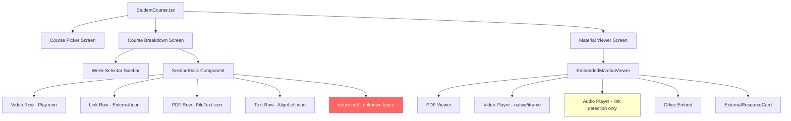
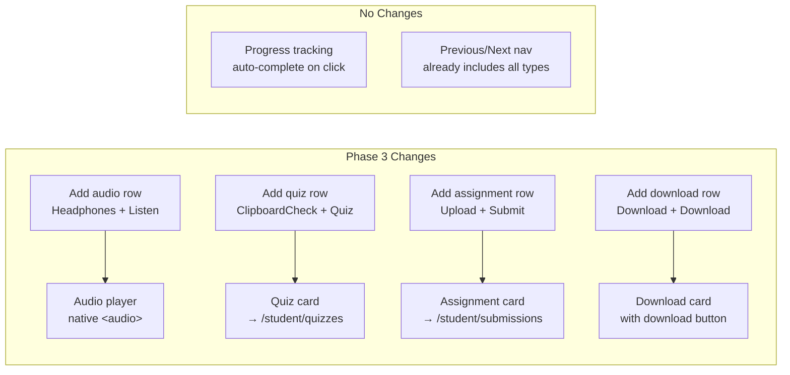
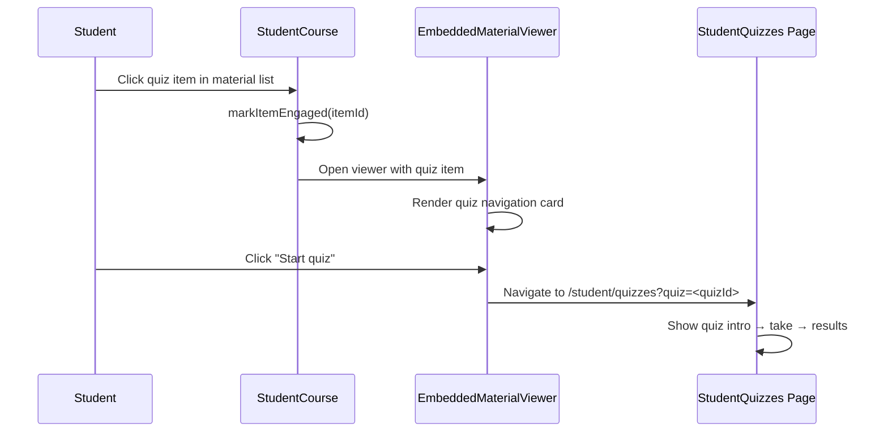
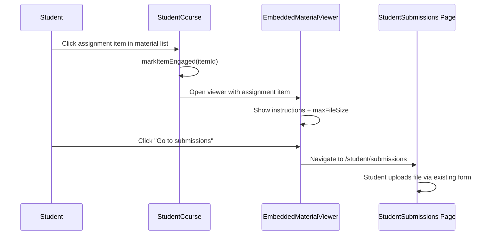
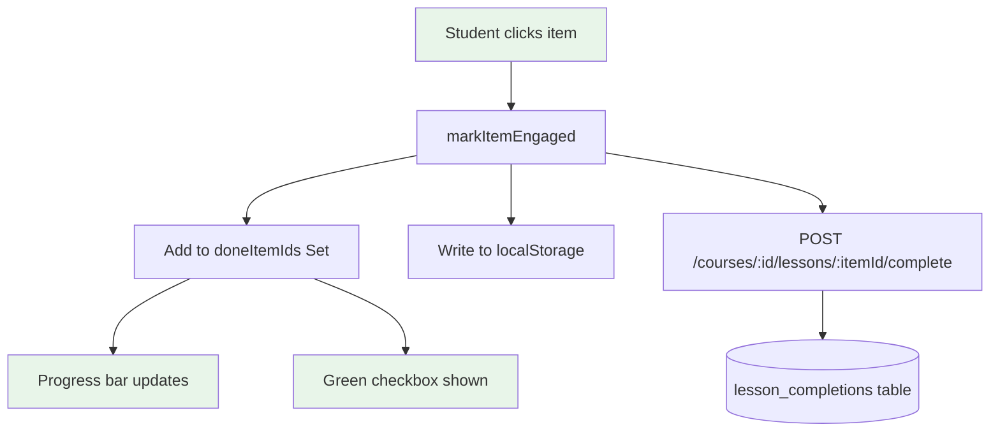
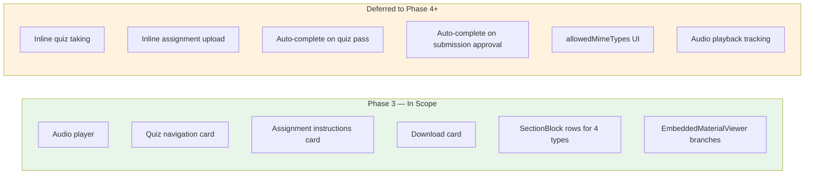

# Phase 3: Student Viewer — New Item Type Rendering

**Date:** 2026-08-03
**Status:** Implementation-Ready Spec
**Parent:** `2026-08-03-course-module-content-schema-spec.md`
**Prerequisite:** Phase 2 complete (admin builder supports all 8 types, 421/421 tests green)
**Scope:** Student-facing rendering of audio, quiz, assignment, download items in the course viewer

---

## Table of Contents

1. [Summary](#1-summary)
2. [Scope and Non-Goals](#2-scope-and-non-goals)
3. [Current Student Viewer Architecture](#3-current-student-viewer-architecture)
4. [Approved Approach](#4-approved-approach)
5. [Audio Item Rendering](#5-audio-item-rendering)
6. [Quiz Item Rendering](#6-quiz-item-rendering)
7. [Assignment Item Rendering](#7-assignment-item-rendering)
8. [Download Item Rendering](#8-download-item-rendering)
9. [Progress Integration](#9-progress-integration)
10. [Empty, Error, and Loading States](#10-empty-error-and-loading-states)
11. [Permission and Visibility Rules](#11-permission-and-visibility-rules)
12. [Backward Compatibility](#12-backward-compatibility)
13. [Acceptance Criteria](#13-acceptance-criteria)
14. [Test Plan](#14-test-plan)
15. [Manual QA Checklist](#15-manual-qa-checklist)
16. [Rollback Approach](#16-rollback-approach)
17. [Mermaid Diagrams](#17-mermaid-diagrams)
18. [To-Do Lists](#18-to-do-lists)
19. [Loop Workflow](#19-loop-workflow)
20. [Deferred Items](#20-deferred-items)
21. [Review Notes](#21-review-notes)
22. [Worktree Plan](#22-worktree-plan)

---

## 1. Summary

Phase 3 makes the 4 new course item types (audio, quiz, assignment, download) visible and interactive for students in `StudentCourse.tsx` and `EmbeddedMaterialViewer.tsx`. Currently, these items exist in course JSON but are rendered as `null` in the material list (invisible to students) and have no branch in the embedded viewer.

**Key changes:**
- Add 4 new item rows in `SectionBlock` (icons, labels, click handlers)
- Add 4 new render branches in `EmbeddedMaterialViewer`
- Quiz items navigate to existing `/student/quizzes?quiz=<quizId>` page
- Assignment items show instructions + link to submissions page
- Audio items render native `<audio>` player inline
- Download items show a download card with filename and link
- Progress tracking (lesson completion) works automatically — no changes needed

**Files modified:** 2 (`StudentCourse.tsx`, `EmbeddedMaterialViewer.tsx`)

---

## 2. Scope and Non-Goals

### In Scope (Phase 3)

- Student material list rows for audio, quiz, assignment, download (icons + labels + click)
- EmbeddedMaterialViewer branches for all 4 new types
- Audio: native `<audio>` player with controls
- Quiz: navigation card linking to existing quiz page with course context
- Assignment: instructions display + "Go to submissions" link
- Download: download card with filename, file size if available, and download button
- New icon imports in StudentCourse.tsx (Headphones, ClipboardCheck, Upload, Download)

### Non-Goals (Deferred)

| Feature | Deferred To | Reason |
|---------|-------------|--------|
| Inline quiz taking inside course viewer | Future | Quiz page already fully functional; embedding adds complexity |
| Inline assignment submission form | Future | Submissions page already handles uploads; avoid duplication |
| `allowedMimeTypes` enforcement in UI | Phase 4 | Field exists but no visual validation |
| Auto-mark quiz complete on pass | Phase 4 | Requires quiz → course item linkage callback |
| Auto-mark assignment complete on submit | Phase 4 | Requires submission → course item linkage callback |
| Drag-and-drop item reorder (student view) | Separate | Unrelated to rendering |
| Navigation/sidebar restructure | Phase 5 | Out of scope |

---

## 3. Current Student Viewer Architecture

### File: `LMS-Frontend/src/pages/StudentCourse.tsx` (1,110 lines)

Three-screen flow:
1. **Course picker** — lists enrolled courses with progress
2. **Course breakdown** — week/section sidebar + material list
3. **Material viewer** — `EmbeddedMaterialViewer` overlay

### Touch Points for Each Item Type

| # | Touch Point | Location | Current State |
|---|-------------|----------|---------------|
| 1 | `SectionBlock` item rows | Lines 986-1087 | 4 type branches (video, link, pdf, text) + `return null` fallback |
| 2 | `EmbeddedMaterialViewer` render branches | Lines 183-280 | Handles pdf, video, link+video, link+audio, link+office, link/text generic |
| 3 | `flatItemsForCourse()` path builder | Lines 94-104 | Includes ALL items regardless of type (no change needed) |
| 4 | `markItemEngaged()` auto-complete | Lines 457-470 | Works for any item ID (no change needed) |
| 5 | `openMaterialViewer()` | Lines 472-476 | Opens any item in viewer (no change needed) |

### File: `LMS-Frontend/src/components/EmbeddedMaterialViewer.tsx` (284 lines)

Shared material viewer used by `StudentCourse.tsx`. Props: `section`, `item`, `onClose`, `onPrev`, `onNext`.

### Key Architectural Facts

1. **`flatItemsForCourse()` already includes all types** — new items are already in the learning path, progress bar, and Previous/Next navigation. The gap is only rendering.
2. **`markItemEngaged()` already works for any item** — clicking any item marks it complete. No special handling needed per type.
3. **`SectionBlock` returns `null` for unknown types** — new items are silently invisible. Adding render branches makes them visible.
4. **EmbeddedMaterialViewer** has no type-switch — it uses cascading if-else on `item.type`. New branches fit the same pattern.

### Code Hotspots

| File | Line Range | What | Risk |
|------|-----------|------|------|
| `StudentCourse.tsx` | 986-1087 | `SectionBlock` item rendering | Must add 4 new branches before `return null` |
| `StudentCourse.tsx` | 11-24 | lucide-react imports | Must add Headphones, ClipboardCheck, Upload, Download |
| `EmbeddedMaterialViewer.tsx` | 15-21 | `externalUrlForItem()` | Must handle audio, download URLs |
| `EmbeddedMaterialViewer.tsx` | 182-280 | Main render body | Must add 4 new branches |
| `EmbeddedMaterialViewer.tsx` | 1-13 | Imports | Must add new icons |

---

## 4. Approved Approach

**Inline extension** — same as Phase 2. Add branches to existing conditional rendering in both files. No new component files. No architectural refactoring.

**Why:** SectionBlock follows a clear pattern (if type → return JSX). EmbeddedMaterialViewer follows the same pattern. Adding 4 branches each is ~80-100 lines total.

### Design Decisions

| Decision | Choice | Reason |
|----------|--------|--------|
| Quiz rendering | Link to existing quiz page | Quiz page is complete with intro/take/results flow; no duplication |
| Assignment rendering | Show instructions + link to submissions | Submissions page handles file upload; avoid building upload form twice |
| Audio rendering | Native `<audio>` in EmbeddedMaterialViewer | Same pattern as existing link-type audio detection, but with explicit type |
| Download rendering | Download card with button | Simple, clear action; mirrors ExternalResourceCard pattern |

---

## 5. Audio Item Rendering

### SectionBlock Row

```tsx
if (item.type === 'audio') {
  return (
    <div key={item.id} id={`course-item-${item.id}`}
      {...materialRowA11y(item)}
      className={materialRowClass(item.id)}
    >
      <MaterialDoneToggle itemId={item.id} />
      <div className={`${ICON_BOX} bg-purple-50 text-purple-600 border border-purple-100`}>
        <Headphones className="h-5 w-5" aria-hidden />
      </div>
      <div className="min-w-0">
        <span className="font-medium text-neutral-800 block leading-snug">{item.title}</span>
        {item.description && (
          <p className="text-sm text-neutral-500 mt-0.5 leading-snug line-clamp-2">{item.description}</p>
        )}
      </div>
      <span className="text-sm text-accent-teal font-semibold shrink-0">Listen</span>
    </div>
  );
}
```

**Icon:** Headphones (purple, matches AdminCoursePreview)
**Label:** "Listen"

### EmbeddedMaterialViewer

The viewer already handles audio when detected via `isDirectAudioFileUrl()` on link-type items (lines 227-250). For explicit `audio` type, reuse the same pattern:

```tsx
// After the link+audio branch, add:
item.type === 'audio' ? (
  <div className="flex flex-col items-center gap-5 py-8 px-4">
    <span className="flex h-16 w-16 items-center justify-center rounded-2xl bg-purple-50 text-purple-600">
      <Music className="h-8 w-8" aria-hidden />
    </span>
    <p className="text-base font-semibold text-neutral-800">{item.title}</p>
    <audio controls preload="metadata" className="w-full max-w-lg" src={item.url}>
      Your browser does not support the audio element.
    </audio>
    <a href={item.url} target="_blank" rel="noopener noreferrer"
      className="text-xs text-accent-teal font-medium hover:underline flex items-center gap-1">
      <ExternalLink className="h-3 w-3" aria-hidden />
      Download audio file
    </a>
  </div>
)
```

### `externalUrlForItem()` Update

Add audio URL extraction:
```typescript
if (item.type === 'audio') return item.url.trim();
```

### Progress

Auto-completed on click (existing `markItemEngaged` handles this).

---

## 6. Quiz Item Rendering

### SectionBlock Row

```tsx
if (item.type === 'quiz') {
  return (
    <div key={item.id} id={`course-item-${item.id}`}
      {...materialRowA11y(item)}
      className={materialRowClass(item.id)}
    >
      <MaterialDoneToggle itemId={item.id} />
      <div className={`${ICON_BOX} bg-amber-50 text-amber-600 border border-amber-100`}>
        <ClipboardCheck className="h-5 w-5" aria-hidden />
      </div>
      <div className="min-w-0">
        <span className="font-medium text-neutral-800 block leading-snug">{item.title}</span>
        {item.description && (
          <p className="text-sm text-neutral-500 mt-0.5 leading-snug line-clamp-2">{item.description}</p>
        )}
      </div>
      <span className="text-sm text-accent-teal font-semibold shrink-0">Quiz</span>
    </div>
  );
}
```

**Icon:** ClipboardCheck (amber, matches AdminCoursePreview)
**Label:** "Quiz"

### EmbeddedMaterialViewer — Quiz Navigation Card

When a student clicks a quiz item, the viewer shows a card that links to the existing quiz page:

```tsx
item.type === 'quiz' ? (
  <div className="flex flex-col items-center gap-5 py-8 px-4">
    <span className="flex h-16 w-16 items-center justify-center rounded-2xl bg-amber-50 text-amber-600">
      <ClipboardCheck className="h-8 w-8" aria-hidden />
    </span>
    <p className="text-base font-semibold text-neutral-800">{item.title}</p>
    {item.description?.trim() && (
      <p className="text-sm text-neutral-600 max-w-prose text-center leading-relaxed">{item.description}</p>
    )}
    <a
      href={`/student/quizzes?quiz=${(item as { quizId?: string }).quizId ?? ''}`}
      className="inline-flex items-center justify-center gap-2 rounded-lg bg-amber-500 px-5 py-3 text-sm font-semibold text-white shadow-sm hover:bg-amber-600 transition-colors min-w-[200px]"
    >
      <ClipboardCheck className="h-4 w-4 shrink-0" aria-hidden />
      Start quiz
    </a>
    <p className="text-xs text-neutral-500">
      The quiz opens on the Quizzes page. Your progress is tracked there.
    </p>
  </div>
)
```

### Quiz Edge Cases

| Scenario | Behavior |
|----------|----------|
| `quizId` is empty/missing | Show "Quiz not configured" message |
| Quiz has been deleted | Quiz page shows "not found" (existing behavior) |
| Student already completed quiz | "Start quiz" still works (retake allowed) |
| New course (no quizId) | Admin should set quizId — student sees empty state |

### Progress

Auto-completed on click (opens viewer). Actual quiz pass/fail is tracked separately on the quiz page. Future Phase 4 could auto-mark complete on quiz pass.

---

## 7. Assignment Item Rendering

### SectionBlock Row

```tsx
if (item.type === 'assignment') {
  return (
    <div key={item.id} id={`course-item-${item.id}`}
      {...materialRowA11y(item)}
      className={materialRowClass(item.id)}
    >
      <MaterialDoneToggle itemId={item.id} />
      <div className={`${ICON_BOX} bg-blue-50 text-blue-600 border border-blue-100`}>
        <Upload className="h-5 w-5" aria-hidden />
      </div>
      <div className="min-w-0">
        <span className="font-medium text-neutral-800 block leading-snug">{item.title}</span>
        {item.description && (
          <p className="text-sm text-neutral-500 mt-0.5 leading-snug line-clamp-2">{item.description}</p>
        )}
      </div>
      <span className="text-sm text-accent-teal font-semibold shrink-0">Submit</span>
    </div>
  );
}
```

**Icon:** Upload (blue, matches AdminCoursePreview)
**Label:** "Submit"

### EmbeddedMaterialViewer — Assignment Instructions Card

```tsx
item.type === 'assignment' ? (
  <div className="flex flex-col items-center gap-5 py-8 px-4">
    <span className="flex h-16 w-16 items-center justify-center rounded-2xl bg-blue-50 text-blue-600">
      <Upload className="h-8 w-8" aria-hidden />
    </span>
    <p className="text-base font-semibold text-neutral-800">{item.title}</p>
    {item.description?.trim() && (
      <div className="text-sm text-neutral-700 max-w-prose text-center leading-relaxed whitespace-pre-wrap">
        {item.description}
      </div>
    )}
    {(item as { maxFileSize?: number }).maxFileSize ? (
      <p className="text-xs text-neutral-500">
        Max file size: {Math.round(((item as { maxFileSize: number }).maxFileSize) / 1048576)} MB
      </p>
    ) : null}
    <a
      href="/student/submissions"
      className="inline-flex items-center justify-center gap-2 rounded-lg bg-blue-600 px-5 py-3 text-sm font-semibold text-white shadow-sm hover:bg-blue-700 transition-colors min-w-[200px]"
    >
      <Upload className="h-4 w-4 shrink-0" aria-hidden />
      Go to submissions
    </a>
    <p className="text-xs text-neutral-500">
      Submit your work on the Submissions page.
    </p>
  </div>
)
```

### Assignment Edge Cases

| Scenario | Behavior |
|----------|----------|
| No description | Only title and submit button shown |
| `maxFileSize` is set | Show "Max file size: X MB" below description |
| `maxFileSize` is 0/absent | Don't show file size hint |
| `allowedMimeTypes` | Not shown in Phase 3 (deferred) |

### Progress

Auto-completed on click (opens viewer). Future Phase 4 could auto-mark complete when a matching submission is approved.

---

## 8. Download Item Rendering

### SectionBlock Row

```tsx
if (item.type === 'download') {
  return (
    <div key={item.id} id={`course-item-${item.id}`}
      {...materialRowA11y(item)}
      className={materialRowClass(item.id)}
    >
      <MaterialDoneToggle itemId={item.id} />
      <div className={`${ICON_BOX} bg-green-50 text-green-600 border border-green-100`}>
        <Download className="h-5 w-5" aria-hidden />
      </div>
      <div className="min-w-0">
        <span className="font-medium text-neutral-800 block leading-snug">{item.title}</span>
        {(item as { fileName?: string }).fileName && (
          <p className="text-sm text-neutral-500 mt-0.5 leading-snug line-clamp-1">
            {(item as { fileName: string }).fileName}
          </p>
        )}
      </div>
      <span className="text-sm text-accent-teal font-semibold shrink-0">Download</span>
    </div>
  );
}
```

**Icon:** Download (green, matches AdminCoursePreview)
**Label:** "Download"

### EmbeddedMaterialViewer — Download Card

Download items can use either `documentId` (LMS-hosted) or `fileUrl` (direct URL).

```tsx
item.type === 'download' ? (
  (() => {
    const dlItem = item as { documentId?: string; fileUrl?: string; fileName?: string };
    const downloadUrl = dlItem.documentId
      ? `/api/v1/documents/${dlItem.documentId}/download`
      : dlItem.fileUrl?.trim() || null;
    const displayName = dlItem.fileName || item.title;
    return (
      <div className="flex flex-col items-center gap-5 py-8 px-4">
        <span className="flex h-16 w-16 items-center justify-center rounded-2xl bg-green-50 text-green-600">
          <Download className="h-8 w-8" aria-hidden />
        </span>
        <p className="text-base font-semibold text-neutral-800">{item.title}</p>
        {item.description?.trim() && (
          <p className="text-sm text-neutral-600 max-w-prose text-center leading-relaxed">{item.description}</p>
        )}
        <p className="text-sm text-neutral-500 font-mono">{displayName}</p>
        {downloadUrl ? (
          <a href={downloadUrl} download={displayName}
            target="_blank" rel="noopener noreferrer"
            className="inline-flex items-center justify-center gap-2 rounded-lg bg-green-600 px-5 py-3 text-sm font-semibold text-white shadow-sm hover:bg-green-700 transition-colors min-w-[200px]">
            <Download className="h-4 w-4 shrink-0" aria-hidden />
            Download file
          </a>
        ) : (
          <p className="text-sm text-neutral-500">No file is attached to this download item.</p>
        )}
      </div>
    );
  })()
)
```

### `externalUrlForItem()` Update

Add download URL extraction:
```typescript
if (item.type === 'download') {
  const dl = item as { fileUrl?: string };
  return dl.fileUrl?.trim() || null;
}
```

### Download Edge Cases

| Scenario | Behavior |
|----------|----------|
| `documentId` set | Use `/api/v1/documents/:id/download` (authenticated download) |
| `fileUrl` set (no documentId) | Direct download link |
| Both set | `documentId` takes priority |
| Neither set | Show "No file attached" message |
| `fileName` missing | Fall back to item title |

### Progress

Auto-completed on click (opens viewer).

---

## 9. Progress Integration

### No Backend Changes Needed

The existing progress system already works for all item types:

1. **`flatItemsForCourse()`** (line 94) includes ALL items regardless of type — new items are already in the learning path count
2. **`markItemEngaged()`** (line 457) marks any item ID as complete — works for audio, quiz, assignment, download
3. **`courseCompletionService.markLessonComplete()`** accepts any item ID — backend already stores it
4. **Progress bar** counts done items / total items — new items are already in the denominator

### What Changes

The only change is that new items are now **visible** in the material list. Previously they were invisible (`return null`) so students could never click them. Now they can click → auto-mark → progress updates.

### Certificate Requirements

The existing `course_completion_requirements.require_all_lessons` flag counts all items. Adding visibility to new types means:
- If a course requires all lessons and has quiz/assignment items, students must click those items to mark them complete
- This is correct behavior — engaging with the item = lesson completion
- Quiz pass/fail and assignment approval are tracked separately and are NOT part of lesson completion in Phase 3

### Future Phase 4: Smart Completion

| Item Type | Current (Phase 3) | Future (Phase 4) |
|-----------|-------------------|-------------------|
| Audio | Click = complete | Could track playback progress |
| Quiz | Click = complete | Could auto-complete on quiz pass |
| Assignment | Click = complete | Could auto-complete on submission approval |
| Download | Click = complete | Could track actual download |

---

## 10. Empty, Error, and Loading States

### Per-Type Empty States

| Type | Empty Condition | Message |
|------|----------------|---------|
| Audio | `item.url` is empty/missing | "No audio file is attached to this item." |
| Quiz | `item.quizId` is empty/missing | "This quiz has not been configured yet." |
| Assignment | No description AND no maxFileSize | Still show submit button (description is optional) |
| Download | No `documentId` AND no `fileUrl` | "No file is attached to this download item." |

### General Error States

- If course data fails to load, existing error handling applies (no change needed)
- If a quiz ID points to a deleted quiz, the quiz page handles the error (no change needed)
- If a document download returns 404, the browser handles the error (no change needed)

---

## 11. Permission and Visibility Rules

### No New Permission Logic

All items in a course are visible to enrolled students. The existing course membership check controls access. New item types inherit the same visibility rules.

### Course-Scoped Resources

- Download items with `documentId` use the existing authenticated download endpoint (`/api/v1/documents/:id/download`) which verifies the student's access to the document
- Quiz items link to quizzes filtered by `courseId` — the quiz page already checks quiz access
- Assignment items link to the general submissions page — no course scoping in Phase 3

---

## 12. Backward Compatibility

### Guarantee 1: Old courses render unchanged

Courses with only video/link/pdf/text items render identically. No changes to existing SectionBlock branches or EmbeddedMaterialViewer branches.

### Guarantee 2: New items become visible

Items that were previously invisible (`return null`) now render with icons, labels, and click handlers. This is additive — no existing behavior changes.

### Guarantee 3: Progress counting is unaffected

`flatItemsForCourse()` already included new items. Making them visible doesn't change the total count — it only means students can now engage with them and mark them complete.

---

## 13. Acceptance Criteria

### AC-1: Audio item visibility
- Student sees audio items in the course material list with Headphones icon and "Listen" label
- Clicking opens EmbeddedMaterialViewer with native audio player
- Audio player has controls (play, pause, seek, volume)
- "Download audio file" link shown below player

### AC-2: Quiz item visibility
- Student sees quiz items with ClipboardCheck icon and "Quiz" label
- Clicking opens viewer with quiz navigation card
- "Start quiz" button links to `/student/quizzes?quiz=<quizId>`
- Help text explains quiz opens on separate page

### AC-3: Assignment item visibility
- Student sees assignment items with Upload icon and "Submit" label
- Clicking opens viewer with assignment instructions
- Description is displayed (if set)
- Max file size hint is shown (if set)
- "Go to submissions" button links to `/student/submissions`

### AC-4: Download item visibility
- Student sees download items with Download icon and "Download" label
- Clicking opens viewer with download card
- File name is displayed
- "Download file" button triggers download (documentId or fileUrl)

### AC-5: Progress works for new types
- Clicking any new item type marks it as complete (green checkbox)
- Progress bar updates
- Lesson completion syncs to server

### AC-6: Previous/Next navigation includes new types
- New items appear in the linear learning path
- Previous/Next buttons navigate through audio, quiz, assignment, download items

### AC-7: Old items unchanged
- Video, link, pdf, text items render and behave identically to before

---

## 14. Test Plan

### 14.1 Backend Tests (No New Tests Needed)

Phase 2 already has 6 backend roundtrip tests for new item types. Backend stores sections as opaque JSON — the student viewer is purely frontend.

### 14.2 Integration Tests (Possible Future)

If the project adds frontend component tests (e.g., with Testing Library), these would be valuable:
- Render SectionBlock with audio item → expect Headphones icon visible
- Render SectionBlock with quiz item → expect ClipboardCheck icon visible
- Render EmbeddedMaterialViewer with audio item → expect `<audio>` element
- Render EmbeddedMaterialViewer with download item → expect download link

### 14.3 Manual Verification Matrix

| Test | Steps | Expected |
|------|-------|----------|
| Audio in list | Admin creates course with audio item → student views course | Audio item visible with Headphones icon and "Listen" label |
| Audio player | Student clicks audio item | Native audio player with controls appears |
| Quiz in list | Admin creates course with quiz item | Quiz item visible with ClipboardCheck icon and "Quiz" label |
| Quiz navigation | Student clicks quiz item → clicks "Start quiz" | Navigates to `/student/quizzes?quiz=<id>` |
| Assignment in list | Admin creates course with assignment item | Assignment item visible with Upload icon and "Submit" label |
| Assignment card | Student clicks assignment item | Instructions + "Go to submissions" button shown |
| Download in list | Admin creates course with download item | Download item visible with Download icon and "Download" label |
| Download action | Student clicks download → clicks "Download file" | File downloads (authenticated if documentId, direct if fileUrl) |
| Progress | Click each new type → check progress bar | Progress increases, green checkbox shows |
| Previous/Next | Navigate through mixed-type course | All 8 types navigable with Previous/Next |
| Old items | View course with only old types | No change in behavior |

---

## 15. Manual QA Checklist

### Audio
- [ ] Audio item appears in material list
- [ ] Headphones icon (purple) shown
- [ ] Click opens audio player
- [ ] Audio plays when clicked
- [ ] "Download audio file" link works
- [ ] Progress marks on click

### Quiz
- [ ] Quiz item appears in material list
- [ ] ClipboardCheck icon (amber) shown
- [ ] Click opens quiz card
- [ ] "Start quiz" button navigates to quiz page
- [ ] Empty quizId shows error state
- [ ] Progress marks on click

### Assignment
- [ ] Assignment item appears in material list
- [ ] Upload icon (blue) shown
- [ ] Click opens assignment instructions
- [ ] Description text displays
- [ ] Max file size hint shows (when set)
- [ ] "Go to submissions" link works
- [ ] Progress marks on click

### Download
- [ ] Download item appears in material list
- [ ] Download icon (green) shown
- [ ] Click opens download card
- [ ] File name displayed
- [ ] "Download file" button works (documentId path)
- [ ] "Download file" button works (fileUrl path)
- [ ] No-file state shows message
- [ ] Progress marks on click

### Compatibility
- [ ] Old course (video+pdf only) renders unchanged
- [ ] Mixed course (old+new types) renders all items
- [ ] Progress bar counts all items (including new types)
- [ ] Previous/Next navigation includes new types

---

## 16. Rollback Approach

Phase 3 changes are entirely frontend. Rollback:

1. Revert SectionBlock changes in StudentCourse.tsx
2. Revert EmbeddedMaterialViewer changes
3. Redeploy frontend

**Data safety:** New items remain in course JSON. They become invisible again (return null), but no data loss. Progress marks are preserved.

---

## 17. Mermaid Diagrams

### 17.1 Current Student Course Viewer Architecture



### 17.2 Phase 3 New Item Rendering Flow



### 17.3 Quiz Interaction Flow



### 17.4 Assignment Submission Flow



### 17.5 Progress Update Flow



### 17.6 Scope vs Deferred



---

## 18. To-Do Lists

### Architecture Assessment
- [x] Identify StudentCourse.tsx SectionBlock rendering pattern
- [x] Identify EmbeddedMaterialViewer branching pattern
- [x] Confirm flatItemsForCourse includes all types
- [x] Confirm markItemEngaged works for any item
- [x] Confirm progress tracking needs no backend changes
- [x] Confirm quiz page exists and is functional
- [x] Confirm submissions page exists and is functional

### Implementation Checklist
- [ ] Add icon imports to StudentCourse.tsx (Headphones, ClipboardCheck, Upload, Download)
- [ ] Add audio row to SectionBlock
- [ ] Add quiz row to SectionBlock
- [ ] Add assignment row to SectionBlock
- [ ] Add download row to SectionBlock
- [ ] Add icon imports to EmbeddedMaterialViewer.tsx
- [ ] Update externalUrlForItem() for audio and download
- [ ] Add audio player branch to EmbeddedMaterialViewer
- [ ] Add quiz card branch to EmbeddedMaterialViewer
- [ ] Add assignment card branch to EmbeddedMaterialViewer
- [ ] Add download card branch to EmbeddedMaterialViewer

### Progress Integration Checklist
- [x] flatItemsForCourse already includes new types
- [x] markItemEngaged already works for any item
- [x] courseCompletionService.markLessonComplete accepts any itemId
- [x] Progress bar calculates done / total correctly
- [ ] Verify progress updates in browser after implementation

### Quiz Behavior Checklist
- [ ] Quiz card shows title and description
- [ ] "Start quiz" links to correct URL
- [ ] Empty quizId shows error state
- [ ] Quiz page opens correctly from link

### Assignment Integration Checklist
- [ ] Assignment card shows description
- [ ] Max file size hint displays (when set)
- [ ] "Go to submissions" links to /student/submissions
- [ ] Instructions preserve whitespace (whitespace-pre-wrap)

### Testing Checklist
- [ ] TypeScript check passes
- [ ] Frontend build succeeds
- [ ] Backend tests still pass (421/421)
- [ ] Manual QA: audio playback
- [ ] Manual QA: quiz navigation
- [ ] Manual QA: assignment instructions
- [ ] Manual QA: download file
- [ ] Manual QA: old item compatibility
- [ ] Manual QA: progress tracking

### Manual QA Checklist
(See Section 15 above — 28 individual checks)

### Rollout Checklist
- [ ] Merge Phase 2 branch to main first
- [ ] Create Phase 3 feature branch
- [ ] Implement changes
- [ ] Run verification gates
- [ ] Deploy frontend
- [ ] Run browser QA
- [ ] Confirm no regressions

---

## 19. Loop Workflow

```
/loop assess    — Read spec, confirm architecture, identify code hotspots
/loop spec      — Write Phase 3 spec (this document)
/loop plan      — Create implementation plan with ordered tasks
/loop implement — Execute tasks with TDD and review gates
/loop verify    — Run all verification gates (tests, tsc, build, browser QA)
/loop review    — Final branch review before merge
/loop close     — Confirm completion, update closeout doc
```

---

## 20. Deferred Items

### Phase 4: Smart Completion + Enhanced Interactions

| Item | Description |
|------|-------------|
| Auto-complete quiz on pass | When student passes a quiz linked to a course item, auto-mark the lesson complete |
| Auto-complete assignment on approval | When an assignment submission is approved, auto-mark the lesson complete |
| `allowedMimeTypes` display | Show accepted file types on assignment instructions card |
| Audio playback progress | Track how much of the audio file was played |

### Future: Inline Interactions

| Item | Description |
|------|-------------|
| Inline quiz taking | Embed the quiz-taking UI directly in the course viewer |
| Inline assignment submission | Embed a file upload form in the course viewer |
| Inline quiz creation in builder | Create quizzes without leaving the course builder |

### Separate Features

| Item | Description |
|------|-------------|
| Navigation/sidebar restructure | Phase 5 — high-risk user-facing change |
| Drag-and-drop reorder | Unrelated to item types |
| Component extraction | Cleanup task, not a feature |

---

## 21. Review Notes

### Assumptions

1. The existing quiz page (`/student/quizzes`) handles all quiz interaction — Phase 3 only links to it
2. The existing submissions page (`/student/submissions`) handles all file upload — Phase 3 only links to it
3. `markItemEngaged` (click = complete) is acceptable for all new types in Phase 3
4. Download items with `documentId` use the existing authenticated download endpoint
5. Audio items always have a direct URL (not a documentId) — matching the admin builder's audio form
6. The `information` field already renders correctly in EmbeddedMaterialViewer for all types (universal header)

### Unknowns

1. **Download authentication:** Do LMS document downloads require the student to be enrolled in the course, or just authenticated? (Need to verify `documentsController` access logic)
2. **Quiz URL stability:** Does the quiz page handle unknown/invalid quizId gracefully? (Likely yes — it would show "no quiz found")
3. **Audio file hosting:** Where are audio files hosted? If behind auth, the `<audio src>` may need token injection (same as PDF viewer pattern)

### Risky Areas

1. **SectionBlock `return null` removal** — Currently unknown types return null. After Phase 3, only truly unknown types (not in the 8-type set) return null. If a future Phase 4 type is added to the backend but not the frontend, it would be invisible — but this is the existing behavior, not a regression.
2. **Download with `documentId`** — The download URL `/api/v1/documents/:id/download` must work for the student. If the document has course-scoped access, the student must be enrolled. This should work via existing access control.
3. **Quiz `quizId` validity** — If an admin links a quiz that is later deleted, the student clicks "Start quiz" and sees an error on the quiz page. This is acceptable degradation.

### Code Hotspots (Implementation Risk Map)

| File | Area | Risk | Mitigation |
|------|------|------|------------|
| `StudentCourse.tsx:986-1087` | SectionBlock | Must add 4 branches before `return null` | Follow exact existing pattern |
| `StudentCourse.tsx:11-24` | Imports | Must not break existing imports | Add to end of import list |
| `EmbeddedMaterialViewer.tsx:182-280` | Main render | Must add branches in correct position | Add before final fallback |
| `EmbeddedMaterialViewer.tsx:15-21` | `externalUrlForItem` | Must handle audio and download | Add two new if-returns |

### Questions Resolved

| Question (from Phase 2 closeout) | Answer |
|---|---|
| Which new types should render first? | All 4 together — they're all simple additive branches |
| Quiz rendering: embed or link? | Link to existing quiz page |
| Assignment submission: inline or redirect? | Redirect to submissions page |
| Download behavior: direct or preview? | Direct download card |
| EmbeddedMaterialViewer: extend or create? | Extend with new branches |

---

## 22. Worktree Plan

### Proposed Branch
```
feat/student-viewer-new-item-types
```

### Prerequisites
1. Phase 2 branch (`feat/course-builder-new-item-types`) must be merged to main first
2. Phase 3 branch should fork from the merge commit
3. Do not create the branch until implementation planning is complete

### Estimated Scope
- 2 files modified
- ~100-120 lines added
- 0 backend changes
- 0 new files
