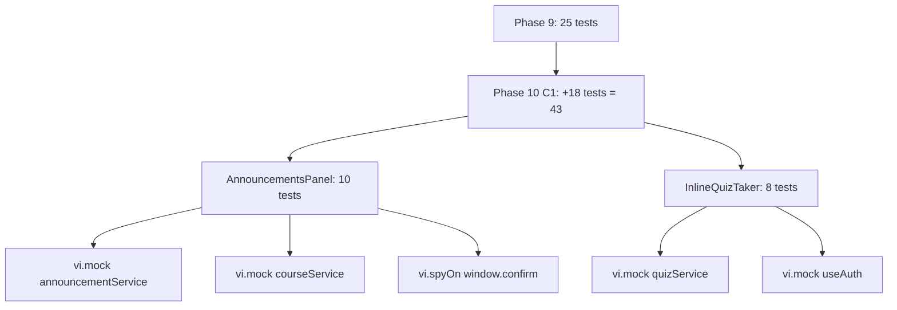
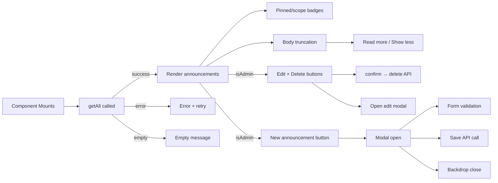
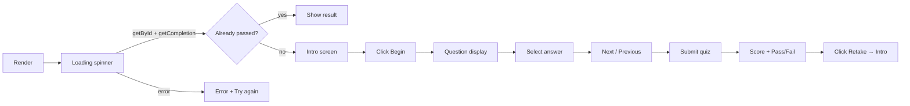
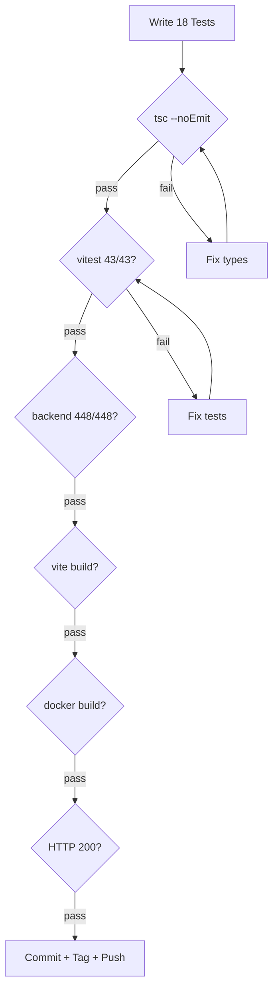

# Phase 10 C1 — Component Tests Expansion (AnnouncementsPanel + InlineQuizTaker)

**Date:** 2026-08-04
**Status:** SPEC READY
**Depends on:** Phase 9 (frontend test infrastructure) — RELEASED
**Branch:** `feat/phase10-c1-component-tests-expansion` (to be created at implementation time)

---

## Problem Statement

AnnouncementsPanel (395 lines) and InlineQuizTaker (255 lines) are the two most complex untested interactive frontend components. AnnouncementsPanel has full CRUD operations, modal lifecycle, form validation, and admin/student role branching. InlineQuizTaker has a 6-state state machine, quiz submission flow, and error recovery. Both need mocking of multiple services — a significant step up from the single-service mocking in Phase 9 C2.

**Current state:**
- 25 frontend tests across 4 components (EngagementStats, OnboardingChecklist, StatusBadge, NotificationBell)
- AnnouncementsPanel: **zero tests** — CRUD, modal, validation, role-based UI
- InlineQuizTaker: **zero tests** — state machine, quiz flow, error handling

## Goals

1. Write ~10 tests for AnnouncementsPanel covering load, empty, error, admin UI, body truncation, and CRUD
2. Write ~8 tests for InlineQuizTaker covering all 6 states and the quiz-taking flow
3. Demonstrate multi-service mocking (announcementService + courseService)
4. Demonstrate `useAuth` context mocking for InlineQuizTaker
5. Demonstrate `window.confirm` mocking for delete confirmation
6. No production code changes (test-only commit)

## Non-Goals

- No backend changes
- No feature additions
- No changes to AnnouncementsPanel.tsx or InlineQuizTaker.tsx source
- No test coverage for page-level components (AdminDashboard, etc.)
- No E2E or integration tests

---

## Scope

### In Scope

| Item | Detail |
|------|--------|
| New test file | `src/__tests__/components/AnnouncementsPanel.test.tsx` |
| New test file | `src/__tests__/components/InlineQuizTaker.test.tsx` |
| Test count | ~18 test cases (10 + 8) |
| Mocking | `announcementService`, `courseService`, `quizService`, `useAuth` |
| Browser APIs | `window.confirm` via `vi.spyOn` |

### Out of Scope

| Item | Reason |
|------|--------|
| Backend routes | Already tested (448/448) |
| Other untested components | Scope bounded to 2 components per spec |
| Production code changes | Test-only phase |

### Assumptions

1. `vi.mock('../../services/announcementService')` works for all 4 methods (getAll, create, update, delete)
2. `vi.mock('../../context/useAuth')` can return `{ user: { id: 'u1', name: 'Test' } }` without AuthProvider
3. `vi.spyOn(window, 'confirm').mockReturnValue(true)` works in jsdom for delete confirmation
4. AnnouncementsPanel's `{ Button }` named import renders as a passthrough (confirmed — simple wrapper)
5. InlineQuizTaker's `useAuth` hook can be mocked without the full context tree

---

## Component Analysis

### AnnouncementsPanel.tsx (395 lines) — Testable Behaviors

**Dependencies to mock:**
- `announcementService.getAll()` → `Announcement[]`
- `announcementService.create(data)` → `Announcement`
- `announcementService.update(id, data)` → `Announcement`
- `announcementService.delete(id)` → `void`
- `courseService.fetchCourses()` → `Course[]`

**Props:** `{ isAdmin: boolean }`

| Line(s) | Behavior | Test Case |
|----------|----------|-----------|
| 62-73 | Fetch announcements on mount | AP-1 |
| 160-164 | Loading state | AP-1 |
| 165-169 | Error state with retry | AP-2 |
| 170-175 | Empty state (admin vs student text) | AP-3, AP-4 |
| 196-200 | Pinned badge rendering | AP-5 |
| 202-212 | Scope badge (course vs general) | AP-5 |
| 245-257 | Body truncation + expand/collapse | AP-6 |
| 152-157 | Admin-only "New announcement" button | AP-7 |
| 216-240 | Admin-only edit/delete buttons | AP-7 |
| 101-120 | Save validation + API call | AP-8 |
| 122-133 | Delete with confirm dialog | AP-9 |
| 270-392 | Modal open/close lifecycle | AP-10 |

### InlineQuizTaker.tsx (255 lines) — Testable Behaviors

**Dependencies to mock:**
- `quizService.getById(quizId)` → `Quiz | null`
- `quizService.getCompletion(quizId, userId)` → `QuizCompletion | null`
- `quizService.submitQuiz(quizId, '', answers)` → `QuizCompletion`
- `useAuth()` → `{ user: { id: string } }`

**Props:** `{ quizId: string }`

| Line(s) | Behavior | Test Case |
|----------|----------|-----------|
| 88-95 | Loading state on mount | IQ-1 |
| 21-43 | Fetch quiz + check existing completion | IQ-1, IQ-2 |
| 34 | Already-passed quiz shows result | IQ-2 |
| 119-141 | Intro screen with title + question count | IQ-3 |
| 98-116 | Error state with retry button | IQ-4 |
| 183-253 | Question display + answer selection | IQ-5 |
| 51-61 | Submit quiz → result | IQ-6 |
| 144-170 | Result screen (pass/fail badge, score) | IQ-7 |
| 63-68 | Retake resets state to intro | IQ-8 |

---

## Test Cases

### AnnouncementsPanel Tests

#### AP-1: Loads and displays announcements
**Setup:** Mock `getAll` returning 2 announcements
**Action:** Render with `isAdmin={false}`
**Assert:** Both announcement titles visible; loading state gone

#### AP-2: Shows error state with retry
**Setup:** Mock `getAll` rejecting
**Action:** Render component
**Assert:** "Could not load announcements" visible; "retry" button visible

#### AP-3: Shows student empty state
**Setup:** Mock `getAll` returning empty array
**Action:** Render with `isAdmin={false}`
**Assert:** "No announcements right now" text visible

#### AP-4: Shows admin empty state
**Setup:** Mock `getAll` returning empty array
**Action:** Render with `isAdmin={true}`
**Assert:** "No announcements yet. Create one" text visible

#### AP-5: Renders pinned and scope badges
**Setup:** Mock `getAll` returning 1 pinned general + 1 course-scoped announcement
**Action:** Render component
**Assert:** "Pinned" badge visible; "General" badge visible; course code badge visible

#### AP-6: Truncates long body and toggles expand
**Setup:** Mock `getAll` returning 1 announcement with body > 220 chars
**Action:** Render; click "Read more"
**Assert:** Initially truncated with "..."; after click, full body visible + "Show less" button

#### AP-7: Shows admin-only buttons, hides for students
**Setup:** Mock `getAll` returning 1 announcement
**Action:** Render with `isAdmin={true}`, then render with `isAdmin={false}`
**Assert:** Admin: "New announcement" + edit + delete buttons visible. Student: none of those visible

#### AP-8: Validates form before save
**Setup:** Mock `getAll` returning empty; mock `courseService.fetchCourses`
**Action:** Open create modal; click save without filling title
**Assert:** "Title is required" error visible

#### AP-9: Deletes announcement with confirmation
**Setup:** Mock `getAll` returning 1 announcement; mock `delete` resolving; `vi.spyOn(window, 'confirm').mockReturnValue(true)`
**Action:** Render with `isAdmin={true}`; click delete button
**Assert:** `announcementService.delete` called; announcement removed from list

#### AP-10: Opens and closes create modal
**Setup:** Mock `getAll` returning empty; mock `courseService.fetchCourses`
**Action:** Render with `isAdmin={true}`; click "New announcement"; click backdrop
**Assert:** Modal title "New announcement" appears; after backdrop click, modal gone

### InlineQuizTaker Tests

#### IQ-1: Shows loading state then intro
**Setup:** Mock `getById` returning quiz with 3 questions; mock `getCompletion` returning null
**Action:** Render component
**Assert:** Loading spinner visible initially; then quiz title + "3 questions" visible

#### IQ-2: Shows result immediately if already passed
**Setup:** Mock `getById` returning quiz; mock `getCompletion` returning `{ passed: true, score: 8, total: 10 }`
**Action:** Render component
**Assert:** "80%" score visible; "Passed" badge visible; no intro screen

#### IQ-3: Displays intro with question count and start button
**Setup:** Mock quiz with 2 questions; no prior completion
**Action:** Wait for load
**Assert:** Quiz title visible; "2 questions" text; "Begin" button visible

#### IQ-4: Shows error state when quiz not found
**Setup:** Mock `getById` returning null
**Action:** Render component
**Assert:** "Quiz not found." error visible; "Try again" button visible

#### IQ-5: Navigates between questions and answers
**Setup:** Mock quiz with 2 multiple-choice questions; render + click Begin
**Action:** Select option on Q1; click Next; select option on Q2
**Assert:** "Question 1 of 2" → "Question 2 of 2"; selected options reflected

#### IQ-6: Submits quiz and shows result
**Setup:** Mock quiz with 1 question; mock `submitQuiz` returning `{ passed: true, score: 1, total: 1 }`
**Action:** Begin → answer → Submit
**Assert:** "100%" score visible; "Passed" badge visible

#### IQ-7: Shows fail result with correct styling
**Setup:** Mock `submitQuiz` returning `{ passed: false, score: 2, total: 10 }`
**Action:** Complete quiz flow
**Assert:** "20%" score; "Not passed" badge with red styling

#### IQ-8: Retake resets to intro
**Setup:** Complete a quiz (at result screen)
**Action:** Click "Retake"
**Assert:** Back at intro screen; "Begin" button visible; answers cleared

---

## Touched Files

| File | Action | Lines |
|------|--------|-------|
| `src/__tests__/components/AnnouncementsPanel.test.tsx` | CREATE | ~200 |
| `src/__tests__/components/InlineQuizTaker.test.tsx` | CREATE | ~180 |

**Total production code changes: 0**
**Total test code additions: ~380 lines**

---

## Acceptance Criteria

1. `npx vitest run` passes with **43/43 tests** (25 existing + 18 new)
2. `npx tsc --noEmit` passes clean
3. All 18 test cases cover distinct behavioral branches
4. Mocking patterns follow established conventions (vi.mock, factory helpers, describe/it)
5. No production code changes in the commit
6. Backend tests remain at 448/448
7. Vite production build passes
8. Docker build succeeds
9. Live site returns HTTP 200

---

## Verification Gates

| # | Gate | Command | Expected |
|---|------|---------|----------|
| 1 | Frontend tsc | `npx tsc --noEmit` | Clean |
| 2 | Frontend tests | `npx vitest run` | 43/43 pass |
| 3 | Backend tests | `cd ../LMS-Server && npx vitest run` | 448/448 pass |
| 4 | Vite build | `npx vite build` | Success |
| 5 | Docker build | `docker compose build web` | Success |
| 6 | HTTP 200 | `curl -s -o /dev/null -w "%{http_code}" https://lms.smwebsystems.com/` | 200 |
| 7 | Health | `curl -s -o /dev/null -w "%{http_code}" https://lms.smwebsystems.com/api/v1/health` | 200 |

---

## Mermaid Diagrams

### Test Coverage Dependency Map



### AnnouncementsPanel Test Case Flow



### InlineQuizTaker Test Case Flow



### Verification / Test Gate Flow



---

## To-Do Lists

### Spec Checklist
- [x] Problem statement defined
- [x] Goals and non-goals explicit
- [x] In-scope / out-of-scope documented
- [x] All 18 test cases described with setup/action/assert
- [x] Mocking strategy per component documented
- [x] Edge cases enumerated
- [x] Acceptance criteria listed
- [x] Verification gates defined

### Test Checklist
- [ ] AP-1: Loads and displays announcements
- [ ] AP-2: Error state with retry
- [ ] AP-3: Student empty state
- [ ] AP-4: Admin empty state
- [ ] AP-5: Pinned and scope badges
- [ ] AP-6: Body truncation + expand
- [ ] AP-7: Admin-only buttons
- [ ] AP-8: Form validation
- [ ] AP-9: Delete with confirmation
- [ ] AP-10: Modal open/close
- [ ] IQ-1: Loading → intro
- [ ] IQ-2: Already passed → result
- [ ] IQ-3: Intro with question count
- [ ] IQ-4: Error state
- [ ] IQ-5: Question navigation + answers
- [ ] IQ-6: Submit → pass result
- [ ] IQ-7: Fail result styling
- [ ] IQ-8: Retake resets to intro

### QA Checklist
- [ ] All 43 frontend tests pass (25 + 18)
- [ ] All 448 backend tests pass
- [ ] tsc clean
- [ ] Vite build succeeds
- [ ] Docker build succeeds
- [ ] Live site HTTP 200
- [ ] No production code changes in diff

### Risk Checklist
- [ ] Verify `vi.mock('../../context/useAuth')` provides user without AuthProvider
- [ ] Verify `vi.spyOn(window, 'confirm')` works in jsdom
- [ ] Verify AnnouncementsPanel modal backdrop click is testable
- [ ] Confirm no flaky async timing in quiz submission flow
- [ ] Verify multi-service mocking doesn't interfere between test files

---

## Review Checklist

| Check | Question |
|-------|----------|
| Scope containment | Does the commit contain ONLY test files? |
| Test completeness | Are all major branches of both components covered? |
| Mock isolation | Are mocks cleared in beforeEach for both files? |
| Convention alignment | Do tests follow Phase 9 patterns? |
| Rollback safety | Can both test files be deleted without affecting production? |
| No regressions | Do all 25 existing tests still pass? |

---

## /loop Workflow

```
/loop assess   — Verify Phase 9 baseline: 25/25 frontend, 448/448 backend, tsc clean
/loop spec     — Review this spec for completeness before implementation
/loop review   — Post-implementation: run 7 verification gates, confirm 43/43
/loop plan     — If C1 passes, plan Phase 10 C2 (quiz analytics)
/loop defer    — If blockers found, document and defer
```

---

## Risk Note

**Key assumptions:**
1. `vi.mock('../../context/useAuth')` can return a mock user object without wrapping in AuthProvider
2. `vi.spyOn(window, 'confirm')` works in jsdom (standard vitest pattern)
3. AnnouncementsPanel's `Button` import is a passthrough wrapper — no special mocking needed
4. InlineQuizTaker's async `Promise.all` in useEffect resolves before assertions (handled by `waitFor`)

**Potential coupling risks:**
- None. Test-only commit with zero production code changes.

**Mitigation:** If `useAuth` mock doesn't work without provider, wrap render in a minimal `AuthContext.Provider` with mock value.

---

## Handoff Note

**From Phase 9 (released):**
- 25 tests, 4 components, all mocking patterns established
- vitest 4.1.10, RTL 16.3.2, jsdom 29.1.1

**To Phase 10 C1 (this spec):**
- Add 2 test files (~380 lines total)
- New patterns: multi-service mocking, `window.confirm` spy, `useAuth` context mock, state machine testing
- Target: 43 total frontend tests (25 + 18)
