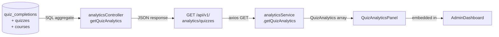
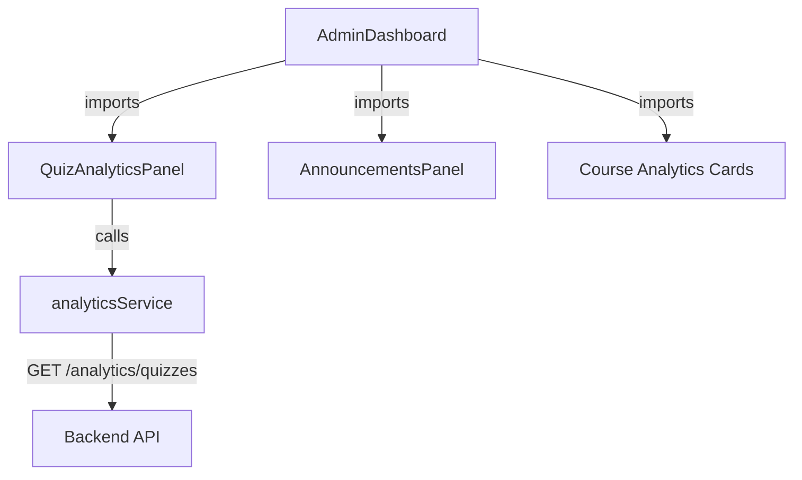
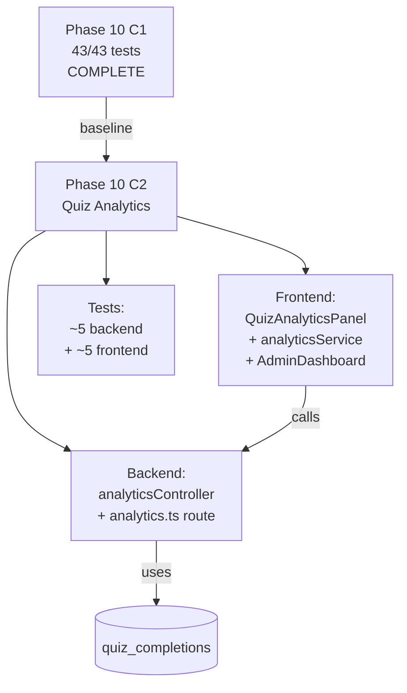
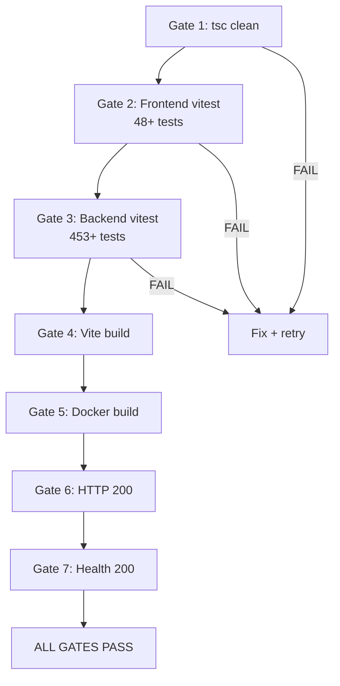
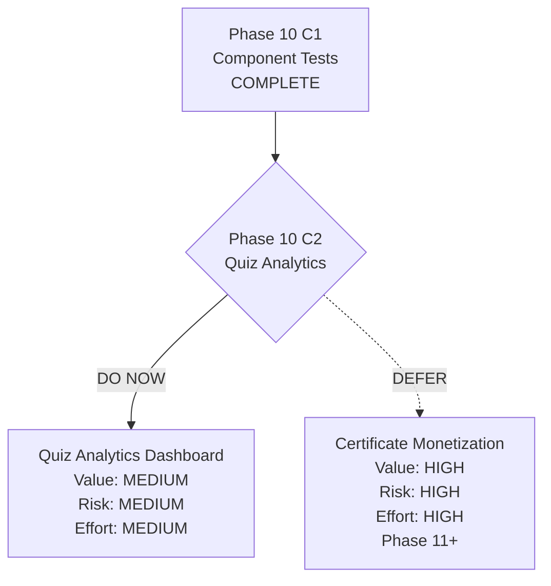
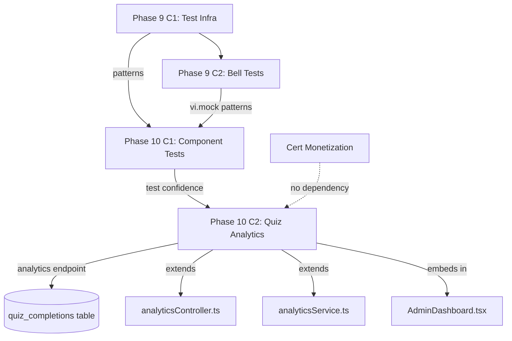
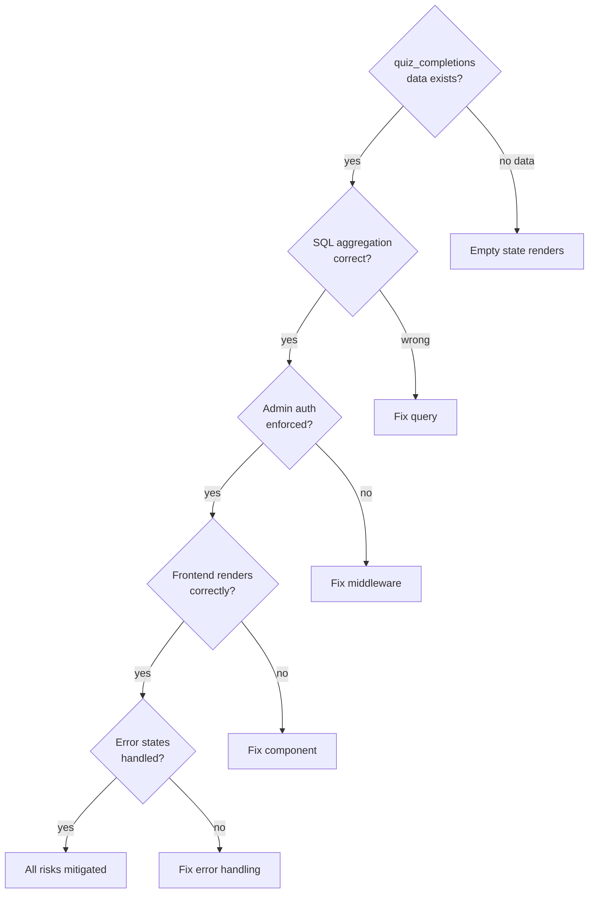

# Phase 10 C2 Spec — Quiz Analytics Dashboard (Summary Only)

**Date:** 2026-08-04
**Phase:** 10 C2
**Approach:** A — Extend existing analytics controller + embed panel in AdminDashboard
**Prereq:** Phase 10 C1 complete (`phase10-c1-complete-2026-08-04`)

---

## Session Kickoff

Phase 10 C1 shipped 18 component tests (43/43 frontend, 448/448 backend, all 7 gates PASS). Phase 10 C2 adds the first feature with both backend and frontend changes: a quiz analytics summary for admins.

### Skills Applied

| Skill | Application |
|-------|-------------|
| find-skills | Confirmed all required skills available |
| brainstorming | Scope selection, approach ranking, design sections |
| writing-plans | Spec structure, acceptance criteria, test gates |
| test-driven-development | Backend + frontend test cases defined before implementation |
| systematic-debugging | Coupling points, failure modes, edge cases identified |
| using-superpowers | C2 branch isolation from released C1 |
| receiving/requesting-code-review | Review checklist included |
| verification-before-completion | 7 verification gates defined |
| executing-plans | Parallel analysis: backend API, frontend component, test strategy |

---

## Scope

### In Scope

- New backend endpoint: `GET /api/v1/analytics/quizzes`
- New controller function: `getQuizAnalytics` in `analyticsController.ts`
- New route registration in `analytics.ts`
- New frontend interface: `QuizAnalytics` in `analyticsService.ts`
- New frontend service method: `getQuizAnalytics()` in `analyticsService.ts`
- New component: `QuizAnalyticsPanel.tsx` (~80-120 lines)
- Embed `QuizAnalyticsPanel` in `AdminDashboard.tsx`
- Backend tests for new endpoint (~5 cases)
- Frontend tests for new component (~5 cases)
- Backend type additions in `types/index.ts`

### Out of Scope

- No question-level analytics (which questions are hardest)
- No time-series charts or trend data
- No charting library
- No student-facing quiz analytics
- No CSV export for quiz analytics
- No new admin nav items or routes
- No schema migrations (uses existing `quiz_completions` table)
- No lecturer-scoped quiz analytics (admin-only)

### Assumptions

1. `quiz_completions` table has sufficient data for aggregation (validated: schema has score, total, passed, completed_at)
2. The existing `authenticate` + `authorize('admin')` middleware on the analytics router covers the new endpoint
3. Quiz count is small (<20) so no pagination needed
4. `UNIQUE(quiz_id, user_id)` constraint means at most one completion row per student per quiz — "attempts" = unique students who completed, not total attempts
5. SQLite `AVG()` and `ROUND()` work correctly for the aggregation query

---

## Phase 10 C1 Release Closeout

### Shipped Features

| Component | Tests | Commit | Tag |
|-----------|-------|--------|-----|
| AnnouncementsPanel | 10 | `46b5afd` | `phase10-c1-complete-2026-08-04` |
| InlineQuizTaker | 8 | `46b5afd` | `phase10-c1-complete-2026-08-04` |

**Total frontend tests: 43/43 PASS** (25 existing + 18 new)
**Backend tests: 448/448 PASS (unchanged)**
**Production code changes: None**

### Verification Summary

| Gate | Result |
|------|--------|
| Frontend tsc | PASS |
| Frontend vitest | 43/43 |
| Backend vitest | 448/448 |
| Vite build | PASS |
| Docker build | PASS |
| HTTP 200 | PASS |
| Health 200 | PASS |

### Rollback Note

```bash
git revert 815ce87   # removes merge commit (test-only, safe)
```

### Manual QA Status

Not performed. Phase 10 C1 was test-only with zero functional changes.

---

## Feature Spec: C2 — Quiz Analytics Dashboard

### Problem Statement

Admins have no visibility into quiz performance. They can see individual quiz completions via `/api/v1/quizzes/completions` but cannot see aggregate statistics like how many students attempted each quiz, what percentage passed, or what the average score is. This information is needed to identify quizzes that may be too hard or too easy, and to track student engagement with course assessments.

### Goals

1. Give admins a quick summary of quiz performance on the existing dashboard
2. Show per-quiz metrics: attempts, pass rate, average score
3. Group quizzes by course (show course code when applicable)
4. Follow existing analytics patterns (controller, service, response shape)

### Non-Goals

- No question-level breakdown
- No time-series or trend charts
- No charting library dependencies
- No student-facing views
- No CSV export
- No pagination (quiz count is small)

---

### Backend API Design

**Endpoint:** `GET /api/v1/analytics/quizzes`

**Auth:** Admin only (inherited from analytics router middleware)

**Controller function:** `getQuizAnalytics` added to `analyticsController.ts`

**SQL query:**
```sql
SELECT
  q.id             AS quiz_id,
  q.title          AS quiz_title,
  q.passing_score,
  c.title          AS course_title,
  c.course_code,
  COUNT(qc.id)     AS attempts,
  SUM(CASE WHEN qc.passed = 1 THEN 1 ELSE 0 END) AS passed_count,
  ROUND(AVG(qc.score), 1) AS avg_score
FROM quizzes q
LEFT JOIN courses c ON c.id = q.course_id
LEFT JOIN quiz_completions qc ON qc.quiz_id = q.id
GROUP BY q.id
ORDER BY q.title
```

**Response shape:**
```json
{
  "success": true,
  "data": {
    "quizzes": [
      {
        "quizId": "q1",
        "quizTitle": "Blockchain Basics",
        "passingScore": 70,
        "courseTitle": "Blockchain Value Creation",
        "courseCode": "BVC-101",
        "attempts": 25,
        "passedCount": 18,
        "passRate": 72.0,
        "avgScore": 74.3
      }
    ]
  }
}
```

**Computation rules:**
- `passRate = attempts > 0 ? round((passedCount / attempts) * 100, 1) : 0`
- `avgScore = attempts > 0 ? round(avg(score), 1) : 0`
- `courseTitle` and `courseCode` are `null` when quiz is not linked to a course

**Route registration:**
```typescript
// In analytics.ts, before export
router.get('/quizzes', getQuizAnalytics);
```

**Backend type:** Add `QuizAnalyticsRow` interface to `analyticsController.ts` (local, not exported to types/index.ts unless needed by tests).

---

### Frontend Design

**Service method** (add to `analyticsService.ts`):

```typescript
export interface QuizAnalytics {
  quizId: string;
  quizTitle: string;
  passingScore: number;
  courseTitle: string | null;
  courseCode: string | null;
  attempts: number;
  passedCount: number;
  passRate: number;
  avgScore: number;
}

async getQuizAnalytics(): Promise<QuizAnalytics[]> {
  const response = await api.get<{ success: boolean; data: { quizzes: QuizAnalytics[] } }>('/analytics/quizzes');
  return response.data?.data?.quizzes ?? [];
}
```

**Component:** `LMS-Frontend/src/components/QuizAnalyticsPanel.tsx`

Structure (~80-120 lines):
- Props: none (self-contained, fetches own data)
- States: `loading` | `error` | `empty` | `data`
- On mount: calls `analyticsService.getQuizAnalytics()`
- Layout: Card with title "Quiz Performance", table inside

Table columns:

| Column | Source | Format |
|--------|--------|--------|
| Quiz | `quizTitle` | Text (truncate at ~40 chars) |
| Course | `courseCode` | Text or "—" if null |
| Attempts | `attempts` | Number |
| Pass Rate | `passRate` | `XX.X%` |
| Avg Score | `avgScore` | `XX.X%` |

**States:**
- **Loading:** Skeleton rows (same pattern as existing dashboard cards)
- **Error:** "Could not load quiz analytics" + retry button
- **Empty:** "No quiz data yet" centered message
- **Data:** Table with rows

**AdminDashboard.tsx changes:**
- Import `QuizAnalyticsPanel`
- Add `<QuizAnalyticsPanel />` below the existing course analytics / sponsor section
- No props needed

---

### Edge Cases

| Case | Behavior |
|------|----------|
| Quiz with 0 completions | Row shows: attempts=0, passRate="0%", avgScore="0%" |
| Quiz not linked to course | courseCode column shows "—" |
| All students fail | passRate=0%, avgScore reflects actual average |
| No quizzes exist | Empty state: "No quiz data yet" |
| API failure | Error state with retry button |
| Long quiz title | CSS truncation with `text-ellipsis` |

### Error/Fallback Behavior

- Network error → show error card with "Could not load quiz analytics" + retry button
- Empty response (no quizzes) → show "No quiz data yet" message
- Partial data (quiz with null course) → display "—" for course column
- No special timeout handling — uses default axios timeout

---

## Mermaid Diagrams

### Data Flow



### Component Structure



### C1 → C2 Handoff Flow



### Verification / Test Gate Flow



### Candidate Ranking Flow



### Dependency Map



### Risk / Test Gate Flow



---

## Acceptance Criteria

### Backend

1. `GET /api/v1/analytics/quizzes` returns `{ success: true, data: { quizzes: [...] } }`
2. Each quiz entry includes: quizId, quizTitle, passingScore, courseTitle, courseCode, attempts, passedCount, passRate, avgScore
3. Quizzes with zero completions return `attempts=0, passRate=0, avgScore=0`
4. Endpoint requires admin authentication (401 unauthenticated, 403 non-admin)
5. Quizzes not linked to a course have `courseTitle=null, courseCode=null`

### Frontend

1. `QuizAnalyticsPanel` renders loading skeleton on mount
2. After data loads, displays table with quiz stats
3. Empty state shows "No quiz data yet" when no quizzes exist
4. Error state shows "Could not load quiz analytics" + retry button
5. Panel is visible on AdminDashboard below existing analytics sections

---

## Test Strategy

### Backend Tests (`LMS-Server/src/__tests__/analytics-quiz.test.ts`)

| ID | Test | Behavior |
|----|------|----------|
| QA-B1 | Returns quiz stats with correct aggregates | Seed quiz + completions, verify response shape and computed values |
| QA-B2 | Returns empty array when no quizzes | No seeded data → `{ quizzes: [] }` |
| QA-B3 | Handles quizzes with zero completions | Seed quiz, no completions → attempts=0, passRate=0, avgScore=0 |
| QA-B4 | Requires admin auth | 401 for unauthenticated, 403 for student role |
| QA-B5 | Includes course info for linked quizzes | Seed quiz with course → courseTitle and courseCode populated |

### Frontend Tests (`LMS-Frontend/src/__tests__/components/QuizAnalyticsPanel.test.tsx`)

| ID | Test | Behavior |
|----|------|----------|
| QA-F1 | Shows loading then data | Mock service, render, verify skeleton then table |
| QA-F2 | Renders quiz stats table | Verify columns: quiz title, course code, attempts, pass rate, avg score |
| QA-F3 | Shows empty state | Empty array → "No quiz data yet" |
| QA-F4 | Shows error with retry | Service rejects → error message + retry button |
| QA-F5 | Displays zero-completion quiz correctly | attempts=0 → shows "0", "0%", "0%" |

### Regression Coverage

- All 43 existing frontend tests must pass
- All 448 existing backend tests must pass
- Existing analytics endpoints (`/dashboard`, `/courses`, `/courses/export`) unchanged

### Manual QA

- Verify QuizAnalyticsPanel renders on AdminDashboard in browser
- Verify data matches actual quiz_completions in production database
- Verify admin-only access (student login should not see the panel)

### Expected Test Counts After C2

- Frontend: 43 + 5 = **48 tests**
- Backend: 448 + 5 = **453 tests**

---

## Touched Files

### Backend (Modified)

| File | Change |
|------|--------|
| `LMS-Server/src/controllers/analyticsController.ts` | Add `getQuizAnalytics` function (~30 lines) |
| `LMS-Server/src/routes/analytics.ts` | Add `router.get('/quizzes', getQuizAnalytics)` (1 line + import) |

### Frontend (Modified)

| File | Change |
|------|--------|
| `LMS-Frontend/src/services/analyticsService.ts` | Add `QuizAnalytics` interface + `getQuizAnalytics()` method (~15 lines) |
| `LMS-Frontend/src/pages/AdminDashboard.tsx` | Import + embed `<QuizAnalyticsPanel />` (~3 lines) |

### New Files

| File | Size |
|------|------|
| `LMS-Frontend/src/components/QuizAnalyticsPanel.tsx` | ~80-120 lines |
| `LMS-Server/src/__tests__/analytics-quiz.test.ts` | ~80-120 lines |
| `LMS-Frontend/src/__tests__/components/QuizAnalyticsPanel.test.tsx` | ~80-120 lines |

### Not Touched

- No schema changes
- No migration files
- No vitest.config changes
- No Docker changes
- No route additions in App.tsx or Layout.tsx

---

## Rollout / Compatibility Notes

- **Backward compatible:** No breaking changes. New endpoint, new component.
- **No migration required:** Uses existing `quiz_completions` table as-is.
- **Deploy sequence:** Standard `docker compose build && docker compose up -d` — both API and web containers need rebuild.
- **Rollback:** `git revert <merge-commit>` removes the feature cleanly.
- **Branch:** `feat/phase10-c2-quiz-analytics-dashboard`
- **Tag:** `phase10-c2-complete-2026-08-04`

---

## To-Do Lists

### Spec Checklist

- [x] Problem statement defined
- [x] Goals and non-goals explicit
- [x] Backend API design (endpoint, query, response shape)
- [x] Frontend design (component, service method, embedding)
- [x] Edge cases documented
- [x] Error/fallback behavior specified
- [x] Acceptance criteria listed
- [x] Test strategy with specific test cases
- [x] Mermaid diagrams included
- [x] Rollout notes written

### Backend Checklist

- [ ] Add `getQuizAnalytics` to `analyticsController.ts`
- [ ] Add route `router.get('/quizzes', getQuizAnalytics)` to `analytics.ts`
- [ ] Verify SQL query returns correct aggregates
- [ ] Verify null handling for unlinked quizzes
- [ ] Write 5 backend tests

### Frontend Checklist

- [ ] Add `QuizAnalytics` interface to `analyticsService.ts`
- [ ] Add `getQuizAnalytics()` method to `analyticsService.ts`
- [ ] Create `QuizAnalyticsPanel.tsx` component
- [ ] Embed in `AdminDashboard.tsx`
- [ ] Write 5 frontend tests

### Test Checklist

- [ ] QA-B1 through QA-B5 pass
- [ ] QA-F1 through QA-F5 pass
- [ ] All 43 existing frontend tests pass
- [ ] All 448 existing backend tests pass
- [ ] tsc clean (both backend and frontend)

### QA Checklist

- [ ] AdminDashboard shows QuizAnalyticsPanel
- [ ] Stats match actual quiz_completions data
- [ ] Loading skeleton appears briefly
- [ ] Empty state renders when no quizzes
- [ ] Student login does not see quiz analytics

### Risk Checklist

- [ ] `UNIQUE(quiz_id, user_id)` constraint verified — "attempts" = unique students, not retakes
- [ ] SQLite `ROUND(AVG(...), 1)` tested for correct output
- [ ] LEFT JOIN ensures quizzes with no completions appear with 0s
- [ ] Admin auth middleware confirmed on analytics router
- [ ] No impact on existing analytics endpoints

---

## Review Checklist

| Check | Status |
|-------|--------|
| Scope correctness — summary only, no question-level | Verified |
| API design matches existing analytics patterns | Verified — same `{ success, data: { quizzes } }` shape |
| UI follows existing AdminDashboard embedding pattern | Verified — same as AnnouncementsPanel |
| Test coverage covers happy path + edge cases + auth | Verified — 10 tests total |
| No schema migration needed | Verified — uses existing tables |
| Rollback is safe and clean | Verified — `git revert` removes all changes |
| No unresolved assumptions | All 5 assumptions documented and validatable |

---

## /loop Workflow

```
/loop assess   — Verify Phase 10 C1 baseline: 43/43 frontend, 448/448 backend, tsc clean
/loop spec     — Write Phase 10 C2 spec (this document)
/loop plan     — Write Phase 10 C2 implementation plan from spec
/loop review   — Post-implementation: run 7 verification gates, confirm 48/48 + 453/453
/loop defer    — If blockers found, document and defer
```

---

## Shared Systems

| System | Used by C2? | Modified by C2? |
|--------|-------------|-----------------|
| analyticsController.ts | Yes | Yes (add function) |
| analytics.ts (routes) | Yes | Yes (add route) |
| analyticsService.ts | Yes | Yes (add method + interface) |
| AdminDashboard.tsx | Yes | Yes (add component embed) |
| quiz_completions table | Yes (read-only) | No |
| quizzes table | Yes (read-only) | No |
| courses table | Yes (read-only) | No |
| vitest.config.ts | Yes (read-only) | No |
| auth middleware | Yes (inherited) | No |

---

## Candidate Ranking

| Rank | Candidate | Value | Risk | Effort | Recommendation |
|------|-----------|-------|------|--------|----------------|
| 1 | **Quiz analytics dashboard** | MEDIUM | MEDIUM | MEDIUM | **C2 — DO NOW** |
| 2 | Certificate monetization | HIGH | HIGH | HIGH | Phase 11+ |

**Rationale:** Quiz analytics is the natural next step after C1's InlineQuizTaker tests. It introduces the first backend+frontend feature change in Phase 10, but builds entirely on existing tables and patterns. The scope is deliberately narrow (summary only) to minimize risk while delivering actionable admin insight.

---

## Handoff Note

**From Phase 10 C1 (released):**
- 43/43 frontend tests, 448/448 backend tests
- InlineQuizTaker tested (state machine, quiz flow, submit, retake)
- AnnouncementsPanel tested (CRUD, modal, validation)
- All mocking patterns established

**To Phase 10 C2:**
- Add 1 backend endpoint + 1 frontend component
- Extend existing analytics controller and service
- New test patterns: backend API testing with seeded data, component testing with async service mock
- Target: 48 frontend + 453 backend tests

---

## Final Recommendation

### PHASE 10 C2 SPEC READY

**Exact next action:** Write Phase 10 C2 implementation plan at:
`docs/superpowers/plans/2026-08-04-phase10-c2-implementation-plan.md`
