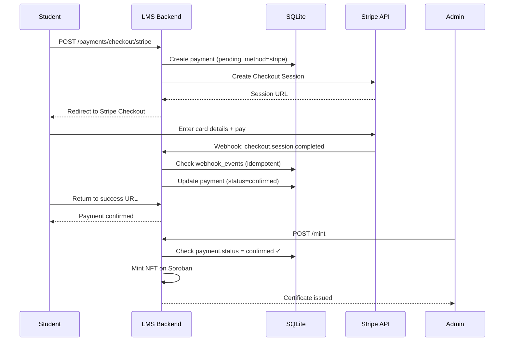
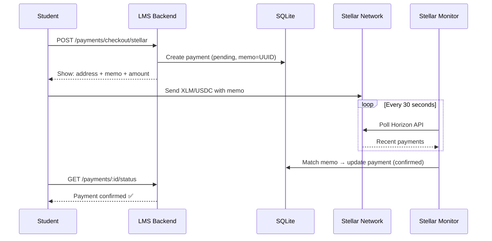
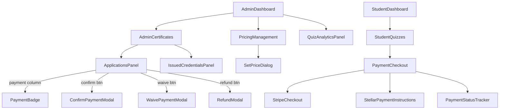
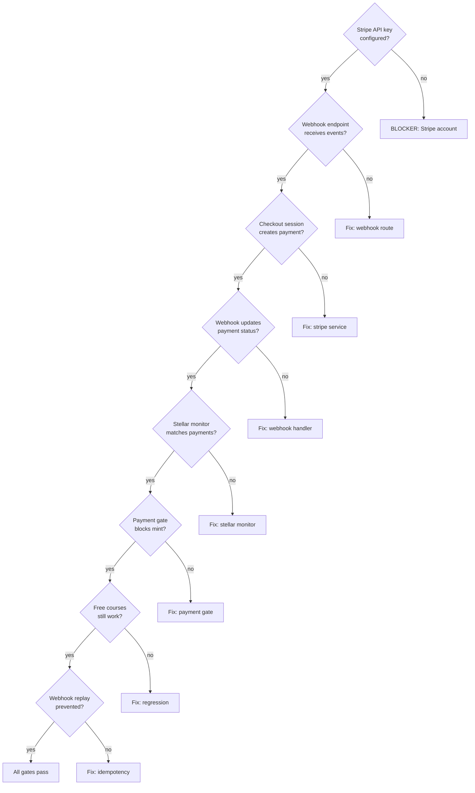

# Phase 11 C1 — Payment Foundation (Stripe + Stellar + Manual Fallback)

**Date:** 2026-08-04
**Status:** SPEC READY
**Depends on:** Phase 10 (quiz analytics + component tests) — RELEASED
**Branch:** `feat/phase11-c1-payment-foundation` (to be created at implementation time)
**Prerequisites:** Stripe account provisioned with API keys + webhook secret (EXTERNAL BLOCKER)

---

## Problem Statement

The LMS issues NFT certificates via a complete pipeline: eligibility → application → admin approval → Soroban mint. Currently, all certificates are free. The platform needs revenue from verified NFT certificates.

Phase 11 C1 establishes the full payment foundation with automated dual payment rails: Stripe Checkout for fiat (card payments) and Stellar native for crypto (XLM/USDC). This is the highest-value, highest-risk work in the Phase 11 roadmap. It also includes manual confirmation as a fallback.

**Current state:**
- `quiz_completions.payment_status` exists but is hardcoded `'none'` everywhere
- `course_nft_applications` has no payment tracking between 'approved' and 'minted'
- `mintService.ts` mints without any payment verification
- `StudentQuizzes.tsx` shows "Payment coming soon" disabled button
- Zero payment gateway code exists
- Stellar SDK already in use for Soroban NFT minting (`@stellar/stellar-sdk`)
- Cloudflare Tunnel provides HTTPS (no separate TLS setup)
- 48/48 frontend tests, 454/454 backend tests

---

## Goals

1. Add `course_pricing` table — admin sets certificate price per course (USD + optional Stellar prices)
2. Add `payments` table — tracks payment records with method, status, and external references
3. Add `webhook_events` table — ensures idempotent webhook processing
4. Implement Stripe Checkout integration (SAQ-A PCI compliance — zero card data on our server)
5. Implement Stellar native payment verification (memo-based matching via Horizon API)
6. Add manual payment confirmation as fallback
7. Add payment gate in mint endpoint — reject mint if payment required but not confirmed
8. Add admin UI for pricing, payment management, and refunds
9. Add student UI for payment method selection, checkout, and status tracking
10. Preserve existing free certificate flow
11. Foundation for C2 (freemium tiers) and C3 (sponsor cohorts)

## Non-Goals

- No subscription/recurring billing
- No refund self-service (admin-only refunds via Stripe API)
- No marketplace (students don't sell certificates)
- No multi-currency beyond USD + XLM/USDC
- No physical certificate printing
- No payment analytics dashboard (Phase 12+)
- No Apple Pay / Google Pay (Stripe Checkout handles these transparently)
- No quiz-level payments (course-level only)

---

## Scope

### In Scope

| Area | Change |
|------|--------|
| Data model | New `course_pricing` + `payments` + `webhook_events` tables |
| Backend | Pricing CRUD, Stripe checkout, Stellar checkout, webhook handler, payment monitor, payment gate |
| Frontend (admin) | Pricing management, payment status/badges, confirm/waive/refund buttons |
| Frontend (student) | Payment method selection, Stripe redirect, Stellar instructions, status tracking |
| Tests | ~20 backend + ~10 frontend new tests |
| Dependencies | `stripe` npm package (new) |

### Out of Scope

| Area | Why |
|------|-----|
| Subscription billing | Not needed — one-time certificate payments |
| Payment analytics | Phase 12+ |
| Quiz-level payments | Course-level only in this phase |
| Multi-currency | USD + XLM/USDC sufficient |

---

## Data Model Changes

### New Table: `course_pricing`

```sql
CREATE TABLE IF NOT EXISTS course_pricing (
  id TEXT PRIMARY KEY,
  course_id TEXT NOT NULL UNIQUE,
  price_cents INTEGER NOT NULL DEFAULT 0,
  currency TEXT NOT NULL DEFAULT 'USD',
  stellar_price_xlm REAL,
  stellar_price_usdc REAL,
  is_active INTEGER NOT NULL DEFAULT 1,
  created_at TEXT NOT NULL DEFAULT (datetime('now')),
  updated_at TEXT NOT NULL DEFAULT (datetime('now')),
  FOREIGN KEY (course_id) REFERENCES courses(id)
);

CREATE INDEX IF NOT EXISTS idx_course_pricing_course_id ON course_pricing(course_id);
```

**Design notes:**
- `price_cents` stores USD price as integer cents (avoids float issues)
- `stellar_price_xlm` / `stellar_price_usdc` — optional Stellar prices (admin sets manually; no auto-conversion)
- `UNIQUE` on `course_id` — one pricing row per course
- No pricing row = free

### New Table: `payments`

```sql
CREATE TABLE IF NOT EXISTS payments (
  id TEXT PRIMARY KEY,
  user_id TEXT NOT NULL,
  course_id TEXT NOT NULL,
  application_id TEXT,
  amount_cents INTEGER NOT NULL,
  currency TEXT NOT NULL DEFAULT 'USD',
  payment_method TEXT NOT NULL,
  status TEXT NOT NULL DEFAULT 'pending',
  stripe_session_id TEXT,
  stripe_payment_intent_id TEXT,
  stellar_tx_hash TEXT,
  stellar_memo TEXT UNIQUE,
  confirmed_by TEXT,
  confirmed_at TEXT,
  notes TEXT,
  created_at TEXT NOT NULL DEFAULT (datetime('now')),
  updated_at TEXT NOT NULL DEFAULT (datetime('now')),
  FOREIGN KEY (user_id) REFERENCES users(id),
  FOREIGN KEY (course_id) REFERENCES courses(id),
  FOREIGN KEY (application_id) REFERENCES course_nft_applications(id),
  FOREIGN KEY (confirmed_by) REFERENCES users(id)
);

CREATE INDEX IF NOT EXISTS idx_payments_user_id ON payments(user_id);
CREATE INDEX IF NOT EXISTS idx_payments_course_id ON payments(course_id);
CREATE INDEX IF NOT EXISTS idx_payments_application_id ON payments(application_id);
CREATE INDEX IF NOT EXISTS idx_payments_status ON payments(status);
CREATE INDEX IF NOT EXISTS idx_payments_stellar_memo ON payments(stellar_memo);
```

**Status values:** `'pending'` | `'confirmed'` | `'failed'` | `'refunded'` | `'waived'`
**Payment method values:** `'stripe'` | `'stellar_xlm'` | `'stellar_usdc'` | `'manual'` | `'waived'`

**Design notes:**
- `stripe_session_id` — Stripe Checkout session reference
- `stripe_payment_intent_id` — Stripe PaymentIntent reference (for refunds)
- `stellar_tx_hash` — Stellar transaction hash (set on confirmation)
- `stellar_memo` — UNIQUE memo for matching incoming Stellar payments
- One payment per application (retry = new payment record)

### New Table: `webhook_events`

```sql
CREATE TABLE IF NOT EXISTS webhook_events (
  id TEXT PRIMARY KEY,
  event_id TEXT NOT NULL UNIQUE,
  event_type TEXT NOT NULL,
  processed_at TEXT NOT NULL DEFAULT (datetime('now')),
  payload TEXT
);

CREATE INDEX IF NOT EXISTS idx_webhook_events_event_id ON webhook_events(event_id);
```

**Purpose:** Idempotent webhook processing — prevent double-processing of Stripe events.

### Modified Table: `course_nft_applications`

```sql
ALTER TABLE course_nft_applications ADD COLUMN payment_id TEXT REFERENCES payments(id);
```

---

## Backend API Design

### New Endpoints

#### a) `GET /api/v1/courses/:courseId/pricing` (authenticated)

Returns certificate pricing for a course (any authenticated user).

```typescript
// Response
{
  success: true,
  data: {
    courseId: string,
    priceCents: number,
    currency: string,
    stellarPriceXlm: number | null,
    stellarPriceUsdc: number | null,
    isFree: boolean
  }
}
```

#### b) `PUT /api/v1/admin/courses/:courseId/pricing` (admin only)

Set or update certificate price.

```typescript
// Request body
{
  priceCents: number,              // 0 = free, 2500 = $25.00
  stellarPriceXlm?: number,       // e.g., 250.0
  stellarPriceUsdc?: number        // e.g., 25.0
}
```

#### c) `POST /api/v1/payments/checkout/stripe` (authenticated)

Create Stripe Checkout session and payment record.

```typescript
// Request body
{ applicationId: string }

// Response
{
  success: true,
  data: {
    paymentId: string,
    checkoutUrl: string,        // Stripe hosted checkout URL
    sessionId: string           // Stripe session ID
  }
}
```

**Behavior:**
1. Verify application exists and belongs to requesting user
2. Verify course has pricing with `price_cents > 0`
3. Check no existing confirmed/pending-stripe payment for this application
4. Create `payments` record: `status='pending'`, `payment_method='stripe'`
5. Call `stripe.checkout.sessions.create()` with:
   - `line_items`: certificate name + price
   - `success_url`: `{frontend}/certificates?payment=success&session_id={CHECKOUT_SESSION_ID}`
   - `cancel_url`: `{frontend}/certificates?payment=cancelled`
   - `metadata`: `{ paymentId, applicationId, courseId, userId }`
6. Store `stripe_session_id` on payment record
7. Return checkout URL for frontend redirect

#### d) `POST /api/v1/payments/checkout/stellar` (authenticated)

Generate Stellar payment instructions.

```typescript
// Request body
{ applicationId: string, asset: 'xlm' | 'usdc' }

// Response
{
  success: true,
  data: {
    paymentId: string,
    destinationAddress: string,    // Platform receiving wallet
    memo: string,                  // Unique UUID-based memo
    amount: string,                // e.g., "250.0000000" (XLM) or "25.00" (USDC)
    asset: string,                 // 'xlm' or 'usdc'
    assetIssuer: string | null     // USDC issuer address (null for XLM)
  }
}
```

**Behavior:**
1. Verify application exists and belongs to requesting user
2. Generate unique memo (UUID v4, truncated to 28 chars for Stellar memo text limit)
3. Create `payments` record: `status='pending'`, `payment_method='stellar_xlm'|'stellar_usdc'`, `stellar_memo=memo`
4. Return payment instructions (student completes payment externally)

#### e) `POST /api/v1/webhooks/stripe` (public, signature-verified)

Handle Stripe webhook events. This endpoint is public but verifies the `stripe-signature` header.

```typescript
// Stripe sends: checkout.session.completed event

// Behavior:
1. Verify signature: stripe.webhooks.constructEvent(body, sig, secret)
2. If invalid signature → 403
3. Check webhook_events for event.id → if exists, return 200 (already processed)
4. Insert into webhook_events (idempotency record)
5. Extract paymentId from session.metadata
6. Update payment: status='confirmed', confirmed_at=now()
7. Update course_nft_applications: payment_id=paymentId
8. Return 200
```

**Important:** Raw body needed for signature verification — must use `express.raw()` middleware on this route, not `express.json()`.

#### f) `GET /api/v1/payments/:paymentId/status` (authenticated, owner or admin)

Check payment status. Students can only see their own payments.

```typescript
// Response
{
  success: true,
  data: {
    paymentId: string,
    status: string,
    paymentMethod: string,
    amountCents: number,
    currency: string,
    confirmedAt: string | null
  }
}
```

#### g) `POST /api/v1/admin/payments/:paymentId/confirm` (admin only)

Manual payment confirmation (fallback for bank transfers, cash, etc.).

#### h) `POST /api/v1/admin/payments/:paymentId/waive` (admin only)

Waive payment (scholarship). Notes required.

#### i) `POST /api/v1/admin/payments/:paymentId/refund` (admin only)

Trigger Stripe refund. Only for Stripe payments with `status='confirmed'`.

```typescript
// Behavior:
1. Verify payment exists and method='stripe' and status='confirmed'
2. Call stripe.refunds.create({ payment_intent: payment.stripe_payment_intent_id })
3. Update payment: status='refunded'
4. Return refund confirmation
```

**For non-Stripe payments:** Return 400 — manual refunds handled outside the system.

#### j) `GET /api/v1/admin/payments` (admin only)

List all payments with optional filters (`?status=pending&courseId=xxx&method=stripe`).

#### k) `GET /api/v1/students/me/payments` (authenticated)

Student's own payment history.

### Modified Endpoints

#### l) Modify `POST /courses/:courseId/completions/apply`

If course has `price_cents > 0`, include pricing info in response (but do NOT auto-create payment — student chooses method first).

```typescript
// Extended response for paid courses
{
  success: true,
  message: 'Application submitted',
  data: {
    applicationId: string,
    pricing: {           // NEW — only present if course has price
      priceCents: number,
      currency: string,
      stellarPriceXlm: number | null,
      stellarPriceUsdc: number | null
    }
  }
}
```

#### m) Modify `POST /courses/:courseId/completions/applications/:appId/mint`

Add payment gate:

```typescript
const pricing = paymentService.getCoursePricing(courseId);
if (pricing && pricing.price_cents > 0) {
  const satisfied = paymentService.isPaymentSatisfied(applicationId);
  if (!satisfied) {
    return res.status(402).json({
      success: false,
      message: 'Payment required. Certificate payment has not been confirmed.'
    });
  }
}
// ... existing mint logic continues unchanged
```

### New Services

#### `paymentService.ts`

Core payment business logic:

```typescript
getCoursePricing(courseId: string): CoursePricing | null
setCoursePricing(courseId: string, priceCents: number, stellarXlm?: number, stellarUsdc?: number): CoursePricing
createPayment(userId: string, courseId: string, applicationId: string, amountCents: number, method: string): Payment
confirmPayment(paymentId: string, confirmedBy?: string, notes?: string): Payment
waivePayment(paymentId: string, confirmedBy: string, notes: string): Payment
refundPayment(paymentId: string): Payment  // calls stripeService for Stripe payments
getPaymentForApplication(applicationId: string): Payment | null
isPaymentSatisfied(applicationId: string): boolean
generateStellarMemo(): string  // UUID v4 truncated to 28 chars
listPayments(filters?: PaymentFilters): PaymentWithDetails[]
getStudentPayments(userId: string): Payment[]
```

#### `stripeService.ts`

Stripe API wrapper:

```typescript
createCheckoutSession(params: CheckoutParams): Promise<Stripe.Checkout.Session>
verifyWebhookSignature(payload: Buffer, signature: string): Stripe.Event
createRefund(paymentIntentId: string): Promise<Stripe.Refund>
```

**Configuration:** `STRIPE_SECRET_KEY` and `STRIPE_WEBHOOK_SECRET` from environment variables.

#### `stellarPaymentMonitor.ts`

Background service that polls Stellar Horizon API for incoming payments:

```typescript
class StellarPaymentMonitor {
  private intervalId: NodeJS.Timeout | null = null;
  private readonly pollIntervalMs = 30_000;  // 30 seconds
  private readonly destinationAddress: string;  // PAYMENT_RECEIVING_WALLET from env

  start(): void    // Begin polling on server startup
  stop(): void     // Stop polling on shutdown
  private async poll(): Promise<void>
    // 1. Query Horizon for recent payments to destinationAddress
    // 2. For each payment with memo_type='text':
    //    a. Look up payments table by stellar_memo = memo
    //    b. If found and status='pending':
    //       - Verify amount matches (within tolerance for XLM)
    //       - Update status='confirmed', stellar_tx_hash=tx.hash, confirmed_at=now()
    // 3. Track cursor to avoid re-processing old transactions
}
```

**Uses:** `@stellar/stellar-sdk` (already installed for NFT minting).
**Config:** `PAYMENT_RECEIVING_WALLET` env var — the Stellar address that receives payments.

---

## Frontend UX Design

### Admin Side

#### a) Pricing Management (AdminDashboard section)

New `PricingManagement` component:

```
┌───────────────────────────────────────────────────────────────────┐
│ Certificate Pricing                                               │
├────────────────┬──────────┬──────────┬───────────┬───────────────┤
│ Course         │ USD      │ XLM      │ USDC      │ Actions       │
├────────────────┼──────────┼──────────┼───────────┼───────────────┤
│ Blockchain 101 │ $25.00   │ 250 XLM  │ 25 USDC   │ [Edit]        │
│ Web3 Intro     │ Free     │ —        │ —         │ [Set Price]   │
│ DeFi Advanced  │ $50.00   │ 500 XLM  │ 50 USDC   │ [Edit]        │
└────────────────┴──────────┴──────────┴───────────┴───────────────┘
```

**Set Price Dialog:**
```
┌──────────────────────────────────────┐
│ Set Certificate Price                 │
│                                       │
│ Course: Blockchain Fundamentals       │
│                                       │
│ USD Price: [  25.00  ]                │
│ XLM Price: [ 250.00  ] (optional)     │
│ USDC Price: [ 25.00  ] (optional)     │
│                                       │
│ Set USD to $0 for free certificates   │
│                                       │
│ [Cancel]  [Save Price]                │
└──────────────────────────────────────┘
```

#### b) AdminCertificates.tsx Modifications

Add "Payment" column with method icon and status badge:

```
┌────────┬───────┬────────┬─────────────────┬─────────┬────────────────────────┐
│ Student│ Course│ Status │ Payment         │ Applied │ Actions                │
├────────┼───────┼────────┼─────────────────┼─────────┼────────────────────────┤
│ Alice  │ BVC   │approved│ 💳 ⏳ Pending    │ Aug 3   │ [Confirm] [Waive] [Mint]│
│ Bob    │ SVC   │approved│ ⭐ ✅ Confirmed  │ Aug 2   │ [Mint] [Refund]        │
│ Carol  │ BVC   │approved│ 🆓 Free         │ Aug 1   │ [Mint]                 │
│ Dave   │ BVC   │ minted │ 💳 ✅ Confirmed  │ Jul 30  │ —                      │
│ Eve    │ DeFi  │approved│ ⭐ ⏳ Pending    │ Aug 4   │ [Confirm] [Waive] [Mint]│
└────────┴───────┴────────┴─────────────────┴─────────┴────────────────────────┘
```

**Method icons:** 💳 = Stripe, ⭐ = Stellar, 📋 = Manual
**Status badges:** 🆓 Free (green), ⏳ Pending (yellow), ✅ Confirmed (blue), ❌ Failed (red), ↩️ Refunded (gray), 🎓 Waived (purple)

**Buttons:**
- **"Confirm Payment"** — visible for pending payments (manual fallback)
- **"Waive Payment"** — visible for pending payments (scholarship)
- **"Refund"** — visible for confirmed Stripe payments only
- **"Mint"** — disabled with tooltip when payment pending on paid course

#### c) Refund Modal

```
┌──────────────────────────────────────┐
│ Refund Payment                        │
│                                       │
│ Student: Bob Smith                    │
│ Course: Web3 Intro                    │
│ Amount: $25.00 via Stripe             │
│                                       │
│ ⚠️ This will refund the payment via   │
│ Stripe. The certificate will NOT be   │
│ automatically revoked.                │
│                                       │
│ [Cancel]  [Process Refund]            │
└──────────────────────────────────────┘
```

### Student Side

#### d) Payment Method Selection

After application is approved (or immediately after applying for a paid course), show payment options:

```
┌───────────────────────────────────────────────────────┐
│ Pay for Certificate                                    │
│                                                        │
│ Course: Blockchain Fundamentals                        │
│                                                        │
│ ┌─────────────────────┐  ┌─────────────────────────┐  │
│ │  💳 Pay with Card   │  │  ⭐ Pay with Stellar     │  │
│ │                     │  │                          │  │
│ │  $25.00 USD         │  │  250 XLM  or  25 USDC   │  │
│ │                     │  │                          │  │
│ │  Visa, Mastercard,  │  │  Send from any Stellar   │  │
│ │  Amex accepted      │  │  wallet                  │  │
│ │                     │  │                          │  │
│ │  [Pay Now]          │  │  [Get Instructions]      │  │
│ └─────────────────────┘  └─────────────────────────┘  │
│                                                        │
│ Or contact admin for alternative payment               │
└───────────────────────────────────────────────────────┘
```

**"Pay Now" (Stripe):** Creates checkout session → redirects to Stripe hosted page → returns to success/cancel URL.

#### e) Stellar Payment Instructions

```
┌───────────────────────────────────────────────────────┐
│ Stellar Payment Instructions                           │
│                                                        │
│ Send exactly:  250.0000000 XLM                        │
│ To address:    GCXYZ...ABCD                           │
│ With memo:     a1b2c3d4-e5f6-7890-abcd                │
│                                                        │
│ ⚠️ You MUST include the memo exactly as shown.         │
│    Without the correct memo, your payment cannot       │
│    be matched to your certificate.                     │
│                                                        │
│ [Copy Address]  [Copy Memo]  [Copy Amount]            │
│                                                        │
│ Payment status: ⏳ Waiting for payment...              │
│ (This page auto-refreshes every 30 seconds)           │
└───────────────────────────────────────────────────────┘
```

**Auto-refresh:** Polls `GET /payments/:id/status` every 30 seconds. When status changes to 'confirmed', shows success message.

#### f) Payment Status Tracking

**After Stripe redirect (success URL):**
```
✅ Payment confirmed!
Amount: $25.00
Method: Card (Stripe)
Your certificate will be issued shortly.
```

**After Stellar (polling):**
```
⏳ Waiting for Stellar payment...
We're monitoring for your payment. This usually takes 1-2 minutes.
[Refresh Status]
```
→ transitions to:
```
✅ Payment confirmed!
Amount: 250 XLM
Transaction: GABCD...1234
Your certificate will be issued shortly.
```

#### g) StudentQuizzes.tsx Modification

Replace "Payment coming soon" placeholder:

**Paid course:**
```
┌─────────────────────────────────────┐
│ 💳 Certificate Fee                   │
│                                      │
│ Certificate price: $25.00            │
│ Also accepted: 250 XLM or 25 USDC   │
│                                      │
│ [Pay Now]                            │
└─────────────────────────────────────┘
```

**Free course:**
```
┌─────────────────────────────────────┐
│ 🎓 Certificate                       │
│                                      │
│ This certificate is free.            │
│ Complete course requirements to      │
│ apply.                               │
└─────────────────────────────────────┘
```

---

## Testing Strategy

### Backend Tests (target: 20 new tests)

File: `LMS-Server/src/__tests__/payments.test.ts`
File: `LMS-Server/src/__tests__/webhooks.test.ts`

| ID | Test | Description |
|----|------|-------------|
| PAY-B1 | GET pricing — priced course | Returns priceCents, stellarPriceXlm, isFree=false |
| PAY-B2 | GET pricing — no pricing row | Returns priceCents=0, isFree=true |
| PAY-B3 | PUT pricing — admin sets price | Creates/updates pricing row with all fields |
| PAY-B4 | PUT pricing — non-admin rejected | 401 (unauth) + 403 (student) |
| PAY-B5 | POST stripe checkout — creates session | Creates payment record + returns checkout URL (mocked Stripe) |
| PAY-B6 | POST stellar checkout — returns instructions | Creates payment record with unique memo |
| PAY-B7 | POST webhook — valid event | Processes checkout.session.completed, updates payment |
| PAY-B8 | POST webhook — invalid signature | Returns 403 |
| PAY-B9 | POST webhook — duplicate event | Returns 200 (idempotent, no double-processing) |
| PAY-B10 | POST confirm — admin confirms | Updates status to 'confirmed' |
| PAY-B11 | POST confirm — non-admin rejected | Returns 403 |
| PAY-B12 | POST waive — with notes | Updates status to 'waived' |
| PAY-B13 | POST waive — without notes | Returns 400 |
| PAY-B14 | POST refund — Stripe payment | Calls Stripe refund API (mocked), updates status |
| PAY-B15 | POST refund — non-Stripe payment | Returns 400 |
| PAY-B16 | Mint gate — pending payment | Returns 402 |
| PAY-B17 | Mint gate — confirmed payment | Allows mint to proceed |
| PAY-B18 | Mint gate — free course | No payment check, mint proceeds |
| PAY-B19 | Stellar memo — uniqueness | UNIQUE constraint enforced |
| PAY-B20 | Student payment history | Returns only own payments |

**Mocking strategy:**
- Stripe API: mock `stripe.checkout.sessions.create()`, `stripe.webhooks.constructEvent()`, `stripe.refunds.create()`
- Stellar Horizon: mock HTTP responses for payment monitoring
- Database: seeded SQLite (same pattern as existing tests)

### Frontend Tests (target: 10 new tests)

File: `LMS-Frontend/src/__tests__/components/PricingManagement.test.tsx`
File: `LMS-Frontend/src/__tests__/components/PaymentCheckout.test.tsx`

| ID | Test | Description |
|----|------|-------------|
| PAY-F1 | PricingManagement — renders list | Shows courses with USD + Stellar prices |
| PAY-F2 | PricingManagement — set price | Dialog saves all price fields |
| PAY-F3 | PaymentCheckout — shows methods | Card + Stellar options displayed |
| PAY-F4 | PaymentCheckout — Stripe redirect | Calls checkout endpoint, redirects (mocked) |
| PAY-F5 | StellarInstructions — displays info | Shows address, memo, amount correctly |
| PAY-F6 | Payment badge — all states | Renders Free/Pending/Confirmed/Failed/Refunded/Waived |
| PAY-F7 | Confirm payment — API call | Button → modal → API call → status update |
| PAY-F8 | Mint disabled — pending | Disabled with tooltip when payment pending |
| PAY-F9 | Refund button — Stripe only | Shown only for confirmed Stripe payments |
| PAY-F10 | Student payment history | Renders payment list for student |

### Regression Coverage

- All 48 existing frontend tests must pass
- All 454 existing backend tests must pass
- Existing `/courses/:id/completions/applications/:appId/mint` unchanged for free courses
- Existing `mintService.ts` flow unchanged (payment check added before, not inside)
- Existing NFT minting on Soroban unchanged

### Security Tests

| Test | Covers |
|------|--------|
| PAY-B8 | Webhook signature verification — reject tampered payloads |
| PAY-B9 | Webhook replay prevention — idempotency via webhook_events |
| PAY-B4, B11 | Auth guards — admin-only endpoints reject non-admins |
| PAY-B20 | Data isolation — students see only own payments |

### Manual QA Checklist

- [ ] Stripe test mode: card payment → webhook → payment confirmed → certificate minted
- [ ] Stellar testnet: XLM payment with memo → monitor detects → payment confirmed
- [ ] Free course: certificate issued without any payment gate
- [ ] Admin manual confirmation: mark payment as confirmed → mint proceeds
- [ ] Admin waive: waive payment → mint proceeds
- [ ] Admin refund: refund Stripe payment → status updated
- [ ] Webhook replay: send same event twice → only processed once
- [ ] Wrong Stellar memo: payment not auto-matched, admin can manually confirm
- [ ] Expired Stripe session: student can retry checkout
- [ ] Price change: existing pending payments retain original amount

---

## Edge Cases & Error Handling

### Stripe Edge Cases

| Scenario | Behavior |
|----------|----------|
| Checkout session expires (24h) | Payment stays pending, student can create new checkout |
| Webhook delivery fails | Stripe retries up to 3 days; idempotent handler |
| Double webhook | Idempotent — webhook_events UNIQUE on event_id |
| Payment succeeds but webhook delayed | Student sees "processing"; auto-resolves when webhook arrives |
| Stripe API unavailable | Return 503 with "Payment service temporarily unavailable" |
| Refund fails | Return error from Stripe, payment status unchanged |

### Stellar Edge Cases

| Scenario | Behavior |
|----------|----------|
| Wrong amount sent | Not auto-confirmed; admin can manually confirm |
| Wrong memo | Not matched; admin can manually confirm (student contacts admin) |
| Wrong destination address | Not our problem — instructions clearly displayed |
| Horizon API unavailable | Monitor retries next poll cycle (30s); no data loss |
| Multiple payments with same memo | UNIQUE constraint prevents duplicate records |
| XLM price fluctuation | Admin-set price, not auto-converted; student sees exact amount |

### General Edge Cases

| Scenario | Behavior |
|----------|----------|
| Admin changes price after application | Existing payments retain original amount |
| Student applies, doesn't pay, applies again | Second application can have new payment |
| Payment confirmed but application rejected | Payment stays confirmed; cert not issued |
| Refund after certificate minted | Payment refunded; cert stays (admin decision) |
| Concurrent checkout attempts | Each creates separate payment record; only one can succeed per application |

---

## Security / PCI Considerations

### PCI Compliance

- **Stripe Checkout = SAQ-A** (lowest PCI burden)
- Zero card data touches our server — Stripe hosted checkout page handles everything
- No card numbers, CVVs, or bank accounts stored in our database
- All payment endpoints behind HTTPS (Cloudflare Tunnel, already enforced)

### Webhook Security

- Verify `stripe-signature` header using `STRIPE_WEBHOOK_SECRET`
- Reject events with invalid signatures (return 403)
- Idempotency via `webhook_events` table (`UNIQUE` on `event_id`)
- Webhook endpoint is public but signature-verified
- Use `express.raw({ type: 'application/json' })` middleware for signature verification (raw body required)

### Stellar Security

- Memo-based matching uses UUID v4 truncated to 28 chars (not guessable)
- Platform receiving wallet address is public (not a secret)
- No private keys involved in receiving payments (read-only Horizon monitoring)
- Monitor only reads from Horizon API (no write access to network)

### Data Security

- Payment amounts stored as integers (cents) to avoid floating-point issues
- No sensitive financial data stored beyond transaction IDs and session references
- Admin-only access to all payment management endpoints
- Students can only view their own payment history
- Payment details not exposed in application list responses to non-admin users

---

## Crypto Regulatory Considerations

- Platform receives XLM/USDC as payment for educational services (not securities)
- No token issuance or exchange (NFTs are credentials, not financial instruments)
- No custody of customer crypto assets (payment is one-way; platform receives, does not hold customer funds)
- USD pricing is primary; crypto is an alternative payment method
- Consider: Terms of Service update may be needed to document crypto payment acceptance
- No KYC/AML requirements for receiving payments under typical thresholds
- USDC is a regulated stablecoin (Circle) — less regulatory risk than volatile assets

---

## Touched Files

### New Files (13)

| File | Purpose |
|------|---------|
| `LMS-Server/src/services/paymentService.ts` | Payment + pricing business logic |
| `LMS-Server/src/services/stripeService.ts` | Stripe API wrapper |
| `LMS-Server/src/services/stellarPaymentMonitor.ts` | Horizon API polling for incoming payments |
| `LMS-Server/src/routes/payments.ts` | Payment + pricing REST endpoints |
| `LMS-Server/src/routes/webhooks.ts` | Stripe webhook handler (raw body) |
| `LMS-Server/src/__tests__/payments.test.ts` | Backend payment tests (16 cases) |
| `LMS-Server/src/__tests__/webhooks.test.ts` | Backend webhook tests (4 cases) |
| `LMS-Frontend/src/components/PricingManagement.tsx` | Admin pricing management |
| `LMS-Frontend/src/components/PaymentCheckout.tsx` | Student payment method selection + checkout |
| `LMS-Frontend/src/components/StellarPaymentInstructions.tsx` | Stellar payment display |
| `LMS-Frontend/src/services/paymentService.ts` | Frontend payment API client |
| `LMS-Frontend/src/__tests__/components/PricingManagement.test.tsx` | Pricing tests |
| `LMS-Frontend/src/__tests__/components/PaymentCheckout.test.tsx` | Checkout tests |

### Modified Files (10)

| File | Change |
|------|--------|
| `LMS-Server/src/config/database.ts` | Add `ensurePaymentsTables()` — 3 new tables |
| `LMS-Server/src/app.ts` | Register payment + webhook routes, start Stellar monitor |
| `LMS-Server/src/routes/nftApplications.ts` | Add payment gate on mint, pricing info on apply |
| `LMS-Server/src/types/index.ts` | Add Payment, CoursePricing, PaymentStatus types |
| `LMS-Server/.env` | Add STRIPE_SECRET_KEY, STRIPE_WEBHOOK_SECRET, PAYMENT_RECEIVING_WALLET |
| `LMS-Frontend/src/pages/AdminCertificates.tsx` | Payment column, confirm/waive/refund buttons |
| `LMS-Frontend/src/pages/StudentQuizzes.tsx` | Replace placeholder with checkout |
| `LMS-Frontend/src/services/adminCertificateService.ts` | Add payment management methods |
| `LMS-Frontend/src/services/courseCompletionService.ts` | Add getPricing method |
| `LMS-Frontend/src/types/api.ts` | Add payment frontend types |

### New Dependencies (1)

| Package | Version | Purpose |
|---------|---------|---------|
| `stripe` | `^17.x` | Stripe API client (Checkout, Webhooks, Refunds) |

---

## Rollout & Compatibility

### Prerequisites (MUST be resolved before implementation)

| Prerequisite | Status | Blocker? |
|-------------|--------|----------|
| Stripe account provisioned | NOT DONE | **YES** |
| Stripe API keys (test + live) | NOT DONE | **YES** |
| Stripe webhook secret | NOT DONE | **YES** |
| Stripe webhook URL configured | Available via Cloudflare Tunnel | No |
| Platform Stellar receiving wallet | Needed (can use existing ops wallet) | No |
| `stripe` npm package | Not installed | No (install during implementation) |

### Deployment Steps

1. Install `stripe` package: `cd LMS-Server && npm install stripe`
2. Add env vars to Docker compose / `.env`:
   - `STRIPE_SECRET_KEY=sk_test_...`
   - `STRIPE_WEBHOOK_SECRET=whsec_...`
   - `PAYMENT_RECEIVING_WALLET=GXXX...`
3. Build and deploy: `docker compose build api web && docker compose up -d --no-deps api web`
4. Configure Stripe webhook in Stripe Dashboard → point to `https://lms.smwebsystems.com/api/v1/webhooks/stripe`
5. Test with Stripe test cards + Stellar testnet

### Activation Strategy

1. Deploy code — zero impact until admin sets price > 0
2. Set price on one test course
3. Test full flow: Stripe checkout + Stellar payment + manual confirm
4. Gradually set prices on remaining courses

### Rollback

```bash
git revert <merge-commit>     # removes all payment code
cd LMS-Server && npm uninstall stripe
# Remove env vars from .env / docker-compose
docker compose build api web && docker compose up -d --no-deps api web
```

---

## Mermaid Diagrams

### Stripe Payment Flow



### Stellar Payment Flow



### Data Model

```mermaid
erDiagram
    courses ||--o| course_pricing : "has pricing"
    courses ||--o{ course_nft_applications : "has applications"
    users ||--o{ course_nft_applications : "applies"
    users ||--o{ payments : "makes"
    courses ||--o{ payments : "for"
    course_nft_applications ||--o| payments : "linked to"
    course_nft_applications ||--o| nft_credentials : "produces"

    course_pricing {
        text id PK
        text course_id FK_UK
        int price_cents
        text currency
        real stellar_price_xlm
        real stellar_price_usdc
        int is_active
    }

    payments {
        text id PK
        text user_id FK
        text course_id FK
        text application_id FK
        int amount_cents
        text payment_method
        text status
        text stripe_session_id
        text stripe_payment_intent_id
        text stellar_tx_hash
        text stellar_memo UK
        text confirmed_by FK
    }

    webhook_events {
        text id PK
        text event_id UK
        text event_type
        text processed_at
    }
```

### Component Structure



### Verification / Test Gate Flow



---

## To-Do Lists

### Spec Checklist

- [x] Problem statement reviewed
- [x] Payment model defined (Stripe + Stellar + manual fallback)
- [x] Goals and non-goals explicit
- [x] Data model schema designed (3 new tables)
- [x] Backend endpoints designed (13 endpoints, 3 services)
- [x] Frontend UX designed (admin + student)
- [x] Test plan defined (20 backend + 10 frontend)
- [x] Edge cases documented (Stripe, Stellar, general)
- [x] Security/PCI considerations documented
- [x] Crypto regulatory considerations documented
- [x] Touched files listed (13 new + 10 modified)
- [x] Rollout plan documented

### Data Model Checklist

- [ ] `course_pricing` table with stellar price columns
- [ ] `payments` table with stripe + stellar fields
- [ ] `webhook_events` table for idempotency
- [ ] `course_nft_applications.payment_id` column
- [ ] Indexes on all FK columns + status + stellar_memo
- [ ] UNIQUE constraints on `course_pricing.course_id`, `payments.stellar_memo`, `webhook_events.event_id`

### Backend Checklist

- [ ] `paymentService.ts` — 10 functions
- [ ] `stripeService.ts` — 3 functions
- [ ] `stellarPaymentMonitor.ts` — background poller
- [ ] `payments.ts` routes — 9 endpoints
- [ ] `webhooks.ts` routes — Stripe webhook handler with raw body
- [ ] Payment gate in mint endpoint (402)
- [ ] Pricing info in apply endpoint response
- [ ] Auth guards on all admin endpoints
- [ ] `express.raw()` middleware for webhook route

### Frontend Checklist

- [ ] `PricingManagement` component + `SetPriceDialog`
- [ ] `PaymentCheckout` component (method selection)
- [ ] `StellarPaymentInstructions` component
- [ ] `PaymentStatusTracker` component (polling)
- [ ] `PaymentBadge` component (6 states)
- [ ] `ConfirmPaymentModal`, `WaivePaymentModal`, `RefundModal`
- [ ] `AdminCertificates` payment column + buttons
- [ ] `StudentQuizzes` placeholder replacement
- [ ] Frontend `paymentService.ts` API client

### Test Checklist

- [ ] PAY-B1 through PAY-B20 (20 backend tests)
- [ ] PAY-F1 through PAY-F10 (10 frontend tests)
- [ ] Stripe API mocking (checkout, webhook, refund)
- [ ] Stellar Horizon mocking (payment monitoring)
- [ ] Regression: 48/48 frontend pass
- [ ] Regression: 454/454 backend pass

### Security / PCI Checklist

- [ ] Stripe Checkout (SAQ-A) — no card data on server
- [ ] Webhook signature verification implemented
- [ ] Webhook replay prevention via webhook_events
- [ ] No card/bank data stored in DB
- [ ] Stellar memo uses UUID (not guessable)
- [ ] Payment data access control (admin + owner only)
- [ ] HTTPS enforced (Cloudflare Tunnel)
- [ ] Raw body middleware for webhook signature

### Risk Checklist

- [ ] Stripe account provisioned (**EXTERNAL BLOCKER**)
- [ ] Stripe webhook URL accessible via Cloudflare Tunnel
- [ ] Stellar Horizon API accessible (already in use)
- [ ] Price change mid-application handled
- [ ] Double payment prevention (one confirmed payment per application)
- [ ] Free course regression preserved
- [ ] Refund flow defined (Stripe API only)
- [ ] Stellar wrong-memo fallback (admin manual confirm)

---

## Review Checklist

- [ ] **Scope correctness:** Dual rails (Stripe + Stellar) + manual fallback, no extras
- [ ] **Data model correctness:** FKs, indexes, UNIQUE constraints, idempotency table
- [ ] **API design correctness:** RESTful, consistent with existing `/api/v1/` patterns, raw body for webhooks
- [ ] **UI/UX correctness:** Student checkout clear (method selection → payment → confirmation), admin management comprehensive
- [ ] **Test coverage correctness:** Stripe mocking, Stellar mocking, webhook idempotency, payment gate, auth guards
- [ ] **Security / PCI correctness:** SAQ-A, webhook sig verification, no card data, UUID memos
- [ ] **Rollback safety:** Revert commits + uninstall stripe + remove env vars
- [ ] **External dependencies:** Stripe account (**BLOCKER**), receiving wallet address

---

## Acceptance Criteria

| ID | Criterion |
|----|-----------|
| AC-1 | Admin can set certificate price per course (USD + optional XLM/USDC prices) |
| AC-2 | Student can initiate Stripe Checkout payment |
| AC-3 | Stripe webhook confirms payment and updates DB (checkout.session.completed) |
| AC-4 | Student can initiate Stellar payment (receives address + memo + amount) |
| AC-5 | Stellar payment monitor detects matching payment and confirms |
| AC-6 | Admin can manually confirm payment (fallback) |
| AC-7 | Admin can waive payment with required notes |
| AC-8 | Admin can refund Stripe payments via API |
| AC-9 | Mint endpoint returns 402 if payment pending on paid course |
| AC-10 | Mint proceeds after payment confirmed or waived |
| AC-11 | Free courses ($0 or no pricing row) work without payment gate |
| AC-12 | Webhook signature verified — invalid signatures rejected (403) |
| AC-13 | Webhook events processed exactly once (idempotent) |
| AC-14 | Stellar memo uniqueness enforced (UNIQUE constraint) |
| AC-15 | All 48 existing frontend tests pass |
| AC-16 | All 454 existing backend tests pass |
| AC-17 | Payment status visible in AdminCertificates with method icon |
| AC-18 | Student can view own payment history |
| AC-19 | No card data stored on our server (Stripe Checkout handles PCI) |

---

## /loop Workflow

```
/loop assess   — Verify baselines (48/48 frontend, 454/454 backend) + Stripe account status
/loop plan     — Write implementation plan (decompose into sub-tasks, likely 3-4 phases)
/loop implement — Execute plan
/loop review   — Run all verification gates (tsc, vitest×2, build, docker, http, health)
/loop defer    — If Stripe not ready, fall back to C1a (manual payment)
```

---

## Relationship to C1a and C2/C3

### C1 extends C1a

If C1a is implemented first, C1 extends it:
- Add `stellar_price_xlm`, `stellar_price_usdc` to `course_pricing`
- Add `stripe_*`, `stellar_*` columns to `payments`
- Add `webhook_events` table
- Add `stripeService.ts`, `stellarPaymentMonitor.ts`
- Add Stripe checkout + Stellar checkout endpoints
- Add webhook handler
- Extend frontend with payment method selection + Stellar instructions

### C1 enables C2 + C3

| Phase | Depends On | What It Adds |
|-------|-----------|-------------|
| C2: Freemium Tiers | C1 payment gate | Free basic badge vs paid verified NFT; badge auto-issued, NFT requires payment |
| C3: Sponsor Cohorts | C1 payment gate + pricing | Bulk sponsor payments, cohort enrollment, extends `sponsor_label` |

Both C2 and C3 are independent of each other but both require C1's payment infrastructure.
