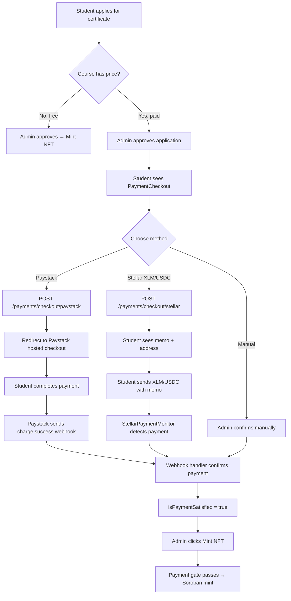
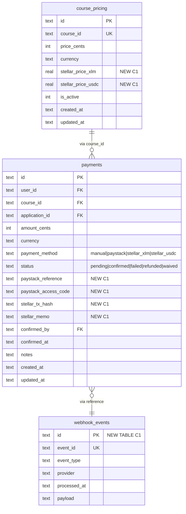
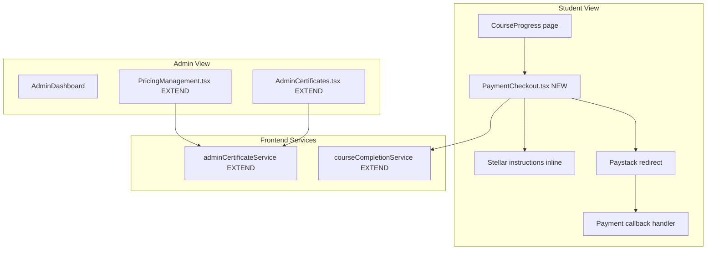
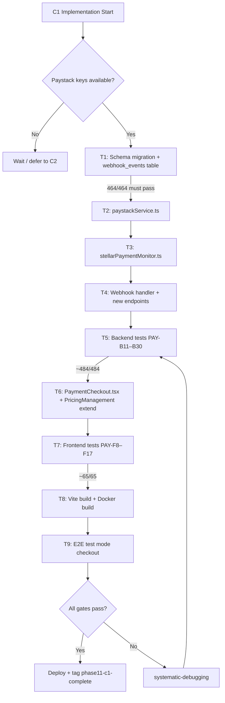

# Phase 11 C1 — Payment Automation (Paystack + Stellar)

**Date:** 2026-08-04
**Status:** SPEC READY
**Depends on:** Phase 11 C1a (manual payment foundation) — RELEASED
**Branch:** `feat/phase11-c1-payment-automation` (to be created at implementation time)
**Prerequisites:** Paystack account provisioned with API keys (expected within 72 hours)

---

## Problem Statement

Phase 11 C1a shipped a manual payment foundation: admin-managed course pricing, manual payment confirmation/waive, and a 402 payment gate on NFT minting. This works for low volume but requires admin intervention for every paid certificate.

Phase 11 C1 automates the payment confirmation step by adding two payment rails:
1. **Paystack Checkout** — fiat card/bank payments via Paystack's hosted checkout page (SAQ-A PCI compliant — zero card data on our server)
2. **Stellar native payments** — XLM/USDC payments verified via Horizon API polling

Manual confirmation from C1a remains as a fallback. The payment gate logic is unchanged.

---

## What C1a Already Provides (DO NOT REBUILD)

### Tables (exist, will be extended)
- `course_pricing` — id, course_id (UNIQUE), price_cents, currency, is_active, timestamps
- `payments` — id, user_id, course_id, application_id, amount_cents, currency, payment_method (`'manual'`), status (`'pending'|'confirmed'|'waived'`), confirmed_by, confirmed_at, notes, timestamps
- `course_nft_applications.payment_id` — FK to payments

### Service Functions (exist, will be extended)
- `getCoursePricing(courseId)` → CoursePricing | null
- `setCoursePricing(courseId, priceCents)` → CoursePricing
- `createPayment(userId, courseId, applicationId, amountCents)` → Payment
- `confirmPayment(paymentId, confirmedBy, notes?)` → Payment | null (idempotent)
- `waivePayment(paymentId, confirmedBy, notes)` → Payment | null
- `getPaymentForApplication(applicationId)` → Payment | null
- `isPaymentSatisfied(applicationId)` → boolean
- `listPayments(filters?)` → PaymentWithDetails[]

### Endpoints (exist, unchanged)
- `GET /courses/:courseId/pricing` — any authenticated user
- `PUT /admin/courses/:courseId/pricing` — admin only (will extend request body)
- `POST /admin/payments/:paymentId/confirm` — admin manual confirm
- `POST /admin/payments/:paymentId/waive` — admin waive (notes required)
- `GET /admin/payments` — admin list with filters

### UI (exists, will be extended)
- `PricingManagement.tsx` — pricing table with edit modal (USD only)
- `AdminCertificates.tsx` — PaymentBadge (Free/Pending/Paid/Waived), confirm/waive buttons
- `StudentQuizzes.tsx` — dynamic price display

### Payment Gate (exists, unchanged)
- `nftApplications.ts` mint endpoint returns 402 if `isPaymentSatisfied()` returns false
- Free courses (no pricing row or price_cents=0) bypass the gate entirely

### Tests (exist, must remain green)
- Backend: PAY-B1–B10 (464 total)
- Frontend: PAY-F1–F7 (55 total)

---

## Goals

1. Add Paystack Checkout integration — student initiates card/bank payment, Paystack confirms via webhook
2. Add Stellar payment verification — student sends XLM/USDC with memo, background monitor confirms
3. Add `webhook_events` table for idempotent webhook processing
4. Add student checkout UI — payment method selection, Paystack redirect, Stellar instructions
5. Add payment status endpoint — student polls for confirmation
6. Add admin refund endpoint — Paystack refunds only (admin-triggered)
7. Extend pricing to support Stellar prices (XLM/USDC amounts)
8. Preserve manual confirm/waive as fallback
9. Preserve free certificate flow

## Non-Goals

- No subscription/recurring billing
- No student self-service refunds (admin-only)
- No payment analytics dashboard (Phase 12+)
- No multi-currency beyond USD + XLM/USDC
- No quiz-level payments (course-level only)
- No changes to manual confirm/waive flow
- No changes to payment gate logic
- No Apple Pay / Google Pay beyond what Paystack provides transparently
- No freemium tiers (C2) or sponsor cohorts (C3)

---

## Data Model Extensions

### ALTER: `course_pricing` — add Stellar price columns

```sql
ALTER TABLE course_pricing ADD COLUMN stellar_price_xlm REAL;
ALTER TABLE course_pricing ADD COLUMN stellar_price_usdc REAL;
```

**Design notes:**
- Admin sets Stellar prices manually (no auto-conversion from USD)
- NULL = Stellar payment not available for this course
- Both can be set independently (XLM-only, USDC-only, or both)

### ALTER: `payments` — add Paystack + Stellar columns

```sql
ALTER TABLE payments ADD COLUMN paystack_reference TEXT;
ALTER TABLE payments ADD COLUMN paystack_access_code TEXT;
ALTER TABLE payments ADD COLUMN stellar_tx_hash TEXT;
ALTER TABLE payments ADD COLUMN stellar_memo TEXT;
```

**Design notes:**
- `paystack_reference` — unique transaction reference from Paystack (our generated ref)
- `paystack_access_code` — Paystack checkout session access code
- `stellar_tx_hash` — Stellar transaction hash (set on confirmation)
- `stellar_memo` — unique memo for matching incoming Stellar payments
- No UNIQUE constraint on stellar_memo in ALTER (handled by application logic + index)

### ALTER: `payments.status` CHECK constraint

Expand from `'pending'|'confirmed'|'waived'` to also allow `'failed'|'refunded'`:

```sql
-- SQLite requires table rebuild for CHECK constraint changes.
-- Use PRAGMA-safe approach: don't change the CHECK, validate in application code.
-- The existing CHECK allows 'pending', 'confirmed', 'waived'.
-- For C1, add 'failed' and 'refunded' validation in paymentService only.
-- Schema.sql will include the expanded CHECK for test resets.
```

**Application-level validation:** paymentService validates status transitions. SQLite CHECK constraint updated only in schema.sql (used by test resets).

### ALTER: `payments.payment_method` values

Expand from `'manual'` to include: `'paystack'`, `'stellar_xlm'`, `'stellar_usdc'`, `'manual'`, `'waived'`

No schema change needed — `payment_method` has no CHECK constraint.

### NEW TABLE: `webhook_events`

```sql
CREATE TABLE IF NOT EXISTS webhook_events (
  id TEXT PRIMARY KEY,
  event_id TEXT NOT NULL UNIQUE,
  event_type TEXT NOT NULL,
  provider TEXT NOT NULL DEFAULT 'paystack',
  processed_at TEXT NOT NULL DEFAULT (datetime('now')),
  payload TEXT
);

CREATE INDEX IF NOT EXISTS idx_webhook_events_event_id ON webhook_events(event_id);
```

**Purpose:** Idempotent webhook processing — prevent double-processing of Paystack events. The `event_id` is the Paystack `data.reference` (unique per transaction).

---

## Backend API Design

### New Endpoints

#### a) `POST /api/v1/payments/checkout/paystack` (authenticated)

Create Paystack transaction and return checkout URL.

```typescript
// Request body
{ applicationId: string }

// Response
{
  success: true,
  data: {
    paymentId: string,
    checkoutUrl: string,        // Paystack authorization_url
    reference: string           // Paystack transaction reference
  }
}
```

**Behavior:**
1. Verify application exists, belongs to requesting user, status is 'approved'
2. Verify course has pricing with `price_cents > 0`
3. Check no existing confirmed payment for this application
4. If existing pending Paystack payment exists, return its checkout URL (idempotent)
5. Generate unique reference: `lms-pay-{uuid}`
6. Create `payments` record: `status='pending'`, `payment_method='paystack'`, `paystack_reference=ref`
7. Call Paystack `POST /transaction/initialize`:
   - `email`: user's email
   - `amount`: price_cents (Paystack uses smallest currency unit, same as our cents)
   - `currency`: 'USD' (or from course_pricing.currency)
   - `reference`: generated reference
   - `callback_url`: `{FRONTEND_URL}/certificates?payment=callback&ref={reference}`
   - `metadata`: `{ paymentId, applicationId, courseId, userId }`
8. Store `paystack_access_code` on payment record
9. Return checkout URL for frontend redirect

**Error cases:**
- 400: No application found, wrong user, not approved
- 400: Course is free (price_cents = 0)
- 409: Payment already confirmed for this application

#### b) `POST /api/v1/payments/checkout/stellar` (authenticated)

Generate Stellar payment instructions.

```typescript
// Request body
{ applicationId: string, asset: 'xlm' | 'usdc' }

// Response
{
  success: true,
  data: {
    paymentId: string,
    destinationAddress: string,    // PAYMENT_RECEIVING_WALLET
    memo: string,                  // Unique memo for matching
    amount: string,                // e.g., "250.0000000" (XLM) or "25.00" (USDC)
    asset: 'xlm' | 'usdc',
    assetIssuer: string | null     // USDC issuer address (null for XLM)
  }
}
```

**Behavior:**
1. Verify application exists, belongs to requesting user, status is 'approved'
2. Verify course has Stellar pricing for the requested asset
3. Check no existing confirmed payment for this application
4. If existing pending Stellar payment exists for same asset, return its instructions
5. Generate unique memo: UUID v4 truncated to 28 chars (Stellar memo text limit)
6. Create `payments` record: `status='pending'`, `payment_method='stellar_xlm'|'stellar_usdc'`, `stellar_memo=memo`
7. Return payment instructions

**USDC issuer (mainnet):** `GA5ZSEJYB37JRC5AVCIA5MOP4RHTM335X2KGX3IHOJAPP5RE34K4KZVN` (Centre USDC on Stellar)

#### c) `POST /api/v1/webhooks/paystack` (public, signature-verified)

Handle Paystack webhook events.

```typescript
// Paystack sends: charge.success, charge.failed, refund.processed, refund.failed events

// Behavior:
// 1. Verify signature: HMAC SHA-512 of raw body with PAYSTACK_SECRET_KEY
// 2. If invalid → 401
// 3. Parse event, extract reference from data.reference
// 4. Check webhook_events for reference → if exists, return 200 (already processed)
// 5. Insert into webhook_events (idempotency record)
// 6. For charge.success:
//    a. Find payment by paystack_reference = data.reference
//    b. If not found → log warning, return 200
//    c. Verify amount matches (data.amount === payment.amount_cents)
//    d. Update payment: status='confirmed', confirmed_at=now()
// 7. For charge.failed:
//    a. Find payment by paystack_reference
//    b. Update payment: status='failed'
// 8. For refund.processed / refund.failed:
//    a. Update payment: status='refunded' or leave as-is
// 9. Return 200
```

**Critical implementation notes:**
- Must use `express.raw({ type: 'application/json' })` on this route for signature verification
- Register this route BEFORE `express.json()` middleware or on a separate router
- Always return 200 to Paystack (even if internal processing fails) to prevent retries
- Log all webhook events for debugging

#### d) `GET /api/v1/payments/:paymentId/status` (authenticated, owner or admin)

Check payment status. Students can only see their own payments.

```typescript
// Response
{
  success: true,
  data: {
    paymentId: string,
    status: 'pending' | 'confirmed' | 'failed' | 'refunded' | 'waived',
    paymentMethod: string,
    amountCents: number,
    currency: string,
    confirmedAt: string | null
  }
}
```

#### e) `POST /api/v1/admin/payments/:paymentId/refund` (admin only)

Trigger Paystack refund.

```typescript
// Request body
{ merchantNote?: string }

// Response
{
  success: true,
  data: {
    paymentId: string,
    status: 'refunded',
    refundReference: string
  }
}
```

**Behavior:**
1. Verify payment exists and `payment_method='paystack'` and `status='confirmed'`
2. Call Paystack `POST /refund` with `transaction: payment.paystack_reference`
3. Update payment: `status='refunded'`
4. Return refund confirmation

**For non-Paystack payments:** Return 400 — manual/Stellar refunds handled outside the system.

#### f) `GET /api/v1/students/me/payments` (authenticated)

Student's own payment history.

```typescript
// Response
{
  success: true,
  data: {
    payments: [{
      paymentId: string,
      courseId: string,
      courseName: string,
      amountCents: number,
      currency: string,
      paymentMethod: string,
      status: string,
      createdAt: string,
      confirmedAt: string | null
    }]
  }
}
```

### Modified Endpoints

#### g) `PUT /admin/courses/:courseId/pricing` — extend request body

```typescript
// Extended request body
{
  priceCents: number,              // 0 = free, 2500 = $25.00
  stellarPriceXlm?: number | null, // e.g., 250.0 (null to remove)
  stellarPriceUsdc?: number | null  // e.g., 25.0 (null to remove)
}
```

The existing `setCoursePricing` function is extended to accept and persist Stellar prices.

#### h) `GET /courses/:courseId/pricing` — extend response

```typescript
// Extended response
{
  success: true,
  data: {
    courseId: string,
    priceCents: number,
    currency: string,
    stellarPriceXlm: number | null,
    stellarPriceUsdc: number | null,
    isFree: boolean,
    paymentMethods: string[]  // e.g., ['paystack', 'stellar_xlm', 'stellar_usdc']
  }
}
```

`paymentMethods` is derived: includes `'paystack'` if `priceCents > 0`, `'stellar_xlm'` if `stellarPriceXlm` is set, `'stellar_usdc'` if `stellarPriceUsdc` is set.

### New Services

#### `paystackService.ts`

Paystack API wrapper. Uses `@paystack/paystack-sdk` npm package.

```typescript
import { Paystack } from '@paystack/paystack-sdk';

const paystack = new Paystack(process.env.PAYSTACK_SECRET_KEY!);

export async function initializeTransaction(params: {
  email: string;
  amount: number;       // in smallest currency unit (cents)
  reference: string;
  callbackUrl: string;
  currency?: string;
  metadata?: Record<string, string>;
}): Promise<{ authorizationUrl: string; accessCode: string; reference: string }>

export function verifyWebhookSignature(rawBody: Buffer, signature: string): boolean
// HMAC SHA-512 of rawBody with PAYSTACK_SECRET_KEY, compare to signature

export async function verifyTransaction(reference: string): Promise<{
  status: string;       // 'success' | 'failed' | 'abandoned'
  amount: number;
  currency: string;
  paidAt: string | null;
  channel: string;
}>

export async function createRefund(reference: string, merchantNote?: string): Promise<{
  refundId: number;
  status: string;
}>
```

**Configuration:**
- `PAYSTACK_SECRET_KEY` — from .env (sk_test_xxx for dev, sk_live_xxx for production)
- No separate webhook secret — Paystack uses the same secret key for webhook signature verification

#### `stellarPaymentMonitor.ts`

Background service that polls Stellar Horizon API for incoming payments.

```typescript
class StellarPaymentMonitor {
  private intervalId: NodeJS.Timeout | null = null;
  private readonly pollIntervalMs = 30_000;  // 30 seconds
  private readonly destinationAddress: string;  // PAYMENT_RECEIVING_WALLET from env
  private cursor: string | null = null;

  start(): void     // Begin polling on server startup
  stop(): void      // Stop polling on shutdown (clearInterval)

  private async poll(): Promise<void>
  // 1. Query Horizon: GET /accounts/{dest}/payments?order=asc&cursor={cursor}&limit=50
  // 2. For each payment operation:
  //    a. Update cursor to latest paging_token
  //    b. Skip if not a 'payment' type
  //    c. Skip if asset doesn't match XLM or USDC
  //    d. Load transaction to get memo: GET /transactions/{tx_hash}
  //    e. If memo_type='text', look up payments table: stellar_memo = memo
  //    f. If found and status='pending':
  //       - Verify amount matches (within 0.01 tolerance for rounding)
  //       - Update status='confirmed', stellar_tx_hash=tx_hash, confirmed_at=now()
  //    g. If not found → ignore (not our payment)
  // 3. Persist cursor to avoid re-processing after restart
}
```

**Uses:** `@stellar/stellar-sdk` (already installed for NFT minting)
**Config:** `PAYMENT_RECEIVING_WALLET` env var
**Cursor persistence:** Store in a simple file or SQLite table (`stellar_monitor_state`)

---

## Frontend UX Design

### Student Checkout Flow

When a student has an approved application for a paid course, they see a checkout panel instead of waiting for admin action.

#### Payment Method Selection (new component: `PaymentCheckout.tsx`)

```
┌───────────────────────────────────────────────────────────┐
│ Complete Payment for Certificate                           │
│                                                            │
│ Course: Blockchain Fundamentals                            │
│ Certificate Fee: $25.00                                    │
│                                                            │
│ Choose payment method:                                     │
│                                                            │
│ ┌─────────────────────────────────────────────────────┐   │
│ │ 💳  Pay with Card / Bank                             │   │
│ │     $25.00 USD via Paystack                          │   │
│ │     [Pay Now →]                                      │   │
│ └─────────────────────────────────────────────────────┘   │
│                                                            │
│ ┌─────────────────────────────────────────────────────┐   │
│ │ ⭐  Pay with Stellar (XLM)                           │   │
│ │     250.0000000 XLM                                  │   │
│ │     [Get Payment Instructions]                       │   │
│ └─────────────────────────────────────────────────────┘   │
│                                                            │
│ ┌─────────────────────────────────────────────────────┐   │
│ │ ⭐  Pay with Stellar (USDC)                          │   │
│ │     25.00 USDC                                       │   │
│ │     [Get Payment Instructions]                       │   │
│ └─────────────────────────────────────────────────────┘   │
│                                                            │
│ Payment methods shown based on course pricing config.      │
│ Only methods with prices set by admin are displayed.       │
└───────────────────────────────────────────────────────────┘
```

#### Stellar Payment Instructions (inline panel after clicking "Get Payment Instructions")

```
┌───────────────────────────────────────────────────────────┐
│ ⭐  Stellar XLM Payment Instructions                      │
│                                                            │
│ Send exactly: 250.0000000 XLM                             │
│ To address:   GABCD...WXYZ  [Copy]                        │
│ With memo:    lms-abc123def456  [Copy]                    │
│                                                            │
│ ⚠ The memo is required — payments without the correct     │
│   memo cannot be matched to your certificate.              │
│                                                            │
│ Status: ⏳ Waiting for payment...                          │
│ (Checking every 30 seconds)                                │
│                                                            │
│ [Cancel]                                                   │
└───────────────────────────────────────────────────────────┘
```

#### Payment Callback Page

After Paystack redirects back to `?payment=callback&ref={reference}`:

1. Call `GET /payments/:paymentId/status`
2. If `status='confirmed'` → show success message, enable certificate flow
3. If `status='pending'` → show "Payment processing..." with auto-refresh
4. If `status='failed'` → show error with retry option

### Admin Extensions

#### PricingManagement — extend with Stellar prices

Add XLM and USDC price fields to the edit modal:

```
┌──────────────────────────────────────┐
│ Set Certificate Price                 │
│                                       │
│ Course: Blockchain Fundamentals       │
│                                       │
│ USD Price: [  25.00  ]                │
│ XLM Price: [ 250.00  ] (optional)     │
│ USDC Price: [ 25.00  ] (optional)     │
│                                       │
│ Set USD to $0 for free certificates   │
│                                       │
│ [Cancel]  [Save Price]                │
└──────────────────────────────────────┘
```

#### AdminCertificates — payment method icon

Extend PaymentBadge to show payment method alongside status:
- 💳 = Paystack (card/bank)
- ⭐ = Stellar (XLM or USDC)
- 📋 = Manual
- 🆓 = Free

### Where Checkout UI Lives

The `PaymentCheckout` component renders inside the existing student certificate application flow:

1. Student applies for certificate → application status = 'pending'
2. Admin approves → status = 'approved'
3. **If course is paid:** Student sees `PaymentCheckout` panel (NEW in C1)
4. Student completes payment via Paystack or Stellar
5. Payment confirmed → admin can mint NFT
6. **If course is free:** No checkout panel, direct to mint (existing flow)

The checkout panel appears on the student's course progress/certificates page when they have an approved application with unpaid status on a priced course.

---

## Testing Strategy

### Backend Tests (target: ~484/484 = 464 existing + 20 new)

| ID | Test | Description |
|----|------|-------------|
| PAY-B11 | Paystack checkout creation | POST /payments/checkout/paystack returns checkoutUrl and reference |
| PAY-B12 | Paystack checkout — wrong user | 400 if application belongs to different user |
| PAY-B13 | Paystack checkout — free course | 400 if course has no price |
| PAY-B14 | Paystack checkout — already paid | 409 if payment already confirmed |
| PAY-B15 | Paystack checkout — idempotent | Returns same URL for existing pending payment |
| PAY-B16 | Webhook — valid signature, charge.success | Confirms payment, inserts webhook_events |
| PAY-B17 | Webhook — invalid signature | 401 rejection |
| PAY-B18 | Webhook — duplicate event | 200 OK, no double-processing |
| PAY-B19 | Webhook — charge.failed | Updates payment status to 'failed' |
| PAY-B20 | Webhook — amount mismatch | Logs warning, does NOT confirm |
| PAY-B21 | Stellar checkout creation | POST /payments/checkout/stellar returns memo + address |
| PAY-B22 | Stellar checkout — no XLM price | 400 if course has no stellar_price_xlm |
| PAY-B23 | Payment status endpoint | GET /payments/:id/status returns correct state |
| PAY-B24 | Payment status — wrong user | 403 if not owner and not admin |
| PAY-B25 | Refund — Paystack payment | 200, updates status to 'refunded' |
| PAY-B26 | Refund — non-Paystack | 400 for manual/Stellar payments |
| PAY-B27 | Refund — not confirmed | 400 if payment not in 'confirmed' status |
| PAY-B28 | Student payment history | GET /students/me/payments returns own payments |
| PAY-B29 | Pricing with Stellar fields | PUT pricing with XLM/USDC, GET returns them |
| PAY-B30 | Pricing paymentMethods derived | paymentMethods array includes correct methods |

### Frontend Tests (target: ~65/65 = 55 existing + 10 new)

| ID | Test | Description |
|----|------|-------------|
| PAY-F8 | PaymentCheckout — renders methods | Shows available payment methods based on pricing |
| PAY-F9 | PaymentCheckout — Paystack click | Calls checkout endpoint, redirects to Paystack URL |
| PAY-F10 | PaymentCheckout — Stellar instructions | Shows address, memo, amount after clicking Stellar |
| PAY-F11 | PaymentCheckout — free course | Does not render checkout for free courses |
| PAY-F12 | PaymentCheckout — already paid | Shows "Payment confirmed" instead of checkout |
| PAY-F13 | PricingManagement — XLM/USDC fields | Edit modal shows Stellar price inputs |
| PAY-F14 | PricingManagement — saves Stellar prices | Calls setCoursePricing with XLM/USDC values |
| PAY-F15 | PaymentBadge — method icons | Shows correct icon for paystack/stellar/manual |
| PAY-F16 | Payment callback — success | Shows success message after Paystack redirect |
| PAY-F17 | Payment callback — pending | Shows processing with auto-refresh |

### Regression Coverage

- All 464 existing backend tests must pass
- All 55 existing frontend tests must pass
- PAY-B1–B10 (C1a) must remain green — manual confirm/waive unchanged
- PAY-F1–F7 (C1a) must remain green — pricing management unchanged
- PAY-B8–B10 (payment gate) critical — gate logic must not change

### Manual QA Expectations

- Paystack: End-to-end checkout in test mode (card: 4084 0840 8408 4081, CVV: 408)
- Paystack callback: Verify redirect back to frontend with correct reference
- Stellar: Testnet payment with memo verification (if testnet monitor configured)
- Price display: Student sees correct price and available methods
- Method icons: Correct badges in AdminCertificates
- Free course: No checkout panel shown
- Manual fallback: Admin confirm/waive still works alongside Paystack

### Security / PCI Considerations

- **SAQ-A compliance:** Zero card data on our server — Paystack hosted checkout handles all card input
- **Webhook signature:** HMAC SHA-512 of raw body with `PAYSTACK_SECRET_KEY` — must use `express.raw()` on webhook route
- **No separate webhook secret:** Paystack uses the same API secret key for webhook signatures (unlike Stripe which has a separate whsec_ key)
- **Idempotent webhooks:** `webhook_events` table with UNIQUE `event_id` prevents double-processing
- **No PII in logs:** Log payment amounts and references, never card details or Paystack tokens
- **HTTPS required:** Cloudflare Tunnel provides TLS (already in place)
- **Stellar memo privacy:** UUIDs are non-guessable, but memos are visible on-chain (acceptable for payment matching)
- **Amount verification:** Webhook handler verifies `data.amount === payment.amount_cents` before confirming
- **Paystack IP whitelist (optional secondary layer):** 52.31.139.75, 52.49.173.169, 52.214.14.220

---

## Edge Cases

| Edge Case | Handling |
|-----------|----------|
| Price changed during checkout | Payment record stores amount at creation time. If price changes, existing pending payments honor original price. New checkouts use new price. |
| Student pays both Paystack and Stellar | First confirmation wins. Second payment's webhook/monitor finds payment already confirmed → skips (idempotent). Admin handles refund for duplicate manually. |
| Webhook arrives before callback redirect | Payment confirmed server-side. When student lands on callback page, status check shows 'confirmed' immediately. |
| Webhook never arrives | Student can retry checkout (new payment record). Admin can manually confirm via existing C1a flow. |
| Stellar payment with wrong amount | Monitor logs warning, does NOT confirm. Admin can manually confirm if amount is close enough. |
| Stellar payment without memo | Cannot be matched. Funds received but unattributable. Admin handles manually. |
| Paystack timeout / abandonment | Payment stays 'pending'. Student can retry (gets new or same checkout URL). |
| Refund after NFT minted | Refund endpoint does NOT revoke the NFT. Admin decision to revoke is separate. |
| Multiple applications for same course | Each application has its own payment record. No cross-contamination. |

## Error / Fallback Behavior

| Failure | Fallback |
|---------|----------|
| Paystack API down | Student sees error, tries again later. Manual confirmation still available to admin. |
| Stellar Horizon down | Monitor stops polling, resumes when API recovers. Cursor ensures no missed payments. |
| Webhook processing error | Return 200 to Paystack (prevent retries), log error. Admin can manually confirm. |
| Database error during confirmation | Payment stays pending. Next webhook retry or manual confirm resolves. |
| Invalid Paystack reference in webhook | Log warning, return 200 (don't retry). |

---

## Paystack-Specific Considerations

### Event Types to Handle

| Event | Action |
|-------|--------|
| `charge.success` | Confirm payment (primary flow) |
| `charge.failed` | Update payment to 'failed' |
| `refund.processed` | Update payment to 'refunded' |
| `refund.failed` | Log warning (refund may need manual intervention) |

### Paystack vs Stripe Key Differences

| Aspect | Paystack | Impact on Implementation |
|--------|----------|-------------------------|
| Webhook signature | HMAC SHA-512 with API secret key | Use `crypto.createHmac('sha512', secretKey).update(rawBody).digest('hex')` |
| No separate webhook secret | Uses same sk_test/sk_live key | Single env var: `PAYSTACK_SECRET_KEY` |
| No built-in replay protection | Must implement own idempotency | `webhook_events` table with UNIQUE event_id |
| Verify transaction endpoint | `GET /transaction/verify/:reference` | Call on callback redirect as secondary confirmation |
| Amount format | Smallest currency unit (same as our cents) | No conversion needed for USD |
| Test cards | 4084 0840 8408 4081 (Visa, CVV: 408) | Use in test mode for E2E verification |
| Redirect-only checkout | No embedded/inline option | Always redirect to Paystack hosted page |

### Paystack Setup Checklist

- [ ] Paystack account created
- [ ] Test API keys retrieved (sk_test_xxx, pk_test_xxx)
- [ ] `PAYSTACK_SECRET_KEY` added to `.env`
- [ ] Webhook URL configured in Paystack Dashboard: `https://lms.smwebsystems.com/api/v1/webhooks/paystack`
- [ ] `@paystack/paystack-sdk` npm package installed
- [ ] Test transaction completed in test mode
- [ ] Live API keys retrieved (when ready for production)

---

## Touched Files / Tests

### New Files (5)

| File | Purpose |
|------|---------|
| `LMS-Server/src/services/paystackService.ts` | Paystack API wrapper |
| `LMS-Server/src/services/stellarPaymentMonitor.ts` | Background Stellar payment poller |
| `LMS-Server/src/__tests__/paystack-stellar.test.ts` | Backend tests PAY-B11–B30 |
| `LMS-Frontend/src/components/PaymentCheckout.tsx` | Student checkout UI |
| `LMS-Frontend/src/__tests__/components/PaymentCheckout.test.tsx` | Frontend tests PAY-F8–F17 |

### Modified Files (10)

| File | Change |
|------|--------|
| `LMS-Server/src/config/database.ts` | Add `ensureWebhookEventsTable()`, ALTER payments + course_pricing |
| `LMS-Server/database/schema.sql` | Add webhook_events, expand payments + course_pricing columns |
| `LMS-Server/src/services/paymentService.ts` | Extend setCoursePricing, add Stellar/Paystack helpers |
| `LMS-Server/src/routes/payments.ts` | Add checkout, webhook, status, refund, history endpoints |
| `LMS-Server/src/app.ts` | Register webhook route with raw body parser |
| `LMS-Server/src/types/index.ts` | Extend Payment, CoursePricing types |
| `LMS-Frontend/src/components/PricingManagement.tsx` | Add XLM/USDC price fields |
| `LMS-Frontend/src/pages/AdminCertificates.tsx` | Extend PaymentBadge with method icons |
| `LMS-Frontend/src/services/courseCompletionService.ts` | Add checkout + status methods |
| `LMS-Frontend/src/types/api.ts` | Extend CoursePricing, add checkout types |

### Test Counts

| Suite | Before C1 | After C1 | Delta |
|-------|-----------|----------|-------|
| Backend | 464 | ~484 | +20 |
| Frontend | 55 | ~65 | +10 |

---

## Rollout / Compatibility Notes

### Backward Compatibility

- All C1a endpoints unchanged — manual confirm/waive continue to work
- Free certificate flow unchanged — no pricing row = free
- Payment gate logic unchanged — `isPaymentSatisfied()` checks for 'confirmed' or 'waived'
- New status values ('failed', 'refunded') only appear on new Paystack/Stellar payments

### Feature Flags (optional)

- `PAYSTACK_SECRET_KEY` — if not set, Paystack checkout endpoint returns 503 (service unavailable)
- `PAYMENT_RECEIVING_WALLET` — if not set, Stellar checkout endpoint returns 503
- No feature flag needed for manual confirm/waive (always available)

### Rollback

- `git revert {C1-commit}` — removes automation layer, reverts to C1a manual-only
- Payment records with `payment_method='paystack'|'stellar_*'` become orphaned but harmless
- Admin can still manually confirm any orphaned pending payments

### Deployment Order

1. Backend first (new endpoints + webhook handler)
2. Configure Paystack webhook URL in dashboard
3. Frontend second (checkout UI)
4. Verify test transaction end-to-end

---

## Mermaid Diagrams

### Payment Flow (Student → Certificate)



### Data Model Extensions



### Component Structure



### Verification / Test Gate Flow



---

## To-Do Lists

### Spec Checklist
- [x] Problem statement written
- [x] C1a baseline documented
- [x] Goals and non-goals defined
- [x] Data model extensions specified
- [x] Backend API designed
- [x] Frontend UX designed
- [x] Testing strategy defined
- [x] Edge cases documented
- [x] Security/PCI considerations
- [x] Paystack-specific considerations
- [x] Rollout plan

### Data Model Checklist
- [ ] ALTER course_pricing ADD stellar_price_xlm
- [ ] ALTER course_pricing ADD stellar_price_usdc
- [ ] ALTER payments ADD paystack_reference
- [ ] ALTER payments ADD paystack_access_code
- [ ] ALTER payments ADD stellar_tx_hash
- [ ] ALTER payments ADD stellar_memo
- [ ] CREATE TABLE webhook_events
- [ ] Update schema.sql for test resets
- [ ] Update ensurePaymentsTables() in database.ts

### Backend Checklist
- [ ] Create paystackService.ts (initializeTransaction, verifySignature, verifyTransaction, createRefund)
- [ ] Create stellarPaymentMonitor.ts (start, stop, poll, cursor persistence)
- [ ] Add POST /payments/checkout/paystack
- [ ] Add POST /payments/checkout/stellar
- [ ] Add POST /webhooks/paystack (with express.raw middleware)
- [ ] Add GET /payments/:paymentId/status
- [ ] Add POST /admin/payments/:paymentId/refund
- [ ] Add GET /students/me/payments
- [ ] Extend PUT /admin/courses/:courseId/pricing (Stellar fields)
- [ ] Extend GET /courses/:courseId/pricing (Stellar fields + paymentMethods)
- [ ] Extend paymentService: setCoursePricing with Stellar prices
- [ ] Register webhook route before express.json() middleware

### Frontend Checklist
- [ ] Create PaymentCheckout.tsx (method selection, Paystack redirect, Stellar instructions)
- [ ] Add payment callback handler (query param parsing, status polling)
- [ ] Extend PricingManagement.tsx (XLM/USDC price fields in edit modal)
- [ ] Extend PaymentBadge (method icons: Paystack/Stellar/Manual)
- [ ] Add checkout + status methods to courseCompletionService
- [ ] Extend CoursePricing type with Stellar fields
- [ ] Add CheckoutResponse, StellarInstructions types

### Test Checklist
- [ ] PAY-B11–B15: Paystack checkout tests
- [ ] PAY-B16–B20: Webhook tests
- [ ] PAY-B21–B22: Stellar checkout tests
- [ ] PAY-B23–B24: Payment status tests
- [ ] PAY-B25–B27: Refund tests
- [ ] PAY-B28: Student payment history
- [ ] PAY-B29–B30: Pricing Stellar fields
- [ ] PAY-F8–F12: PaymentCheckout component tests
- [ ] PAY-F13–F14: PricingManagement extension tests
- [ ] PAY-F15: PaymentBadge method icons
- [ ] PAY-F16–F17: Payment callback tests

### QA Checklist
- [ ] Paystack test mode transaction (card 4084 0840 8408 4081)
- [ ] Paystack callback redirect works
- [ ] Paystack webhook fires and confirms payment
- [ ] Stellar payment instructions display correctly
- [ ] Manual confirm/waive still works
- [ ] Free course — no checkout shown
- [ ] PricingManagement XLM/USDC fields save correctly
- [ ] PaymentBadge method icons display correctly
- [ ] Refund endpoint works for Paystack payments

### Security / PCI Checklist
- [ ] Webhook uses express.raw() for signature verification
- [ ] HMAC SHA-512 signature comparison is timing-safe
- [ ] No card data logged or stored
- [ ] webhook_events prevents double-processing
- [ ] Amount verified before confirmation
- [ ] Payment status endpoint checks ownership
- [ ] HTTPS via Cloudflare Tunnel confirmed

### Paystack Setup Checklist
- [ ] Paystack account created
- [ ] Test keys available (sk_test_xxx)
- [ ] PAYSTACK_SECRET_KEY in .env
- [ ] Webhook URL set in Paystack Dashboard
- [ ] @paystack/paystack-sdk installed
- [ ] Test transaction verified
- [ ] Live keys available (for production)

### Risk Checklist
- [ ] Webhook replay: Idempotency via webhook_events table
- [ ] Double payment: First confirmation wins, admin refunds duplicate
- [ ] Price change race: Payment records store amount at creation time
- [ ] Stellar memo collision: UUID v4 truncation (28 chars) — collision probability negligible
- [ ] Stellar wrong amount: Monitor rejects, admin can manually confirm
- [ ] Paystack API downtime: Student retries, manual fallback available
- [ ] Horizon API downtime: Monitor resumes with cursor, no missed payments

---

## Review Checklist

Before implementation planning, verify:

- [ ] **Scope containment:** Only extends C1a, no rewrites of existing tables/endpoints
- [ ] **Data model correctness:** ALTER TABLE statements are backward compatible
- [ ] **API design correctness:** New endpoints follow existing patterns (authenticate, authorize)
- [ ] **UI/UX correctness:** Checkout flow integrates into existing student certificate journey
- [ ] **Test coverage:** 20 backend + 10 frontend tests cover all new endpoints and UI
- [ ] **Rollback safety:** git revert removes automation, C1a manual flow continues
- [ ] **Security/PCI:** SAQ-A compliant (no card data on server), webhook signature verified
- [ ] **Paystack-specific:** HMAC SHA-512 (not SHA-256), no separate webhook secret, verify transaction on callback
- [ ] **Stellar-specific:** Memo truncation safe, cursor persistence for monitor restart
- [ ] **External blockers resolved:** Paystack keys available, receiving wallet designated

---

## /loop Workflow

### /loop assess
```
Check readiness:
1. Paystack keys available? (PAYSTACK_SECRET_KEY in .env)
2. Payment receiving wallet designated? (PAYMENT_RECEIVING_WALLET in .env)
3. C1a tests still green? (464 backend, 55 frontend)
4. npm package @paystack/paystack-sdk installable?
Output: READY / BLOCKED (list blockers)
```

### /loop spec
```
1. Read this spec
2. Verify data model extensions are correct
3. Verify endpoint design matches Paystack API
4. Verify test IDs don't conflict with C1a tests
5. Confirm scope is strictly C1a extensions
Output: SPEC APPROVED / CHANGES NEEDED (list changes)
```

### /loop review
```
Review implementation against this spec:
1. All endpoints match spec signatures
2. Webhook signature verification uses HMAC SHA-512
3. webhook_events table prevents double-processing
4. Payment status checks ownership
5. PricingManagement has XLM/USDC fields
6. PaymentCheckout renders correct methods
7. All test IDs present and passing
Output: APPROVED / CHANGES REQUESTED (list items)
```

### /loop plan
```
Convert spec to implementation plan:
1. T0: Branch setup + baseline verification
2. T1: Schema migration (ALTER + webhook_events)
3. T2: paystackService.ts + stellarPaymentMonitor.ts
4. T3: New backend endpoints
5. T4: Backend tests (PAY-B11–B30)
6. T5: Frontend components (PaymentCheckout, extend PricingManagement)
7. T6: Frontend tests (PAY-F8–F17)
8. T7: Verification gates
9. T8: Commit + merge + tag
Output: Plan file at docs/superpowers/plans/
```

---

## Final Recommendation

### **PHASE 11 C1 SPEC: READY**

The spec is complete and detailed enough for implementation planning. All sections are filled:
- Data model extensions are ALTER-only (backward compatible)
- API design follows existing patterns
- Frontend UX integrates into existing certificate journey
- Testing is defined with 30 test cases (20 backend + 10 frontend)
- Edge cases and fallback behavior documented
- Security/PCI considerations addressed
- Paystack-specific considerations documented

### External Blockers (must resolve before implementation)

1. **Paystack account + keys** — expected within 72 hours
2. **Payment receiving wallet** — Stellar address for receiving payments

### Exact Next Action

1. Wait for Paystack keys (72-hour window)
2. When keys available → `/loop assess` → `/loop plan` → execute
3. If keys delayed → consider promoting C2 (freemium tiers, zero external deps)
