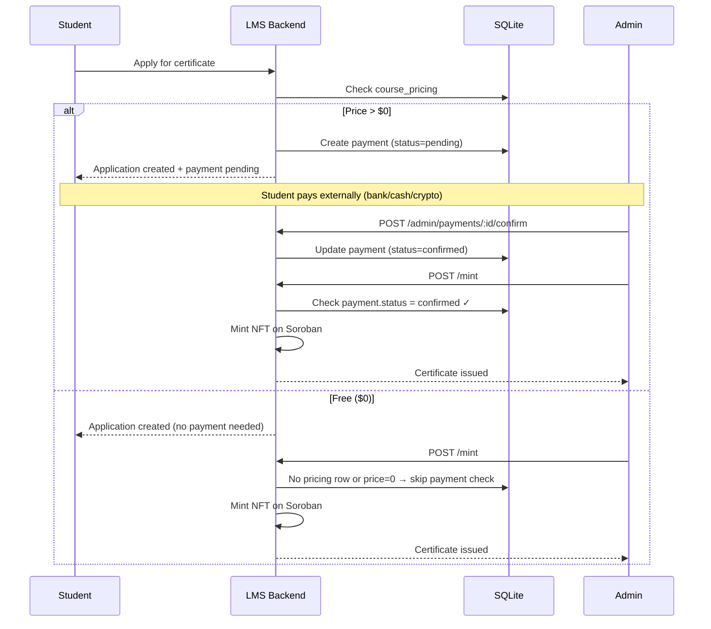
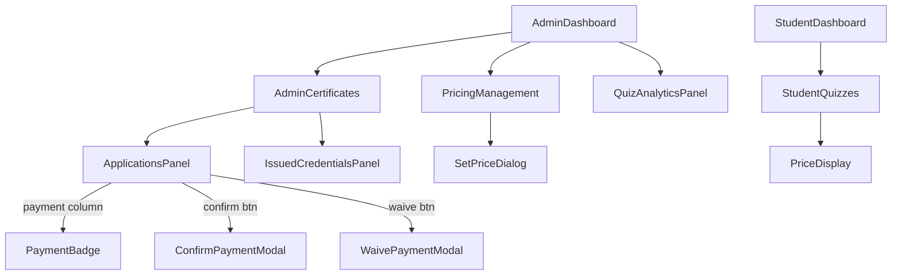
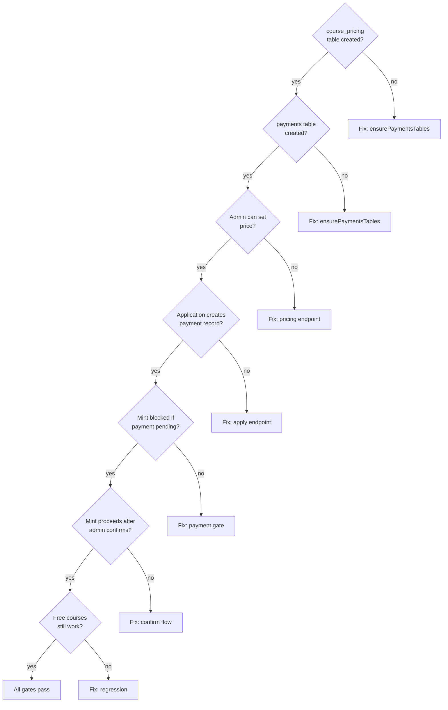

# Phase 11 C1a — Manual Payment Foundation (Pricing + Admin Confirmation)

**Date:** 2026-08-04
**Status:** SPEC READY
**Depends on:** Phase 10 (quiz analytics + component tests) — RELEASED
**Branch:** `feat/phase11-c1a-manual-payment` (to be created at implementation time)
**Prerequisite:** None (no external payment provider required)

---

## Problem Statement

The LMS issues NFT certificates via a complete pipeline: eligibility → application → admin approval → Soroban mint. Currently, all certificates are free. The platform needs revenue from verified NFT certificates.

Phase 11 C1a establishes the minimal viable payment foundation: admin-managed course pricing and manual payment confirmation. This requires no external payment provider (no Stripe account, no API keys). It creates the data model and payment gate that C1 (Stripe + Stellar) will later extend with automated payment rails.

**Current state:**
- `quiz_completions.payment_status` exists but is hardcoded `'none'` everywhere
- `course_nft_applications` has no payment tracking between 'approved' and 'minted'
- `mintService.ts` mints without any payment verification
- `StudentQuizzes.tsx` shows "Payment coming soon" disabled button
- Zero payment gateway code exists
- 48/48 frontend tests, 454/454 backend tests

---

## Goals

1. Add `course_pricing` table — admin sets certificate price per course (including $0 for free)
2. Add `payments` table — tracks payment records linked to certificate applications
3. Add payment gate in mint endpoint — reject mint if payment required but not confirmed
4. Add admin UI for pricing management and manual payment confirmation
5. Update student UI to show certificate price and payment status
6. Preserve existing free certificate flow for courses with price = 0 or no pricing row
7. Establish data model that C1 (Stripe + Stellar) extends without schema changes

## Non-Goals

- No Stripe integration (deferred to C1)
- No Stellar native payment verification (deferred to C1)
- No automated payment processing of any kind
- No student self-service payment initiation
- No refund workflow
- No payment analytics dashboard (Phase 12+)
- No subscription/recurring billing
- No multi-currency beyond USD
- No quiz-level payment (course-level only)

---

## Scope

### In Scope

| Area | Change |
|------|--------|
| Data model | New `course_pricing` + `payments` tables |
| Backend | Pricing CRUD, payment confirmation, payment gate on mint |
| Frontend (admin) | Pricing management, payment status in certificates, confirm/waive buttons |
| Frontend (student) | Price display on certificate application, payment status indicator |
| Tests | ~10 backend + ~7 frontend new tests |

### Out of Scope

| Area | Why |
|------|-----|
| Stripe Checkout | Requires Stripe account (C1) |
| Stellar payments | Requires payment monitor (C1) |
| Webhook handling | No external events to process (C1) |
| Payment analytics | Phase 12+ |
| Quiz-level payments | Deferred — course-level only |

---

## Data Model Changes

### New Table: `course_pricing`

```sql
CREATE TABLE IF NOT EXISTS course_pricing (
  id TEXT PRIMARY KEY,
  course_id TEXT NOT NULL UNIQUE,
  price_cents INTEGER NOT NULL DEFAULT 0,
  currency TEXT NOT NULL DEFAULT 'USD',
  is_active INTEGER NOT NULL DEFAULT 1,
  created_at TEXT NOT NULL DEFAULT (datetime('now')),
  updated_at TEXT NOT NULL DEFAULT (datetime('now')),
  FOREIGN KEY (course_id) REFERENCES courses(id)
);

CREATE INDEX IF NOT EXISTS idx_course_pricing_course_id ON course_pricing(course_id);
```

**Design notes:**
- `price_cents` stores price as integer cents (avoids float issues)
- `UNIQUE` on `course_id` — one pricing row per course
- `is_active` allows disabling pricing without deletion
- No pricing row = free (same as `price_cents = 0`)
- Future C1 adds `stellar_price_xlm REAL` and `stellar_price_usdc REAL` columns

### New Table: `payments`

```sql
CREATE TABLE IF NOT EXISTS payments (
  id TEXT PRIMARY KEY,
  user_id TEXT NOT NULL,
  course_id TEXT NOT NULL,
  application_id TEXT,
  amount_cents INTEGER NOT NULL,
  currency TEXT NOT NULL DEFAULT 'USD',
  payment_method TEXT NOT NULL DEFAULT 'manual',
  status TEXT NOT NULL DEFAULT 'pending',
  confirmed_by TEXT,
  confirmed_at TEXT,
  notes TEXT,
  created_at TEXT NOT NULL DEFAULT (datetime('now')),
  updated_at TEXT NOT NULL DEFAULT (datetime('now')),
  FOREIGN KEY (user_id) REFERENCES users(id),
  FOREIGN KEY (course_id) REFERENCES courses(id),
  FOREIGN KEY (application_id) REFERENCES course_nft_applications(id),
  FOREIGN KEY (confirmed_by) REFERENCES users(id)
);

CREATE INDEX IF NOT EXISTS idx_payments_user_id ON payments(user_id);
CREATE INDEX IF NOT EXISTS idx_payments_course_id ON payments(course_id);
CREATE INDEX IF NOT EXISTS idx_payments_application_id ON payments(application_id);
CREATE INDEX IF NOT EXISTS idx_payments_status ON payments(status);
```

**Status values:** `'pending'` | `'confirmed'` | `'waived'`
**Payment method values:** `'manual'` | `'waived'` (future C1 adds: `'stripe'`, `'stellar_xlm'`, `'stellar_usdc'`)

**Design notes:**
- `application_id` links payment to specific certificate application
- `confirmed_by` tracks which admin confirmed/waived the payment
- Future C1 adds `stripe_session_id`, `stripe_payment_intent_id`, `stellar_tx_hash`, `stellar_memo` columns
- No `UNIQUE` on `application_id` — allows retry if first payment record is abandoned

### Modified Table: `course_nft_applications`

Add column:
```sql
ALTER TABLE course_nft_applications ADD COLUMN payment_id TEXT REFERENCES payments(id);
```

**Migration approach:**
- Use `ALTER TABLE ADD COLUMN` (safe in SQLite, no table rebuild needed)
- Existing rows get `payment_id = NULL` (free courses, no payment needed)
- `ensurePaymentsTables()` in `database.ts` handles this via `PRAGMA table_info` check

---

## Backend API Design

### New Endpoints

#### a) `GET /api/v1/courses/:courseId/pricing` (authenticated)

Returns certificate pricing for a course. Any authenticated user can check pricing.

```typescript
// Response
{
  success: true,
  data: {
    courseId: string,
    priceCents: number,
    currency: string,
    isFree: boolean  // true if priceCents === 0 or no pricing row
  }
}
```

#### b) `PUT /api/v1/admin/courses/:courseId/pricing` (admin only)

Set or update certificate price for a course.

```typescript
// Request body
{ priceCents: number }  // 0 = free, 1500 = $15.00

// Response
{
  success: true,
  data: { courseId, priceCents, currency: 'USD', isFree: boolean }
}
```

**Validation:**
- `priceCents` must be integer >= 0
- Course must exist
- Creates `course_pricing` row if none exists, updates if exists (upsert)

#### c) `POST /api/v1/admin/payments/:paymentId/confirm` (admin only)

Manually confirm a payment (admin received payment externally).

```typescript
// Request body (optional)
{ notes?: string }

// Response
{
  success: true,
  data: { paymentId, status: 'confirmed', confirmedBy, confirmedAt }
}
```

**Behavior:**
- Sets `status = 'confirmed'`, `confirmed_by = req.user.id`, `confirmed_at = now()`
- Links payment to application via `payment_id` FK
- Idempotent: if already confirmed, returns success with existing data

#### d) `POST /api/v1/admin/payments/:paymentId/waive` (admin only)

Waive payment for a student (scholarship, sponsorship, etc.).

```typescript
// Request body
{ notes: string }  // notes REQUIRED for waiver audit trail

// Response
{
  success: true,
  data: { paymentId, status: 'waived', confirmedBy, confirmedAt, notes }
}
```

#### e) `GET /api/v1/admin/payments` (admin only)

List all payments with optional filters.

```typescript
// Query params: ?status=pending&courseId=xxx
// Response
{
  success: true,
  data: {
    payments: [{
      paymentId, userId, userName, userEmail,
      courseId, courseName, applicationId,
      amountCents, currency, paymentMethod, status,
      confirmedBy, confirmedByName, confirmedAt,
      notes, createdAt
    }]
  }
}
```

### Modified Endpoints

#### f) Modify `POST /courses/:courseId/completions/apply`

After creating the application, if course has `price_cents > 0`:
1. Create a `payments` record with `status = 'pending'`, `payment_method = 'manual'`
2. Link `application_id` to the payment
3. Include payment info in response

```typescript
// Extended response for paid courses
{
  success: true,
  message: 'Application submitted',
  data: {
    applicationId: string,
    payment: {           // NEW — only present if course has price
      paymentId: string,
      amountCents: number,
      currency: string,
      status: 'pending'
    }
  }
}
```

**For free courses:** No payment record created, response unchanged.

#### g) Modify `POST /courses/:courseId/completions/applications/:appId/mint`

Add payment gate before minting:

```typescript
// Pseudocode for payment gate
const pricing = paymentService.getCoursePricing(courseId);
if (pricing && pricing.price_cents > 0) {
  const satisfied = paymentService.isPaymentSatisfied(applicationId);
  if (!satisfied) {
    return res.status(402).json({
      success: false,
      message: 'Payment required. Certificate payment has not been confirmed.'
    });
  }
}
// ... existing mint logic continues
```

**HTTP 402 (Payment Required):** Used when payment gate blocks minting.

### New Service: `paymentService.ts`

```typescript
// LMS-Server/src/services/paymentService.ts

export interface CoursePricing {
  id: string;
  courseId: string;
  priceCents: number;
  currency: string;
  isActive: boolean;
}

export interface Payment {
  id: string;
  userId: string;
  courseId: string;
  applicationId: string | null;
  amountCents: number;
  currency: string;
  paymentMethod: string;
  status: 'pending' | 'confirmed' | 'waived';
  confirmedBy: string | null;
  confirmedAt: string | null;
  notes: string | null;
  createdAt: string;
  updatedAt: string;
}

// Functions:
getCoursePricing(courseId: string): CoursePricing | null
setCoursePricing(courseId: string, priceCents: number): CoursePricing
createPayment(userId: string, courseId: string, applicationId: string, amountCents: number): Payment
confirmPayment(paymentId: string, confirmedBy: string, notes?: string): Payment
waivePayment(paymentId: string, confirmedBy: string, notes: string): Payment
getPaymentForApplication(applicationId: string): Payment | null
isPaymentSatisfied(applicationId: string): boolean
  // Returns true if: no pricing row, price = 0, payment confirmed, or payment waived
listPayments(filters?: { status?: string; courseId?: string }): PaymentWithDetails[]
```

### New Route File: `payments.ts`

```typescript
// LMS-Server/src/routes/payments.ts
import { Router } from 'express';
import { authenticate, authorize } from '../middleware/auth.js';

const router = Router();
router.use(authenticate);

// Public (authenticated) - student can check pricing
router.get('/courses/:courseId/pricing', getPricing);

// Admin only
router.use(authorize('admin'));
router.put('/courses/:courseId/pricing', setPricing);
router.get('/payments', listPayments);
router.post('/payments/:paymentId/confirm', confirmPayment);
router.post('/payments/:paymentId/waive', waivePayment);

export default router;
```

**Note:** Pricing GET is registered on the main router (not admin-only) since students need to see prices. Admin-only endpoints are guarded by `authorize('admin')`.

---

## Frontend UX Design

### Admin Side

#### a) Pricing Management Section (in AdminDashboard)

New `PricingManagement` component embedded in AdminDashboard, similar to how QuizAnalyticsPanel was added in Phase 10 C2.

```
┌─────────────────────────────────────────────────────┐
│ Certificate Pricing                                  │
├──────────────┬───────────┬──────────────────────────┤
│ Course       │ Price     │ Actions                  │
├──────────────┼───────────┼──────────────────────────┤
│ Blockchain   │ $25.00    │ [Edit Price]             │
│ Web3 Intro   │ Free      │ [Set Price]              │
│ DeFi Course  │ $15.00    │ [Edit Price]             │
└──────────────┴───────────┴──────────────────────────┘
```

**Set/Edit Price Dialog:**
```
┌────────────────────────────────┐
│ Set Certificate Price          │
│                                │
│ Course: Blockchain Fundamentals│
│                                │
│ Price (USD): [  25.00  ]       │
│                                │
│ Set to $0 for free             │
│                                │
│ [Cancel]  [Save Price]         │
└────────────────────────────────┘
```

#### b) AdminCertificates.tsx Modifications

Add "Payment" column to the applications table:

```
┌────────┬───────┬────────┬──────────┬─────────┬──────────────────┐
│ Student│ Course│ Status │ Payment  │ Applied │ Actions          │
├────────┼───────┼────────┼──────────┼─────────┼──────────────────┤
│ Alice  │ BVC   │ approved│ ⏳ Pending│ Aug 3  │ [Confirm Pay] [Mint]│
│ Bob    │ SVC   │ approved│ ✅ Confirmed│ Aug 2 │ [Mint]          │
│ Carol  │ BVC   │ approved│ 🆓 Free  │ Aug 1  │ [Mint]          │
│ Dave   │ BVC   │ pending │ ⏳ Pending│ Aug 4  │ [Approve]       │
└────────┴───────┴────────┴──────────┴─────────┴──────────────────┘
```

**Payment status badges:**
- 🆓 **Free** (green) — course price = 0 or no pricing
- ⏳ **Pending** (yellow) — payment not yet confirmed
- ✅ **Confirmed** (blue) — admin confirmed payment
- 🎓 **Waived** (purple) — payment waived (scholarship)

**Buttons:**
- **"Confirm Payment"** — visible when payment status = pending; opens confirmation modal
- **"Waive Payment"** — visible when payment status = pending; opens waiver modal with required notes field
- **"Mint"** — disabled with tooltip "Payment not confirmed" when payment = pending on paid course

**Confirm Payment Modal:**
```
┌──────────────────────────────────┐
│ Confirm Payment                   │
│                                   │
│ Student: Alice Johnson            │
│ Course: Blockchain Fundamentals   │
│ Amount: $25.00                    │
│                                   │
│ Notes (optional): [            ]  │
│                                   │
│ Confirm that payment has been     │
│ received for this certificate.    │
│                                   │
│ [Cancel]  [Confirm Payment]       │
└──────────────────────────────────┘
```

**Waive Payment Modal:**
```
┌──────────────────────────────────┐
│ Waive Payment                     │
│                                   │
│ Student: Bob Smith                │
│ Course: Blockchain Fundamentals   │
│ Amount: $25.00 (will be waived)   │
│                                   │
│ Reason (required): [           ]  │
│ e.g., Scholarship, sponsor grant  │
│                                   │
│ [Cancel]  [Waive Payment]         │
└──────────────────────────────────┘
```

### Student Side

#### c) Certificate Application Flow

When a student applies for a certificate on a paid course, the response includes payment info. The existing UI shows application status — extend it to show payment status:

**Before (free course):**
```
✅ Your certificate application has been submitted.
   Status: Pending review
```

**After (paid course):**
```
✅ Your certificate application has been submitted.
   Status: Pending review
   Certificate fee: $25.00
   Payment status: Pending — please arrange payment with your administrator
```

**After payment confirmed:**
```
✅ Your certificate application has been submitted.
   Status: Approved
   Certificate fee: $25.00
   Payment status: ✅ Confirmed
   Your certificate will be issued shortly.
```

#### d) StudentQuizzes.tsx Modification

Replace the "Payment coming soon" placeholder with actual price display:

**If course has price > 0:**
```
┌─────────────────────────────────────┐
│ 💳 Certificate Fee                   │
│                                      │
│ Certificate price: $25.00            │
│ Contact your administrator to        │
│ arrange payment.                     │
└─────────────────────────────────────┘
```

**If course is free (price = 0 or no pricing):**
```
┌─────────────────────────────────────┐
│ 🎓 Certificate                       │
│                                      │
│ This certificate is free.            │
│ Complete course requirements to      │
│ apply.                               │
└─────────────────────────────────────┘
```

---

## Testing Strategy

### Backend Tests (target: 10 new tests)

File: `LMS-Server/src/__tests__/payments.test.ts`

| ID | Test | Description |
|----|------|-------------|
| PAY-B1 | GET pricing — priced course | Returns `priceCents: 1500, isFree: false` |
| PAY-B2 | GET pricing — no pricing row | Returns `priceCents: 0, isFree: true` |
| PAY-B3 | PUT pricing — admin sets price | Creates/updates pricing row, returns updated data |
| PAY-B4 | PUT pricing — non-admin rejected | Returns 401 (unauthenticated) and 403 (student) |
| PAY-B5 | POST confirm — updates status | Sets `status = 'confirmed'`, `confirmed_by`, `confirmed_at` |
| PAY-B6 | POST confirm — non-admin rejected | Returns 401/403 |
| PAY-B7 | POST waive — requires notes | Returns 400 if notes empty, 200 with notes |
| PAY-B8 | Mint gate — rejects pending payment | Returns 402 when `payment.status = 'pending'` on paid course |
| PAY-B9 | Mint gate — allows confirmed payment | Returns 200, mint proceeds after confirmation |
| PAY-B10 | Mint gate — allows free course | Returns 200, no payment check for free courses |

**Test pattern:** Supertest + seeded SQLite data, same as `analytics-quiz.test.ts` from Phase 10 C2.

### Frontend Tests (target: 7 new tests)

File: `LMS-Frontend/src/__tests__/components/PricingManagement.test.tsx`
File: `LMS-Frontend/src/__tests__/components/PaymentStatus.test.tsx`

| ID | Test | Description |
|----|------|-------------|
| PAY-F1 | PricingManagement — renders course list | Shows courses with prices, edit buttons |
| PAY-F2 | PricingManagement — set price dialog | Opens dialog, saves price on submit |
| PAY-F3 | Payment badge — pending state | Shows yellow "Pending" badge |
| PAY-F4 | Payment badge — confirmed state | Shows blue "Confirmed" badge |
| PAY-F5 | Payment badge — free state | Shows green "Free" badge |
| PAY-F6 | Confirm payment — triggers API call | Button click → confirmation modal → API call |
| PAY-F7 | Mint button — disabled when pending | Disabled with tooltip when payment not confirmed |

### Regression Coverage

- All 48 existing frontend tests must pass
- All 454 existing backend tests must pass
- Existing `/courses/:id/completions/applications/:appId/mint` endpoint unchanged for free courses
- Existing `mintService.ts` flow unchanged (payment check added before, not inside)

### Manual QA Checklist

- [ ] Set price on a course ($25.00), verify it appears in pricing management
- [ ] Set price to $0, verify "Free" badge appears
- [ ] Apply for certificate on paid course, verify payment record created
- [ ] Apply for certificate on free course, verify no payment record
- [ ] Confirm payment as admin, verify status updates
- [ ] Waive payment as admin with notes, verify status updates
- [ ] Attempt mint with pending payment, verify 402 rejection
- [ ] Mint after payment confirmed, verify certificate issued
- [ ] Mint on free course, verify no payment gate
- [ ] Change price after application exists, verify existing payment unchanged

---

## Edge Cases & Error Handling

| Scenario | Behavior |
|----------|----------|
| Admin sets price after applications exist | Existing applications without payment records are treated as free (backward compatible). New applications get payment records. |
| Admin changes price | New applications use new price. Existing pending payments retain original amount. |
| Double confirmation | Idempotent — already-confirmed payment returns success with existing data. |
| Payment confirmed but application rejected | Payment stays confirmed, but certificate not issued (application status governs issuance). |
| Student applies for free course | No payment record created, mint proceeds without payment check. |
| Waive without notes | Rejected with 400 — notes required for audit trail. |
| Payment for non-existent application | Rejected with 404. |
| Admin confirms own waiver | Allowed — no self-confirmation restriction (small team). |

---

## Touched Files

### New Files (5)

| File | Purpose |
|------|---------|
| `LMS-Server/src/services/paymentService.ts` | Payment + pricing business logic (8 functions) |
| `LMS-Server/src/routes/payments.ts` | Payment + pricing REST endpoints |
| `LMS-Server/src/__tests__/payments.test.ts` | Backend payment tests (10 cases) |
| `LMS-Frontend/src/components/PricingManagement.tsx` | Admin pricing management component |
| `LMS-Frontend/src/__tests__/components/PricingManagement.test.tsx` | Pricing + payment frontend tests (7 cases) |

### Modified Files (9)

| File | Change |
|------|--------|
| `LMS-Server/src/config/database.ts` | Add `ensurePaymentsTables()` — creates `course_pricing` + `payments` tables |
| `LMS-Server/src/app.ts` | Register payment routes (`app.use('/api/v1', paymentRoutes)`) |
| `LMS-Server/src/routes/nftApplications.ts` | Add payment gate in mint endpoint, create payment record in apply endpoint |
| `LMS-Server/src/types/index.ts` | Add `Payment`, `CoursePricing`, `PaymentStatus`, `PaymentMethod` types |
| `LMS-Frontend/src/pages/AdminCertificates.tsx` | Add payment column, confirm/waive buttons, disable mint when pending |
| `LMS-Frontend/src/pages/StudentQuizzes.tsx` | Replace "Payment coming soon" with price display |
| `LMS-Frontend/src/services/adminCertificateService.ts` | Add `confirmPayment()`, `waivePayment()`, `getPayments()` methods |
| `LMS-Frontend/src/services/courseCompletionService.ts` | Add `getPricing()` method |
| `LMS-Frontend/src/types/api.ts` | Add `Payment`, `CoursePricing` frontend types |

---

## Rollout & Compatibility

### Migration Strategy

1. `ensurePaymentsTables()` runs on server startup (same pattern as all existing tables)
2. `ALTER TABLE course_nft_applications ADD COLUMN payment_id TEXT` via startup check
3. No data migration needed — existing applications treated as free
4. All existing free courses continue to work identically

### Activation Strategy

1. Deploy code — zero impact until admin sets price > 0 on a course
2. Admin sets price on one test course
3. Verify: apply → payment pending → confirm → mint works
4. Gradually set prices on remaining courses

### Rollback

```bash
git revert <merge-commit>  # removes all payment code
# Existing applications with payment_id column remain but are ignored
# No data loss — course_pricing + payments tables become unused
```

### Docker Deploy

```bash
docker compose build api web && docker compose up -d --no-deps api web
```

---

## Mermaid Diagrams

### Manual Payment Flow



### Data Model

```mermaid
erDiagram
    courses ||--o| course_pricing : "has pricing"
    courses ||--o{ course_nft_applications : "has applications"
    users ||--o{ course_nft_applications : "applies"
    users ||--o{ payments : "makes"
    courses ||--o{ payments : "for"
    course_nft_applications ||--o| payments : "linked to"
    course_nft_applications ||--o| nft_credentials : "produces"

    course_pricing {
        text id PK
        text course_id FK_UK
        int price_cents
        text currency
        int is_active
    }

    payments {
        text id PK
        text user_id FK
        text course_id FK
        text application_id FK
        int amount_cents
        text currency
        text payment_method
        text status
        text confirmed_by FK
        text confirmed_at
        text notes
    }

    course_nft_applications {
        text id PK
        text user_id FK
        text course_id FK
        text status
        text payment_id FK
    }

    nft_credentials {
        text id PK
        text user_id FK
        text course_id FK
        text mint_status
        text tx_hash
    }
```

### Component Structure



### Verification / Test Gate Flow



---

## To-Do Lists

### Spec Checklist

- [x] Problem statement reviewed
- [x] Payment model defined (manual only)
- [x] Goals and non-goals explicit
- [x] Data model schema designed
- [x] Backend endpoints designed
- [x] Frontend UX designed
- [x] Test plan defined (10 backend + 7 frontend)
- [x] Edge cases documented
- [x] Touched files listed
- [x] Rollout plan documented

### Data Model Checklist

- [ ] `course_pricing` table with UNIQUE on `course_id`
- [ ] `payments` table with FKs to users, courses, applications
- [ ] Indexes on `user_id`, `course_id`, `application_id`, `status`
- [ ] `course_nft_applications.payment_id` column addition
- [ ] `ensurePaymentsTables()` in database.ts

### Backend Checklist

- [ ] `paymentService.ts` — 8 functions
- [ ] `payments.ts` routes — 5 endpoints (GET pricing, PUT pricing, POST confirm, POST waive, GET list)
- [ ] Pricing endpoint (GET any auth, PUT admin-only)
- [ ] Payment gate in mint endpoint (402 if pending)
- [ ] Payment record creation in apply endpoint (for paid courses)
- [ ] Auth guards on all admin endpoints

### Frontend Checklist

- [ ] `PricingManagement` component with course list + edit
- [ ] `SetPriceDialog` modal
- [ ] Payment status badge in `AdminCertificates`
- [ ] `ConfirmPaymentModal`
- [ ] `WaivePaymentModal`
- [ ] Mint button disabled when payment pending
- [ ] Student price display in `StudentQuizzes`
- [ ] Replace "Payment coming soon" placeholder

### Test Checklist

- [ ] PAY-B1 through PAY-B10 (10 backend tests)
- [ ] PAY-F1 through PAY-F7 (7 frontend tests)
- [ ] Regression: 48/48 frontend pass
- [ ] Regression: 454/454 backend pass
- [ ] Manual QA: paid certificate flow
- [ ] Manual QA: free certificate flow
- [ ] Manual QA: waive payment flow

### Risk Checklist

- [ ] Price change mid-application handled (existing payments unchanged)
- [ ] Double confirmation is idempotent
- [ ] Free course regression preserved
- [ ] No payment data leaks to non-admin users
- [ ] Payment status visible only to admin + owning student

---

## Review Checklist

- [ ] **Scope correctness:** Manual payment only, no external payment providers
- [ ] **Data model correctness:** FKs, indexes, UNIQUE constraints, forward-compatible for C1
- [ ] **API design correctness:** RESTful, consistent with existing `/api/v1/` patterns
- [ ] **UI/UX correctness:** Admin workflow clear, student impact minimal
- [ ] **Test coverage correctness:** Payment gate, pricing CRUD, confirmation, regression
- [ ] **Rollback safety:** Single revert removes all payment logic, no data loss
- [ ] **No unresolved assumptions:** All behaviors specified

---

## Acceptance Criteria

| ID | Criterion |
|----|-----------|
| AC-1 | Admin can set certificate price per course (including $0 for free) |
| AC-2 | Student applying for paid certificate sees price and "payment pending" status |
| AC-3 | Admin can confirm payment, which updates payment status to 'confirmed' |
| AC-4 | Admin can waive payment with required notes, status updates to 'waived' |
| AC-5 | Mint endpoint returns 402 if payment is pending on a paid course |
| AC-6 | Mint proceeds after payment confirmed or waived |
| AC-7 | Free courses ($0 or no pricing row) work without any payment gate |
| AC-8 | All 48 existing frontend tests pass |
| AC-9 | All 454 existing backend tests pass |
| AC-10 | Payment status visible in AdminCertificates applications table |

---

## /loop Workflow

```
/loop assess   — Verify baselines: 48/48 frontend, 454/454 backend, tsc clean
/loop plan     — Write implementation plan from this spec
/loop implement — Execute plan (T0–T6 tasks)
/loop review   — Run all 7 verification gates (tsc, vitest×2, build, docker, http, health)
/loop defer    — Document any blockers found during implementation
```

---

## Relationship to Phase 11 C1

C1a is a strict subset of C1. The data model is designed so that C1 extends it without schema rewrites:

| C1a Creates | C1 Extends With |
|-------------|-----------------|
| `course_pricing` (USD only) | Add `stellar_price_xlm`, `stellar_price_usdc` columns |
| `payments` (manual only) | Add `stripe_session_id`, `stripe_payment_intent_id`, `stellar_tx_hash`, `stellar_memo` columns |
| `paymentService.ts` (confirm/waive) | Add `createStripeCheckout()`, `processWebhook()`, `verifyStellarPayment()` |
| Payment gate on mint | Unchanged — same gate checks payment.status |

**C1a can be implemented immediately.** C1 requires a Stripe account + API keys (external blocker).
