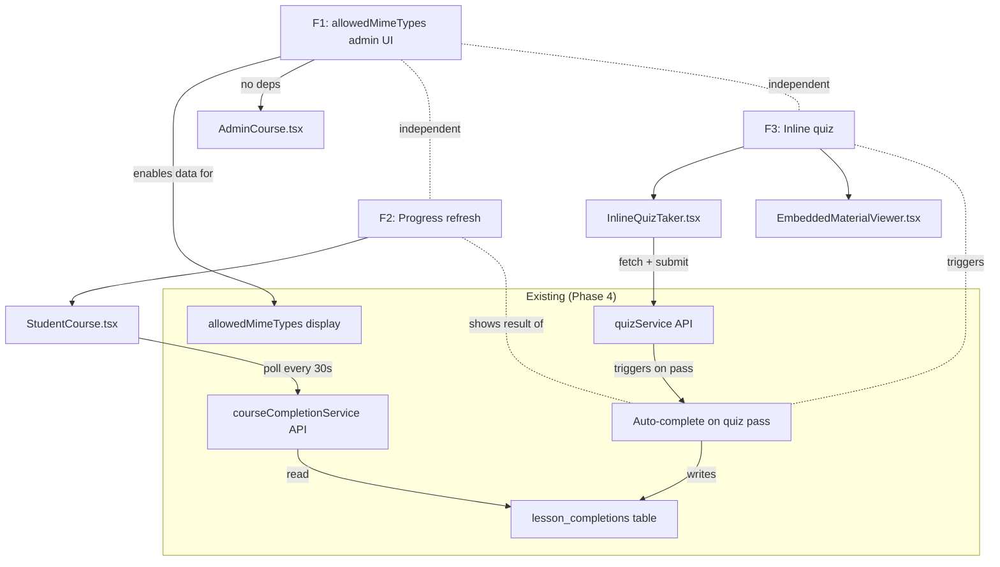
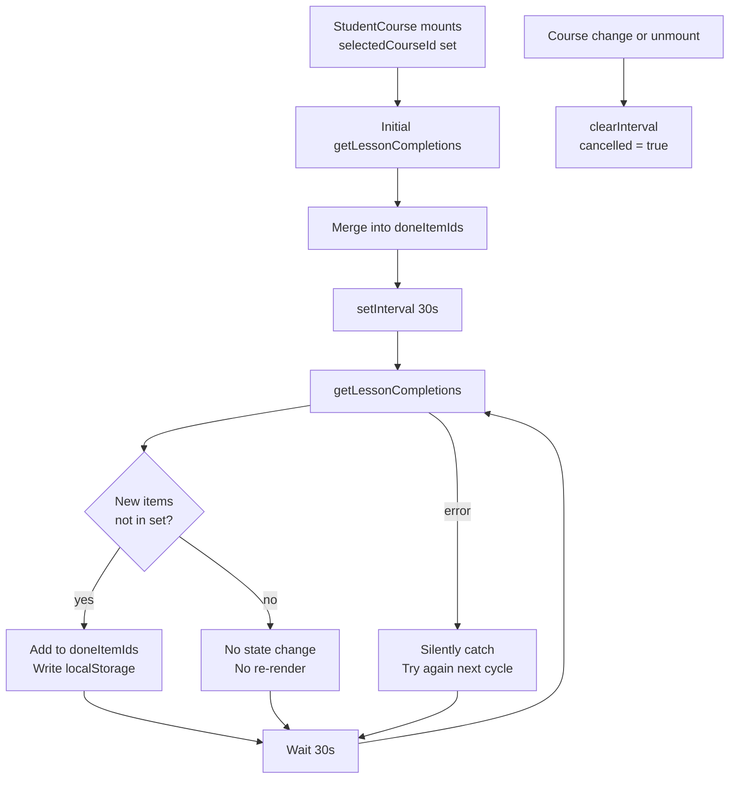
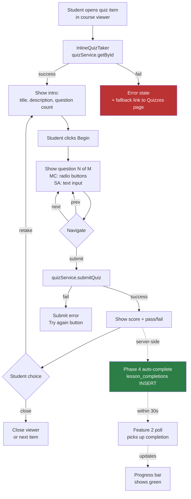
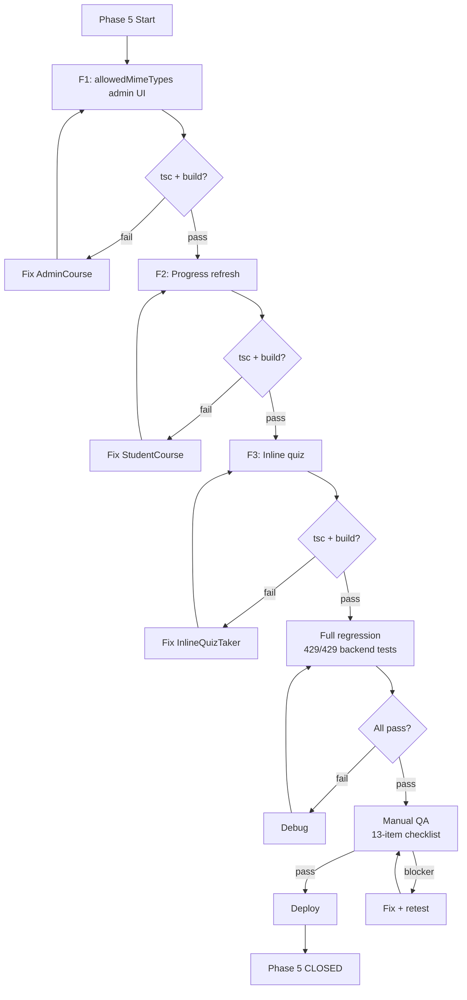

# Phase 5 Spec: Enhanced Course Interactions

**Date:** 2026-08-04
**Status:** SPEC READY
**Baseline:** Phase 4 released (`phase4-complete-2026-08-04`), 429/429 backend tests, site live
**Scope:** 3 features — allowedMimeTypes admin UI, progress refresh, inline quiz

---

## 1. Problem Statement

Phase 4 added smart completion (quiz auto-complete on pass, assignment auto-complete on approval) and allowedMimeTypes display for students. Three UX gaps remain:

1. Admins cannot set `allowedMimeTypes` through the UI — the field exists in the data model and renders for students (Phase 4), but the admin course editor has no control for it
2. When a quiz is auto-completed server-side, the student's progress bar doesn't update until they manually refresh the page
3. Taking a quiz requires navigating away from the course viewer to the standalone Quizzes page, breaking the learning flow

Phase 5 closes these gaps with an admin editor widget, a polling-based progress refresh, and an inline quiz-taking component.

---

## 2. Goals

1. Let admins set accepted file types for assignment items through the course editor UI
2. Auto-refresh student progress every 30 seconds so server-side auto-completions appear without page reload
3. Let students take quizzes inline within the course viewer without navigating to a separate page

## 3. Non-Goals

- No audio playback tracking (Phase 6+ — requires new DB table and completion model)
- No real-time push via WebSocket or SSE (30s polling is sufficient)
- No inline assignment submission (stretch goal, not core scope)
- No backend API changes (all 3 features use existing endpoints)
- No schema changes
- No new npm dependencies
- No changes to the standalone Quizzes page (`StudentQuizzes.tsx` continues to work as-is)

---

## 4. User Stories

### US-1: File Type Configuration

> As an admin editing a course, I want to select which file types are accepted for an assignment item so that students see clear upload guidance.

### US-2: Live Progress

> As a student viewing a course, I want my progress bar to update automatically when a quiz or assignment is auto-completed server-side, so I don't have to refresh the page.

### US-3: Inline Quiz

> As a student viewing a quiz course item, I want to take the quiz directly in the course viewer so I don't lose my place navigating to a separate page.

---

## 5. Feature Specifications

### Feature 1: allowedMimeTypes Admin UI

**Type:** Frontend-only
**File:** `LMS-Frontend/src/pages/AdminCourse.tsx`
**Insertion point:** After the `maxFileSize` input (line 1131), within the `{it.type === 'assignment' && (...)}` block

#### Existing Data Pipeline (All Complete)

| Layer | Status | Evidence |
|-------|--------|---------|
| Type: `ItemDraft.allowedMimeTypes?: string[]` | Done | `AdminCourse.tsx:48` |
| Serialization: `buildCourse()` | Done | `AdminCourse.tsx:758` — spreads if non-empty |
| Deserialization: `startEdit()` | Done | `AdminCourse.tsx:484` — reads from course JSON |
| Student display | Done | `EmbeddedMaterialViewer.tsx:354-373` — Phase 4 |
| **Admin edit UI** | **MISSING** | **This feature** |

#### Behavior

| Action | Result |
|--------|--------|
| Admin opens assignment item editor | Sees checkboxes for common file types below `maxFileSize` |
| Admin checks "PDF" and "DOCX" | `updateItem(w, s, it, { allowedMimeTypes: ['application/pdf', 'application/vnd...document'] })` |
| Admin unchecks all boxes | `updateItem(w, s, it, { allowedMimeTypes: [] })` |
| Admin saves course | `buildCourse()` serializes `allowedMimeTypes` into sections JSON |
| Admin reloads editor | `startEdit()` restores checkboxes from sections JSON |
| Student views item | Sees "Accepted formats: PDF, DOCX" (Phase 4 display) |

#### MIME Type Checkbox Options

Use the same 9 types from the Phase 4 `MIME_LABELS` map:

| Label | MIME Type |
|-------|-----------|
| PDF | `application/pdf` |
| DOCX | `application/vnd.openxmlformats-officedocument.wordprocessingml.document` |
| XLSX | `application/vnd.openxmlformats-officedocument.spreadsheetml.sheet` |
| PPTX | `application/vnd.openxmlformats-officedocument.presentationml.presentation` |
| JPEG | `image/jpeg` |
| PNG | `image/png` |
| GIF | `image/gif` |
| TXT | `text/plain` |
| CSV | `text/csv` |

#### Implementation

```tsx
{/* After the maxFileSize input, inside the assignment block */}
<div className="flex flex-wrap gap-2">
  <span className="text-xs text-neutral-500 w-full">Accepted file types:</span>
  {[
    ['PDF', 'application/pdf'],
    ['DOCX', 'application/vnd.openxmlformats-officedocument.wordprocessingml.document'],
    ['XLSX', 'application/vnd.openxmlformats-officedocument.spreadsheetml.sheet'],
    ['PPTX', 'application/vnd.openxmlformats-officedocument.presentationml.presentation'],
    ['JPEG', 'image/jpeg'],
    ['PNG', 'image/png'],
    ['GIF', 'image/gif'],
    ['TXT', 'text/plain'],
    ['CSV', 'text/csv'],
  ].map(([label, mime]) => (
    <label key={mime} className="inline-flex items-center gap-1 text-xs">
      <input
        type="checkbox"
        checked={it.allowedMimeTypes?.includes(mime) ?? false}
        onChange={(e) => {
          const current = it.allowedMimeTypes ?? [];
          const next = e.target.checked
            ? [...current, mime]
            : current.filter((m) => m !== mime);
          updateItem(week.tempId, sec.tempId, it.tempId, { allowedMimeTypes: next });
        }}
      />
      {label}
    </label>
  ))}
</div>
```

#### Edge Cases

| Case | Behavior |
|------|----------|
| No checkboxes checked | `allowedMimeTypes` is `[]` → student display shows nothing |
| All checkboxes checked | All 9 types stored → student sees all labels |
| Existing item has custom MIME types (from CSV import) | Checkboxes for known types show checked; unknown types are preserved but have no checkbox |
| Admin clears all, then saves | `buildCourse()` omits `allowedMimeTypes` (empty array → `?.length` is falsy) |

#### Backward Compatibility

No existing assignment items have `allowedMimeTypes` set in production. All checkboxes will be unchecked by default. No destructive changes.

---

### Feature 2: Progress Refresh (30s Long-Poll)

**Type:** Frontend-only
**File:** `LMS-Frontend/src/pages/StudentCourse.tsx`
**Insertion point:** Extend the existing server-seed useEffect (lines 322-338)

#### Current Behavior

1. On mount, `courseCompletionService.getLessonCompletions(courseId)` is called once
2. Server completions are merged into `doneItemIds` Set
3. No subsequent polling — student must refresh the page to see new completions

#### New Behavior

After initial load, poll `getLessonCompletions()` every 30 seconds. Merge new completions additively into `doneItemIds`. Stop polling on unmount or course change.

#### Data Flow

```
StudentCourse mounts → initial getLessonCompletions() → seed doneItemIds
  → setInterval(30000)
    → getLessonCompletions() → merge new item_ids into doneItemIds
    → if new items found: write to localStorage
  → on unmount: clearInterval
```

#### Implementation

Extend the existing useEffect at lines 322-338:

```typescript
useEffect(() => {
  if (!selectedCourseId || !user?.id) return;
  let cancelled = false;

  const sync = () => {
    courseCompletionService.getLessonCompletions(selectedCourseId).then((ids) => {
      if (cancelled || ids.length === 0) return;
      setDoneItemIds((prev) => {
        let changed = false;
        const merged = new Set(prev);
        for (const id of ids) {
          if (!merged.has(id)) { merged.add(id); changed = true; }
        }
        if (changed) writeDoneIds(user.id, selectedCourseId, merged);
        return changed ? merged : prev;
      });
    }).catch(() => { /* best-effort */ });
  };

  sync(); // initial seed (existing behavior)
  const interval = setInterval(sync, 30_000);

  return () => { cancelled = true; clearInterval(interval); };
}, [selectedCourseId, user?.id]);
```

This replaces the current useEffect (lines 322-338) with the same initial call plus a 30-second interval.

#### Behavioral Rules

| Condition | Behavior |
|-----------|----------|
| New completions found in poll | Added to `doneItemIds`, written to localStorage |
| No new completions | State unchanged (reference equality preserved — no re-render) |
| Network error during poll | Silently caught, next poll retries |
| Course changes while poll in flight | `cancelled = true` prevents setState |
| Component unmounts | `clearInterval` + `cancelled = true` |
| Student manually marks item done | Local state updated immediately; next poll confirms from server |
| Poll returns item already in set | `merged.has(id)` → `changed` stays false → no re-render |

#### Key Design Decisions

1. **30s interval:** Balances responsiveness with server load. One GET per 30s per student is negligible.
2. **Additive-only merge:** Never remove items from `doneItemIds` — only add. This prevents flicker if the server is slow to reflect a local mark.
3. **Reference equality optimization:** `return changed ? merged : prev` — React skips re-render if the Set reference doesn't change.
4. **No new API endpoint:** Uses existing `GET /courses/:courseId/lessons/completions`.

---

### Feature 3: Inline Quiz in Course Viewer

**Type:** Frontend — new component + viewer modification
**Files:**
- CREATE: `LMS-Frontend/src/components/InlineQuizTaker.tsx` (~150 lines)
- MODIFY: `LMS-Frontend/src/components/EmbeddedMaterialViewer.tsx` (~30 lines)

#### Current Behavior

Quiz item in course viewer → renders a "Start quiz" link → navigates to `/student/quizzes?quiz={quizId}` → student takes quiz on separate page.

#### New Behavior

Quiz item in course viewer → quiz questions render inline → student answers and submits without leaving the page → sees score/pass/fail result → progress updates via Feature 2 polling.

#### Data Flow

```
Student opens quiz item in course viewer
  → EmbeddedMaterialViewer renders InlineQuizTaker (quizId prop)
  → InlineQuizTaker calls quizService.getById(quizId)
  → Questions render inline
  → Student answers → state tracked in InlineQuizTaker
  → Student clicks Submit → quizService.submitQuiz(quizId, '', answers)
  → Server scores, creates quiz_completions
  → [Phase 4] Server auto-completes linked course item (lesson_completions INSERT)
  → Result displayed inline (score, pass/fail)
  → [Feature 2] Next 30s poll picks up the auto-completion
  → Progress bar updates
```

#### InlineQuizTaker Component Spec

```typescript
interface InlineQuizTakerProps {
  quizId: string;
}
```

**States:** `loading` → `intro` → `taking` → `submitting` → `result` | `error`

**State machine:**

| State | Display | Transitions |
|-------|---------|-------------|
| `loading` | Spinner / skeleton | → `intro` (quiz loaded) or `error` (fetch failed) |
| `intro` | Quiz title, description, question count, "Begin" button | → `taking` |
| `taking` | One question at a time, prev/next, answer inputs | → `submitting` (on final submit) |
| `submitting` | Disabled UI + spinner | → `result` (success) or `error` (failure) |
| `result` | Score, pass/fail badge, "Retake" or "Close" | → `intro` (retake) |
| `error` | Error message + "Try again" button + fallback link to Quizzes page | → `loading` (retry) |

**Key behaviors:**
- Fetches quiz data via `quizService.getById(quizId)`
- Tracks answers as `Record<string, string>` (same pattern as `StudentQuizzes.tsx`)
- Submits via `quizService.submitQuiz(quizId, '', answers)` (userId unused, auth header handles it)
- Displays result (score percentage, pass/fail)
- Does NOT use sessionStorage (inline experience is ephemeral — if student navigates away and back, they start fresh)
- Does NOT modify URL search params (avoid conflicting with course viewer state)

**Question rendering:** Reuse the same rendering patterns from `StudentQuizzes.tsx`:
- Multiple choice: radio buttons for each option
- Short answer: text input
- Question navigation: prev/next buttons with question counter

#### EmbeddedMaterialViewer Changes

Replace the "Start quiz" link with the `InlineQuizTaker` component:

```tsx
// Current (lines 304-336):
) : item.type === 'quiz' ? (
  (() => {
    const quizId = (item as { quizId?: string }).quizId?.trim();
    return quizId ? (
      // ... "Start quiz" link ...
    ) : (
      // ... "not configured" fallback ...
    );
  })()

// New:
) : item.type === 'quiz' ? (
  (() => {
    const quizId = (item as { quizId?: string }).quizId?.trim();
    return quizId ? (
      <InlineQuizTaker quizId={quizId} />
    ) : (
      // ... "not configured" fallback unchanged ...
    );
  })()
```

**Fallback:** If `InlineQuizTaker` fails to load quiz data, it renders a fallback with a link to `/student/quizzes?quiz={quizId}` so the student can still access the standalone page.

#### Behavioral Rules

| Condition | Behavior |
|-----------|----------|
| Quiz data loads successfully | Inline quiz UI renders (intro → take → result) |
| Quiz data fails to load | Error state with "Try again" button + fallback link to Quizzes page |
| Student passes quiz | Result shows score + "Passed" badge. Phase 4 auto-complete fires server-side. Feature 2 picks up completion within 30s. |
| Student fails quiz | Result shows score + "Not passed". "Retake" button returns to intro. |
| Student navigates to next item mid-quiz | Quiz state is lost (no sessionStorage). Acceptable for inline experience. |
| Student re-opens quiz item after passing | InlineQuizTaker fetches completion status and shows "Already completed" with score, plus "Retake" option |
| Quiz has 0 questions | Show "This quiz has no questions yet" message |
| `quizId` is empty/undefined | "Not configured" fallback (existing behavior, unchanged) |
| Standalone Quizzes page | Unchanged — `StudentQuizzes.tsx` is not modified |

#### Key Design Decisions

1. **New component (InlineQuizTaker) vs. refactoring StudentQuizzes:** Creating a new focused component avoids destabilizing the working standalone page. Shared patterns (question rendering, scoring display) can be copied rather than extracted — the overhead of a shared abstraction isn't worth it for 2 consumers.
2. **No sessionStorage:** The inline experience is ephemeral by design. SessionStorage would add complexity for a feature that's meant to be quick and in-context.
3. **No URL param changes:** The inline quiz should not push `?quiz=...&step=...` to the URL — that would conflict with the course viewer's own state management.
4. **Completion check on mount:** Before showing the intro, check if the student has already completed this quiz. If so, show the result directly with a "Retake" option. Use `quizService.getCompletion(quizId, userId)` — but `userId` must be obtained. Option: pass it as a prop or use the auth context.

#### Dependencies

| Dependency | Location | Verified |
|------------|----------|----------|
| `quizService.getById()` | `services/quizService.ts` | Yes — returns `Quiz \| null` |
| `quizService.submitQuiz()` | `services/quizService.ts` | Yes — returns `QuizCompletion` |
| `quizService.getCompletion()` | `services/quizService.ts` | Yes — returns `QuizCompletion \| null` |
| `Quiz` type (questions array) | `types/quiz.ts` | Yes |
| `QuizCompletion` type | `types/quiz.ts` | Yes |
| Phase 4 auto-complete | `quizzesController.ts` | Yes — fires on server for passing quizzes |
| Feature 2 progress polling | `StudentCourse.tsx` | Yes — picks up auto-completion |

#### Open Question: User ID for Completion Check

`quizService.getCompletion(quizId, userId)` requires a `userId`. The `EmbeddedMaterialViewer` does not currently receive a `userId` prop. Options:

**Option A:** Add `userId` as a prop to `InlineQuizTaker` (threaded from `StudentCourse.tsx` → `EmbeddedMaterialViewer` → `InlineQuizTaker`). Requires adding `userId?` to `EmbeddedMaterialViewerProps`.

**Option B:** Use a React context or auth hook inside `InlineQuizTaker` to get the current user. If an auth context exists, this avoids prop threading.

**Option C:** Skip the completion check — always show the intro. The student can retake the quiz regardless. Simplest approach.

**Recommended:** Option C for v1. Skip the completion check. Always start from intro. If the student has already passed, submitting again is idempotent (quiz auto-complete uses INSERT OR IGNORE). The result will show their new score. This avoids prop threading entirely.

---

## 6. Files Touched

| File | Change Type | Feature |
|------|------------|---------|
| `AdminCourse.tsx` | Modify (~40 lines) | F1: allowedMimeTypes checkboxes |
| `StudentCourse.tsx` | Modify (~10 lines net) | F2: add setInterval to existing useEffect |
| `InlineQuizTaker.tsx` | Create (~150 lines) | F3: inline quiz component |
| `EmbeddedMaterialViewer.tsx` | Modify (~10 lines net) | F3: render InlineQuizTaker instead of link |

**Total:** 1 new file, 3 modified files. ~210 lines of new code.

---

## 7. Acceptance Criteria

### Feature 1: allowedMimeTypes Admin UI

| ID | Criterion | Verification |
|----|-----------|-------------|
| F1-AC1 | Admin sees file type checkboxes when editing an assignment item | Manual QA |
| F1-AC2 | Checking "PDF" and "DOCX" stores both MIME types in `allowedMimeTypes` | Manual QA |
| F1-AC3 | Saving and reloading the course preserves the selection | Manual QA |
| F1-AC4 | Student sees "Accepted formats: PDF, DOCX" matching admin selection | Manual QA |
| F1-AC5 | Unchecking all types removes the format display for students | Manual QA |
| F1-AC6 | Existing assignment items without allowedMimeTypes render unchanged | Regression |

### Feature 2: Progress Refresh

| ID | Criterion | Verification |
|----|-----------|-------------|
| F2-AC1 | Progress bar updates within 30s after a server-side auto-completion | Manual QA |
| F2-AC2 | Polling stops when student leaves the course page | Code review |
| F2-AC3 | Polling stops when course selection changes | Code review |
| F2-AC4 | Network errors during polling don't crash the UI | Code review |
| F2-AC5 | Manually marked items are not lost during a poll cycle | Manual QA |
| F2-AC6 | No re-render when poll returns no new completions | Code review |

### Feature 3: Inline Quiz

| ID | Criterion | Verification |
|----|-----------|-------------|
| F3-AC1 | Quiz item in course viewer shows inline quiz (not a navigation link) | Manual QA |
| F3-AC2 | Student can answer questions and submit without leaving the page | Manual QA |
| F3-AC3 | Passing score shows "Passed" with score percentage | Manual QA |
| F3-AC4 | Failing score shows "Not passed" with score and "Retake" option | Manual QA |
| F3-AC5 | After passing, Phase 4 auto-complete fires (lesson_completions created) | Automated test (existing) |
| F3-AC6 | Progress bar updates within 30s (via Feature 2) | Manual QA |
| F3-AC7 | Failed quiz fetch shows error state with fallback link | Manual QA |
| F3-AC8 | Quiz with 0 questions shows "no questions" message | Code review |
| F3-AC9 | Standalone Quizzes page still works normally | Regression |
| F3-AC10 | Quiz answer keys not visible to students | Existing test (quiz-security) |

---

## 8. Test Strategy

### Automated Tests

All 3 features are frontend-only. Backend API endpoints are unchanged. No new backend tests needed.

Phase 4 auto-complete tests (8 tests) remain the verification that server-side completion works correctly when a quiz is submitted — whether from the standalone page or inline, the same `POST /quizzes/:id/submit` endpoint is called.

### Regression Coverage

| Existing Test File | Tests | Must Still Pass |
|--------------------|-------|----------------|
| quiz-auto-complete.test.ts | 4 | Yes — Phase 4 quiz auto-complete |
| assignment-auto-complete.test.ts | 4 | Yes — Phase 4 assignment auto-complete |
| quiz-security.test.ts | 8 | Yes — answer key stripping |
| All 429 tests | 429 | Yes — baseline gate |

### Manual QA Matrix

| Feature | Check | Steps | Expected |
|---------|-------|-------|----------|
| F1 | Checkboxes render | Admin → edit course → edit assignment item | Checkboxes visible below maxFileSize |
| F1 | Selection persists | Check PDF + DOCX → save → reload → edit same item | PDF and DOCX still checked |
| F1 | Student sees types | Student → open course → view assignment item | "Accepted formats: PDF, DOCX" |
| F1 | Clear all types | Admin unchecks all → save | Student sees no format hint |
| F2 | Auto-update on quiz pass | Student passes quiz → wait 30s → check progress bar | Progress bar increments without refresh |
| F2 | No duplicate marks | Student marks item → wait 30s | Item stays marked, no flicker |
| F2 | Polling stops on navigate | Student leaves course page → check network tab | No more `/completions` requests |
| F3 | Inline quiz render | Student opens quiz item in course viewer | Questions render inline, no page navigation |
| F3 | Quiz submission | Student answers all → submits | Score and pass/fail shown inline |
| F3 | Pass → auto-complete | Student passes → wait 30s | Item shows as complete in course |
| F3 | Fail → retake | Student fails → clicks Retake | Returns to intro, can try again |
| F3 | Fallback on error | Disconnect network → open quiz item | Error state with link to Quizzes page |
| F3 | Standalone page | Navigate to /student/quizzes | Page works normally, no regressions |

### Polling / Idempotency Checks

| Check | Expected |
|-------|----------|
| Poll returns same items as before | No state change, no re-render |
| Poll returns additional items | Items added to set, re-render occurs |
| Local mark + server confirm overlap | Item stays in set (additive-only merge) |
| Two polls in flight simultaneously | Both resolve, additive merge handles duplicates |
| Quiz submitted inline + poll fires | Auto-completion appears in next poll cycle |

---

## 9. Mermaid Diagrams

### Feature Dependency Map



### Progress Refresh Flow



### Inline Quiz Flow



### Verification / Test Gate Flow



---

## 10. Risks and Assumptions

### Validated Assumptions

| Assumption | Status | Evidence |
|------------|--------|----------|
| `updateItem()` accepts `Partial<ItemDraft>` | Confirmed | `AdminCourse.tsx:673` — `patch: Partial<ItemDraft>` |
| `buildCourse()` serializes `allowedMimeTypes` | Confirmed | `AdminCourse.tsx:758` |
| `startEdit()` deserializes `allowedMimeTypes` | Confirmed | `AdminCourse.tsx:484` |
| `getLessonCompletions()` returns `string[]` of item IDs | Confirmed | `courseCompletionService.ts:79-85` |
| `quizService.getById()` returns `Quiz \| null` | Confirmed | `quizService.ts` |
| `quizService.submitQuiz()` returns `QuizCompletion` | Confirmed | `quizService.ts` |
| Phase 4 auto-complete fires on quiz pass | Confirmed | `quizzesController.ts` |
| `EmbeddedMaterialViewer` has no `onItemComplete` prop | Confirmed | Props interface at line 73 |
| Standalone Quizzes page is a separate component | Confirmed | `StudentQuizzes.tsx` |

### Remaining Risks

| Risk | Severity | Mitigation |
|------|----------|------------|
| F2: Polling causes excessive re-renders | Low | Reference equality optimization: `return changed ? merged : prev` |
| F2: Race between local mark and server poll | Low | Additive-only merge never removes items |
| F3: InlineQuizTaker adds complexity to EmbeddedMaterialViewer | Low | Self-contained child component with own state |
| F3: Quiz fetch latency causes blank state | Low | Loading skeleton + error fallback |
| F3: Student navigates mid-quiz, loses answers | Acceptable | Documented non-goal (no sessionStorage for inline) |
| F3: quizService.getCompletion needs userId | Low | Deferred — v1 skips completion check, always shows intro |
| F1: Custom MIME types from CSV import not shown in checkboxes | Low | Preserved in data, just not toggleable via checkboxes |

---

## 11. Rollout and Compatibility

### Backward Compatibility

| Concern | Assessment |
|---------|-----------|
| Existing assignment items without allowedMimeTypes | Unchanged — all checkboxes unchecked by default |
| Existing progress tracking | Unchanged — polling is additive, never removes |
| Existing quiz flows | Unchanged — standalone page not modified |
| Existing auto-complete behavior | Unchanged — same API endpoint, same server logic |

### Deploy Sequence

1. All changes are frontend-only
2. Build: `docker compose build web && docker compose up -d --no-deps web`
3. Verify: site loads, API healthy, backend tests pass (429/429)
4. Manual QA: 13-item checklist

### Rollback

Frontend-only rollback:
```bash
git revert HEAD~N..HEAD
docker compose build web && docker compose up -d --no-deps web
```

No data impact — no schema changes, no backend changes.

---

## 12. To-Do Lists

### Spec Checklist

- [x] Problem statement
- [x] Goals and non-goals
- [x] User stories (3)
- [x] Feature specifications (3)
- [x] Files touched
- [x] Acceptance criteria (22 total)
- [x] Test strategy
- [x] Mermaid diagrams (4)
- [x] Risks and assumptions
- [x] Rollout and compatibility

### Feature Checklist

- [ ] F1: allowedMimeTypes admin checkboxes (~40 lines, AdminCourse.tsx)
- [ ] F2: Progress refresh interval (~10 lines net, StudentCourse.tsx)
- [ ] F3: InlineQuizTaker component (~150 lines, new file)
- [ ] F3: EmbeddedMaterialViewer quiz branch update (~10 lines)

### Frontend Test Checklist

- [ ] Manual QA: F1 — checkboxes render, save, persist, display for student
- [ ] Manual QA: F2 — progress updates within 30s, polling stops on navigate
- [ ] Manual QA: F3 — inline quiz taking, submit, pass/fail, retake
- [ ] Manual QA: F3 — error fallback with link to Quizzes page
- [ ] Regression: standalone Quizzes page unchanged
- [ ] Regression: 429 backend tests pass

### QA Checklist

- [ ] Admin edits assignment → checkboxes work → student sees types
- [ ] Student passes quiz → progress updates without refresh
- [ ] Student takes quiz inline → pass → auto-complete → progress updates
- [ ] Student fails quiz inline → retake works
- [ ] Network error → fallback to Quizzes page link
- [ ] All existing quiz/assignment flows unchanged

### Risk Checklist

- [x] No schema changes
- [x] No backend changes
- [x] No new dependencies
- [x] Polling is additive-only
- [x] InlineQuizTaker is self-contained
- [x] Standalone Quizzes page not touched
- [x] buildCourse/startEdit already handle allowedMimeTypes

---

## 13. Review Checklist

Before implementation planning, verify:

| Check | Status |
|-------|--------|
| Scope matches approved Phase 5 candidates (3 features) | Yes |
| Audio tracking explicitly excluded | Yes |
| Inline assignment explicitly excluded (stretch only) | Yes |
| No backend changes required | Yes |
| No schema changes required | Yes |
| No new npm dependencies | Yes |
| All insertion points verified with code references | Yes |
| `updateItem()` signature confirmed | Yes |
| `getLessonCompletions()` return type confirmed | Yes |
| `quizService` methods confirmed | Yes |
| Phase 4 auto-complete interaction documented | Yes |
| Standalone Quizzes page preserved | Yes |
| Rollback plan defined | Yes |
| All 22 acceptance criteria have verification method | Yes |

---

## 14. /loop Workflow

```
/loop assess  — Read this spec, confirm scope and assumptions
/loop spec    — Review acceptance criteria and test strategy
/loop review  — Check for gaps, contradictions, missing edge cases
/loop plan    — Write implementation plan from this spec
```

---

## 15. Final Recommendation

**Status: PHASE 5 SPEC READY**

**Key finding that simplifies implementation:** All 3 features are frontend-only. No backend changes, no schema changes, no new dependencies. The backend APIs already exist and are verified. The data pipeline for F1 is 100% complete — only the admin UI widget is missing. The progress service for F2 is already called once on mount — just wrap it in an interval. The quiz service for F3 is fully accessible from the frontend.

**Exact next action:** Write the Phase 5 implementation plan using the writing-plans skill. All feature behaviors, insertion points, and acceptance criteria are defined.
