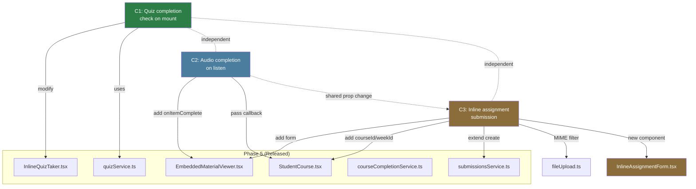
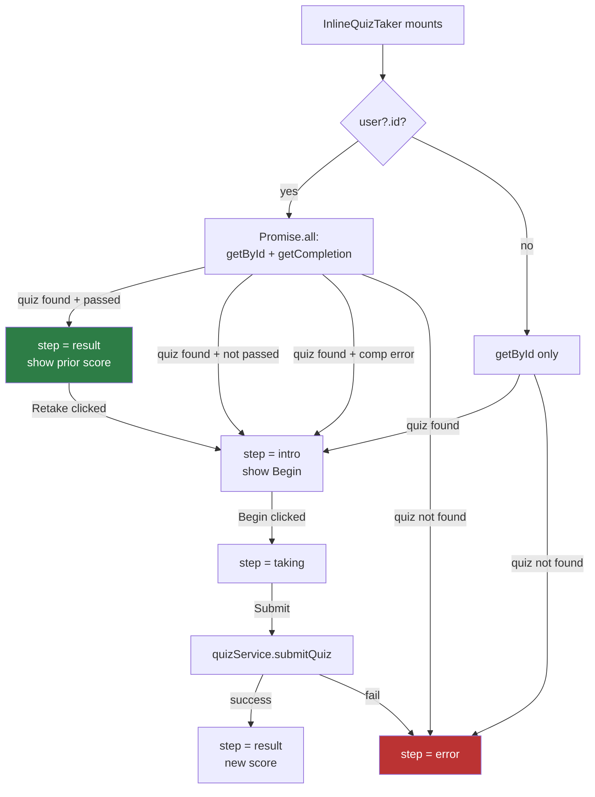
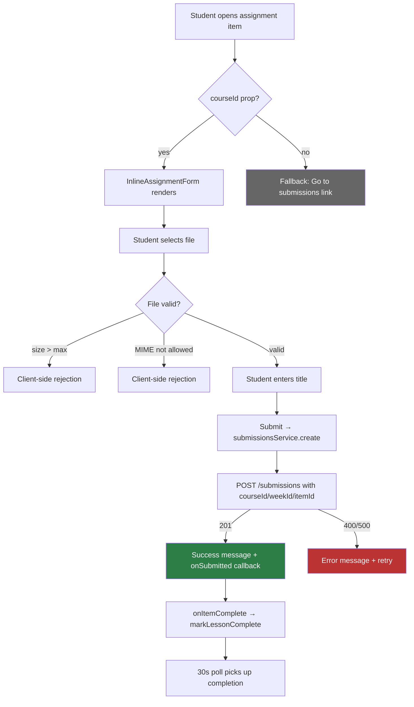
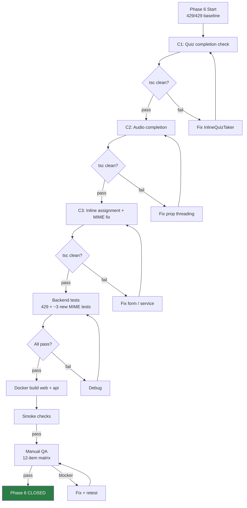

# Phase 6 Spec: Deeper Course Interactions

**Date:** 2026-08-04
**Status:** SPEC READY
**Baseline:** Phase 5 released (`phase5-complete-2026-08-04`), 429/429 backend tests, site live
**Scope:** 3 features — quiz completion check on mount, audio completion on listen, inline assignment submission

---

## 1. Problem Statement

Phase 5 delivered inline quiz-taking, 30s progress polling, and admin MIME-type selection. Three UX gaps remain in the course viewer:

1. **Quiz re-entry is confusing:** When a student reopens a quiz they already passed, `InlineQuizTaker` always shows the intro screen ("Begin") instead of their prior result. The student must retake the quiz to see their score. This is a UX regression — the student doesn't know they already passed.

2. **Audio completion is premature:** Audio items are marked "done" the moment the student opens them (`markItemEngaged` fires on viewer open), not when the student actually finishes listening. Progress tracking is inaccurate for audio content.

3. **Assignment submission breaks flow:** Assignment items show a "Go to submissions" link that navigates away from the course viewer to a separate page. Students lose their place in the course. The backend already accepts `courseId/weekId/itemId` on submission creation, but the frontend doesn't send them.

Phase 6 closes these gaps with a completion check on mount, audio `onEnded` wiring, and an inline submission form.

---

## 2. Goals

1. Show returning students their prior quiz result immediately when reopening a completed quiz
2. Mark audio items complete only when the student finishes listening (not on open)
3. Let students submit assignments directly in the course viewer without navigating away

## 3. Non-Goals

- No audio position tracking or scrub-position persistence (no new DB table)
- No WebSocket/SSE real-time push (30s polling is sufficient)
- No changes to the standalone Quizzes page (`StudentQuizzes.tsx`)
- No changes to the standalone Submissions page (`StudentSubmissions.tsx`)
- No new npm dependencies
- No backend API changes (C1, C2)
- No schema changes

---

## 4. User Stories

### US-1: Quiz Re-Entry

> As a student reopening a quiz item I already passed, I want to see my score and "Passed" badge immediately so I know I've already completed it and can choose to retake it if I want.

### US-2: Audio Completion

> As a student listening to an audio lesson, I want the item to be marked complete when I finish listening, not just when I open it, so my progress accurately reflects what I've actually consumed.

### US-3: Inline Assignment Submission

> As a student viewing an assignment in the course viewer, I want to upload my work directly without navigating to a separate page, so I don't lose my place in the course.

---

## 5. Feature Specifications

### Feature 1: Quiz Completion Check on Mount (C1)

**Type:** Frontend-only
**File:** `LMS-Frontend/src/components/InlineQuizTaker.tsx`
**Lines changed:** ~20

#### Current State

- `useEffect([quizId])` at line 19 calls `quizService.getById(quizId)` only
- On success, sets `step = 'intro'` regardless of prior completion
- No import of `useAuth`
- No call to `quizService.getCompletion()`

#### New Behavior

On mount, fetch both quiz data and completion status in parallel:

```typescript
import { useAuth } from '../context/useAuth';

// Inside component:
const { user } = useAuth();

useEffect(() => {
  let cancelled = false;
  setStep('loading');

  const quizP = quizService.getById(quizId);
  const compP = user?.id
    ? quizService.getCompletion(quizId, user.id).catch(() => null)
    : Promise.resolve(null);

  Promise.all([quizP, compP]).then(([q, comp]) => {
    if (cancelled) return;
    if (!q) {
      setErrorMsg('Quiz not found.');
      setStep('error');
      return;
    }
    setQuiz(q);
    if (comp?.passed) {
      setResult(comp);
      setStep('result');
    } else {
      setStep('intro');
    }
  }).catch((err) => {
    if (cancelled) return;
    setErrorMsg(err?.message || 'Failed to load quiz.');
    setStep('error');
  });

  return () => { cancelled = true; };
}, [quizId, user?.id]);
```

#### Behavioral Rules

| Condition | Behavior |
|-----------|----------|
| Student has passing completion | Skip to `result` step, show score + "Passed" badge + "Retake" button |
| Student has failing completion | Show `intro` step (can retake) |
| Student has no completion | Show `intro` step |
| `user` is null (not authenticated) | Skip completion check, show `intro` |
| Completion fetch fails | Silently catch, show `intro` (best-effort) |
| Quiz fetch fails | Show `error` step (existing behavior) |
| Student clicks "Retake" from prior result | `handleRetake()` clears result, returns to `intro` (existing behavior) |
| `useEffect` fires twice on auth hydration | Second call supersedes first via `cancelled` guard |

#### Edge Cases

| Case | Behavior |
|------|----------|
| Quiz deleted after student completed it | `getById` returns null → error step. Completion data is orphaned but harmless. |
| Student completed quiz on standalone page, opens inline | Completion check finds it, shows result. |
| `getCompletion` returns `passed: false` (failed attempt) | Shows intro, student can retake. |
| Multiple completions exist (retakes) | `getCompletion` returns the latest. If latest is passing, show result. |
| `user?.id` changes mid-render | `useEffect` dependency includes `user?.id`, so it re-fires and re-checks. |

#### Dependency on `useAuth`

The `useAuth()` hook is available app-wide (AuthProvider wraps the app in `main.tsx`). The `AuthContextType` provides:
- `user: User | null` — contains `.id` (string)
- `isLoading: boolean` — true during initial auth check

The `isLoading` state means the first render may have `user = null`. When auth resolves, `user` populates and the `useEffect` re-fires (since `user?.id` is in the dependency array). This is safe: the first call proceeds without completion check (falls back to `intro`), the second call with `user.id` checks completion and may update to `result`. The `cancelled` guard prevents stale setState.

---

### Feature 2: Audio Completion on Listen (C2)

**Type:** Frontend-only (prop threading)
**Files:**
- `LMS-Frontend/src/components/EmbeddedMaterialViewer.tsx` — props + audio wiring
- `LMS-Frontend/src/pages/StudentCourse.tsx` — pass callback

#### Current State

- `EmbeddedMaterialViewerProps` (line 74-82): `section`, `item`, `onClose`, `onPrev?`, `onNext?`, `prevDisabled?`, `nextDisabled?`
- No `onItemComplete` callback
- No `courseId` prop
- Two `<audio>` elements:
  - Line 239: `<audio controls preload="metadata" src={ext}>` (link-type audio)
  - Line 292: `<audio controls preload="metadata" src={item.url}>` (audio-type)
- Neither has `onEnded`
- `StudentCourse.tsx` renders `<EmbeddedMaterialViewer>` at lines 752-760, passes 7 props

#### New Behavior

1. Add `onItemComplete?: (itemId: string) => void` to `EmbeddedMaterialViewerProps`
2. Add `onEnded={() => onItemComplete?.(item.id)}` to both `<audio>` elements
3. In `StudentCourse.tsx`, pass `onItemComplete={markItemEngaged}` when rendering `<EmbeddedMaterialViewer>`

The `markItemEngaged` function (existing) calls `courseCompletionService.markLessonComplete(courseId, itemId)` which triggers the existing `POST /courses/:courseId/lessons/:itemId/complete` endpoint.

#### Implementation

**EmbeddedMaterialViewer.tsx — Props (line 74):**
```typescript
interface EmbeddedMaterialViewerProps {
  section: CourseSection;
  item: CourseItem;
  onClose: () => void;
  onPrev?: () => void;
  onNext?: () => void;
  prevDisabled?: boolean;
  nextDisabled?: boolean;
  onItemComplete?: (itemId: string) => void;  // NEW
}
```

**EmbeddedMaterialViewer.tsx — Destructure (line 88):**
Add `onItemComplete` to the destructured props.

**EmbeddedMaterialViewer.tsx — Audio element 1 (line 239):**
```tsx
<audio
  controls
  preload="metadata"
  className="w-full max-w-lg"
  src={ext}
  onEnded={() => onItemComplete?.(item.id)}
>
```

**EmbeddedMaterialViewer.tsx — Audio element 2 (line 292):**
```tsx
<audio controls preload="metadata" className="w-full max-w-lg" src={item.url}
  onEnded={() => onItemComplete?.(item.id)}
>
```

**StudentCourse.tsx — Render (line 752):**
```tsx
<EmbeddedMaterialViewer
  section={materialViewer.section}
  item={materialViewer.item}
  onClose={() => setMaterialViewer(null)}
  onPrev={goPrevMaterial}
  onNext={goNextMaterial}
  prevDisabled={pathIndex <= 0}
  nextDisabled={pathIndex < 0 || pathIndex >= flatPath.length - 1}
  onItemComplete={markItemEngaged}
/>
```

#### Behavioral Rules

| Condition | Behavior |
|-----------|----------|
| Audio plays to completion | `onEnded` fires → `markItemEngaged(item.id)` → `markLessonComplete()` |
| Student pauses and closes viewer | `onEnded` never fires → no completion mark |
| Student opens audio item | `markItemEngaged` fires on viewer open (existing behavior, unchanged) |
| `onItemComplete` is not passed | Optional chaining `?.()` — no crash, no action |
| `onEnded` fires multiple times (replay) | `markLessonComplete` uses `INSERT OR IGNORE` — idempotent |
| Non-audio item types | `onEnded` is only on `<audio>` elements — no effect on other types |

#### Edge Cases

| Case | Behavior |
|------|----------|
| Audio file fails to load | `<audio>` shows error controls. `onEnded` never fires. |
| Very short audio (< 1 second) | `onEnded` fires normally. |
| Audio autoplays (unlikely — `controls` without `autoplay`) | Would fire `onEnded` when done. Acceptable. |
| Student seeks to end | `onEnded` fires. This is acceptable — they've chosen to skip. |

---

### Feature 3: Inline Assignment Submission (C3)

**Type:** Frontend (form) + backend (MIME filter fix)
**Files:**
- `LMS-Frontend/src/components/EmbeddedMaterialViewer.tsx` — inline form
- `LMS-Frontend/src/pages/StudentCourse.tsx` — pass `courseId`, `weekId` props
- `LMS-Frontend/src/services/submissionsService.ts` — extend `create()` to accept context fields
- `LMS-Frontend/src/types/api.ts` — extend `CreateSubmissionData` type
- `LMS-Server/src/utils/fileUpload.ts` — extend MIME filter (MIME mismatch fix)

#### Current State

- Assignment branch in `EmbeddedMaterialViewer.tsx` (lines 320-367): shows item title, description, allowedMimeTypes display (Phase 4), then a "Go to submissions" link at lines 357-363
- `submissionsService.create(data)` accepts `{ title, description, file }` — no `courseId/weekId/itemId`
- `CreateSubmissionData` type has 3 fields: `title`, `description`, `file`
- Server multer filter (`fileUpload.ts:16-22`) allows: PDF, DOC, DOCX, ZIP, TXT
- Admin can set `allowedMimeTypes` to include: PDF, DOCX, XLSX, PPTX, JPEG, PNG, GIF, TXT, CSV
- **MIME mismatch:** 4 types the admin can set (XLSX, PPTX, JPEG, PNG, GIF, CSV) are blocked by the server filter

#### MIME Mismatch Resolution

**Decision:** Extend the server MIME filter to match the admin-configurable types.

Add to `SUBMISSION_MIME_TYPES` in `fileUpload.ts`:
```typescript
const SUBMISSION_MIME_TYPES = [
  'application/pdf',
  'application/msword',
  'application/vnd.openxmlformats-officedocument.wordprocessingml.document',
  'application/vnd.openxmlformats-officedocument.spreadsheetml.sheet',       // XLSX (NEW)
  'application/vnd.openxmlformats-officedocument.presentationml.presentation', // PPTX (NEW)
  'application/zip',
  'image/jpeg',     // JPEG (NEW)
  'image/png',      // PNG (NEW)
  'image/gif',      // GIF (NEW)
  'text/plain',
  'text/csv',       // CSV (NEW)
];
```

Also update the error message to reflect the expanded list.

**Rationale:** The admin explicitly configured these types as acceptable for the assignment. The server should honor that configuration. This is a 1-line array expansion + error message update — minimal backend change.

**Risk:** Very low. The multer filter is additive — existing allowed types are unchanged. New types are standard, well-known MIME types.

#### New Behavior

Replace the "Go to submissions" redirect link with an inline upload form. The form appears only when `courseId` is available (threaded from `StudentCourse.tsx`). If `courseId` is not available, the existing redirect link remains as a fallback.

#### Implementation Approach

**1. Extend `CreateSubmissionData` type (`types/api.ts`):**
```typescript
export interface CreateSubmissionData {
  title: string;
  description: string;
  file: File;
  courseId?: string;   // NEW
  weekId?: string;     // NEW
  itemId?: string;     // NEW
}
```

**2. Extend `submissionsService.create()` (`submissionsService.ts`):**
```typescript
async create(data: CreateSubmissionData): Promise<Submission> {
  const formData = new FormData();
  formData.append('title', data.title);
  formData.append('description', data.description);
  formData.append('file', data.file);
  if (data.courseId) formData.append('courseId', data.courseId);
  if (data.weekId) formData.append('weekId', data.weekId);
  if (data.itemId) formData.append('itemId', data.itemId);
  // ... rest unchanged
}
```

**3. Extend `EmbeddedMaterialViewerProps`:**
```typescript
interface EmbeddedMaterialViewerProps {
  // ... existing props ...
  onItemComplete?: (itemId: string) => void;  // from C2
  courseId?: string;   // NEW for C3
  weekId?: string;     // NEW for C3
}
```

**4. Pass props from `StudentCourse.tsx`:**
```tsx
<EmbeddedMaterialViewer
  // ... existing props ...
  onItemComplete={markItemEngaged}
  courseId={selectedCourseId || undefined}
  weekId={selectedWeekId || undefined}
/>
```

**5. New inline form in EmbeddedMaterialViewer assignment branch:**

Replace the "Go to submissions" link (lines 357-363) with:

```tsx
{courseId ? (
  <InlineAssignmentForm
    courseId={courseId}
    weekId={weekId}
    itemId={item.id}
    allowedMimeTypes={(item as { allowedMimeTypes?: string[] }).allowedMimeTypes}
    maxFileSize={(item as { maxFileSize?: number }).maxFileSize}
    onSubmitted={() => onItemComplete?.(item.id)}
  />
) : (
  <a href="/student/submissions" className="...">Go to submissions</a>
)}
```

**6. New `InlineAssignmentForm` component** (~80 lines):

A child component to keep form state isolated from `EmbeddedMaterialViewer`. States: `idle` → `uploading` → `success` | `error`.

```typescript
interface InlineAssignmentFormProps {
  courseId: string;
  weekId?: string;
  itemId: string;
  allowedMimeTypes?: string[];
  maxFileSize?: number;
  onSubmitted?: () => void;
}
```

The form includes:
- File input with `accept` attribute derived from `allowedMimeTypes`
- Title input (required)
- Submit button
- File size validation against `maxFileSize`
- Success message after upload
- Error message with retry option
- Fallback link to standalone submissions page

#### Behavioral Rules

| Condition | Behavior |
|-----------|----------|
| Assignment item with `courseId` prop | Inline form renders |
| Assignment item without `courseId` | Fallback "Go to submissions" link (existing behavior) |
| Student selects file + enters title + submits | `submissionsService.create()` called with `courseId/weekId/itemId` |
| Upload succeeds | Success message, `onItemComplete` callback fires |
| Upload fails (server error) | Inline error message + "Try again" button |
| File exceeds `maxFileSize` | Client-side validation, rejection before upload |
| File MIME type not in `allowedMimeTypes` | File input `accept` attribute filters, plus client-side check |
| File MIME type not in server filter | Server rejects with 400 (fixed by MIME filter extension) |
| `allowedMimeTypes` is empty/undefined | Accept all types that the server allows |
| Student already submitted for this item | New submission created (multiple submissions allowed per the existing system) |

#### Edge Cases

| Case | Behavior |
|------|----------|
| File input `accept` doesn't match server filter | Server is authoritative. If client sends a type the server rejects, user sees inline error. |
| Large file upload on slow connection | Spinner shown during `uploading` state. No timeout on client side (server has its own limits). |
| Student closes viewer during upload | Upload continues in background (fetch doesn't cancel). Not ideal but harmless — the submission is still created. |
| Student re-opens assignment after successful upload | Fresh form shown (no persistence of prior submission state). |
| `courseId` is null in StudentCourse | Not passed as prop → `undefined` → fallback to redirect. |

---

## 6. Files Touched

| File | Change Type | Feature | Backend? |
|------|------------|---------|----------|
| `InlineQuizTaker.tsx` | Modify (~20 lines) | C1 | No |
| `EmbeddedMaterialViewer.tsx` | Modify (~30 lines) | C2, C3 | No |
| `StudentCourse.tsx` | Modify (~5 lines) | C2, C3 | No |
| `InlineAssignmentForm.tsx` | Create (~80 lines) | C3 | No |
| `submissionsService.ts` | Modify (~5 lines) | C3 | No |
| `types/api.ts` | Modify (~3 lines) | C3 | No |
| `fileUpload.ts` | Modify (~8 lines) | C3 | Yes (MIME filter) |

**Total:** 1 new file, 6 modified files. ~150 lines of new code.

**Backend change note:** C3 includes 1 backend file change (`fileUpload.ts` — extending the MIME allowlist). This is the only backend change in Phase 6. It is additive (no existing types removed) and does not change the schema or API shape.

---

## 7. Acceptance Criteria

### Feature 1: Quiz Completion Check on Mount (C1)

| ID | Criterion | Verification |
|----|-----------|-------------|
| C1-AC1 | Previously passed quiz shows result on mount (score + "Passed" badge) | Manual QA |
| C1-AC2 | Previously failed quiz shows intro with "Begin" button | Manual QA |
| C1-AC3 | First-time (no completion) quiz shows intro | Manual QA |
| C1-AC4 | "Retake" button from prior result returns to intro | Manual QA |
| C1-AC5 | Loading spinner shown while checking | Code review |
| C1-AC6 | Error fetching completion silently falls back to intro | Code review |
| C1-AC7 | Quiz completed on standalone page shows result inline | Manual QA |

### Feature 2: Audio Completion on Listen (C2)

| ID | Criterion | Verification |
|----|-----------|-------------|
| C2-AC1 | Audio item marked complete when playback finishes | Manual QA |
| C2-AC2 | Opening audio item still renders player (no regression) | Regression |
| C2-AC3 | Both audio branches wired with `onEnded` (link-type + audio-type) | Code review |
| C2-AC4 | No new API endpoint or table | Code review |
| C2-AC5 | `onItemComplete` prop is optional (non-audio items unaffected) | Code review |
| C2-AC6 | Replaying audio fires `onEnded` again (idempotent via INSERT OR IGNORE) | Code review |

### Feature 3: Inline Assignment Submission (C3)

| ID | Criterion | Verification |
|----|-----------|-------------|
| C3-AC1 | Inline upload form renders for assignment items when `courseId` is available | Manual QA |
| C3-AC2 | File input `accept` attribute matches `allowedMimeTypes` from course JSON | Manual QA |
| C3-AC3 | Successful upload shows confirmation message | Manual QA |
| C3-AC4 | Upload error shows inline error message with retry option | Manual QA |
| C3-AC5 | Standalone Submissions page still works | Regression |
| C3-AC6 | Items without `courseId` prop fall back to "Go to submissions" link | Code review |
| C3-AC7 | File size exceeding `maxFileSize` is rejected client-side | Manual QA |
| C3-AC8 | Server MIME filter accepts all 9 admin-configurable types | Automated test |
| C3-AC9 | `courseId/weekId/itemId` are sent in the submission FormData | Code review |
| C3-AC10 | `onSubmitted` callback fires and marks item complete | Manual QA |

---

## 8. Test Strategy

### Automated Backend Tests

**C3 only — MIME filter extension:**

One new test to verify the extended MIME filter accepts the newly added types. This is a backend integration test:

```typescript
// Test: submission with XLSX file succeeds (new MIME type)
// Test: submission with PNG file succeeds (new MIME type)
// Test: submission with disallowed MIME type (e.g., application/x-executable) still fails
```

This adds ~3 tests to the existing submission test suite.

**C1, C2:** No new backend tests — frontend-only changes using existing APIs.

### Existing Regression Coverage

| Test File | Tests | Must Pass |
|-----------|-------|-----------|
| quiz-auto-complete.test.ts | 4 | Yes — quiz auto-complete still fires |
| assignment-auto-complete.test.ts | 4 | Yes — assignment auto-complete still fires |
| quiz-security.test.ts | 8 | Yes — answer keys not exposed |
| submission tests (existing) | varies | Yes — existing MIME types still work |
| All tests | 429+ | Yes — baseline gate |

### Manual QA Matrix

| Feature | Check | Steps | Expected |
|---------|-------|-------|----------|
| C1 | Passed quiz → result | Open quiz item after passing on standalone page | Score + "Passed" shown |
| C1 | Failed quiz → intro | Open quiz item after failing | Intro with "Begin" |
| C1 | New quiz → intro | Open quiz never taken | Intro with "Begin" |
| C1 | Retake from prior result | Click "Retake" on result screen | Returns to intro |
| C2 | Audio → complete on finish | Play audio to end in course viewer | Item marked complete |
| C2 | Audio → no complete on close | Open audio, close viewer before finishing | Item not additionally marked |
| C3 | Inline form renders | Open assignment item in course viewer | Upload form shown |
| C3 | Upload succeeds | Select file + title → submit | Success message |
| C3 | Upload fails | Submit with server error | Error message + retry |
| C3 | MIME filtering | Select disallowed type | Rejected |
| C3 | File size check | Select file > maxFileSize | Rejected client-side |
| C3 | Standalone page | Navigate to /student/submissions | Unchanged |

### Idempotency / Retry / Ordering

| Check | Expected |
|-------|----------|
| Replaying audio fires `onEnded` again | `INSERT OR IGNORE` — no duplicate completion |
| Quiz retake after prior pass | New completion record, latest used |
| Multiple submission uploads for same item | All submissions created (by design) |
| Polling picks up inline quiz completion | Within 30s (Feature 2 from Phase 5) |
| Polling picks up audio completion | Within 30s |
| Polling picks up assignment auto-complete (on admin approval) | Within 30s |

---

## 9. Mermaid Diagrams

### Feature Dependency Map



### Quiz Completion Check Flow (C1)



### Audio Completion Flow (C2)

```mermaid
flowchart TD
    OPEN[Student opens audio item] --> VIEWER[EmbeddedMaterialViewer renders]
    VIEWER --> AUDIO["<audio> element renders"]
    AUDIO --> PLAY[Student plays audio]
    PLAY --> LISTEN[Listening...]
    LISTEN --> ENDED{Audio ended?}
    ENDED -->|yes| CALLBACK[onItemComplete?.(item.id)]
    ENDED -->|no: paused/closed| NOOP[No completion mark]
    CALLBACK --> MARK[markItemEngaged → markLessonComplete]
    MARK --> API[POST /courses/:id/lessons/:itemId/complete]
    API --> DB[INSERT OR IGNORE lesson_completions]
    DB --> POLL[30s poll picks up completion]

    style CALLBACK fill:#2d7d46,color:#fff
    style NOOP fill:#666,color:#fff
```

### Inline Assignment Flow (C3)



### Verification / Test Gate Flow



---

## 10. Risks and Assumptions

### Validated Assumptions

| Assumption | Status | Evidence |
|------------|--------|----------|
| `useAuth()` available in InlineQuizTaker context | Confirmed | AuthProvider wraps app in `main.tsx` |
| `quizService.getCompletion(quizId, userId)` exists | Confirmed | `quizService.ts:60-67` |
| `quizService.getCompletion` returns `QuizCompletion \| null` | Confirmed | Same signature as submitQuiz return |
| Both `<audio>` elements have no `onEnded` handler | Confirmed | Lines 239, 292 |
| `markItemEngaged` is in scope in `StudentCourse.tsx` | Confirmed | Line 461 |
| `submissionsService.create()` exists | Confirmed | `submissionsService.ts:30-42` |
| Backend `POST /submissions` accepts `courseId/weekId/itemId` in body | Confirmed | `submissionsController.ts:202-297` |
| Server MIME filter is in `fileUpload.ts` | Confirmed | Lines 16-22, 85-95 |

### Remaining Risks

| Risk | Severity | Mitigation |
|------|----------|------------|
| C1: `useAuth` hydration causes double fetch | Low | `cancelled` guard, second fetch supersedes |
| C3: MIME mismatch between admin UI and server filter | **Resolved** | Extending server filter in this phase |
| C3: Form state complexity in EmbeddedMaterialViewer | Low | Isolated in child component `InlineAssignmentForm` |
| C3: Upload continues after viewer closed | Low | Harmless — submission is created server-side |
| C3: `CreateSubmissionData` type extension | Low | Additive optional fields, no breaking change |
| All: Line numbers may have shifted | Low | Re-read files at edit time |

---

## 11. Rollout and Compatibility

### Backward Compatibility

| Concern | Assessment |
|---------|-----------|
| Existing quiz flows | Unchanged — `handleRetake` and full quiz-taking flow preserved |
| Existing audio playback | Unchanged — `controls` attribute still present, `onEnded` is additive |
| Existing submission page | Unchanged — `StudentSubmissions.tsx` not modified |
| Existing MIME types on server | Unchanged — only new types added to allowlist |
| `onItemComplete` optional | `?.()` — no crash if not passed |
| `courseId/weekId` optional | Undefined → fallback to redirect link |

### Deploy Sequence

1. C3 has a backend change (`fileUpload.ts`), so both containers must be rebuilt:
   ```bash
   docker compose build web api
   docker compose up -d --no-deps web api
   ```
2. Verify: site loads, API healthy, backend tests pass

### Rollback

```bash
git revert HEAD~N..HEAD
docker compose build web api && docker compose up -d --no-deps web api
```

MIME filter rollback: reverts to the original 5-type list. No data impact — submissions already uploaded with new MIME types remain in storage.

---

## 12. To-Do Lists

### Spec Checklist

- [x] Problem statement
- [x] Goals and non-goals
- [x] User stories (3)
- [x] Feature specifications (3)
- [x] Files touched
- [x] Acceptance criteria (23 total: 7 + 6 + 10)
- [x] Test strategy
- [x] Mermaid diagrams (5)
- [x] Risks and assumptions
- [x] Rollout and compatibility

### Feature Checklist

- [ ] C1: Quiz completion check on mount (~20 lines, InlineQuizTaker.tsx)
- [ ] C2: Audio `onEnded` wiring + `onItemComplete` prop (~15 lines, 2 files)
- [ ] C3: InlineAssignmentForm component (~80 lines, new file)
- [ ] C3: Extend `submissionsService.create()` (~5 lines)
- [ ] C3: Extend `CreateSubmissionData` type (~3 lines)
- [ ] C3: Wire form into EmbeddedMaterialViewer assignment branch (~10 lines)
- [ ] C3: Pass `courseId/weekId` from StudentCourse.tsx (~3 lines)
- [ ] C3: Extend server MIME filter (~8 lines, fileUpload.ts)

### Backend Test Checklist

- [ ] New MIME types accepted (XLSX, PNG, CSV at minimum)
- [ ] Disallowed MIME types still rejected
- [ ] Existing submission tests still pass
- [ ] 429/429 baseline + new tests

### QA Checklist

- [ ] C1: Passed quiz → result on mount
- [ ] C1: Failed quiz → intro on mount
- [ ] C1: New quiz → intro
- [ ] C1: Retake from prior result
- [ ] C2: Audio complete on finish
- [ ] C2: Audio player renders normally
- [ ] C3: Inline form renders
- [ ] C3: Upload succeeds
- [ ] C3: Upload error shows message
- [ ] C3: File size validation works
- [ ] C3: Standalone submissions page unchanged
- [ ] Regression: all backend tests pass

### Risk Checklist

- [x] No schema changes
- [x] 1 backend change (MIME filter — additive only)
- [x] No new dependencies
- [x] `onItemComplete` is optional
- [x] `courseId/weekId` are optional
- [x] InlineAssignmentForm is self-contained
- [x] Standalone pages not touched
- [x] MIME mismatch resolved by extending server filter

---

## 13. Review Checklist

Before implementation planning, verify:

| Check | Status |
|-------|--------|
| Scope matches approved Phase 6 candidates (3 features) | Yes |
| Real-time push (C4) explicitly excluded | Yes |
| Audio position tracking excluded (minimal variant only) | Yes |
| All insertion points verified with line numbers | Yes |
| `useAuth()` hook signature confirmed | Yes |
| `quizService.getCompletion()` signature confirmed | Yes |
| `submissionsService.create()` signature confirmed | Yes |
| Server MIME filter location confirmed | Yes |
| MIME mismatch resolution defined | Yes |
| Prop threading strategy defined (C2 first, C3 extends) | Yes |
| Backend change limited to MIME filter only | Yes |
| All 23 acceptance criteria have verification method | Yes |
| Rollback plan defined | Yes |
| Deploy note includes both containers (web + api) | Yes |

---

## 14. /loop Workflow

```
/loop assess  — Read this spec, confirm scope and assumptions
/loop spec    — Review acceptance criteria and test strategy
/loop review  — Check for gaps, contradictions, missing edge cases
/loop plan    — Write implementation plan from this spec
```

---

## 15. Final Recommendation

**Status: PHASE 6 SPEC READY**

**Key findings:**
- C1 (quiz completion check) is ~20 lines in 1 file, uses existing `quizService.getCompletion()`, no backend change
- C2 (audio completion) is ~15 lines across 2 files, adds `onEnded` to existing `<audio>` elements
- C3 (inline assignment) is the most complex: new component (`InlineAssignmentForm.tsx`, ~80 lines), extends `submissionsService.create()`, and fixes the MIME mismatch in `fileUpload.ts`
- C3's MIME mismatch is the only backend change — extending the server allowlist to match the 9 types the admin can configure (Phase 5 created the admin UI, Phase 6 ensures the server honors it)
- Total: ~150 lines of new code, 1 new file, 6 modified files
- Deploy requires both `web` and `api` containers due to `fileUpload.ts` change

**Exact next action:** Write the Phase 6 implementation plan using the writing-plans workflow. All feature behaviors, insertion points, and acceptance criteria are defined.
