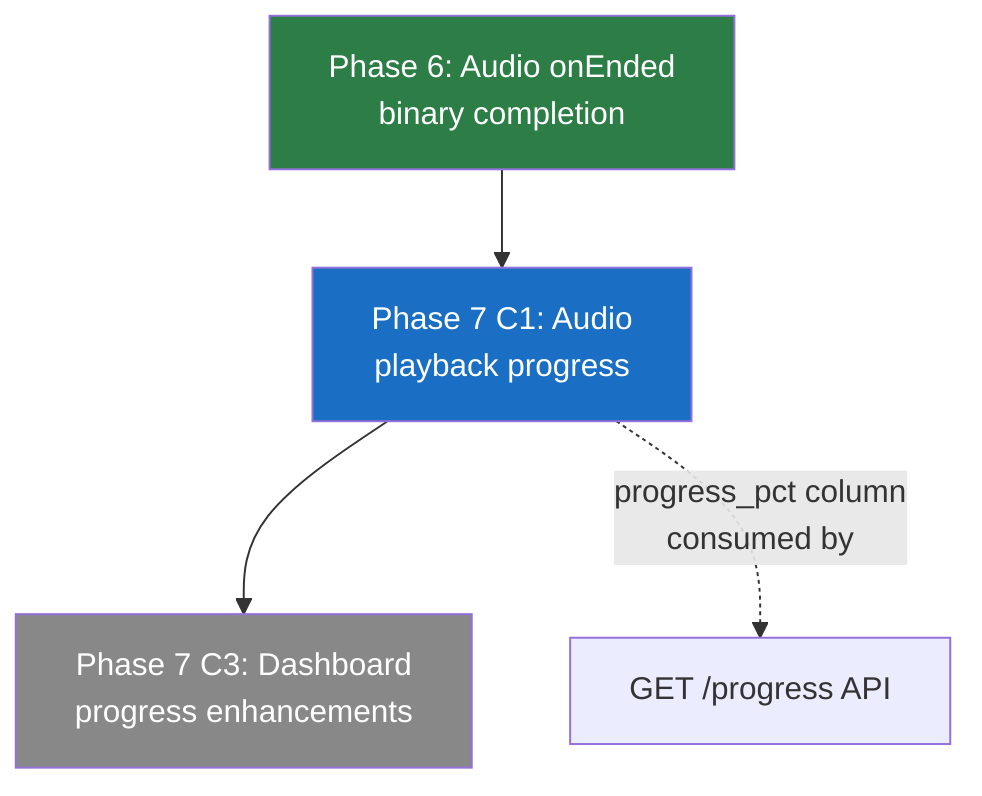
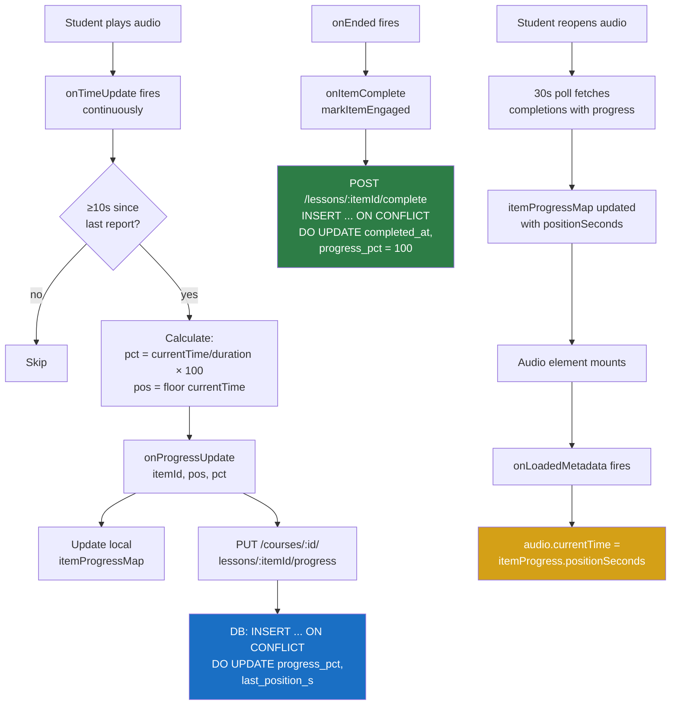
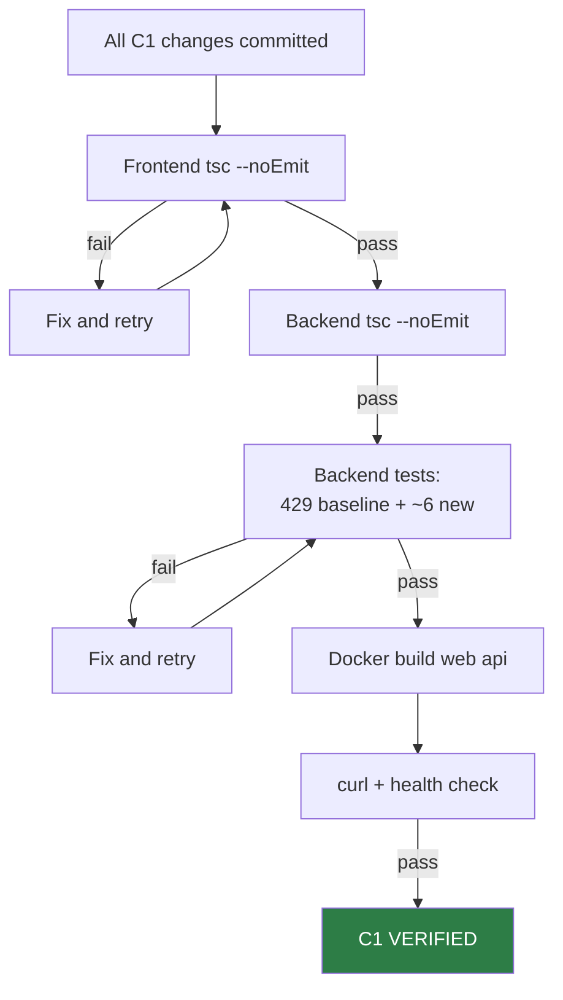

# Phase 7 C1 Spec: Audio Playback Progress Tracking

**Date:** 2026-08-04
**Status:** SPEC READY
**Phase:** 7 — Platform Maturity
**Planning doc:** `docs/superpowers/plans/2026-08-04-phase7-planning.md`
**Baseline:** Phase 6 released (`phase6-complete-2026-08-04`), 429/429 backend tests

---

## Problem Statement

Students who listen to audio content in the course viewer currently get binary credit: the item is either "not started" or "complete" (fired on `onEnded`). If a student closes the browser partway through a 45-minute lecture recording, they lose their position and see no partial progress. The course progress bar shows 0% for that item until they listen to the entire recording again.

This creates two problems:
1. **Lost position** — students must relisten from the beginning
2. **Invisible effort** — the progress bar doesn't reflect partial engagement

---

## Goals

1. Save audio playback position to the server periodically (every 10 seconds while playing)
2. Resume playback from last saved position when the student reopens the audio item
3. Show partial progress percentage in lesson completion data (consumed by future dashboard enhancements)
4. Preserve existing `onEnded` → binary completion behavior (additive only)

---

## Non-Goals

- Video playback tracking (different element, different UX — future phase)
- Partial progress toward course completion percentage (progress bars still use binary done/not-done for NFT eligibility)
- Real-time push of progress updates (30s polling is retained)
- Offline/service-worker caching of playback position
- Audio player UI enhancements (seek bar, playback speed — browser native controls suffice)
- Modifying the standalone Quizzes or Submissions pages

---

## User Stories

### US-1: Resume Playback
> As a student, when I reopen an audio item I previously started, I want playback to resume from where I left off so I don't have to relisten from the beginning.

### US-2: Partial Progress Visibility
> As a student, I want my partial audio listening progress saved so that future dashboard views can show how far I've gotten through each audio item.

### US-3: Completion Still Works
> As a student, when I listen to an audio item all the way through, it should still be marked complete exactly as it does today.

---

## Functional Behavior

### Backend

#### Schema Migration

Add two nullable columns to `lesson_completions`:

```sql
ALTER TABLE lesson_completions ADD COLUMN progress_pct INTEGER;
ALTER TABLE lesson_completions ADD COLUMN last_position_s INTEGER;
```

- `progress_pct`: 0–100 integer, null for items that haven't reported progress
- `last_position_s`: playback position in seconds (floored to integer), null for non-audio items
- Both columns are nullable — existing rows (non-audio completions) remain unaffected
- No index needed (these columns are never queried in WHERE clauses; they're returned alongside existing data)

**Migration function pattern** (follows `ensureClerkUserIdColumn` at database.ts:153):

```typescript
function ensureLessonCompletionsProgressColumns(): void {
  const cols = db.prepare('PRAGMA table_info(lesson_completions)').all() as { name: string }[];
  if (!cols.some((c) => c.name === 'progress_pct')) {
    db.exec('ALTER TABLE lesson_completions ADD COLUMN progress_pct INTEGER');
  }
  if (!cols.some((c) => c.name === 'last_position_s')) {
    db.exec('ALTER TABLE lesson_completions ADD COLUMN last_position_s INTEGER');
  }
}
ensureLessonCompletionsProgressColumns();
```

Place immediately after `ensureLessonCompletionsTable()` call (database.ts:406).

#### New Route: PUT /courses/:courseId/lessons/:itemId/progress

**File:** `LMS-Server/src/routes/lessonCompletions.ts`

**Request body:**
```typescript
{
  positionSeconds: number;   // integer, ≥ 0
  progressPercent: number;   // integer, 0–100
}
```

**Behavior:**
1. Authenticate user (existing `authenticate` middleware)
2. Validate `positionSeconds` (integer ≥ 0) and `progressPercent` (integer 0–100)
3. Verify course exists
4. Students must be enrolled (same enrollment check as POST complete)
5. Verify item exists in course (same `findSectionForItem` check)
6. **Upsert logic:**
   - If row exists for (user_id, course_id, item_id): `UPDATE progress_pct = ?, last_position_s = ?`
   - If row does not exist: `INSERT` with progress columns set, `completed_at` NOT set
   - **Critical:** If the row already has `completed_at` set (item was fully completed), the UPDATE still writes the new progress values but does NOT clear `completed_at`. A completed item stays completed.

**SQL (upsert via INSERT ... ON CONFLICT):**
```sql
INSERT INTO lesson_completions (id, user_id, course_id, item_id, section_id, marked_by, progress_pct, last_position_s)
VALUES (?, ?, ?, ?, ?, ?, ?, ?)
ON CONFLICT (user_id, course_id, item_id)
DO UPDATE SET progress_pct = excluded.progress_pct, last_position_s = excluded.last_position_s;
```

This uses the existing `UNIQUE (user_id, course_id, item_id)` constraint. The `ON CONFLICT ... DO UPDATE` syntax is supported by SQLite ≥ 3.24.0 (Ubuntu 24.04 ships SQLite 3.45+).

**Note on completed_at:** The INSERT does NOT set `completed_at` (it will be NULL for progress-only rows). When `onEnded` fires, the existing POST complete route uses `INSERT OR IGNORE` — but that route currently does NOT set progress columns. After implementation, when a student plays to the end:
1. Progress route has already created the row (with progress_pct, last_position_s, no completed_at)
2. The existing `INSERT OR IGNORE` will NOT insert (row already exists)
3. We must extend the existing POST complete route to also set `completed_at` on the existing row

**Modified POST complete behavior** (lessonCompletions.ts:67-71):

Change from:
```sql
INSERT OR IGNORE INTO lesson_completions (id, user_id, course_id, item_id, section_id, marked_by)
VALUES (?, ?, ?, ?, ?, ?)
```

To:
```sql
INSERT INTO lesson_completions (id, user_id, course_id, item_id, section_id, marked_by, progress_pct)
VALUES (?, ?, ?, ?, ?, ?, 100)
ON CONFLICT (user_id, course_id, item_id)
DO UPDATE SET completed_at = datetime('now'), marked_by = excluded.marked_by, progress_pct = 100
WHERE completed_at IS NULL;
```

The `WHERE completed_at IS NULL` in the DO UPDATE prevents overwriting an already-completed timestamp.

**Response (200):**
```json
{
  "success": true,
  "data": { "userId": "...", "courseId": "...", "itemId": "...", "progressPercent": 50, "positionSeconds": 135 }
}
```

**Error responses:**
- 400: Invalid body (missing/invalid positionSeconds or progressPercent)
- 401: Not authenticated
- 403: Not enrolled in course (students only)
- 404: Course not found or item not in course

#### GET /courses/:courseId/lessons/completions — Extended Response

The existing GET completions route (lessonCompletions.ts:131-215) must include the new columns in its SELECT and response type.

Change the SELECT from:
```sql
SELECT user_id, course_id, item_id, section_id, completed_at, marked_by
FROM lesson_completions ...
```

To:
```sql
SELECT user_id, course_id, item_id, section_id, completed_at, marked_by, progress_pct, last_position_s
FROM lesson_completions ...
```

Update `CompletionRow` type:
```typescript
type CompletionRow = {
  user_id: string;
  course_id: string;
  item_id: string;
  section_id: string;
  completed_at: string;
  marked_by: string | null;
  progress_pct: number | null;      // NEW
  last_position_s: number | null;   // NEW
};
```

The frontend currently only extracts `item_id` from completions (courseCompletionService.ts `getLessonCompletions` maps to `c.item_id`). The new fields are additive — existing callers ignore them.

---

### Frontend

#### New Prop: onProgressUpdate

Add to `EmbeddedMaterialViewerProps` (EmbeddedMaterialViewer.tsx:75):

```typescript
onProgressUpdate?: (itemId: string, positionSeconds: number, progressPercent: number) => void;
```

#### Audio Element: onTimeUpdate Handler

For both audio elements (link-type at line ~247, native-type at line ~301), add an `onTimeUpdate` handler that reports progress. The handler must be throttled to avoid flooding the server.

**Throttle strategy:** Use a `useRef` to track last report time. Only call `onProgressUpdate` if ≥ 10 seconds have elapsed since the last call.

```typescript
const lastProgressReport = useRef(0);

const handleTimeUpdate = (e: React.SyntheticEvent<HTMLAudioElement>) => {
  const audio = e.currentTarget;
  if (!audio.duration || !isFinite(audio.duration)) return;
  const now = Date.now();
  if (now - lastProgressReport.current < 10_000) return;
  lastProgressReport.current = now;
  const pct = Math.floor((audio.currentTime / audio.duration) * 100);
  onProgressUpdate?.(item.id, Math.floor(audio.currentTime), pct);
};
```

Apply to both `<audio>` elements:
```tsx
<audio
  controls
  preload="metadata"
  className="w-full max-w-lg"
  src={...}
  onEnded={() => onItemComplete?.(item.id)}
  onTimeUpdate={handleTimeUpdate}
>
```

#### Audio Element: Resume from Last Position

When an audio item mounts, if the parent passes a `lastPosition` for this item, set `audio.currentTime` on the `onLoadedMetadata` event (not on mount — the audio element must have loaded duration first).

**New prop on EmbeddedMaterialViewerProps:**
```typescript
itemProgress?: { positionSeconds: number; progressPercent: number } | null;
```

**Handler:**
```tsx
<audio
  ...
  onLoadedMetadata={(e) => {
    if (itemProgress?.positionSeconds) {
      e.currentTarget.currentTime = itemProgress.positionSeconds;
    }
  }}
>
```

#### StudentCourse.tsx: Wire Progress Props

**New state (alongside doneItemIds):**
```typescript
const [itemProgressMap, setItemProgressMap] = useState<Record<string, { positionSeconds: number; progressPercent: number }>>({});
```

**Populate from polling:** The existing `sync()` function fetches completions. Extend it to extract `progress_pct` and `last_position_s` from the response:

In `courseCompletionService.getLessonCompletions` (currently returns `string[]`), change return type to include progress data:

```typescript
async getLessonCompletions(courseId: string): Promise<{ itemId: string; progressPct: number | null; lastPositionS: number | null }[]> {
  const res = await api.get<{
    success: boolean;
    data: { completions: { item_id: string; progress_pct: number | null; last_position_s: number | null }[] };
  }>(`/courses/${courseId}/lessons/completions`);
  return (res.data.data?.completions ?? []).map((c) => ({
    itemId: c.item_id,
    progressPct: c.progress_pct,
    lastPositionS: c.last_position_s,
  }));
}
```

**Breaking change note:** The existing return type is `Promise<string[]>`. Changing to objects breaks the `sync()` consumer in StudentCourse.tsx. The sync function must be updated to handle the new shape:

```typescript
const sync = () => {
  courseCompletionService.getLessonCompletions(selectedCourseId).then((items) => {
    if (cancelled || items.length === 0) return;

    // Update done items (binary completion)
    setDoneItemIds((prev) => {
      let changed = false;
      const merged = new Set(prev);
      for (const item of items) {
        if (!merged.has(item.itemId)) { merged.add(item.itemId); changed = true; }
      }
      if (changed) writeDoneIds(user.id, selectedCourseId, merged);
      return changed ? merged : prev;
    });

    // Update progress map
    setItemProgressMap((prev) => {
      const next: Record<string, { positionSeconds: number; progressPercent: number }> = { ...prev };
      let changed = false;
      for (const item of items) {
        if (item.progressPct != null && item.lastPositionS != null) {
          const existing = prev[item.itemId];
          if (!existing || existing.positionSeconds !== item.lastPositionS || existing.progressPercent !== item.progressPct) {
            next[item.itemId] = { positionSeconds: item.lastPositionS, progressPercent: item.progressPct };
            changed = true;
          }
        }
      }
      return changed ? next : prev;
    });
  }).catch(() => { /* best-effort polling */ });
};
```

**New callback for progress updates:**
```typescript
const handleProgressUpdate = useCallback(
  (itemId: string, positionSeconds: number, progressPercent: number) => {
    if (!selectedCourseId) return;
    courseCompletionService.updateProgress(selectedCourseId, itemId, positionSeconds, progressPercent)
      .catch(() => {/* best-effort */});
    setItemProgressMap((prev) => ({
      ...prev,
      [itemId]: { positionSeconds, progressPercent },
    }));
  },
  [selectedCourseId]
);
```

**New service method** (courseCompletionService.ts):
```typescript
async updateProgress(courseId: string, itemId: string, positionSeconds: number, progressPercent: number): Promise<void> {
  await api.put(`/courses/${courseId}/lessons/${itemId}/progress`, {
    positionSeconds,
    progressPercent,
  });
},
```

**Pass to EmbeddedMaterialViewer:**
```tsx
<EmbeddedMaterialViewer
  section={materialViewer.section}
  item={materialViewer.item}
  onClose={() => setMaterialViewer(null)}
  onPrev={goPrevMaterial}
  onNext={goNextMaterial}
  prevDisabled={pathIndex <= 0}
  nextDisabled={pathIndex < 0 || pathIndex >= flatPath.length - 1}
  onItemComplete={markItemEngaged}
  courseId={selectedCourseId || undefined}
  weekId={selectedWeekId || undefined}
  onProgressUpdate={handleProgressUpdate}
  itemProgress={materialViewer ? itemProgressMap[materialViewer.item.id] ?? null : null}
/>
```

---

## Edge Cases

| Edge Case | Expected Behavior |
|-----------|-------------------|
| Audio has no duration (streaming/live) | `handleTimeUpdate` returns early (`!isFinite(audio.duration)`) — no progress reported |
| Student closes browser mid-listen | Last 10s-throttled progress is already saved; student resumes from that point |
| Student seeks backward then forward | Progress percent recalculates from current position — server overwrites with latest |
| Student replays a completed audio item | Progress updates still fire (overwrite progress_pct/last_position_s), but completed_at stays set |
| Multiple browser tabs | Each tab sends progress independently; last-write-wins (acceptable — same user) |
| Audio item removed from course after progress saved | Progress row orphaned (item_id no longer in sections JSON). No harm — row is ignored by progress calculations |
| Non-audio items | Never call onProgressUpdate — only audio `<audio>` elements have onTimeUpdate |
| Progress endpoint called for non-existent item | 404 returned (existing `findSectionForItem` check) |
| positionSeconds > actual duration | Accepted — server doesn't validate against audio duration (it doesn't know the duration) |
| progressPercent > 100 | Rejected — validation enforces 0–100 range |
| 30s poll fetches stale progress | Acceptable — local state has fresher data; next poll will reconcile |

---

## Error / Fallback Behavior

| Scenario | Behavior |
|----------|----------|
| PUT /progress fails (network error) | Silently caught (`.catch(() => {})`) — next 10s tick retries |
| PUT /progress returns 403 (not enrolled) | Silently caught — student sees audio but progress isn't saved |
| PUT /progress returns 404 (item not found) | Silently caught — item may have been removed from course |
| GET completions returns without new columns | Frontend treats null progressPct/lastPositionS as "no progress" — no crash |
| Migration fails on startup | `PRAGMA table_info` check is idempotent — retry on next restart |
| Audio element doesn't fire onTimeUpdate | No progress saved — completion on `onEnded` still works |
| Audio element doesn't fire onLoadedMetadata | Resume doesn't happen — audio plays from beginning (degraded but functional) |

---

## Touched Files / Routes / Data Paths

### Backend (3 files)

| File | Change | Lines |
|------|--------|-------|
| `LMS-Server/src/config/database.ts` | Add `ensureLessonCompletionsProgressColumns()` after line 406 | ~10 |
| `LMS-Server/src/routes/lessonCompletions.ts` | Add PUT progress route; modify POST complete SQL; extend GET completions SELECT | ~40 |
| `LMS-Server/src/__tests__/phase-d-lessons.test.ts` | Add progress endpoint tests | ~60 |

### Frontend (3 files)

| File | Change | Lines |
|------|--------|-------|
| `LMS-Frontend/src/components/EmbeddedMaterialViewer.tsx` | Add `onProgressUpdate` + `itemProgress` props; add `onTimeUpdate` + `onLoadedMetadata` handlers on both audio elements; add `lastProgressReport` ref | ~25 |
| `LMS-Frontend/src/pages/StudentCourse.tsx` | Add `itemProgressMap` state; extend `sync()` to extract progress data; add `handleProgressUpdate` callback; pass new props to viewer | ~30 |
| `LMS-Frontend/src/services/courseCompletionService.ts` | Change `getLessonCompletions` return type to include progress; add `updateProgress` method | ~15 |

### Total: 6 files modified, ~180 new lines, 0 new files

---

## Rollout / Compatibility Notes

### Database Migration
- `ALTER TABLE ADD COLUMN` with nullable columns is non-breaking
- Existing rows get NULL for new columns — treated as "no progress"
- No table rename or FK change — `legacy_alter_table` pragma NOT needed
- Migration is idempotent via `PRAGMA table_info` check

### API Backward Compatibility
- GET completions adds new fields to response — existing callers that only read `item_id` are unaffected
- PUT progress is a new endpoint — no existing callers
- POST complete changes from `INSERT OR IGNORE` to `INSERT ... ON CONFLICT DO UPDATE` — functionally equivalent for first-time completions (creates row), and now also handles the case where a progress-only row already exists

### Frontend Compatibility
- `getLessonCompletions` return type changes from `string[]` to `{ itemId, progressPct, lastPositionS }[]` — the `sync()` function in StudentCourse.tsx is the only consumer and must be updated in the same commit
- `onProgressUpdate` and `itemProgress` props are optional — viewer works without them

### Deploy
- Both `web` and `api` containers must be rebuilt (`docker compose build web api`)
- Schema migration runs automatically on `api` container startup
- No manual SQL needed

### Rollback
- Revert commits, rebuild both containers
- New columns remain in DB but are unused (no harm)
- POST complete reverts to `INSERT OR IGNORE` (safe — existing progress rows have no completed_at until onEnded fires)

---

## Mermaid Diagrams

### Feature Dependency Map



### Data Flow: Audio Progress



### Verification / Test Gate Flow



---

## Acceptance Criteria

### C1: Audio Playback Progress Tracking

| ID | Criterion | Type | Verification |
|----|-----------|------|-------------|
| C1-AC1 | `lesson_completions` has `progress_pct INTEGER` column (nullable) | Schema | `PRAGMA table_info(lesson_completions)` includes `progress_pct` |
| C1-AC2 | `lesson_completions` has `last_position_s INTEGER` column (nullable) | Schema | `PRAGMA table_info(lesson_completions)` includes `last_position_s` |
| C1-AC3 | `PUT /courses/:courseId/lessons/:itemId/progress` accepts `{ positionSeconds, progressPercent }` and returns 200 | API | Automated test |
| C1-AC4 | Progress upserts: new row if none exists, updates existing row | API | Automated test (two calls, verify single row) |
| C1-AC5 | Progress update does NOT clear `completed_at` on already-completed items | API | Automated test (complete item, update progress, verify completed_at preserved) |
| C1-AC6 | POST complete now sets `completed_at` on progress-only rows (no completed_at yet) | API | Automated test (update progress, then complete, verify completed_at set + progress_pct = 100) |
| C1-AC7 | POST complete is still idempotent for already-completed items | API | Automated test (complete twice, verify single completed_at) |
| C1-AC8 | GET completions response includes `progress_pct` and `last_position_s` | API | Automated test |
| C1-AC9 | Frontend emits progress every 10s while audio plays | Frontend | Manual QA (network tab) |
| C1-AC10 | Audio resumes from `last_position_s` on reopen | Frontend | Manual QA |
| C1-AC11 | `onEnded` still marks item complete (binary completion preserved) | Regression | Manual QA + automated test |
| C1-AC12 | 429 baseline tests still pass | Regression | `npx vitest run` |
| C1-AC13 | Validation rejects `progressPercent` outside 0–100 range | API | Automated test |
| C1-AC14 | 403 for non-enrolled student | API | Existing pattern — verify in new endpoint |
| C1-AC15 | Migration is idempotent (can run twice without error) | Schema | Automated test or manual verification |

---

## Test Strategy

### Automated Tests (add to `phase-d-lessons.test.ts`)

#### New Test Group: D3 — PUT /courses/:courseId/lessons/:itemId/progress

| Test ID | Description | Request | Expected |
|---------|-------------|---------|----------|
| D3-AC1 | Enrolled student saves progress | PUT with `{ positionSeconds: 60, progressPercent: 25 }` | 200 + row created with progress_pct=25, last_position_s=60, completed_at=NULL |
| D3-AC2 | Second progress update overwrites | PUT with `{ positionSeconds: 120, progressPercent: 50 }` | 200 + same row updated, progress_pct=50, last_position_s=120 |
| D3-AC3 | Progress on completed item preserves completed_at | Complete item first, then PUT progress | 200 + completed_at unchanged, progress_pct updated |
| D3-AC4 | Reject invalid progressPercent (> 100) | PUT with `{ positionSeconds: 60, progressPercent: 150 }` | 400 |
| D3-AC5 | Reject negative positionSeconds | PUT with `{ positionSeconds: -1, progressPercent: 25 }` | 400 |
| D3-AC6 | 403 for non-enrolled student | PUT from non-enrolled user | 403 |
| D3-AC7 | 404 for nonexistent course | PUT with invalid courseId | 404 |
| D3-AC8 | 404 for item not in course | PUT with invalid itemId | 404 |

#### Modified Test: D1 — POST complete with progress row

| Test ID | Description | Request | Expected |
|---------|-------------|---------|----------|
| D1-AC8 | Complete sets completed_at on progress-only row | PUT progress first, then POST complete | completed_at set, progress_pct=100 |
| D1-AC9 | Complete is idempotent (already completed) | POST complete twice | completed_at unchanged from first call |

#### Modified Test: D1b — GET completions includes progress

| Test ID | Description | Expected |
|---------|-------------|----------|
| D1b-AC7 | Response includes progress_pct and last_position_s | Fields present in response (null for non-audio items) |

### Regression Coverage

- All 429 existing tests must pass unchanged
- Existing D1 tests (self-mark complete) must pass with new SQL
- Existing D1b tests (GET completions) must pass with extended SELECT
- Existing D2 tests (progress calculation) must pass — `getCourseProgress` uses `completedSet` which checks `item_id` presence, not `completed_at`

**Important regression note:** The backend `getCourseProgress` function (courseCompletionService.ts:54-159) counts completed lessons by querying `SELECT item_id FROM lesson_completions WHERE user_id = ? AND course_id = ?`. This will now return progress-only rows (which have no `completed_at`). This could inflate the `completedLessonItems` count.

**Fix required:** Add `AND completed_at IS NOT NULL` to the completed lessons query in `getCourseProgress`:
```sql
SELECT item_id FROM lesson_completions WHERE user_id = ? AND course_id = ? AND completed_at IS NOT NULL
```

This is a critical correctness fix — without it, a student who listened to 30% of an audio file would show the item as "completed" in the progress calculation.

### Manual QA Checklist

| ID | Check | Steps | Expected |
|----|-------|-------|----------|
| QA-C1-01 | Progress saves during playback | Play audio for 30s, check network tab | At least 2 PUT requests sent |
| QA-C1-02 | Resume on reopen | Play 30s, close viewer, reopen same item | Audio starts near 30s mark |
| QA-C1-03 | Completion still works | Play audio to end | Item marked complete (green check) |
| QA-C1-04 | No progress for non-audio items | Open a PDF or video item | No PUT /progress requests |
| QA-C1-05 | Standalone pages unaffected | Navigate to /student/quizzes and /student/submissions | Pages work normally |

### Idempotency / Retry / Ordering

| Scenario | Expected |
|----------|----------|
| Same progress PUT sent twice | Second call overwrites with same values (no error, no duplicate) |
| Progress PUT then complete POST | Complete sets completed_at on existing row, sets progress_pct=100 |
| Complete POST then progress PUT | Progress overwrites progress_pct/last_position_s but completed_at stays set |
| Progress PUT for same item from different tabs | Last-write-wins (acceptable) |
| Network intermittent — some PUTs fail | Next successful PUT catches up; no data corruption |

---

## To-Do Lists

### Spec Checklist
- [x] Problem statement defined
- [x] Goals and non-goals defined
- [x] User stories written
- [x] Functional behavior specified (backend + frontend)
- [x] Edge cases enumerated
- [x] Error/fallback behavior defined
- [x] Touched files listed with line estimates
- [x] Rollout/compatibility notes written
- [x] Mermaid diagrams included
- [x] Acceptance criteria defined (15 items)
- [x] Test strategy defined (automated + regression + manual)
- [x] Critical regression risk identified (getCourseProgress query)

### Feature Checklist
- [ ] Schema migration: 2 columns added
- [ ] PUT /progress route implemented
- [ ] POST /complete SQL updated (INSERT OR IGNORE → ON CONFLICT)
- [ ] GET /completions SELECT extended
- [ ] getCourseProgress query fixed (AND completed_at IS NOT NULL)
- [ ] Frontend: onProgressUpdate prop + onTimeUpdate handler
- [ ] Frontend: itemProgress prop + onLoadedMetadata resume
- [ ] Frontend: getLessonCompletions return type extended
- [ ] Frontend: sync() updated to extract progress data
- [ ] Frontend: handleProgressUpdate callback
- [ ] Frontend: updateProgress service method

### Backend Test Checklist
- [ ] D3-AC1: Student saves progress
- [ ] D3-AC2: Progress update overwrites
- [ ] D3-AC3: Progress on completed item preserves completed_at
- [ ] D3-AC4: Reject invalid progressPercent
- [ ] D3-AC5: Reject negative positionSeconds
- [ ] D3-AC6: 403 for non-enrolled
- [ ] D3-AC7: 404 for nonexistent course
- [ ] D3-AC8: 404 for item not in course
- [ ] D1-AC8: Complete sets completed_at on progress-only row
- [ ] D1-AC9: Complete idempotent on already-completed
- [ ] D1b-AC7: GET completions includes new columns

### QA Checklist
- [ ] QA-C1-01: Progress saves during playback
- [ ] QA-C1-02: Resume on reopen
- [ ] QA-C1-03: Completion still works
- [ ] QA-C1-04: No progress for non-audio items
- [ ] QA-C1-05: Standalone pages unaffected

### Risk Checklist
- [ ] `getCourseProgress` query must be updated to exclude progress-only rows — CRITICAL
- [ ] `INSERT ... ON CONFLICT` syntax requires SQLite ≥ 3.24.0 — verify container SQLite version
- [ ] `getLessonCompletions` return type change must be coordinated with sync() update
- [ ] 10s throttle prevents server flooding — verify ref resets on item change
- [ ] `completed_at` column has DEFAULT but new INSERT path omits it — verify NULL behavior
- [ ] `onLoadedMetadata` may not fire for some audio formats — verify degraded behavior

---

## Review Checklist

### Before Implementation Planning

| Check | Status | Notes |
|-------|--------|-------|
| Scope contained to audio progress only | Pending | No video, no dashboard changes |
| Route path follows existing pattern | Pending | PUT /courses/:courseId/lessons/:itemId/progress |
| SQL syntax valid for SQLite ≥ 3.24.0 | Pending | ON CONFLICT ... DO UPDATE |
| Migration follows ensure*() pattern | Pending | PRAGMA table_info check |
| Acceptance criteria are testable | Pending | 15 criteria, all have verification method |
| Test coverage addresses regression risk | Pending | getCourseProgress query fix identified |
| Rollback is non-destructive | Pending | Columns remain but unused |
| Frontend return type change is coordinated | Pending | getLessonCompletions + sync() in same commit |
| No new npm dependencies | Pending | Confirmed — all native |
| Deploy requires both containers | Pending | Backend schema + API; frontend progress UI |

---

## /loop Workflow

```
/loop assess   — Verify 429/429 baseline, confirm Phase 6 tags, read this spec
/loop spec     — Review this spec for completeness, verify line numbers match actual code
/loop review   — Code review checkpoint: spec correctness, scope containment, test completeness
/loop plan     — Write C1 implementation plan with task breakdown and execution order
```

---

## Final Recommendation

**Status: PHASE 7 C1 SPEC READY**

**Key points:**
- 6 files modified, ~180 new lines, 0 new files
- 2 nullable columns added to existing table (non-breaking migration)
- 1 new PUT endpoint + 2 modified routes (POST complete, GET completions)
- Critical regression fix identified: `getCourseProgress` must filter by `completed_at IS NOT NULL`
- 11 new automated tests + 5 manual QA items
- Deploy requires both web + api containers
- Rollback is non-destructive (columns remain but unused)

**Exact next action:** Write Phase 7 C1 implementation plan from this spec.
