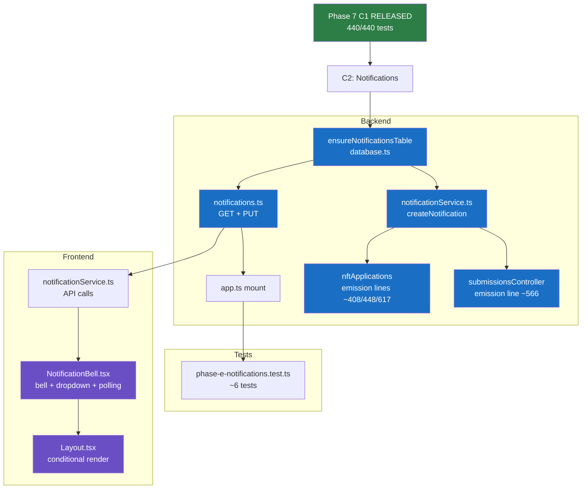
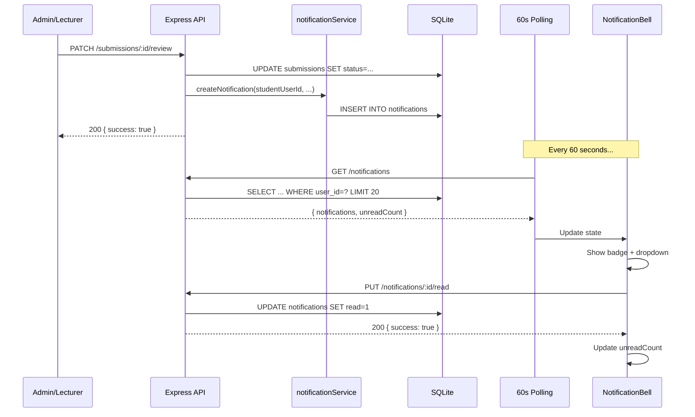
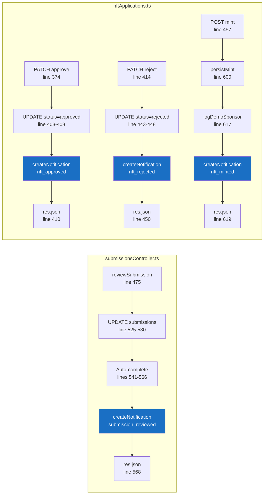
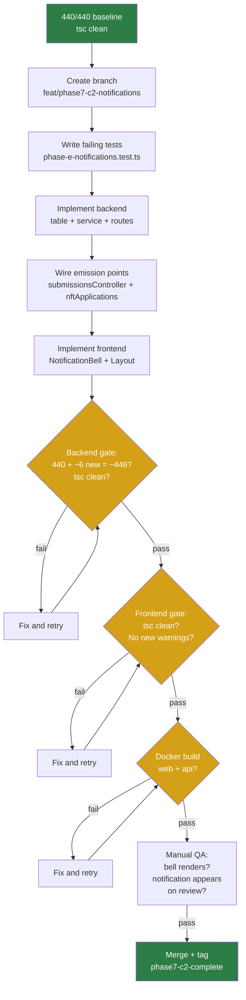

# Phase 7 C2 Developer Spec: In-App Notification System (Students Only)

**Date:** 2026-08-04
**Status:** SPEC READY
**Baseline:** Phase 7 C1 released (`phase7-c1-complete-2026-08-04`), 440/440 backend tests, site live
**Audience:** Students only

---

## Session Kickoff

### Objective
Define a complete developer specification for an in-app notification system scoped to student users. The system creates persistent notification rows when admin/lecturer actions affect a student (submission reviewed, NFT application approved/rejected/minted), surfaces them via a bell icon in the nav header, and polls for updates on a 60-second interval.

### Skills Applied
| Skill | Application |
|-------|-------------|
| brainstorming | Product intent, user stories, edge cases, failure modes |
| writing-plans | Spec structure, scope, routes, files, acceptance criteria |
| test-driven-development | Red/green/regression test definitions embedded in spec |
| systematic-debugging | Failure mode identification, defensive implementation expectations |
| verification-before-completion | Spec self-review, review checklist, to-do lists |
| receiving/requesting-code-review | Review checklist for scope, correctness, completeness |
| executing-plans | Parallel analysis synthesis (backend + frontend + test strategy) |
| using-superpowers | Worktree/branch reserved for implementation phase |

---

## Scope

### In Scope
- New `notifications` SQLite table with idempotent `ensureNotificationsTable()` migration
- `schema.sql` update for test DB initialization
- `GET /api/v1/notifications` — return recent notifications for authenticated user
- `PUT /api/v1/notifications/:id/read` — mark a notification as read (idempotent)
- Backend `notificationService.ts` — `createNotification()` helper
- Notification emission in `submissionsController.ts` after submission review
- Notification emission in `nftApplications.ts` after approve, reject, and mint
- Frontend `NotificationBell.tsx` component with unread count badge + dropdown
- Frontend `notificationService.ts` for API calls + 60s polling
- Bell placement in `Layout.tsx` header bar (students only)
- ~6 new backend tests in a new test file
- Route mounting in `app.ts`

### Out of Scope
- Lecturer/admin notifications (future extension of C2)
- WebSocket/SSE real-time push (60s polling is adequate)
- Email notification pairing (emailService exists but coupling adds complexity)
- Notification preferences/settings UI
- Bulk mark-all-as-read endpoint (can be added later)
- Quiz completion notifications (quiz_completions is self-initiated, not admin action)
- New npm dependencies
- Any modification to C1 files (EmbeddedMaterialViewer, StudentCourse, lessonCompletions routes)

### Assumptions
1. `notifications` table uses `CREATE TABLE IF NOT EXISTS` — safe idempotent creation
2. Emission calls are additive and wrapped in try/catch — failure does NOT break the parent operation
3. 60s polling is acceptable server load (~1 lightweight SELECT per active student per minute)
4. `Bell` import from `lucide-react` is available (already in project dependencies)
5. Layout.tsx already polls unread messages on 30s interval — adding a second poll for notifications is acceptable
6. Submissions link to users via `students.user_id` (submissions have `student_id` FK → `students.id`, then `students.user_id` FK → `users.id`)
7. NFT applications have `user_id` directly on the row (no join needed)

---

## Feature Spec: C2 — In-App Notification System

### Problem Statement
Students currently have no way to know when an admin or lecturer has reviewed their submission or processed their NFT certificate application without manually navigating to the relevant page. This creates a poor experience — students must poll pages visually to discover outcomes that are important to their progress.

### Goals
1. **Surface admin/lecturer actions to students proactively** — when a submission is graded or an NFT application is processed, the student learns immediately via a persistent notification
2. **Provide a non-disruptive UI** — bell icon with unread count in the nav header; dropdown on click; no modal interruptions
3. **Keep it simple** — no real-time push, no email coupling, no notification preferences. Just write → read → mark-read.

### Non-Goals
- Do NOT build notifications for lecturer or admin roles
- Do NOT add notifications for student-initiated actions (quiz completion, lesson completion)
- Do NOT integrate with emailService.ts
- Do NOT add notification preferences or mute/snooze controls
- Do NOT add WebSocket or SSE infrastructure
- Do NOT modify any Phase 7 C1 files

### User Stories

**US-1: Student receives submission review notification**
> As a student, when an admin or lecturer reviews my submission (approved or rejected), I want to see a notification in the bell icon so I know the outcome without manually checking the Submissions page.

**US-2: Student receives NFT application notification**
> As a student, when an admin approves, rejects, or mints my NFT certificate application, I want to see a notification so I can take the appropriate next step.

**US-3: Student reads and dismisses notifications**
> As a student, I want to click on a notification to navigate to the relevant page and have it marked as read, so my unread count stays meaningful.

**US-4: Student sees unread count**
> As a student, I want to see how many unread notifications I have at a glance via a badge on the bell icon.

---

## Functional Behavior

### 1. Notifications Table Schema

```sql
CREATE TABLE IF NOT EXISTS notifications (
  id         TEXT PRIMARY KEY,
  user_id    TEXT NOT NULL REFERENCES users(id) ON DELETE CASCADE,
  type       TEXT NOT NULL,
  title      TEXT NOT NULL,
  body       TEXT NOT NULL,
  read       INTEGER NOT NULL DEFAULT 0,
  link       TEXT,
  created_at TEXT NOT NULL DEFAULT (datetime('now'))
);
CREATE INDEX IF NOT EXISTS idx_notifications_user_read
  ON notifications(user_id, read);
CREATE INDEX IF NOT EXISTS idx_notifications_user_created
  ON notifications(user_id, created_at);
```

**Columns:**
| Column | Type | Constraints | Description |
|--------|------|-------------|-------------|
| `id` | TEXT | PK | UUIDv4 |
| `user_id` | TEXT | NOT NULL, FK → users(id) CASCADE | Notification recipient (always a student in C2) |
| `type` | TEXT | NOT NULL | One of: `submission_reviewed`, `nft_approved`, `nft_rejected`, `nft_minted` |
| `title` | TEXT | NOT NULL | Short human-readable title (e.g., "Submission Approved") |
| `body` | TEXT | NOT NULL | Detail message (e.g., "Your submission 'Week 3 Essay' was approved") |
| `read` | INTEGER | NOT NULL DEFAULT 0 | 0 = unread, 1 = read |
| `link` | TEXT | nullable | Relative URL to navigate to (e.g., `/student/submissions`) |
| `created_at` | TEXT | NOT NULL DEFAULT datetime('now') | Timestamp |

**Indexes:**
- `(user_id, read)` — fast unread-count query
- `(user_id, created_at)` — fast recent-notifications query

**Notification types and their content:**

| Type | Title | Body template | Link |
|------|-------|--------------|------|
| `submission_reviewed` | `Submission {status}` (capitalized) | `Your submission "{title}" was {status}` | `/student/submissions` |
| `nft_approved` | `Certificate Approved` | `Your certificate application for "{courseName}" was approved` | `/student/course` |
| `nft_rejected` | `Certificate Rejected` | `Your certificate application for "{courseName}" was rejected` | `/student/course` |
| `nft_minted` | `Certificate Minted` | `Your NFT certificate for "{courseName}" has been minted` | `/student/course` |

### 2. Backend Service: `notificationService.ts`

**Location:** `LMS-Server/src/services/notificationService.ts`

**Single export:**

```typescript
import { execute } from '../config/database.js';
import { v4 as uuidv4 } from 'uuid';

export function createNotification(params: {
  userId: string;
  type: string;
  title: string;
  body: string;
  link?: string;
}): void {
  execute(
    `INSERT INTO notifications (id, user_id, type, title, body, link)
     VALUES (?, ?, ?, ?, ?, ?)`,
    [uuidv4(), params.userId, params.type, params.title, params.body, params.link ?? null]
  );
}
```

**Design decisions:**
- Synchronous (better-sqlite3 is sync; Express 4 async handler gotcha applies)
- Fire-and-forget from the caller's perspective — the caller wraps in try/catch
- No deduplication logic in the service itself — each call creates exactly one row
- The caller is responsible for determining the correct `userId`, `type`, `title`, `body`, and `link`

### 3. API Routes: `notifications.ts`

**Location:** `LMS-Server/src/routes/notifications.ts`

#### GET /api/v1/notifications

**Purpose:** Return recent notifications for the authenticated user.

**Auth:** `authenticate` middleware (any role can call, but only returns rows for `req.user.userId`)

**Query:** `SELECT * FROM notifications WHERE user_id = ? ORDER BY created_at DESC LIMIT 20`

**Response:**
```json
{
  "success": true,
  "data": {
    "notifications": [
      {
        "id": "uuid",
        "type": "submission_reviewed",
        "title": "Submission Approved",
        "body": "Your submission \"Week 3 Essay\" was approved",
        "read": false,
        "link": "/student/submissions",
        "createdAt": "2026-08-04T12:00:00"
      }
    ],
    "unreadCount": 3
  }
}
```

**Implementation notes:**
- Returns both read and unread notifications (max 20, most recent first)
- `unreadCount` is a separate `SELECT COUNT(*) FROM notifications WHERE user_id = ? AND read = 0` query (or computed from the returned rows if all unread are within the 20-row window — but a separate count is safer for correctness when there are >20 total)
- Response maps `read` (integer 0/1) to boolean `read` (true/false) and `created_at` to camelCase `createdAt`
- Handler is synchronous (better-sqlite3)

#### PUT /api/v1/notifications/:id/read

**Purpose:** Mark a single notification as read. Idempotent.

**Auth:** `authenticate` middleware

**Behavior:**
1. Query `SELECT id, user_id FROM notifications WHERE id = ?`
2. If not found → 404
3. If `user_id !== req.user.userId` → 403 (cannot mark someone else's notification)
4. `UPDATE notifications SET read = 1 WHERE id = ?`
5. Return `{ success: true }`

**Idempotency:** Calling PUT on an already-read notification returns 200 (not an error).

**Handler:** Synchronous.

### 4. Route Mounting

**File:** `LMS-Server/src/app.ts`

**Insertion point:** After line 204 (after `walletStatusRoutes`), before `publicCredentialsRoutes`:

```typescript
import notificationRoutes from './routes/notifications.js';
// ...
app.use('/api/v1', apiLimiter, notificationRoutes);
```

**Why this position:** Notifications are authenticated and rate-limited like other API routes. No ordering dependency with other route files.

### 5. Emission Points

#### 5a. Submission Reviewed

**File:** `LMS-Server/src/controllers/submissionsController.ts`
**Function:** `reviewSubmission()` (line 475)
**Insertion point:** After line 566 (after the auto-complete try/catch block), before `res.json()` at line 568.

**Logic:**
```typescript
// C2: Notify student of submission review (best-effort)
try {
  const studentRecord = queryOne<{ user_id: string | null }>(
    'SELECT user_id FROM students WHERE id = ?',
    [submission!.student_id]
  );
  if (studentRecord?.user_id) {
    createNotification({
      userId: studentRecord.user_id,
      type: 'submission_reviewed',
      title: `Submission ${status.charAt(0).toUpperCase() + status.slice(1)}`,
      body: `Your submission "${submission!.title}" was ${status}`,
      link: '/student/submissions',
    });
  }
} catch (err) {
  console.error('[notification] submission review emission error:', err);
}
```

**Key details:**
- Reuses the `submission!` variable already fetched at line 532
- Needs `studentRecord.user_id` (not `student_id`) because `student_id` is the students table PK, not the users table FK
- The auto-complete block (lines 541-566) already does this same `SELECT user_id FROM students WHERE id = ?` lookup — we repeat it for isolation (the auto-complete only runs on approval, but notifications fire on both approved and rejected)
- Wrapped in try/catch — notification failure does NOT affect the review response

#### 5b. NFT Application Approved

**File:** `LMS-Server/src/routes/nftApplications.ts`
**Handler:** PATCH `.../approve` (line 374)
**Insertion point:** After `execute()` at line 403-408, before `res.json()` at line 410.

**Logic:**
```typescript
// C2: Notify student (best-effort)
try {
  const courseRow = queryOne<{ title: string }>('SELECT title FROM courses WHERE id = ?', [courseId]);
  const appRow = queryOne<{ user_id: string }>('SELECT user_id FROM course_nft_applications WHERE id = ?', [appId]);
  if (appRow) {
    createNotification({
      userId: appRow.user_id,
      type: 'nft_approved',
      title: 'Certificate Approved',
      body: `Your certificate application for "${courseRow?.title ?? 'course'}" was approved`,
      link: '/student/course',
    });
  }
} catch (err) {
  console.error('[notification] nft approve emission error:', err);
}
```

**Note:** The `app` variable (line 384) already contains `status` but NOT `user_id` in the current SELECT. Rather than modifying the existing SELECT (which would be a coupling change), we do a separate lookup. Alternatively, the existing SELECT could be extended to include `user_id` — implementation choice deferred to plan.

#### 5c. NFT Application Rejected

**File:** `LMS-Server/src/routes/nftApplications.ts`
**Handler:** PATCH `.../reject` (line 414)
**Insertion point:** After `execute()` at line 443-448, before `res.json()` at line 450.

**Logic:** Same pattern as 5b, with `type: 'nft_rejected'`, `title: 'Certificate Rejected'`, body `was rejected`.

#### 5d. NFT Application Minted

**File:** `LMS-Server/src/routes/nftApplications.ts`
**Handler:** POST `.../mint` (line 457)
**Insertion point:** After `persistMint()` succeeds at line 600, after `logDemoSponsorTrigger()` at line 617, before `res.json()` at line 619.

**Logic:**
```typescript
// C2: Notify student of successful mint (best-effort)
try {
  createNotification({
    userId: app.user_id,
    type: 'nft_minted',
    title: 'Certificate Minted',
    body: `Your NFT certificate for "${courseRow?.title ?? 'course'}" has been minted`,
    link: '/student/course',
  });
} catch (err) {
  console.error('[notification] nft mint emission error:', err);
}
```

**Note:** `app.user_id` is already available from the SELECT at line 465-469 (the mint handler already fetches `user_id`). `courseRow` is already fetched at line 613.

### 6. Database Migration

**File:** `LMS-Server/src/config/database.ts`
**Insertion point:** After `ensureCourseDocumentsWeekId()` call at line 739, before the `query`/`queryOne`/`execute` exports at line 741.

```typescript
/** Phase 7 C2 — notifications table for in-app student notifications. */
function ensureNotificationsTable(): void {
  db.exec(`
    CREATE TABLE IF NOT EXISTS notifications (
      id         TEXT PRIMARY KEY,
      user_id    TEXT NOT NULL REFERENCES users(id) ON DELETE CASCADE,
      type       TEXT NOT NULL,
      title      TEXT NOT NULL,
      body       TEXT NOT NULL,
      read       INTEGER NOT NULL DEFAULT 0,
      link       TEXT,
      created_at TEXT NOT NULL DEFAULT (datetime('now'))
    );
    CREATE INDEX IF NOT EXISTS idx_notifications_user_read
      ON notifications(user_id, read);
    CREATE INDEX IF NOT EXISTS idx_notifications_user_created
      ON notifications(user_id, created_at);
  `);
}
ensureNotificationsTable();
```

**Pattern:** `CREATE TABLE IF NOT EXISTS` + `CREATE INDEX IF NOT EXISTS` — fully idempotent, no PRAGMA needed (no table rename, no ALTER).

### 7. Schema.sql Update

**File:** `LMS-Server/database/schema.sql`
**Insertion point:** After the `audit_log` table and indexes (after line 305).

Add the same `CREATE TABLE IF NOT EXISTS notifications` block and both indexes. This ensures `_resetForTests()` creates the table for test DB initialization.

### 8. Frontend Service: `notificationService.ts`

**Location:** `LMS-Frontend/src/services/notificationService.ts`

```typescript
import api from './api';

export interface Notification {
  id: string;
  type: string;
  title: string;
  body: string;
  read: boolean;
  link: string | null;
  createdAt: string;
}

export interface NotificationsResponse {
  notifications: Notification[];
  unreadCount: number;
}

export const notificationService = {
  async getNotifications(): Promise<NotificationsResponse> {
    const res = await api.get('/notifications');
    return res.data.data;
  },

  async markRead(id: string): Promise<void> {
    await api.put(`/notifications/${id}/read`);
  },
};
```

### 9. Frontend Component: `NotificationBell.tsx`

**Location:** `LMS-Frontend/src/components/NotificationBell.tsx`

**Behavior:**
1. On mount, fetch `GET /notifications`
2. Set up 60s polling interval (similar to Layout.tsx 30s message polling pattern)
3. Render a bell icon (`Bell` from lucide-react) with a red badge showing `unreadCount` (hidden when 0)
4. On bell click, toggle a dropdown panel showing notifications (most recent first)
5. Each notification row shows: title, body (truncated), relative time (e.g., "2m ago"), read/unread indicator
6. On notification click: call `PUT /notifications/:id/read`, navigate to `link`, close dropdown
7. Clicking outside the dropdown closes it

**State:**
- `notifications: Notification[]`
- `unreadCount: number`
- `open: boolean` (dropdown visibility)

**Styling:**
- Badge: same red badge pattern used for unread messages in Layout.tsx (lines 156-159)
- Dropdown: absolute-positioned panel, max-height with overflow-y-auto, 320px wide
- Notification rows: subtle background difference for unread vs. read

**Polling:**
- `useEffect` with `setInterval(fetchNotifications, 60_000)` + cleanup on unmount
- Also re-fetch on dropdown open (for freshness)
- Also re-fetch after `markRead` (to update unread count)

### 10. Layout.tsx Integration

**File:** `LMS-Frontend/src/components/Layout.tsx`
**Insertion point:** In the header bar, before the user name/role display (line 178).

```tsx
{user?.role === 'student' && <NotificationBell />}
```

**Placement:** Inside the `<div className="flex items-center gap-3 sm:gap-4">` at line 178, as the first child. This puts the bell to the left of the user name and logout button.

**Conditional rendering:** Only for students (`user?.role === 'student'`). Admin and lecturer roles do not see the bell.

---

## Edge Cases

| # | Edge Case | Expected Behavior |
|---|-----------|-------------------|
| E1 | Student has 0 notifications | Bell renders with no badge, dropdown shows "No notifications" message |
| E2 | Student has >20 notifications | GET returns only the 20 most recent; `unreadCount` reflects true total |
| E3 | Notification for deleted user | FK CASCADE deletes notifications when user is deleted |
| E4 | Notification for non-student user_id | Technically possible (table schema allows it), but C2 emission points only target students. No enforcement constraint needed — future extension for lecturer notifications. |
| E5 | Admin reviews submission for student with no `user_id` link | No notification created (the `studentRecord?.user_id` check prevents it). Some legacy students may have NULL user_id. No error. |
| E6 | Double-click on approve/reject | Each click creates a separate notification. The approve/reject handlers return 409 on second call (status check), so the second notification emission is never reached. |
| E7 | Mark-read on already-read notification | Idempotent — returns 200, no error |
| E8 | Mark-read on another user's notification | 403 Forbidden |
| E9 | Mark-read on non-existent notification | 404 Not Found |
| E10 | Polling while dropdown is open | Re-fetch updates the list; if a new notification arrives, it appears at the top |
| E11 | Notification link is null | Click does not navigate; only marks as read |
| E12 | Very long submission title | Body text truncated in UI (CSS text-overflow), full text stored in DB |

---

## Error/Fallback Behavior

| Scenario | Behavior |
|----------|----------|
| Emission throws (DB error during createNotification) | Caught by try/catch; parent operation (review/approve/reject/mint) continues normally; error logged to console |
| GET /notifications fails (network/server error) | Frontend catches error silently; bell shows stale data or 0; no toast error (polling will retry in 60s) |
| PUT /notifications/:id/read fails | Frontend catches error; notification visually remains unread; user can retry |
| Database migration fails | `CREATE TABLE IF NOT EXISTS` is idempotent; if it fails on startup, server won't start (same as all other ensure*() functions) |
| High polling load | 60s interval × N students = N queries/min. Each query is a simple indexed SELECT. Acceptable for expected user base (<100 concurrent students). |

---

## Touched Files / Routes / Data Paths

### New Files (4)

| File | Purpose |
|------|---------|
| `LMS-Server/src/services/notificationService.ts` | `createNotification()` helper |
| `LMS-Server/src/routes/notifications.ts` | GET + PUT routes |
| `LMS-Frontend/src/services/notificationService.ts` | API calls + types |
| `LMS-Frontend/src/components/NotificationBell.tsx` | Bell + dropdown UI |

### Modified Files (5)

| File | Change | Lines (est.) |
|------|--------|-------------|
| `LMS-Server/src/config/database.ts` | Add `ensureNotificationsTable()` | +15 |
| `LMS-Server/database/schema.sql` | Add notifications table + indexes | +12 |
| `LMS-Server/src/app.ts` | Import + mount notification routes | +2 |
| `LMS-Server/src/controllers/submissionsController.ts` | Emission after review (line ~566) | +15 |
| `LMS-Server/src/routes/nftApplications.ts` | Emission after approve/reject/mint (lines ~408, ~448, ~617) | +40 |
| `LMS-Frontend/src/components/Layout.tsx` | Add NotificationBell to header | +3 |

### New Test File (1)

| File | Purpose |
|------|---------|
| `LMS-Server/src/__tests__/phase-e-notifications.test.ts` | ~6 tests for notifications |

### Untouched Files (confirmed)

- `EmbeddedMaterialViewer.tsx` — C1, stable
- `StudentCourse.tsx` — C1, stable
- `lessonCompletions.ts` — C1, stable
- `courseCompletionService.ts` (backend) — C1, stable
- `InlineQuizTaker.tsx`, `InlineAssignmentForm.tsx` — Phase 6, stable
- Auth middleware — no changes
- `toastBus.ts`, `ToastProvider.tsx` — not used by C2

---

## Rollout / Compatibility Notes

1. **Zero-downtime deploy:** The `ensureNotificationsTable()` migration uses `CREATE TABLE IF NOT EXISTS` — idempotent, no table rename, no PRAGMA needed. Safe to run on existing production DB.

2. **Backward compatibility:** No existing API responses are modified. The 4 emission points are additive insertions after existing logic. The `notifications` routes are entirely new.

3. **Container rebuild:** Both `web` (frontend) and `api` (backend) containers must be rebuilt:
   ```bash
   docker compose build web api && docker compose up -d --no-deps web api
   ```

4. **Rollback:** If C2 causes issues:
   - Revert the commits
   - Rebuild and redeploy both containers
   - The `notifications` table remains but is harmless (no code references it after revert)
   - No other tables or existing APIs are affected

5. **Frontend-only fallback:** If the backend is reverted but frontend is not, `GET /notifications` returns 404 → frontend catches error silently → bell shows 0 → no crash.

---

## Mermaid Diagrams

### Feature Dependency Map



### Notification Data Flow



### Emission Point Flow



### Verification / Test Gate Flow



---

## Acceptance Criteria

| ID | Criterion | Type | Verification |
|----|-----------|------|-------------|
| C2-AC1 | `notifications` table created with correct schema (id, user_id, type, title, body, read, link, created_at) | Schema | Test: table exists after `_resetForTests`, columns match spec |
| C2-AC2 | `GET /api/v1/notifications` returns notifications for authenticated user (max 20, newest first) | API | Test: seed notifications → GET → verify order and limit |
| C2-AC3 | `GET /api/v1/notifications` returns `unreadCount` reflecting true unread total | API | Test: seed 3 unread + 1 read → verify unreadCount = 3 |
| C2-AC4 | `PUT /api/v1/notifications/:id/read` marks notification as read (idempotent) | API | Test: PUT → verify read=1 → PUT again → still 200 |
| C2-AC5 | `PUT /api/v1/notifications/:id/read` returns 403 for another user's notification | API | Test: user A's notification → user B PUT → 403 |
| C2-AC6 | Notification row created when submission is reviewed (approved or rejected) | Emission | Test: POST review → SELECT notifications → row exists with correct type/user_id |
| C2-AC7 | Notification row created when NFT application is approved | Emission | Test: PATCH approve → SELECT notifications → row exists |
| C2-AC8 | Notification row created when NFT application is rejected | Emission | Test: PATCH reject → SELECT notifications → row exists |
| C2-AC9 | Notification row created when NFT is minted | Emission | (Manual QA — mint requires Stellar integration) |
| C2-AC10 | Frontend bell icon shows unread count badge (0 = no badge) | Frontend | Manual QA |
| C2-AC11 | Bell click opens dropdown with notifications | Frontend | Manual QA |
| C2-AC12 | Click notification → navigates to link + marks read | Frontend | Manual QA |
| C2-AC13 | Unread count refreshes on 60s polling interval | Frontend | Manual QA |
| C2-AC14 | Bell only renders for students (not admin/lecturer) | Frontend | Manual QA: login as admin → no bell |
| C2-AC15 | Emission failure does not break parent operation | Defensive | Test: verify submission review still returns 200 even if notification INSERT were to fail (confirmed by try/catch pattern) |

---

## Test Strategy

### New Test File: `phase-e-notifications.test.ts`

**Location:** `LMS-Server/src/__tests__/phase-e-notifications.test.ts`

**Seed helper:** Reuse pattern from `phase-d-lessons.test.ts` — `seedBase()` creates admin, lecturer, student, course, enrollment.

#### Red/Green Tests (~6-8 tests)

| ID | Test | Type | Red State | Green State |
|----|------|------|-----------|-------------|
| E1-AC1 | GET /notifications returns empty array for new user | API | 404 (route doesn't exist) | 200 + `{ notifications: [], unreadCount: 0 }` |
| E1-AC2 | GET /notifications returns seeded notifications in desc order | API | Wrong order or missing | Newest first, max 20 |
| E1-AC3 | GET /notifications returns correct unreadCount | API | Wrong count | Matches seeded unread rows |
| E1-AC4 | PUT /notifications/:id/read marks as read + idempotent | API | 404 | 200, row.read = 1, second PUT still 200 |
| E1-AC5 | PUT /notifications/:id/read returns 403 for wrong user | API | No auth check | 403 |
| E2-AC1 | Review submission → notification created for student | Emission | No notification row | Row with type=submission_reviewed, correct user_id |
| E2-AC2 | Approve NFT application → notification created for student | Emission | No notification row | Row with type=nft_approved, correct user_id |
| E2-AC3 | Reject NFT application → notification created for student | Emission | No notification row | Row with type=nft_rejected, correct user_id |

#### Regression Coverage

| Check | Expected |
|-------|----------|
| 440 baseline tests pass | All existing tests unchanged |
| Submission review response shape | Same `{ success: true, data: { ... } }` |
| NFT approve/reject response shape | Same `{ success: true, data: { applicationId, status } }` |
| No new middleware or auth changes | Verified by code review |
| tsc clean (frontend + backend) | Zero errors |

#### Idempotency / Retry / Ordering

| Scenario | Expected |
|----------|----------|
| PUT /read on already-read notification | 200 (idempotent) |
| GET /notifications called repeatedly | Same result (polling is read-only) |
| Submission reviewed twice (second returns 409 from status check) | Only 1 notification created (second review never reaches emission point) |
| NFT approved then minted | 2 separate notifications created (different types, both correct) |

#### Manual QA Checklist

| ID | Check | Expected | Actual | P/F |
|----|-------|----------|--------|-----|
| QA-C2-01 | Bell icon visible in student nav | Yes, to left of user name | | |
| QA-C2-02 | Bell NOT visible for admin | No bell rendered | | |
| QA-C2-03 | Bell NOT visible for lecturer | No bell rendered | | |
| QA-C2-04 | Submit assignment + admin reviews it | Student sees notification with "Submission Approved/Rejected" | | |
| QA-C2-05 | Admin approves NFT application | Student sees "Certificate Approved" notification | | |
| QA-C2-06 | Click notification | Navigates to link, notification marked read | | |
| QA-C2-07 | All notifications read | Badge disappears (unreadCount = 0) | | |
| QA-C2-08 | 0 notifications | Dropdown shows "No notifications" | | |
| QA-C2-09 | Multiple notifications | Dropdown scrollable, newest first | | |
| QA-C2-10 | Mobile layout | Bell + dropdown render correctly on small screens | | |

---

## To-Do Lists

### Spec Checklist
- [x] Problem statement defined
- [x] Goals and non-goals defined
- [x] User stories written
- [x] Functional behavior specified (table, routes, service, emission points)
- [x] Edge cases documented (12 cases)
- [x] Error/fallback behavior documented
- [x] Touched files identified (4 new + 6 modified + 1 test)
- [x] Rollout/compatibility notes written
- [x] Mermaid diagrams created (4 diagrams)
- [x] Acceptance criteria defined (15 criteria)
- [x] Test strategy defined (8 automated + 10 manual QA)
- [x] Review checklist created

### Feature Checklist
- [ ] `ensureNotificationsTable()` in database.ts
- [ ] `notifications` table in schema.sql
- [ ] `notificationService.ts` (backend) — createNotification()
- [ ] `notifications.ts` routes — GET + PUT
- [ ] Route mounting in app.ts
- [ ] Emission in submissionsController.ts (submission_reviewed)
- [ ] Emission in nftApplications.ts (nft_approved)
- [ ] Emission in nftApplications.ts (nft_rejected)
- [ ] Emission in nftApplications.ts (nft_minted)
- [ ] `notificationService.ts` (frontend) — API calls
- [ ] `NotificationBell.tsx` — bell + dropdown + polling
- [ ] `Layout.tsx` — conditional render for students

### Backend Test Checklist
- [ ] E1-AC1: GET returns empty array
- [ ] E1-AC2: GET returns seeded notifications in desc order
- [ ] E1-AC3: GET returns correct unreadCount
- [ ] E1-AC4: PUT read — marks read + idempotent
- [ ] E1-AC5: PUT read — 403 for wrong user
- [ ] E2-AC1: Submission review → notification created
- [ ] E2-AC2: NFT approve → notification created
- [ ] E2-AC3: NFT reject → notification created

### QA Checklist
- [ ] QA-C2-01 through QA-C2-10 (see Manual QA section)

### Risk Checklist
- [ ] Emission in submissionsController wrapped in try/catch
- [ ] Emission in nftApplications (all 3) wrapped in try/catch
- [ ] 60s polling does not cause excessive load
- [ ] NotificationBell in header does not break existing layout
- [ ] Express 4 async handler gotcha avoided (sync handlers for new routes)
- [ ] schema.sql updated alongside database.ts migration
- [ ] `students.user_id` lookup handles NULL user_id gracefully
- [ ] No modification to C1 files

---

## Review Checklist

### Before Implementation Planning

| # | Check | Status |
|---|-------|--------|
| R1 | Scope is bounded to students only, 4 notification types | Verified |
| R2 | No new npm dependencies required | Verified |
| R3 | All emission points identified with exact file + line numbers | Verified |
| R4 | Route file follows existing pattern (sync handlers, apiLimiter) | Verified |
| R5 | Migration follows ensure*() + CREATE TABLE IF NOT EXISTS pattern | Verified |
| R6 | schema.sql update specified for test DB | Verified |
| R7 | Frontend placement in Layout.tsx header identified with conditional render | Verified |
| R8 | Acceptance criteria cover all functional requirements | Verified (15 criteria) |
| R9 | Test plan covers red/green/regression/idempotency | Verified (8 auto + 10 QA) |
| R10 | Rollback path documented (revert commits + rebuild) | Verified |
| R11 | No C1 files modified | Verified |
| R12 | Express 4 async handler gotcha documented | Verified |
| R13 | Submission user_id resolution path documented (student_id → students.user_id) | Verified |
| R14 | NFT application user_id available directly (no join needed for approve/reject; mint has `app.user_id`) | Verified |

### Unresolved Assumptions (None Critical)

| # | Assumption | Risk | Mitigation |
|---|-----------|------|------------|
| U1 | `Bell` icon available from lucide-react | Very low | Already imported in Layout.tsx; confirm during implementation |
| U2 | NFT approve handler SELECT includes `user_id` | Low | Current SELECT at line 384 fetches `id, status` only — need to extend or do separate lookup |
| U3 | NFT reject handler SELECT includes `user_id` | Low | Same as U2 |

---

## /loop Workflow

```
/loop assess   — Verify 440/440 baseline, confirm C1 tags, read this spec
/loop spec     — This document (Phase 7 C2 spec) — COMPLETE
/loop review   — Review spec for completeness → approve → proceed to plan
/loop plan     — Write Phase 7 C2 implementation plan (next session)
```

---

## Final Recommendation

**Status: PHASE 7 C2 SPEC READY**

**Evidence:**
- Problem statement, goals, non-goals clearly defined
- 4 user stories covering all notification flows
- Complete functional specification: table schema, 2 API routes, 4 emission points, 1 frontend component
- 12 edge cases documented
- Error/fallback behavior specified for all failure modes
- 4 new files + 6 modified files identified with exact line numbers
- 15 acceptance criteria with verification methods
- 8 automated tests + 10 manual QA checks defined
- 4 mermaid diagrams (dependency, data flow, emission flow, verification gate)
- Rollback path documented
- Review checklist with 14 items, all verified
- No unresolved blockers

**Exact next action:** Write Phase 7 C2 implementation plan from this spec. The plan should define task ordering (T0-T8), test-first workflow, and verification gates.

**Branch name:** `feat/phase7-c2-notifications` (to be created from current `main` HEAD at implementation time)
