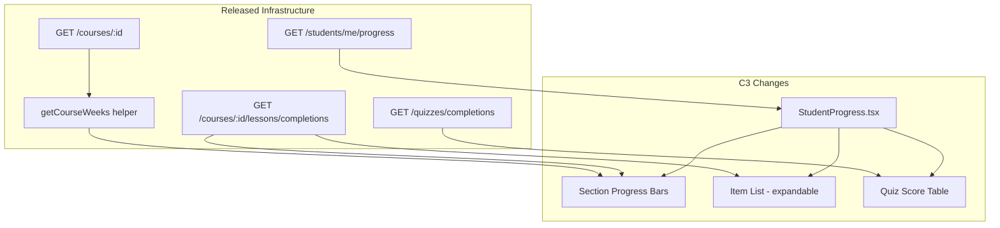
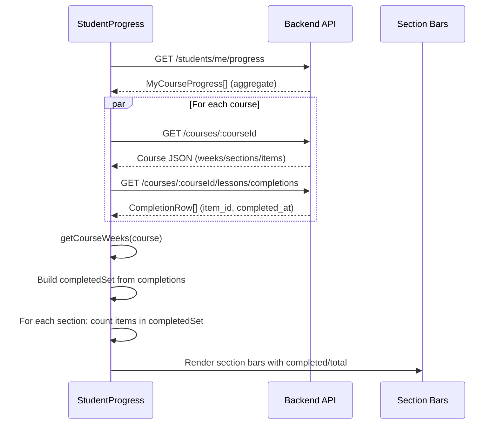
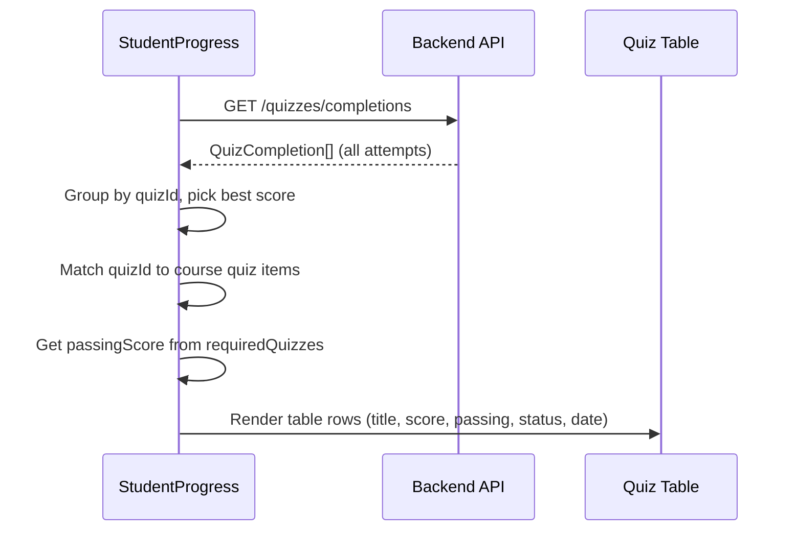
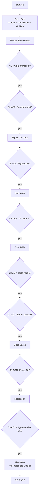

# Phase 7 C3 Spec: Student Progress Enhancements

**Date:** 2026-08-04
**Status:** SPEC DRAFT
**Baseline:** 448/448 tests, tsc clean, both containers healthy
**Predecessor:** Phase 7 C2 (notifications) — `phase7-c2-complete-2026-08-04`

---

## Problem Statement

The StudentProgress page (`/student/progress`) currently shows **one aggregate progress bar per course** — e.g., "45/60 lessons, 75%". Students cannot see which sections they have completed vs. which are incomplete without navigating to the course viewer and scrolling through each section.

Similarly, quiz scores are only shown as pass/fail badges on the progress page. Students frequently ask "what score did I get?" and "when did I take this quiz?" — information available in the system but not surfaced on the progress page.

---

## Goals

1. Show **per-section progress bars** so students can identify exactly which course sections need attention
2. Show **per-item completion status** within expandable sections (completed / not started)
3. Show a **quiz score summary table** per course with attempt scores, passing thresholds, and dates
4. All data consumed from **existing backend endpoints** — no new routes, no schema changes

---

## Non-Goals

- No changes to `StudentDashboard.tsx` (separate, larger refactor)
- No audio/video partial-progress indicators (already visible in course viewer via C1)
- No time-spent analytics or activity timelines
- No new backend endpoints or schema migrations
- No real-time push (deferred)
- No changes to admin or lecturer views

---

## User Stories

**US-1:** As a student, I want to see which course sections I have completed so I can focus on the sections that need work.

**US-2:** As a student, I want to expand a section to see which individual items I have completed vs. which are remaining, so I can pick up where I left off.

**US-3:** As a student, I want to see my quiz scores, passing thresholds, and attempt dates in one place, so I know whether I need to retake a quiz.

---

## In Scope

- Modify `StudentProgress.tsx` to render per-section progress
- Fetch course structure (sections/items) and lesson completions for section-level grouping
- Fetch quiz completions for score table
- Add collapsible section detail (item-level checkmarks)
- Handle weeks → sections hierarchy via existing `getCourseWeeks()` helper
- Handle empty states (no sections, no items, no quiz attempts)

## Out of Scope

- Backend route changes
- Schema migrations
- StudentDashboard.tsx modifications
- Audio/video `progress_pct` / `last_position_s` indicators
- New components outside StudentProgress (no shared component extraction required)

---

## Assumptions

1. **Course structure is available via `GET /courses/:courseId`** — returns `sections` or `weeks` JSON. The frontend `getCourseWeeks(course)` normalizes both formats into `CourseWeek[]`.

2. **Lesson completions are available via `GET /courses/:courseId/lessons/completions`** — returns flat array of `{ item_id, section_id, completed_at, progress_pct, last_position_s }`. Student role returns only own completions.

3. **Quiz completions are available via `GET /quizzes/completions`** — returns `{ completions: QuizCompletion[] }` with `quizId, score, total, passed, completedAt`.

4. **The existing aggregate progress bar** (from `GET /students/me/progress`) remains as the top-level summary. Section bars are additive detail below it.

5. **`section_id` in `lesson_completions`** reliably maps to `CourseSection.id` from the course JSON.

---

## Functional Behavior

### F1: Page Load Data Flow

On mount, `StudentProgress` currently calls `getMyProgress()` which returns `MyCourseProgress[]`. C3 adds two parallel data fetches per course:

1. **Course structure:** `courseService.getCourse(courseId)` → parse sections via `getCourseWeeks()`
2. **Lesson completions:** `courseCompletionService.getLessonCompletions(courseId)` → per-item completion status

Plus one global fetch:

3. **Quiz completions:** `quizService.getCompletions()` → all quiz attempts for the user

All three are fetched with `Promise.all` to avoid waterfall. The existing `getMyProgress()` call remains unchanged.

### F2: Per-Section Progress Bars

For each course card, below the existing aggregate bar, render a collapsible section list:

```
▸ Week 1: Introduction
  ████████░░░░  3/5 items (60%)

▸ Week 2: Blockchain Fundamentals
  ████████████  8/8 items (100%) ✓

▾ Week 3: Smart Contracts          ← expanded
  ████░░░░░░░░  2/6 items (33%)
  ✓ Introduction to Solidity
  ✓ Solidity Data Types
  ○ Control Structures
  ○ Functions and Modifiers
  ○ Events and Logging
  ○ Deploying Contracts
```

**Grouping logic:**
- Use `getCourseWeeks(course)` to get `CourseWeek[]`
- Flatten all sections from all weeks into a single list (week headers are NOT shown separately — the progress page shows a flat section list per course, since weeks are an organizational detail visible on the course viewer)
- For each section, count items where `completedSet.has(item.id)` vs. total `section.items.length`
- Sections with 0 items are hidden (no empty bar)

**Collapse behavior:**
- All sections start collapsed by default
- Click section header toggles expand/collapse
- Expanded sections show individual items with completion icons
- State is local (not persisted)

### F3: Per-Item Completion Icons

When a section is expanded, show each item with:
- `✓` (green checkmark) — `completed_at IS NOT NULL` for this item
- `○` (grey circle) — no completion record, or `completed_at IS NULL`
- Item title
- Item type icon (optional, using existing lucide icons: Video, FileText, Headphones, etc.)

No partial progress indicators. An item is either complete or not.

### F4: Quiz Score Summary Table

Below the section bars (and below the existing "Required Quizzes" checklist), add a "Quiz Scores" table if the user has any quiz completions for this course:

```
Quiz Scores
┌─────────────────────────┬───────┬──────────┬────────┬────────────┐
│ Quiz                    │ Score │ Passing  │ Status │ Date       │
├─────────────────────────┼───────┼──────────┼────────┼────────────┤
│ Blockchain Basics       │  85%  │   70%    │ Passed │ 2026-08-01 │
│ Smart Contract Security │  55%  │   70%    │ Failed │ 2026-08-03 │
└─────────────────────────┴───────┴──────────┴────────┴────────────┘
```

**Data source:** `GET /quizzes/completions` returns all `QuizCompletion[]` for the user. Filter by matching `quizId` against the course's quiz items (items with `type: 'quiz'` in `course.sections`).

**Columns:**
- Quiz title (from course item or `requiredQuizzes` data)
- Score as percentage (`score / total * 100`)
- Passing score (from `requiredQuizzes[].passingScore`, or course default 70%)
- Status: "Passed" (green) / "Failed" (red)
- Date: `completedAt` formatted as `YYYY-MM-DD`

**Edge case:** If a quiz has been attempted multiple times, show only the **best attempt** (highest score). The backend `GET /quizzes/completions` may return multiple completions per quiz — group by `quizId` and pick max score.

### F5: Empty States

| Scenario | Behavior |
|----------|----------|
| Course has no sections/items | Show "No lesson content available" message, hide section bars |
| Course has sections but 0 completions | Show all section bars at 0%, items all show `○` |
| No quiz completions for course | Hide "Quiz Scores" table entirely |
| Course has no quiz-type items | Hide "Quiz Scores" table entirely |
| API call fails | Show existing error state; do not break the page |

### F6: Performance

- **Parallel fetching:** All per-course data fetches run in `Promise.all`
- **Lazy loading:** Section detail (item list) is computed from already-fetched data — no additional API calls on expand
- **No polling:** Progress page is not polled; data is fetched once on mount (user can refresh)

---

## Touched Files / Routes / Data Paths

### Files Modified

| File | Change | Lines (est.) |
|------|--------|-------------|
| `LMS-Frontend/src/pages/StudentProgress.tsx` | Add section bars, item list, quiz table | +200-250 |
| `LMS-Frontend/src/services/courseCompletionService.ts` | Verify `getLessonCompletions()` exists (it does) | 0 (read-only) |
| `LMS-Frontend/src/services/quizService.ts` | Verify `getCompletions()` exists (it does) | 0 (read-only) |
| `LMS-Frontend/src/services/courseService.ts` | Verify `getCourse()` exists (it does) | 0 (read-only) |

### Files NOT Modified

| File | Reason |
|------|--------|
| `StudentDashboard.tsx` | Out of scope |
| `Layout.tsx` | No layout changes |
| `NotificationBell.tsx` | No notification changes |
| Any backend file | No backend changes |
| `database.ts` / `schema.sql` | No schema changes |

### Backend Routes Consumed (Existing, No Changes)

| Route | Used For | Already Called? |
|-------|----------|----------------|
| `GET /students/me/progress` | Aggregate progress per course | Yes (existing) |
| `GET /courses/:courseId` | Course structure (sections/items) | New call in this page |
| `GET /courses/:courseId/lessons/completions` | Per-item completion status | New call in this page |
| `GET /quizzes/completions` | Quiz attempt scores | New call in this page |

### Frontend Types Used (Existing)

| Type | Source | Used For |
|------|--------|----------|
| `MyCourseProgress` | `types/api.ts` | Aggregate progress (existing) |
| `Course`, `CourseSection`, `CourseWeek`, `CourseItem` | `types/course.ts` | Section/item structure |
| `getCourseWeeks()` | `types/course.ts` | Normalize weeks/sections |
| `QuizCompletion` | `types/quiz.ts` | Quiz scores |

---

## Rollout / Compatibility Notes

1. **No backend changes** — no migration, no deploy-order concern
2. **Frontend-only rebuild** — `docker compose build web && docker compose up -d --no-deps web`
3. **Backward compatible** — existing aggregate bar remains; section bars are additive
4. **No feature flag needed** — purely additive UI enhancement
5. **Rollback** — revert the frontend commit, rebuild `web` container

---

## Acceptance Criteria

### Section Progress Bars

| ID | Criterion | Verification |
|----|-----------|-------------|
| C3-AC1 | Each enrolled course shows per-section (or per-week) progress bars below the aggregate bar | Visual inspection |
| C3-AC2 | Section bars show correct `completed/total` counts matching backend completion data | Compare with `GET /courses/:id/lessons/completions` response |
| C3-AC3 | Sections with all items completed show 100% bar + checkmark indicator | Visual inspection |
| C3-AC4 | Sections start collapsed; clicking toggles expand/collapse | Visual + interaction test |
| C3-AC5 | Expanded sections show per-item completion icons (✓ or ○) | Visual inspection |
| C3-AC6 | Items display title and completion status correctly | Cross-reference with completion data |

### Quiz Score Table

| ID | Criterion | Verification |
|----|-----------|-------------|
| C3-AC7 | Quiz scores table appears when student has quiz completions for a course | Visual + data check |
| C3-AC8 | Table shows quiz title, score %, passing score, pass/fail status, date | Visual inspection |
| C3-AC9 | Multiple attempts for same quiz show only best score | Verify grouping logic |
| C3-AC10 | Table is hidden when no quiz completions exist for the course | Visual — empty state |

### Edge Cases & Regression

| ID | Criterion | Verification |
|----|-----------|-------------|
| C3-AC11 | Course with no sections shows graceful empty state | Visual |
| C3-AC12 | Course with sections but zero completions shows 0% bars | Visual |
| C3-AC13 | Existing aggregate progress bar still displays correctly | Regression — compare before/after |
| C3-AC14 | Certificate status badges still display correctly | Regression |
| C3-AC15 | "Apply for certificate" button still works | Regression |
| C3-AC16 | Page loads without errors when API calls fail (graceful degradation) | Error injection test |
| C3-AC17 | Mobile layout: section bars and quiz table stack properly | Visual — mobile viewport |

---

## Test Strategy

### Automated Tests

**No new backend tests required.** All data endpoints are already tested:
- `student-progress.test.ts` — SMP1-SMP9 (progress endpoint)
- `phase-d-lessons.test.ts` — D1/D1b/D2/D3 (completions endpoint)
- `courseCompletion.test.ts` — B3-B6 (progress service + applications)
- `quiz-security.test.ts` — LMS-QUIZ-001-003 (quiz completions)

**Frontend tests (if vitest + RTL is configured):**
- C3-T1: `StudentProgress` renders section bars when course has sections
- C3-T2: `StudentProgress` renders correct completed/total counts per section
- C3-T3: `StudentProgress` hides quiz table when no completions exist
- C3-T4: `StudentProgress` shows quiz scores with correct pass/fail status
- C3-T5: `StudentProgress` handles empty sections gracefully

**Note:** If the frontend does not currently have a component testing setup (vitest + @testing-library/react), skip automated frontend tests. The test gates are the backend regression suite + tsc clean + visual QA.

### Regression Coverage

| Check | Gate |
|-------|------|
| 448/448 backend tests pass | Automated |
| tsc clean (frontend + backend) | Automated |
| Docker build succeeds | Automated |
| Existing aggregate bar renders | Visual |
| Certificate badges render | Visual |
| Apply button works | Visual |

### Manual QA Checklist

| ID | Check | Expected |
|----|-------|----------|
| QA-C3-01 | Section bars visible for enrolled course | Per-section bars below aggregate |
| QA-C3-02 | Section counts match reality | Compare with course viewer |
| QA-C3-03 | Expand/collapse works | Click toggles item list |
| QA-C3-04 | Item checkmarks match completion | ✓ for done, ○ for not done |
| QA-C3-05 | Quiz table shows scores | Title, score, passing, status, date |
| QA-C3-06 | No quiz table when no attempts | Table hidden |
| QA-C3-07 | Empty course shows graceful state | "No lesson content" message |
| QA-C3-08 | Mobile layout works | Bars and table stack properly |
| QA-C3-09 | Page loads fast | No visible waterfall delay |
| QA-C3-10 | Existing features unbroken | Aggregate bar, badges, apply button |

---

## Risk Analysis

### R1: CourseSection.id ↔ lesson_completions.section_id Mismatch

**Risk:** The `section_id` stored in `lesson_completions` may not match the `CourseSection.id` from the course JSON if sections were edited after completions were recorded.

**Mitigation:** The completion endpoint stores `section_id` at the time of completion. If a section is reorganized, old completions may map to stale section IDs. Handle gracefully: items not in any current section are ignored. Items in a section with no completion record are shown as incomplete.

**Severity:** LOW — course structure rarely changes after students begin.

### R2: Extra API Calls Per Course

**Risk:** C3 adds 2 API calls per course (`getCourse` + `getLessonCompletions`) plus 1 global (`getCompletions`). A student enrolled in 5 courses triggers 11 API calls total.

**Mitigation:** All calls run in parallel via `Promise.all`. Calls are lightweight (small JSON payloads). No pagination needed (courses have <100 items typically). Consider caching course structure if performance is an issue (deferred).

**Severity:** LOW — expected <200ms total for typical course loads.

### R3: Weeks vs. Flat Sections Inconsistency

**Risk:** Some courses use `weeks[]` (new format), others use `sections[]` (legacy). If the grouping code doesn't handle both, progress bars will be missing or wrong.

**Mitigation:** Use `getCourseWeeks(course)` which normalizes both formats. This helper is already used elsewhere in the frontend and is well-tested.

**Severity:** LOW — helper exists and handles both cases.

### R4: Quiz Completion De-duplication

**Risk:** `GET /quizzes/completions` may return multiple attempts per quiz. If not de-duplicated, the quiz table shows duplicate rows.

**Mitigation:** Group completions by `quizId`, pick the attempt with the highest score. This is a simple `reduce()` operation on the frontend.

**Severity:** LOW — straightforward data transformation.

### R5: No C2 Coupling

**Risk:** C3 might accidentally interact with the notifications system (C2).

**Mitigation:** C3 modifies only `StudentProgress.tsx`. Notifications are in `NotificationBell.tsx` (rendered in `Layout.tsx`). Zero file overlap. No shared state.

**Severity:** NONE — confirmed no coupling.

---

## Dependency Map

### What C3 Reads (All Existing)

```
GET /students/me/progress        → MyCourseProgress[]     (existing call)
GET /courses/:courseId            → Course (sections/items) (new call)
GET /courses/:courseId/lessons/completions → CompletionRow[] (new call)
GET /quizzes/completions         → QuizCompletion[]        (new call)
```

### What C3 Does NOT Touch

```
notifications table / routes / NotificationBell  (C2)
lesson_completions schema / columns               (C1)
submissionsController / nftApplications           (C2 emission)
StudentDashboard.tsx                              (separate page)
Any backend file                                  (frontend-only)
```

---

## Mermaid Diagrams

### Feature Dependency Map



### Data Flow: Section Progress



### Data Flow: Quiz Score Table



### Verification / Test Gate Flow



---

## To-Do Lists

### Spec Checklist

- [x] Problem statement defined
- [x] Goals and non-goals explicit
- [x] User stories written
- [x] Functional behavior described (F1-F6)
- [x] Edge cases enumerated
- [x] Touched files/routes identified
- [x] Acceptance criteria defined (C3-AC1 through C3-AC17)
- [x] Test strategy defined
- [x] Risk analysis complete
- [x] Mermaid diagrams included
- [x] Rollout/compatibility notes documented

### Feature Checklist

- [ ] Per-section progress bars (F2)
- [ ] Collapsible sections with item detail (F3)
- [ ] Quiz score summary table (F4)
- [ ] Empty state handling (F5)
- [ ] Parallel data fetching (F6)

### Frontend Test Checklist

- [ ] C3-T1: Section bars render for course with sections
- [ ] C3-T2: Correct completed/total counts per section
- [ ] C3-T3: Quiz table hidden when no completions
- [ ] C3-T4: Quiz scores with correct pass/fail
- [ ] C3-T5: Empty sections handled gracefully

### QA Checklist

- [ ] QA-C3-01: Section bars visible
- [ ] QA-C3-02: Counts match course viewer
- [ ] QA-C3-03: Expand/collapse works
- [ ] QA-C3-04: Item checkmarks correct
- [ ] QA-C3-05: Quiz table shows scores
- [ ] QA-C3-06: No quiz table when no attempts
- [ ] QA-C3-07: Empty course graceful
- [ ] QA-C3-08: Mobile layout
- [ ] QA-C3-09: Fast page load
- [ ] QA-C3-10: Existing features unbroken

### Risk Checklist

- [ ] R1: Verify `section_id` mapping is stable
- [ ] R2: Profile API call count and latency
- [ ] R3: Test with both weeks-format and flat-sections courses
- [ ] R4: Verify quiz de-duplication works with multiple attempts
- [ ] R5: Confirm no C2 file overlap

---

## Review Checklist

Before implementation planning, verify:

| # | Check | Status |
|---|-------|--------|
| 1 | Scope is frontend-only (no backend changes) | Confirmed |
| 2 | All consumed routes exist and are tested | Confirmed (4 routes, all tested) |
| 3 | `getCourseWeeks()` handles both formats | Confirmed (code reviewed) |
| 4 | `getLessonCompletions()` exists in frontend service | Confirmed |
| 5 | `getCompletions()` exists in quiz service | Confirmed |
| 6 | `section_id` is returned by completions endpoint | Confirmed (code reviewed) |
| 7 | Types exist for all consumed data | Confirmed (Course, CourseSection, QuizCompletion, etc.) |
| 8 | No overlap with C2 files | Confirmed (zero shared files) |
| 9 | Rollback path is simple (revert + rebuild web) | Confirmed |
| 10 | Acceptance criteria are testable | Confirmed (17 criteria) |

---

## /loop Workflow

```
/loop assess  → Read StudentProgress.tsx + backend routes + types; confirm data availability
/loop spec    → Write/refine this spec document; self-review; get user approval
/loop review  → Produce review checklist; verify scope + routes + types + tests
/loop plan    → Invoke writing-plans to produce implementation plan from this spec
```

---

## Handoff Note

**What is released (C3 baseline):**
- Phase 7 C1: Audio progress tracking (`progress_pct`, `last_position_s`)
- Phase 7 C2: In-app notifications (bell, 4 emission points, 8 tests)
- Test baseline: 448/448
- Tag: `phase7-c2-complete-2026-08-04`

**What C3 consumes from released work:**
- `GET /courses/:courseId/lessons/completions` — returns `section_id` per completion (used for grouping)
- `getCourseWeeks()` — normalizes course structure (weeks vs. flat sections)
- All types already defined in `types/course.ts`, `types/api.ts`, `types/quiz.ts`

**What C3 should NOT touch:**
- `notifications` table/routes/components (C2)
- `lesson_completions` schema (C1)
- `StudentDashboard.tsx` (separate effort)
- Any backend file
