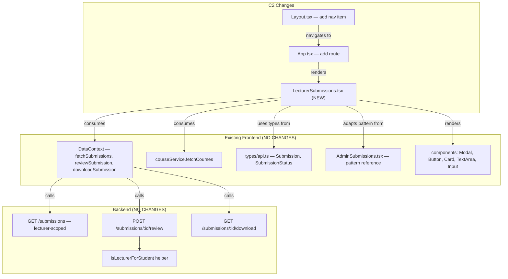
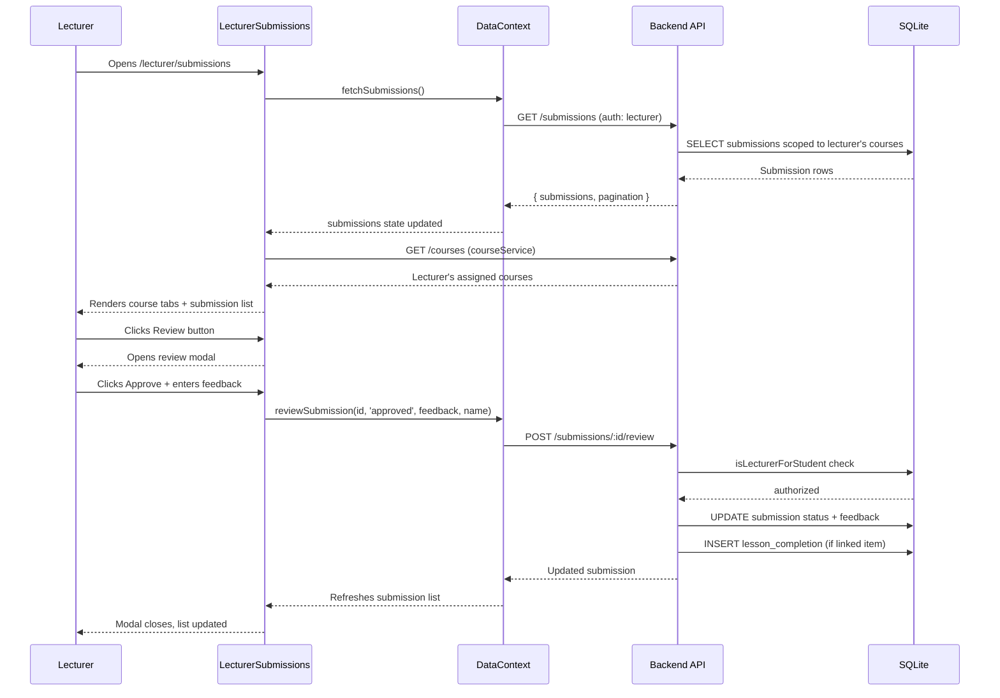
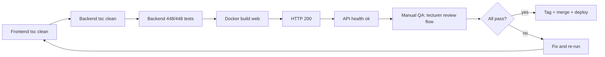

# Phase 8 C2 Design Spec: Lecturer Submission Review

**Date:** 2026-08-04
**Status:** SPEC READY
**Author:** Claude (Phase 8 C2)
**Baseline:** Phase 8 C1 complete (`phase8-c1-complete-2026-08-04`), 448/448 tests, tsc clean

---

## Problem Statement

Lecturers are assigned to courses and can view student progress (`LecturerCourseStudents.tsx`), but they **cannot review student submissions** from the frontend. The backend already supports lecturer submission review — `POST /submissions/:id/review` accepts lecturer role (scoped by `isLecturerForStudent()`), and `GET /submissions` auto-filters to the lecturer's assigned courses. This capability is unreachable because no lecturer-facing review UI exists.

Currently, submission review requires an admin. This bottleneck slows feedback to students and prevents lecturers from completing their core teaching workflow.

---

## Goals

1. **Unlock lecturer review workflow** — lecturers can approve/reject submissions with feedback
2. **Scope visibility** — lecturers see only submissions from students in their assigned courses (enforced by backend)
3. **Reuse existing infrastructure** — DataContext functions, backend endpoints, types, and UI patterns from AdminSubmissions
4. **Zero backend changes** — frontend-only feature

## Non-Goals

1. No backend code changes (endpoints, RBAC, DB schema — all exist)
2. No new API endpoints or types
3. No changes to AdminSubmissions.tsx (admin workflow is independent)
4. No bulk review (approve/reject multiple at once)
5. No submission creation by lecturers
6. No notification system changes (backend already sends `submission_reviewed` notification)
7. No file preview — download only (matching admin pattern)

---

## User Stories

### US-1: View submissions for my courses
> As a lecturer, I want to see all submissions from students in my assigned courses so I can identify work that needs review.

### US-2: Filter submissions by course
> As a lecturer, I want to filter submissions by course so I can focus on one class at a time.

### US-3: Review a submission (approve/reject)
> As a lecturer, I want to approve or reject a submission with feedback so the student gets timely evaluation.

### US-4: Download submitted files
> As a lecturer, I want to download submission files so I can review student work offline.

### US-5: Navigate to submissions from sidebar
> As a lecturer, I want a "Submissions" link in my sidebar so I can access the review page quickly.

---

## Functional Behavior

### Page: LecturerSubmissions

**URL:** `/lecturer/submissions`
**Access:** `lecturer` role only (ProtectedRoute)
**Layout:** Wrapped in `<Layout>` (standard app chrome with sidebar)

#### Data Loading

1. On mount, call `fetchSubmissions()` from DataContext — backend auto-scopes to lecturer's assigned courses
2. Load the lecturer's assigned courses via `courseService.fetchCourses()` for the course filter tabs
3. Show loading spinner while both calls resolve

#### Course Filter Tabs

- Display one tab per assigned course (pill buttons, matching AdminSubmissions pattern)
- Default: first course selected (NOT "all submissions" — lecturer scope is always course-bound)
- If lecturer has only 1 course, show it selected with no tab switching needed
- Filter submissions client-side by `courseId` matching the selected course tab

#### Submissions List

- For the selected course, show submissions grouped as a flat list (not grouped by member — simpler than admin)
- Each row shows: student name (avatar initials), title, description (truncated), file name + size, status badge, submitted date, action buttons
- Sort: newest first (backend default)
- Status badges: Pending (amber), Approved (green), Rejected (red) — reuse `StatusBadge` pattern from AdminSubmissions

#### Action Buttons Per Submission

| Button | Condition | Action |
|--------|-----------|--------|
| Review | Always | Opens review modal |
| Download | Always | Calls `downloadSubmission(id)` |

**No delete button.** Lecturers should not delete student work. Only admins and students (pending only) can delete.

#### Review Modal

Adapted from AdminSubmissions review modal (lines 413-451):

1. Shows: student name, submitted date, title, status badge, description, file info + download button
2. **Feedback textarea** — required for rejection, optional for approval
3. **Approve button** — calls `reviewSubmission(id, 'approved', feedback, user.name)`
4. **Reject button** — validates feedback is non-empty, then calls `reviewSubmission(id, 'rejected', feedback, user.name)`
5. **Cancel button** — closes modal
6. Shows existing review info if already reviewed (`reviewedBy`, `reviewedAt`)
7. Shows error message if review fails
8. Disables buttons while request is in-flight

#### Empty States

| Scenario | Display |
|----------|---------|
| No assigned courses | "No courses assigned yet." (icon + text, matching LecturerDashboard pattern) |
| No submissions for selected course | "No submissions for this course yet." (icon + text) |
| Loading | Centered spinner with "Loading..." text |

#### Error States

| Scenario | Display |
|----------|---------|
| Submissions fetch fails | Red error banner (matching existing error pattern) |
| Courses fetch fails | Red error banner |
| Review request fails (403) | Error in modal: "You do not have permission to review this submission" |
| Review request fails (network) | Error in modal: generic message from `getErrorMessage()` |
| Download fails | Alert dialog |

---

## Edge Cases

### EC-1: Lecturer with no assigned courses
- `courseService.fetchCourses()` returns empty array
- Show empty state: "No courses assigned yet."
- No course tabs, no submissions list

### EC-2: Submission already reviewed
- Review modal still opens (shows existing feedback, reviewer, date)
- Approve/Reject buttons still functional (allows re-review, backend permits this)
- Pre-fills feedback textarea with existing feedback

### EC-3: Lecturer assigned to course mid-session
- No live update needed — page refresh will pick up new course assignment
- Backend scoping is authoritative

### EC-4: Concurrent review (admin reviews while lecturer has modal open)
- Lecturer submits review → backend accepts (last writer wins for feedback)
- No conflict — acceptable behavior

### EC-5: Feedback required for rejection
- If lecturer clicks Reject with empty feedback, show inline error "Please provide feedback before rejecting."
- Do not send API request

### EC-6: Very long feedback text
- No client-side length limit (backend will enforce if needed)
- Textarea should be resizable

---

## Touched Files

### New Files (1)

| File | Lines (est.) | Purpose |
|------|-------------|---------|
| `LMS-Frontend/src/pages/LecturerSubmissions.tsx` | ~250 | Lecturer submission review page |

### Modified Files (2)

| File | Change |
|------|--------|
| `LMS-Frontend/src/App.tsx` | Add import + route for `/lecturer/submissions` |
| `LMS-Frontend/src/components/Layout.tsx` | Add "Submissions" nav item for lecturer role |

### Referenced (read-only, no changes)

| File | Purpose |
|------|---------|
| `LMS-Frontend/src/pages/AdminSubmissions.tsx` | Pattern reference for StatusBadge, review modal, course tabs |
| `LMS-Frontend/src/context/DataContext.tsx` | Provides `fetchSubmissions`, `reviewSubmission`, `downloadSubmission` |
| `LMS-Frontend/src/types/api.ts` | `Submission`, `SubmissionStatus`, `SubmissionQueryParams` types |
| `LMS-Frontend/src/services/courseService.ts` | `fetchCourses()` for course tabs |
| `LMS-Server/src/controllers/submissionsController.ts` | Backend reference (no changes) |
| `LMS-Server/src/routes/submissions.ts` | Backend reference (no changes) |

---

## Data Flow

### Submissions Loading

```
LecturerSubmissions mounts
  → useData().fetchSubmissions()
    → GET /api/v1/submissions (with auth token)
      → submissionsController.getSubmissions()
        → detects role=lecturer, scopes via EXISTS subquery on course_lecturers
        → returns only submissions from students in lecturer's assigned courses
  → courseService.fetchCourses()
    → GET /api/v1/courses (returns lecturer's assigned courses)
```

### Review Flow

```
Lecturer clicks Review on submission
  → Modal opens, pre-fills feedback if exists
Lecturer clicks Approve/Reject
  → useData().reviewSubmission(id, status, feedback, userName)
    → POST /api/v1/submissions/:id/review { status, feedback }
      → submissionsController.reviewSubmission()
        → isLecturerForStudent() check (403 if not authorized)
        → updates submission status, feedback, reviewed_by_id
        → auto-inserts lesson_completion if approved + linked to course item
        → sends submission_reviewed notification to student
    → DataContext refreshes submissions list
  → Modal closes
  → List updates with new status
```

---

## Mermaid Diagrams

### Dependency Map



### Review Data Flow



### Verification Gate Flow



---

## Acceptance Criteria

### AC-1: Page accessible and scoped
- [ ] `/lecturer/submissions` renders for lecturer role
- [ ] Non-lecturer roles cannot access (ProtectedRoute redirects)
- [ ] Only submissions from lecturer's assigned courses are visible

### AC-2: Course filter works
- [ ] Course tabs display all assigned courses
- [ ] Clicking a course tab filters the submission list
- [ ] Default selection is the first course

### AC-3: Review modal works
- [ ] Clicking Review opens the modal with submission details
- [ ] Approve sends `status: 'approved'` and closes modal
- [ ] Reject requires non-empty feedback, sends `status: 'rejected'`
- [ ] Feedback textarea pre-fills with existing feedback
- [ ] Buttons disabled during API call
- [ ] Error displayed in modal on failure

### AC-4: Download works
- [ ] Clicking Download triggers file download via `downloadSubmission()`
- [ ] Error shown on failure

### AC-5: Navigation
- [ ] "Submissions" appears in lecturer sidebar between "Dashboard" and "Messages"
- [ ] Active state highlights correctly

### AC-6: Empty/error states
- [ ] No courses → "No courses assigned yet."
- [ ] No submissions → "No submissions for this course yet."
- [ ] Fetch error → red error banner
- [ ] Loading → spinner

### AC-7: No regressions
- [ ] AdminSubmissions still works (no code changes)
- [ ] Student submission flow unaffected
- [ ] Backend tests 448/448 unchanged
- [ ] Frontend tsc clean

---

## Test Strategy

### Automated Tests

No new automated tests for C2. Frontend test infrastructure (vitest + RTL) is deferred to Phase 8 C3. Backend tests remain at 448/448 — no backend changes means no new backend tests needed.

### Regression Coverage

| Gate | Expected | Method |
|------|----------|--------|
| Frontend tsc | clean | `cd LMS-Frontend && npx tsc --noEmit` |
| Backend tsc | clean | `cd LMS-Server && npx tsc --noEmit` |
| Backend tests | 448/448 | `cd LMS-Server && npx vitest run` |
| Docker build web | exit 0 | `docker compose build web` |
| HTTP 200 | 200 | `curl -s -o /dev/null -w '%{http_code}' http://localhost` |
| API health | ok + db ok | `curl -s http://localhost/api/v1/health` |

### Manual QA Checklist

| # | Test | Expected |
|---|------|----------|
| 1 | Login as lecturer, click Submissions in sidebar | Page loads, shows course tabs |
| 2 | Verify only submissions from assigned courses appear | No submissions from other courses visible |
| 3 | Click a course tab | List filters to that course's submissions |
| 4 | Click Review on a pending submission | Modal opens with correct details |
| 5 | Enter feedback, click Approve | Modal closes, status changes to Approved |
| 6 | Open another pending submission, click Reject without feedback | Inline error shown |
| 7 | Enter feedback, click Reject | Modal closes, status changes to Rejected |
| 8 | Click Download on a submission | File downloads |
| 9 | Navigate to AdminSubmissions as admin | Admin page still works correctly |
| 10 | Login as student, verify cannot access `/lecturer/submissions` | Redirected away |

### Empty State / Edge Case Checks

| # | Scenario | Expected |
|---|----------|----------|
| 1 | Lecturer with no assigned courses | Empty state message |
| 2 | Assigned course with no submissions | Empty state message |
| 3 | All submissions already reviewed | List shows approved/rejected badges, Review still works |
| 4 | Network error during fetch | Error banner shown |
| 5 | Network error during review | Error shown in modal |

---

## Likely Failure Modes & Defensive Expectations

### FM-1: Lecturer seeing wrong submissions
- **Defense:** Backend `getSubmissions()` enforces course scoping via `EXISTS` subquery. Frontend does NOT filter — it trusts backend.
- **Verification:** Login as lecturer, compare visible submissions against database.

### FM-2: Review modal showing wrong submission data
- **Defense:** `reviewingSubmission` state is set per-click. Modal reads from this state object.
- **Verification:** Open multiple submissions sequentially, verify data matches.

### FM-3: 403 on legitimate review attempts
- **Defense:** `isLecturerForStudent()` checks `course_lecturers` table. If lecturer is assigned to the course, this always passes.
- **Possible cause:** Stale JWT without correct role. Fix: re-login.
- **Verification:** Review a submission from an assigned course — should succeed.

### FM-4: Feedback not persisting
- **Defense:** `reviewSubmission()` sends feedback in request body. Backend stores in `submissions.feedback` column.
- **Verification:** Review with feedback, refresh page, open same submission — feedback should show.

### FM-5: Regressions on admin submission review
- **Defense:** Zero changes to AdminSubmissions.tsx. DataContext functions are shared but stateless callbacks.
- **Verification:** Login as admin, review a submission — should work identically.

---

## Rollout & Compatibility Notes

- **Frontend-only change** — no database migrations, no backend changes
- **Zero downtime deploy:** `docker compose build web && docker compose up -d --no-deps web`
- **Rollback:** `git revert <commit>` + same deploy command
- **No data impact:** Page only reads and reviews submissions — no new data created
- **Feature flag:** None needed — page is behind ProtectedRoute (lecturer role only)

---

## Implementation Estimates

| Item | Est. Lines | Complexity |
|------|-----------|------------|
| `LecturerSubmissions.tsx` | ~250 | Medium — adapts AdminSubmissions pattern, simpler (no member grouping, no delete) |
| `App.tsx` route addition | ~10 | Trivial |
| `Layout.tsx` nav item | ~1 | Trivial |
| **Total** | ~261 | Low-Medium |

---

## Review Checklist

Before planning/implementation, verify:

- [x] **Scope correctness:** Frontend-only, no backend changes
- [x] **Route correctness:** `/lecturer/submissions` is free, no conflicts
- [x] **Data path correctness:** `GET /submissions` already scopes to lecturer; `POST /submissions/:id/review` already allows lecturer
- [x] **Type correctness:** `Submission`, `SubmissionQueryParams`, `ReviewSubmissionData` exist in `types/api.ts`
- [x] **DataContext correctness:** `fetchSubmissions`, `reviewSubmission`, `downloadSubmission` are available
- [x] **Nav correctness:** Layout.tsx lecturer nav array is the right place to add the item
- [x] **Acceptance criteria completeness:** 7 criteria covering page, filter, review, download, nav, empty states, regressions
- [x] **Test completeness:** 10 manual QA checks, 5 edge case checks, 6 automated gates
- [x] **Rollback safety:** Frontend-only, single commit revert
- [x] **No unresolved assumptions:** All backend behavior confirmed by code reading

---

## /loop Workflow

### /loop assess
- Read Phase 8 C1 closeout, confirm baseline (448/448, tsc clean)
- Read backend submission controller and routes to confirm lecturer support exists
- Read AdminSubmissions.tsx for review pattern
- Read Layout.tsx and App.tsx for routing/nav patterns
- Identify gap: backend ready, no frontend UI

### /loop spec
- Define user stories (5)
- Define functional behavior (page structure, data loading, course filter, review modal, empty/error states)
- Define edge cases (6)
- Define failure modes (5)
- Define touched files (1 new, 2 modified)
- Define acceptance criteria (7)
- Define test strategy (6 automated gates, 10 manual QA, 5 edge cases)

### /loop review
- Verify spec against codebase (all paths confirmed by grep/read)
- Verify no backend assumptions (all endpoint behavior confirmed)
- Verify no scope creep (no delete, no bulk, no new types)
- Check review checklist (all items passed)

### /loop plan
- Next step: invoke writing-plans skill to create implementation plan from this spec
- Plan should have ~5 tasks: branch setup, LecturerSubmissions.tsx, App.tsx route, Layout.tsx nav, verification gates
- Implementation is ~261 lines across 3 files

---

## To-Do Lists

### Spec Checklist
- [x] Problem statement written
- [x] Goals and non-goals defined
- [x] User stories (5)
- [x] Functional behavior detailed
- [x] Edge cases (6)
- [x] Failure modes (5)
- [x] Touched files identified (1 new, 2 modified)
- [x] Data flow documented
- [x] Mermaid diagrams (3)
- [x] Acceptance criteria (7)
- [x] Test strategy defined
- [x] Review checklist passed
- [x] Rollout notes written

### Feature Checklist (for implementation)
- [ ] Create `LecturerSubmissions.tsx` page
- [ ] Add course filter tabs
- [ ] Add submissions list with status badges
- [ ] Add review modal (approve/reject with feedback)
- [ ] Add download button
- [ ] Add empty states (no courses, no submissions)
- [ ] Add error handling (fetch errors, review errors)
- [ ] Add loading state
- [ ] Add route in `App.tsx`
- [ ] Add nav item in `Layout.tsx`

### Test Checklist (for verification)
- [ ] Frontend tsc clean
- [ ] Backend tsc clean
- [ ] Backend 448/448
- [ ] Docker build web
- [ ] HTTP 200
- [ ] API health ok
- [ ] Manual QA: 10 checks
- [ ] Edge cases: 5 checks

### QA Checklist (for release)
- [ ] Lecturer can view submissions page
- [ ] Course filter works
- [ ] Review approve works
- [ ] Review reject (with feedback requirement) works
- [ ] Download works
- [ ] Empty states display correctly
- [ ] Admin submissions page unaffected
- [ ] Student flow unaffected

### Risk Checklist
- [x] No backend changes — LOW risk
- [x] No database changes — ZERO data risk
- [x] No type changes — ZERO type-safety risk
- [x] DataContext shared functions — LOW regression risk (stateless callbacks)
- [x] Frontend-only rollback — instant revert possible

---

## PHASE 8 C2 SPEC STATUS: READY

This spec is complete and ready for implementation planning via the writing-plans skill.

**Next action:** Create implementation plan at `docs/superpowers/plans/2026-08-04-phase8-c2-implementation-plan.md`
