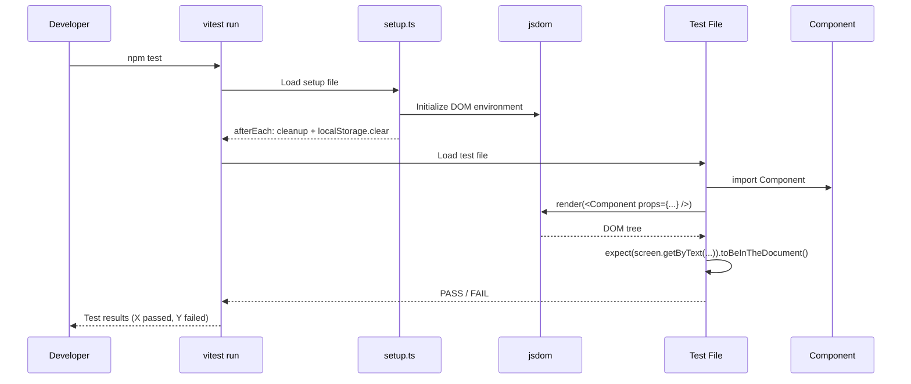
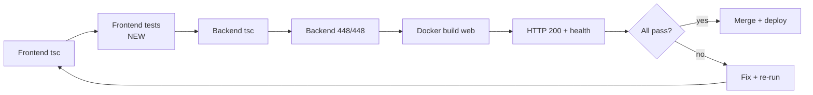

# Phase 9 C1 Design Spec: Frontend Test Setup (vitest + RTL)

**Date:** 2026-08-04
**Status:** SPEC READY
**Author:** Claude (Phase 9 C1)
**Baseline:** Phase 8 complete (`phase8-c2-complete-2026-08-04`), 448/448 backend tests, tsc clean, zero frontend tests

---

## Problem Statement

The LMS frontend has **zero test infrastructure**. No vitest, no @testing-library/react, no test files, no test configuration. Every frontend change since project inception — including the Phase 8 dashboard refactor (8 new components) and lecturer submissions page — ships without automated component-level verification.

The backend has 448 vitest tests with a mature setup pattern (`vitest.config.ts`, `setup.ts`, `beforeEach` hooks). The frontend has none. This asymmetry means:
- Regressions in component rendering are caught only by tsc (type errors) or manual QA
- Conditional rendering logic (status badges, empty states, localStorage interactions) is untested
- Refactoring requires manual verification of every affected view
- Future phases (C2: notifications, C3: quiz analytics) will add complexity without a safety net

---

## Goals

1. **Install and configure vitest + RTL** for React 18 component testing in the LMS frontend
2. **Write 3 example component tests** proving the setup works for the most common patterns:
   - Pure props → render (EngagementStats)
   - localStorage interaction (OnboardingChecklist)
   - Status-conditional rendering (StatusBadge helper in LecturerSubmissions)
3. **Establish test conventions** (file location, naming, mock patterns) that future tests follow
4. **Add a `test` script** to `package.json` so `npm test` runs frontend tests
5. **Keep test infrastructure isolated** from production build — devDependencies only, no Vite config pollution

## Non-Goals

1. No E2E tests (Playwright, Cypress — separate phase)
2. No backend test changes (448/448 remains as-is)
3. No production code changes (tests are additive)
4. No test coverage thresholds or CI enforcement (premature — establish convention first)
5. No snapshot tests (brittle with Tailwind classes)
6. No testing of pages that require full router/DataContext wiring (too complex for initial setup)
7. No mocking of API calls or network requests (components under test are props-driven)

---

## Scope

### In Scope
- Install `vitest`, `@testing-library/react`, `@testing-library/jest-dom`, `@testing-library/user-event`, `jsdom` as devDependencies
- Create `vitest.config.ts` for frontend (separate from vite.config.ts)
- Create `src/__tests__/setup.ts` with RTL cleanup and jest-dom matchers
- Write 3 component test files:
  - `src/__tests__/components/EngagementStats.test.tsx`
  - `src/__tests__/components/OnboardingChecklist.test.tsx`
  - `src/__tests__/components/StatusBadge.test.tsx`
- Add `"test": "vitest run"` script to `package.json`
- Update verification gate sequence to include `npm test` after tsc

### Out of Scope
- Testing pages (StudentDashboard, LecturerSubmissions — require router/context mocking)
- Testing context providers (DataContext, AuthContext — integration-level)
- Testing services (courseService, notificationService — API mocking)
- Coverage reports or thresholds
- CI/CD pipeline integration
- Any production code changes

---

## Testing Strategy

### Component Selection Rationale

The 3 test targets were chosen to demonstrate distinct testing patterns:

| Component | Pattern | Why |
|-----------|---------|-----|
| EngagementStats | **Props → render** | Zero side effects, pure computation + render. Proves vitest + RTL can render React components with Tailwind. |
| OnboardingChecklist | **Side effects (localStorage)** | Tests DOM interaction (click dismiss button) and browser API mocking (localStorage). Proves vitest jsdom environment works. |
| StatusBadge | **Conditional render** | Tiny helper (8 lines) with 3 branches (pending/approved/rejected). Proves pattern matching and text assertion work. |

### Test Specifications

#### Test 1: EngagementStats (`src/__tests__/components/EngagementStats.test.tsx`)

**Source:** `src/components/dashboard/EngagementStats.tsx` (97 lines)
**Props:** `{ submissions: Submission[], quizCompletions: QuizCompletion[] | null }`
**No context dependencies.** Pure props → useMemo → render.

| # | Test Case | Input | Expected |
|---|-----------|-------|----------|
| 1 | Empty submissions | `submissions: [], quizCompletions: null` | Renders "0" for uploads, pending, approved; "Take your first quiz" text |
| 2 | Mixed submission statuses | 1 pending + 2 approved + 1 rejected | "4" uploads, "1" pending, "2" approved, rejection warning visible |
| 3 | Null quiz completions | `quizCompletions: null` | Shows "Take your first quiz" prompt |
| 4 | Quiz completions with passes | 3 completions, 2 passed | Shows "2" passed and "3 attempts total" |
| 5 | Rejection warning visibility | 0 rejected | Warning NOT in document; 1+ rejected → warning visible |

**Mock data factory:**
```typescript
function makeSubmission(status: 'pending' | 'approved' | 'rejected'): Submission {
  return {
    id: crypto.randomUUID(),
    studentId: 'student-1',
    studentName: 'Test Student',
    title: 'Test Submission',
    description: 'Description',
    fileName: 'test.pdf',
    fileSize: 1024,
    fileUrl: '/files/test.pdf',
    status,
    submittedAt: new Date().toISOString(),
  };
}
```

#### Test 2: OnboardingChecklist (`src/__tests__/components/OnboardingChecklist.test.tsx`)

**Source:** `src/components/dashboard/OnboardingChecklist.tsx` (100 lines)
**Props:** `{ userId, walletConnected, enrolled, hasCompletedLesson, quizPassed, hasApplied }`
**Side effect:** reads/writes `localStorage` key `lms_checklist_dismissed_${userId}`

| # | Test Case | Input | Expected |
|---|-----------|-------|----------|
| 1 | All steps incomplete | All props false | Renders all 5 checklist items as incomplete |
| 2 | All steps complete | All props true | Shows completion message |
| 3 | Dismiss persists | Click dismiss button | `localStorage.setItem` called with key, component returns null |
| 4 | Previously dismissed | localStorage returns 'true' for key | Component returns null (not rendered) |
| 5 | Different userId | userId='A' dismissed, render with userId='B' | Component renders (separate localStorage keys) |

**localStorage mock:**
```typescript
beforeEach(() => {
  localStorage.clear();
});
```
vitest's jsdom provides a working `localStorage` — no need for manual stubbing.

#### Test 3: StatusBadge (`src/__tests__/components/StatusBadge.test.tsx`)

**Source:** StatusBadge is a local helper function inside `LecturerSubmissions.tsx` (lines 27-32). To test it, we'll extract it to a shared file or test the pattern inline.

**Decision:** Extract `StatusBadge` to `src/components/StatusBadge.tsx` — it's already duplicated in both `AdminSubmissions.tsx` (line 34) and `LecturerSubmissions.tsx` (line 27) with identical code. Extracting it:
- Removes duplication (DRY)
- Creates a testable unit
- Is the ONLY production code change in this phase (justified by deduplication)

| # | Test Case | Input | Expected |
|---|-----------|-------|----------|
| 1 | Pending status | `status="pending"` | Renders "Pending" text with Clock icon, yellow styling |
| 2 | Approved status | `status="approved"` | Renders "Approved" text with CheckCircle icon, green styling |
| 3 | Rejected status | `status="rejected"` | Renders "Rejected" text with XCircle icon, red styling |
| 4 | Unknown status | `status="unknown"` | Falls through to pending (default branch) |

---

## Configuration

### New Files (5 config + 3 tests = 8 total)

| File | Purpose | Est. Lines |
|------|---------|-----------|
| `vitest.config.ts` | Vitest configuration for frontend | ~20 |
| `src/__tests__/setup.ts` | RTL cleanup + jest-dom matchers | ~5 |
| `src/__tests__/components/EngagementStats.test.tsx` | Props → render tests | ~80 |
| `src/__tests__/components/OnboardingChecklist.test.tsx` | localStorage interaction tests | ~90 |
| `src/__tests__/components/StatusBadge.test.tsx` | Conditional render tests | ~40 |
| `src/components/StatusBadge.tsx` | Extracted shared component | ~12 |

### Modified Files (3)

| File | Change |
|------|--------|
| `package.json` | Add devDependencies + `test` script |
| `pages/AdminSubmissions.tsx` | Import StatusBadge from shared component |
| `pages/LecturerSubmissions.tsx` | Import StatusBadge from shared component |

### vitest.config.ts

```typescript
import { defineConfig } from 'vitest/config';
import react from '@vitejs/plugin-react';
import path from 'node:path';

export default defineConfig({
  plugins: [react()],
  resolve: {
    alias: { '@': path.resolve(__dirname, './src') },
  },
  test: {
    globals: true,
    environment: 'jsdom',
    include: ['src/__tests__/**/*.test.{ts,tsx}'],
    setupFiles: ['src/__tests__/setup.ts'],
  },
});
```

**Key decisions:**
- Separate file from `vite.config.ts` (keeps build config clean, matches backend pattern)
- `globals: true` — `describe`, `it`, `expect` available without import (matches backend convention)
- `environment: 'jsdom'` — provides DOM, localStorage, window for React rendering
- `@` alias replicated — imports in components use `@/` paths
- `react()` plugin required — JSX transform for test files

### src/__tests__/setup.ts

```typescript
import '@testing-library/jest-dom/vitest';
import { cleanup } from '@testing-library/react';
import { afterEach } from 'vitest';

afterEach(() => {
  cleanup();
  localStorage.clear();
});
```

### package.json changes

Add to `devDependencies`:
```json
{
  "vitest": "^3.2.1",
  "@testing-library/react": "^16.3.0",
  "@testing-library/jest-dom": "^6.6.3",
  "@testing-library/user-event": "^14.6.1",
  "jsdom": "^26.1.0"
}
```

Add to `scripts`:
```json
{
  "test": "vitest run"
}
```

**Version rationale:**
- `vitest ^3.2.1` — latest stable, compatible with Vite 5
- `@testing-library/react ^16.3.0` — latest for React 18
- `@testing-library/jest-dom ^6.6.3` — latest, vitest-native matchers
- `@testing-library/user-event ^14.6.1` — latest, async user interaction simulation
- `jsdom ^26.1.0` — latest, full DOM implementation

---

## StatusBadge Extraction

The `StatusBadge` helper is duplicated identically in:
- `AdminSubmissions.tsx` lines 34-38
- `LecturerSubmissions.tsx` lines 27-31

Extract to `src/components/StatusBadge.tsx`:

```typescript
import React from 'react';
import { CheckCircle, XCircle, Clock } from 'lucide-react';

export function StatusBadge({ status }: { status: string }) {
  const base = 'inline-flex items-center px-2.5 py-0.5 rounded-full text-xs font-medium';
  if (status === 'approved') return <span className={`${base} bg-green-100 text-green-800`}><CheckCircle className="h-3 w-3 mr-1" />Approved</span>;
  if (status === 'rejected') return <span className={`${base} bg-red-100 text-red-800`}><XCircle className="h-3 w-3 mr-1" />Rejected</span>;
  return <span className={`${base} bg-yellow-100 text-yellow-800`}><Clock className="h-3 w-3 mr-1" />Pending</span>;
}
```

Then update imports in both pages:
- `AdminSubmissions.tsx`: remove local `StatusBadge`, add `import { StatusBadge } from '../components/StatusBadge';`
- `LecturerSubmissions.tsx`: remove local `StatusBadge`, add `import { StatusBadge } from '../components/StatusBadge';`

---

## Edge Cases

### EC-1: Tailwind classes in test environment
- jsdom does not process CSS. Tailwind class names render as strings but have no visual effect.
- Tests should assert on text content and DOM structure, NOT on computed styles.
- This is expected and correct for component tests.

### EC-2: Path alias resolution in tests
- `@/` alias must be configured in `vitest.config.ts` via `resolve.alias` (matching vite.config.ts).
- If components import from `@/context/useAuth`, vitest must resolve it.

### EC-3: Lucide React icons in jsdom
- Icon components render as SVG elements in jsdom. They don't need special handling.
- Tests should use `aria-hidden` or text content, not icon rendering, for assertions.

### EC-4: React 18 `act()` warnings
- RTL's `render()` handles `act()` wrapping automatically.
- `userEvent` from `@testing-library/user-event` is async and handles act() properly.
- If warnings appear, wrap state-triggering actions in `await act(async () => { ... })`.

### EC-5: localStorage in jsdom
- jsdom provides a working `localStorage` implementation.
- `localStorage.clear()` in `afterEach` prevents state leakage between tests.
- No manual mocking needed.

---

## Failure Modes & Defensive Expectations

### FM-1: vitest config conflicts with Vite build
- **Defense:** Separate `vitest.config.ts` file (not inlined in vite.config.ts). Build and test configs are independent.
- **Verification:** `npm run build` still works after adding vitest config.

### FM-2: jsdom missing browser APIs
- **Defense:** jsdom provides DOM, localStorage, window, document. For our 3 test targets, no exotic browser APIs are needed.
- **Verification:** All 3 test files run without `ReferenceError`.

### FM-3: Import resolution failures in test
- **Defense:** `@` alias replicated in vitest.config.ts. Component-relative imports (`../components/Card`) work natively.
- **Verification:** Tests import target components without errors.

### FM-4: Test deps pollute production bundle
- **Defense:** All test packages are `devDependencies`. Vite tree-shakes and only bundles `dependencies` in production build.
- **Verification:** `docker compose build web` produces same-size bundle.

### FM-5: Tests pass but catch nothing useful
- **Defense:** Tests assert on specific text content, DOM presence/absence, and localStorage calls — not implementation details.
- **Verification:** Intentionally break a component (e.g., change "Approved" to "OK") and confirm test fails.

---

## Mermaid Diagrams

### Test Infrastructure Dependency Map

```mermaid
graph TD
    subgraph "New Test Infrastructure"
        VC[vitest.config.ts]
        SF[src/__tests__/setup.ts]
        T1[EngagementStats.test.tsx]
        T2[OnboardingChecklist.test.tsx]
        T3[StatusBadge.test.tsx]
    end

    subgraph "New Shared Component"
        SB[src/components/StatusBadge.tsx]
    end

    subgraph "Existing Components Under Test"
        ES[EngagementStats.tsx]
        OC[OnboardingChecklist.tsx]
    end

    subgraph "Modified Files"
        PJ[package.json — devDeps + script]
        AS[AdminSubmissions.tsx — import StatusBadge]
        LS[LecturerSubmissions.tsx — import StatusBadge]
    end

    subgraph "Dependencies (npm install)"
        V[vitest]
        RTL[@testing-library/react]
        JD[@testing-library/jest-dom]
        UE[@testing-library/user-event]
        JS[jsdom]
    end

    VC --> V
    SF --> RTL
    SF --> JD
    T1 --> ES
    T1 --> RTL
    T2 --> OC
    T2 --> RTL
    T2 --> UE
    T3 --> SB
    T3 --> RTL
    SB --> AS
    SB --> LS
    PJ --> V
    PJ --> RTL
    PJ --> JD
    PJ --> UE
    PJ --> JS
```

### Test Execution Data Flow



### Verification Gate Flow (Updated for Phase 9)



---

## Acceptance Criteria

### AC-1: Test infrastructure installed and configured
- [ ] `vitest`, `@testing-library/react`, `@testing-library/jest-dom`, `@testing-library/user-event`, `jsdom` in devDependencies
- [ ] `vitest.config.ts` exists with jsdom environment, globals, setup file, `@` alias
- [ ] `src/__tests__/setup.ts` exists with cleanup and jest-dom matchers
- [ ] `npm test` (or `npx vitest run`) exits 0 with all tests passing

### AC-2: EngagementStats tests pass
- [ ] 5 test cases covering empty state, mixed statuses, null quizzes, quiz passes, rejection warning
- [ ] No context mocking needed (pure props component)

### AC-3: OnboardingChecklist tests pass
- [ ] 5 test cases covering incomplete steps, complete steps, dismiss, previously dismissed, different userId
- [ ] localStorage interactions tested correctly

### AC-4: StatusBadge tests pass
- [ ] 4 test cases covering pending, approved, rejected, unknown status
- [ ] StatusBadge extracted to shared component
- [ ] AdminSubmissions and LecturerSubmissions import from shared component

### AC-5: No regressions
- [ ] Frontend tsc clean
- [ ] Backend tsc clean
- [ ] Backend 448/448 unchanged
- [ ] Docker build web succeeds
- [ ] HTTP 200 + API health ok
- [ ] `npm run build` (Vite production build) still works

### AC-6: Conventions established
- [ ] Tests live in `src/__tests__/components/`
- [ ] Test files named `ComponentName.test.tsx`
- [ ] Mock data factories used (not inline objects)
- [ ] `globals: true` — no vitest imports needed in test files

---

## Rollout & Compatibility Notes

- **Additive change** — no existing functionality removed or modified (except StatusBadge dedup)
- **devDependencies only** — test packages don't affect production bundle
- **Separate vitest.config.ts** — doesn't pollute Vite build config
- **Zero downtime deploy** — `docker compose build web && docker compose up -d --no-deps web`
- **Rollback:** `git revert <commit>` + same deploy command
- **StatusBadge extraction** is the only production code change — it's a deduplication, not a behavior change

---

## Implementation Estimates

| Item | Est. Lines | Complexity |
|------|-----------|------------|
| `vitest.config.ts` | ~20 | Trivial |
| `src/__tests__/setup.ts` | ~5 | Trivial |
| `src/components/StatusBadge.tsx` | ~12 | Trivial (extraction) |
| `EngagementStats.test.tsx` | ~80 | Low |
| `OnboardingChecklist.test.tsx` | ~90 | Low |
| `StatusBadge.test.tsx` | ~40 | Trivial |
| `package.json` changes | ~10 | Trivial |
| `AdminSubmissions.tsx` import change | ~2 | Trivial |
| `LecturerSubmissions.tsx` import change | ~2 | Trivial |
| **Total** | ~261 | Low |

---

## Review Checklist

Before planning/implementation, verify:

- [x] **Scope correctness:** Additive test infrastructure, no production behavior changes (except StatusBadge dedup)
- [x] **Config correctness:** vitest.config.ts mirrors vite.config.ts alias, uses jsdom, matches backend pattern
- [x] **Package correctness:** All 5 packages are devDependencies with compatible versions
- [x] **Test target correctness:** 3 components chosen for distinct patterns (props, localStorage, conditional)
- [x] **Convention correctness:** File paths, naming, mock patterns documented
- [x] **Acceptance criteria completeness:** 6 criteria covering install, 3 test suites, regressions, conventions
- [x] **Rollback safety:** Additive only, git revert removes all test infrastructure
- [x] **No unresolved assumptions:** All versions, configs, and interfaces confirmed by code reading

---

## To-Do Lists

### Spec Checklist
- [x] Problem statement written
- [x] Goals and non-goals defined
- [x] Testing strategy detailed
- [x] Config boundaries specified
- [x] Edge cases (5) identified
- [x] Failure modes (5) documented
- [x] Touched files identified (8 new, 3 modified)
- [x] StatusBadge extraction justified
- [x] Mermaid diagrams (3) included
- [x] Acceptance criteria (6) defined
- [x] Review checklist passed
- [x] Rollout notes written

### Config Checklist (for implementation)
- [ ] Install 5 devDependencies
- [ ] Create vitest.config.ts with jsdom + globals + alias
- [ ] Create src/__tests__/setup.ts with cleanup
- [ ] Add "test" script to package.json
- [ ] Verify npm test runs (even with 0 tests)

### Test Checklist (for implementation)
- [ ] EngagementStats: 5 test cases
- [ ] OnboardingChecklist: 5 test cases
- [ ] StatusBadge: 4 test cases
- [ ] All tests pass with npx vitest run
- [ ] Tests fail correctly when component is broken (mutation check)

### QA Checklist (for release)
- [ ] Frontend tsc clean
- [ ] Frontend tests pass (14 total)
- [ ] Backend tsc clean
- [ ] Backend 448/448 unchanged
- [ ] Docker build web succeeds
- [ ] npm run build succeeds (Vite production build)
- [ ] HTTP 200 + API health ok

### Risk Checklist
- [x] vitest + Vite 5 compatibility — confirmed (vitest 3.x supports Vite 5)
- [x] jsdom + React 18 — confirmed (RTL 16.x + jsdom 26.x)
- [x] Path alias resolution — replicated in vitest.config.ts
- [x] devDependencies isolation — no production bundle impact
- [x] StatusBadge extraction — identical code, behavior-preserving dedup

---

## /loop Workflow

### /loop assess
- Phase 8 complete (C1 + C2), zero frontend tests
- Backend has 448 vitest tests — proven pattern to follow
- Frontend has React 18.2, Vite 5.0, TypeScript 5.2
- 3 test targets selected: EngagementStats, OnboardingChecklist, StatusBadge

### /loop spec
- Config: vitest.config.ts + setup.ts + package.json
- Tests: 3 files, 14 test cases total
- Production change: StatusBadge extraction (dedup only)
- Conventions: file location, naming, mock patterns

### /loop review
- Spec matches codebase reality (all versions/configs confirmed)
- No scope creep (no E2E, no page tests, no coverage thresholds)
- Risk profile is LOW (additive, devDependencies only)
- Review checklist: all items passed

### /loop plan
- Next step: create implementation plan from this spec
- Plan should have ~6 tasks: branch, install deps, config, StatusBadge extraction, 3 test files, verification
- Implementation is ~261 lines across 11 files (8 new, 3 modified)

---

## PHASE 9 C1 SPEC STATUS: READY

This spec is complete and ready for implementation planning via the writing-plans skill.

**Next action:** Create implementation plan at `docs/superpowers/plans/2026-08-04-phase9-c1-implementation-plan.md`
